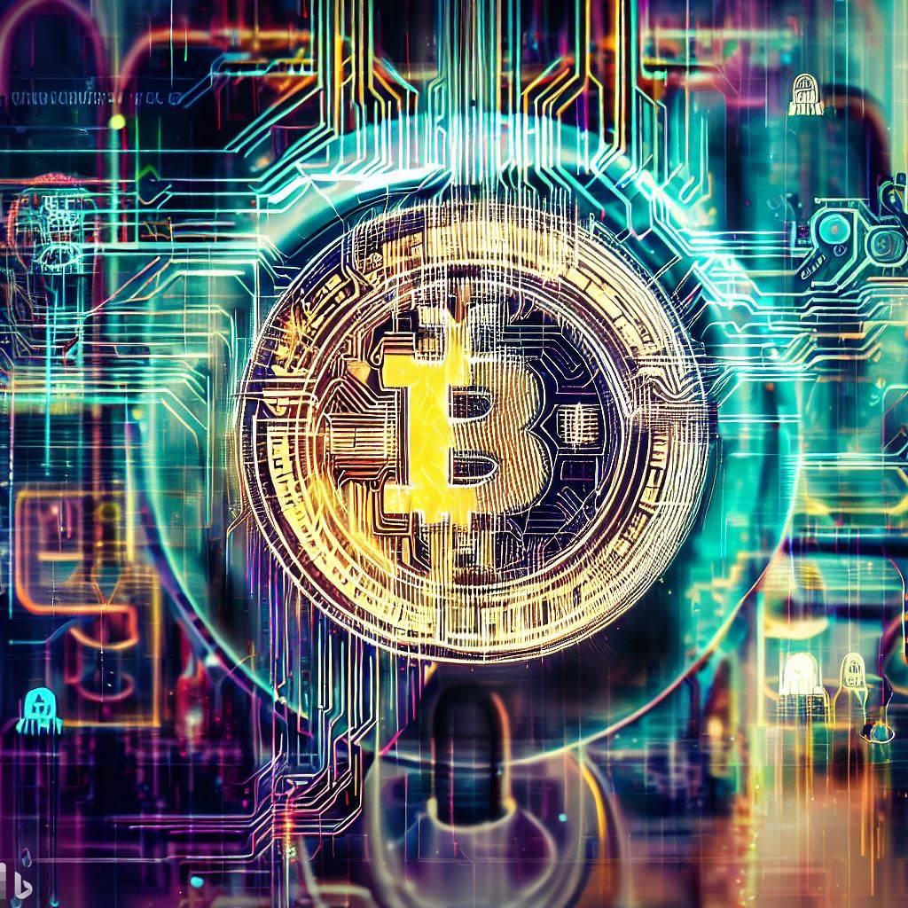

要是说起这个，那得从比特币之前说起。

如果你还不了解比特币，可以先看看[这个](比特币.md)。

 

比特币是完全虚拟的。没有任何实际价值，亦不能创造任何价值，只是一种虚拟币，人们为什么疯狂送钱购买比特币？不妨再深入一下，为什么会有比特币这种东西？

比特币是在 2008 年金融危机的背景下诞生的。金融危机波及全球，哪个国家都不能独善其身，法币变得不再可靠。想象一下这背后的关系，政府以国家信誉为背书，发行法定货币。但世界并不总是安宁稳定的，战争、自然灾害、金融危机都会对社会造成影响，这又会影响经济。

 

关于战争：社会依赖政府，政府掌握军队，军队维护社会，经过循环，组成国家。国家哪来的钱支持军队，纳税。而国家之间的冲突，如果收益大于成本，那就可能发生战争。全民纳税出钱支持军队发起战争。大炮一响，黄金万两。有国获利，有国赔钱。

关于金融：这世界上大部分国家：欧洲、北美等等，都有经济周期。小周期组成大周期，像正弦函数一样。周期性的金融危机是一把剑，悬在头顶，只能祈祷：达摩克里斯饶了我吧。

关于自然：自然灾害难以预测。虽然随着科技的发展，天灾对人类的冲击越来越小。病毒、洪水、火山。但未来几十年仍有不少威胁。这时经济自然要受连累。

 

既然怎么都要影响经济，那能不能找一种不影响经济的东西呢。害，经济不就是钱嘛！只要找到一种不贬值的钱就行了。不用抵抗所有危机，直到人类毁灭这钱还在；只要这种钱能抵御一部分天灾人祸就 ok 的。钱呀，求求你，别让地球一端的金融危机影响到地球另一端人们的正常生活。

 

我靠。还真有这种神奇东西。

这种钱源自一种 “ 无政府主义 ” 思想。前面的 b-money 就体现了这种思想。

 “ 无政府主义 ” 的基本立场是反对包括政府在内的一切统治和权威，提倡个体之间的自助关系，关注个体的自由和平等。对无政府主义者而言，“ 无政府 ” 一词并不代表混乱、虚无、或道德沦丧的无政府状态，而是一种由自由的个体自愿结合，以建立互助、自治、反独裁主义的和谐社会，是无政府而有权威的自治体系。他们认为根源在于 “ 政府 ” ，在于现在这种自上而下的金字塔结构。层层管理的模式不仅有不作为、贪腐、浪费的问题，更重要的是，总有一个组织在上面管理大家、维护秩序，容易因大的利益争端引发战乱。

 

- 进一步分析，你看原始社会就很和平呀，人们自发以大家庭的形式聚居，一起打猎、合作。没有所谓政府和国家，只有小规模的财富积累和劳动分工，也没有法律和警察。因为原始社会没有私人财富，大家都是一块会跑会跳的肉，光溜溜的。

- 后来，有了私人财富便有了暴力。原因很简单，因为可以获利嘛 ~ 通过暴力掠夺财富，有利可图就有 “ 勇夫 ” 干。

- 之后，当出现大量 “ 获利 ” 组织时，就会有人站出来保护大家。出现防止暴力的暴力组织 —— 军队。大家每人交一点钱（纳税）就可以获得保护。人们为了更高效的提供保护服务，形成了政府。大家把钱存进银行，因为银行可以提供保护：金库、保险箱、保安、警察等等。这个体系依赖政府运作，银行、警察，要么接受政府监管，要么是政府组建的。我的钱不带在身上，在银行里，嘿嘿你抢不着。

- 这样一来，两个大组织（政府）就会因集体利益的冲突，展开更大规模的战争，如果收益大于发动战争的成本。再招募更多军队来保护集体财产 ...... 暴力冲突越来越大，和平在哪里？核威慑。

到了 21 世纪，人们的财产，包括社交、娱乐逐步转移到互联网。所以保护人们财产的保护组织也迁移到了网上：网上银行、支付宝。

没事，钱放我们这，嘿嘿。交点手续费就行，嘿嘿。又是保护组织帮大家保管，丢了钱找平台解决！战争也变为网络攻防战，保护组织和黑客打的有来有回，拼命保住大家的钱。

以前保护组织只提供物理保护，并不会在你家里驻军把守。可是在网上就不一样了，你的数据被一股脑的传进服务器里。我的数据也是我的资产啊！数据里包含隐私、财产，你今天买了什么东西，喜欢和谁聊天，喜欢看什么，晚上想吃什么 ...... 对能通过数据分析出来。这相当于 “ 网络军队 ” 在你家里驻扎了，天天监视你的一举一动。而且数据怎么处理，人家说了算。因为保护组织控制着服务器，人家觉得不好、对某人不利就直接删掉，不用你同意。

 

可不可以把 “ 金字塔 ” 压扁，构建一种完全不依赖保护组织的 “ 个人主权 ” 体系，每个人代表平等、独立的个体？

可以的。有一种方法可以让你自己安全的持有自己私人财产。不需要银行保护你的财富、不需要保险箱保护、不需要保护组织，你自己保管即可。

那自己一个人怎么保护财产呢？答案是用现代密码学通过数学保护！

**炸弹可以炸开保险箱，但是不可能炸开密码学！**

比特币就是这种钱！自己生成一个私钥，只要私钥不泄露，别人谁都没法抢走你的比特币。收发比特币都是脱离第三方中心化平台（银行）进行点对点转账。当然，如果私钥丢了，比特币也就永远找不回来了。

自己的私钥，掌握自己的数据，不依赖第三方，完美。

 

当然，加密货币并不是中本聪自己的想法。

戴维（Wei Dai）所说的 Tim May 就是 Timothy May ，那个在 1992 年的加州湾区和 Eric Hughes 以及 John Gilmore 共同发起成立密码学研究小组的三人之一。在第一次聚会上，加密朋克（Cypherpunk）这个单词诞生了，取了密码学（cipher）和赛博朋克（cyberpunk）的词根拼合而成。

他们在密码学和算法中发现了解决互联网太过中心化的潜在解决方案。密码学家们认为，如果要减少政府和公司的权力，得需要新技术、更好的计算机和更多的密码学机制。然而他们的计划遇到了一道似乎不可逾越的障碍：到最后，他们所有的项目都需要资金支持，而政府和银行控制着这些钱。如果他们要实现自己的计划，就需要一种不受政府控制的货币形式。于是，加密货币的大竞赛开始了。但是结果适得其反。最初的各种努力都失败了，包括传奇密码学家大卫 · 乔姆的 ECash ，还有比如 Hashcash 和 Bit Gold 各种各样的加密货币。

 

戴伟是一位华裔计算机工程师，华盛顿大学的校友，他 20 世纪 90 年代末和 21 世纪初曾在微软的密码学研究组工作。在微软工作期间，他参与研究，设计和实现密码学系统。之前他是马萨诸塞州 TerraSciences 的程序员。

1998 年，他在个人网站 weidai.com 上发布了一篇名为 “ B-money ，一个匿名的分布式电子现金系统 ” 的非正式白皮书。他因对密码学和加密货币的贡献而闻名，他开发了 Crypto++ 密码库，创建了 B-Money 加密货币系统，并共同提出了 VMAC 消息认证码算法。戴伟在区块链和数字货币领域的开拓性工作，为后来的比特币技术奠定了基石，具有里程碑意义。

 

1998 年 11 月，刚刚大学毕业的他在社区提出 B-money 想法：“ 有效的合作需要一种交换媒介（金钱）和一种确保合同执行的方法。本文中，我描述了一种协议，通过这些协议使得不可追踪的匿名参与者可以更高效的彼此合作 … ，我希望这个协议能够推动加密学无政府主义在理论上以及时间上向前迈进。” B-money 的设计目标是是一个匿名，分布式电子现金系统。

在 Cyberpunks 社区看来，这种方式的问题在于政府能够通过政策管理来控制金钱的流动，同时要使用这些机构服务（银行或支付宝）需要暴露身份，于是 Dai 提供了两个替代方案（工作量证明和分布式记账）。

> 1.工作量证明创造金钱，任何人都可以通过计算一些数学难题，算出答案的人可以广播到全网，每个网络节点验证之后，都在自己的账本上给这个人的账户上添加或销毁工作量等价值的加密货币。
>
> 2.分布式记账追踪交易，发送方和接收方都没有真实姓名，都只是公钥。发送方用私钥签名，然后广播交易到全网。每一笔新的交易产生，每个人都更新他们手里的账本，使得没有任何人能够阻止交易，保证所有用户的隐私安全。
>
> 3.交易通过合约来执行，在 B-money 中，交易是通过合约（Contract）来实现的，每一个合约都需要有仲裁人（第三方）参与，Dai 为此设计了复杂的奖惩机制以防止作弊。

我们可以看到与比特币之间的关联，通过 POW 工作量证明来创造金钱，并把记账的工作分配到一个点对点的网络上，所有交易必须通过合约来执行。但是 Dai 认为他第一个版本的方案无法真正应用到实践中来，“ 因为它需要一个很大的即时同步、防干扰的匿名广播通道。” 换句话说，第一个方案并不能解决双重花费（双花）的问题，而比特币是通过激励解决拜占庭将军问题的。

Dai 随后在 Cyberpunks 社区中解释：“ B-money 还不是一个完整的可行的方案，我认为 B-money 最多可以为那些不想或者不能用政府发行的货币或者合约强制执行机制的人提供一个替代解决方案。” B-money 的许多问题一直未得到解决，或者至少是没有被指出。也许最重要的是，它的共识模型并不非常稳健，Dai 在提出 B-money 之后并没有再继续试图解决这些问题，他去了 TerraSciences 和微软工作。

 

但他的提案并没有被人忘记，比特币白皮书的第一条参考文献就是 B-money，在比特币白皮书发表前不久，Hashcash 的 Adam Back 建议中本聪去读一读 B-money ，Dai 是为数不多中本聪亲自联系过的人之一。但是 Dai 并没有回复中本聪的邮件，后来回想起时他表示很后悔。

他在 LessWrong 上写道 “ 这可能有一部分是我的错，因为中本聪给我发邮件询问我对他的稿件的看法时，我没有回复他。不然我可能能够成功劝说他不要用固定货币发行量这个想法。” 

B-money 是加密朋克社区对研发数字世界中的独立自主的货币的又一次探索。为纪念他，有两种加密货币分别命名为 “ Dai ” 和 “ Wei ” ，其中 Wei 是 2013 年 V神 命名的以太坊最小单位。

 

不过随着每次新的尝试和每次新的失败，“ 加密朋克 ” 都对他们所面临的困难有了更多了解。也因此，有了前人大量的尝试探索，中本聪借鉴改进了先辈们遇到的问题，并在 2008 年 10 月 31 日推出了比特币。

正如中本聪在他关于这个问题的第一封电子邮件中所说的那样，“ 我一直在研究一个新的电子现金系统，这完全是点对点的，不需要任何可信的第三方 ” 。他认为自己的核心贡献在于：创造了一种由用户管理和维护的虚拟货币；政府和企业对货币的运行几乎没有发言权；这将是一个完全去中心化的系统，由用户来运行。

 

中本聪非常清楚加密货币不光彩的历史。在 2009 年 2 月发布比特币后不久的一篇文章中，中本聪提到了乔姆的工作，但将比特币与乔姆的工作进行区分。很多人想当然地把电子货币当成了一个失败的事业，因为自 20 世纪 90 年代以来，所有的公司都失败了。在我看来，那些数字货币的失败因其系统仍未去中心化。我认为，比特币是我们首次尝试搭建一个去中心化的、不以信任为基础的虚拟货币系统。

为了确保参与者之间的信任，中本聪设计了一种公链，允许人们进入并检查以确保他们的钱仍然存在。为了保护隐私，比特币使用了一种加密的私钥系统，该系统允许用户在不公开身份的情况下告诉其他人自己的账户。为了激励用户维护系统，比特币引入了挖矿的概念，在该概念中，用户可以创建新的交易区块，并通过使用新铸造的比特币获得回报。为了防止黑客入侵，区块与之前的区块进行了加密链接，使得交易的历史记录实际上是不可更改的。比特币真正的创新，都在于这一货币系统是完全去中心化的，也就是没有最终决策者或权威机构来决定争端或决定货币的发展方向，而是用户作为一个集体共同决定比特币的未来。

 

加密朋克对这些威胁保持警惕，他们试图通过创建一套确保隐私的程序和方法来削弱政府和企业的监控能力，这些手段包括强大的密码学、安全的电子邮件和加密货币。他们的最终目标是在互联网上分散决策。加密朋克并没有将权力集中在少数人手中，而是寻求将权力分配给大众，让大家一起决定整个系统应该如何运行。

在加密朋克们看来，互联网时代的主要问题是，政府和公司变得过于强大，以至于对个人的隐私权构成了严重威胁。此外，美国政府和企业滥用它们的权力和地位，向消费者收取过多的费用和沉重的税收。答案在于权力去中心化 —— 将权力和决策权从少数人分散到多数人手中。但在比特币出现之前，人们并不清楚如何才能做到这一点，而中本聪提供了解决方案。

难道比特币是绝对安全的吗？当然不是，如果你想抢某个人的比特币，把刀架他脖子上，让他交出私钥即可。谁有私钥就是谁的比特币，加密算法只认私钥。这就是去中心化的魅力。**我们为什么相信比特币，不是因为中本聪不会抛售他的巨量比特币，而是因为我们相信个人主权和密码学。**

 

人们会说，中本聪发明比特币的时候,根本预料不到后果会这么惊人。当然，在某种程度上，他确实不可能预料到 “ 比特币披萨 ” 、“ 丝绸之路 ” 、Mt.Gox 或者 2017 年疯狂的牛市。

不过，中本聪对这项技术的发展方向有着惊人的眼光。比如，他写道，虽然区块链技术解决不了互联网上的隐私问题，但如果成功的话，用户将 “ 在军备竞赛中赢得一场重大战役，并在未来几年里获得新的自由领域 ” 。他也预见到区块链技术很难被关掉。就像他写的，“ 政府擅长砍掉像 Napster 这样的中央控制网络的脑袋，但像 Gnutella 和 Tor 这样的纯点对点网络似乎保持着自己的优势 ” 他还看出区块链本身是个灵活的技术，可以被用户开发出无限的应用，“ 一旦启动，只要你不费力气地向网站支付几分钱，就像在自动售货机中投币一样容易，立刻会出现许多应用程序。” 

同时，中本聪也对自己给世界带来的后果感到担忧。他担心政府会如何对付他的虚拟货币。当区块链用户推动维基解密使用比特币躲避政府制裁后，中本聪强烈反对，他说：“ 你们的做法很可能会在现阶段摧毁我们。 ” 他还担心超级矿工的出现，他写道：“ 我们应该有一个君子协定，为了网络的利益，尽可能地推迟 GPU 军备竞赛。” 他最担心的可能是网络安全。在详细说明对虚拟货币的改进后，他在最后的公开信息中总结道：“ 攻击的方式仍然比我能计算的还要多。” 

 

围绕中本聪的神秘感只会增加人们对他和他的技术的好奇心。虽然记者们千方百计想揭开他的神秘面纱，但我们可能永远也不知道他是谁。中本聪就像半夜的星辰，永远闪烁在我们的视线里，却可望不可及。 **这很朋克，也很有诗意。比特币的发明人拒绝成为他发明的中心。** 区块链技术是一种把可信的中间人从我们生活中移除，把权力下放给每个人的技术。他拒绝成为人们关注的焦点。区块链的成败必须依靠它自己的优点 —— 依靠技术本身的特征，以及用户为使其发挥作用所付出的努力。

 

中本聪的点子也许挺新颖，但比特币的崛起也并非必然。比特币是在 2008 年金融危机的背景下诞生的。金融危机波及全球，哪个国家都不能独善其身，法币变得不再可靠。中本聪和他的支持者在早期经常一而再再而三地求来求去，才说服别人信比特币。他们经常说的一句话是：你想象一下，如果比特币成为世界货币，会发生什么。想象一下，到时候每个比特币会值多少钱！而你只要下载软件并在家里的电脑上运行，就能赚到几百枚。当然，大多数人都在中本聪孜孜不倦的努力下，相信了这是传销骗局。

但也不影响最终还是有一些技术极客对比特币产生了兴趣，中本聪的努力得到了回报，人们开始在现实世界中使用和接受比特币。然后在 2010 年 5 月 22 日，程序员拉斯洛 · 汉耶克花 1 万个比特币买了 2 盒披萨。

于是，整个互联网世界开始发生的根本性的变化：一旦人们开始在现实世界中使用比特币，一个围绕比特币的生态系统就出现了。比如 Mt.Gox 、Binance 、Coinbase 这样的加密货币交易所应运而生，让人们更容易购买和出售这种货币。为了处理货币背后困难的数学问题，专业矿工开始在世界各地建立矿场。芯片制造商开始制造专门的芯片。

人们对比特币的兴趣激增刺激了比特币和加密货币市场的发展。比特币价值开始的狂飙。在 2010 年，比特币还不到 1 美分。到 2021 年年中就涨到 60000 美元了。这种疯狂的飙升让很多外行人将它与历史上的泡沫相提并论，比如 17 世纪的郁金香热和 18 世纪的南海泡沫。人们对比特币价格崩溃的担忧开始蔓延。其次，竞争性加密货币的出现。

看到了比特币的成功，一些有计算机知识的企业家先后推出了基于区块链的加密货币。例如莱特币、狗狗币（Doge Coin）、以太坊。以太坊在比特币的基础上建立了新型计算机，运行在世界各地的去中心化虚拟计算机。无法篡改，无法被政府关掉，亦不受政府控制，全球各个地区、各个种族、生活习惯不同的人们，一起组成的网络。除非联合国停掉地球上的互联网，只要互联网不停，这种去中心化组织就会一直存在。2017 年，首次代币发行（ICO，即个人或团体通过出售加密货币或 “ 代币 ” 来筹集资金）迅速走红。但是，其中大部分都惨遭失败。大约有一半的首次代币发行在一年内倒闭了。尽管虚拟货币引起媒体广泛的关注。

 

但是几乎所有的电子设备都能加入的网络速度实在太慢。你想想，早期随便一台电脑就能加入比特币网络挖矿，但是现在随着挖比特币的人越来越多、哈希难度上升，人们不得不购买更高算力的显卡，组合更多的电脑去挖矿，这就相当于一种去中心化的服务器机房了。

多米尼克想，那就直接让数据中心的机房来做节点吧，这样还能提升性能呢！

于是 IC 就变成 “ 机房链 ” 了，一个由世界各地的机房组成的去中心化网络。以太坊更擅长金融类 dapp ，而 IC 擅长通用 dapp 。这样一来就形成了各种互联网应用的 “ 个人主权 ” 革命：畅想[区块链的未来](农场中火鸡的故事.md)。

 

 

 
