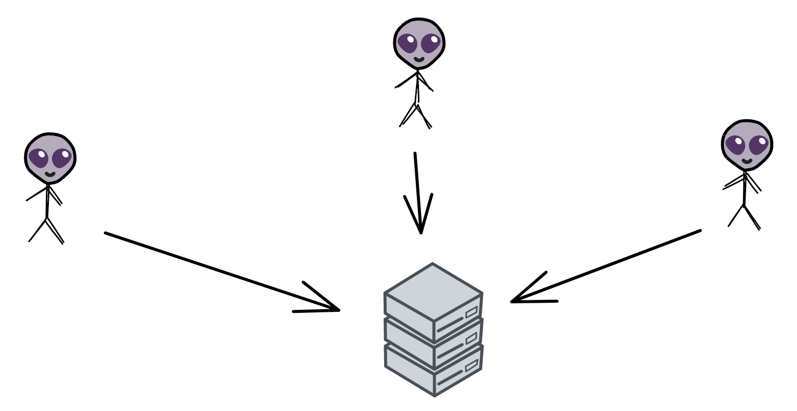
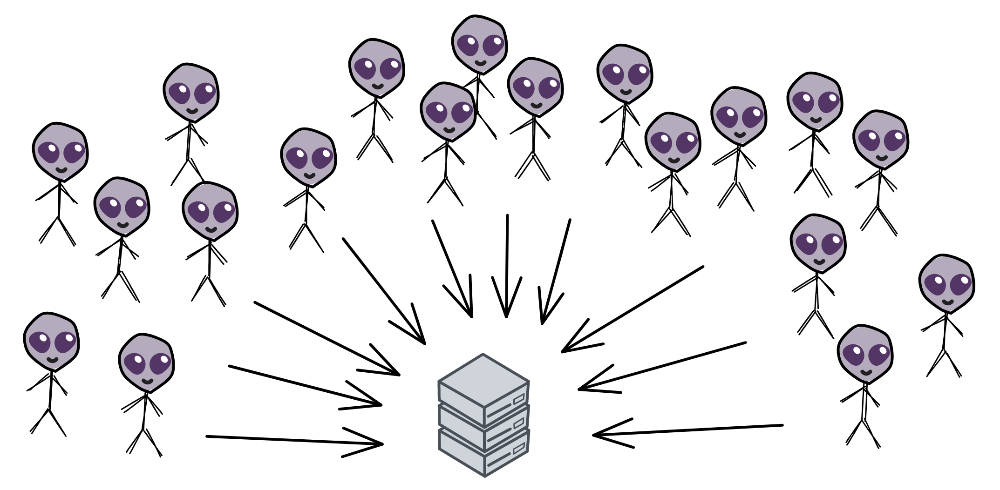
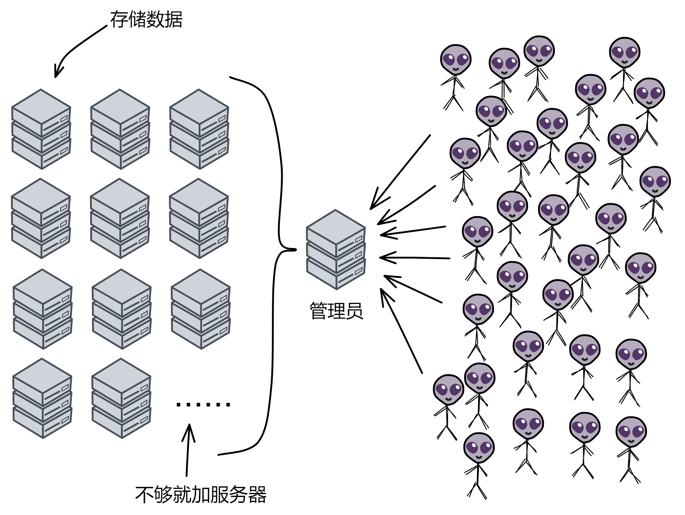
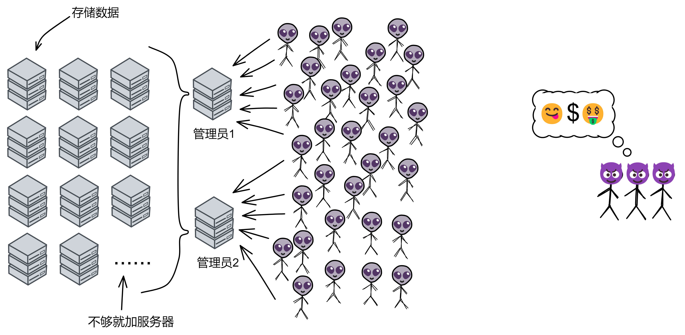
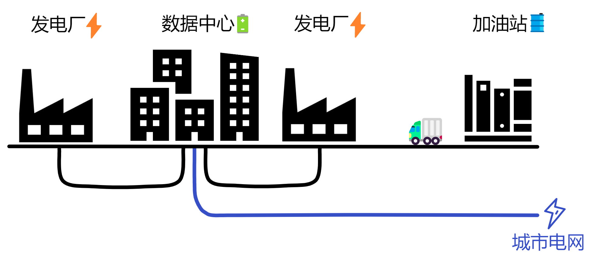
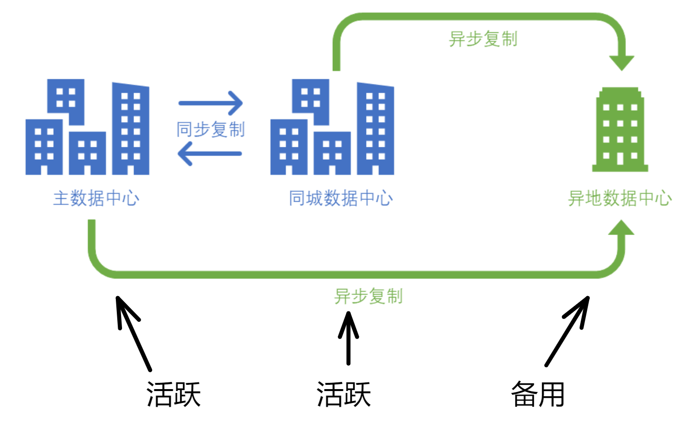

区块链是啥？

区块链是通过密码学组成的一个去中心化分布式系统。

等等，那去中心化又是啥意思？

别急，听我一个一个慢慢讲。

 

 

假如几个中子星人想建一套网上银行系统，名叫 “ 中子星银行 ” 。他们买了一个服务器用来处理所有的请求。所有用户的余额和交易信息都存在这一个服务器上。中子星银行就这样开业了。

    

随着在线支付的日益普及，用户和使用场景越来越多，交易数据呈指数级增长。

一台服务器承载能力不断受到挑战，开始有些吃不消了：

    

一方面，存储容量难以满足海量交易数据的储存需求；另一方面，每到双十一、618 之类的购物狂欢节，系统访问量飙升，CPU 负载不断攀升，过载情况时有发生。更为严峻的是，有时服务器还会发生故障，导致整个系统瘫痪，丢失交易数据。

 

业务增长使系统不堪重负，也为了避免系统瘫痪的情况发生，中子星人对系统进行了扩容优化：

买一台服务器作为 “ 管理员 ” ，再买几台服务器专门存数据。管理员服务器收到交易数据就转发给负责储存数据的服务器里。存满一台服务器就存进另一台服务器。

    

如果管理员也忙不过来了，就继续加管理员服务器。这样终于把系统扩展完了。

可这时有一群黑客盯上了中子星银行。反正钱就是一串数字，只要潜入银行数据库偷偷改掉账户余额和交易记录就能财富自由。

    

银行的系统一开始没有做好保护措施，很容易受到攻击。

在付出惨痛代价后，银行意识到了问题的严重性，并开始采取了一系列措施来保护银行系统：他们先买几台服务器用作数据备份，每 3 小时备份一次数据。然后在系统上部署了独立的哨兵监控系统，专门保护整个系统安全。

 

现在有了安保力量，系统的安全性大大提高，黑客们再也无法使用以往的攻击手段。

 

由于这些服务器都放在中子星银行的大楼里，黑客们心想：既然不能攻进系统，不如就从物理上攻击吧~ 😎 先从银行借一大笔钱，然后炸坏银行的服务器，唉，服务器死，死无对证。

还好银行门口的安检不是吃素的，谁会带着炸弹去银行呢。安检拦截了炸弹，成功阻止了黑客通过物理方式黑掉服务器。

 

这下可把银行吓坏了，服务器放在银行里不安全呀，怎么办呢？

必须得想出一个万全之策，确保服务器的本体安全！

 

于是中子星银行决定：建立专门放服务器的数据中心，并对数据中心的路由器、交换机、接口等网络设备全部独立保护。

建设数据中心的位置非常苛刻，旁边不能有铁路、公路、机场、化工厂、垃圾填埋场、核电站、军火厂、加油站等有安全隐患的设施。也不能设置在洪水、地震多发的地方，并且犯罪率较高的地方也不行。但银行还是怕有突发自然灾害，给数据中心仍然做了抗洪防护和 8 级抗震。

除了位置要合适之外，机房还要符合很多严格的建设标准，建筑材料，内部的暖通系统，空调系统，照明系统，灭火系统、防雷接地措施、内部恒温恒湿等等设备一应俱全。

 

万一黑客们切断了数据中心的供电，整个系统都会瘫痪，再安全的设备也不能没有电。

既然怕断电那就在数据中心附近安排两个发电厂同时供电，每个发电厂都能满足数据中心的全部电力需求，还有一个备份电力供应，以备两个发电厂同时断电的情况。每个发电厂配备独立的配电室。

    

不行，还是不放心，万一城市电网中断后，2 个发电厂也都出现意外不能发电了呢？

没事，数据中心还配备了 UPS 室。就是在房间里放一堆电池，能够支持数据中心满载运行 15 分钟以上。

 

即使黑客切断了数据中心的供电，数据中心仍然可以通过 UPS 不间断电源保持一段时间的运行。

那 15 分钟能恢复供电吗？不用赶着恢复。因为数据中心还配备了发电机和储油罐，能够支持数据中心满载 12 小时以上。

而且银行还跟附近至少两个加油站签订协议，保证 4 个小时之内供应柴油。虽然运油不是长久之计，但支撑一周还是轻轻松松的。

 

储油罐失火了怎么办，那可全是油。

数据中心检测火情有温感系统，视频系统，还有值班人员盯着。发现火情后，灭火系统抽出一部分气体，然后释放七氟丙烷。这种东西无色无味，杀人于无形之中，额，不是，这东西是无色、无味、低毒性、不导电、不污染、无腐蚀性。

 

那里面的人不都憋死了么。

数据中心灭火时，有警铃报警，门禁系统自动断电，人可以撤离灭火区域。就算无法及时离开，数据中心内也配备足够量的氧气面罩。

 

可是一个数据中心再怎么做安全措施也不能确保系统万无一失。

2001 年 911 事件时，摩根士丹利位于世贸大厦的数据中心全部被摧毁，但因为有成熟的容灾系统，第二天就恢复了全部业务。摩根士丹利在世贸大厦25层办公场所全毁，3000 多员工被迫紧急疏散的情况下，半小时内就在灾备中心建立了第二办公室，第二天就恢复全部业务。有些公司却因为备用灾备系统，最终不得不申请破产。

 

你看，这时候有另一座数据中心就很有用了。

这就是所谓的 “ 双活数据中心 ” ，两个数据中心同时工作。炸了一个，还有一个，系统几乎没有影响 ~ 

    

可万一小行星正好撞到数据中心在的那块区域，那不都被一锅端了？

没关系，还有异地容灾数据中心，两个主数据中心都挂了还可以切换到异地容灾数据中心。和主数据中心一样的配置，超级安全。

 

异地容灾数据中心也被破坏了怎么办？

这下系统还真被整挂了，不过数据还在。因为有冷备份，备份不运行在系统里，独立运行。备份系统每 2 个小时做一次增量备份。安置在另几座城市里。

 

发现了没？做了这么多，其实目的只有一个，**就是确保系统顺利运行，尽可能的提升系统可靠性。**

 

分布式系统虽然系统在地理上分布在不同的地方的，有多个数据中心承担业务。但所有服务器都需要银行来保护。这是一种中心化的方式，而许多人的诉求是对于现有网络的可见性、选择权和对数据的合理控制。用户需要知情权，知道谁可以访问用户数据，知道自己的数据是如何被使用的，如果用户不愿意共享某些数据，我们也有权拒绝。或许，最重要的是，用户希望自身的数据要用于自身利益。如果你对这方面的历史感兴趣，可以先看看[这里](加密朋克的那些事.md)。

 

那区块链的本质是什么？

一个遍布全球的分布式网络，一个 “ 去中心化 ” 系统，一个 “ 共享的分布式 ” 系统，一个 “ 容错、容灾 ” 系统。

 

区块链的概念分为两部分：“ 区块 ” 和 “ 链 ” 。我们先来讲讲 “ 区块 ” 。区块就像是账本的一页，里面记录着一些信息。在区块链的世界里，这些信息通常是一些交易记录。比如，A 给 B 转了 10 个比特币，这就是一笔交易。把一定数量的交易打包在一起，就形成了一个区块。

现在我们来看看 “ 链 ” 。链的概念很简单，就是把这些区块按照一定的顺序连接起来。有了链，我们就可以追踪到每个区块之间的联系。每个新产生的区块都会连接到前一个区块，形成一个链条。

 

从电于货币的诞生与发展来看，虽然我们已经做到了让货币以数字化的形式高效流通，但这种数字化还相当初级。我们不得不依赖大量的第三方中介机构才能保障电子货币的流通，而这种形式不仅引人了中心化的风险，也提升了传输的成本。

区块链就是在这样的背景下诞生的。由于信息与价值的密不可分，我们有了互联网这个全球范围的高效可靠的信息传输系统后，必然会要求一个与之匹配的高效可靠的价值传输系统。也就是说，区块链的诞生不是偶然的，其背后有着深刻的必然逻辑。“区块链”这个名字或许是偶然，但行区块链之实的系统的诞生则是必然。

信用是制造货币的真正原材料。而区块链通过构造一个可以量化信用的经济系统，使得一个点对点的电子现金系统——比特币的出现成为可能。或者说，区块链创造了一个数字化的、可以点对点传输价值的信用系统。

 

那么，区块链的全貌就是：一系列按照时间顺序排列的区块，它们通过特定的算法连接在一起。这样的结构能够确保数据的安全性和完整性。

接下来，我们要了解一个重要的概念 —— 加密。在区块链中，每个区块都有一个独一无二的数字串，这个数字串叫做 “ 哈希值 ” 。哈希值是通过一个叫做 “ 哈希函数 ” 的算法生成的。这个算法非常神奇，即使只改动一个小小的信息，哈希值也会发生巨大的变化。这就保证了区块链的安全性，因为篡改任何一个区块的信息都会改变哈希值，同时影响到后面的所有区块。

 

另外一个关键的概念是 “ 去中心化 ” 。在传统的数据库中，数据是由一个中心化的机构控制的。这就意味着，如果这个机构出了问题，整个系统的安全性就会受到影响。而区块链却不同，它是由全球各地的成千上万台计算机共同维护的。这些计算机被称为 “ 节点 ” 。

区块链的去中心化特性意味着，它不依赖于单一的中心化实体来维护数据。传统的数据库是由一个中心化的机构控制的，这样的话，如果这个机构出了问题，整个系统的安全性就会受到影响。而区块链呢，是分布在全球各地的成千上万台计算机共同维护的。这些计算机被称为 “ 节点 ” 。一笔交易要被记录到区块链上，必须得到大部分节点的共识。这带来了很多优势，比如更高的安全性、更好的隐私保护、更低的运营成本等。在区块链中，一笔交易要被记录到区块链上，必须得到大部分节点的共识。这种共识机制保证了区块链的透明性和安全性。

 

那么，如何达成共识呢？这里我们以比特币为例。比特币采用了一种叫做 “ 工作量证明 ”（Proof of Work，简称 PoW）的共识机制。工作量证明的核心思想是，让节点参与竞争，通过解决一个复杂的数学问题来争夺记账权。谁先解决出这个问题，谁就有权将交易打包成一个新区块，并添加到区块链上。同时，其他节点会验证这个区块，确认无误后将其接受。这个过程就是所谓的 “ 挖矿 ” 。

 

挖矿的过程确保了区块链的安全性和去中心化特性。然而，这种方法也有一些问题。例如，它需要大量的计算能力和电力消耗。为了解决这个问题，出现了其他共识机制，如 “ 权益证明 ”（Proof of Stake，简称 PoS）和 “ 委托权益证明 ”（Delegated Proof of Stake，简称 DPoS）等。

权益证明（PoS）是一种更为环保的共识机制。在 PoS 系统中，节点的记账权取决于它们持有的货币数量。持有更多货币的节点有更高的概率获得记账权。这种方法减少了能源消耗，但可能导致货币分布不均的问题。

委托权益证明（DPoS）则是 PoS 的一种变体。在 DPoS 系统中，持币者可以将自己的货币权益委托给其他节点，让它们代表自己进行记账。这样可以进一步降低能源消耗，同时提高系统的效率和安全性。

 

区块链就像是一个公共的、安全的、分布式的账本。它可以用来记录交易、存储数据等等。目前，区块链技术已经应用到很多领域，比如金融、物联网、医疗等。未来的区块链技术还有很多可能性。其他的科技都是提升生产力，比如 AI 、VR 。而区块链改变的是生产关系。

重点在 2 点：

第一是用技术解决 “ 信任 ” 问题。

第二是在技术基础上 “ 自治 ” 。

 

比如类似《头号玩家》里面的若干年后的世界服游戏，角色和装备资产，必然要放在区块链存储，不然游戏公司或黑客就可以任意篡改数据了。

 

在区块链的世界里，你只要用一个区块链账户身份，就可以无需许可地加入任何网络，不用再为了使用某项服务而牺牲隐私或付出代价。跟 Web2 时代商业价值完全掌握在资本家的大平台不同，Web3 建立在去中心化的网络。应用开发者负责开发并部署到区块链平台，部署在区块链上之后就不能独占和使用用户数据。这将彻底改变商业逻辑和商业价值归属，打造一个更加公平的互联网商业环境，打破行业巨头的垄断。

区块链更加地强调平等、公正、民主、自治，这与共产主义社会的思想完全是一脉相承的。在区块链网络里，利益共享、民主自治的机制会抑制一切垄断巨头的产生，通过剥削用户和内容创作者剩余价值来积累财富的方式被彻底颠覆。

 

区块链的应用场景非常广泛，从日常生活、医疗保健到能源慈善、选举金融，覆盖方方面面：

数字货币：区块链最著名的应用就是数字货币了，比如比特币和以太坊。数字货币是一种基于区块链技术的虚拟货币，它可以用来进行点对点的交易，无需通过中心化的金融机构。

智能合约：智能合约是一种基于区块链的、自动执行的合同。它可以在满足特定条件时自动触发相应的操作，从而降低合同执行的成本和风险。以太坊等平台支持智能合约，使得开发者可以在区块链上构建各种去中心化应用（DApps）。

供应链管理：区块链可以用来追踪物品在供应链中的流转。这样可以提高供应链的透明度，防止假冒伪劣产品，降低成本。

身份认证：区块链可以作为一个去中心化的身份认证系统，帮助用户在网络中验证自己的身份。这可以减少依赖中心化机构，提高隐私保护。

版权保护：区块链可以用来存储和验证知识产权信息，防止盗版和伪造。这对于创作者和知识产权所有者来说是非常有价值的。

跨境支付：数字货币可以用来进行跨境支付，这样可以降低汇款的手续费和时间成本。

物联网：区块链可以用来记录和验证物联网设备的数据，保证数据的安全和完整性。

医疗保健：区块链可以用来存储和共享医疗数据，提高数据的安全性和可用性。这有助于提高医疗水平和降低医疗成本。

能源交易：区块链可以用来记录和验证能源交易，如太阳能、风能等可再生能源。这有助于实现能源市场的去中心化和提高能源利用效率。

选举投票：区块链可以用来构建透明、安全的选举投票系统。这可以防止选举舞弊，提高民主参与度 

慈善公益：区块链可以用来追踪慈善捐款的流向，确保捐款真正用于有需要的人群。这有助于提高慈善透明度，增强公众对慈善组织的信任。

金融服务：区块链可以用于构建去中心化的金融服务平台，如借贷、保险、证券等。这可以降低金融服务的成本，提高金融体系的效率和安全性。

汽车产业：区块链可以用于记录汽车的生命周期信息，如生产、销售、维修等。这有助于提高汽车产业的透明度，防止二手车市场中的欺诈行为。

房地产：区块链可以用于记录房地产交易信息，简化房地产交易流程，降低交易成本。此外，通过智能合约，可以实现自动化的房地产交易。

教育：区块链可以用于存储和验证学历、证书等教育信息。这有助于防止学历造假，提高教育体系的公信力。

社交媒体：区块链可以用于构建去中心化的社交媒体平台，保护用户的隐私和数据安全。此外，区块链还可以用于激励内容创作者，实现公平的收益分配。

游戏产业：区块链可以用于游戏产业的虚拟资产交易、版权保护等方面。通过区块链技术，玩家可以在游戏中拥有真正的数字资产，实现跨游戏的资产流通。

人力资源：区块链可以用于人力资源管理，如记录员工的工作经历、技能、绩效等。这有助于简化招聘流程，提高招聘效率和准确性。

法律服务：区块链可以用于存储和验证法律文件，如合同、遗嘱等。这有助于提高法律服务的效率，降低法律服务的成本。

食品安全：区块链可以用于追踪食品在供应链中的流转过程，确保食品的安全和质量。这有助于防止食品安全问题，提高消费者的信心。

 

以上只是区块链技术在各个领域的部分应用。随着技术的发展和创新，区块链将会在更多领域发挥巨大的潜力。同时，我们也要关注区块链技术带来的挑战，如能源消耗、网络拥堵、隐私保护等问题。持续探讨和改进区块链技术，将有助于创造一个更加安全、透明和高效的价值互联网数字世界。

 

价值互联网是一个新兴的概念，是在信息互联网成熟之后，特别是移动互联网普及后出现的一种高级的互联网形式。价值互联网的核心特征是实现资金、合约、数字化资产等价值的互联互通。正如信息互联网时代实现了信息互联互通状态一样，在价值互联网时代，人们将能够在互联网上像传递信息一样方便快捷、安全可靠、低成本地传递价值。价值互联网与信息互联网之间并不是更替的关系，而是在信息互联网基础上增加了价值属性，从而逐渐形成实现信息传递和价值传递的新型互联网。

广义上讲，价值互联网的雏形可以追溯到 20 世纪 90 年代，美国安全第一网络银行（SFNB）从 1996 年开始开展网上金融服务，中国在 1998 年也有了第一笔网络支付。其后，很多金融机构借助互联网技术来拓展支付业务，并出现了第三方支付、大数据金融、网络金融门户等模式，以互联网金融为代表的价值互联网相关产业不断发展，价值互联网特征逐渐显现。尤其是 2010 年以来，随着互联网金融呈现爆发式增长，价值互联互通的范围和程度逐渐加大，价值互联网的规模和功能有了初步的发展。

区块链的出现，为价值互联网带来了新的发展空间，触发了一个新的发展阶段。可以说，在区块链出现之前，价值互联网处于一个非常初级的发展阶段，基本上是以一些中介化机构为中心的碎片化发展模式。而区块链在技术上具有去中心化、透明可信、自组织等特征，使得其应用更容易扩散为全球范围内的无地域界限的应用，为价值互联网注入了新的内涵。随着应用的逐渐发展，区块链将推进形成规模化的、真正意义上的价值互联网。

区块链在各领域的应用在信息互联网的基础之上，衍生出新型的价值存储和传递机制，推动了价值互联网的快速发展。区块链在各领域的应用案例和模式表明，其能够在提供基础设施、扩大用户规模、降低社会交易成本等方面有效地促进价值互联网建设，是未来价值互联网发展的关键技术。

 

云计算是一种能够通过网络，以便利的、按需付费的方式获取计算资源（包括网络、服务器、存储、应用和服务等）并提高其可用性的模式，这些资源来自一个共享的、可配置的资源池，并能够以最省力和无人干预的方式获取和释放。现阶段云计算不仅是一种分布式计算，还包括效用计算、负载均衡、并行计算、网络存储、热备份冗杂和虚拟化等计算机技术，是以上技术融合演进的结果。

当前云计算技术的产业发展中仍存在一些问题：第一，云计算市场极度中心化，少数几家互联网科技巨头依靠自身高度集中化的服务器资源垄断了整个云计算市场；第二，云计算过度集中导致算力服务价格居高不下，算力成为稀缺资源，极大地限制了企业上云的发展需求。

云计算是一种按使用量付费的模式，而区块链则是一个分布式账本数据库，是一个信任体制。从定义上看，两者似乎没有直接关联，但是区块链作为一种资源存在，具有按需供给的需求，也是云计算的组成部分之一，两者之间的技术可以相互融合。

 

依托区块链实现分布式云计算的架构，基于区块链的分布式云计算，允许按需、安全和低成本地访问最具竞争力的计算能力。去中心化应用（DApp）可通过分布式云计算平台自动检索、查找、提供、使用、释放所需的所有计算资源，同时使数据供应商和消费者等能够更易获得所需计算资源。用区块链的智能合约来描述计算资源的特征，可以实现按需调度。基于区块链的分布式云计算很可能成为未来云计算的发展方向。

“ 去中心化云 ” 旨在打造一个可扩展的、普适的无需信任计算底层。这是一种梦寐以求的技术，开发 Dapp 会变得非常简单，人们只需要发挥想象力创造，不受规模或通信复杂性的限制，创新可以持续复合而不会遇到收益递减。

这时的区块链大多是软件创新。当大众开始接受 “ 去中心化云 ” 时，可信的可组合性将成为开发者的超能力，当开发者能够以更少的资源做更多事情时，我们都会从互联网上更多的协作、创造力和选择中受益。

 

继续了解[多米尼克的故事](造梦家的冒险之旅.html#点-线-面-体)。

 
