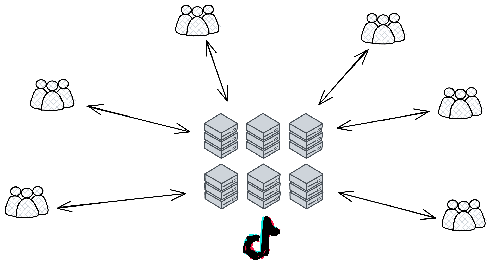
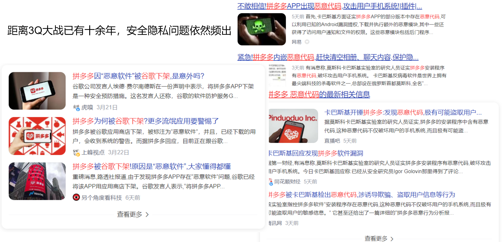

 

这是个比较严重的问题，虽然互联网可以存你的数据，但你的数据不一定会被互联网**永久**保存。因为现在大多数应用的后台是 “ 独立 ” 的。每个公司都有自己维护的服务器，要么自建机房要么用云服务。所有用户都通过访问他们的服务器来传输网络信息，和其他用户交互。一旦公司宣布停服，你的数据也就都没了。

比如抖音是这样的：

每个公司的服务器为用户提供自家的网络服务：

 

数据在带来信息时代便利的同时亦会引发数据滥用、个人隐私泄露、企业商业秘密受侵犯等诸多问题。你的数据被一股脑地传进了他们的服务器里。他们控制着服务器，怎么处理服务器里的数据，人家说了算。虽然工程师们负责只研究 AI 推荐算法，不偷看你的数据。你喜欢什么只有 AI 知道，存储在服务器中，而且那么多用户的数据也看不过来。但是当他们想要查找某个人的时候，管理层还是可看到各种数据的。

 

数据包含你的隐私，**你今天买了什么东西，聊天说了什么，喜欢看什么，晚上想吃什么，口味偏好，买衣服的身高体重，地图定位 ......** 都能通过数据分析出来。他们完全可以监视你在网络中的一举一动。

你可能会说：谁让他们看我数据啦？非礼呀！救命啊！有没有人管？

 

但我还是得说句公道话。其实在刚安装 App 的时候，他们都会让你勾选一个《用户协议》，或者好听一点叫《用户体验改善计划》。虽然几乎没人会完整看一遍《用户协议》，但已经跟你 “ 约定 ” 好了，你要把自己的使用数据交给他们。不然就不能用！😡

虽然表面上是你先同意了《用户协议》，然后他们才 “ 用 ” 你的数据改善体验。

至于他们拿数据去做了什么，没人知道。

我们已经知道的有棱镜计划，2018 年 Facebook 上亿用户数据泄露事件，2020 年 7 月 Amazon 因违反欧盟《一般数据保护条例》被欧盟隐私监管机构处以 7.46 亿欧元罚款，这也是欧盟有史以来最大的数据隐私泄露罚款。国内的美团、饿了么等外卖平台也曾被爆出用户资料遭泄露、倒卖，精确到了订餐内容、地址等私密信息；李彦宏：中国人对数据隐私可以更开放，愿用隐私换效率 ...... 

 

而且他们觉得不好的内容、对他们不利就可以直接删掉，不用你同意。（当然，非法内容肯定要删掉的）

 

鲁迅先生在《秋夜》的开篇写道：“在我的后园，可以看见墙外有两株树，一株是枣树，还有一株也是枣树。” 当下互联网面临的情况，也可以说是： **当我打开手机，一个 App 要读取我的隐私，另一个 App 也要读取我的隐私。** 不然就不能用。

大数据时代个人隐私数据泄露已成为全球重大的社会问题。互联网平台大规模采集用户数据，并将用户的个人信息长期集中化储存，数据一旦泄露就是大规模的群体事件，不仅侵犯用户的隐私权、侵害公民生命财产安全，还将对互联网企业自身造成不可预估的经济损失，数据泄露后对企业声誉的负面影响也很难消除。

就在上周，2023 年 3 月 21 日，拼多多被谷歌强制下架，并提示已安装拼多多的用户尽快将其卸载。这还是谷歌第一次提示用户卸载一个 App 。随后著名反病毒软件实验室卡巴斯基证实了拼多多利用安卓系统漏洞肆意收集用户信息、破解系统屏蔽机制、篡改手机系统记录、隐匿自己行踪、常驻系统后台运行监控手机、逃避系统清理进程、读取手机输入法信息的情况。

 

靠！想存个信息这么难，还不如刻在石头上呢！

 

这种现象的本质在于用户没有自己的数据权。自己的数据，居然自己没有数据权！

用户本应该有权了解自己的个人信息被收集、使用、分享的情况，有权决定自己的个人信息被如何使用、分享，以及有权控制自己的个人信息被如何收集、存储和使用。那如果我想删除一些隐私数据呢，嘿嘿，你想删掉的内容，你还不知道他们会不会真的删掉，他们甚至可以把信息隐藏起来，自己偷偷保存着。

 
