https://mirror.xyz/0xFd007bb46C47D8600C139E34Df9DfceC86F0B319/epZ0vLkKaB-qkt9nBbgfs-bmJ6d8O-fax4HavHkWPI8

每个极客心中都有一个去中心化**梦**想。

这是一个关于多米尼克·威廉姆斯（Dominic Williams）的故事。阅读时长约 37 分钟。

 

## 来自伦敦的极客

他喜欢把自己称作 “ JAHEBIL ” ，即 Just Another Hacker Entrepreneur Based in London 。

他写代码，创业，在伦敦做 “ 造梦家 ” 。

他勇敢又乐观，过着 “ 与世隔绝 ” 的生活，不喜社交，只关心他创立的公司品牌，重复两点一线的生活。即使每天工作 18 个小时、当时英国的创业环境也不友好，他也能哼出最快乐的小调。

 

英国的创业环境相对于硅谷来说，简直是地狱模式。硅谷一大批公司的成功造就了更多大笔的投资，投资又吸引了几乎全球顶尖的创业者去硅谷淘金，走向巅峰或失败。与人才济济的硅谷不同，在英国创业，多米尼克创立的每一个公司都能产生一些有限的回报，然后继续创办下一个公司，陷入循环怪圈：拼命工作，制造梦想，维持梦想，再制造下一个梦想 ...... 既要磨砺自己提升技术，又要使公司保持盈利。

 

厌倦了怪圈式的生活，无限循环只会耗尽他的热情。希望的嫩芽磨砂着多米尼克的心，2010 年，造梦家跳出怪圈，决定干票大的！

Fight My Monster ，一款大型多人在线游戏，也是儿童社交网络。他计划让全球各地的孩子都能联机玩这款游戏。玩家拥有自己的怪物，在回合制的战斗中使用不同的技能攻击对方。彼时，地球的另一端也在为洛克王国疯狂。

 

在比较了 HBase 、Cassandra 和其他数据库之后，多米尼克选择了早期的 Cassandra beta ，第一个分布式 “ 横向扩展 ” 的数据库。多米尼克为 Cassandra 构建了各种工具，包括第一个在可扩展的最终一致存储上运行原子事务的系统。他们是世界上第一个尝试把复杂 Cassandra 系统用于生产实践的团队。

多米尼克想用分布式系统把全球数百万用户联系起来，这在当时算不小的创新。经过几次试运行后，游戏在 2011 年新年正式推出，在短短两周内获得了 3 万名用户，并在几个月内暴涨到 30 万名用户。

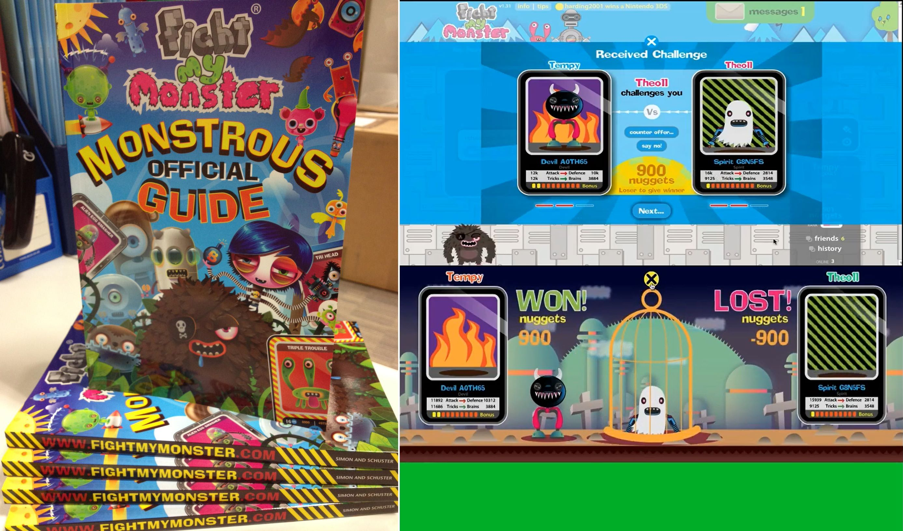

团队成功以微薄的预算将业务规模不断扩大。不过他低估了一点，这种大型在线游戏需要更多专业人员，例如 flash 网页、数据库、网络、支付系统、运维、复杂性分析、卡通形象、音效音乐、动画特效、广告投放 …… 

这笔庞大的支出比他之前的任何创业项目预算都多。很快用光了多米尼克和他朋友们的投资，不得不开始筹集额外资金。通宵工作换来了近乎完美的增长图表，“ 所以融资应该不会太难吧 ” 。

 

多米尼克向投资人介绍：“ Fight My Monster 发展迅速，很快将超过 100 万用户。我们认为工程师生活在一个激动人心的时代，互联网的基础设施已经成熟了。很多事情突然之间可以用新方式来实现了。这家公司最初是在非常有限的预算下自力更生的。您可能已经听说，Fight My Monster 正在扩张，现在很多优秀的工程师有机会加入。” 

“ 我向您简述一下我们的架构方案以及我们为什么这么做。如您所见，它并不是一个传统架构。我们选择了一个简单但可扩展的三层架构，我们在云端托管。我希望这个系统工作 ...... ” 多米尼克继续声情并茂。

“ 既然你们已经有这么多用户了，也许应该尝试让更多用户付费。这样既能证明你们的赚钱能力，也能获得我们的投资。” 对方眉头紧蹙，明显不愿意投钱。面对如此疯狂的用户增长，伦敦的投资人甚至怀疑多米尼克造假数据。

 

这下，多米尼克的心像饼干一样碎成了片。多米尼克还是低估了融资的难度。

很快，片又变成了渣。此时竞争对手已经获得了另一些投资公司的资金，还阻止别的投资公司再给 Fight My Monster 投资。

难道是自己还不够努力？

 

由于 Cassandra 也处于早期开发中。2011 年底，因为 Cassandra beta 版代码里的 bug ，Fight my monster 的用户数据差点丢失。Cassandra 资深工程师和多米尼克团队经过好几天通宵达旦的工作才保存下来，最终化解了这毛骨悚然的事。

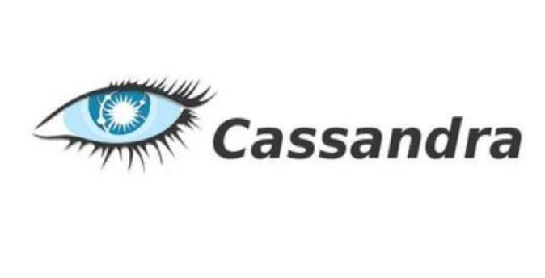

 

多米尼克太忙了。

他像一辆上紧发条的玩具车，在公司与住宅之间飞速穿梭：刚改完 bug 还没测试就要去会见投资人；连饭都顾不上吃，便埋头和工程师们开会讨论系统调整方案；从公司出来，马上又奔赴超市给妻子买圣诞节礼物 ...... 

团队在各方面都高度依赖他。他的工作量变得异常繁重，即使在硅谷这样容易获得投资的地方也很难看到。当时的多米尼克每天都工作 12 - 18 小时, 相比现在的创业公司这样的工作模式已经很少见了。他要管理业务、管理系统、写代码之间取得平衡，同时还要留出时间照顾个人生活。没多久，多米尼的妻子也适应了这种生活：白天她当游戏导演、策划，在优化游戏玩法、制定项目流程；晚上回家做饭、打扫房间，和多米尼克无缝配合。

 

多米尼克头像。

 

之后的生活更加努力了。很幸运，他在硅谷偶然遇到了愿意投资的公司。终于有投资人被眼前这个造梦家打动了。Fight My Monster 在筹集到资金后的几周内，用户数量迅速达到了 100 万。几个月后，多米尼克将公司迁至圣马特奥（旧金山附近的一个小镇）。

他去楼下喝咖啡，回来时备忘录里密密麻麻的记载着 ConcurrentHashMap 的常见问题以及解决方法；听极客们讲创业公司组件团队的经验；结交硅谷的风险投资人 ...... 

 

经过一年的发展，多米尼克在 2012 非常兴奋：

“ Fight My Monster 今天出现在了 TechCrunch 上，值得大声欢呼，谢谢！！！我们在努力工作，希望我们能够实现愿望。” 

“ 如果您还没有玩过 Fight My Monster，我建议您试一试 – 网上真的没有什么比得上它了。我们正在英国孵化，体验该网站的最佳时间是工作日（放学后）下午 4 点至晚上 8 点或周末的白天。” 

 

 

然而，挫折呼啸而至。在融资后，公司新入职的财务高管在战略上与原来的团队意见不合，分歧进而演变为决策失误。尽管用户依然在增长，但 Fight My Monster 的前进已经阻力重重，无力回天。

从财务回报来看，Fight My Monster 还是失败了，用户在 2013 年最终扩大到了 300 多万。

不过这段经历非常宝贵，弥足珍贵的部分是找到一群给力的同事，沉迷于自己热爱的那个分布式系统。多米尼克非常钦佩 Fight My Monster 的设计师 Jon Ball，Jon 总能用团队的设计系统造出一大堆好看的模型，之后又顺利创造了广告收视率最高纪录。还有 Cassandra 的工程师 Aaron Morton  “ We work together，believe each other ” ，他和多米尼克一起打造了游戏背后的 “ 引擎 ” ——分布式数据库。

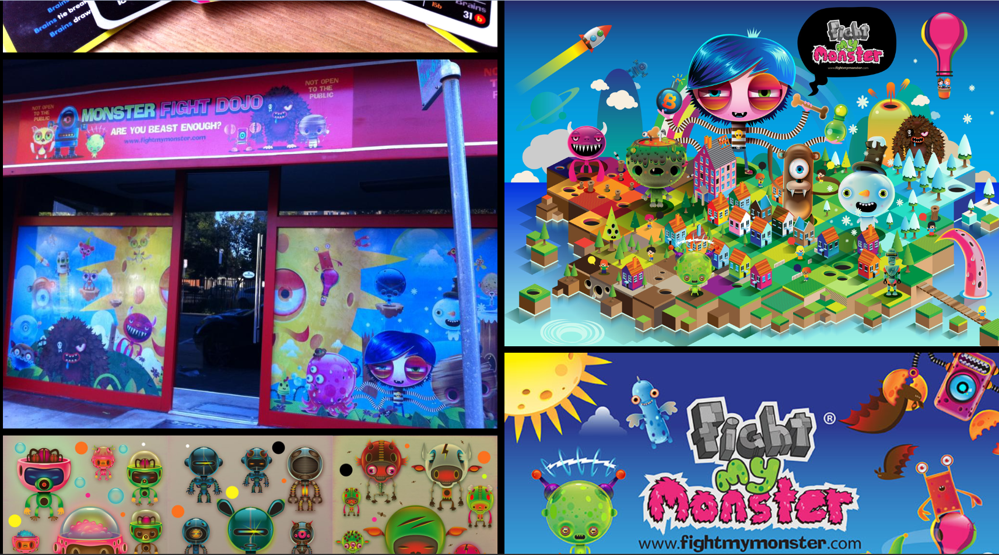

事后看来，多米尼克的 Flash 游戏当时已经风光不再。那时候人们在逐渐转向手机游戏、平板电脑这类移动端。2010 年，乔布斯宣布苹果手机不再使用 Flash ，原因是影响手机性能。因为 Flash 安全漏洞频发，BBC 发表一篇报道名叫《 Flash 还能活多久？》。BBC 话音刚落， Adobe 就宣布放弃 Flash 项目，改用 Animate 来制作专业动画。

多米尼克回忆自己那段经历时说：We could have succeeded but needed to move faster: if I had my time again, I would have relocated to The Valley very soon after the company started growing to raise money faster and gain access to a bigger pool of experienced gaming executives. 要是我们动作再快点，就能成功：如果在公司开始快速发展时赶紧融资，然后搬到硅谷，吸纳更多经验丰富的游戏高管。

 

## 工程师出身的企业家，企业家出身的工程师

虽说游戏业务日渐萧条，但在硅谷，一种陌生却强大的吸引力击中了他，多米尼克感到脑海中那片灵感的死水泛起了涟漪，很快。涟漪变成了翻滚的波浪。

时间倒回到 1998 年，多米尼克当时在伦敦的创业公司开发一个在线存储系统时，用 [Wei Dai](http://www.weidai.com) 的 Crypto++ 库做了很多事情。在 Wei Dai 的网站里，多米尼克发现了一篇关于 “ b-money ” 的文章，这当然是比特币的先驱之一。

多米尼克没有想到来自 98 年遇到的那篇文章，点燃了比特币这颗火种，并在多年之后串联起了他往后十年加密生涯的时间线。

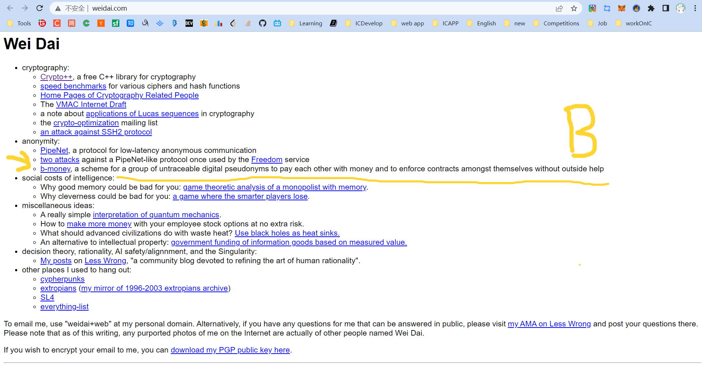

在 2013 年多米尼克离开 Fight My Monster 之后，因为多年以前尘封心底的 “ b-money ” 迷上了比特币。

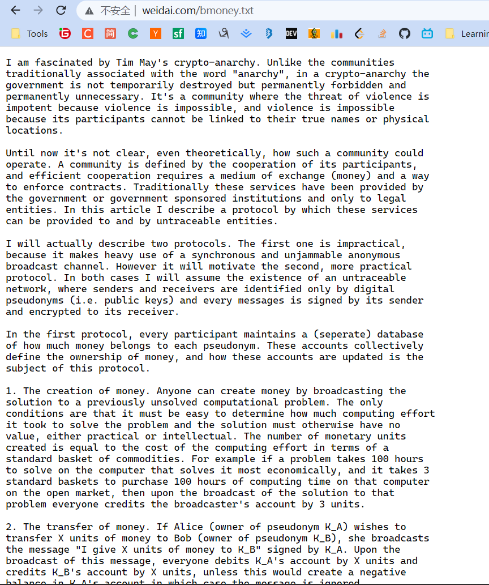

Wei Dai 在 [b-money](http://www.weidai.com/bmoney.txt) 里写道：

我对 Tim May 的加密无政府主义非常着迷。与传统上 “ 无政府主义 ” 的意思不同。在加密无政府主义中，政府不是暂时 “ 消失 ” 了，而是永远没有必要存在的。这是个人人平等的自治社区，是个没有暴力威胁的社区。因为这里利用密码学，使暴力破解从理论上就是不可能的，社区参与者的身份与他们的真实名字或物理位置没有任何关系 ...... 

 

b-money 论述了一种协议，用于在匿名社区中提供货币交换和合同执行服务。 Wei Dai 首先介绍了一种不太实用的协议作为铺垫，因为它需要同步的、不可干扰的匿名广播信道。然后提出了一种实用的协议。在所有方案中，Wei Dai 假设存在一个不可追踪的网络，其中发送者和接收者仅能通过数字伪名（即公钥）识别，每条消息由发送者签名并加密给接收者。

Wei Dai 详细介绍了货币的创造、怎么发送、怎么防止双花、广播交易信息、让服务器们达成一致 ...... 

我们无法弄清楚 Wei Dai 的 b-money 和比特币有多少关系，也不知道是否是因为受《主权个人》（The Sovereign Individual）的启发，进而设计了一种方案。不过 Wei Dai 的网站显示，最近更新日期是 2021 年 1 月 10 日。

 

多米尼克说：“ 我喜欢算法和分布式计算，大学时就在这方面获得了很多奖项。更重要的是，我之前从未遇到过这样一个技术领域，它结合了金融、法律、政治、经济和哲学的思考，同时也有望推动世界做出重大变革。对我来说，这个新兴领域是梦想成真。我做出了一个更大的人生决定，将我的职业生涯重新投入到这个领域。” 

 

多米尼克 2014 年的 “ 比特币 ATM 之吻 ” 。

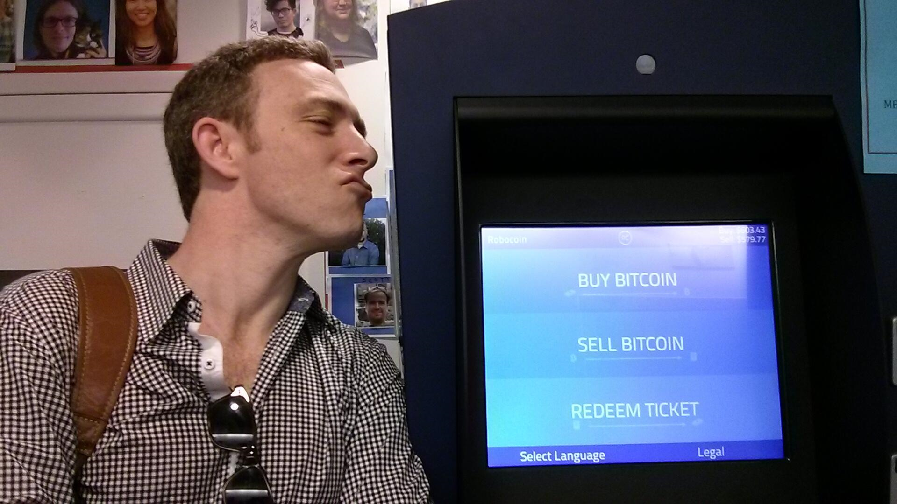

 

2014 年，多米尼克开始全职炒币，顺便埋头学习一点共识算法的基础知识🤣😉。

2 月 7 号，全球最大的比特币交易所门头沟宣布破产。多米尼克发推特表示心爱的比特币跌了，心痛。

比特币暴跌至 666 美元。

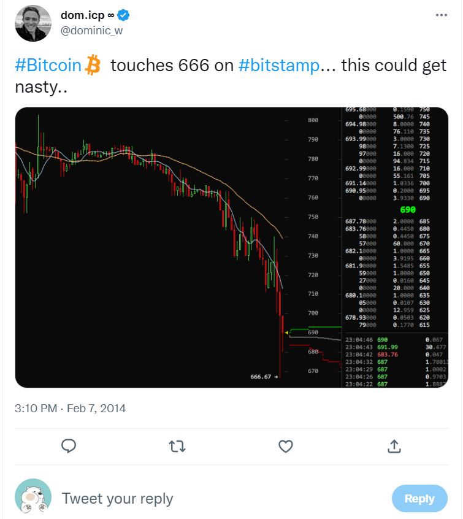

他沉下心来，深入研究传统的拜占庭容错，再结合之前的经验。多米尼克构思了一种像 Cassandra 那样能横向扩展的去中心化网络 —— 可以让越来越多的服务器加入并保持高性能。没过几天，多米尼克发表了一篇论文，描述了一种可扩展的加密货币，名为 Pebble 。论文悄悄在狭小加密圈里流传开，那是首个描述去中心化分片的系统。在这个系统中，每个分片都使用异步拜占庭共识算法来达成协议。

 

学习之余，多米尼克不忘炒币。投资比特币给他带来不少安稳觉，现在他能安心设计共识算法了。至少再也不用日夜兼程、手忙脚乱地工作了。

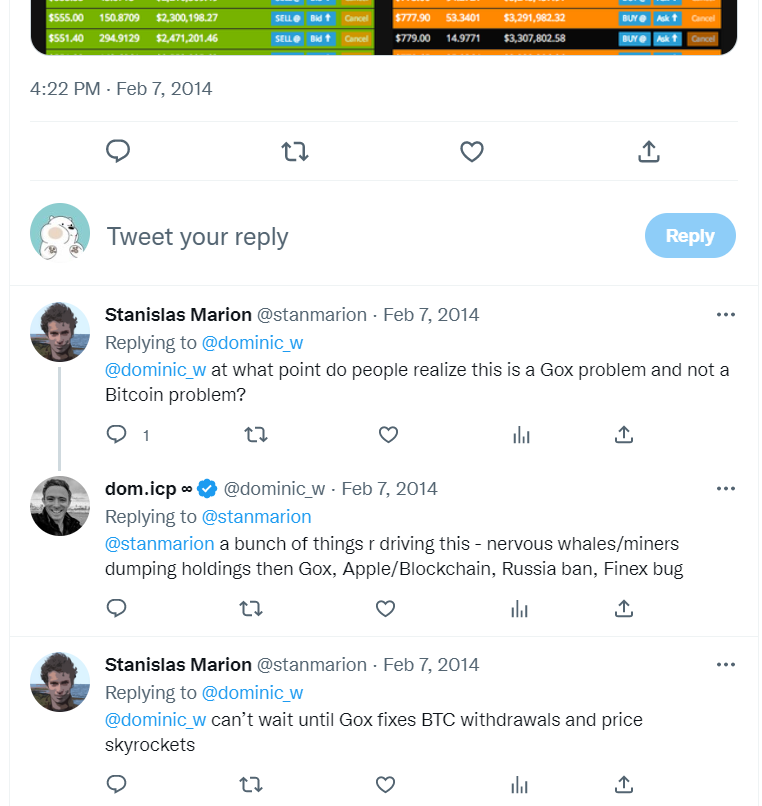

 

多米尼克的研究重点是在协议和密码学上，这些协议和密码学如同一把干柴，重新燃起造梦家内心的小火苗。多米尼克相信这些协议和加密算法可以改变世界。他取了去中心化（Decentralized）的 “ D ” 和无限（Infinity）的 “ finity ” ，组合在一起成为 “ Dfinity ” 。Dfinity 旨在创造一个具有无限规模的去中心化应用程序平台。

多米尼克从中国回到加州山景城后发推特说：China Loves Blockchain :) 。

和以太坊一样，多米尼克也在中国融到了投资。原因很简单，硅谷很早就把资金投入了比特币，并获得了巨额回报，他们不怎么关心 “ 山寨币 ” （世俗观点认为，除比特币之外的币都是 “ 山寨币 ” ，即基本模仿比特币、稍稍改进过的币）。

 

接下来我得好好介绍介绍 Dfinity 团队到底是干啥的了。

 

## 点. 线. 面. 体!

我们知道比特币是区块链的先驱。比特币本身是在 cypherpunk 对去中心化货币项目的长期追求中慢慢出现的。

它创建了一个开放的记账系统：世界各地的人都可以随时加入或退出、靠共识算法让大家的数据保持一致、一个共创共建共享的去中心化网络。人们只要下载比特币软件（下载源代码并编译也行），然后在自己的机器上启动运行就可以加入比特币网络。比特币会让全球的电脑达成一致，共同记录每一笔转账交易。有大家的记录，便有了传说中区块链 “ 不可篡改 ” 的特性，实际上就是少数服从多数，没法跟所有人耍赖。

 

在传统网络架构中，不分青红皂白，用户数据被一股脑塞进服务器里。用户不能真正控制自己的数据，谁控制服务器谁说了算。如果我们可以把这种一对多的关系看成 “ **点** ” ，星罗棋布，分散在世界各地。用户的数据流进一个个点里，乐此不疲。

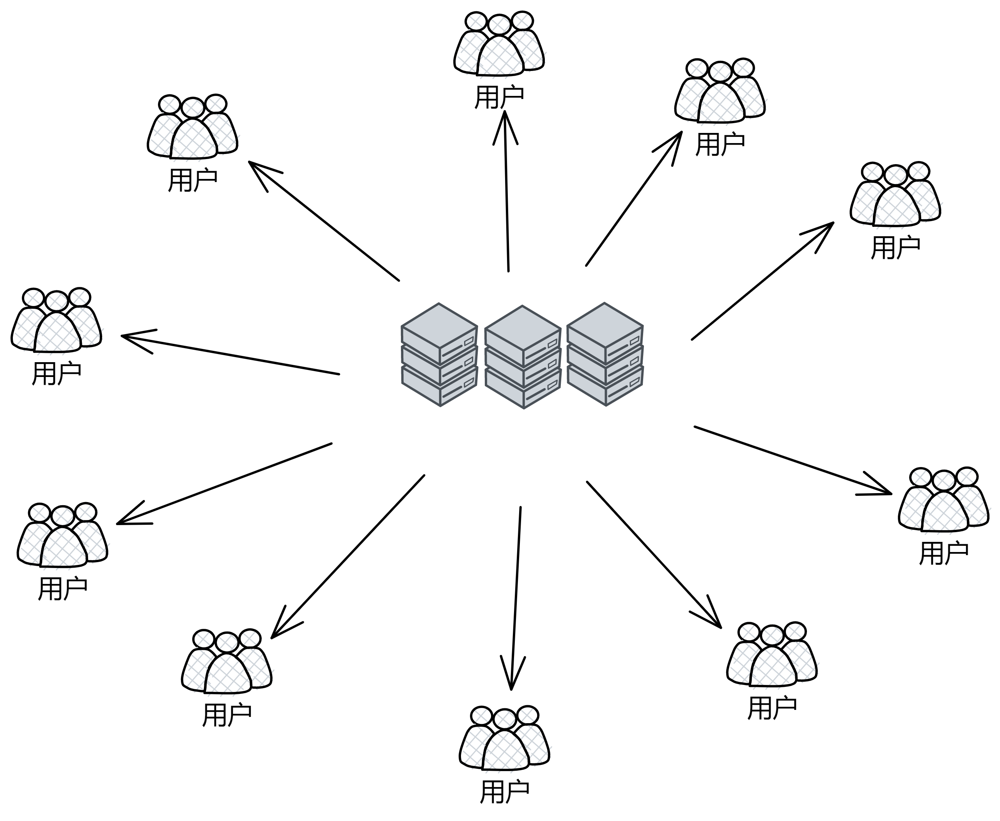

那么比特币网络就可以看成 “ **线** ” ，它把孤立的点串联成线，使互联网向更公平更开放发展。比特币做的是把世界各地的电脑组合在一起，形成一个庞大的 “ **世界账本** ”  。那如果想换一种功能，记点别的东西怎么办？模仿比特币重新做一个！

在比特币诞生 6 年后，一个可以在去中心化网络上部署软件的 “ **面** ” 慢慢崭露头角，它叫以太坊。以太坊不是模仿比特币的世界账本。以太坊创造了一个共享、通用的虚拟 “ **世界计算机** ” ，每个人的电脑里运行着以太坊的虚拟机。它与比特币账本一样不可破坏、不可篡改。大家都可以编写软件部署在虚拟机里，只要交一点以太币给矿工就行。（现在已经没矿工了）

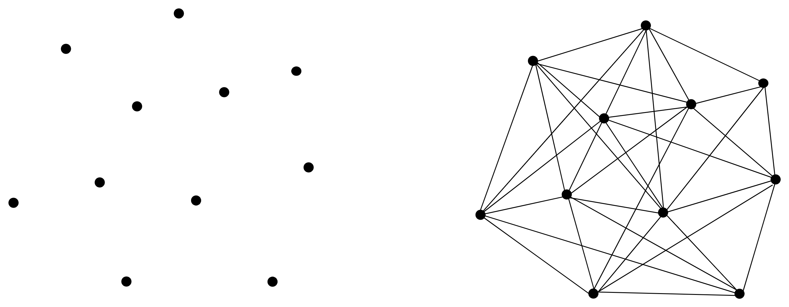

部署上链的软件化身自动售卖机，永久存储在这个分布式去中心化网络中，公平公正的判断每一笔交易是否达到条件。加上区块链永久存储的特性，便有了 “ 代码即法律 ” 一说。在这里，软件有另一个名字： “ 智能合约 ” 。

不过，咳咳，打断一下。想法很美好，现实也很残酷。早期以太坊社区中确实有实现 “ 世界计算机 ” 的想法，建立一个分布在世界各地的去中心化基础设施。但是以太坊的架构有一些局限性，使得它执行交易的性能较低、ETH 涨价导致高 Gas 费、扩展性不佳、不能大量存储数据等等。

 

一种解决方法是在原来的基础上改进：把以太坊的共识由 PoW 转为 PoS（Casper）、构建分片链（Shard）或者侧链；另一种解决方法就是推倒重来：重新设计一种可以高速处理信息、大规模存储数据的架构。

不断改进、扩容、兼容以太坊的老架构，还是设计真正的 “ 世界计算机 ” ？

 

多米尼克做了个困难重重的决定，选择后者。

现在我们可以从多米尼克 2015 年 devcon one 的演讲 PPT 中看到，他将 IC 描述为 Ethereum 3.0 。实际上称为区块链 3.0 也不为过。如果比特币和以太坊叫 “ 区块链 1.0 ” 和 “ 区块链 2.0 ” 的话。他想创造 “ **体** ” ，一个真正的世界计算机，连项目的名字都叫互联网计算机（Internet Computer，简称 IC）。在 “ 面 ” 的基础上承载大规模应用，可以 “ 横向扩展 ” 无限扩容的 “ 世界计算机 ” 。

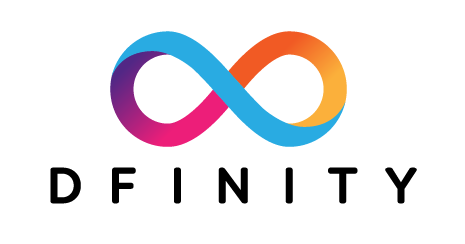

不是，放错图了。下面这个是 IC 。

 

机会终于来了。2015 年 11 月，伦敦。

多米尼克在 devcon one 上讲述了他研究的共识算法。

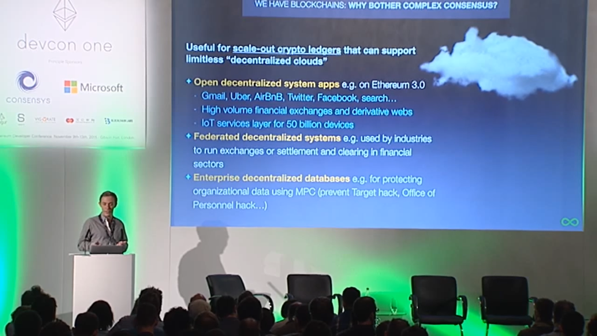

交谈中多米尼克发现，之前坚决拥护比特币的顽固派对以太坊的概念非常感兴趣。这使他更坚定地相信可信计算（Trusted Computing）的前景。

这是比以太坊更宏伟的目标。多米尼克希望做一个由服务器组成的公共网络，提供 “ 去中心化的云 ” —— 一个可信计算平台。软件在去中心化云上部署运行。

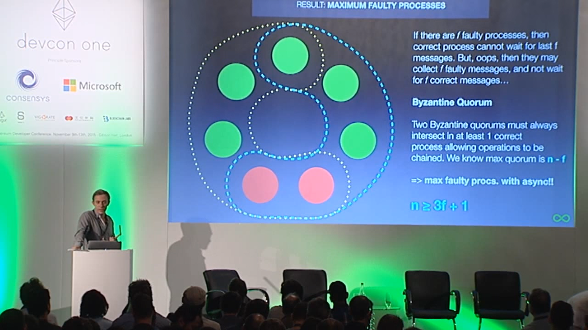

多米尼克做的是重塑一个完全去中心化的基础设施，也可以理解为下一代互联网基础设施，还可以理解为结合区块链的去中心化可信计算平台😉。所有能在区块链上跑的都将由区块链来跑，包括 Web 。

 

简单来说，就是：

传统防御系统：主要由防火墙、入侵检测、病毒防范等组成。传统网络安全的原理是被动防御，往往都是 “ 救治于后 ” ，例如当应用出现病毒，就要借助杀毒软件查杀。而此时企业或多或少已经产生了损失。

可信计算：基于密码的运算与防护并存的安全技术，保证全程可检测可监控。可信计算的原理是主动出击。由于整个链路从应用、操作系统还是硬件，必须经过验证。这就大大降低了病毒、网络攻击的概率。

 

区块链都有一个叫共识算法的东西。他负责协调网络中的节点。共识算法可以在网络中让大家的信息达成一致，因为这是一个所有人随时随地都可以加入或退出的网络，而且不知道有哪个节点会故意捣乱。有了共识算法，网络中即使存在三分之一的捣乱节点，其他的节点也照样能正常达成共识。（不同共识算法的抵抗能力不一样）

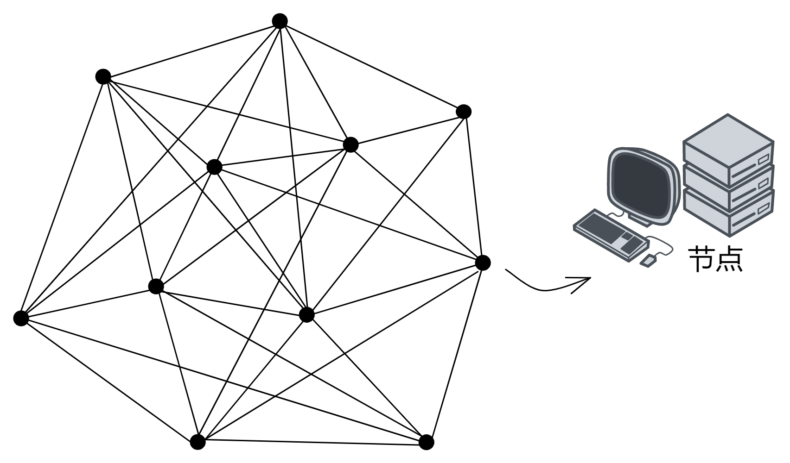

而去中心化平台不止涉及代币之间的转账交易，还涉及用共识算法建立起一道屏障，把不怀好意的家伙隔离在外面。然而效率与去中心化不可兼得，很难建立一个完全去中心化的系统：既要保护正常的节点们达成共识，又要在一堆节点之间协调、同步数据。多米尼克需要把可信计算和区块链融合在一起，让世界各地的服务器形成一个无限、开放、高性能、强一致性、可扩展、可以大量储存数据的区块链网络，不再需要防火墙保护。

对多米尼克来说，未来区块链就是互联网，互联网就是区块链。互联网不再是简单的把机房服务器之间连接到用户，而是先又世界各地的服务器组成一个可信、安全的区块链网络，然后再在上面部署 APP ，服务用户。多米尼克希望银行金融、共享经济（例如 Uber）、社交网络、电子邮件甚至网络搜索之类的东西都能转移到这样的网络上。

 

2016 年秋天，多米尼克宣布自己以 “ 去中心化冒险家 ” 的身份回归。理论搭建完成，造梦家的冒险之旅，正式开启！

 

## Dfinity !

IC 为了实现 “ 世界计算机 ” 的想法，重新设计了区块链架构，研发了更高效的共识，并配套创新的密码学组合。目标是解决传统区块链架构中速度、效率和扩展的限制。

 

多米尼克左手忙着和技术团队搞研究，右手写团队战略规划，嘴巴还得去各种区块链论坛介绍项目。

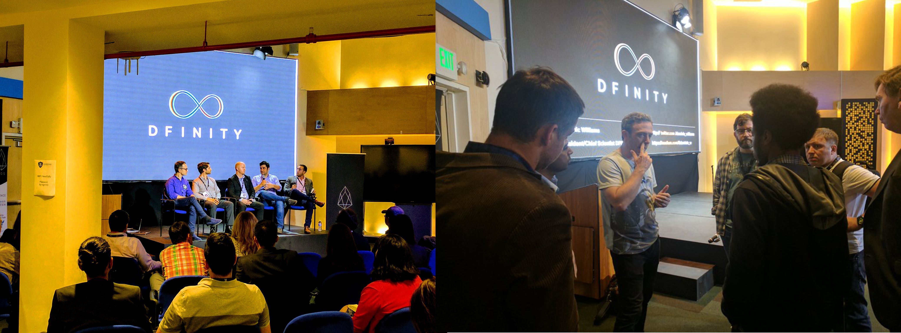

这些年来，多米尼克已经与其他区块链团队分享了许多关键密码学技术，比如 VRF 的应用，现在已经有很多知名项目用了（比如 Chainlink 等等）。

2017 年 2 月，多米尼克和 V 神以及众多大佬的圆桌论坛。Vitalik Buterin （左一），多米尼克（左二），Timo Hanke（右一）。

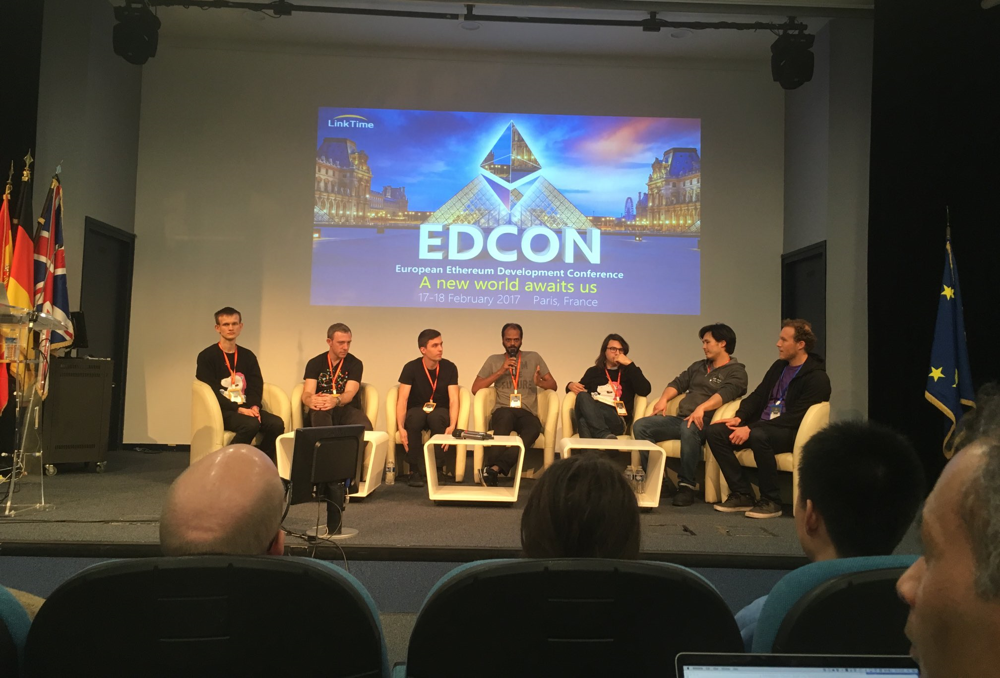

 

Ben Lynn （左二 / 红色短袖）正在演示一种屌炸天的技术：阈值中继（Threshold Relay)。它可以大幅提升区块链的性能，快速生成区块。

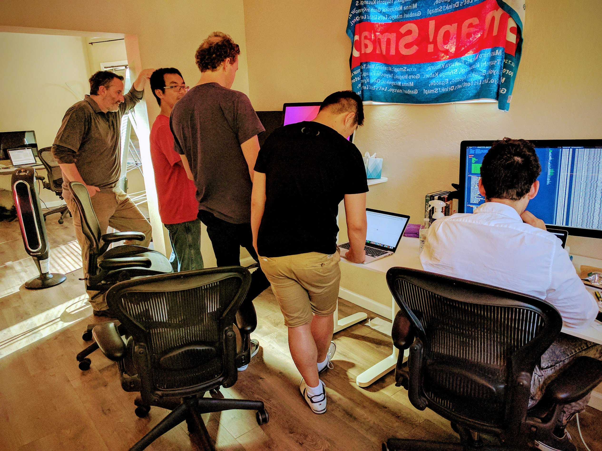

顺便提一嘴，工程师 Timo Hanke （左三 / 中间）之前是亚琛工业大学的数学和密码学教授。2013 年创建了 AsicBoost ，将比特币开采的效率提高 20 - 30 ％ ，现在已成为大规模挖矿作业的标准。

Ben Lynn 是 BLS 签名算法的创造者之一。他的 “ L ” 就是 BLS 中间那个 “ L ” ，BLS 来自三位创造者的名字首字母。从斯坦福博士毕业后他在 Google 工作了 10 年，在 2017 年 5 月加入 Dfinity 。如果你没听说过 BLS 算法，那你一定读过早些年 Ben Lynn 火遍全网的 《Git 魔法》。

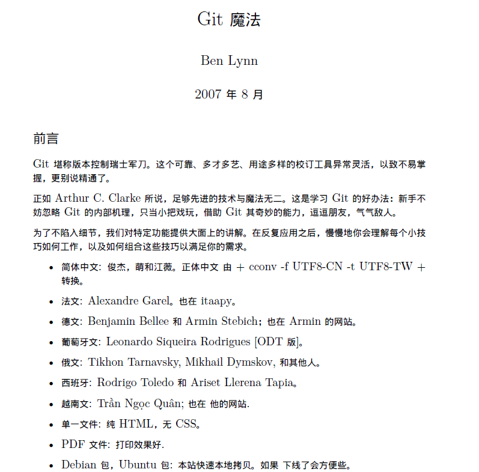

 

Dfinity 旨在探索未来的互联网基础设施。要是说起这个，那得从比特币说起。

比特币是完全虚拟的。没有任何实际价值，亦不能创造任何价值，只是一种虚拟币，人们为什么疯狂送钱购买比特币？不妨再深入一下，为什么会有比特币这种东西？

比特币是在 2008 年金融危机的背景下诞生的。金融危机波及全球，哪个国家都不能独善其身，法币变得不再可靠。想象一下这背后的关系，政府以国家信誉为背书，发行法定货币。但世界并不总是安宁稳定的，战争、自然灾害、金融危机都会对社会造成影响，这又会影响经济。

 

关于战争：社会依赖政府，政府掌握军队，军队维护社会，经过循环，组成国家。国家哪来的钱支持军队，纳税。而国家之间的冲突，如果收益大于成本，那就可能发生战争。全民纳税出钱支持军队发起战争。大炮一响，黄金万两。有国获利，有国赔钱。

关于金融：这世界上大部分国家：欧洲、北美等等，都有经济周期。小周期组成大周期，像正弦函数一样。周期性的金融危机是一把剑，悬在头顶，只能祈祷：达摩克里斯饶了我吧。

关于自然：自然灾害难以预测。虽然随着科技的发展，天灾对人类的冲击越来越小。病毒、洪水、火山。但未来几十年仍有不少威胁。这时经济自然要受连累。

 

既然怎么都要影响经济，那能不能找一种不影响经济的东西呢。害，经济不就是钱嘛！只要找到一种不贬值的钱就行了。不用抵抗所有危机，直到人类毁灭这钱还在；只要这种钱能抵御一部分天灾人祸就 ok 的。钱呀，求求你，别让地球一端的金融危机影响到地球另一端人们的正常生活。

 

我靠。还真有这种神奇东西。

这种钱源自一种 “ 无政府主义 ” 思想。前面的 b-money 就体现了这种思想。

 “ 无政府主义 ” 的基本立场是反对包括政府在内的一切统治和权威，提倡个体之间的自助关系，关注个体的自由和平等。对无政府主义者而言，“ 无政府 ” 一词并不代表混乱、虚无、或道德沦丧的无政府状态，而是一种由自由的个体自愿结合，以建立互助、自治、反独裁主义的和谐社会，是无政府而有权威的自治体系。他们认为根源在于 “ 政府 ” ，在于现在这种自上而下的金字塔结构。层层管理的模式不仅有不作为、贪腐、浪费的问题，更重要的是，总有一个组织在上面管理大家、维护秩序，容易因大的利益争端引发战乱。

- 进一步分析，你看原始社会就很和平呀，人们自发以大家庭的形式聚居，一起打猎、合作。没有所谓政府和国家，只有小规模的财富积累和劳动分工，也没有法律和警察。因为原始社会没有私人财富，大家都是一块会跑会跳的肉，光溜溜的。

- 后来，有了私人财富便有了暴力。原因很简单，因为可以获利嘛 ~ 通过暴力掠夺财富，有利可图就有 “ 勇夫 ” 干。

- 之后，当出现大量 “ 获利 ” 组织时，就会有人站出来保护大家。出现防止暴力的暴力组织 —— 军队。大家每人交一点钱（纳税）就可以获得保护。人们为了更高效的提供保护服务，形成了政府。大家把钱存进银行，因为银行可以提供保护：金库、保险箱、保安、警察等等。这个体系依赖政府运作，银行、警察，要么接受政府监管，要么是政府组建的。我的钱不带在身上，在银行里，嘿嘿你抢不着。

- 这样一来，两个大组织（政府）就会因集体利益的冲突，展开更大规模的战争，如果收益大于发动战争的成本。再招募更多军队来保护集体财产 ...... 暴力冲突越来越大，和平在哪里？核威慑。**这不是和平，是怕被核平。** 

到了 21 世纪，人们的财产，包括社交、娱乐逐步转移到互联网。所以保护人们财产的保护组织也迁移到了网上：网上银行、支付宝。

没事，钱放我们这，嘿嘿。交点手续费就行，嘿嘿。又是保护组织帮大家保管，丢了钱找平台解决！战争也变为网络攻防战，保护组织和黑客打的有来有回，拼命保住大家的钱。

以前保护组织只提供物理保护，并不会在你家里驻军把守。可是在网上就不一样了，你的数据被一股脑的传进服务器里。我的数据也是我的资产啊！数据里包含隐私、财产，你今天买了什么东西，喜欢和谁聊天，喜欢看什么，晚上想吃什么 ...... 对能通过数据分析出来。这相当于 “ 网络军队 ” 在你家里驻扎了，天天监视你的一举一动。而且数据怎么处理，人家说了算。因为保护组织控制着服务器，人家觉得不好、对某人不利就直接删掉，不用你同意。

 

可不可以把 “ 金字塔 ” 压扁，构建一种完全不依赖保护组织的 “ 个人主权 ” 体系，每个人代表平等、独立的个体？

可以的。有一种方法可以让你自己安全的持有自己私人财产。不需要银行保护你的财富、不需要保险箱保护、不需要保护组织，你自己保管即可。

那自己一个人怎么保护财产呢？答案是用现代密码学通过数学保护！

**炸弹可以炸开保险箱，但是不可能炸开密码学！**

比特币就是这种钱！自己生成一个私钥，只要私钥不泄露，别人谁都没法抢走你的比特币。收发比特币都是脱离第三方中心化平台（银行）进行点对点转账。当然，如果私钥丢了，比特币也就永远找不回来了。

自己的私钥，掌握自己的数据，不依赖第三方，完美。

 

难道比特币是绝对安全的吗？当然不是，如果你想抢某个人的比特币，把刀架他脖子上，让他交出私钥即可。谁有私钥就是谁的比特币，加密算法只认私钥。

这就是去中心化的魅力。**我们为什么相信比特币，不是因为中本聪不会抛售他的巨量比特币，而是因为我们相信个人主权和密码学。**

 

于是，整个互联网世界开始发生的根本性的变化：

比特币是一种兴起了个人财富的新型电子钱，这种钱不依赖中本聪以及任何个人、组织、政府，它依赖于完全公开透明的密码学。以太坊在比特币的基础上建立了新型计算机，运行在世界各地的去中心化虚拟计算机。无法篡改，无法被政府关掉，亦不受政府控制，全球各个地区、各个种族、生活习惯不同的人们，一起组成的网络。除非联合国停掉地球上的互联网，只要互联网不停，这种去中心化组织就会一直存在。

 

但是几乎所有的电子设备都能加入的网络速度实在太慢。你想想，早期随便一台电脑就能加入比特币网络挖矿，但是现在随着挖比特币的人越来越多、哈希难度上升，人们不得不购买更高算力的显卡，组合更多的电脑去挖矿，这就相当于一种去中心化的服务器机房了。

多米尼克想，那就直接让数据中心的机房来做节点吧，这样还能提升性能呢！

于是 IC 就变成 “ 机房链 ” 了，一个由世界各地的机房组成的去中心化网络。以太坊更擅长金融类 dapp ，而 IC 擅长通用 dapp 。这样一来就形成了各种互联网应用的 “ 个人主权 ” 革命。

 

2021 不是平凡的一年。

5 月 10 日，IC 主网上线。

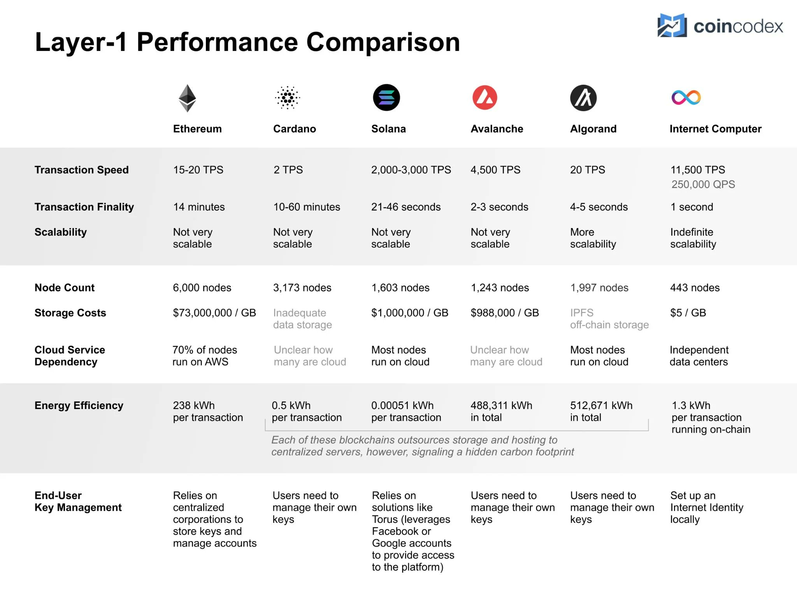

上图展示了对比其他区块链的性能、存储数据费用和能耗。

 

IC 主网上线时，已经有超过 4000 名活跃的开发者了。下图是对比其他区块链的开发者增长图。

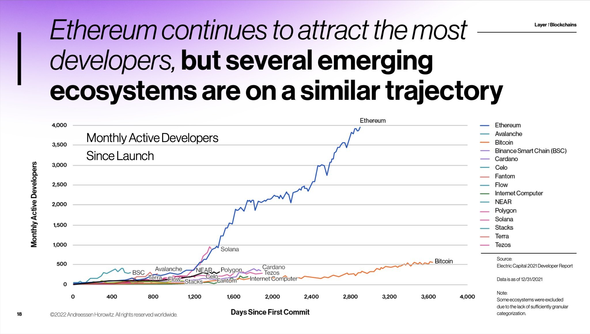

 

 

IC 有许多创新，比如无需预言机就可以直接进行 https 外调、前后端全栈部署上链、通过加入更多的节点来直接扩容、由网络神经系统（NNS）自动治理节点、反向 Gas 模型、SNS DAO、集成原生比特币、集成以太坊（不是跨链桥哦） ...... 

 

在 IC 上的 “ canister ” 相当于以太坊的智能合约，或者可以理解为小型虚拟服务器 / 容器，canister 里可以存储数据，部署代码。

 

以太坊与和特币一样，也接受了 “ 代码即法律 ” 的范式。这也就意味着没有任何治理来规范平台的使用或底层网络本身，IC 的 “ 智能合约 ” canister 不是不变的，它可以保存数据并更新代码。

 

苏黎世办公室演算集成比特币的白板。无需私钥，直接通过 canister 处理比特币交易。集成以太坊也马上要发布了。

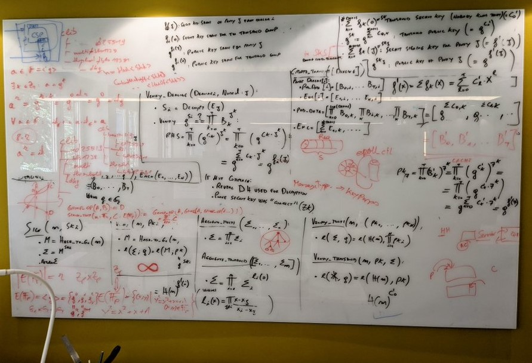

IC 在协议层面与比特币直接集成。IC 上的 canister 能直接在比特币网络上接收、持有和发送比特币。也就是说，canister 可以像普通用户一样持有比特币。canister 能够通过阈值 ECDSA 的 chain key 签名协议安全持有和使用 ECDSA 密钥。

在这方面， IC 第一个用神奇的密码学直接集成了其他区块链网络。

 

IC 架构和共识也是独领风骚。IC 理论上有无限高的计算和存储，只要不断加服务器节点进来就行。经过改良的共识有点像实用拜占庭，又更复杂，因为和目前已有的共识都不太一样，多米尼克给它起了个名字叫 “ PoUW ” 共识，Proof of Uesful Work 。BLS 阈值签名方案的 VRF ，产生真正不可预测的随机数，而且可以让大家都来验证这个随机数不是伪造的。抗女巫攻击的边缘节点，分层的架构，随机指定的出块，无需多言，就一个字，妙。

 

这些内容在后面还会详细介绍，这里只简单提几句。

 

根据 GitHub 和 Electric Capital 的统计（2023），IC 拥有最活跃的开发者社区。并且还在快速增长。

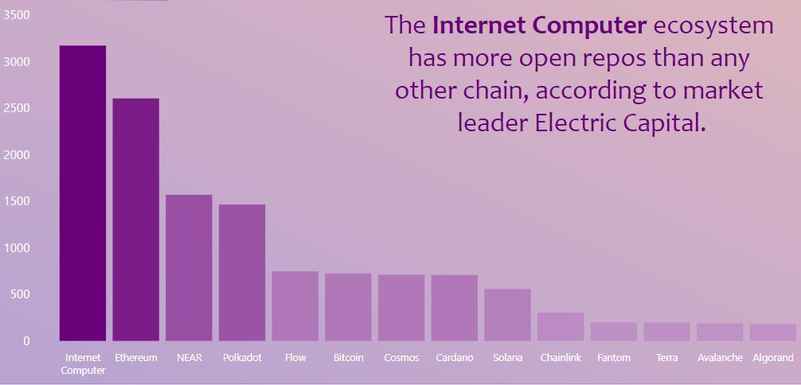

 

主网上线三个星期，IC 快要达到 3000 万个区块时，办公室墙上的照片。

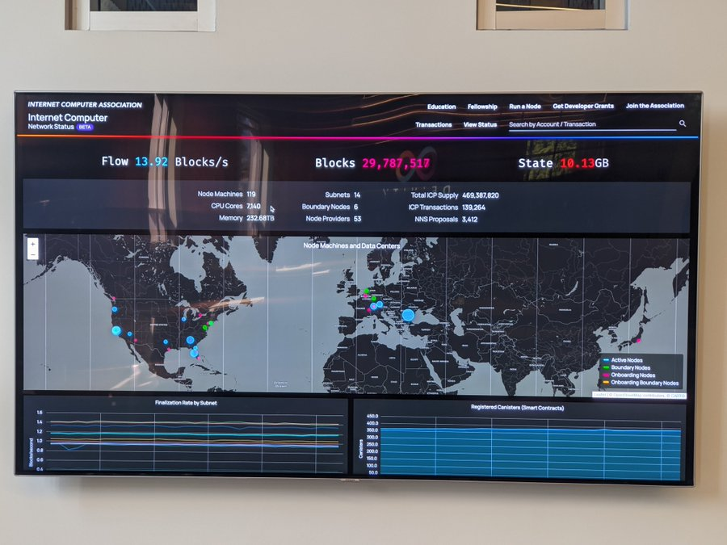

 

2021 年 7 月，有许多新的 Dfinity 成员在新冠大流行期间通过视频会议面试加入团队，还从未见过面。这天一小群人来到位于苏黎世的办公室 face to face 。

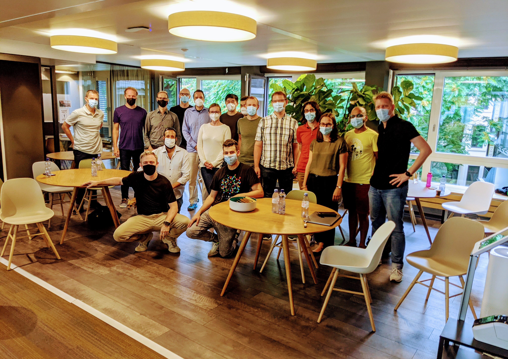

 

多米尼克的博客里写过 Dfinity 的两方面愿景：

一方面，许多传统的垄断性技术中介，如 Uber 、eBay 、社交网络、即时通信甚至搜索引擎，可能会被重新设计为 “ 开源企业 ” ，使用自主软件，使用自己的去中心化治理系统来更新自己。

另一方面，我们希望看到企业 IT 系统的大规模重新设计，以利用区块链计算机提供的特殊属性，并大幅削减成本。最后一点是不明显的，因为区块链计算机上的计算要比亚马逊网络服务等传统云计算昂贵得多。但大幅节省成本是可能的，因为运行企业 IT 系统所涉及的绝大多数成本来自于支持人力资本，而不是计算本身，而 IC 将使创建涉及人力资本少得多的系统成为可能。

 

图片来自 2021 年 10 月，上海。

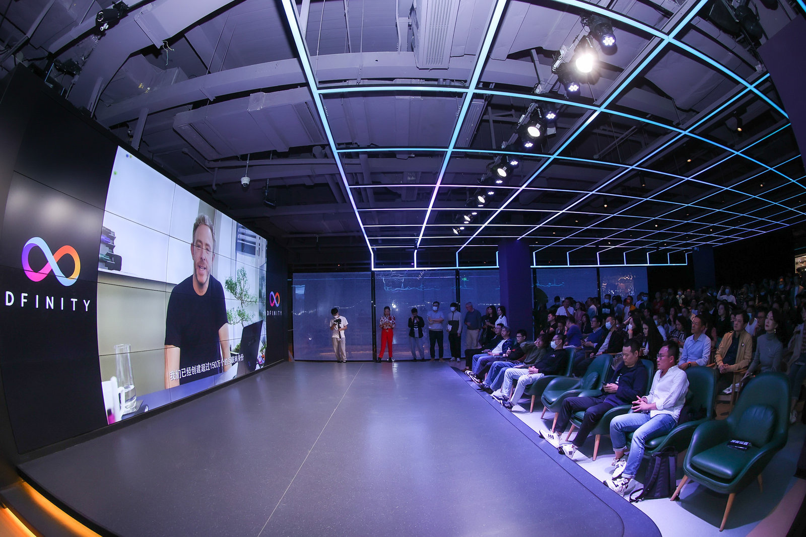

 

关于 IC 数据的[实时统计](https://dashboard.internetcomputer.org/) 。

2022 年 7 月 14 日，在苏黎世的街头咖啡馆。多米尼克和他的小伙伴正在等待 IC 的第 1,000,000,000 个区块打包。

 

Dfinty 位于瑞士总部的新办公楼。

 

多米尼克离开办公室时，拍了几张食堂墙上的壁画，由才华横溢的 IC NFT 艺术家创作。

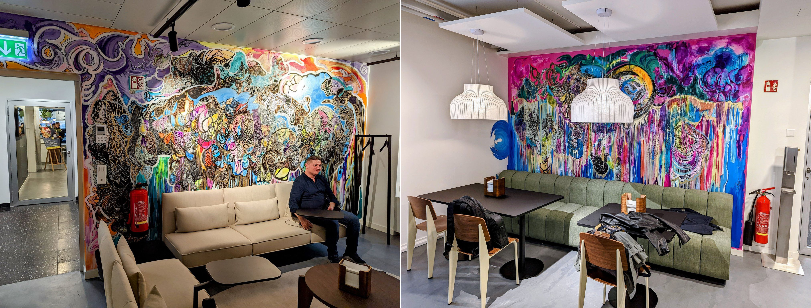

多米尼克吃着蛋糕，唱着歌，一不小心又写了几百行代码的小项目。

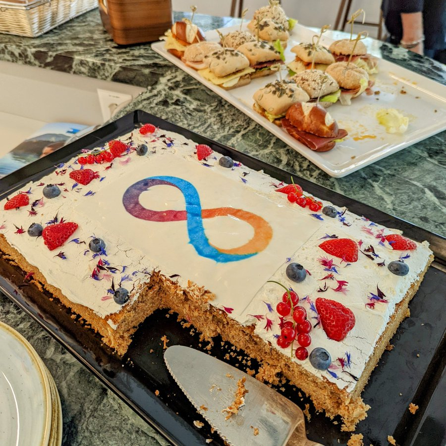

工作之余，吹拉弹唱一样不能少。

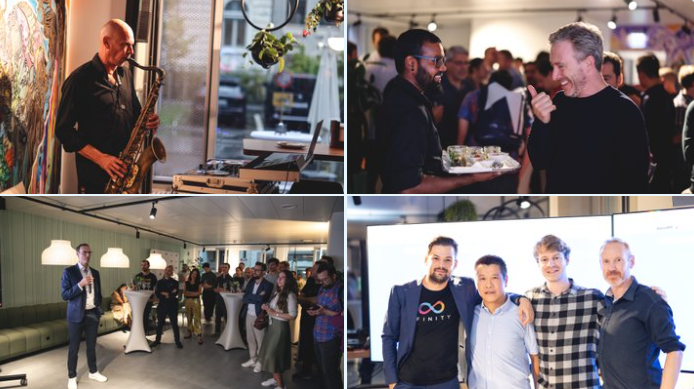

 

 

瑞士现在是响当当的 “ 加密谷 ” 了，世界上很多知名区块链项目都在瑞士诞生。Dfinity 是这里第一个完全非营利性的基金会。

多米尼克组建了一支非常强大的区块链研发团队，包括密码学、计算机科学和数学教授、博士和博士后、加密货币专家、高级工程师和专业的管理人员。

我认为未来 10 年区块链仍将是最有趣、最有影响力和发展最快的技术领域之一。目前还没有看到比 IC 更适合部署应用的链。

 

 

这就是我要讲的关于多米尼克的故事了，不过，多米尼克自己的故事远未结束，甚至才刚刚开始 ......

谁能想到，一篇来自遥远的 1998 的博客，激起了世界往后二十年波澜壮阔的 “ 加密运动 ” ，贯穿了多米尼克心中追求无限分布式的热情 ......

那，是一片新天地了。

 

 

 

 

 

### 后记

写完结尾，我察觉隐隐有些响动。簌簌簌，簌簌簌，由远及近，这时整间房变得无声无息。那声音若有若无，不知从什么地方响起，方向也搞不清楚，也许是电脑风扇，也许是窗外树枝，也许只是脑子里的幻觉。

那声音越来越清楚。那声音，听起来似乎是电脑里传来的？

我赶忙把耳朵贴到电脑主板上。不是。我又看向窗外，难道是？窗外一切正常。

那声音又来了，更清楚了，是嗞啦、嗞啦、嗞啦！没错！

忽然，时间暂停了。周围的一切都暂停了。神经元膨胀、崩裂，释放出的信息素又催化了其他的神经元，我的头不受控制的抖动起来，又突然膨胀，眼珠子大的像鼠标，耳朵拧成了麻花 ...... 那声音似乎伴随着玻璃破碎的声音，鞋底敲地的声音，鸟鸣犬吠的声音 ...... 

脑子闪过一道白光，很快，白光扩散成一白茫茫片。周围是蓝色的，下面有密密麻麻的方块和线条；一个点亮光突然闪耀、扩大，吞没了一切；周围还是蓝色的，下面是白色的。

 

现在，我什么都不记得了。

也许是**梦**吧。

也许是一种改变世界的东西。

 

 

 
