# 概述

什么是 IC 和 ICP ？

* IC 的全称是互联网计算机（Internet Computer），是专门为去中心化应用设计的高速区块链网络。

* ICP 是互联网计算机协议（Internet Computer Protocol），也是代币的名称。

正如上一章所讲，IC 的特点是可以横向扩展 “ **无限扩容** ” ，通过 ChainKey 实现了只要有新节点加入网络就能扩容。由一个 DAO —— **网络神经元系统（Network Nervous System，NNS）**管理网络的拆分和组合。所以这就需要一个不同寻常的共识算法了， IC 的共识只对消息排序，让副本按照相同的顺序执行消息。依靠 BLS 阈值签名算法和非交互分布式密钥生成（DKG）产生的随机数选择谁出块，**共识速度很快**。也就使得 IC 有了**更高的 TPS** ，做到了毫秒级查询、秒级更新数据，Dapp 的使用体验相对其他公链丝滑不少。IC 的目标是去中心化的云服务，为了能让 **Dapp 全栈部署上链**，所有 Dapp 都安装在一个虚拟化容器里。并且开发者可以通过后端虚拟容器自动生成的 **candid UI** 进行测试，不用一行代码。客户端直接通过 http 访问部署在 IC 上的前端页面以及智能合约。虚拟容器就像一个小型服务器一样，使每个 Dapp 有了自己的**链上存储空间**，还支持 **http 外调**、**集成比特币**、以太坊。既然数据都存在链上，那就要有**足够低的 Gas 费**：1 G 1 年 5 美元！Gas 光低还不够，为了用户能无门槛使用 Dapp ，IC 使用了**反向 Gas 费模型**，Gas 由开发团队支付。Dfinity 团队还把 Gas 锚定 SDR ，变成了不随币价波动的**稳定的 Gas **。IC 有一个统一的去中心化匿名身份：**互联网身份（Internet Identity，ii）**，作为 Dapp 的登录入口，加入网络神经系统参与治理 ...... 

---

想要做高性能公链总共分几步？

1. 增加带宽，节点换成高性能服务器机组。

2. 把网络分片。
3. 跨分片通信。

子网的出块速度为一秒 36 个区块。

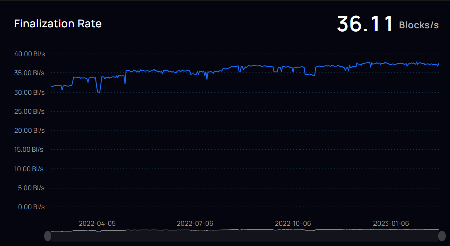

这里可以查到 IC 网络上的[实时数据](https://dashboard.internetcomputer.org/)。目前（2023.1.19）每秒可以处理 6355 笔交易。

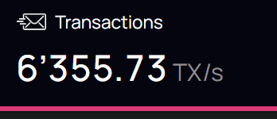

---

IC 是根据互联网计算机协议构建的。IC 协议的核心部分分为 4 层，运行在各个子网的节点上。

通过运行核心协议，一个子网的节点实现了一个基于区块链的复制状态机，该状态机独立于其他子网取得进展（但与它们异步通信）。许多同时运行的子网的这种架构使 IC 几乎可以不受限制地扩展。

子网处理消息，这些消息由用户提交或来自其他子网。

智能合约是一种新的软件形式，它将彻底改变软件的编写方式、IT 系统的维护方式，以及应用程序及整体业务的构建方式。智能合约是在去中心化区块链上运行的可组合且自治的软件部件，这使得它们无法被篡改和停止。

在本文中，我们将介绍互联网计算机，作为一种全新的区块链设计，IC摆脱了智能合约在传统区块链上的速度、存储成本和计算能力方面的限制，使智能合约的全部潜力得以释放。IC允许智能合约第一次实现完全的去中心化，使得前端到后端都能被托管在区块链上。

IC 由一组加密协议组成，这些协议将独立运行的节点相互连接以组成一个区块链的集合。这些区块链托管并执行"容器(Canister)"，即 IC上的智能合约。容器可以存储数据，对数据进行通用计算，并提供完整的技术栈，从而直接为终端用户提供网络服务。

计算和存储开销采用 “ 反向 Gas 模型 ” ，这里需要容器开发人员将 IC 的原生代币ICP兑换成cycles进行预付。ICP代币同时也用于治理：IC由去中心化自治组织（以下简称DAO）进行管理，DAO 决定变更 IC 的网络拓扑结构和升级IC协议。

IC 可以做到无缝连接。

在DFINITY上，开发者可以直接在互联网本体上构建程序和应用，不需要云服务、数据库或支付接口等。开发者由于不需要考虑很多中间件，因而可以实现无缝连接地构建应用。

使用传统IT的开发者有很多问题：必须通过众多商业云服务、云工具、操作系统的专有和开源变体、数据库和防火墙等组件、虚拟化技术，软件开发平台等等一系列的关卡，要去解决组装系统的高度自定义、维护它们所需的特殊开发人员的人工成本，以及相关的供应商关系，使得随着需求的变化、迁移和调整旧系统变得昂贵且困难的问题。简而言之，传统互联网体系下应用程序的开发、运维均要依托于比如某里云，某讯云这样中心化服务器提供商。随之而来的便是高昂的开发运维成本，以及中心化存储数据的安全问题。

DFINITY互联网计算机可以让开发者在一个开放世界中构建应用、企业系统和互联网服务类APP，在基于区块链去中心化理念下，保证它可以安全运行并且可以轻松地实现用户与其他软件的交互。

互联网计算机的出现，使得在互联网计算机上构建应用APP的开发人员，可以打造自己所想且有能力实现的所有内容，真正的拥有自由，不会被外界因素所限制，高效运行并承载力极强。

IT总体复杂性的问题一直存在，它会提高运营成本，减慢系统开发速度。当然，这也是造成安全困境的一个重要因素，现在这种麻烦需要花费越来越大的成本去解决。如今，一家普通公司的IT成本中有85%属于IT运营部门，不得不花费90%以上的时间，来处理与他们公司提供的服务无关的IT问题。

互联网计算机重新构建了软件的部署方式。互联网计算机开发人员不需要数据库等传统组件，也不需要使用经过重新设计的软件进行工作，而是将精力集中在编写他们想要实现的目标上，不是放在传统的系统构建和解决互操作复杂性上，从而提高了效率。

# 架构

各个**数据中心**通过节点软件 IC-OS 虚拟化为很多个**副本（Replica）**，再随机选取一些**节点（Node）**组成一个**子网（Subnet）**。一个子网由多个数据中心的节点组成。每个节点都用 IPv6 建立 TCP 会话，与 NNS 节点、同一子网里的其他节点连接。

**NNS** 是嵌入 IC 的治理系统，一个 DAO ，持有 ICP 的任何人可以对 NNS 上的提案投票表决。副本可以理解为子网里虚拟化出来的 “ 虚拟节点 ” ，其实还是节点，只是换了名字，与物理节点机区分开。

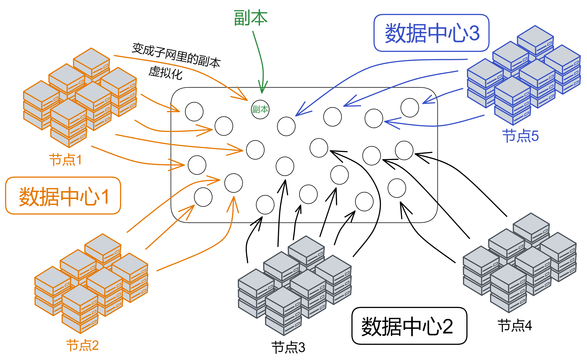

IC 的子网类似分片（sharding）思想。分片技术是一种区块链扩容方案。拿比特币举例，全世界的节点都在抢一个区块的记账权，相当于是一个覆盖整个地球的网络。如果所有亚洲的节点组成一个 “ 比特币子网 ” ，欧洲、非洲、美洲、大洋洲也都组成自己的子网。那么交易在子网里达成共识，这样节点相对少一点、通信距离更短，可以提升一些性能了。

IC 由许多个子网组成，没有母网、主链、侧链、信标链这种概念，每个子网之间是平等的（除了 NNS）。每个子网独立运行，子网内部达成共识出块，不同的子网同步并行出块。可以理解为每个子网都是一条区块链，许多链共同组成了 IC 。跨子网的通信在 IC 底层靠 **chain key** 解决。开发者和用户都不用在意智能合约被部署在哪个子网里、怎么跨子网通信等等问题。

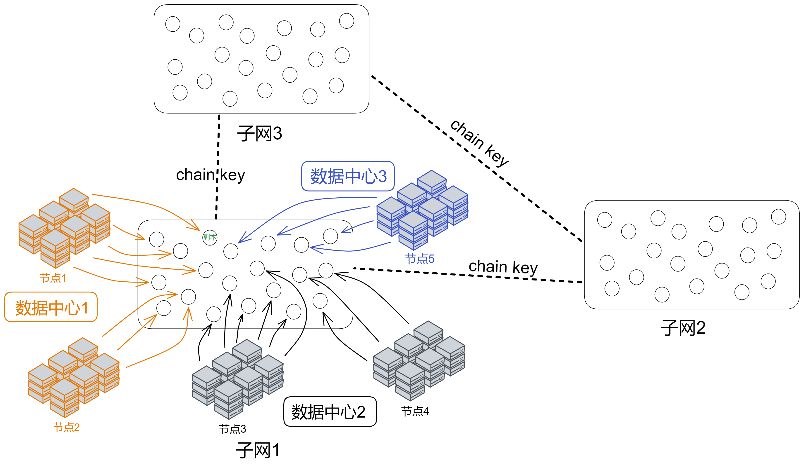

子网可以随着网络的资源使用情况动态地增加、删减、合并、拆分。子网的数量没有上限，所以理论上支持 “ 无限扩容 ” ，在世界各地新增子网。

NNS 是一种特殊子网，也和别的子网一样由一些节点组成， **NNS 可以管理其他子网**。数据中心成为节点、某个节点加入哪个子网、某个子网由哪些节点组成、选几个节点创建新子网、把一个子网拆分成几个子网等等，这些操作都需要获得 NNS 的许可。

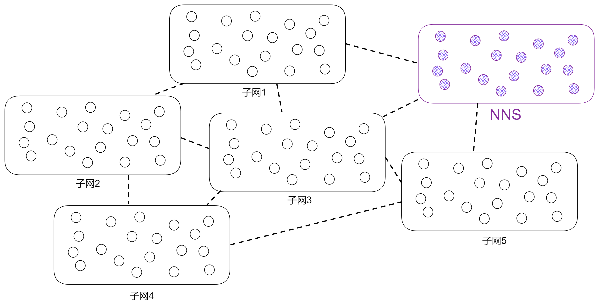

现在我们把视角转入子网内部，看一看 IC 的核心协议。为了方便理解，我把子网的俯视图转为侧视视角；紫色格子方块代表子网，蓝色小球代表子网里的副本。

IC 核心协议总共有 4 层。从下到上依次是 P2P 层、共识层、消息路由层、执行层。

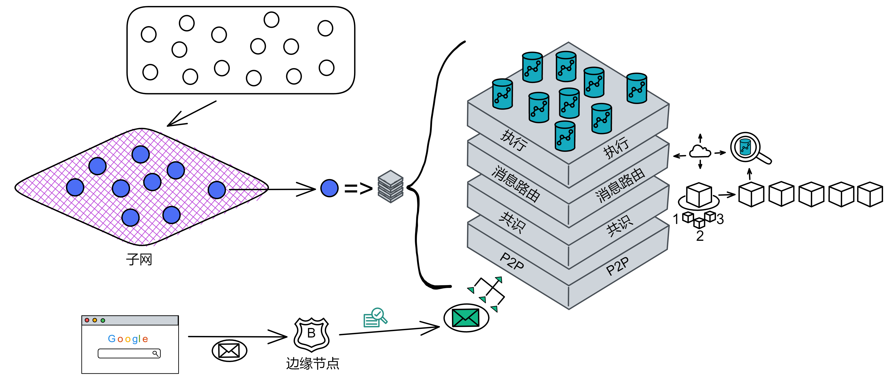

**边缘节点（boundary node）**

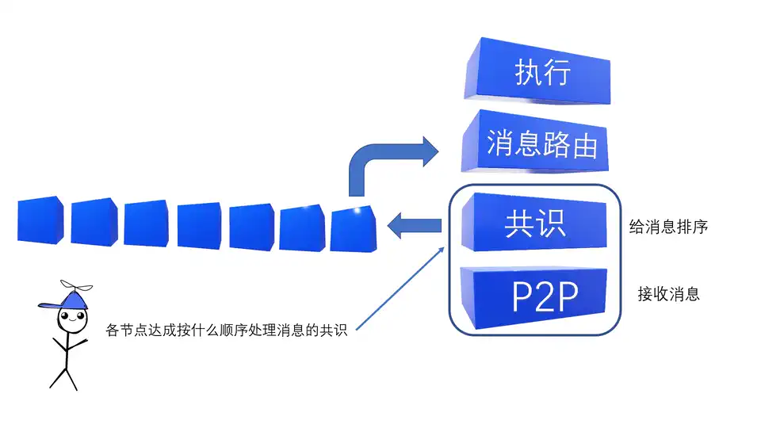

## P2P层

P2P 层的任务在子网的节点副本中传递协议消息。协议消息包括：

* 用于实现共识的消息
* 外部用户发起的输入消息

P2P 层基本上提供的是一个 “ 尽力而为（best effort）的广播通道：

 *如果一个诚实的节点副本广播了一条消息，那么这条消息最终将会被子网中的所有诚实节点所接收。*

P2P 层的设计目标如下：

* **有限资源.** 所有的算法都在有限的资源(内存，带宽，CPU)下运转。
* **优先级.** 根据特定的属性(例如类型，大小和轮次)，不同的消息将按照不同的优先级进行排序。并且这些优先级的规则可能会随着时间而改变。
* **高效.** 高吞吐量比低延迟更重要。
* **抗DOS/SPAM.** 故障节点将不会影响诚实节点副本间的相互通信

## 共识

共识由子网内部的节点们达成。

IC共识层的任务是对输入消息进行排序，以确保所有的节点副本按照相同的顺序处理输入消息。现在已有很多文献中的协议是为了解决这一问题。IC采用了一种全新的共识协议，本文将用概括性的语言对其进行阐述。

&emsp;&emsp;任何安全的共识协议都应当确保两个属性，大体上就是：

- **安全性：** 所有的节点副本都事实上同意相同的输入顺序，和
- **活性：**所有的节点副本都应当逐一更新状态。

&emsp;&emsp;IC共识层的设计目标

- 极其简单，和
- 健壮：当存在个别恶意节点时，性能会柔性下降。

&emsp;&emsp;如上所述，我们假设作恶节点$f<n/3$(即拜占庭容错)。同时，IC在部分同步网络的假设下可以确保协议的活性，而协议的安全性甚至在完全异步的网络下依然可以保证。

&emsp;&emsp;像许多的共识协议一样，IC共识协议是基于区块链的。伴随着协议的推进，以创世区块为根节点的区块树将不断生长。每一个非创世区块都包含一个荷载(payload)，由一系列输入和父区块的哈希组成。诚实的节点副本对这个区块树有一致的视角：尽管每个节点副本可能对这个区块树有不同的局部视角，但是所有的节点副本看到的都是这一相同的区块树。此外，伴随着协议的推进，区块树中总会有一条最终确认区块的路径。同样地，诚实节点副本对这一路径有一致的视角：尽管每个节点副本可能对这条路径有不同的局部视角，但是所有的节点副本看到的都是这一相同的路径。沿着这条路径的区块的荷载中的输入，是已经排序好的输入并将由IC的执行层进行处理。

&emsp;&emsp;IC的共识协议按照轮次进行处理。在**轮次**$$h$$中，一个或多个**块高**$$h$$的区块被添加到区块树中。也就是说，在轮次$$h$$添加的区块，距离根节点的距离都是$$h$$。在每一轮中，将通过伪随机过程给每一个节点副本分配一个唯一的**排位**，范围是$0,...,n-1$的整数。这一伪随机过程使用了**随机信标(Random Beacon**，使用了阈值签名技术，在章节1.6.1中已经提及并将在第3章进行详述)来实现。排位最低的节点副本是该轮次的主节点。当主节点是诚实的并且网络同步时，主节点会提议一个新区块，并加入到区块树中；此外，这将会是该轮次唯一添加到区块树中的区块，并延伸最终确认的路径。如果主节点不诚实或者网络不同步状态，其他排位更高的节点副本也可以提议新区块，并将其添加到区块树中。在任何情况下，协议逻辑给予主节点提议的区块最高优先级，并且某些区块会在该轮次被加入到区块树中。即使协议在没有延伸最终确认路径的情形下继续执行，区块树的高度也会在每轮继续增长，这样最终确认路径会在轮次*$h$*继续延伸，使其长度达到*$h$*。上述做法下，即使*故障节点*或不可预测的高网络延迟导致延迟增加，整体协议的*吞吐量*大体上依旧维持稳定。

&emsp;&emsp;共识协议依赖于电子签名在节点副本中去验证消息。为实现这一点，每一个节点副本都与签名协议的一个公共验证密钥相关联。而节点副本和公钥之间的关联性可以从NNS维护的注册表中获取。

像许多的共识协议一样，IC共识协议是基于区块链的。伴随着协议的推进，以**创世区块（genesis block）**为根节点的区块树将不断生长。每一个非创世区块都包含一个**荷载(payload)**，由一系列输入和父区块的哈希组成。诚实节点副本对这个区块树有一致的视角：尽管每个节点副本可能对这个区块树有不同的局部视角，但是所有的节点副本看到的都是这一*相同*的区块树。此外，伴随着协议的推进，区块树中总会有一条**最终确认区块**的路径。同样地，诚实节点副本对这一路径有一致的视角：尽管每个节点副本可能对这条路径有不同的局部视角，但是所有的节点副本看到的都是这一*相同*的路径。沿着这条路径的区块的荷载中的输入，是已经排序好的输入并将由IC的执行层进行处理（详见[第7章](#7 执行层)）。

IC的共识协议按照轮次进行处理。

在**轮次**$$h$$中，一个或多个**块高**$$h$$的区块被添加到区块树中。也就是说，在轮次$$h$$添加的区块，距离根节点的距离都是$$h$$。

在每一轮中，将通过伪随机过程给每一个节点副本分配一个唯一的**排位**，范围是$0,...,n-1$的整数。这一伪随机过程使用了**随机信标（Random Beacon）**（详见如下[章节5.5](#5.5 随机信标)）来实现。排位最低的节点副本是该轮次的**主节点**。

当主节点是诚实的并且网络同步时，主节点会提议一个新区块，并加入到区块树中；此外，这将会是该轮次唯一添加到区块树中的区块，并延伸最终确认的路径。

如果主节点不诚实或者网络不同步状态，其他排位更高的节点副本也可以提议新区块，并将其添加到区块树中。

在任何情况下，协议逻辑给予主节点提议的区块最高优先级，并且某个或某些区块会在该轮次被加入到区块树中。

即使协议在没有延伸最终确认路径的情形下继续执行，区块树的高度也会在每轮继续增长，这样最终确认路径会在轮次*$h$*继续延伸，使其长度达到*$h$*。上述做法下，即使故障节点副本或不可预测的高网络延迟导致延迟增加，整体协议的吞吐量大体上依旧维持稳定。

## 消息路由

如章节1.7中所述，IC中的基本计算单元叫做容器。IC提供了运行环境，使得容器中可以执行程序，并可以（通过消息）与其他容器和外部用户通信。

共识层将输入打包进区块的**荷载**中，并随着区块被最终确认，相应的荷载会被传递给**消息路由层**并由**执行环境**处理。执行层将随之更新复制状态机中相应容器中的状态，并将输出交由**消息路由层**处理。

有必要区分两种输入类型：

* 入口消息：来自外部用户的消息

* 跨子网消息：来自其他子网的容器的消息

我们同样可以区分两种输出类型：

* 入口消息响应：对于入口消息的响应（可被外部用户取回）

* 跨子网消息：传输给其他子网容器的消息

当收到来自共识的负载后，这些负载中的输入会被置入不同的**输入队列**。对于一个子网下的每一个容器 $C$，都存在多个输入队列：用于发给*$C$*的的入口消息，用于和$C$通信的每一个别的容器$C$'（如果$C'$和$C$不在同一个子网，将会是跨子网消息）。在每一轮中，执行层都会消耗这些队列中的一些输入，更新相应容器中的复制状态，并将输出置于不同的**输出队列**中。对于一个子网下的每一个容器$C$，都存在多个输出队列：对于每一个与$C$通信的容器$C'$，都有其各自的队列（如果$C'$和$C$不在同一个子网，将会是跨子网消息）。消息的路由层将取得消息队列中的消息并置入**子网间数据流**，以被**跨子网传输协议**处理 ，该协议的工作是将这些消息实际传输到其他子网。

除了这些输出队列外，同时存在一种**入口历史**的数据结构。一旦一条入口消息已被容器处理，对该条入口消息的**响应**将被记录在该数据结构中。此刻，提供该条入口消息的外部用户将能够获取相关的响应。（注意*入口历史*并不保留所有入口消息的完整历史）

需要注意的是，节点副本的状态包括容器的状态以及“系统状态”。“系统状态”包括上述提及的队列，数据流以及*入口历史*的数据结构。因此，消息路由层和执行层同时参与更新和维护子网的副本状态。此状态应全部在完全**确定性**的原则下被更新，这样所有的节点都会维护完全相同的状态。

另外需要注意的是，共识层解耦于消息路由层以及执行层，也就是说传入荷载之前，共识区块链中的任何分叉都已经被解决了。事实上，共识层允许提前运行，并不需要和消息路由层保持完全一致的进度。

### 每轮认证状态(Per-round certified state)

在每一轮中，子网的一部分状态会被验证。每轮认证状态采用链钥密码学进行验证。除了别的之外，给定轮次中的验证状态包括

* 最近添加到子网间数据流中的跨子网消息
* 其他元数据，包括入口历史的数据结构

每轮认证状态利用了阈值签名技术验证（详见[章节1.6.1](#161-阈值签名)）。在IC中每轮认证状态被用于如下几个方面：

* **输出验证.** 跨子网消息和入口消息响应都使用每轮认证状态进行验证。
* **防范和识别非确定性.**共识层保证了每个节点副本按相同的顺序处理输入消息。因为每个节点副本确定性得处理消息，应当会得到相同的状态。但是IC额外设计了一层确保健壮性，来防止和识别任何意外的非确定性计算的发生。每轮认证状态是该机制中的一环。
* **与共识层协作.** 每轮认证状态还通过两种方式和执行层和共识层进行协作：
    * 如果共识层运行快于执行层（进度由上一轮经认证状态决定），共识层会被“降速”。
    * 共识层的输入必须经过特定的有效性验证，这些验证取决于所有节点副本已达成共识的验证状态。

### 查询调用(query calls)和更新调用(update calls)

正如我们之前所述，所有的入口消息必须经过共识，才能被子网的所有节点副本按相同的顺序进行处理。但是，针对那些处理时不会变更状态的入口消息，可以进行一项重要的优化。他们被称为**查询调用**—而相对的其他入口消息，被称为**更新调用**。查询调用被允许进行只读或是可能改变容器状态的计算，但是任何对节点副本状态的更新都不会被提交给复制状态。正因如此，查询调用可以被单个节点副本直接处理而不需要经过共识，这极大的降低了从查询调用获得响应的延迟。

一般而言，对查询调用的响应不会记录在*入口历史*的数据结构中，因此也不可以用之前的每轮认证状态进行验证。然而，IC使容器可以存储数据（在处理更新调用时）在特殊的认证变量中(certified variables)，可以利用这一机制验证数据的有效性；这样的话，查询调用可以返回值并存储在经认证变量中，仍然可以被验证。

### 外部用户验证(External user authentication)

入口消息和跨子网消息的一个主要区别在于用于验证消息的机制。链钥密码学用于验证跨子网消息，另一个不同的机制用于来自外部用户的入口消息。

IC中没有外部用户的中央注册表。相反，外部用户通过一串公钥哈希作为**用户标识**（又称*principal*）来向容器来标识自己。用户自己持有对应的签名密钥，用来签署入口消息。签名和公钥会随着入口消息一起发送。IC将自动验证签名并传递用户标识给到对应的容器。随后该容器根据用户标识和入口消息中指定操作的其他参数，批准请求的操作。

新用户在首次与IC交互时会生成一对密钥对并从公钥中衍生出他们的用户标识。老用户根据存储在用户代理中的私钥完成验证。用户还可以用签名委托的方式，将多个密钥对关联到一个用户身份上。该特性非常有用，因为它允许了一个用户在多个设备上通过相同的用户身份证明来访问IC。

## 执行

在那些数据中心的 Canister 里消耗的 cycles 和这个数据中心获得的 ICP 的数量是动态平衡的。奖励多少 ICP 是根据数据中心对 IC 网络做出的贡献决定的，在数据中心部署的 Canister 越多提供算力、储存数据就越多，奖励的 ICP 也多。

执行层一次处理一个输入消息。这一输入消息取自输入消息队列，并导向到一个容器。根据此输入消息和该容器的状态，执行层环境将更新容器的状态，另外将消息加入输出队列并更新*入口历史*（可能包括对更早的入口消息的响应）。

  每个子网都可以访问**分布式伪随机生成器(PRG)**。二进制伪随机数的种子是被称为随机磁带(Random Tape)(参见[章节1.6.1](#161-阈值签名)，详见[第3章](#3-链钥密码学i阈值签名))的阈值签名。共识协议的每一轮都会有一个不同的随机磁带。

  随机磁带的基本特性有

1. 在块高ℎ的区块被任意诚实节点副本确认之前，块高ℎ+1的随机磁带是不可预测的。
2. 在块高ℎ+1的区块被任意诚实节点副本确认的时间点前，节点副本已经有构建块高ℎ+1的随机磁带的所有片段

  例如在轮次ℎ时，子网为获得二进制伪随机数，需要从执行层发起“系统调用”。系统随后将响应块高ℎ+1的随机磁带。根据上述的特性（1），协议保证在子网发送请求时，请求的二进制伪随机数不可预测。事实上，共识层会将随机磁带和荷载都传递给消息路由层；根据上述的特性（2），一般不会引起任何额外的延迟。

## 组合阐述

我们追踪记录一个用户请求在IC上的典型流程。

**查询调用**

1. 用户通过用户端向边界节点发送对于容器$C$的请求消息$M$，边界节点将消息$M$发送给托管着容器$C$的子网节点副本。在收到$M$后，节点副本将计算响应并通过边界节点发回给用户。

**更新调用**

1. 用户通过用户端向边界节点（详见[章节1.9](#1.9 边界节点)）发送对于容器$C$的请求消息$M$，边界节点将消息$M$发送给托管着容器$C$的子网节点副本。

2. 接收到消息$M$后，该节点副本通过P2P层（详见[章节2.1](#2.1 P2P层)）向子网中的所有节点副本广播消息$M$。

3. 在接收到消息$M$的情况下，共识层下一轮的主节点（详见[章节2.2](#2.2 共识层)）会将消息$M$和其他输入一同打包进其提议的区块$B$。

4. 一段时间之后，区块$B$被最终确认，其荷载被发送至消息路由层（详见[章节2.3](#2.3 消息路由)）进行处理。需要注意的是，P2P层同样用于共识层去确认区块。

5. 消息路由层会将消息放置在容器$C$的输入消息队列中。

6. 一段时间之后，执行层（详见[章节2.4](#2.4 执行层)）会处理消息$M$，并更新容器$C$的内部状态。

    在一些情况下，容器$C$立即能够计算对于请求消息$M$的响应$R$。在这种情况下，响应$R$会被记录在入口历史的数据结构中。

    在其它情况下，处理请求消息$M$需要向别的容器发起请求。在这个例子中，我们假设为处理请求消息$M$，容器$C$需要向另一个子网的另一个容器$C'$发起请求$M'$。这第二个请求$M'$会被放置在容器$C$的输出队列中，然后接下去的几步将被执行。

7. 一段时间之后，消息路由层会将调用请求$M'$移动到合适的跨子网数据流中，最终将会被传输到托管容器$C'$的子网。

8. 在第二个子网中，获取来自第一个子网的请求$M'$后，其会通过共识层和消息路由，最终由执行层进行处理。第二个子网的执行层会更新容器$C'$的内部状态，然后生成对于请求$M'$的响应$R'$。响应$R'$会进入容器$C'$的输出队列，最终放置在跨子网数据流中被传输回第一个子网。

9. 回到第一个子网，当其获取来自第二个子网的响应$R'$后，响应$R'$经由共识层和消息路由层，并最终由执行层进行处理。第一个子网的执行层会更新容器$C$的内部状态，然后生成对于原始请求$M$的响应$R$。这一响应$R$会被记录在入口历史的数据结构中。

&emsp;&emsp;无论是哪条执行路径，对于请求消息$M$的响应$R$，最终会被记录在托管容器$C$的子网的入口历史数据结构中。为了获取这一响应结构，用户端必须执行“查询调用”（详见[章节2.3.2](#2.3.2 查询调用(query calls)和更新调用(update calls))）。就像在[章节2.3.1](#2.3.1 每轮认证状态(Per-round certified state))中所阐述的，这一响应可以被链钥密码学（具体来说，使用的是阈值签名技术）进行验证。这一验证逻辑本身（即阈值签名认证）可以被用户端执行，其使用了最初从边界节点获取的service worker。

# Chain Key

互联网计算机协议使用高级加密机制工具箱，统称为链密钥加密，它允许 IC 实现其他区块链无法实现的功能和可扩展性。

链密钥密码术的一个关键组成部分是阈值签名方案，它类似于普通的数字签名方案，不同之处在于秘密签名密钥分布在子网中的所有副本中，这样密钥就不会被泄露窃取子网中的一个（甚至很大一部分）副本。该技术有很多好处，包括：

1. 任何人都可以通过简单地验证签名来验证从互联网计算机接收到的内容，而无需同步整个区块链。
2. IC 的拓扑结构可以自主演化——可以添加新的节点和子网，可以恢复故障节点，可以自主升级协议。
3. canister 的不可预测和无偏伪随机数的来源。容器可以安全地运行需要随机性的算法。

链锁密码学技术 （ Chain Key ）通过聚合签名，让子网节点产生一个唯一的公钥签名 ( 子网 key / Subnet Key ) 。这是 IC 无限扩展性能的基础技术。

每个子网可以看成是一个独立的 “ 小区块链 ” ，子网之间靠 Chain Key 通信。因为已经在子网内部达成共识了，所以只要通过 Chain Key 验证就行了。

每个子网根据 **root key** 生成自己的**子网公钥** ( 子网 key / Subnet Key ) ，子网之间通信依靠子网公钥验证数据的真实性，所以不用下载其他子网的旧区块数据，可以直接发请求过去。

>   子网 1 用自己的子网 key 对信息签名，然后发给子网 2 ，子网 2 收到信息后用子网 1 的 key 验证信息。
>
>   只要拿着某个子网 key ，就能随时随地验证这个子网上的信息是否正确。每个 key 只有 48 kb 。

root key 是公开的，客户端浏览器可以用 root key 验证消息是不是 IC 网络发过来的、有没有被篡改。

ChainKey 是互联网计算机背后的核心技术，它为 DFINITY 的区块链创建了一个只有48字节的唯一公钥。因此任何的设备，即使是智能手表，也能亲自去验证 DFINITY 的链。

相比之下，去验证 ETH 这些传统区块链时，因为每次出块都由不同的节点签名，设备需要同步几百 GB 的签名数据，而在 DFINITY 中，所有节点一起签名一个区块，因此设备只需要保存 48 个字节的唯一公钥即可验证每一个区块。

这只是 ChainKey 技术的冰山一角，它还能运行节点任意的退出与加入网络，从而轻松的把新节点接入网络进行扩容，这都归功于非交互式分布式密钥生成（Noninteractive Distributed Key Generation）技术的突破。

同时，每一个“子网/分片”都具备自己的唯一公钥，不同“子网/分片”上合约的互相调用，之需要使用这个“子网/分片”的公钥去验证它发来的区块消息即可，这就极大的优化了“片间/网间”的通讯问题。

如果能如此轻松的对区块链进行验证，那我们是不是能在其他的区块链上直接运行一个 DFINITY 的验证节点？没错，ChainKey 极易验证的特性也让 DFINITY 天然适合跨链操作，我们甚至可以在一个 ETH 的智能合约中存下 DFINITY 的区块链公钥，直接进行跨链交易的验证。这会带来大量的业务空间！

# NNS

IC 的去中心化不是比特币以太坊那样，随时随地、想加入就加入，而是加入退出不受任何第三方中心化机构约束

节点加入网络之前需要经过 DAO 投票同意。

https://www.bilibili.com/video/BV1La411C7i8/?vd_source=db5bf130bc81934e0880088323df6748

在区块链协议里直接嵌入 DAO 来治理。

## 权限模型

最早的共识协议（例如PBFT[[CL99\]](#[CL99])))）是**有许可的**，也就是说构成复制状态机的节点副本是受一个中央组织管理，其决定了哪些实体可以提供节点副本，网络的拓扑结构，并且可能还实现了某种中心化的公钥基础设施。许可共识机制通常效率是最高的，尽管它们避免了单点故障，但是中心化管理对于特定的应用程序是不可取的，并且这违背了蓬勃发展的Web3时代的精神。

最近，我们看到了**无许可的**的共识协议的兴起，例如Bitcoin[[Nak08\]](#Nak08)，Ethereum[[But13\]](#But13)和Algorand[[GHM+17\]](#GHM17)。这些协议基于**区块链**，采用**工作量证明（以下简称PoW）**（例如Bitcoin，Ethereum2.0之前）或是**权益证明机制（以下简称PoS）**（例如Algorand，Ethereum2.0）。尽管这些协议是完全去中心化的，但是他们比有许可的协议效率更低。我们也需要指出，正如[[PSS17\]](#PSS17)所观察到的，基于PoW机制的共识协议例如Bitcoin，在异步通信网络下并不能保证正确性（即安全性）。

IC的权限模型是一个**混合模型**，在拥有有许可协议的效率的同时提供去中心化PoS协议的许多好处。这个混合模型叫做**DAO控制网络（DAO-controlled network）**，（大致上讲）按如下机制工作：每个子网运行一个有许可的共识协议，但是由一个**DAO**决定哪些实体可以提供节点副本，配置网络的拓扑结构，提供公钥基础设施，并且控制节点副本部署的协议版本。IC的DAO被称为**网络神经系统（以下简称NNS）**，基于Pos，因此所有NNS的决策都由社区成员决定，社区成员的投票权由其在NNS中质押的IC原生治理代币（关于该代币的细节详见[章节1.8](#18-功能代币)）数量决定。通过这个基于PoS创建的治理系统，可以创建新的子网，可以在现有子网中增加或者移除节点副本，可以部署软件更新并且可以对IC进行其他调整。NNS本身是一个复制状态机，（和其他状态机一样）运行在特定的子网上，其成员资格由同一套基于PoS的治理系统所决定。NNS维护一个称为**注册表**的数据库，跟踪IC的拓扑结构：哪些节点副本属于哪个子网，节点副本的公钥等等。（关于NNS的更多细节详见[章节1.10](#110-nns的更多细节)。）

因此，人们看到IC的DAO控制网络既允许IC获得许可网络的很多实用优势（在更有效的共识方面），也保留了去中心化网络的许多优势（在DAO治理下）。

运行IC协议的节点副本托管在地理上分布式的、独立运行的数据中心之上。这也增强了IC的安全性和去中心化性。

## NNS的更多细节

如[章节1.5](#15-权限模型)所述，网络神经系统（NNS）是一个控制IC的算法治理系统。它通过特殊的**系统子网**中的一组容器实现。该子网和其他子网类似，但配置有所不同（例如，系统子网中的容器不收取cycles费用）。

其中最重要的一些NNS容器是：

* **注册表容器**，存储着IC的配置信息，即哪些节点副本属于哪个子网，子网和节点副本的公钥等等。
* **治理容器**，管理着IC协议如何演进的决策制定和投票。
* **账本容器**，记录用户的ICP代币账户和相互间的交易。

## NNS的决策制定

任何人通过在所谓的**神经元（neurons）**中质押ICP代币参与NNS治理。神经元的持有者可以提议关于IC应该如何变更的**提案**并投票，例如子网的拓扑结构或者协议该如何变更。神经元的投票权利是基于PoS的。直观地说，质押更多ICP的神经元投票权利更大。但是，投票权也取决于神经元的其他特征，例如愿意质押代币更长时间的神经元持有人，被赋予了更大的投票权。

  每一个提案有确定的投票期限。如果投票期结束时，参与投票的简单多数赞成该提案，并且赞成票数超过了给定的总投票权法定人数要求（现在是3%），则该提案被采纳。否则，该提案被否决。除此之外，任何时候只要绝对多数（超过总投票一半）赞成或反对该提案，该提案相应被采纳或否决。

  如果提案被采纳，治理容器会自动执行决策。例如，如果一个提案提议改变网络的拓扑结构并且被采纳，治理容器将自动使用新配置来更新注册表容器。

**流动民主下的自我进化**

互联网计算机运行管着一个去中心化代币治理系统，称为网络神经系统 NNS，这是个可以帮助 DFINITY 网络实现自我进化的治理系统。

NNS 的目的是让互联网计算机网络以一种开放、去中心化和安全的方式进行管理。它可以完全控制网络的所有权限。

例如，它可以直接对节点进行升级；可以创建新的区块链子网，实现扩容；可以拆分子网，来均衡网络负载；它可以配置经济参数，如调节 Gas 代币 cycle 与 ICP 的兑换比例；在极端情况下，它甚至可以冻结恶意的软件容器，以保护网络，等等。

用户抵押 ICP 代币成为治理神经元，可以发起提案并参与投票，参与治理会有 ICP 代币奖励。在投票过程中，NNS 使用的是介于直接投票与代理投票之间的流动民主，你可以直接投票，也可以自动跟随你信任的节点的票。

注意，这里是“跟随”而不是“代理”。被跟随的节点不会得到你的代币，也不会因为你的关注获得更多的 ICP 奖励。被“跟随”的节点还能再去“跟随”别人，这最终形成一个分散的知识网络，帮助做出足够明智的决策。

NNS 的治理神经元能支持 AI 与脚本，这些机器人更擅长参数的微调，比如获取交易所 ICP 的价格，来调节 Gas 的价格。这将大大提升治理效率，并能帮助网络实现自我进化。

**低成本的无缝扩展**

互联网计算机可以实现无缝丝滑地扩展，不仅能根据网络负载情况自动的产生新子网，在扩容过程中也不需要停止你的服务。对用户与开发者来说，扩容的过程是毫无感觉的。

过去我们的思维常常被限定在固定数量的链上，从而钉死了整个网络的 TPS，而实际上 TPS 应该是按需扩展的。在 DFINITY 上子网的增加与合并是按需进行的，参与 NNS 的神经元可以根据当前的网络负载情况发起扩容提案，来平衡整个网络的负载。

这种近乎无限地扩容能力，也让区块链的超大型应用成为可能。开发者可以使用智能合约来构建token 化的社交媒体，将社交媒体与传统的智能合约应用（如DeFi）融合在一起，这将带来无限的业务想象力。

## 代币（Token）

IC使用称为ICP的功能代币。该代币有如下功能：

**NNS质押：**如[章节1.5](#15-权限模型)所述，ICP可以用于在NNS中*质押*获得投票权，从而参与控制IC网络的DAO。在NNS中质押代币并参与NNS治理的用户还会收到*新铸造*的ICP代币作为*投票奖励*。奖励数量由NNS制定和执行的政策所决定。

**兑换Cycles：**ICP用于支付IC的使用费用。更具体来说，ICP可以兑换成**cycles**（即销毁），这些cycles可以用于支付创建容器（详见[章节1.7](#17-执行模型)）和容器所使用的资源（存储，CPU和带宽）费用。ICP兑换成cycle的比例由NNS决定。

**支付节点提供者：**ICP用于支付节点提供者—这些实体拥有和运营着计算节点，来托管构成IC的节点副本。NNS定期（当前每月）决定每个节点提供者应收到的*新铸造*代币并发放至其账户。根据NNS制定和执行的政策，支付代币的前提是节点提供者为IC提供可靠的服务。

# Canister

https://www.bilibili.com/video/BV1W5411X7vR/?vd_source=db5bf130bc81934e0880088323df6748   

## 简介

当我了解 IC 之后，第一次见到能直接部署网页的区块链。( ఠൠఠ )ﾉ 

Canister 就是 IC 的智能合约，可以存储代码逻辑、数据状态、前端资源。开发者无需关心底层通信，只要把代码部署到 canister 里，用户就可以直接通过网址访问到应用。

比如项目里有一个专门放前端页面的 canister 和一个后端 canister 。客户端发请求，浏览器发出请求后，浏览器需要先从边缘节点下载一个 Service Woker 检查浏览器是否支持 wasm 、网络环境是否安全等等。Service Woker 可以验证前端页面是否来自 IC ，是否经过篡改。请求消息经过 IC 协议定位到某个前端 canister ，前端 canister 直接发送 HTML 网页到客户端。之后通过官方的 JS 代理库与后端 canister 交互。Canister 之间也可以互相调用交互。

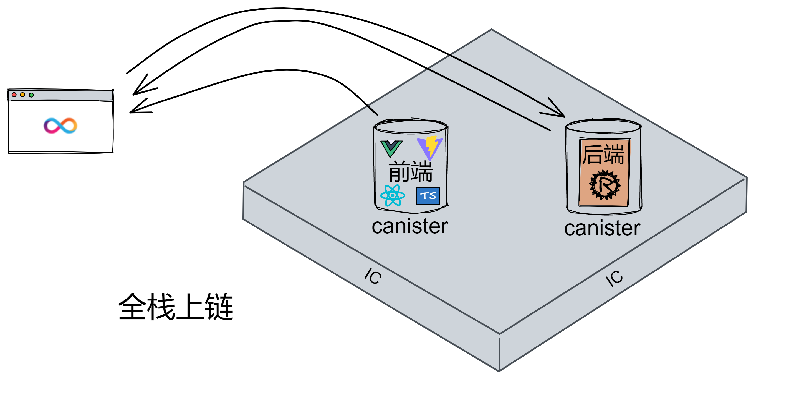

IC 对以太坊 Dapp 开发和传统 Web 开发做了简化。开发 Dapp 无需第三方钱包，也不用开发者考虑负载均衡、防火墙，这些都由 IC 协议层解决。

上面说的只是最简单的 Dapp 项目实例，实际开发中，一个 Dapp 一般都有很多个 canister 。

Canister 英语原意为罐子、容器，是一种轻量级 WASM（WebAssembly）容器。

所有可以编译为 wasm 字节码的语言理论上都可以用来写 IC 的智能合约：Motoko 、Rust 、C 、C++ 、Go 、JavaScript 等等。（ - 2022·5·15 - 现在motoko 和 rust 的 cdk 比较成熟，别的语言的 sdk 正在开发）因此，前后端都可以编译为 wasm 并安装进容器里上链。当然也只有支持 wasm 的浏览器才能打开 Dapp ，不过支持 wasm 的浏览器以后会越来越多。

canister 属于 IC 四层核心协议里的执行层。（扩写）

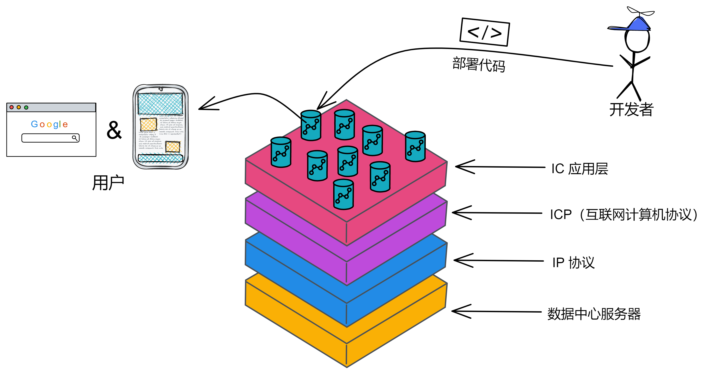

ETH 是一台同步的状态更新机器，由交易触发智能合约，然后达成共识；而 IC 是一台异步状态更新机。只要客户端发出消息传到 IC ，就会返回一个结果：成功或者失败。

Canister为 Actor 模型。容器之间不共享状态、也没有状态锁，通过通讯来处理事务。Canister 间互相调用也是异步的。

---

如前所述，IC的复制状态机可以执行任意的程序。IC中的基本计算单元叫做**容器**，它和*进程*的概念大致相同，包含了*程序*和其*状态*（随时间变化）。

  容器的程序用**WebAssembly（以下简称Wasm）**进行编码，是一种基于堆栈的虚拟机的二机制指令格式。Wasm是一种开源标准[1](#dfref-footnote-1)。尽管它最初设计是为了实现网页端的高性能应用，但它也非常适合用于通用计算。

  IC提供了一个运行时环境，用于容器内执行Wasm程序，并（通过消息传递）与其他容器和外部用户通信。虽然原则上可以用任何能编译成Wasm的语言去编写容器程序，但我们设计了一个叫做**Motoko**的语言，它与IC的操作语义十分一致。Motoko是一种强类型，*基于actor*[2](#dfref-footnote-2)的编程程序，内置支持*正交持久性*[3](#dfref-footnote-3)和*异步消息传递*。正交持久性意味着容器维护的内存会自动持久化（即不必写入文件）。Motoko具有许多生产力和安全特性，包括自动内存管理，泛型，类型推断，模式匹配，以及任意和固定精度的算术。

  除了Motoko之外，IC还提供了一个消息接口定义语言和数据格式称为**Candid**，用于固定类型、高级语言及跨语言互操作性。这使得任何两个容器，即使是用不同的高级语言编写，也可以轻松地相互通信。

  为了提供全面支持任何给定编程语言的容器开发，除了该语言的Wasm编译器外，还必须提供特定的运行时支持。当前除了Motoko之外，IC还全面支持了Rust编程语言的容器开发。

---

Canister 对外提供 2 种调用方法：**update call** 和 **query call** 。

**update call** ：增 删 改。会对内存数据进行修改。因为要改数据，所以得在子网里达成共识。因为要达成公识，所以处理消息是**单线程**的，不支持并发。（在子网里达成过共识的东西就安全了，别的子网可以直接访问，不用再达成一遍共识了。）

**query call** ：查。每次调用 query call 时，都对节点内当前数据进行一次快速查询。因为不修改数据，所以不用达成共识，可以**多线程**，支持并发处理。一个 Canister 能同时处理很多个 query 方法。

Canister 之间可以互相通信，但是数据是隔离的，不能保证原子性，

|              | 更新调用 update call | 查询调用 query call |
| ------------ | -------------------- | ------------------- |
| 是否需要共识 | 需要                 | 不需要              |
| 安全性       | 高                   | 低                  |
| 响应时间     | 2 ~ 3 秒             | 小于 100 毫秒       |
| 状态改变     | 持久化               | 不改变状态          |
| 执行方式     | 顺序                 | 并行                |
| 调用方式     | 两步                 | 一步                |

IC 使用反向 Gas 模型，运行 canister 的费用（Gas fee）默认由部署应用的开发团队（Controller）支付。当然，如果是每个用户需要创建一个自己的 canister ，也可以让用户支付创建和运行 canister 的费用。

支付 Gas 的币是 **cycles** 。ICP 可以单向转化为 cycles 。

（扩写：）cycles 价格稳定，$1\times 10^{12} cycles = 1 SDR$ （SDR是啥）

1 T cycles 即 1 Trillion cycles

每个容器有自己的 cycles 余额，canister 之间可以互相发送 cycles 。用户不能持有 cycles 。

在第一次部署 canister 时需要大量 cycles （需要至少 0.1 T cycles，默认是 3 T cycles），之后更新代码几乎不消耗 cycles 。

1 TC 是 1 T cycles，C 是 cycles 的缩写。

当 cycles 不足维持 canister 30 天时，canister 进入冻结状态，30 天后如果没有充值 canister 就会被删除。冻结后 canister 无法正常工作。拒绝执行任务。

cycles 计费标准（https://www.bilibili.com/video/BV1W5411X7vR/?share_source=copy_web&vd_source=cf43649c5203a92adc13130666d07105&t=316）

DFINITY 区块链中消耗的 Gas 叫 cycles，这是通过消耗 ICP 兑换而来的。cycles 在算法调节下处于稳定，与 1 SDR 锚定（SDR 可以看作综合多国法币计算后的稳定单位）。cycles 不仅仅作为 Gas，它在 DFINITY 未来的生态中可能会扮演稳定币、交易计价符号等重要角色。

而在 NNS 中，最频繁的提案类型叫做“ExchangeRete”，神经元会从交易所中获取 ICP 的价格，然后提交在提案里，平均每6到10分钟就会提交一次，这其实就是一个在治理系统伪装之下的价格预言机。就是根据 NNS 的 ICP 价格，来自动调节 ICP 兑换 cycles 的比例，最终维持 cycles 的稳定。

## Wallet

Wallet 是允许存储和管理 cycles 的专用 canister 。Wallet 要归属于某个身份。

## Principal

Principal 本质是一种标识符，可以用于标识身份和 Canister（未来可能还有其他）。

比如可以使用 Principal ID 标识一个身份，当你第一次使用 Dfinity Canister SDK 时，dfx 命令行工具会为你创建 default 开发者身份（和一对公钥私钥），default 这个开发者身份就是由 Principal ID 标识。

注意，开发者身份还可用于派生 Account ID（类似于以太坊地址），以代表「身份」将 ICP 代币保存在 Ledger Canister 中。

同样，Canister ID 也是一种 Principal。

所以当说起 Principal 时，它可能会同时代表某个身份或者某个 Canister，比如 Wallet Canister。

## Controller

Controller 是具有安装、升级、删除 Canister 权限的 Principal。

一般情况下，一个 Canister 的 Controller 可以指定为某个身份、或者某个身份对应的 Wallet Canister。

在 dfx 0.9 之后，默认「身份」是 Canister 的 Controller 了，Wallet Canister 不再是默认 Controller（相当于 dfx 指定了 --no-wallet）。

## Candid UI

IC 的应用层还集成了一种接口工具：Candid UI 。它在部署时能解析后端 canister 里的公开函数，然后自动生成前端网页。让不熟悉前端的智能合约开发者无门槛测试合约。

生成的 candid 文件长这样。Candid 是一种数据描述语言，也是跨语言调用的规范。它能描述 canister 提供的接口和数据类型。

本地部署项目后，它给出了前后端的两个网址。前端网址可以直接看到前端页面，后端 canister 由 candid UI 生成。

Candid UI 生成的页面长这样：

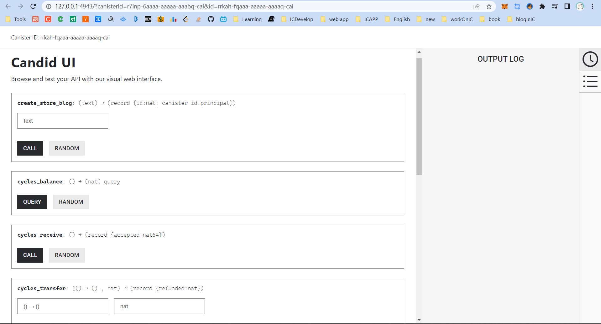

更新调用。candid UI 也模拟了实际调用 IC 的延时，右下角花了显示 6.59 s 。这个函数的作用是让 canister 创建一个新的 canister ，用来存储 blog ，耗时比较多。

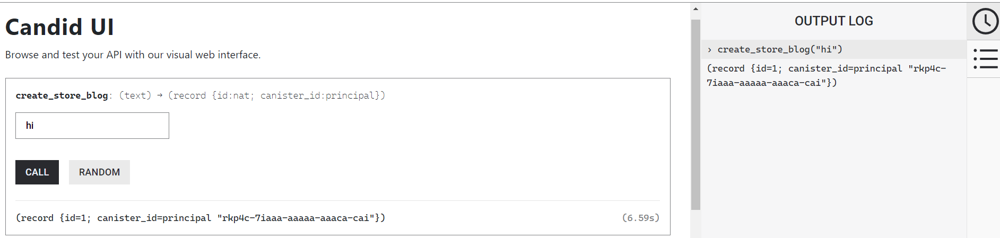

创建一篇 blog 的调用时间 2.116 s ，速度还可以。

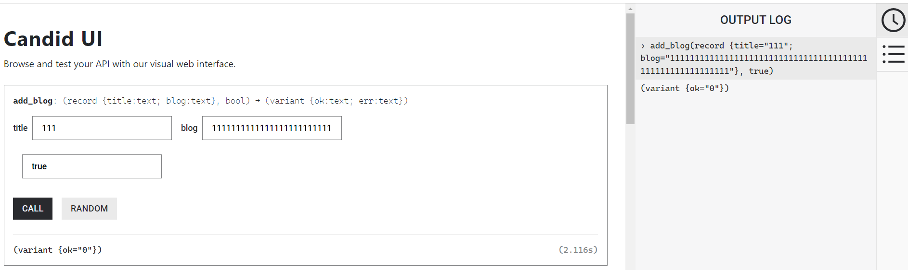

查询数据 0.016 s 几乎无感。

## Canister id

在创建 canister 时，系统会给 canister 分配一个全局唯一的 canister id 。边缘节点靠 canister id 定位它在哪个子网，然后把消息转发出去。而且前端 canister 的 id 加上域名 ic0.app 就是网址，比如 https://zur5z-byaaa-aaaag-aaxeq-cai.ic0.app 。

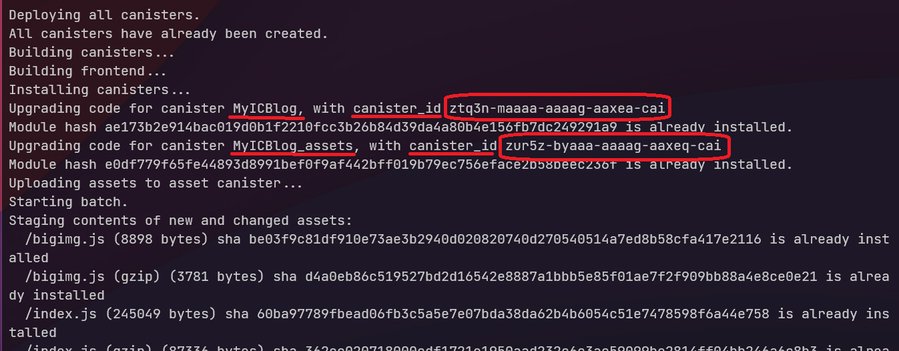

**运行网页的区块链**

用户可以直接通过浏览器或移动端 app 访问 DFINITY 上的智能合约，而不需要经过任何的中心化网页和服务器，更不用出触碰命令行代码。

首先看看以太坊的 dapps，它是一种三层架构：上面是智能合约，用户访问的是前端，沟通它们的是中间件。前端和中间件这两个部分，开发者需要去租中心化服务器。因此这中心化的两层一旦宕机，或者被掌握，对用户来说 dapps 不再可用，这样的事情实际上我们经历过好多次。虽然现在也有一些去中心化的基础设施，但交互起来还有难度。

在 DFINITY 上能运行上述三层架构的每一层。它实现了一种功能的网络分层，这是一种非常先进的架构。代币与操纵代币的智能合约运行在 DFINITY 上，这里和 ETH 类似；同时因为 DFINITY 以软件容器的模式运行，每个容器具备 4GB 的运行内存，业务的数据库也可以运行在 DFINITY 上；因为全球数据中心的支持与各种网络内容分发的优化，前端页面也可以直接运行在 DFINITY 上；上述三层包含在 DFINITY 网络中，因此也不需要中间件。

所以在任何时候，DFINITY 上的 dapps 都是可用的，而不会出现某个链接点的中心化风险；而最最重要的是，这彻底解放了开发者，再也不用去处理多个系统之间交互的复杂度，可以花更多的精力做产品；这也扩展了区块链能做的应用的范围，不只是 DeFi，去中心化的社交网络如 OpenCaht、Canistore、CanCan、Dscvr.one 、Distrikt 都可以实现了。

### 关于容器数据扩容

DFINITY 的优势在于大规模高性能的去中心化数据库存取，DFINITY 的程序以容器为单位运行，容器中会存储业务相关的数据库，且容器之间不会共享状态数据。而目前 DFINITY 容器存储上限是 32G ，如果一个业务容器的 32G 存满之后，容器就需要面临扩容的问题，该如何解决？

目前 DFINITY 能允许容器在存储与带宽等资源即将耗尽时，自动 Fork 出一个新容器进行扩容。新的容器中只保存了最近的状态数据，会丢弃历史。两个容器间依然通过异步调用来实现交互。

同时，在设计容器时，需要把各种级别的数据分开存放。举个例子，如果直接在 DFINITY 上建立一个钱包容器，交易记录的数据量会比用户地址的数据大很多。如果这时候把这两类数据放入一个容器，就会影响后续的扩容能力。

因此我们需要把对最终一致性要求相同的数据放在一起。比如在将钱包的余额与地址放在一起，而交易记录就可以通过分片存放在不同的容器中。从而实现系统的自动弹性扩容。

### 探索新的编程范式

显然想要在 DFINITY 保证安全性地实现复杂应用，我们需要探索新的范式。

最终一致性与确定性在传统互联网的分布式架构下有一些解决方案，这是值得我们借鉴的。DFINITY 上的智能合约需要关注的是数据的最终一致性，从写入和读取入手。

首先当我们需要很强安全性保证时，可能把整个所有的逻辑放在一个容器里面。主要在一个容器中，所有的交易都是原子性的，这里确保了事务与数据两个层面的一致性。但这种方式面临着扩容的噩梦，显然是偷懒的做法。

传统互联网其实关注的是数据库中数据的一致性，而在 DFINITY 中其实分为两个部分：一个是业务层面的，这部分是可以通过更新合约变化的，我们其实不太需要保证这里的原子性；而还有一部分是数据层面的，也就是进入正交持久性的数据，落盘的数据，这才是我们需要保证一致性与原子性的地方。

在 DFINITY 中有使用了名为 stable 的变量类型来定义落盘的数据，这其实类似于传统的数据库，目前也有多个团队在做 DFINITY 的数据库引擎，有了这个底层落盘数据的一致性与原子性，上层的业务的安全性就依靠数据来保证一致性。

如果是借鉴原来分布式事务的概念，我们有四种方式实现这个能力：

* tcc 两端事务提交，这是目前银行转账使用的机制，在交易发生时我们先直接更新数据库的 stable 的最终一致数据，等大家都确认清楚后，再去提交。
* saga 的事务处理机制，首先建立一个事务协调程序，当某个容器需要发起一次跨合约的调用时可以向事务协调程序申请一个 ID，并通过这个 ID 向事务的终结程序汇报，最后大家都提交成功后，再进行整体的提交。
* 使用事务观察者模式，对 stable 的状态进行包装，每当发生状态的更新操作时，观察者都去记录更新前后的两个值，如果发现某一个事务失败，观察者会就使用之前的值回滚操作。

### 原子性问题

一切即 actor ，DFINITY 使用的编程模型与传统区块链有一定差异，反而与传统互联网的 akka 类似。

DFINITY 中的智能合约（即容器）之间的交互也与以太坊不同，DFINITY 的智能合约内部是向存在一个唯一线程，但是容器之间的交互是通过发送异步消息进行，因此容器间可以进行异步操作。如果一个容器向另一个容器发送请求后，需要等待另一个容器的处理结果，才能进行下一步操作。

DFINITY 中存在很多个对等的子网，智能合约会随机的部署上子网。对于部署合约的开发者与使用合约的用户来说，他们并不知道这个合约运行在哪一个子网中，因为片间通讯是无感的。在同一个子网的两个容器的交互，与在不同子网上两个容器的交互，在延迟、安全性、复杂度上都没有差别，因此无法感知到子网之间的差别。这也是异步消息系统的好处。

这样 DFINITY 获得了近乎无限的扩容能力，大大提升了通用计算能力。但这也导致了合约间的交互失去了原子性，而在以太坊上利用原子性特点实现了很多独特的服务，比如 DeFi 的闪电贷清算机制。

在失去了原子性后，开发者面临着新的挑战，特别是在实现 DeFi 应用上，如果依然按照过去以太坊上的编程范式，这导致交易失败后状态无法恢复的问题。

比如，如果在 DFINITY 上实现了设计多个容器交互的复杂应用，比如一个借贷应用，需要与稳定币、借出代币、流动性凭证三个合约交互，三个合约都成功调用才能完成借贷。但如果强行在 DFINITY 实现以太坊范式的调用，如果其中两个合约成功，而最后一个调用没有响应，那么借贷交易会失败，并且前两个合约的状态却已经完成，就会卡住，而不会退回去。表现在用户这边，就是钱已经质押上去，代币已经扣走，却没法完成借贷，也没有收到退款。

# 边界节点

负载均衡、防止 DDoS 、防火墙、CDN

负责对子网保护。收到消息后把消息转发到对应的子网。

## 边界节点

**边界节点**提供IC的网络边缘服务。特别是，他们提供了

* 明确定义的IC入口
* IC的拒绝服务保护
* 从传统客户端（例如网页浏览器）无缝访问IC

为了可以从传统客户端无缝访问IC，边界节点提供了对应的功能，将用户的标准HTTPS请求转换成指向IC容器的输入消息，随后将该输入消息路由至容器所在子网的特定节点副本。而且，边界节点提供了改善用户体验的额外服务：缓存，负载均衡，速率限制以及传统客户端验证来自IC响应的能力。

容器通过ic0.app域名上的URL链接进行标识。初始条件下，传统客户端会寻找URL链接对应的DNS记录，获取边界节点的IP地址，随后发送一个初始的HTTPS请求至该地址。边界节点返回一个基于JavaScript的“服务工作机（service worker）”，以运行于传统客户端。在此之后，传统客户端和边界节点的所有交互都通过这个service worker完成。

Service worker的一项基本任务是利用链钥密码学（详见[章节1.6](#16-链钥密码学chain-key-cryptography）)）验证来自IC的响应。为此，NNS公共的验证密钥被硬编码在service worker内。

边界节点本身负责将请求路由至托管特定容器的子网节点副本。边界节点执行路由所需要的信息从NNS中获取。边界节点保管着一个可以及时响应的节点副本列表并从中随机选择一个。

传统客户端与边界节点间，边界节点与节点副本之间的通信安全都由TLS[4](#dfref-footnote-4)保证。

除了传统客户端外，还可以使用“IC原生”客户端与边界节点交互，其已经包含了service worker的逻辑，不需要向边界节点取回service worker程序。

和节点副本一样，边界节点的部署和配置由NNS控制。

## Service Woker

浏览器发出请求后，浏览器需要先从**边缘节点**下载一个 Service Woker 检查浏览器是否支持 wasm 、用 root key 验证前端的内容。

 Service Woker 负责验证 48 kb 公钥 chain key 

Service Woker 可以验证前端页面是否来自 IC ，是否经过篡改。在第一次打开 IC 的网站时加载，之后直接验证无需下载，清空浏览器缓存之后就得重新下载了。

# Internet Identity

II 是一种身份认证机制，底层原理还是私钥、公钥那些的。
用户只要用自己指纹签名就可以授权应用访问用户的身份。不同的应用对应不同的身份。
而且用户在 II 里保存的每个设备都是一个私钥，用户可以增加、删除设备，也就是用户可以增加删除私钥。所以假如用户手机丢了，相当于丢了一个私钥，只要用anchor在其他设备上登录就可以删除手机这个设备了。
所以不能搜 II 里的别的用户。

所以 II 干的一件事就是把用户不同的设备添加进来，通过 II 的 anchor 对应的 master key 绑定，这个 master key 是托管到 canister 上的，这样只要有一个设备能添加进来，就能更改 II 里保存的设备，用户就不用接触私钥了。这个 master key 可以理解为一个总的私钥，只要有设备绑定在这个总私钥上，就不用担心 II 身份丢失，如果都丢了，就只能靠助记词恢复了。

所以 II 就是一种身份认证机制，II 里没有保存用户信息，只有用户的一个 II 身份，用户相关信息都是由应用自己保存的。

canister 里存的是 anchor 和对应的 master key ，anchor 是从 10000 开始递增。

当一个 anchor 登录不同 dapp 时，身份是不一样的。至于这个身份对应的用户信息是什么：用户名之类的，II 不保存。
在一个 anchor 不同的设备上登录 dapp ，身份是一样的。

# ICP的经济模型

https://github.com/dfinity/awesome-icp

https://github.com/motoko-unofficial/awesome-motoko

介绍完 IC 后总结 IC 的优势

https://old.reddit.com/r/ethereum/comments/rwojtk/ama_we_are_the_efs_research_team_pt_7_07_january/hrngyk8/

不过，V 神在上面的文章中提到，由于跨链桥的存在，跨链存在本质的安全性问题，是关于 51% 攻击，具体看文章吧。

为什么要说 ICP，因为 ICP 可以解决 V 神说的跨链桥问题，ICP 直接「废弃」了桥，换句话说，***ICP 可以实现「无桥跨链」***。

目前 ICP 正在和比特币做集成，集成之后 ICP 中的 Canister 可以：

1. 在比特币网络上直接收取并持有比特币
2. 追溯并且查询他们自己在比特币网络中的 UTXO
3. 创建比特币交易，并接受其他 Canister 中的比特币交易，交易转发到比特币网络

---

### 补充内容：

IC 的特点：

希望：Gas 费不随币价波动就好了。

一个长期被提到的问题：当大多数 Web3 项目至少涉及一些 Web2 基础设施，而这些应用程序又依赖于那些和密码朋克精神违背的中心化软硬件提供商时，它们是如何做到去中心化的？

Web3 的去中心化理念承诺消除用户对科技巨头和主导平台的依赖，同时赋予用户社区权力。实际上，大多数去中心化应用程序 (dApp) 和 DeFi 服务在 Amazon 或 Cloudflare 上运行前端接口。 NFT 通常只是与托管在中心化云上的数据相关的区块链上的哈希。以太坊和其他链背后的许多节点都由 AWS、Google Cloud 和 Microsoft Azure 等云提供商运营。

这主要是因为没有其他满足用户期望体验的选项。开发者更专注于交易速度和用户的可访问性，而区块链通常不能足够快地响应请求和足够有效地扩展，所以开发者难以构建和部署完全在链上运行的 dApp。

“几乎所有 dApp 都使用 Infura 或 Alchemy 来与区块链交互，”Signal 创始人 Moxie Marlinspike 最近写道， “事实上，即使你将像 MetaMask 这样的钱包连接到 dApp，并且 dApp 通过你的钱包与区块链交互，MetaMask 也只是在调用 Infura。”

然而可以完全在链上运行的可扩展 Web3 平台的创新已经诞生，这些服务不依赖于任何像前文中提到的中介，并且保证用户可以完全控制他们的身份和数据。

**要是前端和后端都可以部署上链就好了。** 🥹

Dfinity白皮书——The Internet Computer for Geeks(v1.3)

摘要

智能合约是一种新的软件形式，它将彻底改变软件的编写方式、IT 系统的维护方式，以及应用程序及整体业务的构建方式。智能合约是在去中心化区块链上运行的可组合且自治的软件部件，这使得它们无法被篡改和停止。在本文中，我们将介绍互联网计算机(以下简称IC)，作为一种全新的区块链设计，IC摆脱了智能合约在传统区块链上的速度、存储成本和计算能力方面的限制，使智能合约的全部潜力得以释放。IC允许智能合约第一次实现完全的去中心化，使得前端到后端都能被托管在区块链上。 IC 由一组加密协议组成，这些协议将独立运行的节点相互连接以组成一个区块链的集合。这些区块链托管并执行"容器(Canister)"，即 IC上的智能合约。容器可以存储数据，对数据进行通用计算，并提供完整的技术栈，从而直接为终端用户提供网络服务。计算和存储开销采用“反向GAS模型”，这里需要容器开发人员将IC 的原生代币ICP兑换成cycles进行预付。ICP代币同时也用于治理：IC由去中心化自治组织（以下简称DAO）进行管理，DAO决定变更IC的网络拓扑结构和升级IC协议。

## 1 引言

### 1.1 释放智能合约

因其独具的特性，智能合约是 Web3 的关键推动技术，Web3是一种新的获取网络服务的途径，其应用程序完全由用户控制并在去中心化的区块链之上运行。这种去中心化应用程序（以下简称dapps/dapp）通常是代币化的，这意味着项目方本身的代币被分发给用户作为参与dapps的奖励。参与dapps的方式有很多种，包括审核和提供内容来治理dapp，以及创建和维护dapp。通常来说，代币也可以在交易所进行购买；事实上，通常出售代币来为dapp 开发进行融资。最后代币还可以被用于支付dapp提供的服务或内容。运行在目前的区块链平台上的智能合约，包括最主流的这些（诸如以太坊），都会遇到诸多限制，例如较高的交易手续费和存储成本、较慢的运算速度和无法向用户提供前端服务。因此，很多受欢迎的区块链应用并不是完全去中心化的，而是中心化和去中心化混合的状态，程序的大部分托管在传统的云平台中，对链上的智能合约的调用仅为其功能中极小的一部分。不幸的是，这使得这些应用变得不再去中心化，令它们暴露在许多传统云平台托管的程序的缺点之中，例如受制于云平台的服务商和容易发生单点故障。

  IC是一个新的运行智能合约的平台。在这里，我们使用术语“智能合约”广义上的定义：一种*通用的*，*防篡改*的计算机程序，其在*分布式公共网络*中*自治地*执行。

* *通用的*，是指智能合约这类程序是图灵完备的（即任何可计算的运算都可以用智能合约完成）。
* *防篡改的*，是指程序的指令被可信地执行，并且计算的中间结果和最终结果被准确地存储和/或传输。
* *自治地*，是指智能合约被网络自动执行，不需要任何人采取任何行动。
* *分布式公共网络*，是指计算机网络可被公开地访问的、地理上分布式的，并且不受少数人或组织控制。

此外，智能合约

* 是*可组合的*，意味着他们可以彼此交互。
* 支持*代币化*，意味着他们可以使用和交易代币。

  对比现有的智能合约平台，IC在设计上：

* 更具*成本优势*，特别是允许应用程序以先前平台的一小部分成本，来计算和存储数据；
* 为智能合约的交易处理提供*更高的吞吐量*和*更低的延迟*；
* 更具扩展性，特别是IC可以原生地处理无限量的智能合约数据和计算，因为它可以通过向网络中添加节点来提升容量。

  智能合约可能具备的另一个特性是不可变性，意味着其一旦部署，智能合约的代码就不能由单方面更改。虽然此特性是某些应用程序所必要的，但是并不是所有的应用程序都需要具备该特性，在智能合约有漏洞需要修复时，不可变性也是一个问题。IC允许智能合约有一系列的可变性策略，从完全不可变到单方面可升级，以及介于两者之间的其他选项。

  除了提供智能合约平台之外，IC设计上是一个完整的技术栈，可以构建完全在IC上运行的系统和服务。特别的是，IC上的智能合约可以处理终端用户的HTTP请求，因此智能合约可以直接提供交互式的网络体验。这意味着，构建系统和服务不需要依赖于公司的云托管服务或者私人服务器，从而以一种真正的端到端的方式提供智能合约的所有优势。

**实现Web3的愿景。**对于终端用户而言，访问基于IC的服务在很大程度上是透明的。他们的个人数据比在访问公有云或私有云的应用时更安全，但是与应用程序的交互体验是一样的。

  然而，对于创建和管理基于IC的服务的人来说，IC消除了许多在开发和部署当前的应用程序和微服务时的成本、风险和复杂性。例如，在当前垄断互联网的科技巨头们所推动的整合下，IC平台提供了另一种选择。此外，IC安全的协议可以确保消息的可靠传递、透明可追溯，以及不需要依赖于防火墙、备份设施、负载均衡服务器和故障编排就可以实现的网络弹性。

  构建IC就是要互联网回归其开放，创新和创造性的本源——换言之，*实现Web3的愿景*。针对一些特别的示例，IC做了下述的事：

* 提供互操作性，共享函数，持久化APIs和无主应用程序，上述的所有特点减少了平台的风险，并鼓励创新和协作。
* 自动持久化数据于内存中，无需数据库服务器和存储管理，提升了计算效率并简化了软件开发。
* 简化了IT组织需要集成和管理的技术栈，提升了运营效率。

### 1.2 高阶视角下的IC

大致上，IC是一个与**复制状态机(replicated state machines)**交互的网络。复制状态机在分布式系统[[Sch90\]](#[Sch90])中是一个相当标准的概念，但是我们在这里仍然简单介绍下，从*状态机*的概念开始。

**状态机**是一种特定的计算模型。此类机器维护着一个**状态**，即对应普通计算机中的主内存或是其他形式的数据存储。此类机器按离散的**轮次**进行执行：每一轮中，它接受一个**输入**，对*输入*和*当前状态*应用一个**状态转换函数**，获得一个**输出**和一个**新的状态**。这一*新状态*将变成下一轮次的*当前状态*。

**IC**中的状态转换函数是一个**通用函数**，意味着一些存储在状态中的输入和数据可能是任意的**程序**，这些程序会作用于其他的输入和数据。因此，这样的一个状态机代表了一个通用（即图灵完备）的计算模型。

为了实现**容错性**，状态机可以被**复制**。**复制状态机**包含由**节点副本(replicas)**组成的**子网**，其中每一个节点副本运行相同状态机的副本。即使某些节点副本发生故障，子网也应当继续—并且正常运转。

子网中的每个节点副本都必须按照相同的顺序处理相同的输入。为此，子网中的节点副本必须运行**共识协议**[[Fis83\]](#[Fis83])，来确保子网中的所有节点副本按照相同的顺序处理输入。因此，每一个节点副本的内部状态将按照相同的方式随时间演变，并且每个节点副本会生成完全相同序列的输出。需要注意的是，IC上复制状态机的输入可以是由外部用户生成的输入，也可以是另一台复制状态机生成的输出。类似地，复制状态机的输出可以作为输出导向外部用户，也可以作为输入导向另一台复制状态机。

### 故障模型

在计算机科学的分布式系统领域中，通常会考虑两种类型的节点副本故障：**宕机故障**和**拜占庭故障**。**宕机故障**发生在节点副本突然停机并且无法恢复时。**拜占庭故障**是节点副本可能用任何方式偏离规定的协议。而且，在拜占庭故障下，一个或多个节点副本可能直接处于恶意对手方的操控之中，其可以操纵这些节点副本的行为。在这两种故障类型中，拜占庭故障具有更大的潜在破坏性。

共识协议和实现复制状态机的协议通常会假设**多少**节点副本可能发生故障以及发生**何种程度**的故障（宕机或拜占庭）。IC中假设一个给定的子网若有$n$个节点副本，那么发生故障的节点副本少于$n/3$，并且这些故障可能是拜占庭式。（需要注意的是，IC中的不同子网规模不同。）

### 1.4 通信模型

共识协议和执行复制状态机通常也会对**通信模型**作出假设，描述了对手方延迟节点副本间消息传递的能力。在两个对立端下，我们有如下的模型：

- 在**同步模型**中，存在已知的有限时间限制$\delta$，因此对于发送的任意消息，它会在小于$\delta$的时间内递达。
- 在**异步模型**中，对于发送的任意消息，对手方可以延迟其传递任意有限时间，因此对于传递消息没有时间限制。

由于IC子网中的节点副本通常分布在全球，同步通信模型非常不切实际。事实上，攻击者可以延迟诚实节点副本或是延迟诚实节点副本间的通信，来破坏协议的正确行为。这种攻击通常比控制和破坏诚实节点副本更容易实施。

在全球分布的子网的设定下，最可行和健壮的模型是异步模型。不幸的是，目前没有已知的共识模型在异步模型下是真正可行的（最近的异步共识协议，如[[MXC^+^16]](#[MXC16])，可以达到可观的吞吐量，但是延迟不太好）。所以同其他大多数不依赖于同步通信的实用拜占庭容错系统（例如[[CL99]](#[CL99]), [[BKM18]](#BKM18), [[YMR^+^18]](#[YMR18])）一样，IC选择了一种折衷的方案：**部分同步**通信模型[[DLS88]](#DLS88)。这样的部分同步模型可以有多种构建方式。IC使用的部分同步模型假设，大致上讲，每个子网中节点副本的通信在很短的时间间隔内是周期性同步的；此外，同步时间限制$\delta$不需要被提前知晓。建立这种部分同步假设仅仅是为了确保共识协议的进行（所谓的活性）。确保共识的正确性（所谓的安全性）并不需要这种部分同步假设，同样在IC协议栈的其他任何地方也不需要。

在部分同步和拜占庭故障的假设下，众所周知的是，我们对于故障节点数量$f<n/3$的限制是最优解。

### 当前工作

IC的架构仍在不断演进和扩展。以下是一些即将部署的新功能：

**DAO控制容器。**就像IC的整体配置是由NNS控制一样，任意的容器也可以由其自身的DAO控制，称为**服务神经系统（以下简称SNS）**。控制容器的DAO可以更新容器逻辑，也可以下达特殊权限命令让容器执行。

**ECDSA阈值签名。**ECDSA签名[[JVM01\]](#JVM01)被用于加密货币，如Bitcoin和Ethereum，以及许多其他应用程序。虽然阈值签名已经是IC中的重要组成部分，但并不是ECSDA阈值签名。而这项新特性将允许单个容器控制ECDSA签名密钥，这些签名密钥安全地分布在托管该容器子网的节点副本中。

**Bitcoin和Ethereum集成。**基于新的ECDSA阈值签名，这一特性将允许容器与Bitcoin和Ethereum链交互，包括直接签名链上交易。

**HTTP集成。**此功能将允许容器读取任意网页（IC外部的）。
