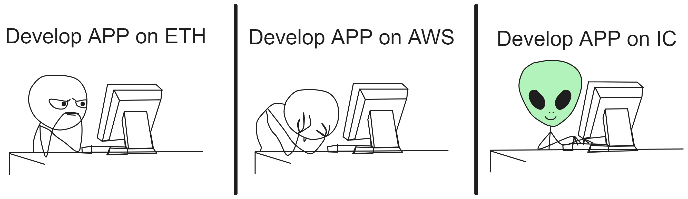
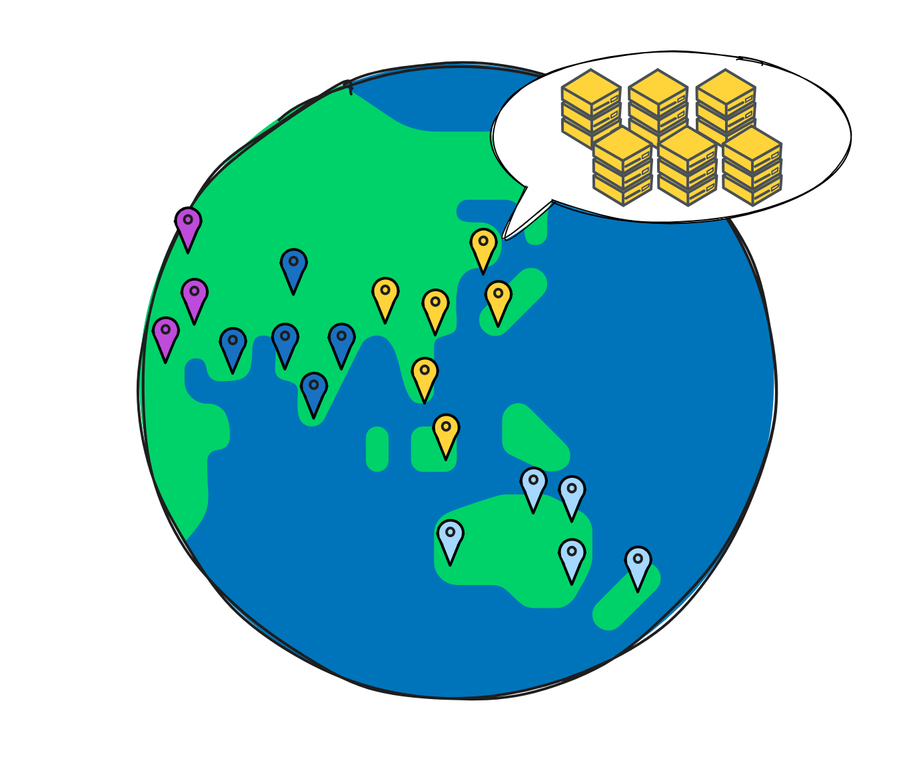
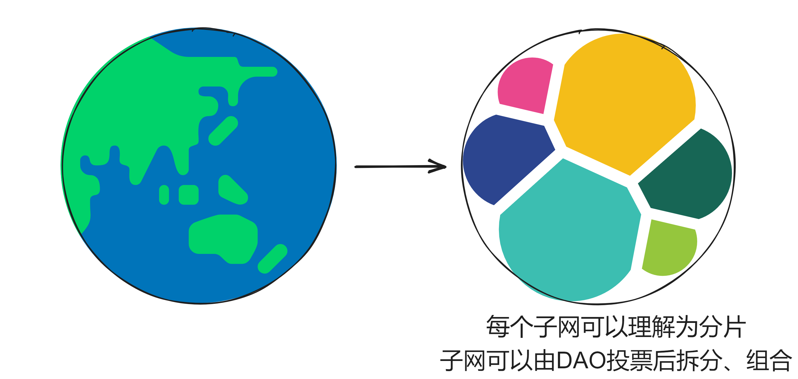
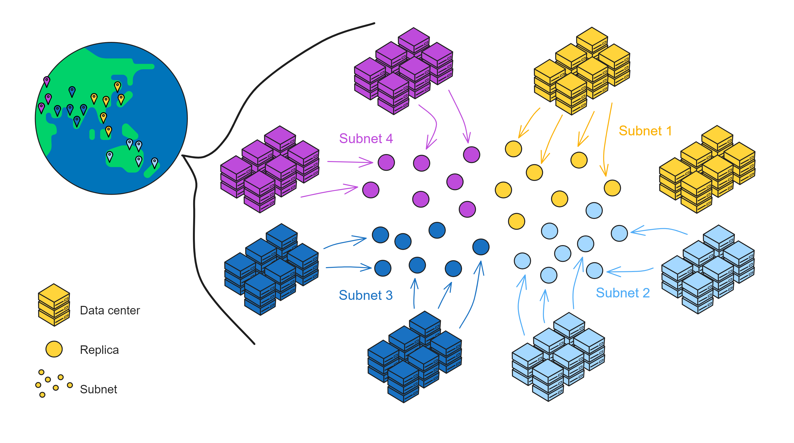
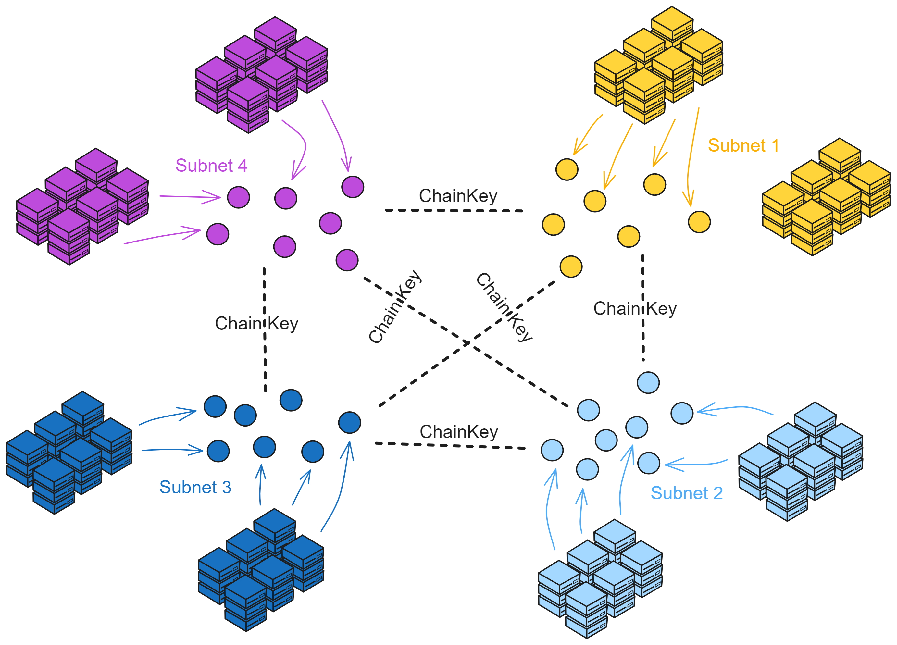
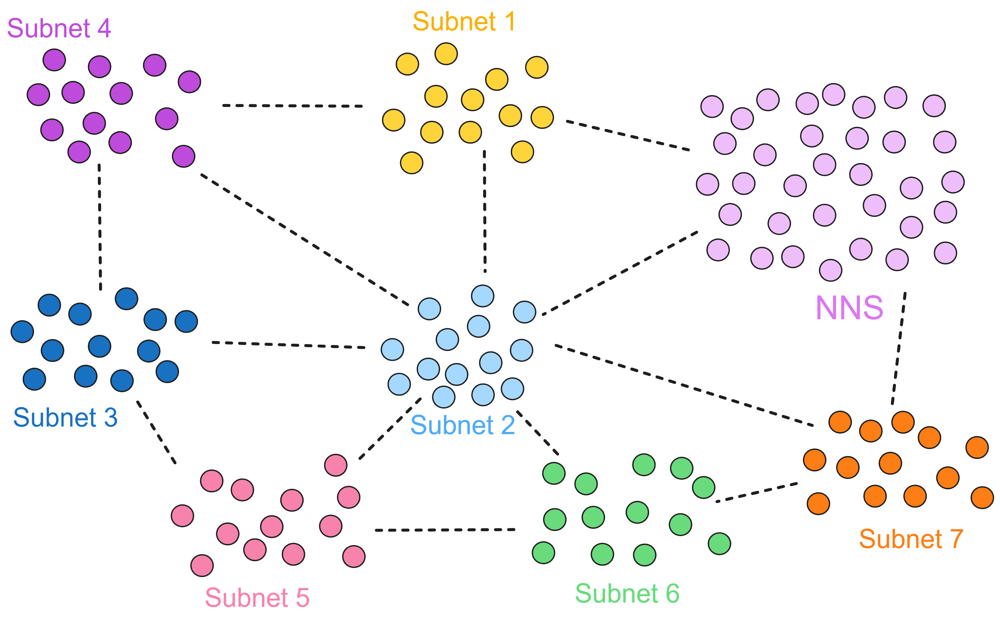
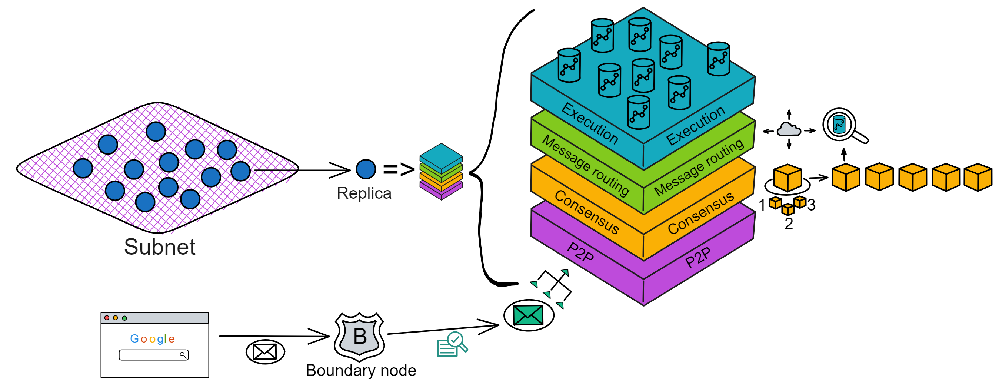
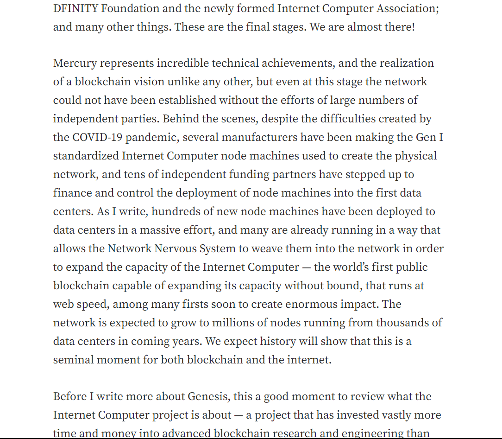
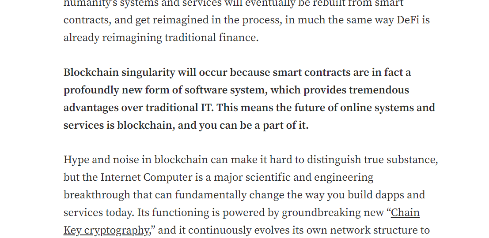

# 概述

什么是 IC 和 ICP ？

* IC 的全称是互联网计算机（Internet Computer），是专门为去中心化应用设计的高速区块链网络。

* ICP 是互联网计算机协议（Internet Computer Protocol），也是代币的名称。

互联网计算机（IC）的出现为软件开发带来了革命性的变化。它让开发者能够直接在去中心化云上构建应用，摆脱了对传统中心化云服务的依赖，降低了开发和运维的成本。IC 的安全性和高性能使得应用和服务的安全性得到极大的提高。IC 为软件开发的新时代带来了巨大的机遇和挑战。

IC 的愿景是成为一个提供无限扩展性、安全性和去中心化治理的全球性计算平台。

IC 是通过结合分片、VRF 随机数、BLS 阈值签名、DKG 、嵌入 DAO 治理模型等技术构建的高性能去中心化云服务。

那它性能到底有多高呢？

子网们的目前确认区块速度为一秒 36 个区块。

目前每秒可以处理 6355 笔交易。

这里可以查到 IC 网络上的[实时数据](https://dashboard.internetcomputer.org/)。随着子网越来越多，这个数据在未来也会越来越高。

## 互联网计算机：改变软件开发的新时代

互联网计算机（IC）是基于互联网计算机协议构建的一种全新的区块链设计。它的核心部分分为 4 层，运行在各个子网的节点上。通过运行核心协议，一个子网的节点实现了一个基于区块链的复制状态机，该状态机独立于其他子网取得进展（但与它们异步通信）。IC 采用多子网分片结构，在保持去中心化的同时，克服了传统区块链的性能瓶颈。这种架构可以使 IC 无限生成子网（分片），使 IC 几乎不受限制地扩展。
IC 通过创建新子网来横向扩展其容量，就像传统的云基础设施通过添加新机器来扩展一样。一旦 IC 的网络神经系统（NNS）决定创建一个新子网，它就会选择一组尚未分配到任何子网的备用节点，并创建新子网的初始配置。然后，选定的节点组成一个新的子网区块链。

IC 摆脱了智能合约在传统区块链上的速度、存储成本和计算能力方面的限制。使智能合约实现完全的去中心化，前端到后端都能被托管在区块链上。IC 的智能合约叫容器（Canister）。容器可以存储数据，对数据进行通用计算，并提供完整的技术栈，直接为终端用户提供网络访问服务。

计算和存储开销采用 “ 反向 Gas 模型 ” ，Gas 费由部署 Canister 的开发人员将原生代币 ICP 兑换成 Cycles 支付。ICP 代币同时也用于治理：IC 由去中心化自治组织（以下简称 DAO ）进行管理。IC 底层直接嵌入了 DAO ：Network Nervous System 。DAO 可以决定变更 IC 的网络拓扑结构和升级 IC 协议。

IC 还可以与其他区块链互操作。IC 的链密钥签名技术使其能够与其他区块链进行交互，集成其他加密货币。

IC 使用 WebAssembly（Wasm）作为代码执行的标准，所以开发者可以使用多种流行的编程语言（如 Rust、Motoko、Java 等）编写智能合约。

传统 IT 开发者面临许多问题：必须通过众多商业云服务、云工具、操作系统的专有和开源变体、数据库和防火墙等组件、虚拟化技术，软件开发平台等等一系列的关卡，要去解决组装系统的高度自定义、维护它们所需的特殊开发人员的人工成本，以及相关的供应商关系，使得随着需求的变化、迁移和调整旧系统变得昂贵且困难的问题。随之而来的便是高昂的开发运维成本，以及中心化存储数据的安全问题。

DFINITY 互联网计算机可以让开发者在一个开放世界中构建应用、企业系统和互联网服务类 APP ，在基于区块链去中心化理念下，保证它可以安全运行并且可以经受住时间的考验。IC 可以自动扩展、抵抗攻击、从不宕机。这种新颖的设计使得开发者能够专注于创造新应用和服务，而不必担心底层基础设施的安全性、成本和可扩展性。这对于软件开发的新时代具有深远的影响。

# 架构

IC 的架构特立独行：

各个**数据中心**的**节点（Node）**通过节点软件 IC-OS 虚拟化为很多个**副本（Replica）**，再随机选取一些副本组成一个**子网（Subnet）**。一个子网由多个数据中心的节点组成。每个节点都用 IPv6 建立 TCP 会话，与 NNS 节点、同一子网里的其他节点连接。

**NNS（Network Nervous System）** 是嵌入 IC 的治理系统，一个 DAO ，持有 ICP 的任何人可以对 NNS 上的提案投票表决。

比特币网络的节点随时随地想加入就加入，可这样带来的问题是确认交易的速度太慢了；联盟链是先确定了网络中的几个节点，然后由这几个固定的节点达成共识，那速度嗖嗖的。而 IC 结合了他俩的优点，像联盟链一样由几个固定节点组成子网，节点（副本）之间达成共识的速度非常快，并由一个 DAO：NNS，来控制子网和节点们（副本们）。一举两得。

IC 在区块链协议底层集成了一个 DAO ：**DAO控制网络（DAO-controlled network）**。由这个 DAO 来控制每个子网，配置网络的拓扑结构，创建子网 公钥，并且升级副本的协议版本。因此所有 NNS 的决策都由社区成员决定，社区成员的投票权重由其在 NNS 中质押的 IC 原生治理代币数量决定。

如果大家投票通过了提案，NNS 里的 Canister 会自动执行决策。比如，如果一个提议改变网络的拓扑结构的提案被通过，NNS 将自动使用新配置来更新注册表 Canister 。

NNS 也是帮助 IC 网络实现自我进化的去中心化治理系统。NNS 的目的是让互联网计算机网络以一种开放、去中心化和安全的方式进行管理。它是 IC 的系统子网，控制着 IC 的子网。它还可以对节点升级协议；调节 Gas 代币 Cycles 与 ICP 的兑换比例；在极端情况下，它甚至可以冻结恶意的 Canister ，以保护网络。

副本可以理解为是子网里虚拟化出来的 “ 虚拟节点 ” 。在以下内容中，我们就把 IC 的 “ 节点 ” 叫做副本了。

IC 的子网类似分片（Sharding）思想。分片技术是一种区块链扩容方案。拿比特币举例，全世界的节点都在抢一个区块的记账权，相当于是一个覆盖整个地球的网络。如果所有亚洲的节点组成一个 “ 比特币子网 ” ，欧洲、非洲、美洲、大洋洲也都组成自己的子网。那么交易在子网里达成共识，这样节点相对少一点、通信距离更短，可以提升一些性能了。

IC 由许多个子网组成，没有母网、主链、侧链、信标链这种概念，每个子网之间是平等的（除了 NNS）。每个子网独立运行，子网内部达成共识出块，没有比特币那样的 “ 全局共识 ” ，不同的子网同步并行出块。可以理解为每个子网都是一条区块链，许多链共同组成了 IC 。跨子网的通信在 IC 底层靠 **ChainKey** 解决。开发者和用户都不用在意智能合约被部署在哪个子网里、怎么跨子网通信等等问题。

ChainKey 是互联网计算机背后的核心技术，它解决了 IC 的子网之间互相通信的问题。ChainKey 使每个子网根据 **root key** 生成自己唯一的**子网公钥** ( Subnet Key ) 。这是 IC 无限扩展性能的基础技术。

每个子网都有一个只有 48kb 的公钥。任何人都能验证自己收到的消息是不是 IC 网络发过来的、有没有被篡改，当然各种物联网设备和其他区块链也能验证来自 IC 的信息。相比之下，去验证 ETH 这类传统区块链时，因为每次出块都由不同的节点签名，设备需要同步几百 GB 的签名数据。而在 IC ，所有副本一起签名一个区块。因此设备只需要保存 48kb 的唯一公钥即可验证每个区块。

子网可以随着网络的资源使用情况动态地增加、删减、合并、拆分。子网的数量没有上限，所以理论上支持 “ 无限扩容 ” ，在世界各地新增子网。

可是由谁来决定子网们的拆分重组呢？NNS！

NNS 是一种特殊子网，也和别的子网一样由一些节点组成， **NNS 可以管理其他子网**。不过 NNS 子网的节点比较多，安全性自然也比其他的子网高一些。数据中心成为节点、某个节点加入哪个子网、某个子网由哪些节点组成、选几个节点创建新子网、把一个子网拆分成几个子网等等，这些操作都需要获得 NNS 的许可。

许多子网的这种架构使 IC 可以无限扩展。

IC 协议的核心部分分为 4 层，运行在各个子网的节点上。现在我们把视角转入子网内部，看一看 IC 的核心协议。为了方便理解，我把子网的俯视图转为侧视视角；紫色格子方块代表子网，蓝色小球代表子网里的副本。

IC 核心协议总共有 4 层，每个副本都有这 4 层结构。从下到上依次是 P2P 层、共识层、消息路由层、执行层：

* **P2P层**，收集和发送来自用户、子网中的其他副本和其他子网的消息。保障消息能传递到到子网中的所有节点，以确保安全性、可靠性和弹性。
* **共识层**，对处理消息的顺序达成共识。然后这些区块被传递到消息路由层。
* **消息路由层**，转发消息。共识层将区块敲定后，相应的荷载会被传递给消息路由层。由消息路由输入执行层。

* **执行层**，运行 Canister 的地方。执行层更新复制状态机中相应 canister 的状态，完成智能合约的计算任务并将输出交给消息路由层处理。

互联网计算机由互联网计算机协议（ICP）驱动，其实用代币 ICP 代币因此得名。IC 协议的核心部分，是一个在每个子网节点上运行的 4 层协议。通过运行核心 IC 协议，子网的节点实现了一个基于区块链的复制状态机，该状态机独立于其他子网进行操作（但与之异步通信）。这种许多同时操作的子网架构使 IC 能够实际上无限扩展。子网处理消息，这些消息由用户提交或来自其他子网。

底部两层，P2P 和共识，共同实现对传入消息的选择和排序，并以数据块的形式向上层提供消息。上面两层，消息路由和执行，从堆栈的底部接收包含有序消息的区块，并在子网的每个节点上以完全确定性的方式执行它们。这实现了一个复制的状态机，其中子网中的每个节点在每一轮都从相同的起始状态转换到相同的结束状态（必须确保每个节点以相同的顺序执行相同的消息，即完全确定性）。

## P2P层

P2P 网络就像一个大型的聚会，参加聚会的人都是子网里的副本。在这个聚会上，人们想要分享最新的消息，并且希望尽可能多的人都听到这些消息。但是让每个人都大声喊出完整消息很费劲（占用网络资源），我们可以采取一种更高效的方法。

这个方法就是**公告-请求-传递**机制。就像在聚会上，有人（副本）大声宣布：“嘿，我有个大新闻要分享！”这个宣布就是一个小**公告**。其他人（其他副本）听到这个公告后，如果他们觉得这个消息很重要，就会走过去（**请求**）并要求那个人告诉他们具体的消息内容（**传递**）。这个过程可能会牺牲一些时间（延迟），但是它能够节省体力（降低带宽使用）。

如果这个聚会非常大，把它想象成一个巨大的音乐节现场。在这样一个庞大的场合下，公告-请求-传递机制会在一个**覆盖网络（overlay network）**上运行。这个覆盖网络就像一个大型的朋友圈子，每个人都只和他们的好友（**对等节点/peers**）分享消息。 

当某个人想要广播一个消息时，他会先告诉自己的好友这个消息的公告。那些好友在收到公告后，可能会请求消息的传递，并在满足特定条件的情况下，把这个消息的公告告诉自己的好友。这就像一个**八卦网络（gossip network）**。

P2P 层通过公告-请求-传递机制以及在覆盖网络上运行，能够在牺牲一定延迟的情况下，有效降低带宽使用，从而实现高吞吐量的目标。

## 共识

共识由子网内部的副本们达成。

IC 共识层的任务是对输入消息进行排序，以确保所有的副本按照相同的顺序处理输入消息。这些消息是用户与 canister 之间的通信、canister 之间的通信以及这些通信的顺序。

通过随机数排序选择谁先出块。如果被选中的副本没有故障问题，它就会出块，并广播给大家验证。大家觉得没问题，给出自己的公证片段。公证片段达到三分之二后，形成对这个区块的公证。如果大多数副本只对这一个块做过公证，大家会用敲定作为对区块的最终确认。

共识

每个区块链都需要一个共识机制，允许节点就要处理的消息以及它们的排序达成一致。共识是驱动 IC 子网的核心 IC 协议组件。每个子网都是一个运行 IC 核心协议（包括共识）的区块链，独立于其他子网。共识协议的目的是在给定轮次中，为子网的每个节点输出相同的有序消息区块，以便每个节点在确定性执行这些消息时进行相同的状态转换。

IC 的共识协议旨在满足以下要求：低延迟（几乎即时最终确定性）；高吞吐量；鲁棒性（在节点或网络故障时，延迟能力和吞吐量的优雅降级）。IC 共识协议还提供了加密保证的最终确定性。这与比特币等协议形成对比，后者只提供概率性最终确定性，即在区块链中有足够数量的区块建立在其上时，一个区块被认为是最终的。

## 消息路由

共识层将输入打包进区块的**荷载**中，并随着区块被最终确认，相应的荷载会被传递给**消息路由层**并由**执行环境**处理。执行层将随之更新复制状态机中相应容器中的状态，并将输出交由**消息路由层**处理。

有必要区分两种输入类型：

* 入口消息：来自外部用户的消息

* 跨子网消息：来自其他子网的容器的消息

我们同样可以区分两种输出类型：

* 入口消息响应：对于入口消息的响应（可被外部用户取回）

* 跨子网消息：传输给其他子网容器的消息

当收到来自共识的负载后，这些负载中的输入会被置入不同的**输入队列**。

对于一个子网下的每一个容器 $C$，都存在多个输入队列：用于发给*$C$*的的入口消息，用于和$C$通信的每一个别的容器$C$'（如果$C'$和$C$不在同一个子网，将会是跨子网消息）。

在每一轮中，执行层都会消耗这些队列中的一些输入，更新相应容器中的复制状态，并将输出置于不同的**输出队列**中。

对于一个子网下的每一个容器$C$，都存在多个输出队列：对于每一个与$C$通信的容器$C'$，都有其各自的队列（如果$C'$和$C$不在同一个子网，将会是跨子网消息）。消息的路由层将取得消息队列中的消息并置入**子网间数据流**，以被**跨子网传输协议**处理 ，该协议的工作是将这些消息实际传输到其他子网。

除了这些输出队列外，同时存在一种**入口历史**的数据结构。一旦一条入口消息已被容器处理，对该条入口消息的**响应**将被记录在该数据结构中。此刻，提供该条入口消息的外部用户将能够获取相关的响应。（注意入口历史并不保留所有入口消息的完整历史）

需要注意的是，节点副本的状态包括容器的状态以及“系统状态”。“系统状态”包括上述提及的队列，数据流以及*入口历史*的数据结构。因此，消息路由层和执行层同时参与更新和维护子网的副本状态。此状态应全部在完全**确定性**的原则下被更新，这样所有的节点都会维护完全相同的状态。

另外需要注意的是，共识层解耦于消息路由层以及执行层，也就是说传入荷载之前，共识区块链中的任何分叉都已经被解决了。事实上，共识层允许提前运行，并不需要和消息路由层保持完全一致的进度。

在每一轮中，子网的一部分状态会被验证。每轮认证状态采用链钥密码学进行验证。除了别的之外，给定轮次中的验证状态包括

* 最近添加到子网间数据流中的跨子网消息
* 其他元数据，包括入口历史的数据结构

每轮认证状态利用了阈值签名技术验证

在每个 IC 轮次中，消息路由组件从共识接收一个要处理的消息块 - 子网上的每个节点都有相同的块 - 并将消息放入目标容器的输入队列中，这个过程称为引入。然后，它触发执行轮次，这将可能导致执行的容器的输出队列中出现新的容器消息。一旦执行完成，消息路由组件将输出队列中的消息路由到接收方。

接收方可能包括位于不同子网的容器。消息路由层实现了子网之间的互通容器消息的路由，以便这些消息可以包含在数据块中，并在接收方的子网上引入。这被称为跨子网消息或简称为 XNet 消息。安全的 XNet 消息是松散耦合子网架构的关键要素，因此是 IC 可扩展性的先决条件。

消息路由层实现的另一个关键功能是状态认证，即子网在每轮次中以分散的方式认证复制子网状态的一部分。这种认证在其他方面用于其他子网验证子网到子网流的真实性，或允许用户真实地读取之前由他们提交的消息的处理状态。状态认证和安全的 XNet 消息使得容器能够在子网边界之间安全透明地通信，这是任何具有多个分片的区块链都面临的挑战。

## 执行

在那些数据中心的 Canister 里消耗的 Cycles 和这个数据中心获得的 ICP 的数量是动态平衡的。奖励多少 ICP 是根据数据中心对 IC 网络做出的贡献决定的，在数据中心部署的 Canister 越多提供算力、储存数据就越多，奖励的 ICP 也多。

IC 中的基本计算单元叫做容器。IC提供了运行环境，使得容器中可以执行程序，并可以（通过消息）与其他容器和外部用户通信。

执行层一次处理一个输入消息。这一输入消息取自输入消息队列，并导向到一个容器。根据此输入消息和该容器的状态，执行层环境将更新容器的状态，另外将消息加入输出队列并更新*入口历史*（可能包括对更早的入口消息的响应）。

每个子网都可以访问**分布式伪随机生成器(PRG)**。二进制伪随机数的种子是被称为随机磁带(Random Tape)(参见[章节1.6.1](#161-阈值签名)，详见[第3章](#3-链钥密码学i阈值签名))的阈值签名。共识协议的每一轮都会有一个不同的随机磁带。

随机磁带的基本特性有

1. 在块高ℎ的区块被任意诚实节点副本确认之前，块高ℎ+1的随机磁带是不可预测的。
2. 在块高ℎ+1的区块被任意诚实节点副本确认的时间点前，节点副本已经有构建块高ℎ+1的随机磁带的所有片段

例如在轮次ℎ时，子网为获得二进制伪随机数，需要从执行层发起“系统调用”。系统随后将响应块高ℎ+1的随机磁带。根据上述的特性（1），协议保证在子网发送请求时，请求的二进制伪随机数不可预测。事实上，共识层会将随机磁带和荷载都传递给消息路由层；根据上述的特性（2），一般不会引起任何额外的延迟。

执行层是核心 IC 协议堆栈的顶层，负责执行容器智能合约代码。代码执行是通过部署在每个节点上的 WebAssembly（Wasm）虚拟机完成的。WebAssembly 字节码可以确定性地执行，这对于区块链系统非常重要，并且具有接近本机速度。容器消息，即用户的入口消息或其他容器的消息，在子网上的容器的队列中被消息路由引入。然后，消息路由将控制权交给执行层，该层确定性地执行消息，直到消耗掉容器队列中的所有消息，或达到该轮次的周期限制，以确保有限的轮次时间。

执行层具有许多独特的功能，这使得 IC 区别于其他区块链：

1. 确定性时间分片（DTS）- 需要执行数十亿条 Wasm 指令的非常大的消息的执行可以跨多个 IC 轮次进行拆分。这种在多轮次执行消息的能力是互联网计算机区块链所独有的。
2. 并发 - 在多个 CPU 核心上同时执行容器 Wasm 字节码，这是因为每个容器都有自己的隔离状态。
3. 伪随机数生成器 - 执行层可以访问不可预测且无偏的伪随机数生成器。现在，容器可以执行需要随机性的算法。

## 组合阐述

我们追踪记录一个用户请求在IC上的典型流程。

**查询调用**

1. 用户通过用户端向边界节点发送对于容器$C$的请求消息$M$，边界节点将消息$M$发送给托管着容器$C$的子网节点副本。在收到$M$后，节点副本将计算响应并通过边界节点发回给用户。

**更新调用**

1. 用户通过用户端向边界节点（详见[章节1.9](#1.9 边界节点)）发送对于容器$C$的请求消息$M$，边界节点将消息$M$发送给托管着容器$C$的子网节点副本。

2. 接收到消息$M$后，该节点副本通过P2P层（详见[章节2.1](#2.1 P2P层)）向子网中的所有节点副本广播消息$M$。

3. 在接收到消息$M$的情况下，共识层下一轮的主节点（详见[章节2.2](#2.2 共识层)）会将消息$M$和其他输入一同打包进其提议的区块$B$。

4. 一段时间之后，区块$B$被最终确认，其荷载被发送至消息路由层（详见[章节2.3](#2.3 消息路由)）进行处理。需要注意的是，P2P层同样用于共识层去确认区块。

5. 消息路由层会将消息放置在容器$C$的输入消息队列中。

6. 一段时间之后，执行层（详见[章节2.4](#2.4 执行层)）会处理消息$M$，并更新容器$C$的内部状态。

    在一些情况下，容器$C$立即能够计算对于请求消息$M$的响应$R$。在这种情况下，响应$R$会被记录在入口历史的数据结构中。

    在其它情况下，处理请求消息$M$需要向别的容器发起请求。在这个例子中，我们假设为处理请求消息$M$，容器$C$需要向另一个子网的另一个容器$C'$发起请求$M'$。这第二个请求$M'$会被放置在容器$C$的输出队列中，然后接下去的几步将被执行。

7. 一段时间之后，消息路由层会将调用请求$M'$移动到合适的跨子网数据流中，最终将会被传输到托管容器$C'$的子网。

8. 在第二个子网中，获取来自第一个子网的请求$M'$后，其会通过共识层和消息路由，最终由执行层进行处理。第二个子网的执行层会更新容器$C'$的内部状态，然后生成对于请求$M'$的响应$R'$。响应$R'$会进入容器$C'$的输出队列，最终放置在跨子网数据流中被传输回第一个子网。

9. 回到第一个子网，当其获取来自第二个子网的响应$R'$后，响应$R'$经由共识层和消息路由层，并最终由执行层进行处理。第一个子网的执行层会更新容器$C$的内部状态，然后生成对于原始请求$M$的响应$R$。这一响应$R$会被记录在入口历史的数据结构中。

&emsp;&emsp;无论是哪条执行路径，对于请求消息$M$的响应$R$，最终会被记录在托管容器$C$的子网的入口历史数据结构中。为了获取这一响应结构，用户端必须执行“查询调用”（详见[章节2.3.2](#2.3.2 查询调用(query calls)和更新调用(update calls))）。就像在[章节2.3.1](#2.3.1 每轮认证状态(Per-round certified state))中所阐述的，这一响应可以被链钥密码学（具体来说，使用的是阈值签名技术）进行验证。这一验证逻辑本身（即阈值签名认证）可以被用户端执行，其使用了最初从边界节点获取的service worker。

发起请求的总时间：

我已经看到了一些关于交易延迟/最终时间的不同数字，而且它们似乎在过去几年中发生了一些变化。在创世纪直播聊天中，Kyle Peacock 提到了 3-7 秒的延迟。在此 AMA 中，我听到应用子网为 1 秒，NNS 为 3 秒。最终数字是多少？它们有多稳定？

此外，是否有通过更新协议进一步减少延迟的空间？假设的最小值等于数据中心的最高 ping 延迟，所以大约 300-400 毫秒，对吗？我想我想知道这离“完美”的共识机制有多近:)

子网的确切延迟取决于许多因素，包括副本数量、网络拓扑和它们之间的真实世界延迟。此外，阻塞时间并不完全是从发送入口消息到收到回复之间的延迟，这在一天结束时才是最重要的。副本需要时间来接收您的消息，并且只会将其包含在下一个块中。然后需要时间来完成和执行。客户端（例如浏览器）也在轮询以查看计算结果是否准备就绪，因此这也需要时间。仍有优化空间。

我们提供了良好的安全性/可扩展性/去中心化水平。

> Dfinity 的 IC 是结合了目前最先进的区块链技术吗？

是的，Dfinity 的 IC（Internet Computer）是结合了目前最先进的区块链技术的。它是一个去中心化的计算平台，具有高速、安全、可扩展的特点。

Dfinity 的 IC 基于区块链技术，并引入了许多先进的技术，如共识算法、加密技术、去中心化技术等，以保证网络的安全性和可靠性。同时，IC 还提供了强大的计算能力，可以支持大量的数据处理和应用开发。

总之，Dfinity 的 IC 是一个先进的、去中心化的、高速、安全、可扩展的计算平台，是目前区块链技术的体现。

> 你估计 dfinity 目前可以处理的最大每秒交易量是多少，你估计它在一年后能够处理多少？

我不是开发人员，但我知道“每秒事务数”不是 IC 的正确指标。随着更多子网的添加，可以执行更多事务。因此 TPS 是无限的。提示在无限徽标中。

但是，每个单独的容器都有吞吐量限制。这受到硬件性能的限制。目前，我们将事务限制设置为每个子网每秒执行大约 300 条消息，子网越多，容量越大。在撰写本文时，有 10 个子网，我们正在添加更多子网。

此限制只是避免系统过载的标准，绝不是指示性性能指标。此外，目前真正的限制在于 CPU，即容器处理每条输入消息并给出经过认证的回复的速度。在我们的实验中，如果容器计算花费零时间，TPS 可以高出一个数量级。

性能是一件复杂的事情，远不止 TPS。我本人不相信任何 TPS 声明。所以请不要在这里相信我的话。最后，重要的是完整的用户体验。我们刚刚推出，还有很大的优化空间。

# Chain Key

互联网计算机协议使用高级加密机制工具箱，统称为链密钥加密，它允许 IC 实现其他区块链无法实现的功能和可扩展性。

链密钥密码术的一个关键组成部分是阈值签名方案，它类似于普通的数字签名方案，不同之处在于秘密签名密钥分布在子网中的所有副本中，这样密钥就不会被泄露窃取子网中的一个（甚至很大一部分）副本。该技术有很多好处，包括：

1. 任何人都可以通过简单地验证签名来验证从互联网计算机接收到的内容，而无需同步整个区块链。
2. IC 的拓扑结构可以自主演化——可以添加新的节点和子网，可以恢复故障节点，可以自主升级协议。
3. canister 的不可预测和无偏伪随机数的来源。容器可以安全地运行需要随机性的算法。

链锁密码学技术 （ Chain Key ）通过聚合签名，让子网节点产生一个唯一的公钥签名 ( 子网 key / Subnet Key ) 。这是 IC 无限扩展性能的基础技术。

每个子网可以看成是一个独立的 “ 小区块链 ” ，子网之间靠 Chain Key 通信。因为已经在子网内部达成共识了，所以只要通过 Chain Key 验证就行了。

每个子网根据 **root key** 生成自己的**子网公钥** ( 子网 key / Subnet Key ) ，子网之间通信依靠子网公钥验证数据的真实性，所以不用下载其他子网的旧区块数据，可以直接发请求过去。

>   子网 1 用自己的子网 key 对信息签名，然后发给子网 2 ，子网 2 收到信息后用子网 1 的 key 验证信息。
>
>   只要拿着某个子网 key ，就能随时随地验证这个子网上的信息是否正确。每个 key 只有 48 kb 。

root key 是公开的，客户端浏览器可以用 root key 验证消息是不是 IC 网络发过来的、有没有被篡改。

ChainKey 是互联网计算机背后的核心技术，它为 DFINITY 的区块链创建了一个只有48字节的唯一公钥。因此任何的设备，即使是智能手表，也能亲自去验证 DFINITY 的链。

相比之下，去验证 ETH 这些传统区块链时，因为每次出块都由不同的节点签名，设备需要同步几百 GB 的签名数据，而在 DFINITY 中，所有节点一起签名一个区块，因此设备只需要保存 48 个字节的唯一公钥即可验证每一个区块。

这只是 ChainKey 技术的冰山一角，它还能运行节点任意的退出与加入网络，从而轻松的把新节点接入网络进行扩容，这都归功于非交互式分布式密钥生成（Noninteractive Distributed Key Generation）技术的突破。

同时，每一个“子网/分片”都具备自己的唯一公钥，不同“子网/分片”上合约的互相调用，之需要使用这个“子网/分片”的公钥去验证它发来的区块消息即可，这就极大的优化了“片间/网间”的通讯问题。

如果能如此轻松的对区块链进行验证，那我们是不是能在其他的区块链上直接运行一个 DFINITY 的验证节点？没错，ChainKey 极易验证的特性也让 DFINITY 天然适合跨链操作，我们甚至可以在一个 ETH 的智能合约中存下 DFINITY 的区块链公钥，直接进行跨链交易的验证。这会带来大量的业务空间！

> 有一个简单的问题：所有的块都是永久存储的吗？

我们不依赖历史区块进行验证。所以每个副本只存储足够的块来保持网络健康（例如帮助其他副本赶上），并在不再需要时删除旧的。

这也是由于终结算法。一旦输入块最终确定，我们确信可以确定地计算新状态，并且只需要保持最新的容器状态。较旧的块和较旧的状态不是那么有用。

> 这里的关键创新是什么？ICC 协议如何或为什么比具有汇总和分片或类似协议的以太坊更好？

我认为子网实际上是共识的孤岛这一事实是主要的创新。有了链密钥，它们可以安全地相互通信，仍然形成一台互联网计算机，但因为不需要“全球”共识，我们可以通过添加子网来横向扩展。

# NNS

IC 的去中心化不是比特币以太坊那样，随时随地、想加入就加入，而是加入退出不受任何第三方中心化机构约束

节点加入网络之前需要经过 DAO 投票同意。

https://www.bilibili.com/video/BV1La411C7i8/?vd_source=db5bf130bc81934e0880088323df6748

在区块链协议里直接嵌入 DAO 来治理。

## 权限模型

最早的共识协议（例如PBFT[[CL99\]](#[CL99])))）是**有许可的**，也就是说构成复制状态机的节点副本是受一个中央组织管理，其决定了哪些实体可以提供节点副本，网络的拓扑结构，并且可能还实现了某种中心化的公钥基础设施。许可共识机制通常效率是最高的，尽管它们避免了单点故障，但是中心化管理对于特定的应用程序是不可取的，并且这违背了蓬勃发展的Web3时代的精神。

最近，我们看到了**无许可的**的共识协议的兴起，例如Bitcoin[[Nak08\]](#Nak08)，Ethereum[[But13\]](#But13)和Algorand[[GHM+17\]](#GHM17)。这些协议基于**区块链**，采用**工作量证明（以下简称PoW）**（例如Bitcoin，Ethereum2.0之前）或是**权益证明机制（以下简称PoS）**（例如Algorand，Ethereum2.0）。尽管这些协议是完全去中心化的，但是他们比有许可的协议效率更低。我们也需要指出，正如[[PSS17\]](#PSS17)所观察到的，基于PoW机制的共识协议例如Bitcoin，在异步通信网络下并不能保证正确性（即安全性）。

IC的权限模型是一个**混合模型**，在拥有有许可协议的效率的同时提供去中心化PoS协议的许多好处。这个混合模型叫做**DAO控制网络（DAO-controlled network）**，（大致上讲）按如下机制工作：每个子网运行一个有许可的共识协议，但是由一个**DAO**决定哪些实体可以提供节点副本，配置网络的拓扑结构，提供公钥基础设施，并且控制节点副本部署的协议版本。IC的DAO被称为**网络神经系统（以下简称NNS）**，基于Pos，因此所有NNS的决策都由社区成员决定，社区成员的投票权由其在NNS中质押的IC原生治理代币（关于该代币的细节详见[章节1.8](#18-功能代币)）数量决定。通过这个基于PoS创建的治理系统，可以创建新的子网，可以在现有子网中增加或者移除节点副本，可以部署软件更新并且可以对IC进行其他调整。NNS本身是一个复制状态机，（和其他状态机一样）运行在特定的子网上，其成员资格由同一套基于PoS的治理系统所决定。NNS维护一个称为**注册表**的数据库，跟踪IC的拓扑结构：哪些节点副本属于哪个子网，节点副本的公钥等等。（关于NNS的更多细节详见[章节1.10](#110-nns的更多细节)。）

因此，人们看到IC的DAO控制网络既允许IC获得许可网络的很多实用优势（在更有效的共识方面），也保留了去中心化网络的许多优势（在DAO治理下）。

运行IC协议的节点副本托管在地理上分布式的、独立运行的数据中心之上。这也增强了IC的安全性和去中心化性。

## NNS的更多细节

如[章节1.5](#15-权限模型)所述，网络神经系统（NNS）是一个控制IC的算法治理系统。它通过特殊的**系统子网**中的一组容器实现。该子网和其他子网类似，但配置有所不同（例如，系统子网中的容器不收取cycles费用）。

其中最重要的一些NNS容器是：

* **注册表容器**，存储着IC的配置信息，即哪些节点副本属于哪个子网，子网和节点副本的公钥等等。
* **治理容器**，管理着IC协议如何演进的决策制定和投票。
* **账本容器**，记录用户的ICP代币账户和相互间的交易。

## NNS的决策制定

任何人通过在所谓的**神经元（neurons）**中质押ICP代币参与NNS治理。神经元的持有者可以提议关于IC应该如何变更的**提案**并投票，例如子网的拓扑结构或者协议该如何变更。神经元的投票权利是基于PoS的。直观地说，质押更多ICP的神经元投票权利更大。但是，投票权也取决于神经元的其他特征，例如愿意质押代币更长时间的神经元持有人，被赋予了更大的投票权。

每一个提案有确定的投票期限。如果投票期结束时，参与投票的简单多数赞成该提案，并且赞成票数超过了给定的总投票权法定人数要求（现在是3%），则该提案被采纳。否则，该提案被否决。除此之外，任何时候只要绝对多数（超过总投票一半）赞成或反对该提案，该提案相应被采纳或否决。

如果提案被采纳，治理容器会自动执行决策。例如，如果一个提案提议改变网络的拓扑结构并且被采纳，治理容器将自动使用新配置来更新注册表容器。

协议升级

Internet Computer 区块链由网络神经系统（NNS）进行治理，这是其算法治理系统。NNS 的许多职责之一是在社区采纳升级提案时，协调将 Internet Computer 升级到新协议版本。对任何区块链进行升级都需要解决去中心化系统特性所带来的一系列挑战性问题，包括如何允许对协议进行任意更改，保留所有容器智能合约的状态，最大限度地减少停机时间，并自主推出升级。

在任何大型分布式系统中，由于硬件故障、网络连接问题或所有者决定将节点从网络中移除，单个节点的故障是不可避免的。在这种情况下，IC 的网络神经系统选择一个备用节点来替换其子网中的故障节点。新节点随后加入子网，并与现有节点进行状态同步，开始为子网区块链的共识协议做出贡献。

**流动民主下的自我进化**

互联网计算机运行管着一个去中心化代币治理系统，称为网络神经系统 NNS，这是个可以帮助 DFINITY 网络实现自我进化的治理系统。

NNS 的目的是让互联网计算机网络以一种开放、去中心化和安全的方式进行管理。它可以完全控制网络的所有权限。

例如，它可以直接对节点进行升级；可以创建新的区块链子网，实现扩容；可以拆分子网，来均衡网络负载；它可以配置经济参数，如调节 Gas 代币 cycle 与 ICP 的兑换比例；在极端情况下，它甚至可以冻结恶意的软件容器，以保护网络，等等。

用户抵押 ICP 代币成为治理神经元，可以发起提案并参与投票，参与治理会有 ICP 代币奖励。在投票过程中，NNS 使用的是介于直接投票与代理投票之间的流动民主，你可以直接投票，也可以自动跟随你信任的节点的票。

注意，这里是“跟随”而不是“代理”。被跟随的节点不会得到你的代币，也不会因为你的关注获得更多的 ICP 奖励。被“跟随”的节点还能再去“跟随”别人，这最终形成一个分散的知识网络，帮助做出足够明智的决策。

NNS 的治理神经元能支持 AI 与脚本，这些机器人更擅长参数的微调，比如获取交易所 ICP 的价格，来调节 Gas 的价格。这将大大提升治理效率，并能帮助网络实现自我进化。

**低成本的无缝扩展**

互联网计算机可以实现无缝丝滑地扩展，不仅能根据网络负载情况自动的产生新子网，在扩容过程中也不需要停止你的服务。对用户与开发者来说，扩容的过程是毫无感觉的。

过去我们的思维常常被限定在固定数量的链上，从而钉死了整个网络的 TPS，而实际上 TPS 应该是按需扩展的。在 DFINITY 上子网的增加与合并是按需进行的，参与 NNS 的神经元可以根据当前的网络负载情况发起扩容提案，来平衡整个网络的负载。

这种近乎无限地扩容能力，也让区块链的超大型应用成为可能。开发者可以使用智能合约来构建token 化的社交媒体，将社交媒体与传统的智能合约应用（如DeFi）融合在一起，这将带来无限的业务想象力。

## 代币（Token）

IC使用称为ICP的功能代币。该代币有如下功能：

**NNS质押：**如[章节1.5](#15-权限模型)所述，ICP可以用于在NNS中*质押*获得投票权，从而参与控制IC网络的DAO。在NNS中质押代币并参与NNS治理的用户还会收到*新铸造*的ICP代币作为*投票奖励*。奖励数量由NNS制定和执行的政策所决定。

**兑换Cycles：**ICP用于支付IC的使用费用。更具体来说，ICP可以兑换成**cycles**（即销毁），这些cycles可以用于支付创建容器（详见[章节1.7](#17-执行模型)）和容器所使用的资源（存储，CPU和带宽）费用。ICP兑换成cycle的比例由NNS决定。

**支付节点提供者：**ICP用于支付节点提供者—这些实体拥有和运营着计算节点，来托管构成IC的节点副本。NNS定期（当前每月）决定每个节点提供者应收到的*新铸造*代币并发放至其账户。根据NNS制定和执行的政策，支付代币的前提是节点提供者为IC提供可靠的服务。

# Canister

## 简介

当我了解 IC 之后，第一次见到能直接部署网页的区块链。( ఠൠఠ )ﾉ 

Internet Computer 是唯一可以托管完整 dapp（前端、后端和数据）的区块链。这是一个关键且有区别的特性，使 dapp 能够在保持速度和可负担性的同时继承区块链的安全性和去中心化。这是因为 IC 可以安全地提供 HTTP 请求。

Canister 就是 IC 的智能合约，可以存储代码逻辑、数据状态、前端资源。开发者无需关心底层通信，只要把代码部署到 canister 里，用户就可以直接通过网址访问到应用。

比如项目里有一个专门放前端页面的 canister 和一个后端 canister 。客户端发请求，浏览器发出请求后，浏览器需要先从边缘节点下载一个 Service Woker 检查浏览器是否支持 wasm 、网络环境是否安全等等。Service Woker 可以验证前端页面是否来自 IC ，是否经过篡改。请求消息经过 IC 协议定位到某个前端 canister ，前端 canister 直接发送 HTML 网页到客户端。之后通过官方的 JS 代理库与后端 canister 交互。Canister 之间也可以互相调用交互。

IC 对以太坊 Dapp 开发和传统 Web 开发做了简化。开发 Dapp 无需第三方钱包，也不用开发者考虑负载均衡、防火墙，这些都由 IC 协议层解决。

上面说的只是最简单的 Dapp 项目实例，实际开发中，一个 Dapp 一般都有很多个 canister 。

Canister 英语原意为罐子、容器，是一种轻量级 WASM（WebAssembly）容器。

所有可以编译为 wasm 字节码的语言理论上都可以用来写 IC 的智能合约：Motoko 、Rust 、C 、C++ 、Go 、JavaScript 等等。（ - 2022·5·15 - 现在motoko 和 rust 的 cdk 比较成熟，别的语言的 sdk 正在开发）因此，前后端都可以编译为 wasm 并安装进容器里上链。当然也只有支持 wasm 的浏览器才能打开 Dapp ，不过支持 wasm 的浏览器以后会越来越多。

canister 属于 IC 四层核心协议里的执行层。（扩写）

ETH 是一台同步的状态更新机器，由交易触发智能合约，然后达成共识；而 IC 是一台异步状态更新机。只要客户端发出消息传到 IC ，就会返回一个结果：成功或者失败。

Canister为 Actor 模型。容器之间不共享状态、也没有状态锁，通过通讯来处理事务。Canister 间互相调用也是异步的。

---

如前所述，IC的复制状态机可以执行任意的程序。IC中的基本计算单元叫做**容器**，它和*进程*的概念大致相同，包含了*程序*和其*状态*（随时间变化）。

  容器的程序用**WebAssembly（以下简称Wasm）**进行编码，是一种基于堆栈的虚拟机的二机制指令格式。Wasm是一种开源标准[1](#dfref-footnote-1)。尽管它最初设计是为了实现网页端的高性能应用，但它也非常适合用于通用计算。

  IC提供了一个运行时环境，用于容器内执行Wasm程序，并（通过消息传递）与其他容器和外部用户通信。虽然原则上可以用任何能编译成Wasm的语言去编写容器程序，但我们设计了一个叫做**Motoko**的语言，它与IC的操作语义十分一致。Motoko是一种强类型，*基于actor*[2](#dfref-footnote-2)的编程程序，内置支持*正交持久性*[3](#dfref-footnote-3)和*异步消息传递*。正交持久性意味着容器维护的内存会自动持久化（即不必写入文件）。Motoko具有许多生产力和安全特性，包括自动内存管理，泛型，类型推断，模式匹配，以及任意和固定精度的算术。

  除了Motoko之外，IC还提供了一个消息接口定义语言和数据格式称为**Candid**，用于固定类型、高级语言及跨语言互操作性。这使得任何两个容器，即使是用不同的高级语言编写，也可以轻松地相互通信。

  为了提供全面支持任何给定编程语言的容器开发，除了该语言的Wasm编译器外，还必须提供特定的运行时支持。当前除了Motoko之外，IC还全面支持了Rust编程语言的容器开发。

---

Canister 对外提供 2 种调用方法：**update call** 和 **query call** 。

**update call** ：增 删 改。会对内存数据进行修改。因为要改数据，所以得在子网里达成共识。因为要达成公识，所以处理消息是**单线程**的，不支持并发。（在子网里达成过共识的东西就安全了，别的子网可以直接访问，不用再达成一遍共识了。）

**query call** ：查。每次调用 query call 时，都对节点内当前数据进行一次快速查询。因为不修改数据，所以不用达成共识，可以**多线程**，支持并发处理。一个 Canister 能同时处理很多个 query 方法。

Canister 之间可以互相通信，但是数据是隔离的，不能保证原子性，

|              | 更新调用 update call | 查询调用 query call |
| ------------ | -------------------- | ------------------- |
| 是否需要共识 | 需要                 | 不需要              |
| 安全性       | 高                   | 低                  |
| 响应时间     | 2 ~ 3 秒             | 小于 100 毫秒       |
| 状态改变     | 持久化               | 不改变状态          |
| 执行方式     | 顺序                 | 并行                |
| 调用方式     | 两步                 | 一步                |

IC 使用反向 Gas 模型，运行 canister 的费用（Gas fee）默认由部署应用的开发团队（Controller）支付。当然，如果是每个用户需要创建一个自己的 canister ，也可以让用户支付创建和运行 canister 的费用。

支付 Gas 的币是 **cycles** 。ICP 可以单向转化为 cycles 。

（扩写：）cycles 价格稳定，$1\times 10^{12} cycles = 1 SDR$ （SDR是啥）

1 T cycles 即 1 Trillion cycles

每个容器有自己的 cycles 余额，canister 之间可以互相发送 cycles 。用户不能持有 cycles 。

在第一次部署 canister 时需要大量 cycles （需要至少 0.1 T cycles，默认是 3 T cycles），之后更新代码几乎不消耗 cycles 。

1 TC 是 1 T cycles，C 是 cycles 的缩写。

当 cycles 不足维持 canister 30 天时，canister 进入冻结状态，30 天后如果没有充值 canister 就会被删除。冻结后 canister 无法正常工作。拒绝执行任务。

cycles 计费标准（https://www.bilibili.com/video/BV1W5411X7vR/?share_source=copy_web&vd_source=cf43649c5203a92adc13130666d07105&t=316）

DFINITY 区块链中消耗的 Gas 叫 cycles，这是通过消耗 ICP 兑换而来的。cycles 在算法调节下处于稳定，与 1 SDR 锚定（SDR 可以看作综合多国法币计算后的稳定单位）。cycles 不仅仅作为 Gas，它在 DFINITY 未来的生态中可能会扮演稳定币、交易计价符号等重要角色。

而在 NNS 中，最频繁的提案类型叫做“ExchangeRete”，神经元会从交易所中获取 ICP 的价格，然后提交在提案里，平均每6到10分钟就会提交一次，这其实就是一个在治理系统伪装之下的价格预言机。就是根据 NNS 的 ICP 价格，来自动调节 ICP 兑换 cycles 的比例，最终维持 cycles 的稳定。

## Candid UI

IC 的应用层还集成了一种接口工具：Candid UI 。它在部署时能解析后端 canister 里的公开函数，然后自动生成前端网页。让不熟悉前端的智能合约开发者无门槛测试合约。

生成的 candid 文件长这样。Candid 是一种数据描述语言，也是跨语言调用的规范。它能描述 canister 提供的接口和数据类型。

本地部署项目后，它给出了前后端的两个网址。前端网址可以直接看到前端页面，后端 canister 由 candid UI 生成。

Candid UI 生成的页面长这样：

更新调用。candid UI 也模拟了实际调用 IC 的延时，右下角花了显示 6.59 s 。这个函数的作用是让 canister 创建一个新的 canister ，用来存储 blog ，耗时比较多。

创建一篇 blog 的调用时间 2.116 s ，速度还可以。

查询数据 0.016 s 几乎无感。

## Canister id

在创建 canister 时，系统会给 canister 分配一个全局唯一的 canister id 。边缘节点靠 canister id 定位它在哪个子网，然后把消息转发出去。而且前端 canister 的 id 加上域名 ic0.app 就是网址，比如 https://zur5z-byaaa-aaaag-aaxeq-cai.ic0.app 。

**运行网页的区块链**

用户可以直接通过浏览器或移动端 app 访问 DFINITY 上的智能合约，而不需要经过任何的中心化网页和服务器，更不用出触碰命令行代码。

首先看看以太坊的 dapps，它是一种三层架构：上面是智能合约，用户访问的是前端，沟通它们的是中间件。前端和中间件这两个部分，开发者需要去租中心化服务器。因此这中心化的两层一旦宕机，或者被掌握，对用户来说 dapps 不再可用，这样的事情实际上我们经历过好多次。虽然现在也有一些去中心化的基础设施，但交互起来还有难度。

在 DFINITY 上能运行上述三层架构的每一层。它实现了一种功能的网络分层，这是一种非常先进的架构。代币与操纵代币的智能合约运行在 DFINITY 上，这里和 ETH 类似；同时因为 DFINITY 以软件容器的模式运行，每个容器具备 4GB 的运行内存，业务的数据库也可以运行在 DFINITY 上；因为全球数据中心的支持与各种网络内容分发的优化，前端页面也可以直接运行在 DFINITY 上；上述三层包含在 DFINITY 网络中，因此也不需要中间件。

所以在任何时候，DFINITY 上的 dapps 都是可用的，而不会出现某个链接点的中心化风险；而最最重要的是，这彻底解放了开发者，再也不用去处理多个系统之间交互的复杂度，可以花更多的精力做产品；这也扩展了区块链能做的应用的范围，不只是 DeFi，去中心化的社交网络如 OpenCaht、Canistore、CanCan、Dscvr.one 、Distrikt 都可以实现了。

# 边缘节点（Boundary node）

负载均衡、防止 DDoS 、防火墙、CDN

负责对子网保护。收到消息后把消息转发到对应的子网。

边界节点是通往 Internet Computer 的门户，可让普通浏览器无缝访问容器智能合约。它们提供一个 HTTP 端点，并将所有传入的用户请求转换为 API 容器调用，这些调用在链上处理。此外，边界节点充当缓存，以提高托管在 Internet Computer 上的 dapp 的性能。

## 边缘节点

**边缘节点**提供IC的网络边缘服务。特别是，他们提供了

* 明确定义的IC入口
* IC的拒绝服务保护
* 从传统客户端（例如网页浏览器）无缝访问IC

为了可以从传统客户端无缝访问IC，边界节点提供了对应的功能，将用户的标准HTTPS请求转换成指向IC容器的输入消息，随后将该输入消息路由至容器所在子网的特定节点副本。而且，边界节点提供了改善用户体验的额外服务：缓存，负载均衡，速率限制以及传统客户端验证来自IC响应的能力。

容器通过ic0.app域名上的URL链接进行标识。初始条件下，传统客户端会寻找URL链接对应的DNS记录，获取边界节点的IP地址，随后发送一个初始的HTTPS请求至该地址。边界节点返回一个基于JavaScript的“服务工作机（service worker）”，以运行于传统客户端。在此之后，传统客户端和边界节点的所有交互都通过这个service worker完成。

Service worker的一项基本任务是利用链钥密码学（详见[章节1.6](#16-链钥密码学chain-key-cryptography）)）验证来自IC的响应。为此，NNS公共的验证密钥被硬编码在service worker内。

边界节点本身负责将请求路由至托管特定容器的子网节点副本。边界节点执行路由所需要的信息从NNS中获取。边缘节点保管着一个可以及时响应的节点副本列表并从中随机选择一个。

传统客户端与边界节点间，边缘节点与节点副本之间的通信安全都由TLS[4](#dfref-footnote-4)保证。

除了传统客户端外，还可以使用“IC原生”客户端与边界节点交互，其已经包含了service worker的逻辑，不需要向边界节点取回service worker程序。

和副本一样，边界节点的部署和配置由NNS控制。

## Service Woker

浏览器发出请求后，浏览器需要先从**边缘节点**下载一个 Service Woker 检查浏览器是否支持 wasm 、用 root key 验证前端的内容。

 Service Woker 负责验证 48 kb 公钥 chain key 

Service Woker 可以验证前端页面是否来自 IC ，是否经过篡改。在第一次打开 IC 的网站时加载，之后直接验证无需下载，清空浏览器缓存之后就得重新下载了。

# Internet Identity

https://www.aliyundrive.com/drive/folder/62a0035d7a2f0f94e24e457d9544c00f37376ffd

https://www.bilibili.com/video/BV1wg411P7zL/?vd_source=db5bf130bc81934e0880088323df6748

https://www.bilibili.com/video/BV1GK4y137GP/?spm_id_from=333.788.recommend_more_video.9&vd_source=db5bf130bc81934e0880088323df6748

在 DFINITY 上用户可以快速地通过面部扫描或指纹识别，在几秒钟里创建一个去中心化的 ID。不再需要管理用户名/密码，也不需要接触难以理解的私钥/助记词，就可以轻松的控制自己的 ID。

最重要的是，这个去中心化的 ID 符合里 DID 的标准，你可以将从主 ID 中衍生出许多账户来使用不同的 dapp，同时不用再去忍受垄断平台的现实，随时打包带走你的账户与数据，这是Web3 数据所有权真正的基础。

DFINITY在密码学原语上支持了 SECP265R1 的曲线，你能买到的大部分电子设备的芯片都支持了这个曲线，有了它你就能通过指纹、人脸识别来使用 DFINITY 的账户。结合上 DFINITY 的反向 Gas 模型，这极大的提升了区块链的用户体验，破圈变得更加容易。

II 是一种身份认证机制，底层原理还是私钥、公钥那些的。

用户只要用自己指纹签名就可以授权应用访问用户的身份。不同的应用对应不同的身份。
而且用户在 II 里保存的每个设备都是一个私钥，用户可以增加、删除设备，也就是用户可以增加删除私钥。所以假如用户手机丢了，相当于丢了一个私钥，只要用anchor在其他设备上登录就可以删除手机这个设备了。

所以不能搜 II 里的别的用户。

所以 II 干的一件事就是把用户不同的设备添加进来，通过 II 的 anchor 对应的 master key 绑定，这个 master key 是托管到 canister 上的，这样只要有一个设备能添加进来，就能更改 II 里保存的设备，用户就不用接触私钥了。这个 master key 可以理解为一个总的私钥，只要有设备绑定在这个总私钥上，就不用担心 II 身份丢失，如果都丢了，就只能靠助记词恢复了。

所以 II 就是一种身份认证机制，II 里没有保存用户信息，只有用户的一个 II 身份，用户相关信息都是由应用自己保存的。

canister 里存的是 anchor 和对应的 master key ，anchor 是从 10000 开始递增。

当一个 anchor 登录不同 dapp 时，身份是不一样的。至于这个身份对应的用户信息是什么：用户名之类的，II 不保存。
在一个 anchor 不同的设备上登录 dapp ，身份是一样的。

网络上使用的主要身份识别和身份验证手段是用户名和密码，这些手段难以管理，而且以安全漏洞著称。为了解决这些缺陷，Internet Computer 区块链引入了一种更先进、更安全的加密身份验证方法，称为 Internet Identity，它使用起来更方便，支持用户的所有设备，并有助于保护用户隐私。

Internet Identity 是通往 Internet Computer 上应用程序的入口。当您使用 Internet Identity 时，网站无法收集和分享有关您在线活动的信息。这是因为 Internet Identity 帮助您为每个网站创建和管理匿名、独立的帐户，使您可以在不用承担管理它们的负担下，拥有许多不同帐户的隐私。

# ICP的经济模型

ICP 的网络通过 Network Nervous System（NNS，网络神经系统）来治理，治理代币叫 ICP。另外还有一个代币叫 Cycles，Cycles 用于支付在 IC 网络上 canister 的存储数据、收发数据、计算费用，类似于以太坊的 Gas 费。

Cycles 是用来供 canister （智能合约）运行的费用。 ICP 只能单向燃烧成 Cycles ，没法再变回 ICP ，ICP 与 Cycles 的汇率根据 ICP 价格动态调整，永远保持稳定的兑换一定数量的 Cycles ；这样 ICP 就会越来越少，随着 IC 网络使用者不断增加，更多的人会购买 ICP 来运行智能合约， IC 网络的价值也会不断增加。

数据中心成为节点要买大量 ICP 当押金，如果数据中心做恶，就罚 ICP 。

当 IC 上的生态越来越繁荣，越来越多的企业、组织在 IC 上部署去中心化应用 Dapp 时，就需要把 ICP 燃烧成 Cycles 交部署应用的费用。

持有 ICP 代币的用户可以把 ICP 质押在 NNS 中，创建 neuron（神经元），然后进行投票，投票之后会收到 ICP 代币奖励，这是 ICP 的通胀机制之一；但 NNS 的作用是投票治理，并不是赚利息。

另外，NNS 会给数据中心提供者发送 ICP 代币奖励，这种另一种通胀机制。

目前 ICP 只有这两种通胀机制。

ICP 代币可以兑换成 Cycles 代币，二者的汇率是动态变化的，以保证 Cycles 价值相对稳定，防止造成客户使用费用大幅增长的情况，这一点比以太坊高明多了。

客户使用 ICP 网络需要用 Cycles 支付，这部分 Cycles 会被燃烧，所以这是 ICP 的通缩机制，目前是唯一的通缩机制。

以上是 ICP 的经济模型介绍。

介绍完 IC 后总结 IC 的优势

https://old.reddit.com/r/ethereum/comments/rwojtk/ama_we_are_the_efs_research_team_pt_7_07_january/hrngyk8/

不过，V 神在上面的文章中提到，由于跨链桥的存在，跨链存在本质的安全性问题，是关于 51% 攻击，具体看文章吧。

为什么要说 ICP，因为 ICP 可以解决 V 神说的跨链桥问题，ICP 直接「废弃」了桥，换句话说，**ICP 可以实现「无桥跨链」**。

目前 ICP 正在和比特币做集成，集成之后 ICP 中的 Canister 可以：

1. 在比特币网络上直接收取并持有比特币
2. 追溯并且查询他们自己在比特币网络中的 UTXO
3. 创建比特币交易，并接受其他 Canister 中的比特币交易，交易转发到比特币网络

有了这些能力，意味着跨链不再需要桥，也就不需要把资产进行包装，比如 BTC 包装成 WBTC。

开发者只需要在 Canister 中编写业务逻辑，就可以实现比特币的 DeFi，比如交易和借贷，而且速度很快，只需要几秒钟，成本很低。

有了这个能力，ICP 未来可以把所有的公链都集成进来，包括以太坊和狗狗币。

**ICP 是真正的万链互联。**

---

### 补充内容：

IC 的特点：

一个长期被提到的问题：当大多数 Web3 项目至少涉及一些 Web2 基础设施，而这些应用程序又依赖于那些和密码朋克精神违背的中心化软硬件提供商时，它们是如何做到去中心化的？

Web3 的去中心化理念承诺消除用户对科技巨头和主导平台的依赖，同时赋予用户社区权力。实际上，大多数去中心化应用程序 (dApp) 和 DeFi 服务在 Amazon 或 Cloudflare 上运行前端接口。 NFT 通常只是与托管在中心化云上的数据相关的区块链上的哈希。以太坊和其他链背后的许多节点都由 AWS、Google Cloud 和 Microsoft Azure 等云提供商运营。

这主要是因为没有其他满足用户期望体验的选项。开发者更专注于交易速度和用户的可访问性，而区块链通常不能足够快地响应请求和足够有效地扩展，所以开发者难以构建和部署完全在链上运行的 dApp。

“几乎所有 dApp 都使用 Infura 或 Alchemy 来与区块链交互，”Signal 创始人 Moxie Marlinspike 最近写道， “事实上，即使你将像 MetaMask 这样的钱包连接到 dApp，并且 dApp 通过你的钱包与区块链交互，MetaMask 也只是在调用 Infura。”

然而可以完全在链上运行的可扩展 Web3 平台的创新已经诞生，这些服务不依赖于任何像前文中提到的中介，并且保证用户可以完全控制他们的身份和数据。

**要是前端和后端都可以部署上链就好了。** 🥹

WebAssembly 则是一个虚拟机层面抽象的运行环境，它具有安全、可移植、高效率，轻量化等特点，可以轻松实现毫秒级冷启动时间和极低的资源消耗。可以将现有编程语言应用，如 C/C++，Rust 等编译成为 WebAssembly 字节码，运行在沙箱环境中。

WebAssembly 解决了上面的 1.1、1.3、2 这三个问题。

本质上 Dapr 通过提供编程框架的方式，实现了一种上层基础设施的抽象。

而 WebAssembly 代表着新的底层基础设施层抽象：

**虚拟机是在计算层面的抽象，容器（如 Docker）是在操作系统层面的抽象，WebAssembly 则是在进程层面的抽象（与 JVM、V8 都属于高级语言虚拟机）。**

意味着基础设施抽象更进一步：**物理机 -> 虚拟机 -> 容器 -> WebAssembly**

编程层面的上层基础设施 + 底层基础设施 一起推动着整体基础设施和编程范式的发展和演变。

我们对比一下 Dapr 和 ICP。

上面说了 Dapr，这里一句话描述一下 ICP：

ICP 提供了无限扩容、跨地域、高可用的通用智能合约开发平台，它是下一代区块链，它的目标是 Internet / World Computer。

两者的相同点：

1. 支持任何语言
2. 都使用 Actor 编程模型，都包含状态管理
3. 对中间件都有解决方案

两者的不同点：

1. Dapr 通过提供编程框架（SDK）支持任何语言（编译成 WebAssembly 运行），ICP 通过支持 WebAssembly 支持任何语言
2. Dapr 通过编程框架（SDK）提供中间件的迁移能力，而 ICP 通过 [正交持久性](https://twitter.com/dominic_w/status/1278480417679499264) 的方式直接取消了中间件（不过 ICP 也在开发存储子网）
3. 对于使用 Dapr 的应用，各个 Region 都要单独部署，而 ICP 原生支持跨多个 Region（每个子网跨越多个 IDC）

可以看出，Dapr 和 ICP 作为两个不同体系的均是发展初期的项目，有着惊人的交汇点，都通过编程框架这个上层基础设施 + 底层基础设施的方式解决应用开发和维护的问题（比如都试图支持状态管理、都试图解决复杂的中间件依赖问题），这也许是软件开发领域发展的必然。

但是相比之下，ICP 是原生的区块链创新，它更加彻底，比如取消了中间件、原生跨地域部署（Deploy Once，Run Everywhere）、无限扩容。

Dapr 是云原生体系的进一步发展和优化，而 ICP 是下一代区块链的革命性技术。

现在互联网正在向 Web3 迁移，而 Web3 需要区块链，所以 **ICP 可能是未来应用开发的诗和远方：Web3 时代的基础设施**。

**反向Gas费**

加密资产用户在使用以太坊智能合约进行签名、转账、交易的过程中都需要向网络支付一笔Gas费，而该Gas费会随着网络出现拥堵导致上涨。尤其是在DeFi行情火爆时，高昂的Gas费成为了阻挡广大普通用户参与的门槛。

如果把用户需支付Gas费称为正向 Gas 模型，那么DFINITY则可以称之为反向Gas模型。因为DFINITY网络虽然也需要支付Gas费，但是支付Gas费的对象不是用户而是运行DApp背后的开发者或机构。这让用户可以直接使用基于DFINITY的生态应用，包括智能合约层面的调用，而无需持有ICP通证，大大降低了用户的参与门槛。

用户在使用基于DFINITY的应用时，不需要自己支付Gas就可以与智能合约交互，不持有ICP代币的用户也可以轻松地使用。

这极大地提高了易用性，相比在以太坊上，用户必须去交易所购买ETH，然后提现到钱包中，才能使用ETH上的DeFi与NFT等应用，这个门槛直接阻挡了大部分的潜在用户。而在DFINITY的互联网计算机上，由开发者为运行dapp的“软件容器/智能合约”提供Gas，用户只需享受服务即可。

**以网络速度达成智能合约**

交互的延迟是一个系统是否可用的重要指标，DFINITY 这在里做到了查询毫秒级、更新秒级的惊人成绩。大部分的互联网应用程序在这种延迟下就可以丝滑地使用了，去中心化的论坛 dscvr.one 证明了 DFINITY 的这一特性！

用户在使用服务时会向互联网计算机发送两种类型的请求，一种是设计修改合约状态的更新调用，一种是不需要更新状态的查询调用。因为 DFINITY 的互联网计算机是有世界各地最强大的独立数据中心运行的，因此查询调用的响应时间为毫秒级。

得益于 DFINITY 开创性的共识与密码学创新，DFINITY 将更新调用的最终确认缩短到了惊人的 2 秒。虽然我们听过很多 DFINITY 关于 Web3 全栈的宏大愿景，但超高速的、非交互式的共识协议也是 DFINITY 的看家本领。

不同于 PoW 与 PoS 的共识，DFINITY 首次在共识中使用了可验证随机函数 + 门限签名，即 VRF + BLS。

首先 DFINITY 通过节点的共识产出了可信的随机数源，根据随机数选择验证组，这保证了去中心化与共识的高效性。

基于非交互式的门限签名技术，DFINITY 的验证组可以很大，而且组内产出共识的速度很快，因为节点不需要频繁交互，只需要验证并签名区块即可，当收集到足够多的签名后就能复原出区块的唯一性签名，产出共识。而其他区块链的性能大多卡在验证组的共识速度上，因为他们使用的是老旧的拜占庭共识（BFT），这导致验证组需要进行大量交互才能确定共识。

这一切得益于 DFINITY 的密码学技术 ChainKey，它结合了“非交互的去中心化密钥分发协议”、“门限签名”、“可验证随机函数”等一系列独创技术。

DFINITY是一种去中心化式网络设计，其协议生成一台可靠的“虚拟区块链计算机”，运行在对等网络之上，可以在其上安装软件，并可以在智能合约的防篡改模式下运行。目标是让虚拟计算机快速完成计算（使用较短的块时间，并且只需要少量的块作为“确认”），以提供可预测的性能（通过保持确认之间的时间大致恒定），以及计算和存储容量随着服务需求的增加而无限制地扩展（使用我们其他论文中讨论的新验证机制和分片系统）。这个协议必须安全，以防攻击者控制其节点在某个关键比例以上；必须生成加密随机性（高级去中心化应用程序需要），并且必须保持去中心化性，因为它的大小增加到数百万个节点。

Dfinity将在一系列综述中介绍自己独特的技术，每项都突出 Dfinity 的一个自主创新，如共识主干、智能合约语言、虚拟机、并发合约执行模型、守护合约、对等网络和安全广播、治理机制和扩展技术。本文件将侧重于共识主干和密码随机性。

Dfinity有一个无偏、可验证的随机函数（ VRF ）内置在其协议的核心。VRF不仅驱动共识，它还将成为分片、验证塔等扩展技术的基础。此外，共识层生成的VRF可用于应用层，即智能合约和虚拟机。通过这种方式，共识主干与许多其他主题交织在一起。

Dfinity白皮书——The Internet Computer for Geeks(v1.3)

### 1.1 释放智能合约

因其独具的特性，智能合约是 Web3 的关键推动技术，Web3是一种新的获取网络服务的途径，其应用程序完全由用户控制并在去中心化的区块链之上运行。这种去中心化应用程序（以下简称dapps/dapp）通常是代币化的，这意味着项目方本身的代币被分发给用户作为参与dapps的奖励。参与dapps的方式有很多种，包括审核和提供内容来治理dapp，以及创建和维护dapp。通常来说，代币也可以在交易所进行购买；事实上，通常出售代币来为dapp 开发进行融资。最后代币还可以被用于支付dapp提供的服务或内容。运行在目前的区块链平台上的智能合约，包括最主流的这些（诸如以太坊），都会遇到诸多限制，例如较高的交易手续费和存储成本、较慢的运算速度和无法向用户提供前端服务。因此，很多受欢迎的区块链应用并不是完全去中心化的，而是中心化和去中心化混合的状态，程序的大部分托管在传统的云平台中，对链上的智能合约的调用仅为其功能中极小的一部分。不幸的是，这使得这些应用变得不再去中心化，令它们暴露在许多传统云平台托管的程序的缺点之中，例如受制于云平台的服务商和容易发生单点故障。

  IC是一个新的运行智能合约的平台。在这里，我们使用术语“智能合约”广义上的定义：一种*通用的*，*防篡改*的计算机程序，其在*分布式公共网络*中*自治地*执行。

* *通用的*，是指智能合约这类程序是图灵完备的（即任何可计算的运算都可以用智能合约完成）。
* *防篡改的*，是指程序的指令被可信地执行，并且计算的中间结果和最终结果被准确地存储和/或传输。
* *自治地*，是指智能合约被网络自动执行，不需要任何人采取任何行动。
* *分布式公共网络*，是指计算机网络可被公开地访问的、地理上分布式的，并且不受少数人或组织控制。

此外，智能合约

* 是*可组合的*，意味着他们可以彼此交互。
* 支持*代币化*，意味着他们可以使用和交易代币。

  对比现有的智能合约平台，IC在设计上：

* 更具*成本优势*，特别是允许应用程序以先前平台的一小部分成本，来计算和存储数据；
* 为智能合约的交易处理提供*更高的吞吐量*和*更低的延迟*；
* 更具扩展性，特别是IC可以原生地处理无限量的智能合约数据和计算，因为它可以通过向网络中添加节点来提升容量。

  智能合约可能具备的另一个特性是不可变性，意味着其一旦部署，智能合约的代码就不能由单方面更改。虽然此特性是某些应用程序所必要的，但是并不是所有的应用程序都需要具备该特性，在智能合约有漏洞需要修复时，不可变性也是一个问题。IC允许智能合约有一系列的可变性策略，从完全不可变到单方面可升级，以及介于两者之间的其他选项。

  除了提供智能合约平台之外，IC设计上是一个完整的技术栈，可以构建完全在IC上运行的系统和服务。特别的是，IC上的智能合约可以处理终端用户的HTTP请求，因此智能合约可以直接提供交互式的网络体验。这意味着，构建系统和服务不需要依赖于公司的云托管服务或者私人服务器，从而以一种真正的端到端的方式提供智能合约的所有优势。

**实现Web3的愿景。**对于终端用户而言，访问基于IC的服务在很大程度上是透明的。他们的个人数据比在访问公有云或私有云的应用时更安全，但是与应用程序的交互体验是一样的。

  然而，对于创建和管理基于IC的服务的人来说，IC消除了许多在开发和部署当前的应用程序和微服务时的成本、风险和复杂性。例如，在当前垄断互联网的科技巨头们所推动的整合下，IC平台提供了另一种选择。此外，IC安全的协议可以确保消息的可靠传递、透明可追溯，以及不需要依赖于防火墙、备份设施、负载均衡服务器和故障编排就可以实现的网络弹性。

  构建IC就是要互联网回归其开放，创新和创造性的本源——换言之，*实现Web3的愿景*。针对一些特别的示例，IC做了下述的事：

* 提供互操作性，共享函数，持久化APIs和无主应用程序，上述的所有特点减少了平台的风险，并鼓励创新和协作。
* 自动持久化数据于内存中，无需数据库服务器和存储管理，提升了计算效率并简化了软件开发。
* 简化了IT组织需要集成和管理的技术栈，提升了运营效率。

### 1.2 高阶视角下的IC

大致上，IC是一个与**复制状态机(replicated state machines)**交互的网络。复制状态机在分布式系统[[Sch90\]](#[Sch90])中是一个相当标准的概念，但是我们在这里仍然简单介绍下，从*状态机*的概念开始。

**状态机**是一种特定的计算模型。此类机器维护着一个**状态**，即对应普通计算机中的主内存或是其他形式的数据存储。此类机器按离散的**轮次**进行执行：每一轮中，它接受一个**输入**，对*输入*和*当前状态*应用一个**状态转换函数**，获得一个**输出**和一个**新的状态**。这一*新状态*将变成下一轮次的*当前状态*。

**IC**中的状态转换函数是一个**通用函数**，意味着一些存储在状态中的输入和数据可能是任意的**程序**，这些程序会作用于其他的输入和数据。因此，这样的一个状态机代表了一个通用（即图灵完备）的计算模型。

为了实现**容错性**，状态机可以被**复制**。**复制状态机**包含由**节点副本(replicas)**组成的**子网**，其中每一个节点副本运行相同状态机的副本。即使某些节点副本发生故障，子网也应当继续—并且正常运转。

子网中的每个节点副本都必须按照相同的顺序处理相同的输入。为此，子网中的节点副本必须运行**共识协议**[[Fis83\]](#[Fis83])，来确保子网中的所有节点副本按照相同的顺序处理输入。因此，每一个节点副本的内部状态将按照相同的方式随时间演变，并且每个节点副本会生成完全相同序列的输出。需要注意的是，IC上复制状态机的输入可以是由外部用户生成的输入，也可以是另一台复制状态机生成的输出。类似地，复制状态机的输出可以作为输出导向外部用户，也可以作为输入导向另一台复制状态机。

### 故障模型

在计算机科学的分布式系统领域中，通常会考虑两种类型的节点副本故障：**宕机故障**和**拜占庭故障**。**宕机故障**发生在节点副本突然停机并且无法恢复时。**拜占庭故障**是节点副本可能用任何方式偏离规定的协议。而且，在拜占庭故障下，一个或多个节点副本可能直接处于恶意对手方的操控之中，其可以操纵这些节点副本的行为。在这两种故障类型中，拜占庭故障具有更大的潜在破坏性。

共识协议和实现复制状态机的协议通常会假设**多少**节点副本可能发生故障以及发生**何种程度**的故障（宕机或拜占庭）。IC中假设一个给定的子网若有$n$个节点副本，那么发生故障的节点副本少于$n/3$，并且这些故障可能是拜占庭式。（需要注意的是，IC中的不同子网规模不同。）

### 1.4 通信模型

共识协议和执行复制状态机通常也会对**通信模型**作出假设，描述了对手方延迟节点副本间消息传递的能力。在两个对立端下，我们有如下的模型：

- 在**同步模型**中，存在已知的有限时间限制$\delta$，因此对于发送的任意消息，它会在小于$\delta$的时间内递达。
- 在**异步模型**中，对于发送的任意消息，对手方可以延迟其传递任意有限时间，因此对于传递消息没有时间限制。

由于IC子网中的节点副本通常分布在全球，同步通信模型非常不切实际。事实上，攻击者可以延迟诚实节点副本或是延迟诚实节点副本间的通信，来破坏协议的正确行为。这种攻击通常比控制和破坏诚实节点副本更容易实施。

在全球分布的子网的设定下，最可行和健壮的模型是异步模型。不幸的是，目前没有已知的共识模型在异步模型下是真正可行的（最近的异步共识协议，如[[MXC^+^16]](#[MXC16])，可以达到可观的吞吐量，但是延迟不太好）。所以同其他大多数不依赖于同步通信的实用拜占庭容错系统（例如[[CL99]](#[CL99]), [[BKM18]](#BKM18), [[YMR^+^18]](#[YMR18])）一样，IC选择了一种折衷的方案：**部分同步**通信模型[[DLS88]](#DLS88)。这样的部分同步模型可以有多种构建方式。IC使用的部分同步模型假设，大致上讲，每个子网中节点副本的通信在很短的时间间隔内是周期性同步的；此外，同步时间限制$\delta$不需要被提前知晓。建立这种部分同步假设仅仅是为了确保共识协议的进行（所谓的活性）。确保共识的正确性（所谓的安全性）并不需要这种部分同步假设，同样在IC协议栈的其他任何地方也不需要。

在部分同步和拜占庭故障的假设下，众所周知的是，我们对于故障节点数量$f<n/3$的限制是最优解。

### 当前工作

IC的架构仍在不断演进和扩展。以下是一些即将部署的新功能：

**DAO控制容器。**就像IC的整体配置是由NNS控制一样，任意的容器也可以由其自身的DAO控制，称为**服务神经系统（以下简称SNS）**。控制容器的DAO可以更新容器逻辑，也可以下达特殊权限命令让容器执行。

**ECDSA阈值签名。**ECDSA签名[[JVM01\]](#JVM01)被用于加密货币，如Bitcoin和Ethereum，以及许多其他应用程序。虽然阈值签名已经是IC中的重要组成部分，但并不是ECSDA阈值签名。而这项新特性将允许单个容器控制ECDSA签名密钥，这些签名密钥安全地分布在托管该容器子网的节点副本中。

**Bitcoin和Ethereum集成。**基于新的ECDSA阈值签名，这一特性将允许容器与Bitcoin和Ethereum链交互，包括直接签名链上交易。

**HTTP集成。**此功能将允许容器读取任意网页（IC外部的）。

互联网计算机（IC）实现了世界计算机的愿景，它是一个基于区块链的开放和安全的网络，可以托管以智能合约形式的程序和数据，以安全可信的方式对智能合约进行计算，并且可以无限扩展。

在互联网计算机上的智能合约被称为容器智能合约（canister smart contracts），或简称为容器（canisters），每个容器都包含一组WebAssembly（Wasm）字节码和智能合约数据存储。每个容器都有自己的独立数据存储，只有在容器执行代码时才会更改。

容器托管在子网（subnets）上，这是IC的顶级架构构建模块。子网是一个独立的区块链，在全球分布式数据中心部署的节点机器（或称节点）上运行。一个子网可以安全地托管数万个容器智能合约，总计数百GB的内存。目前已有数十个子网，并将在未来增长到数千个。对于托管在子网上的每个容器，其代码和数据存储在子网中的每个节点上，并由子网中的每个节点执行其代码。这种存储和计算的复制对于实现容错是至关重要的，这样即使子网中的某些节点出现故障（无论是因为崩溃，或者更糟糕的是，被恶意方入侵），容器智能合约仍将继续执行。这种复制由核心互联网计算机协议（ICP）提供支持，它实现了一个高吞吐量、低延迟的共识机制和一个高效的WebAssembly虚拟机，并由区块链支持。

IC的多子网架构比众所周知的分片方法更强大，因为它使得不同子网上的智能合约能够无缝地相互通信，就像传统微服务架构中的服务一样，但是完全在链上。容器通过异步消息进行通信，即它们在发送消息时不会阻塞，而是在响应最终到达时处理。这种创新的容器间调用方法允许通过简单地添加更多子网来扩展IC。

核心ICP大量使用链密钥加密（chain-key cryptography），这是一套基于门限加密的先进加密协议工具箱，使IC的分布式运营具有前所未有的可扩展性。链密钥加密还包括一套复杂的技术集合，用于强大而安全地解决操作问题，例如如何处理故障节点或协议升级，我们称之为链演变技术（chain-evolution technology），例如，使节点可以轻松加入子网，而无需验证从创世区块开始的每个区块（如其他区块链）。链密钥加密工具箱中的另一个构建模块是链密钥签名（chain-key signatures），它们使容器能够使用门限加密与其他区块链互动（写入）。

仅具有可扩展和分散的技术来支持网络的运作是不够的。为了满足完全去中心化的要求，IC需要一种完全去中心化的治理方法。IC平台的治理是通过一种代币化的去中心化自治组织（DAO）来实现的，称为网络神经系统（NNS）。IC上的每个独立dapp都可以通过定制和部署基于服务神经系统（SNS）的现成代币化DAO来拥有与NNS类似的自己的治理系统。

互联网电脑是世界上第一个具有网络速度、互联网规模的公共区块链，它使得智能合约能够将交互式网络内容安全地直接提供给终端用户的浏览器。它使开发者、组织和企业家能够在公共互联网上直接构建和部署安全且自治的软件程序。DFINITY基金会多年的专注研究和开发使这一雄心勃勃的愿景成为可能，将新颖的密码学和计算机科学相结合，创建了一个区块链，提供了无限的存储和链上计算。

一个由世界顶级密码学家、研究员和工程师组成的熟练团队带头开展了这项工作，以实现去中心化并解决艰难的技术挑战。我们共同努力，将先进的概念带入现实世界，实现了影响整个计算世界的尖端技术。互联网电脑最终将大规模运行数百万个节点。链密钥密码学是实现这一目标的基本突破之一。它由一组密码协议组成，协调构成互联网电脑的节点。链密钥密码学最显著的创新之一是互联网电脑具有单一的公钥。这是一个巨大的优势，因为它允许任何设备（包括智能手表和手机）验证来自互联网电脑的工件的真实性。相比之下，在传统的区块链（如以太坊）上，仅验证一个小工件就需要大量的数据。

单一公钥只是冰山一角：链密钥密码学是驱动互联网电脑的引擎，使其运行成为可能。它允许：

1. 添加新节点以形成新子网，无限扩展网络；
2. 用新的节点替换故障或崩溃的节点，而无需停机；
3. 即使子网内有太多节点故障，也可以恢复子网；以及
4. 无缝升级互联网电脑协议，使网络能够修复漏洞并添加新功能。

互联网电脑

为了更好地理解链密钥密码学，让我们先来仔细了解一下互联网电脑。它由分布在全球各地的许多节点组成，这些节点运行互联网电脑协议（ICP）。该协议将所有这些节点连接起来，并协调在这些节点上执行容器智能合约。软件容器是由开发者部署到互联网电脑上的包含代码和状态的包。一个应用程序可以由一个容器组成，或者由于容器大小有限，由多个相互交互的容器组成。容器可以实现几乎任何内容，如网页、企业系统、DeFi用例，甚至开放的互联网服务。

当用户与部署在互联网电脑上的应用程序进行交互时，会通过ICP向容器发送消息。接下来，互联网电脑根据该消息的输入执行容器，并最终计算出用户可以查询回的输出消息。通过执行消息，容器的状态会根据其代码进行更新。

为了实现互联网电脑计算结果的健壮性和正确性，每个容器都在多个节点上运行，而不仅仅是一个节点。这是因为单个节点代表着单一故障点；一个节点可能因硬件故障、与互联网断开连接，或者更糟糕的是，故意报告不正确的结果而崩溃。因此，互联网电脑协议确保一个容器在多个节点上运行，并且这些节点同意按照什么顺序处理哪些消息，以及每次计算结果的值。这确保了结果的正确性，使网络能够抵抗各种故障，并使容器可以永远运行。

多米尼克 2021 年 1 月 6 号在博客上很激动：

“ 区块链奇点将会出现，因为智能合约实际上是一种全新形式的软件系统，它比传统 IT 具有巨大的优势。这意味着在线系统和服务的未来是区块链，您可以成为其中的一部分。” 

