# 共识层简述


## 啥？PoUW？不是PoW吗？

说起 IC 的共识，你看这个名字：PoUW，Proof of Useful Work 。有效工作证明。

是不是似曾相识？


PoW！哈哈哈哈 :) 

PoW （Proof of Work）是比特币的共识算法，从现在的角度看非常低效，好在还比较安全。工作量证明就像学校组织了一场考试，只有考满分的同学有资格把名字挂在教育局的荣誉墙上并奖励一枚比特币。而且学校是随时随地开放的，谁都可以随时来参加考试，答完所有题后自动出成绩。有一个同学满分之后，所有同学的试卷立即作废。因为已经有答案了诞生了（满分试卷），其他人还必须把满分试卷抄下来，然后开始下一次考试。

PoUW 这所学校把考生随机分成了几个班级，考试在每个班里进行。而且不是谁都可以进入学校的，只有老师可以加入。每个班级大家共同完成一份试题。因为大家都是经验丰富的老司机，所以用摇骰子的方式决定谁做第一题、谁做第二题 ...... 答完题后大家还要讨论一下，对各方意见达成统一，然后交卷。奖励班里每个人平分。

看看，多高效 ~ 😉😎 

PoUW 比 PoW 多了一个 U ，主要特性是提高了不少性能，让节点机器少做无用功。PoUW 不会人为制造困难的哈希计算，它将算力尽可能的放在为用户服务上。大部分资源（CPU、内存）用于实际 canister 中代码的执行上。


## 怎样达成共识

但不管怎么说，人家比特币是区块链的祖师爷。虽然共识低效，但也好歹是一种分布式问题的解决方案。

中本聪的比特币对 “ 拜占庭将军 ” 问题是一个可行的解决方案。

简单来说，这个问题包括了试图通过在一个不可靠、具有潜在威胁的网络中，通过信息交流来达成一个行动协议共识。中本聪的解决方案是使用工作量证明的概念在没有中央信任机构下达成共识，这代表了分布式计算的科学突破，并已经超越了货币广泛的适用性。

但是共识只能这样达成吗？有没有一种安全性不低，还更节能高效的方式呢？


那我们先得了解共识的本质是什么？

为了在一个全球范围内的分布式网络中，保持数据一致性。

比特币的做法是所有人靠算力竞争谁打包的区块有效，然后大家都复制他的区块。这样比特币交易账本有了多份副本，也达到保持所有节点数据一致的目的。但是效率非常低。


我们不妨看一下这里保持一致的逻辑：

目的：保持所有节点上数据的一致性。

方法：靠某种手段选一个节点出块，其他节点复制那个节点出的区块。不能一直选同一个节点，选谁出块是毫无规律可言的。


我们忽略方法只分析目的。既然目的是保持节点们的数据一致，那只要让节点们同时收到消息，不就解决了嘛。


但实际网络环境可不允许，信息传输总有长短不一的延迟，何况节点们本来就不在同一地点，客户端的位置也有远有近，传输距离都不一样。简直乱成一锅粥。根本不可能保证所有节点在同时收到消息。那怎么办呢？


答案很简单，建一个 “ 中转站 ” 就能解决这个问题。不管是从哪发过来的消息，先进中转站里排好队，然后由中转站把消息和执行顺序发给节点们。节点们只要按照中转站给的顺序依次执行操作就能保证数据一致了！


但先别笑，因为还有一个大问题：中心化。所有节点都得听中转站的命令，中转站说按 ABDC 的顺序执行消息，节点就得 ABDC 。兜兜转转一大圈，结果回到原点了。那怎么才能以去中心化的方式给消息排序呢。


去中心化的方式其实很简单，就是做一件事完全不依赖某一个人。没有 “ 上司、管理者 ” ，很民主，大家一起选出一个共识。这活谁来了都能干，谁走了也不影响系统继续运行。（除非都走光，不过有经济激励就总有人来）

所以怎么设计好呢？让节点们对执行消息的顺序达成共识，把中转站的职能改为去中心化的方式进行。


**IC 是这样设计的**：（IC 把节点抽象成子网里的副本 Replica）

肯定不能依赖中转站。虽然消息到达每个副本的时间可能不一样（即执行消息的顺序不一样），但是所有副本必须按相同顺序执行消息。


那如果大家的顺序都不一样，到底按谁的顺序来执行呢？用随机数选！（IC 的随机信标）

IC 底层使用了一种可验证的随机数（Verifiable Random Function, VRF）。它能产生不可预测的随机数，而且大家都可以验证随机数不是伪造的。


VRF 用了 BLS 阈值签名方案。BLS 阈值签名算法使用 DKG 给副本们分发私钥片段，这是一种非交互式的分布式密钥生成协议。DKG 可以在成员之间分发私钥片段。不需要可信方，不依赖某一个成员分发私钥片段，避免了单点故障。大家拿着私钥片段去签名信息，签名达到阈值后就可以聚合形成完整的签名。签名过程是非交互的，任何第三方都可以在收到足够多的份额后执行聚合。任何人都可以用唯一的公钥验证签名，公钥也记录在 NNS 的注册表里。


如果消息是确定的，无论哪些私钥片段参与了签名，只要达到阈值数量（生成随机信标的阈值是三分之一），最终都能聚合成唯一的签名信息。比如下图的阈值是 6 。16 个副本为了生成本轮的随机信标签名，只要签名大于 6 就可以聚合。

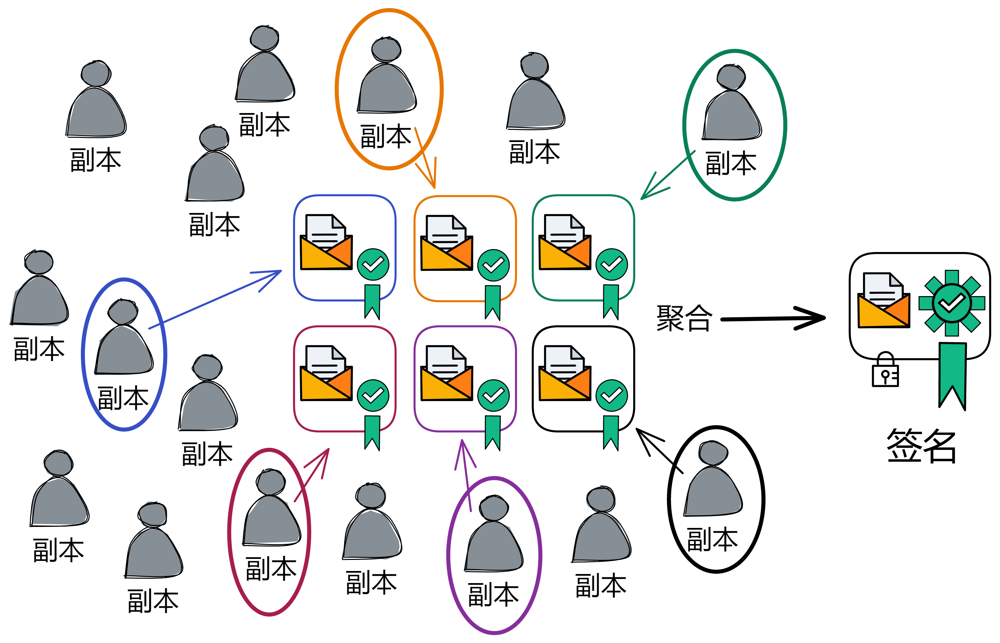

只要敌人拿到的私钥片段小于三分之一，就无法干扰到 BLS 阈值签名。也无法预测签名结果，因为私钥片段不够嘛，也就是说任何人不知道签名结果。

> 子网的共识最多对抗小于三分之一的恶意副本；如果恶意副本小于三分之一，那它能做的也只有签名或者不签名，没法干扰阈值签名的最终结果，也没法阻止签名产生；如果恶意副本大于等于三分之一，子网已经被破坏，随机数也就无所谓了。所以随机信标的阈值比较低，是三分之一。产生随机数的速度能快一点。

* 传统的 RSA 算法中，自己掌握私钥，消息又是公开的，相当于自己知道签名结果。私钥泄露之后别人也可以提前知道签名结果。
* 而在 BLS 阈值签名算法中，由一群人掌管私钥片段。签名的人他自己没有完整私钥，所以也不知道签名结果。只有大家签完聚合之后才知道签名。在整个过程中，全局私钥没有任何人知道，但签名的结果是大多数人认可的结果。由一群人产生签名，任何个人都无法预测签名的结果，单个人无法阻止签名发布。

这就可以作为随机信标，为哪个副本出块提供参考。这个随机数也是一个共识的结果，而且无法被单个人篡改。而且，这个是可以持续安全地产生随机数，只要每轮用出不同的信息来签名。这个不同的信息当然就是上一轮的随机信标和一些区块的 dkg_id ，这样一来每轮签名的信息都不一样。

IC 的随机信标、公证、敲定、随机磁带、认证复制状态都用了 BLS 阈值签名。（[随机磁带]()、[认证复制状态]()是执行层的内容）


## 解决方案

我们来仔细看看 IC 的共识协议怎么出块：

### 首先是出块前的准备

共识协议按照轮次进行出块。比如第 1 轮对创世区块达成了共识，第 6 轮就负责第 6 个区块。


在开始之前，子网先根据副本的数量，随机选择一些副本组成一个 “ 共识委员会 ” 。如果副本数量太少，所有副本都会加入委员会。委员会内的成员负责打包出块，所以子网里副本数量非常多也不会影响性能。


子网里还有个 “ **时期** ” （Epoch）的概念。一个时期大约是几百个轮次。NNS 可以对每个子网的时期进行调整。

每个子网在包含多轮（通常大约是几百轮）的时期内运行。每个时期有不同的副本组成委员会。


每个时期结束时，通过随机信标选出下个时期的共识委员会成员，而现在的共识委员会成员将会在下个时期全部转为随机信标委员会成员。

新时期的第一个块里包含有这个时期的共识委员会名单、随机信标委员会名单。


并且新时期开始时会重新给成员们分发一次私钥片段，这个过程叫[主动秘密再共享]()。这样做的原因有二：

* 当子网的成员发生变动时，再共享可以确保任何新成员都有新的私钥片段，而任何退出子网的成员就没有新的私钥片段了。

* 即使每个时期有少量的私钥片段泄露给攻击者，也不能使攻击者对共识产生威胁。


共识委员会数量和子网中副本成员总数有关。为了提高可扩展性，在小规模网络中，委员会成员可以是所有副本；在大规模网络中，委员会成员是所有副本中的一部分，并在每一个时期不断变化。

共识委员会成员的数量不能太多也不能太少。太少了不安全，太多了又影响共识速度。

所以委员会数量和成员总数的关系有一个数学模型描述：当子网里的成员总数趋近无限大时，超几何分布趋于二项分布，即不放回随机抽样的方式趋向于放回的随机抽样。因为副本成员总数无限大嘛，那放回和不放回就没有区别了。关于如何确定共识委员会的数量，这里就不展开讨论了，感兴趣可以看[这里](相关概念介绍/共识委员会数量如何确定？.md)的介绍。


完成准备工作就可以出块了。


### 开始出块（Block maker）

每一轮开始，都由上一轮产生的随机信标生成一个排名，排名决定了成员出块的权重。权重最高的老大优先出块。（如下图，排名为 5 个共识委员会成员分配一个 0 ~ 4 的数字，0 的权重最高）

正常情况下，老大诚实而且网络连接正常，老大负责出块。其他人都等着公证老大的区块，这时候即使收到老二的区块也不公证，非得等着老大的区块。

与此同时，随机信标委员会也将上一轮信标的哈希和这轮的 NiDKG 记录打包、签名、广播。在签名达到阈值时，产生本轮的随机信标，也就决定了下一轮的出块权重。

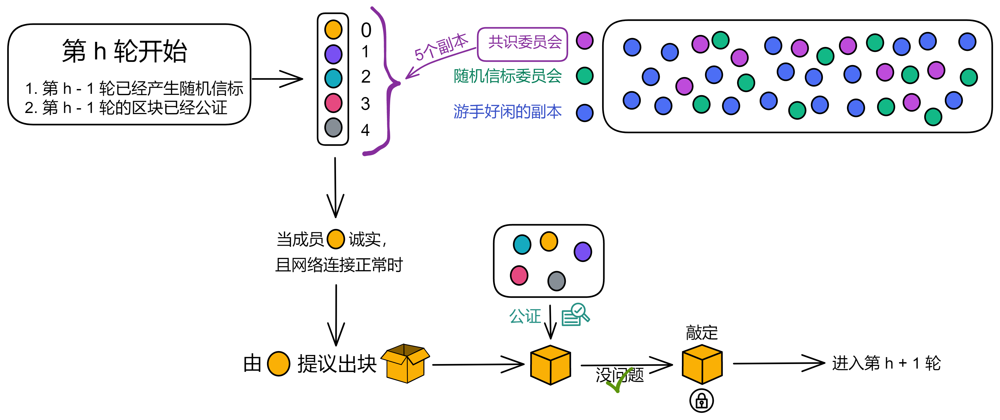


一个非创世区块里一般包含：

* 上一个区块公证之后到打包这个区块时，这一段时间内收到的消息，我们叫它 “ **荷载** ” （payload）。
* 上一个区块的哈希。
* 出块副本的排名。
* 区块的高度。

当组成区块后，负责出块的副本会生成一份**区块提案**，包括：

* 区块本身。
* 自己的身份标识。
* 自己对这个区块的签名。

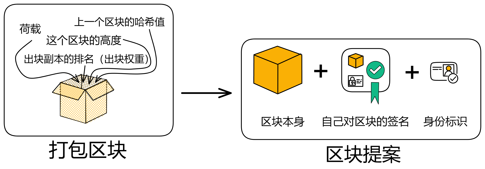

然后将其区块提案广播给其他成员。


老大出块，广播给大家，公证完成，因为只有老大的一个块被公证所以不用敲定，直接进入下一轮，这是最快的情况，也是最普通的情况。大约 1 秒敲定一个块。（乐观响应：协议会以实际网络延迟而不是网络延迟上限继续执行）

如果等了一段时间，一直没收到老大的区块，可能是老大网络不太好，也可能是机器出现了故障；这时大家才认可老二或者老三的区块，给他们的区块做公证。

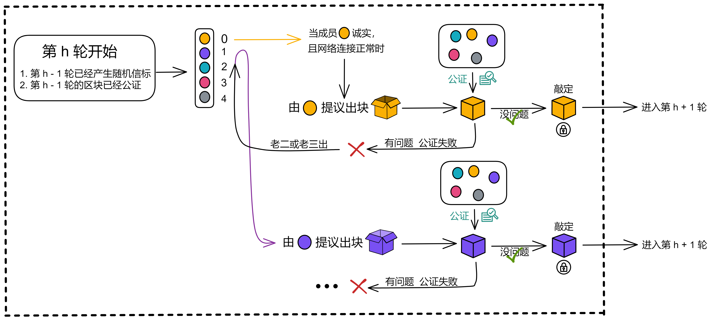

系统有一个约定好的等待时间，如果在一段时间之内没有收到老大的区块，就在第二段时间期待老二的区块了。然后是在第三个时间段期待老三的区块，假如老三是自己，那就自己出块 ...... 


### 公证（Notarization）

**公证只验证区块的合理性**，公证过的区块不代表已经达成共识。这保证了当前轮次中的多个区块里，至少有一个区块能得到公证。

因此，公证并不意味着共识，也不需要共识。如果多个区块具有相同的权重，那么这些区块都会被签名。


公证时，共识委员会的成员验证以下三方面的信息：

* 区块里应该有上一轮已经公证过的区块的哈希。
* 区块的荷载必须满足一些特定条件（是对荷载内容的具体规定，这些条件是独立于共识协议的）。
* 负责出这个块的副本的排名必须对应随机信标里的排名（比如排名第二的副本说自己排第一，那这个块就得不到公证）。 


如果区块的信息没问题，负责验证的副本先对区块高度和区块的哈希签名，然后把刚才的签名连同哈希、高度和自己的身份标识组成 “ **公证片段** ” 。把自己公证过的公证片段广播出去。

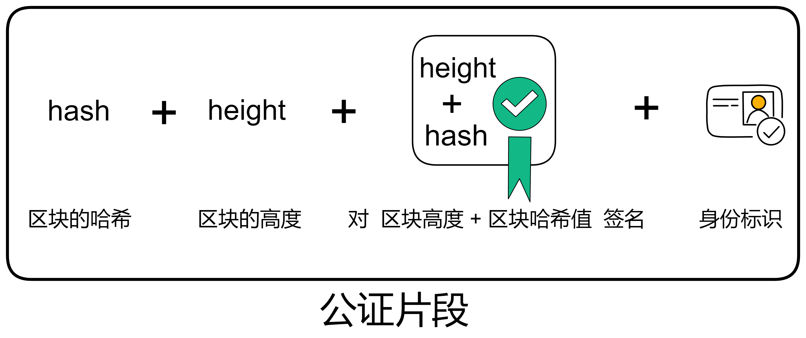

公证也用了 BLS 阈值签名。当有副本收到足够多（阈值是三分之二）的公证片段时，聚合签名片段形成对这个区块的公证。

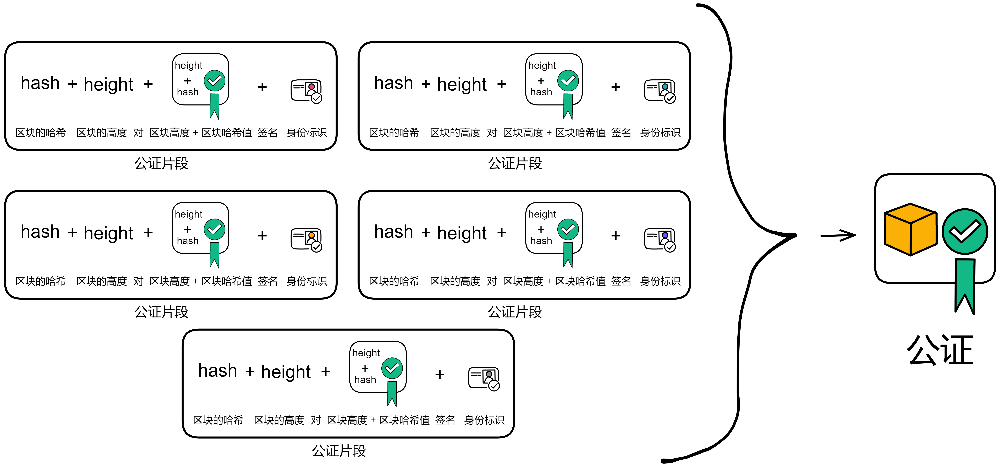

聚合之后的公证信息包括区块哈希、区块高度、聚合签名和三分之二以上的身份标识。副本要么发现收集到了足够的公证片段，自己聚合为公证；要么从别人那里收到已经聚合好的公证。

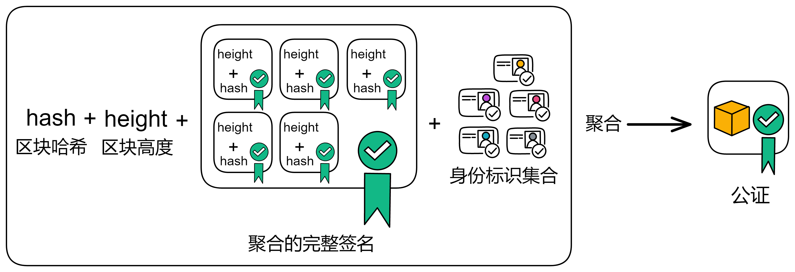


形成公证之后依然是广播出去。当其他成员收到已经公证过的区块后，转发广播一遍公证过的区块，并且不再给其他区块生成公证片段。

比如下图拿手机的女孩和小蓝帽进入了下一轮共识。而女孩发给另外 3 个人时网络中断了 700 毫秒，由小蓝帽转发的消息起了关键作用，不然五缺三也没法玩了。

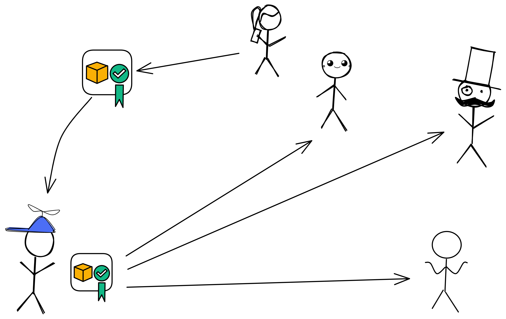


如果老大的块有问题，公证失败，老二的出块权重就是现在最大的。如果老二老三的块都经过了公证，下一轮的老大会选择在权重大的区块后面出块。就像下面图中的第 5 轮、第 6 轮那样，老二的区块权重大于老三的区块权重。把所有区块的权重加起来，黄色和紫色的区块组成的链是权重最大的链。

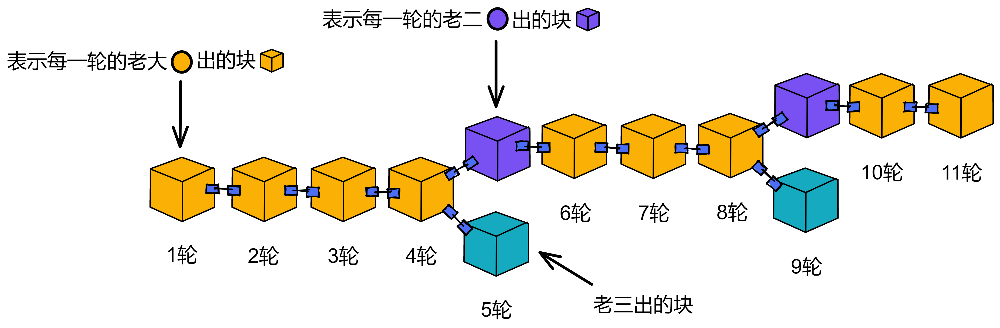


### 敲定（Finalization）

因为有时候会产生不止一个区块（老大没响应时，老二老三为了赶时间都可能出块）。这就需要有个敲定环节了，敲定将确定下来大家都公证过的唯一区块。那么大家都认同的这个区块之前的区块也得到了隐性敲定，其他分支便会失效。


敲定的过程具体为：

在副本发现一个经过公证的区块之后，就会开始检查自己在这一轮里有没有给别的区块公证过。如果没有给别的区块公证过，那么它会为区块广播一个 “ **敲定片段** ” 。用来证明自己只为这一个区块发布过公证片段。


要实现一个区块的敲定，需要三分之二个不同的副本发布敲定片段，然后聚合为某个区块的敲定。敲定片段和公证片段的格式完全相同（但是通过特定方式标注以防止混淆）。收到敲定后的区块之后，和公证环节一样，都会向其他成员广播一遍。


注意：副本不刻意等待敲定片段聚合为最终的敲定，才进入下一轮。副本只是收到某个高度的敲定片段后检查一下自己有没有公证除了那个块之外的块，然后广播出去自己签名的敲定片段；或者原封不动转发敲定片段。


例如，一个副本在第 11 轮收到了第 10 轮的敲定片段。这时候它就检查一下自己当时的行为，然后广播出答复。

如果过了一会儿，收到了第 10 轮的区块的敲定，也就可以将之前所有的区块视作隐式的敲定。

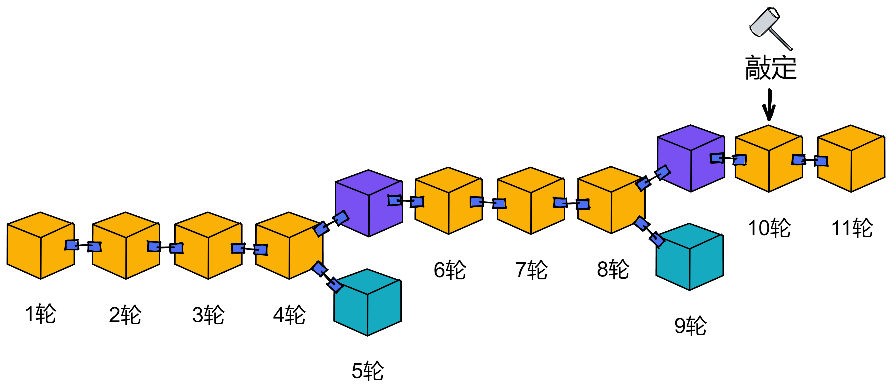

这些已经敲定的区块可以被认为是大家都确认过安全的，意味着所有的副本都认同了敲定的区块所在的分支。在区块 10 这个区块高度，有且仅有这个区块通过了公证。那么副本在这个高度就达成了共识。


比如：

如果某个副本在第 5 轮只给一个区块生成过公证片段，副本还会发一个敲定片段，然后进入第 6 轮共识。如果之后收到了最终的敲定，就认为包含敲定的分支是有效的。敲定之后的区块如果没有分叉的话，就一直没问题，不用敲定也行。

可能第 4 轮有二分之一的副本为老大、老二的块生成了公证片段，另外二分之一的副本只为老大生成过公证片段。那么敲定片段由只为老大公证过的副本提出，最终达不到阈值，而没法获得敲定。只有二分之一的副本生成过老二区块的公证片段，所以老二的区块也没有获得公证。

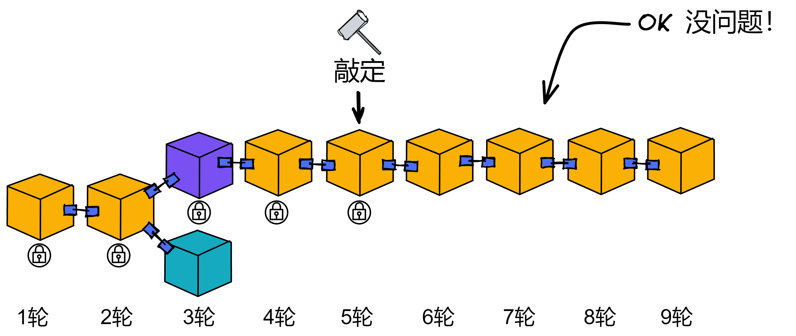

相比许多其他区块链，IC 共识协议的优势在于采用了异步敲定。在其他区块链中，节点通常需要找到最长链。如果链出现分叉后，节点需要等待一段时间找到最长链。如果因为网络故障错过一些区块，也就找不到最长链了，这时还需要去找其他节点同步数据。

IC 协议不依赖找到 “ 最长链 ” 的方式来最终确认区块。IC 的最终确认方法只依赖于密码学签名，而不依赖于整个链的确认。只需少量签名即可观察到共识形成的一个块，而不需要等待整个链的确认过程。在短时间内就能消除分叉，敲定的速度可以在不到一秒的时间内实现。


**共识的过程到这里就讲完啦！**


**总结一下**，共识委员会的成员进入新的轮次里，要做 3 件事：

（1）看看自己排第几，然后决定自己是否出块

（2）公证区块

（3）观察区块，找到主链，忽略失效的分支

共识委员会在下一个时期变成随机信标委员会，负责产生每轮的随机信标。


共识过程为老大出块，大家验证之后给出公证片段，公证片段数量达到阈值聚合为公证，进入下一轮次。敲定不是每轮必须要做完的。

IC 共识协议确保了当存在个别恶意攻击时，IC 的性能会柔性下降，而不是直接卡死。共识协议目前倾向于在没有故障的 “ 乐观情况 ” 时尽可能提升性能。


随着协议一轮轮推进，以**创世区块（genesis block）**为起点的区块连接成链，不断延长。每个区块都包含一个**荷载 (payload)**，由一系列输入和父区块的哈希组成。

诚实的副本对区块链的路径有一致的视角，区块里记录着已经排好序的消息，由消息路由层发往执行层处理。


附录：

两类共识机制对比

|          |    经典公链共识机制    |             联盟链共识机制             |            互联网计算机共识机制            |
| :------: | :--------------------: | :------------------------------------: | :----------------------------------------: |
| 写入顺序 |      先写入后共识      |              先共识后写入              |                先写入后共识                |
| 典型算法 |     PoW、PoS、DPos     |               PBFT、BFT                |                    PoUW                    |
| 共识流程 |    大概率一致就确认    |      确认一致后再P2P广播沟通投票       |           通过随机数选择出块节点           |
|  复杂性  |      计算复杂度高      |              网络复杂度高              |                网络复杂度高                |
| 是否分叉 |           是           |                   否                   |                     否                     |
| 安全阈值 |        二分之一        |                三分之一                |                  三分之一                  |
| 节点数量 | 节点数量可随时随意变动 | 节点数量不能随意变动，数量越多性能越低 | 节点数量不能随意变动，数量多对性能影响不大 |
| 应用场景 |        非许可链        |                 许可链                 |    半许可链，靠DAO投票决定节点是否加入     |

几种共识算法对比

| 共识算法 |   PoW   |   PoS    |   DPoS   |  PBFT  |   VRF    |       PoUW        |
| :------: | :-----: | :------: | :------: | :----: | :------: | :---------------: |
| 节点管理 | 无许可  |  无许可  |  无许可  | 有许可 |  有许可  |    DAO投票许可    |
| 共识延时 |   高    |    低    |    低    |   低   |    低    |       超低        |
|  吞吐量  |   低    |    高    |    高    |   高   |    高    |        高         |
|   节能   |   否    |    是    |    是    |   是   |    是    |        是         |
| 安全边界 |   1/2   |   1/2    |   1/2    |  1/3   |   1/3    |        1/3        |
| 代表应用 | Bitcoin | Ethereum | BitShare | Fabric | Algorand | Internet Computer |
|  扩展性  |   好    |    好    |    好    |   差   |    差    |       无限        |


# 源代码

https://github.com/dfinity/ic/tree/master/rs/consensus/src/consensus


## consensus


## 打包出块 block_maker


## 公证 notarized


## 敲定 finalizer


## utils


## 随机信标 random_beacon_maker

BLS 阈值签名

（ToDo：画一个树状图显示函数之间的调用关系和功能）


### on_state_change

如果符合提议信标共享的要求，就提议。

其中包含一个名为 `on_state_change` 的函数。这个函数接受一个类型为 `PoolReader` 的参数 pool，返回一个 `Option<RandomBeaconShare>` 类型的值。这个函数的作用是获取当前节点的信息以及池中的信息，并根据这些信息判断当前节点是否需要生成随机信标。如果需要生成随机信标，则生成该信标并将其封装在 `RandomBeaconShare` 结构体中返回。

函数首先获取当前节点的 ID 和当前高度，然后从池中获取高度对应的随机信标。接下来，它获取下一个高度并尝试从池中获取该高度对应的随机信标。如果池中没有这个随机信标，并且当前节点属于该高度的随机信标委员会，则生成该随机信标并返回。

生成随机信标的过程涉及到创建一个 `RandomBeaconContent` 结构体，该结构体包含了高度和哈希值。然后，函数会调用一个名为 `active_low_threshold_transcript` 的函数获取当前高度的转录。如果能够成功获取转录，则调用 crypto.sign 方法对 `RandomBeaconContent` 结构体进行签名。签名成功后，函数将签名信息封装在 `RandomBeaconShare` 结构体中返回。如果任何一个步骤出现问题，则函数将返回 `None` 。

```rust
pub fn on_state_change(&self, pool: &PoolReader<'_>) -> Option<RandomBeaconShare> {
    trace!(self.log, "on_state_change");
    let my_node_id = self.replica_config.node_id;
    let height = pool.get_notarized_height(); // 获取已公证过区块的高度
    let beacon = pool.get_random_beacon(height)?; // 获取已公证区块高度的随机信标，即上一轮的随机信标
    let next_height = height.increment(); // 就是当前轮次的高度（大家正在出块签名，没有敲定区块，所以叫“下一个块”）
    let next_beacon = pool.get_random_beacon(next_height); // 获取下一个区块高度的随机信标
    match self.membership.node_belongs_to_threshold_committee(
        my_node_id,
        next_height,
        RandomBeacon::committee(),
    ) {
        Err(MembershipError::RegistryClientError(_)) => None,
        Err(MembershipError::NodeNotFound(_)) => {
            panic!("This node does not belong to this subnet")
        }
        Err(MembershipError::UnableToRetrieveDkgSummary(h)) => {
            error!(
                self.log,
                "Couldn't find transcript at height {} with finalized height {} and CUP height {}",
                h,
                pool.get_finalized_height(),
                pool.get_catch_up_height()
            );
            None
        }
        Ok(is_beacon_maker)
        // 这段代码中使用了一个match表达式，它匹配一个包含两个元素的元组。
        // 第一个元素是一个布尔值，表示是否需要为下一个高度创建新的随机信标；
        // 第二个元素是下一个高度。
        //
        // 如果第一个元素为true，则执行第一分支，否则执行第二分支。
        //
        // 在第一个分支中，如果当前节点是信标制造者，并且下一个高度没有生成随机信标，
        // 并且当前节点没有为下一个高度获取到随机信标的分享，那就创造随机信标。
        // 在第二个分支中，返回None。
            if is_beacon_maker
                && next_beacon.is_none()
                && !pool
                    .get_random_beacon_shares(next_height)
                    .any(|s| s.signature.signer == my_node_id) =>
        {
            let content =
            // 将上一轮的随机信标哈希一下
            RandomBeaconContent::new(next_height, ic_types::crypto::crypto_hash(&beacon));
            // 涉及到一个问题，即是否适合使用起始块 h 的 dkg_id 来生成高度为 h 
            // 的随机信标。之所以这是可能的，是因为我们实际上只有在高度为 h 
            // 的区块存在后才生成该高度的随机信标，并且我们只在验证高度为 h 的区
            // 块时使用高度为 h-1 的随机信标。因此，使用起始块的 dkg_id 来
            // 生成随机信标不会影响到区块的有效性和正确性，因为实际上是在区块生成
            // 后才使用随机信标，以决定下一轮的副本出块排名。
            if let Some(transcript) =
                active_low_threshold_transcript(pool.as_cache(), next_height)
            {
                match self.crypto.sign(&content, my_node_id, transcript.dkg_id) {
                    Ok(signature) => Some(RandomBeaconShare { content, signature }),
                    Err(err) => {
                        error!(self.log, "Couldn't create a signature: {:?}", err);
                        None
                    }
                }
            } else {
                error!(
                    self.log,
                    "Couldn't find the transcript at height {}", height
                );
                None
            }
        }
        _ => None,
    }
}
```


### get_notarized_height

它没有参数。该函数返回一个 `Height` 值。

该函数的目的是获取已公证块的最大高度。以下是该函数的实现：

首先，使用 `get_catch_up_height` 方法获取尚未被处理的最高的抓取包高度，并将其存储在 `catch_up_height` 变量中。

然后，从池中提取所有已验证的公证，并使用 `max_height` 方法获取已公证块的最大高度。如果没有找到已公证块，则返回 `catch_up_height`。

最后，从 `catch_up_height` 和已公证块的最大高度中选择较大的值，并将其作为结果返回。

```rust
pub fn get_notarized_height(&self) -> Height {
    let catch_up_height = self.get_catch_up_height();
    self.pool
        .validated()
        .notarization()
        .max_height()
        .unwrap_or(catch_up_height)
        .max(catch_up_height)
}
```


### get_random_beacon

它有两个参数：`self`，它是一个对象实例的引用，和 `height`，它是一个 `Height` 值。该函数返回一个 `Option<RandomBeacon>`。

该函数的目的是在给定高度处获取一个有效的随机信标。以下是该函数的实现：

首先，使用 `cmp` 方法比较给定高度与 `get_catch_up_height` 方法返回的高度。`get_catch_up_height` 返回的是尚未被处理的最高的抓取包高度。

如果给定高度小于 `get_catch_up_height` 返回的高度，则说明该高度的随机信标尚未产生，返回 `None`。

如果给定高度等于 `get_catch_up_height` 返回的高度，则说明该高度的随机信标已经被包含在最高的抓取包中，因此从抓取包中提取随机信标并用 `Some` 包装返回。

如果给定高度大于 `get_catch_up_height` 返回的高度，则说明该高度的随机信标已经在池中验证通过。因此，从池中提取验证通过的随机信标，然后使用 `get_only_by_height` 方法，通过给定高度获取该随机信标。如果可以获取，则返回它，否则返回 `None`。

```rust
pub fn get_random_beacon(&self, height: Height) -> Option<RandomBeacon> {
    match height.cmp(&self.get_catch_up_height()) {
        Ordering::Less => None,
        Ordering::Equal => Some(
            self.get_highest_catch_up_package()
                .content
                .random_beacon
                .as_ref()
                .clone(),
        ),
        Ordering::Greater => self
            .pool
            .validated()
            .random_beacon()
            .get_only_by_height(height)
            .ok(),
    }
}
```


### active_low_threshold_transcript

它有两个参数：reader ，它是一个实现了 `ConsensusPoolCache trait` 的对象引用，和 height，它是一个 Height 值。该函数返回一个 `Option<NiDkgTranscript>` 。

该函数的目的是为了获取给定高度的活动低阈值 NiDkg 记录。调用了 `get_active_data_at` 函数，并传入 reader 和 height 作为参数，函数返回值被映射，以提取返回的数据对象的 `low_threshold_transcript` 字段。

如果 `get_active_data_at` 函数返回 None，则整个表达式的值为 None 。否则，将提取 `low_threshold_transcript` 字段，并用 Option 包装返回。

```rust
/// 如果找到，就返回给定高度的当前低转录本。
pub fn active_low_threshold_transcript(
    reader: &dyn ConsensusPoolCache,
    height: Height,
) -> Option<NiDkgTranscript> {
    get_active_data_at(reader, height).map(|data| data.low_threshold_transcript)
}
```


### get_active_data_at

如果找到了给定高度处的活跃 DKGData ，则返回该 DKGData 。

```rust
fn get_active_data_at(reader: &dyn ConsensusPoolCache, height: Height) -> Option<DkgData> {
    // 在确定活动的DKG数据时需要注意的问题。当使用最新的finalized DKG summary时，
    // 存在一个问题，即当批处理滞后于共识时，会出现无法计算下一个块或CUP的情况。这是因为只有当
    // 最终块到达特定高度且指向至少该高度的认证状态时，我们才能创建CUP。为了解决这个问题，注释
    // 提出了一种解决方案：首先尝试使用CUP的汇总块来确定活动的DKG数据，如果失败，则尝试使用最
    // 新的finalized DKG summary块。这样可以避免出现无法计算下一个块或CUP的情况。
    get_active_data_at_given_summary(reader.catch_up_package().content.block.get_value(), height)
        .or_else(|| get_active_data_at_given_summary(&reader.summary_block(), height))
}
```


### get_active_data_at_given_summary

根据给定的总结块（summary block）返回给定高度的活动 DKGData（DKG 数据）。总结块是一个固定高度的区块，其中包含了一些元数据，
例如用于验证下一个一致性证明（consensus proof）的公钥、DKG 数据的摘要等。总结块的高度通常是一些定期间隔的倍数，例如每 100 个区块一个总结块。

总结块包含了 DKGDatas 的摘要，其中包括了一个叫做 active_data 的字段，它指向了当前应该使用的 DKGData。这个函数会先检查给定总结块是否存在 active_data 字段并且是否与给定高度匹配，如果匹配则返回 active_data ，否则返回 None 。

```rust
fn get_active_data_at_given_summary(summary_block: &Block, height: Height) -> Option<DkgData> {
    let dkg_summary = &summary_block.payload.as_ref().as_summary().dkg;
    if dkg_summary.current_interval_includes(height) {
        Some(DkgData {
            registry_version: dkg_summary.registry_version,
            high_threshold_transcript: dkg_summary
                .current_transcript(&NiDkgTag::HighThreshold)
                .clone(),
            low_threshold_transcript: dkg_summary
                .current_transcript(&NiDkgTag::LowThreshold)
                .clone(),
        })
    } else if dkg_summary.next_interval_includes(height) {
        let get_transcript_for = |tag| {
            dkg_summary
                .next_transcript(&tag)
                .unwrap_or_else(|| dkg_summary.current_transcript(&tag))
                .clone()
        };
        Some(DkgData {
            registry_version: summary_block.context.registry_version,
            high_threshold_transcript: get_transcript_for(NiDkgTag::HighThreshold),
            low_threshold_transcript: get_transcript_for(NiDkgTag::LowThreshold),
        })
    } else {
        None
    }
}
```


### aggregate

其他副本对共享随机信标签名：

```rust
/// 这个函数用于将签名分享聚合成完整的工件。
/// 
/// Consensus 在其生命周期内会收到许多工件签名分享。
/// aggregate 尝试将这些签名分享聚合成相应内容的完整签名。
/// 
/// 例如，aggregate 可以获取一个 Vec<&RandomBeaconShare>，并输出一个 Vec<&RandomBeacon>。
/// 
/// aggregate 的行为如下：
/// 
/// 按内容对签名分享进行分组，生成从内容到签名分享向量的映射，每个签名分享都签署了相关内容
/// 对于每个分组（内容，分享）对，查找阈值并确定是否有足够的分享来为内容构造完整的签名
/// 如果可以构造完整的签名，则尝试从分享中构造完整的签名
/// 如果可以构造完整的签名，则使用给定的内容和完整的签名构造工件
/// 返回所有成功构造的工件
/// 
/// 参数：
/// artifact_shares - 工件分享向量，例如 Vec<&RandomBeaconShare>
#[allow(clippy::type_complexity)]
pub fn aggregate<
    Message: Eq + Ord + Clone + std::fmt::Debug + HasHeight + HasCommittee,
    CryptoMessage,
    Signature: Ord,
    KeySelector: Copy,
    CommitteeSignature,
    Shares: Iterator<Item = Signed<Message, Signature>>,
>(
    log: &ReplicaLogger,
    membership: &Membership,
    crypto: &dyn Aggregate<CryptoMessage, Signature, KeySelector, CommitteeSignature>,
    selector: Box<dyn Fn(&Message) -> Option<KeySelector> + '_>,
    artifact_shares: Shares,
) -> Vec<Signed<Message, CommitteeSignature>> {
    group_shares(artifact_shares)
        .into_iter()
        .filter_map(|(content_ref, shares)| {
            let selector = selector(&content_ref).or_else(|| {
                warn!(
                    log,
                    "aggregate: cannot find selector for content {:?}", content_ref
                );
                None
            })?;
            let threshold = match membership
                .get_committee_threshold(content_ref.height(), Message::committee())
            {
                Ok(threshold) => threshold,
                Err(err) => {
                    error!(log, "MembershipError: {:?}", err);
                    return None;
                }
            };
            if shares.len() < threshold {
                return None;
            }
            let shares_ref = shares.iter().collect();
            crypto
                .aggregate(shares_ref, selector)
                .ok()
                .map(|signature| {
                    let content = content_ref.clone();
                    Signed { content, signature }
                })
        })
        .collect()
}
```


DKG 算法实现：https://github.com/dfinity/ic/tree/master/rs/crypto/internal/crypto_lib/fs_ni_dkg

负责编排 DKG 的主要代码（发送、接收和验证 DKG 消息，并确保它们进入区块链）：

https://github.com/dfinity/ic/blob/master/rs/consensus/src/dkg.rs

随机信标：https://github.com/dfinity/ic/blob/master/rs/consensus/src/consensus/random_beacon_maker.rs

