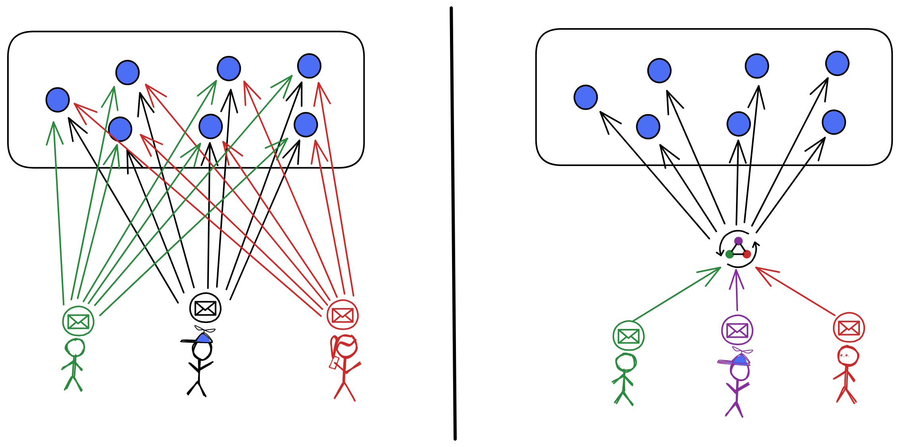
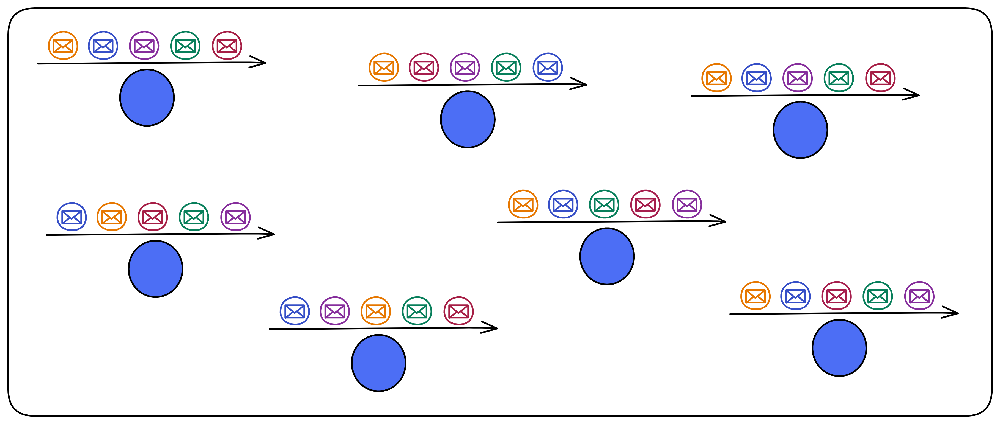
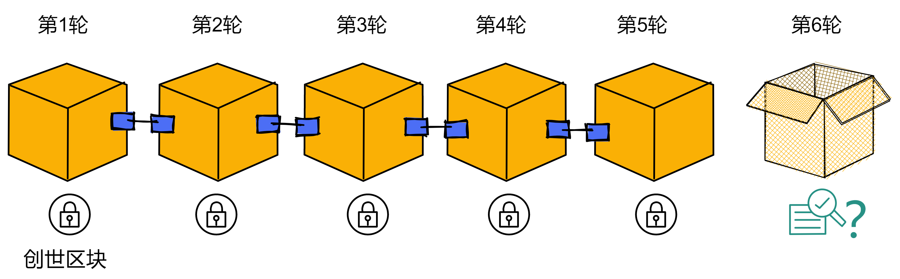
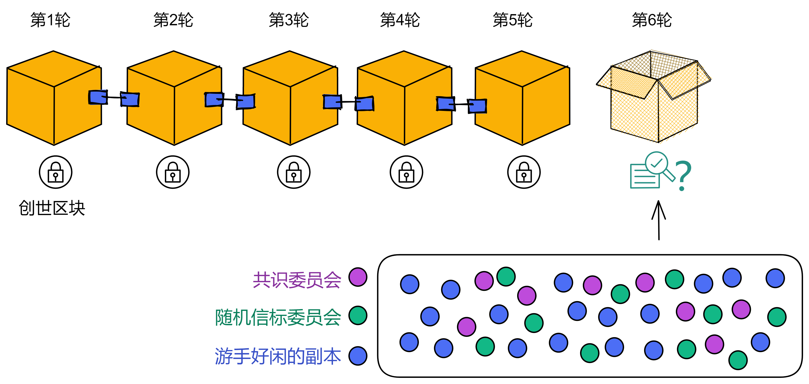
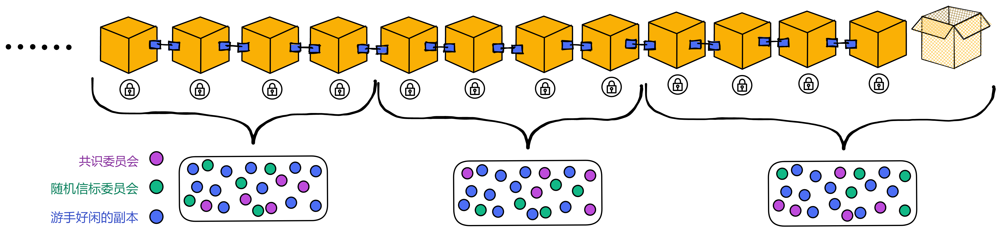
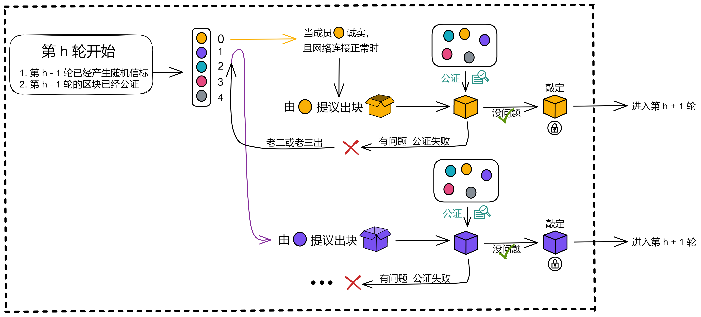
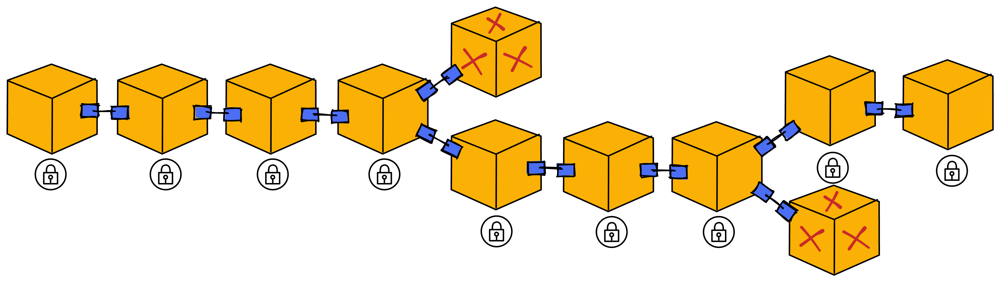

## 啥？PoUW？不是PoW吗？

说起 IC 的共识，你看这个名字：PoUW，Proof of Useful Work 。

是不是似曾相识？


PoW！哈哈哈哈 :) 

PoW 是比特币的共识算法


不同于传统的货币，比特币是完全虚拟的。没有实物的货币，甚至就本质而言，也没有数字货币。比特币隐匿于发送者和接收者间价值传递的交易中。比特币用户拥有能够使他们在比特币网络中证明自己交易权的密钥，解密后可使用比特币，也可以将它购买、，出售，以及与其他币种进行兑换。由于比特币快捷、安全以及无国界的特性，在某种意义上，比特币就是互联网货币的完美形态。

比特币是一个分布式的点对点网络系统。因此，没有“中央”服务器，也没有中央控制点。


## 怎样达成共识

但不管怎么说，人家是区块链的祖师爷。虽然共识低效，但也好歹是一种分布式问题的解决方案。也是一种

中本聪的比特币发明，对 “ 拜占庭将军 ” 问题也是一个可行的解决方案。

简单来说，这个问题包括了试图通过在一个不可靠、具有潜在威胁的网络中，通过信息交流来达成一个行动协议共识。中本聪的解决方案是使用工作量证明的概念在没有中央信任机构下达成共识，这代表了分布式计算的科学突破，并已经超越了货币广泛的适用性。它可以用来达成去中心化的网络共识来公正选举、彩票、资产登记，以及数字化公证等等。


共识的本质是什么？共识就是为了达成共识。

为了在一个全球范围内的分布式网络中，保持数据一致性。

比特币的做法是所有人靠算力竞争谁打包的区块有效，然后大家都复制他的区块。这样比特币交易账本有了多份副本，也达到保持所有节点数据一致的目的。但是效率非常低。


我们不妨看一下这里保持一致的逻辑：

目的：保持所有节点上数据的一致性。

方法：靠某种手段选一个节点出块，其他节点复制那个节点出的区块。不能一直选同一个节点，选谁出块是毫无规律可言的。


我们忽略方法只分析目的。既然目的是保持节点们的数据一致，那只要让节点们同时收到消息，不就解决了嘛。


但实际网络环境可不允许，信息传输总有长短不一的延迟，何况节点们本来就不在同一地点，客户端的位置也有远有近，传输距离都不一样。简直乱成一锅粥。根本不可能保证所有节点在同时收到消息。那怎么办呢？



答案很简单，建一个 “ 中转站 ” 就能解决这个问题。不管是从哪发过来的消息，先进中转站里排好队，然后由中转站把消息和执行顺序发给节点们。节点们只要按照中转站给的顺序依次执行操作就能保证数据一致了！


但先别笑，因为还有一个大问题：中心化。所有节点都得听中转站的命令，中转站说按 ABDC 的顺序执行消息，节点就得 ABDC 。兜兜转转一大圈，结果回到原点了。那怎么才能以去中心化的方式给消息排序呢。


去中心化的方式其实很简单，就是做一件事完全不依赖某一个人。没有 “ 上司、管理者 ” ，很民主，大家一起选出一个共识。这活谁来了都能干，谁走了也不影响系统继续运行。（除非都走光，不过有经济激励就总有人来）

所以怎么设计好呢？让节点们对执行消息的顺序达成共识，把中转站的职能改为去中心化的方式进行。


**IC 是这样设计的**：（IC 把节点抽象成子网里的副本 Replica）

肯定不能依赖。虽然消息到达每个副本的时间可能不一样（即执行消息的顺序不一样），但是所有副本必须按相同顺序执行消息。



那如果大家的顺序都不一样，按谁的顺序来执行呢？随机数！

IC 底层使用了一种可验证的随机数（Verifiable Random Function, VRF）。它能产生不可预测的随机数，而且大家都可以验证随机数不是伪造的。


（简单介绍 BLS 阈值签名和 DKG）

发私钥片段的过程使用 [DKG]() 技术，这是一种非交互式的分布式密钥生成协议。DKG 可以在成员之间分发私钥片段。不需要可信方，不依赖某一个成员分发私钥片段，避免了单点故障。


## 解决方案

我们来仔细看看 IC 的共识协议怎么出块：

### 首先是出块前的准备

共识协议按照轮次进行出块。比如第 1 轮对创世区块达成了共识，第 6 轮就负责第 6 个区块。



在开始之前，子网先根据副本的数量，随机选择一些副本组成一个 “ 共识委员会 ” 。如果副本数量太少，所有副本会都加入委员会。委员会内的成员负责打包出块，所以子网里副本数量非常多也不会太影响性能。



子网里还有个 “ **时期** ” 的概念。一个时期大约是几百个轮次。

每个子网在包含多轮（通常大约是几百轮）的时期（Epoch）内运行。每个时期有不同的副本组成委员会。



每个时期结束时，通过随机信标选出下个时期的共识委员会成员，而现在的共识委员会成员将会在下个时期全部转为随机信标委员会成员。

新时期的第一个块里包含有这个时期的共识委员会名单、随机信标委员会名单。


并且新时期开始时会重新给成员们分发一次私钥片段，这个过程叫[主动秘密再共享]()。这样做的原因有二：

* 当子网的成员发生变动时，再共享可以确保任何新成员都有新的私钥片段，而任何退出子网的成员就没有新的私钥片段了。

* 即使每个时期有少量的私钥片段泄露给攻击者，也不能使攻击者对共识产生威胁。


完成准备工作就可以出块了。


### 开始出块

每一轮开始，都由上一轮产生的随机信标生成一个排名，排名决定了成员出块的权重。权重最高的老大优先出块。（如下图，排名为 5 个共识委员会成员分配一个 0 ~ 4 的数字，0 的权重最高）

正常情况下，老大诚实而且网络连接正常，老大负责出块。其他人都等着公证老大的区块，这时候即使收到老二的区块也不公证，非得等着老大的区块。

与此同时，随机信标委员会也将上一轮信标的哈希和这轮的 NiDKG 记录打包、签名、广播。在签名达到阈值时，产生本轮的随机信标，也就决定了下一轮的出块权重。


老大出块，广播给大家，公证完成，敲定，进入下一轮，这是最快的情况，也是最正常的情况。大约 1 秒敲定一个块。

如果等了一段时间，一直没收到老大的区块，可能是老大网络不太好，也可能是机器出现了故障；这时大家才认可老二或者老三的区块，给他们的区块做公证。

如果老大的块有问题，公证失败，也轮到由老二出块。



公证：


敲定：

每轮的最后都有一个敲定环节，因为有时候会产生不止一个区块（老大没响应时，老二老三为了赶时间都可能会出块）。这就需要最后有个敲定环节了，敲定将保留下来本轮共识唯一的一个区块。




在**轮次**$$h$$中，一个或多个**块高**$$h$$的区块被添加到区块树中。也就是说，在轮次$$h$$添加的区块，距离根节点的距离都是$$h$$。

在每一轮中，将通过伪随机过程给每一个节点副本分配一个唯一的**排位**，范围是$0,...,n-1$的整数。这一伪随机过程使用了**随机信标（Random Beacon）**（详见如下[章节5.5](#5.5 随机信标)）来实现。排位最低的节点副本是该轮次的**主节点**。

当主节点是诚实的并且网络同步时，主节点会提议一个新区块，并加入到区块树中；此外，这将会是该轮次唯一添加到区块树中的区块，并延伸最终确认的路径。

如果主节点不诚实或者网络不同步状态，其他排位更高的节点副本也可以提议新区块，并将其添加到区块树中。

在任何情况下，协议逻辑给予主节点提议的区块最高优先级，并且某个或某些区块会在该轮次被加入到区块树中。即使协议在没有延伸最终确认路径的情形下继续执行，区块树的高度也会在每轮继续增长，这样最终确认路径会在轮次*$h$*继续延伸，使其长度达到*$h$*。上述做法下，即使故障节点副本或不可预测的高网络延迟导致延迟增加，整体协议的吞吐量大体上依旧维持稳定。


除了上述的BLS签名与多签外，协议使用BLS阈值签名方案来实现上文提及的随机信标。块高*$h$*的随机信标是对块高*$h$*中特定消息的阈值为$(f + 1)$的签名。协议的每一轮中，每个副本广播其下一轮中信标的片段，这样当下一轮开始时，每一个副本都有足够的片段来重构此轮需要的信标。

如上所述，在轮次$h$，块高$h$的随机信标被用来给每个副本分配伪随机排位。

因为阈值签名的安全特性，对手方将无法  提前一轮以上  去  预测副本的排名，因此这些排位拥有有效的随机性。BLS 阈值签名细节详见[第3章](#3 链钥密码学I：阈值签名)。


BLS 是一种门限签名技术。首先将用户分组，第一轮由一个组产生一个随机数， 之后每一轮选一个组对上一轮产生的随机数签名，作为这一轮的随机数输出，每个成员都无法 提前预知签名结果。其中签名过程使用 BLS 签名机制，保证在签名过程中没有个体能够提前预 知签名结果，因此无法操纵随机数。

BLS 很好的解决了 Withholding 攻击的问题，且生成随机数过程不可操纵，无法预测，很难串谋，是一个比较理想的随机数生成方案。


5.2 协议概述

像许多的共识协议一样，IC共识协议是基于区块链的。伴随着协议的推进，以**创世区块（genesis block）**为根节点的区块树将不断生长。每一个非创世区块都包含一个**荷载(payload)**，由一系列输入和父区块的哈希组成。诚实节点副本对这个区块树有一致的视角：尽管每个节点副本可能对这个区块树有不同的局部视角，但是所有的节点副本看到的都是这一*相同*的区块树。此外，伴随着协议的推进，区块树中总会有一条**最终确认区块**的路径。同样地，诚实节点副本对这一路径有一致的视角：尽管每个节点副本可能对这条路径有不同的局部视角，但是所有的节点副本看到的都是这一*相同*的路径。沿着这条路径的区块的荷载中的输入，是已经排序好的输入并将由IC的执行层进行处理（详见[第7章](#7 执行层)）。


IC的共识协议按照轮次进行处理。

在**轮次**$$h$$中，一个或多个**块高**$$h$$的区块被添加到区块树中。也就是说，在轮次$$h$$添加的区块，距离根节点的距离都是$$h$$。

在每一轮中，将通过伪随机过程给每一个节点副本分配一个唯一的**排位**，范围是$0,...,n-1$的整数。这一伪随机过程使用了**随机信标（Random Beacon）**（详见如下[章节5.5](#5.5 随机信标)）来实现。排位最低的节点副本是该轮次的**主节点**。

当主节点是诚实的并且网络同步时，主节点会提议一个新区块，并加入到区块树中；此外，这将会是该轮次唯一添加到区块树中的区块，并延伸最终确认的路径。

如果主节点不诚实或者网络不同步状态，其他排位更高的节点副本也可以提议新区块，并将其添加到区块树中。

在任何情况下，协议逻辑给予主节点提议的区块最高优先级，并且某个或某些区块会在该轮次被加入到区块树中。即使协议在没有延伸最终确认路径的情形下继续执行，区块树的高度也会在每轮继续增长，这样最终确认路径会在轮次*$h$*继续延伸，使其长度达到*$h$*。上述做法下，即使故障节点副本或不可预测的高网络延迟导致延迟增加，整体协议的吞吐量大体上依旧维持稳定。


5.3 额外特性

一个由IC共识协议带来的额外属性(如同 PBFT [[CL99]](#[CL99])和HotStuff [[AMN+20]](#AMN20), 而不像别的协议, 诸如Tendermint [[BKM18]](#BKM18))是*乐观响应*[[PS18]](#PS18)。这意味着，当主节点诚实时，协议会以实际网络延迟而非网络延迟上限继续执行。

我们注意到IC共识协议的简洁设计也确保了当拜占庭故障实际发生时，IC的性能也能相当优雅的下降。如同[\[CWA+09]](#CWA09)中指出的，共识目前大量的工作都专注于没有故障的“乐观情况”下的性能提升，这导致协议变得危险且脆弱，以至于故障真的发生时协议无法使用。例如[[CWA+09]](#CWA09)所述，现有PBFT吞吐量在特定(极其简单)的拜占庭行为下会下降至0。该论文[[CWA+09]](#CWA09)倡导*健壮*的共识，意味着部分牺牲最优状态的最佳性能，以确保部分恶意节点（但依然假设网络为同步）时的合理性能。IC的共识协议在其[[CWA+09]](#CWA09)的讨论下，确实是健壮的：当任意轮次中主节点发生故障时（发生概率小于$1/3$），协议将尽可能有效得允许别的节点副本接替成为主节点，使得协议能够及时推进至下一轮。

5.4 公钥

为实现该协议，每个节点副本都关联了一个用于BLS签名的公钥，并且每个节点副本都拥有对应的签名私钥。节点副本与公钥的关联关系可从NNS维护的注册表中获得。这些BLS签名将用于验证节点副本发送的消息。
协议同时使用BLS签名[[BGLS03]](#BGLS03)的**聚合签名**的特性，该特性允许同一条消息的多个签名聚合为一个压缩的多签。协议将在**公证（notarization）** （详见[章节5.7](#5.7 公证)）and **最终确认（finalizations）**（详见 [章节 5.8](#5.8 最终确认)）时，使用$n-f$特定格式消息上的签名聚合而成的多签。


5.5 随机信标

除了上述的BLS签名与多签外，协议使用BLS阈值签名方案来实现上文提及的随机信标。块高*$h$*的随机信标是对块高*$h$*中特定消息的阈值为$(f + 1)$的签名。协议的每一轮中，每个副本广播其下一轮中信标的片段，这样当下一轮开始时，每一个副本都有足够的片段来重构此轮需要的信标。

如上所述，在轮次$h$，块高$h$的随机信标被用来给每个副本分配伪随机排位。

因为阈值签名的安全特性，对手方将无法  提前一轮以上  去  预测副本的排名，因此这些排位拥有有效的随机性。BLS 阈值签名细节详见[第3章](#3 链钥密码学I：阈值签名)。


---


主要讨论了如何使用 BLS 签名和多重签名来实现随机信标（random beacon）以及如何使用 BLS 阈值签名方案来实现这个随机信标。

随机信标是一个在某个高度上的（f+1）阈值签名，它基于一个独特的高度消息。协议的每个轮次，每个副本都会广播下一轮的信标份额，这样当下一轮开始时，所有副本都应该有足够的份额来重构该轮的信标。

**这个高度 h 上的随机信标用于为协议的第 h 轮分配一个伪随机等级给每个副本使用。**

由于阈值签名的安全特性，攻击者将不能够预测副本的等级超过一个轮次，这些等级将有效地是随机的。关于BLS阈值签名，可以参见第3节。

简单来说，这段话描述了一种使用随机信标来为每个副本分配伪随机等级的机制，从而在区块链协议中实现分布式共识。BLS签名和多重签名用于确保这个机制的安全性和可靠性，而BLS阈值签名则用于防止攻击者通过预测副本等级来破坏共识机制。


这段文字描述了一个协议中的随机信标（random beacon）的实现方式。该协议使用了 BLS 阈值签名方案来实现随机信标。随机信标在每个高度上都是一个 (f+1) 阈值签名，签名消息是该高度唯一的。在协议的每个轮次中，每个复制品都广播其下一轮的信标份额，以便当下一轮开始时，所有复制品都应该有足够的份额来重建该轮次的信标。正如上面所述，高度为 h 的随机信标用于为协议第 h 轮分配一个伪随机排名给每个复制品。由于阈值签名的安全属性，攻击者无法预测超过一轮的复制品排名，这些排名实际上就像是随机的一样。一旦复制品接收到高度为 h 的随机信标，或者收到足够的份额以构造高度为 h 的随机信标，它将将该信标中继到所有其他复制品。一旦复制品进入第 h 轮，它将生成并广播下一轮（即第 h+1 轮）的随机信标份额。


随机数由 BLS 阈值签名算法生成：对  上一轮信标的hash + 这轮的 NiDKG  签名。

一堆私钥碎片 => 签名 => 可以用对应公钥验证的签名

副本们使用私钥碎片签名，达到阈值后生成阈值签名。可以用对应的公钥验证

因为参与签名的碎片们、每次签名的内容都不一样，所以签名结果就是不可预测的。


在这个过程中，全局私钥没有任何人知道，但是这个签名的结果是多个节点认可的结果。如果以这个全局签名作为随机数源，这个随机数就是一个共识的结果，而且无法被单个人篡改。而且，这个是可以持续安全地产生随机数，只要每轮给出不同的信息来签名。


由一组人产生签名，任何个人都无法预测签名的结果，单个人无法阻止签名发布。


# 源代码


## 随机信标

BLS 阈值签名

（画一个树状图显示函数之间的调用关系和功能）


### on_state_change

如果符合提议信标共享的要求，就提议。

其中包含一个名为 `on_state_change` 的函数。这个函数接受一个类型为 `PoolReader` 的参数 pool，返回一个 `Option<RandomBeaconShare>` 类型的值。这个函数的作用是获取当前节点的信息以及池中的信息，并根据这些信息判断当前节点是否需要生成随机信标。如果需要生成随机信标，则生成该信标并将其封装在 `RandomBeaconShare` 结构体中返回。

函数首先获取当前节点的 ID 和当前高度，然后从池中获取高度对应的随机信标。接下来，它获取下一个高度并尝试从池中获取该高度对应的随机信标。如果池中没有这个随机信标，并且当前节点属于该高度的随机信标委员会，则生成该随机信标并返回。

生成随机信标的过程涉及到创建一个 `RandomBeaconContent` 结构体，该结构体包含了高度和哈希值。然后，函数会调用一个名为 `active_low_threshold_transcript` 的函数获取当前高度的转录。如果能够成功获取转录，则调用 crypto.sign 方法对 `RandomBeaconContent` 结构体进行签名。签名成功后，函数将签名信息封装在 `RandomBeaconShare` 结构体中返回。如果任何一个步骤出现问题，则函数将返回 `None` 。

```rust
pub fn on_state_change(&self, pool: &PoolReader<'_>) -> Option<RandomBeaconShare> {
    trace!(self.log, "on_state_change");
    let my_node_id = self.replica_config.node_id;
    let height = pool.get_notarized_height(); // 获取已公证过区块的高度
    let beacon = pool.get_random_beacon(height)?; // 获取已公证区块高度的随机信标，即上一轮的随机信标
    let next_height = height.increment(); // 就是当前轮次的高度（大家正在出块签名，没有敲定区块，所以叫“下一个块”）
    let next_beacon = pool.get_random_beacon(next_height); // 获取下一个区块高度的随机信标
    match self.membership.node_belongs_to_threshold_committee(
        my_node_id,
        next_height,
        RandomBeacon::committee(),
    ) {
        Err(MembershipError::RegistryClientError(_)) => None,
        Err(MembershipError::NodeNotFound(_)) => {
            panic!("This node does not belong to this subnet")
        }
        Err(MembershipError::UnableToRetrieveDkgSummary(h)) => {
            error!(
                self.log,
                "Couldn't find transcript at height {} with finalized height {} and CUP height {}",
                h,
                pool.get_finalized_height(),
                pool.get_catch_up_height()
            );
            None
        }
        Ok(is_beacon_maker)
        // 这段代码中使用了一个match表达式，它匹配一个包含两个元素的元组。
        // 第一个元素是一个布尔值，表示是否需要为下一个高度创建新的随机信标；
        // 第二个元素是下一个高度。
        //
        // 如果第一个元素为true，则执行第一分支，否则执行第二分支。
        //
        // 在第一个分支中，如果当前节点是信标制造者，并且下一个高度没有生成随机信标，
        // 并且当前节点没有为下一个高度获取到随机信标的分享，那就创造随机信标。
        // 在第二个分支中，返回None。
            if is_beacon_maker
                && next_beacon.is_none()
                && !pool
                    .get_random_beacon_shares(next_height)
                    .any(|s| s.signature.signer == my_node_id) =>
        {
            let content =
            // 将上一轮的随机信标哈希一下
            RandomBeaconContent::new(next_height, ic_types::crypto::crypto_hash(&beacon));
            // 涉及到一个问题，即是否适合使用起始块 h 的 dkg_id 来生成高度为 h 
            // 的随机信标。之所以这是可能的，是因为我们实际上只有在高度为 h 
            // 的区块存在后才生成该高度的随机信标，并且我们只在验证高度为 h 的区
            // 块时使用高度为 h-1 的随机信标。因此，使用起始块的 dkg_id 来
            // 生成随机信标不会影响到区块的有效性和正确性，因为实际上是在区块生成
            // 后才使用随机信标，以决定下一轮的副本出块排名。
            if let Some(transcript) =
                active_low_threshold_transcript(pool.as_cache(), next_height)
            {
                match self.crypto.sign(&content, my_node_id, transcript.dkg_id) {
                    Ok(signature) => Some(RandomBeaconShare { content, signature }),
                    Err(err) => {
                        error!(self.log, "Couldn't create a signature: {:?}", err);
                        None
                    }
                }
            } else {
                error!(
                    self.log,
                    "Couldn't find the transcript at height {}", height
                );
                None
            }
        }
        _ => None,
    }
}
```


### get_notarized_height

它没有参数。该函数返回一个 `Height` 值。

该函数的目的是获取已公证块的最大高度。以下是该函数的实现：

首先，使用 `get_catch_up_height` 方法获取尚未被处理的最高的抓取包高度，并将其存储在 `catch_up_height` 变量中。

然后，从池中提取所有已验证的公证，并使用 `max_height` 方法获取已公证块的最大高度。如果没有找到已公证块，则返回 `catch_up_height`。

最后，从 `catch_up_height` 和已公证块的最大高度中选择较大的值，并将其作为结果返回。

```rust
pub fn get_notarized_height(&self) -> Height {
    let catch_up_height = self.get_catch_up_height();
    self.pool
        .validated()
        .notarization()
        .max_height()
        .unwrap_or(catch_up_height)
        .max(catch_up_height)
}
```


### get_random_beacon

它有两个参数：`self`，它是一个对象实例的引用，和 `height`，它是一个 `Height` 值。该函数返回一个 `Option<RandomBeacon>`。

该函数的目的是在给定高度处获取一个有效的随机信标。以下是该函数的实现：

首先，使用 `cmp` 方法比较给定高度与 `get_catch_up_height` 方法返回的高度。`get_catch_up_height` 返回的是尚未被处理的最高的抓取包高度。

如果给定高度小于 `get_catch_up_height` 返回的高度，则说明该高度的随机信标尚未产生，返回 `None`。

如果给定高度等于 `get_catch_up_height` 返回的高度，则说明该高度的随机信标已经被包含在最高的抓取包中，因此从抓取包中提取随机信标并用 `Some` 包装返回。

如果给定高度大于 `get_catch_up_height` 返回的高度，则说明该高度的随机信标已经在池中验证通过。因此，从池中提取验证通过的随机信标，然后使用 `get_only_by_height` 方法，通过给定高度获取该随机信标。如果可以获取，则返回它，否则返回 `None`。

```rust
pub fn get_random_beacon(&self, height: Height) -> Option<RandomBeacon> {
    match height.cmp(&self.get_catch_up_height()) {
        Ordering::Less => None,
        Ordering::Equal => Some(
            self.get_highest_catch_up_package()
                .content
                .random_beacon
                .as_ref()
                .clone(),
        ),
        Ordering::Greater => self
            .pool
            .validated()
            .random_beacon()
            .get_only_by_height(height)
            .ok(),
    }
}
```


### active_low_threshold_transcript

它有两个参数：reader ，它是一个实现了 `ConsensusPoolCache trait` 的对象引用，和 height，它是一个 Height 值。该函数返回一个 `Option<NiDkgTranscript>` 。

该函数的目的是为了获取给定高度的活动低阈值 NiDkg 记录。调用了 `get_active_data_at` 函数，并传入 reader 和 height 作为参数，函数返回值被映射，以提取返回的数据对象的 `low_threshold_transcript` 字段。

如果 `get_active_data_at` 函数返回 None，则整个表达式的值为 None 。否则，将提取 `low_threshold_transcript` 字段，并用 Option 包装返回。

```rust
/// 如果找到，就返回给定高度的当前低转录本。
pub fn active_low_threshold_transcript(
    reader: &dyn ConsensusPoolCache,
    height: Height,
) -> Option<NiDkgTranscript> {
    get_active_data_at(reader, height).map(|data| data.low_threshold_transcript)
}
```


### get_active_data_at

如果找到了给定高度处的活跃 DKGData ，则返回该 DKGData 。

```rust
fn get_active_data_at(reader: &dyn ConsensusPoolCache, height: Height) -> Option<DkgData> {
    // 在确定活动的DKG数据时需要注意的问题。当使用最新的finalized DKG summary时，
    // 存在一个问题，即当批处理滞后于共识时，会出现无法计算下一个块或CUP的情况。这是因为只有当
    // 最终块到达特定高度且指向至少该高度的认证状态时，我们才能创建CUP。为了解决这个问题，注释
    // 提出了一种解决方案：首先尝试使用CUP的汇总块来确定活动的DKG数据，如果失败，则尝试使用最
    // 新的finalized DKG summary块。这样可以避免出现无法计算下一个块或CUP的情况。
    get_active_data_at_given_summary(reader.catch_up_package().content.block.get_value(), height)
        .or_else(|| get_active_data_at_given_summary(&reader.summary_block(), height))
}
```


### get_active_data_at_given_summary

根据给定的总结块（summary block）返回给定高度的活动 DKGData（DKG 数据）。总结块是一个固定高度的区块，其中包含了一些元数据，
例如用于验证下一个一致性证明（consensus proof）的公钥、DKG 数据的摘要等。总结块的高度通常是一些定期间隔的倍数，例如每 100 个区块一个总结块。

总结块包含了 DKGDatas 的摘要，其中包括了一个叫做 active_data 的字段，它指向了当前应该使用的 DKGData。这个函数会先检查给定总结块是否存在 active_data 字段并且是否与给定高度匹配，如果匹配则返回 active_data ，否则返回 None 。

```rust
fn get_active_data_at_given_summary(summary_block: &Block, height: Height) -> Option<DkgData> {
    let dkg_summary = &summary_block.payload.as_ref().as_summary().dkg;
    if dkg_summary.current_interval_includes(height) {
        Some(DkgData {
            registry_version: dkg_summary.registry_version,
            high_threshold_transcript: dkg_summary
                .current_transcript(&NiDkgTag::HighThreshold)
                .clone(),
            low_threshold_transcript: dkg_summary
                .current_transcript(&NiDkgTag::LowThreshold)
                .clone(),
        })
    } else if dkg_summary.next_interval_includes(height) {
        let get_transcript_for = |tag| {
            dkg_summary
                .next_transcript(&tag)
                .unwrap_or_else(|| dkg_summary.current_transcript(&tag))
                .clone()
        };
        Some(DkgData {
            registry_version: summary_block.context.registry_version,
            high_threshold_transcript: get_transcript_for(NiDkgTag::HighThreshold),
            low_threshold_transcript: get_transcript_for(NiDkgTag::LowThreshold),
        })
    } else {
        None
    }
}
```


### aggregate

其他副本对共享随机信标签名：

```rust
/// 这个函数用于将签名分享聚合成完整的工件。
/// 
/// Consensus 在其生命周期内会收到许多工件签名分享。
/// aggregate 尝试将这些签名分享聚合成相应内容的完整签名。
/// 
/// 例如，aggregate 可以获取一个 Vec<&RandomBeaconShare>，并输出一个 Vec<&RandomBeacon>。
/// 
/// aggregate 的行为如下：
/// 
/// 按内容对签名分享进行分组，生成从内容到签名分享向量的映射，每个签名分享都签署了相关内容
/// 对于每个分组（内容，分享）对，查找阈值并确定是否有足够的分享来为内容构造完整的签名
/// 如果可以构造完整的签名，则尝试从分享中构造完整的签名
/// 如果可以构造完整的签名，则使用给定的内容和完整的签名构造工件
/// 返回所有成功构造的工件
/// 
/// 参数：
/// artifact_shares - 工件分享向量，例如 Vec<&RandomBeaconShare>
#[allow(clippy::type_complexity)]
pub fn aggregate<
    Message: Eq + Ord + Clone + std::fmt::Debug + HasHeight + HasCommittee,
    CryptoMessage,
    Signature: Ord,
    KeySelector: Copy,
    CommitteeSignature,
    Shares: Iterator<Item = Signed<Message, Signature>>,
>(
    log: &ReplicaLogger,
    membership: &Membership,
    crypto: &dyn Aggregate<CryptoMessage, Signature, KeySelector, CommitteeSignature>,
    selector: Box<dyn Fn(&Message) -> Option<KeySelector> + '_>,
    artifact_shares: Shares,
) -> Vec<Signed<Message, CommitteeSignature>> {
    group_shares(artifact_shares)
        .into_iter()
        .filter_map(|(content_ref, shares)| {
            let selector = selector(&content_ref).or_else(|| {
                warn!(
                    log,
                    "aggregate: cannot find selector for content {:?}", content_ref
                );
                None
            })?;
            let threshold = match membership
                .get_committee_threshold(content_ref.height(), Message::committee())
            {
                Ok(threshold) => threshold,
                Err(err) => {
                    error!(log, "MembershipError: {:?}", err);
                    return None;
                }
            };
            if shares.len() < threshold {
                return None;
            }
            let shares_ref = shares.iter().collect();
            crypto
                .aggregate(shares_ref, selector)
                .ok()
                .map(|signature| {
                    let content = content_ref.clone();
                    Signed { content, signature }
                })
        })
        .collect()
}
```

