# 消息路由层

## 副本内的消息收发站

消息路由层顾名思义，负责一个副本内部的消息传递，承上启下。

### 简介

共识层将消息打包进区块的**荷载**（Payload）中，区块敲定之后，由共识层触发消息路由层。子网里的每个副本都会解析区块中的荷载，并由消息路由层将消息传递给执行层里对应的 Canister 。Canister 执行完消息后，更新其内部状态，然后把消息响应交给消息路由层。

消息路由层要确保只要是经过共识的消息，都得交给执行层对应的 Canister 。以及把跨子网消息转移到对应的子网。

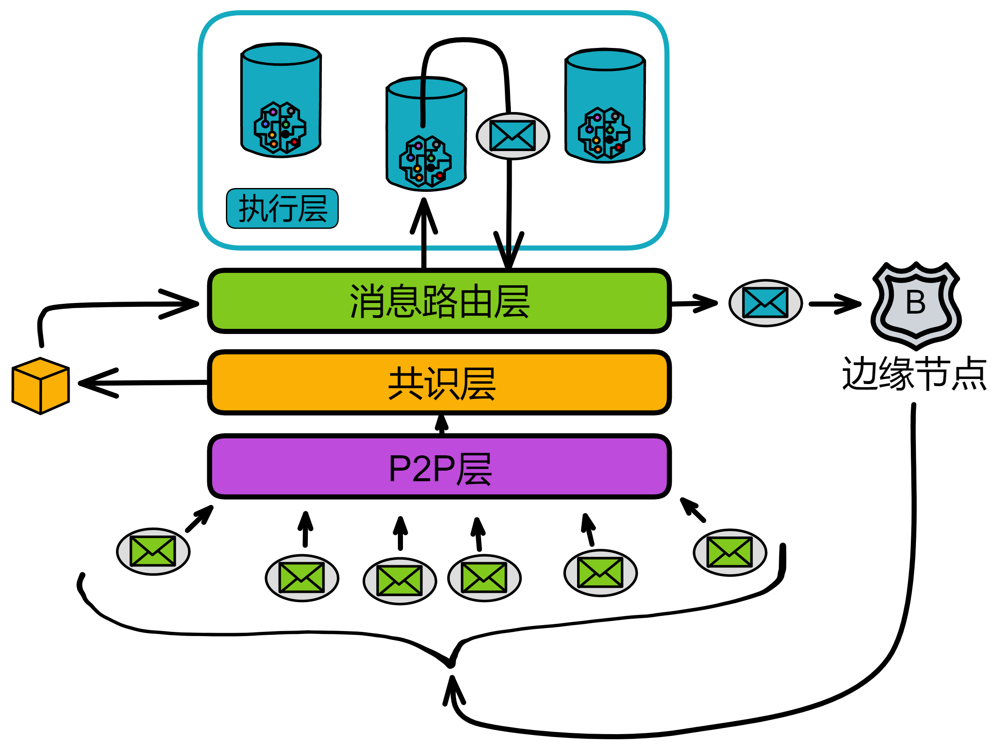

消息路由层**收到**的消息分两种：

一种是用户发来的消息，叫**入口消息**。另一种是其他子网的 Canister 发的消息，叫**跨子网消息**。

消息路由层**发出**的消息也分两种：

一种是对用户消息的响应，叫**入口消息响应**。另一种还是**跨子网消息**，是自己子网的 Canister 发送给其他子网里 Canister 的消息。

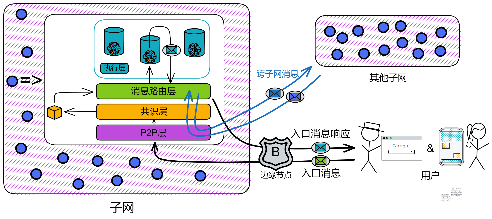

### 消息队列

执行层的每个 Canister 都有输入队列和输出队列。消息路由会把区块中的荷载路由到目标 Canister 的输入队列中。

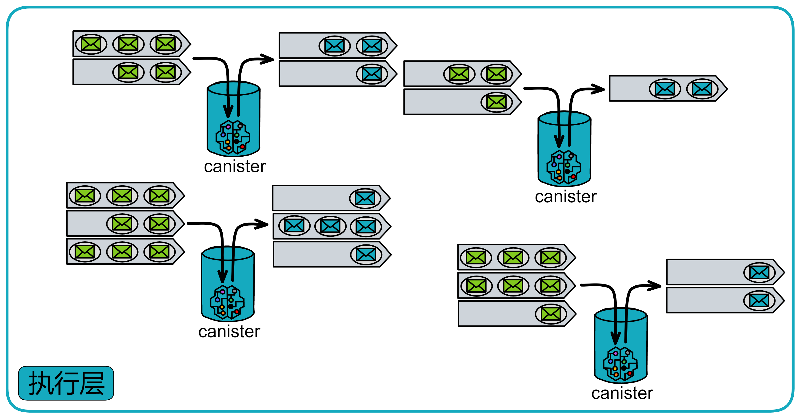

每个 Canister 有自己一些**输入队列**和**输出队列**。

* **输入队列**：

    输入队列里有：来自用户的消息、其他子网里 Canister 发的跨子网消息、子网内其他 Canister 的消息。

    Canister 每轮都会执行一些输入队列中的消息，然后把消息响应放进 Canister 的**输出队列**。

* **输出队列**：

    输出队列里有：对用户消息的响应、发给其他子网里 canister 的消息、发给子网内其他 Canister 的消息。

    当消息路由层从消息队列中拿到消息后，把消息放进**子网间数据流**（Subnet-to-subnet streams），然后由**跨子网传输协议**（Crossnet transfer protocol）来负责将这些消息实际传输到其他子网中。

除了输出队列，还有一种**入口历史**（Ingress history）的数据结构。它记录在一个叫 “ 每轮认证状态 ” 的[哈希树](ToDo：什么是哈希树、默克尔树，词汇表里写)里。入口历史只记录 Canister 执行消息之后的响应。以便用户能获取自己消息的响应。

> 注意：入口历史并不保留所有入口消息的完整历史。只保留更新调用之后响应的消息。
>
> 查询调用的响应不记录在入口历史中（入口历史只记录更新调用的响应），所以也不能用每轮认证状态验证。但 IC 提供了另一种验证机制，就是**认证变量**（Certied variables）。我们可以把一些重要内容用认证变量存储。
>
> 如果查询调用的内容是认证变量，那么查询调用就是安全的、可验证的。因为 Canister 的认证变量是被哈希之后也记录在每轮认证状态里了。而每轮认证状态是经过共识的，也就是说，这些内容在子网里所有副本里都一样。

我们把消息路由和执行层单独拿出来看，就是这样：

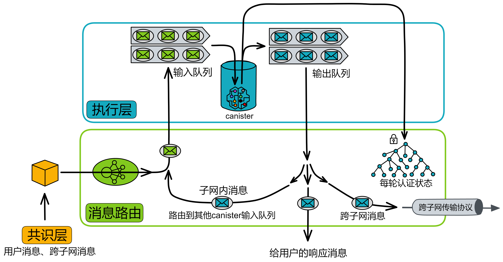

**跨子网的消息**：当 Canister 向其他子网的 Canister 发送信息时，这个信息会被放入跨子网络队列，并在本轮结束时由子网络核实。接收到信息的子网可以通过验证签名来确认信息是经过发送方的授权。这些消息需要经过共识。IC 用 Xnet 协议实现跨子网通信，[后面]()有详细介绍。

### 子网内跨 Canister 调用

除了跨子网的消息外，也有 Canister 调用同一子网内的另一个 Canister 的消息，叫**子网内消息**（Intra-subnet messages）。消息路由层会将这些消息从输出队列直接转到对应 Canister 的输入队列中，不需要经过额外一轮的共识。

那为什么 Canister 发给其他子网的消息要经过共识，而 Canister 给子网内的消息不用经过额外的共识？

因为这种改变状态的操作都在子网内。

你想想，副本们里的数据状态都是一样的，共识也是为了保障副本们数据的一致性。那么副本们达成共识之后，各副本就会进行同样的操作。每个诚实的副本都会执行子网内的跨 Canister 调用，大家一起执行跨 Canister 的调用，这不还是保持一致的操作嘛。

共识是在大家面对各不相同的选择时，用来让大家统一执行操作的。

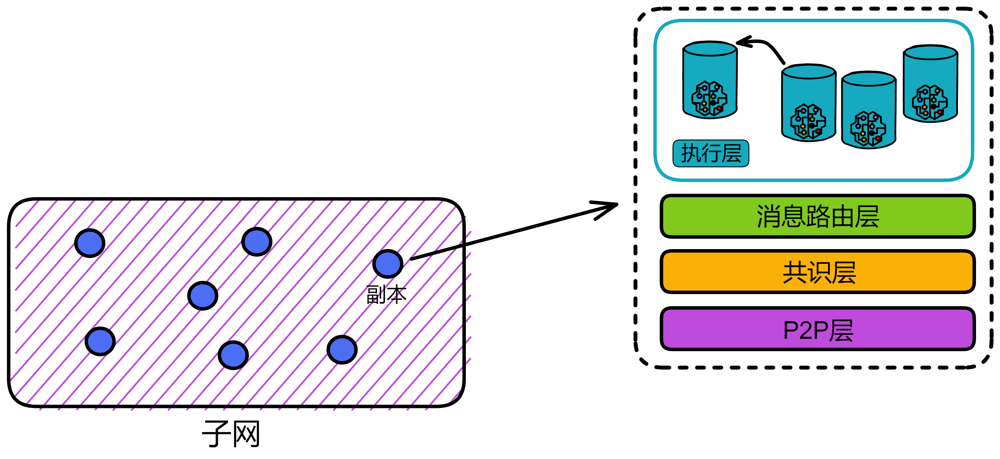

所以子网里的一个 Canister 调用了另一个 Canister 。也就是每个副本都会进行相同的跨 Canister 调用。每个副本里存的数据都是这个子网里的全部数据。副本们都执行跨 Canister 的调用，子网里任然保持着数据的一致性。

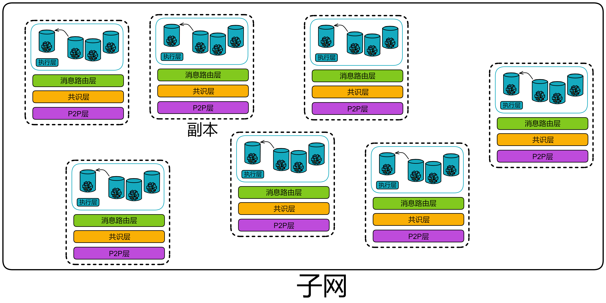

**消息路由层提供的保证** 

1. 跨子网消息必须得一次性传递到目标 Canister 所在子网的执行层。
2. 如果遇到无法传递消息，就必须生成一个拒绝响应。
3. 如果一个 Canister A 向 Canister B 发送两个消息 m1 和 m2 ，如果没被拒绝的话，就必须保证它们按照先后顺序放入 Canister B 的输入队列中。

### 总结

这时候我们来总结一下，一个副本（子网的）的状态包括 Canister 的状态和 “ 系统状态 ” 。 “ 系统状态 ” 包括了 Canister 的输入输出队列、跨子网的数据流和入口历史的数据结构。

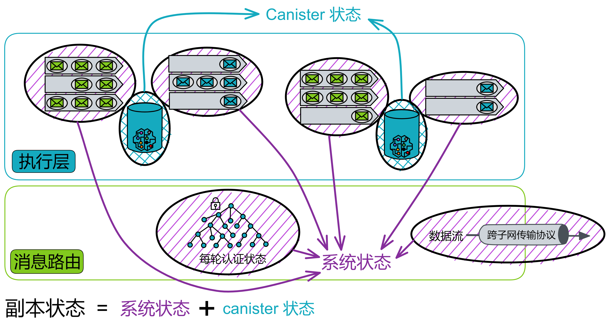

也就是说，消息路由层和执行层一起维护着一个副本的状态。而且副本的状态是在完全确定的情况下更新的，这样子网里所有的副本都保持着完全相同的状态。并且共识层不需要和消息路由层保持完全一致的进度。

## 每轮认证状态

每一轮次中，子网里每个副本的状态都会变更。

在每一轮变更的部分当然也需要单独记录。因为 IC 的共识只保证诚实的副本按照相同的顺序处理消息。共识只在消息进入执行层之前把关，但是消息处理之后的出口还缺少一个 “ 守卫 ” ：消息响应因为网络问题没有发送成功怎么办？客户端收到消息后，怎么验证消息真伪？万一消息响应是黑客伪造就麻烦了。万一服务器系统出现奇怪的 bug 导致消息没有执行 ...... 

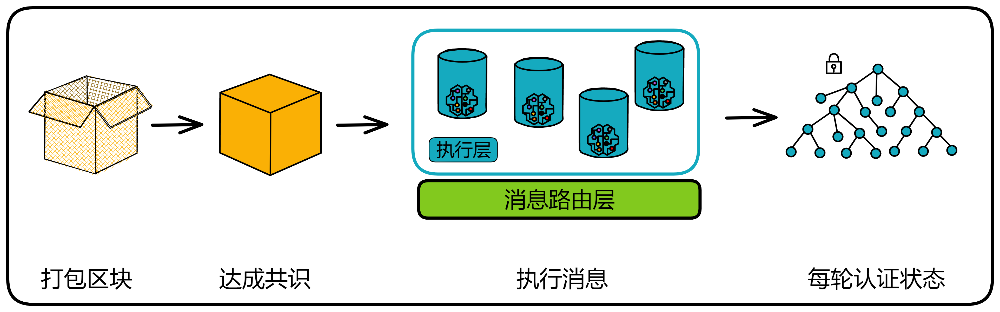

副本之间需要在处理消息后，再最后核对一次状态。**每轮认证状态**（Per-round certified state，也叫系统状态树 The system state tree）就这个守卫，是一个完整轮次中的最后一环。每轮认证状态可以记录这一个轮次中副本改变的状态，并用再广播给大家做一次阈值签名，同样是要经过三分之二的副本确认。

输入和输出都必须经过共识认证，否则就有出现分歧的风险。

所以为了确保每个副本对消息的处理没有问题，在 Canister 执行消息之后，还得把已经执行完的消息记录下来，让副本们之间再核对一下。

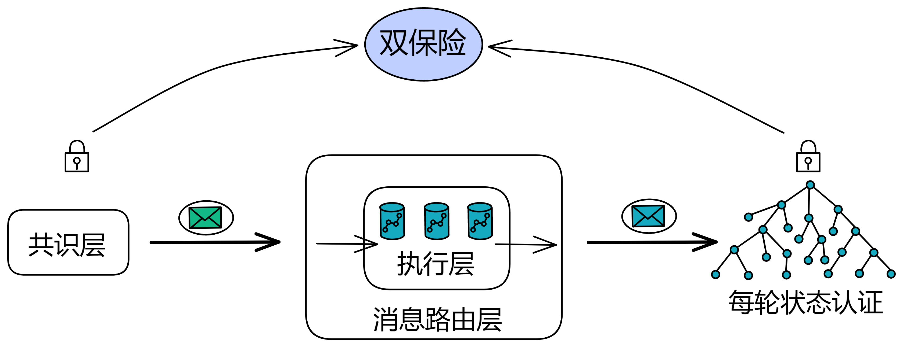

在每个轮次执行消息后，每个副本把自己生成的每轮认证状态哈希一下，打包为[默克尔树](词汇表)（Merkle Tree），并用私钥片段签名。收集够三分之二的签名片段，聚合为完整的签名。状态树和认证过的签名称为每轮认证状态。

因为执行层会以相同的方式处理消息，所以理论上子网中的每个副本都会独立创建出相同的树。

每轮状态树只有一些每轮执行后变动过的数据信息。副本整体的状态不在每轮认证状态里。

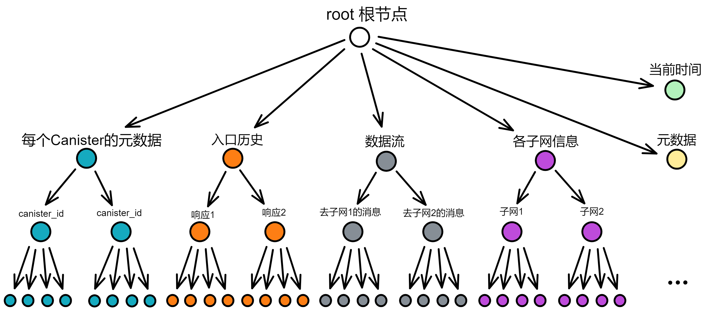

每轮认证状态包含这一轮次里的：

* 多种关于每一个 Canister 的元数据（比如 wasm 的哈希等等，不是 Canister 的完整状态）
* 上一轮每轮认证状态默克尔树的根节点哈希
* 加入子网间数据流的跨子网消息
* 入口历史，对消息的各种响应
* 各个子网的 id 和公钥
* 当前时间
* 元数据

而 IC 的共识层和执行层是分开的，是两个独立的部分。共识层和执行层也都可以调整自己的节奏速度。如果出现共识太快，执行层堆积的消息太多，跟不上共识时，就需要消息路由通知共识层减速。（可能是因为执行层出现了一些 bug 等等）在[这里](链接到共识层延迟函数)看共识是如何减速的。

那怎么知道执行层慢了呢？通过每轮认证状态。每个副本都会观察每轮认证阈值签名的轮次和达成共识的轮次，如果差太多了就得降速了。

就像传统工厂里的流水线一样，有一部分零件慢了，整个生产线都得慢下来。不然待处理的消息堆积越来越多。

## XNet 协议

IC 通过 XNet 协议实现子网之间的通信。为了降低消息传输的延迟，副本倾向于选择离自己更近的副本通信。

简单来说，跨子网消息是这样传输的：

当执行层的 Canister 处理完消息之后，把跨子网消息放进输出队列。消息路由层有一个组件叫**流构建器**（Stream builder），流构建器负责把跨子网消息组成一个个数据流。经过**每轮状态认证**阈值签名后，由副本的 **XNet 端点**执行发送。XNet 端点发送消息给子网 B 最近的副本。子网 B 的副本的 **XNet 荷载构建器**收到消息后，把荷载广播出去。再打包出块达成共识。

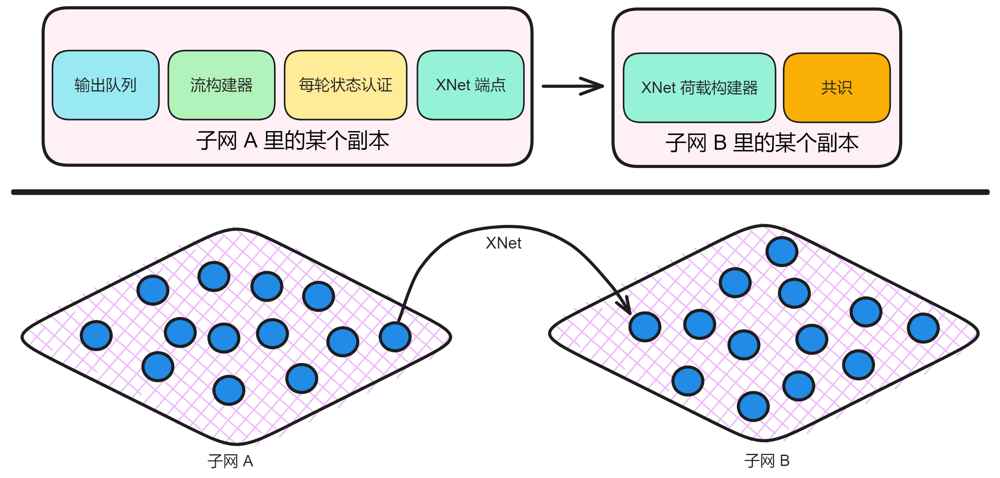

**流构建器**从 Canister 的输出队列中提取消息，给消息们排好队。它需要满足确定性、顺序性和公平性：

1. 确定性：所有副本必须对流的内容达成一致。（副本们对每轮状态认证进行阈值签名）
2. 顺序性：如果 Canister A 先发送请求 R1 给 Canister B ，然后再发送请求 R2 ，那 R1 在数据流中排在 R2 前面。
3. 公平性：我们不希望某个 Canister 占用过多的带宽。流构建器会尽量让每个 Canister 有相同的带宽。

流构建器根据目标子网对这些消息排序，并组成一个个消息流（每个目标子网一个消息流）。每个消息流中的消息都有一个唯一递增的索引。

之后每轮状态认证会对已提交的状态进行认证。完成认证后，认证过的数据流就可以发送给其他子网了。

**XNet 端点**负责把认证过的消息发送到其他子网。XNet 端点是一个为其他子网提供消息的组件，它通过安全的 TLS 连接提供服务，仅接受来自其他副本的连接。XNet 端点从注册表中获取节点的完整列表、子网分配、IP 地址和公钥（用于建立 TLS 连接）。

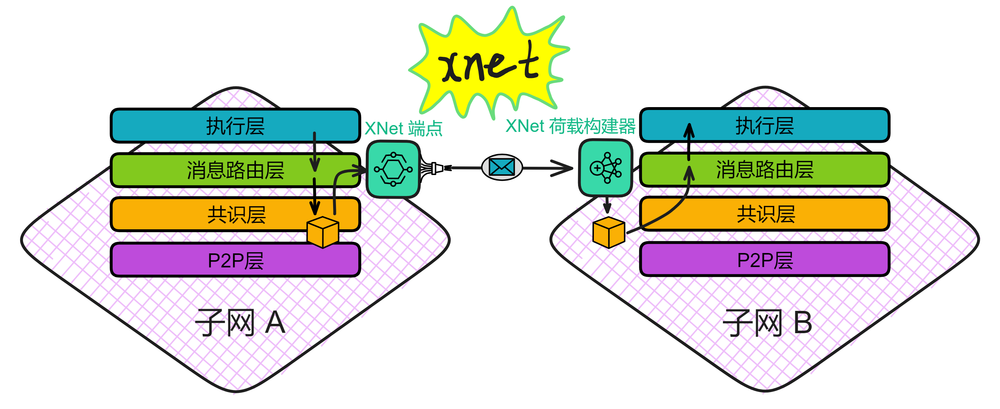

如果子网 B 的副本想从子网 A 获取新消息，它会选一个最近的子网 A 副本，然后通过 XNet 协议向这个副本发送请求。XNet 通过 Https 协议传输信息。

**XNet 荷载构建器**负责接收跨子网消息。顾名思义，接收之后就会把这些消息作为荷载打包进区块里，达成共识，执行 ...... 

除了跨子网消息，还有用户入口消息、比特币交易（对于启用了比特币集成的子网）也会作为荷载打包进区块里。

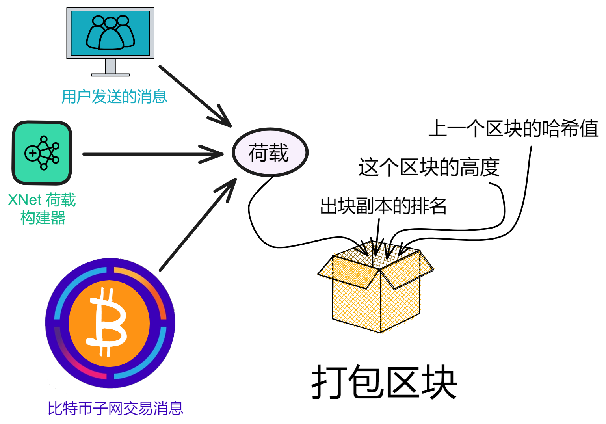

将这些荷载组合并打包到一个区块中后，共识协议将对整个区块进行验证并达成共识。完成共识后，荷载中的消息将得到处理。

这就是消息从一个子网传递到另一个子网的过程。如下图所示。

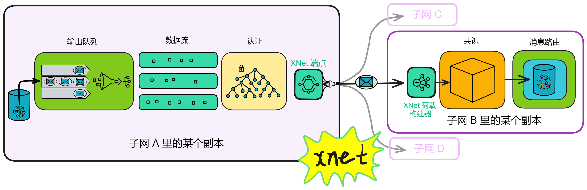

垃圾回收（Garbage collection）：发送消息之后还需要告诉子网 A 哪些消息已经被子网 B 处理过了，这样子网 A 就可以清除这些不再需要的消息。

这些组件确保了跨子网消息能正确传递，并实现了安全、可扩展的区块链通信。

