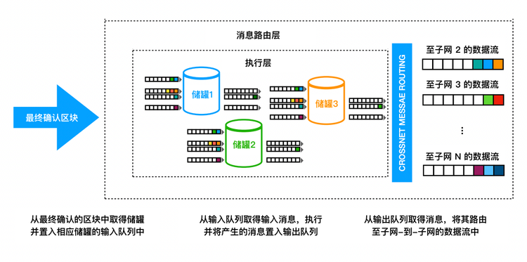
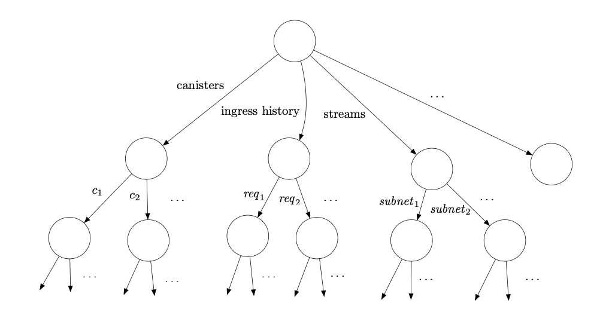

# 消息路由层

如同[章节 1.7](#1.7 执行模型)中讨论的，IC中的基础计算单元称为**容器**，可以粗略的等同于*进程*的概念，其同时包含了一个*程序*和它的*状态*。IC提供了容器中执行程序的运行时环境并使其能够于其他容器和外部用户通信（通过消息传递）。

&emsp;&emsp;共识层（见[第5章](#5. 共识层)）将输入打包进区块的**荷载**中，并随着区块被最终确认，相应的荷载会被传递给**消息路由层**并由**执行环境**处理。执行层将随之更新复制状态机中相应容器中的状态，并将输出交由**消息路由层**处理

&emsp;&emsp;有必要区分两种输入类型：

**入口消息：**来自外部用户的消息

**跨子网消息：**来自其他子网的容器的消息

&emsp;&emsp;我们同样可以区分两种输出类型：

**入口消息响应：**对于入口消息的响应（可被外部用户取回）

**跨子网消息：**传输给其他子网容器的消息

&emsp;&emsp;当收到来自共识的负载后，这些负载中的输入会被置入不同的**输入队列**。对于一个子网下的每一个容器 $C$，都存在多个输入队列：用于发给*$C$*的的入口消息，用于和$C$通信的每一个别的容器$C$'（如果$C'$和$C$不在同一个子网，将会是跨子网消息）。如下详述，在每一轮中，执行层都会消耗这些队列中的一些输入，更新相应容器中的复制状态，并将输出置于不同的**输出队列**中。对于一个子网下的每一个容器$C$，都存在多个输出队列：对于每一个与$C$通信的容器$C'$，都有其各自的队列（如果$C'$和$C$不在同一个子网，将会是跨子网消息）。消息的路由层将取得消息队列中的消息并置入**子网间数据流**，以被**跨子网传输协议**处理 ，该协议的工作是将这些消息实际传输到其他子网。	

图 3: 消息路由层和执行层
		

&emsp;&emsp;除了这些输出队列外，同时存在一种**入口历史**的数据结构。一旦一条入口消息已被容器处理，对该条入口消息的**响应**将被记录在该数据结构中。此刻，提供该条入口消息的外部用户将能够获取相关的响应。（注意*入口历史*并不保留所有入口消息的完整历史）。

&emsp;&emsp;我们也应提及除了跨子网消息外，也存在着**子网内消息（intra- subnet messages）**，这些是*同一子网下*由一个容器发送给另一容器的消息。消息路由层会将这类消息由输出队列直接移至对应的输入队列中。

&emsp;&emsp;图3展示了消息路由层以及执行层的基础功能。

&emsp;&emsp;需要注意的是，节点副本的状态包括容器的状态以及“系统状态”。“系统状态”包括上述提及的队列，数据流以及*入口历史*的数据结构。因此，消息路由层和执行层同时参与更新和维护子网的副本状态。此状态应全部在完全**确定性**的原则下被更新，这样所有的节点都会维护完全相同的状态。

&emsp;&emsp;另外需要注意的是，共识层解耦于消息路由层以及执行层，也就是说传入荷载之前，共识区块链中的任何分叉都已经被解决了。事实上，共识层允许提前运行，并不需要和消息路由层保持完全一致的进度。

### 6.1 每轮认证状态（Per-round certified state）

在每一轮，一个子网下的*某些*状态会被认证。**每轮认证状态**通过链钥密码学（详见[章节1.6](#1.6 链钥密码学（Chain-key cryptography）)）进行验证，具体使用了[第3章](#3 链钥密码学I：阈值签名)提及的$(n-f)/n$的阈值签名。细节上，给定轮次下当每个副本生成了每轮认证状态，副本将生成相应阈值签名的片段并将其广播给其子网下的所有其他节点副本。一旦收集了$n - f$个片段，每个节点副本就可以构建出最终的阈值签名，该签名作为该轮次每轮认证状态的**证书**。需要注意的是，签名前每轮认证状态会经哈希计算为**默克尔树（Merkle Tree ）**[[Mer87]](#Mer87)。

给定轮次的每轮认证状态包含

1. 最近加入子网间数据流的跨子网消息；
2. 其他元数据，包括入口历史的数据结构；
3. 来自前一轮的每轮认证状态的默克尔树的根节点哈希。

请注意每轮认证状态并不包括一个子网的完整副本状态，因为这么做整体上状态将非常庞大，而且在*每轮*认证全部状态也并不实际[^5]。

&emsp;&emsp;图4展示了每轮认证状态是如何被组织入树中的。该树的第一个分支存储了多种关于每一个容器的元数据（但不是容器的完整副本状态）。第二个分支储存了入口历史的数据结构。第三个分支储存了关于子网间数据流的信息，包括了对每个数据流新加入的跨子网消息的“视图”。其他的分支存储了其他类型的元数据，这里不做讨论。该树状结构之后可被哈希计算为一棵默克尔树，其本质上拥有与该树相同的尺寸和形状。

图4：每轮认证状态被组织成树
		

&emsp;&emsp;每轮认证状态在IC中有一下用例：

- **输出验证**。跨子网消息和入口消息响应可以利用每轮认证状态进行验证。使用默克尔树的结构，一个单独的输出（跨子网消息或是入口消息响应）可以被任一方通过提供根节点的阈值签名来验证，以及默克尔树中从根节点至叶节点的路径（以及相邻的）的哈希值。因此，验证一个单独输出的所需的哈希值数量与*默克尔*树的深度成比例，即使哈希树的尺寸非常大，该数值也通常非常小。因此，单个阈值签名可被有效的用于验证许多单独的输出。

- **防止并识别非确定性**。共识确保了每个节点按相同的顺序下处理输入。因为每个节点副本都确定性处理这些输入，每个节点副本都应取得相同的状态。但是，IC在设计上额外增加了一层健壮性来发现并阻止任何（意外的）非确定性计算，如果其真的发生。其中每轮认证状态是该机制中的一部分，因为我们使用了$(n-f)/n$的阈值签名来认证，且$f < n/3$，所以仅有单个状态序列可被认证。

    要理解状态成链为何如此重要，我们考虑如下的例子。假设我们有$P_1, P_2, P_3, P_4$四个节点副本，且其中一个节点副本$P_4$为恶意节点。$P_1,P_2,P_3$起始状态都相同。

    -   在轮次1，由于非确定性计算，$P_1,P_2$均开始计算一条消息$m_1$以发送至子网A，而$P2$则计算$m'_1$以发送至子网A。

    -   在轮次2，$P_1,P_3$均开始计算消息$m_2$以发送至子网$B$，而$P_2$则计算消息$m'_2$以发送至子网$B$

    -   在轮次3，$P_2,P_3$均开始计算消息m3以发送至子网C，而P2则计算消息$m'_3$以发送至子网$C$

&emsp;&emsp;如下表所示：

$$
P_1\ \ m_1 \rightarrow A\ \ m_2 \rightarrow B\ \ m'_3 \rightarrow C \\
P_2\ \ m_1 \rightarrow A\ \ m'_2 \rightarrow B\ \ m_3 \rightarrow C \\
P_3\ \ m'_1 \rightarrow A\ \ m_2 \rightarrow B\ \ m_3 \rightarrow C \\
$$
我们假设节点$P_1,P_2,P_3$各自执行有效序列的计算，但是因为非确定性，这些序列并不相同。（即使不应当存在任何的非确定性，我们在这个例子中依然假设其存在。）

现在假设我们没有将这些状态成链。因为$P_4$为恶意且可能签名任何内容，它可以在轮次1的状态中创建一个申明“$m_1\rightarrow A$”的$3/4$的阈值签名，类似得在轮次2的状态中申明”$m2\rightarrow B$“，并在轮次3状态中申明“$m3\rightarrow C$”，尽管对应的序列

$$
m_1	\rightarrow A, m_2 \rightarrow B, m_3 \rightarrow C
$$
可能不与**任何**有效的序列兼容。更糟糕的是，此无效的计算序列可能导致了其他子网的状态不一致。

通过成链，我们确保了即使存在一定程度的非确定性，任何经认证状态的序列都对应了*一些*由诚实节点执行的有效序列。

-   **与共识协作**。每轮认证状态也被用于与执行层和共识层协作，有如下两种方式：
    - *共识降速（Consensus throttling）*。每个节点都会跟踪存在认证状态的最新轮次—这被称之为**认证高度**。它也将跟踪存在经公证区块的最新轮次—这被称之为**公证高度**。如果公证高度明显大于认证高度，这是执行延迟于共识的信号，则共识需被降速。该延迟可能由非确定性计算或者由协议不同层中的性能不匹配导致。共识将通过[章节5.9](#5.9 延迟函数)中讨论的*延迟函数*进行降速—具体来说，每一个节点都会增加其*调节器*的数值$\epsilon$，作为公证高度与认证高度增长的时间间隔（这里用了[章节5.12.2](#5.12.2 本地化调整的延迟函数（Locally adjusted delay functions）)中提及的“本地化调整的延迟函数”的概念）。
    - *特定状态的荷载有效性验证（State-specific payload validation）*。如[章节5.7](#5.7 公证)所述，负载中的输入必须通过某些有效性检查。事实上，这些有效性检查可能取决于该状态的进度。我们略过的一个细节是，每个区块都包含一个轮次数，这些有效性检查应当考虑该轮次的验证后状态。一个需要执行验证的节点需要等待该轮次的状态被认证，然后使用该轮经认证的状态来进行验证。这么做确保了即使存在非确定性计算，所有的节点都在进行相同的有效性测试（否则共识可能会停滞）。

[^5]: 但是详见[章节8.2](#8.2 CUPs)

### 6.2 查询调用和更新调用

正如我们之前所述，所有的入口消息必须经过共识，才能被子网的所有节点副本按相同的顺序进行处理。但是，针对那些处理时不会变更状态的入口消息，可以进行一项重要的优化。他们被称为**查询调用**—而相对的其他入口消息，被称为**更新调用**。查询调用被允许进行只读或是可能改变容器状态的计算，但是任何对节点副本状态的更新都不会被提交给复制状态。正因如此，查询调用可以被单个节点副本直接处理而不需要经过共识，这极大的降低了从查询调用获得响应的延迟。

&emsp;&emsp;需要注意的是，查询调用的响应不会记录在*入口历史*的数据结构中，因此也不可以用之前的每轮认证状态进行验证。但是，我们提供了一种单独的用于验证该类响应的机制：认证变量。作为每轮认证状态中的一部分，每个子网下的容器都被分配了一小段字节，这便是*该容器的认证变量*，其值可通过更新调用进行更新，也可被每轮认证状态机制来进行验证。另外，容器也可使用其认证变量来存储默克尔树的的根节点。通过这种方式，只要查询调用的响应是该容器中以认证变量为根的默克尔树的叶节点，即可被验证。

### 6.3 外部用户验证

入口消息和跨子网消息的一个主要区别在于用于验证消息的机制。我们已经看到（详见[章节6.1](#6.1 每轮认证状态（Per-round certified state） )），聚合签名如何被用于验证跨子网消息。NNS的注册表（见[章节1.5](#1.5 权限模型)）持有用于验证跨子网消息的阈值签名的验证公钥。

&emsp;&emsp;IC中没有外部用户的中央注册表。相反，外部用户通过一串公钥哈希作为**用户标识**（又称*principal*）来向容器来标识自己。用户自己持有对应的签名密钥，用来签署入口消息。签名和公钥会随着入口消息一起发送。IC将自动验证签名并传递用户标识给到对应的容器。随后该容器根据用户标识和入口消息中指定操作的其他参数，批准请求的操作。

&emsp;&emsp;新用户在首次与IC交互时会生成一对密钥对并从公钥中衍生出他们的用户标识。老用户根据存储在用户代理中的私钥完成验证。用户还可以用签名委托的方式，将多个密钥对关联到一个用户身份上。该特性非常有用，因为它允许了一个用户在多个设备上通过相同的用户身份证明来访问IC。

