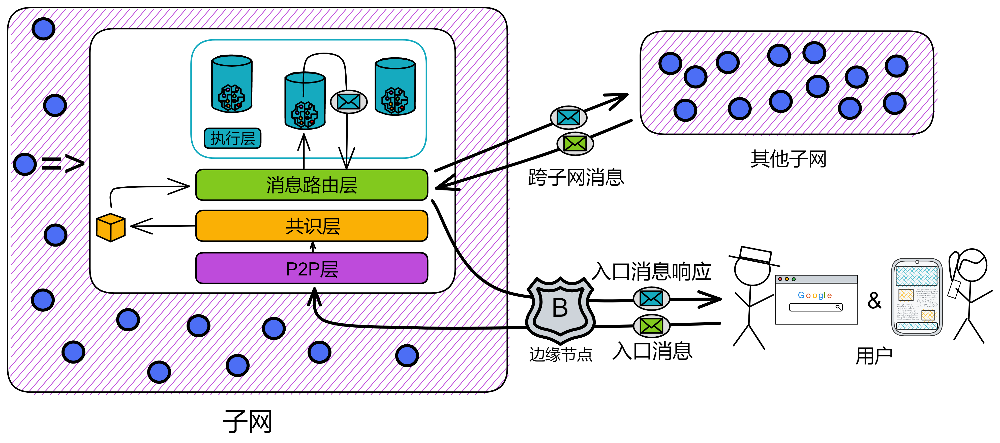

https://internetcomputer.org/docs/current/references/ic-interface-spec/#state-tree

https://wiki.internetcomputer.org/wiki/Replicated_state_structure

https://mmapped.blog/posts/08-ic-xnet.html

https://wiki.internetcomputer.org/wiki/IC_state_manager#Operation_of_the_State_Manager

https://wiki.internetcomputer.org/wiki/IC_message_routing_layer#Deterministic_State_Machine


# 消息路由层


## 副本内的消息收发站

消息路由层顾名思义，负责一个副本内部的消息传递，承上启下。

### 简介

共识层将消息打包进区块的**荷载**（payload）中，区块敲定之后。子网里的每个副本都会解析区块中的荷载，并由消息路由层将消息传递给执行层里对应的 canister 。Canister 执行完消息后，更新其内部状态，然后把消息响应交给消息路由层。


消息路由层**收到**的消息分两种：

一种是用户发来的消息，叫**入口消息**。另一种是其他子网的 canister 发的消息，叫**跨子网消息**。

消息路由层**发出**的消息也分两种：

一种是对用户消息的响应，叫**入口消息响应**。另一种还是**跨子网消息**，是自己子网的 canister 发送给其他子网里 canister 的消息。




### 消息队列

执行层的每个 canister 都有输入队列和输出队列。消息路由会把区块中的荷载路由到目标 canister 的输入队列中。


每个 canister 有自己一些**输入队列**和**输出队列**。

* **输入队列**：

    输入队列里有：来自用户的消息、其他子网里 canister 发的跨子网消息、子网内其他 canister 的消息。

    Canister 每轮都会执行一些输入队列中的消息，然后把消息响应放进 canister 的**输出队列**。

* **输出队列**：

    输出队列里有：对用户消息的响应、发给其他子网里 canister 的消息、发给子网内其他 canister 的消息。

    当消息路由层从消息队列中拿到消息后，把消息放进**子网间数据流**（subnet-to-subnet streams），然后由**跨子网传输协议**（crossnet transfer protocol）来负责将这些消息实际传输到其他子网中。


除了输出队列，还有一种**入口历史**（ingress history）的数据结构。它记录在一个叫 “ 每轮认证状态 ” 的[哈希树](ToDo：什么是哈希树、默克尔树，词汇表里写)里。入口历史只记录 canister 执行消息之后的响应。以便用户能获取自己消息的响应。

> 注意：入口历史并不保留所有入口消息的完整历史。只保留执行之后的响应消息。


我们把消息路由和执行层单独拿出来看，就是这样：


### 子网内跨 canister 调用

除了跨子网的消息外，也有 canister 调用同一子网内的另一个 canister 的消息，叫**子网内消息**（intra-subnet messages）。消息路由层会将这些消息从输出队列直接转到对应 canister 的输入队列中，不需要经过额外一轮的共识。


那为什么 canister 发给其他子网的消息要经过共识，而 canister 给子网内的消息不用经过额外的共识？

答：因为这种改变状态的操作都在子网内。😂

你想想，副本们里的数据状态都是一样的，共识也是为了保障副本们数据的一致性。那么副本们达成共识之后，各副本就会进行同样的操作。每个诚实的副本都会执行子网内的跨 canister 调用，大家一起执行跨 canister 的调用，这不还是保持一致的操作嘛。

共识是在大家面对各不相同的选择时，用来让大家统一执行操作的。


所以子网里的一个 canister 调用了另一个 canister 。也就是每个副本都会进行相同的跨 canister 调用。每个副本里存的数据都是这个子网里的全部数据。副本们都执行跨 canister 的调用，子网里任然保持着数据的一致性。


### 总结

这时候我们来总结一下，一个副本（子网的）的状态包括 canister 的状态和 “ 系统状态 ” 。 “ 系统状态 ” 包括了 canister 的输入输出队列、跨子网的数据流和入口历史的数据结构。


也就是说，消息路由层和执行层一起维护着一个副本的状态。而且副本的状态是在完全确定的情况下更新的，这样子网里所有的副本都保持着完全相同的状态。并且共识层不需要和消息路由层保持完全一致的进度。


## 每轮认证状态

每一轮次中，子网里每个副本的状态都会变更。

在每一轮变更的部分当然也需要单独记录。因为 IC 的共识只保证诚实的副本按照相同的顺序处理消息。共识只在消息进入执行层之前把关，但是消息处理之后的出口还缺少一个 “ 守卫 ” ：消息响应因为网络问题没有发送成功怎么办？客户端收到消息后，怎么验证消息真伪？万一消息响应是黑客伪造就麻烦了。万一服务器系统出现奇怪的 bug 导致消息没有执行 ...... 


副本之间需要在处理消息后，再最后核对一次状态。**每轮认证状态**（Per-round certified state，也叫系统状态树 The system state tree）就这个守卫，是一个完整轮次中的最后一环。每轮认证状态可以记录这一个轮次中副本改变的状态，并用再广播给大家做一次阈值签名，要经过三分之二的副本确认。


在每个轮次执行消息后，每个副本把自己生成的每轮认证状态哈希一下，打包为[默克尔树](词汇表)（Merkle Tree），并用私钥片段签名。收集够三分之二的签名片段，聚合为完整的签名，作为该轮次每轮认证状态的证书。


> 这个共识算法是只用于就计算的输入达成一致，还是也用于就计算的输出达成一致？
>
> 答：对于输入，它们是块。对于输出，它们是认证。所以是的，输入和输出都必须经过共识，否则我们就有分歧的风险。


每轮认证状态包含这一轮次里的：

* 加入子网间数据流的跨子网消息
* 其他元数据，包括入口历史的数据结构
* 上一轮每轮认证状态默克尔树的根节点哈希


第一个分支存储了多种关于每一个容器的元数据（但不是容器的完整副本状态）。

第二个分支储存了入口历史的数据结构。

第三个分支储存了关于子网间数据流的信息，包括了对每个数据流新加入的跨子网消息的“视图”。

其他的分支存储了其他类型的元数据，这里不做讨论。该树状结构之后可被哈希计算为一棵默克尔树。


<center>图4：每轮认证状态被组织成树</center>


每轮状态认证在 IC 中有一下用例：


- **输出验证**。跨子网消息和入口消息响应可以利用每轮认证状态进行验证。使用默克尔树的结构，一个单独的输出（跨子网消息或是入口消息响应）可以被任一方通过提供根节点的阈值签名来验证，以及默克尔树中从根节点至叶节点的路径（以及相邻的）的哈希值。因此，验证一个单独输出的所需的哈希值数量与默克尔树的深度成比例，即使哈希树的尺寸非常大，该数值也通常非常小。因此，单个阈值签名可被有效的用于验证许多单独的输出。


- **防止并识别非确定性**。共识确保了每个节点按相同的顺序下处理输入。因为每个副本都确定性处理这些输入，每个副本都应取得相同的状态。

    但是，IC在设计上额外增加了一层健壮性来发现并阻止任何（意外的）非确定性计算，如果其真的发生。

    其中每轮认证状态是该机制中的一部分，因为我们使用了$(n-f)/n$的阈值签名来认证，且$f < n/3$，所以仅有单个状态序列可被认证。

    要理解状态成链为何如此重要，我们考虑如下的例子。假设我们有$P_1, P_2, P_3, P_4$四个节点副本，且其中一个副本$P_4$恶意。$P_1,P_2,P_3$起始状态都相同。

    -   在轮次1，由于非确定性计算，$P_1,P_2$均开始计算一条消息$m_1$以发送至子网A，而$P3$则计算$m'_1$以发送至子网A。

    -   在轮次2，$P_1,P_3$均开始计算消息$m_2$以发送至子网$B$，而$P2$则计算消息$m'_2$以发送至子网$B$ 

    -   在轮次3，$P_2,P_3$均开始计算消息m3以发送至子网C，而$P1$则计算消息$m'_3$以发送至子网$C$

如下表所示：

$$
P_1\ \ m_1 \rightarrow A\ \ m_2 \rightarrow B\ \ m'_3 \rightarrow C \\
P_2\ \ m_1 \rightarrow A\ \ m'_2 \rightarrow B\ \ m_3 \rightarrow C \\
P_3\ \ m'_1 \rightarrow A\ \ m_2 \rightarrow B\ \ m_3 \rightarrow C \\
$$
我们假设节点$P_1,P_2,P_3$各自执行有效序列的计算，但是因为非确定性，这些序列并不相同。（即使不应当存在任何的非确定性，我们在这个例子中依然假设其存在。）

现在假设我们没有将这些状态成链。因为$P_4$为恶意且可能签名任何内容，它可以在轮次1的状态中创建一个申明“$m_1\rightarrow A$”的$3/4$的阈值签名，类似得在轮次2的状态中申明”$m2\rightarrow B$“，并在轮次3状态中申明“$m3\rightarrow C$”，尽管对应的序列

$$
m_1	\rightarrow A, m_2 \rightarrow B, m_3 \rightarrow C
$$
可能不与**任何**有效的序列兼容。更糟糕的是，此无效的计算序列可能导致了其他子网的状态不一致。

通过成链，我们确保了即使存在一定程度的非确定性，任何经认证状态的序列都对应了一些由诚实节点执行的有效序列。


假设有4个副本，分别为 $P_1, P_2, P_3, P_4$，其中 $P_4$ 被设想为恶意副本。在开始时，$P_1$，$P_2$，和 $P_3$ 的状态都是相同的。

接下来的几个轮次中，每个副本会开始计算一些消息并将它们发送到不同的子网中，这些子网分别为 A、B 和 C。

* 但是，在轮次1中，$P_1$ 和 $P_2$ 开始计算消息 $m_1$，并且 $P_3$ 还计算了一个不同的消息 $m'_1$。
* 在轮次2中，$P_1$ 和 $P_3$ 开始计算消息 $m_2$，并且 $P_2$ 计算了不同的消息 $m'_2$。
* 最后，在轮次3中，$P_2$ 和 $P_3$ 开始计算消息 $m_3$，并且 $P_1$ 计算了不同的消息 $m'_3$。

因此，每个副本都计算了不同的消息，并且每个副本的状态序列也不相同。在这个例子中，我们假设存在一些非确定性计算，导致每个副本计算的消息和状态序列都不相同。

如果不考虑这个问题，副本 $P_4$ 可能会签名任何内容，因为它是一个恶意副本。

如果我们没有将状态成链，那么 $P_4$ 可能会：

* 在第一轮中签名一个声明“$m_1\rightarrow A$”的阈值签名，
* 而在第二轮中签名一个声明“$m_2\rightarrow B$”的阈值签名，
* 最后在第三轮中签名一个声明“$m_3\rightarrow C$”的阈值签名。

即使这些签名的消息序列是无效的，并且与任何有效的序列都不兼容，这个恶意副本仍然可以伪造签名。

通过将状态成链，我们可以确保任何已经经过认证的状态序列都与一些由诚实副本执行的有效序列相对应，即使存在某种程度的非确定性。这可以防止恶意副本利用它们的签名权利来伪造无效的状态序列，并防止不同子网的状态不一致。


共识层确保了副本按统一的顺序处理消息。但执行的时候还有可能被机器故障、系统的未知 bug 干扰，可能出现没有执行某条消息的情况 ...... 

所以为了确保每个副本对消息的处理没有问题，在 canister 执行消息之后，还得把已经执行完的消息记录下来，让副本们之间再核对一下


-   **与共识协作**。每轮认证状态也被用于与执行层和共识层协作，有如下两种方式：
    - *共识降速（Consensus throttling）*。每个节点都会跟踪存在认证状态的最新轮次—这被称之为**认证高度**。它也将跟踪存在经公证区块的最新轮次—这被称之为**公证高度**。如果公证高度明显大于认证高度，这是执行延迟于共识的信号，则共识需被降速。该延迟可能由非确定性计算或者由协议不同层中的性能不匹配导致。共识将通过[章节5.9](#5.9 延迟函数)中讨论的*延迟函数*进行降速—具体来说，每一个节点都会增加其*调节器*的数值$\epsilon$，作为公证高度与认证高度增长的时间间隔（这里用了[章节5.12.2](#5.12.2 本地化调整的延迟函数（Locally adjusted delay functions）)中提及的“本地化调整的延迟函数”的概念）。
    - *特定状态的荷载有效性验证（State-specific payload validation）*。如[章节5.7](#5.7 公证)所述，负载中的输入必须通过某些有效性检查。事实上，这些有效性检查可能取决于该状态的进度。我们略过的一个细节是，每个区块都包含一个轮次数，这些有效性检查应当考虑该轮次的验证后状态。一个需要执行验证的节点需要等待该轮次的状态被认证，然后使用该轮经认证的状态来进行验证。这么做确保了即使存在非确定性计算，所有的节点都在进行相同的有效性测试（否则共识可能会停滞）。


## 查询调用和更新调用

正如我们之前所述，所有的入口消息必须经过共识，才能被子网的所有节点副本按相同的顺序进行处理。但是，针对那些处理时不会变更状态的入口消息，可以进行一项重要的优化。他们被称为**查询调用**—而相对的其他入口消息，被称为**更新调用**。

查询调用被允许进行只读或是可能改变容器状态的计算，但是任何对副本状态的更新都不会被提交给复制状态。正因如此，查询调用可以被单个副本直接处理而不需要经过共识，这极大的降低了从查询调用获得响应的延迟。


需要注意的是，**查询调用的响应不会记录在入口历史的数据结构中，因此也不可以用之前的每轮认证状态进行验证**。

但是，我们提供了一种单独的用于验证该类响应的机制：**认证变量**（certied variables）。作为每轮认证状态中的一部分，每个子网下的容器都被分配了一小段字节，这便是该容器的认证变量，其值可通过更新调用进行更新，也可被每轮认证状态机制来进行验证。另外，容器也可使用其认证变量来存储默克尔树的的根节点。通过这种方式，只要查询调用的响应是该容器中以认证变量为根的默克尔树的叶节点，即可被验证。


## 外部用户验证

入口消息和跨子网消息的一个主要区别在于用于验证消息的机制。我们已经看到（详见[章节6.1](#6.1 每轮认证状态（Per-round certified state） )），聚合签名如何被用于验证跨子网消息。NNS的注册表（见[章节1.5](#1.5 权限模型)）持有用于验证跨子网消息的阈值签名的验证公钥。

IC中没有外部用户的中央注册表。相反，外部用户通过一串公钥哈希作为**用户标识**（又称*principal*）来向容器来标识自己。用户自己持有对应的签名密钥，用来签署入口消息。签名和公钥会随着入口消息一起发送。IC将自动验证签名并传递用户标识给到对应的容器。随后该容器根据用户标识和入口消息中指定操作的其他参数，批准请求的操作。

新用户在首次与IC交互时会生成一对密钥对并从公钥中衍生出他们的用户标识。老用户根据存储在用户代理中的私钥完成验证。用户还可以用签名委托的方式，将多个密钥对关联到一个用户身份上。该特性非常有用，因为它允许了一个用户在多个设备上通过相同的用户身份证明来访问IC。


本文详细解释了互联网计算机（Internet Computer）中节点状态的结构和复制状态的概念。文章还介绍了每轮认证状态（Per-round Certified State）的概念，以及互联网计算机中不同层次的消息处理和执行流程。

**互联网计算机中的节点状态**

互联网计算机的每个节点都维护一个状态。状态包含与Canister相关的数据、节点处理的消息、消息处理后生成的响应等。状态的一部分对每个节点是独立的（例如：在对等层收到的消息、加密密钥材料）。状态的另一部分对子网中所有诚实节点是相同的。这部分状态称为子网的复制状态。

**每轮认证状态**

在每个共识轮次中，子网中的一个节点提议一个新的区块。子网中的节点执行共识协议，每个共识轮次确定一个区块。最终确定的区块被传递到消息路由层。消息路由层将区块中的每个消息路由到目标Canister的适当输入队列。

对于在子网上运行的每个Canister C，都有多个输入队列。有一个专门用于处理外部用户发送给C的入口消息的输入队列。对于与C通信的每个其他Canister C'，都有一个输入队列。该输入队列用于存储从Canister C'接收的跨子网消息。在每个轮次中，执行层将消耗这些队列中的一部分输入，更新相关Canister的复制状态，并将输出放入入口历史记录和各种输出队列。入口历史记录用于存储Canister在处理入口消息时生成的响应。对于在子网上运行的每个Canister C，都有多个输出队列。对于与C通信的每个其他Canister C'，都有一个输出队列。该输出队列用于存储要从C发送到C'的跨子网消息。

**认证状态树**

在每轮结束后，子网中的每个节点都将与轮次执行相关的一些信息存储在如下所示的树结构中。执行层被设计为以确定性方式执行所有Canister。因此，子网中的每个节点应独立创建相同的树。然后，每个节点通过对以下树进行哈希来创建一个Merkle树，使用其阈值签名密钥对根哈希进行签名，并将其签名份额广播给子网中的其他节点。在收到来自对等节点的签名份额后，每个节点将签名份额组合成根哈希的签名。现在，这棵树被认为已经被子网中的节点认证。以下状态树及其签名称为每轮认证状态。证书创建过程可以在接口规范中找到。每轮状态树也被称为系统状态树。


在上述每轮状态树中，内部节点存储一个标签并由矩形表示。叶子节点包含数据，由圆角框表示。在每轮状态树中，存储以下信息：

1. **时间** - 生成树的区块链的高度。
2. **元数据** - 子网的元数据。
3. **Canister** - 对子网上的每个Canister，存储认证状态、模块哈希、控制器和元数据。
4. **控制器** - 每个Canister可以有一个（可能为空的）控制器列表。Canister的控制器具有升级、停止或删除Canister的能力。
5. **模块哈希** - 每个Canister运行一个Web Assembly（WASM）模块。模块哈希是模块的哈希。
6. **元数据** - 元数据包含一堆键值对。当将WASM模块安装到Canister时，区块链节点会查看WASM模块的"Custom Section"，并将数据放置在Canister的元数据中。元数据的最常见用例是存储Canister的candid接口和Canister代码的git仓库链接。
7. **认证状态** - 当用户向互联网计算机发送查询调用时，消息只会被子网中的一个（可能恶意的）区块链节点处理。查询调用的响应不会有证书，因此不能被信任。为了提高查询调用响应的可信度，互联网计算机引入了认证变量的概念。简而言之，Canister可以预先为某些信息创建证书并将其存储在复制状态中。当用户稍后发出查询调用以获取信息时，Canister可以直接从复制状态中返回带有证书的信息。这些认证变量作为每轮状态树中的认证状态存储。需要注意的是，这个认证状态不是Canister的整个状态。Canister明确选择将其状态的一部分存储为认证状态。更多细节可以在接口规范中找到。
8. 子网 - 存储与所有其他子网相关的一些信息。具体来说：
    * **请求数据** - 请求数据包含在轮次期间由执行层生成的入口历史记录。对于执行层处理的每个入口消息，请求数据存储状态、回复、拒绝代码、拒绝消息和错误代码。更多细节可以在接口规范中找到。
    * **流** - 在轮次期间运行Canister时，Canister C可能会向另一个Canister C'发送消息。Canister C将所有发出的跨Canister消息放入其输出队列中。在轮次结束后，消息路由层将从这些输出队列中获取消息，并将它们放入子网到子网的流中，以便由跨网传输协议处理，其工作是实际将这些消息传输到其他子网。对于每个其他子网，存储要发送到子网的跨子网消息。

简而言之，每轮状态树仅包含在轮次执行后某人可能对其感兴趣的信息。Canister和消息路由层的总状态不包含在每轮状态中。


**Replicated State 概述**

子网的复制状态是区块链节点状态的一部分，该状态在子网中的所有节点之间复制/相同。子网的复制状态通常有数百 GB 甚至 TB 的大小。复制状态分为多个块，每个块作为一个文件存储。为了为复制状态创建证书，区块链节点必须计算复制状态的哈希并对哈希进行签名。由于复制状态通常有数百 GB 长，因此复制状态不会在每一轮都得到认证。

复制状态由 canister 状态、子网元数据、比特币状态、子网和共识队列组成。

1. **Canister States（Canister 状态）** - 子网中每个 canister 的整个状态。对于子网中的每个 canister，都存储其系统状态、执行状态和调度状态。
2. **Metadata（元数据）** - 整个子网的元数据。元数据存储 Internet Computer 的架构、用于与其他子网通信的路由表等。这用于跨 canister 消息传递和历史队列。
3. **Bitcoin（比特币）** - 通过比特币集成功能，Internet Computer 上的 canister 可以存储比特币、查询比特币网络状态并将事务发布到比特币网络。每个 Internet Computer 区块链节点定期从比特币网络同步比特币状态。子网的复制状态存储此比特币状态。
4. **Subnet Queues（子网队列）** - 分别从每个子网接收和发送的消息。
5. **Consensus Queue（共识队列）** - 要发送到共识层的一系列响应。

在上面的详细解释中，我们进一步讨论了 Canister 状态的三个组成部分：系统状态、执行状态和调度状态。系统状态包含了运行和维护 canister 所需的信息，执行状态跟踪临时信息，调度状态由调度器维护以调度 canister 的任务。

此外，我们还讨论了元数据的各种组件，如 Ingress 历史、Streams、Canister 分配范围等；比特币状态的组件，如 UTXO 集合、不稳定区块、稳定高度等；子网队列和共识队列。这些组件共同构成了子网的复制状态，使得不同节点之间的状态保持一致，从而支持去中心化的网络运行。


## IC 消息路由层

### 概述

互联网计算机（IC）通过在世界各地的独立数据中心中的节点机器上复制计算来实现其安全性和容错能力。出于可扩展性的原因，互联网计算协议（ICP）将 IC 组成多个独立的子网。每个子网可以视为一个独立的复制状态机，它在所有可用节点的子集上复制其状态。

粗略地说，复制是通过让两个较低的 ICP 层（P2P 和 Consensus）就包含要执行的消息批次的块达成一致，然后让两个较高的 ICP 层（Message Routing 和 Execution）执行它们来实现的。区块被组织成链，每个区块建立在前一个区块上。每个区块在链中都有一个关联的高度，人们可以将上层根据高度 `h` 上达成一致的区块执行一批消息视为获取版本 `h` 的复制状态，并将批次“应用”于其上以获得版本 `h + 1` 的复制状态。

本文档介绍了消息路由层在确定性批处理中的作用。其职责包括：

1. **协调确定性批处理**：获取正确版本的复制状态和注册表视图以处理批次，触发确定性处理，并提交结果复制状态。
2. **确定性处理批次**：相对于某个复制状态和某个注册表视图进行批次的确定性处理，从而得到更新的复制状态。
3. **从一个子网转移消息流到另一个子网**：将流从一个子网移动到另一个子网。

### 备注和所需的先验知识

本文档的目标是与 internetcomputer.org 中的 "How it works" 部分的资料相比，提供更详细的解释。因此，建议先学习那里提供的资料。

本页面基于描述状态管理器的页面中所做的定义。请参阅此页面以获取与复制状态等相关的缺失定义。

另外，参阅[此](https://medium.com/dfinity/an-introduction-to-the-internet-computer-protocol-3f2bda24a0dd)和[此](https://medium.com/dfinity/the-internet-computer-the-path-to-10-billion-users-1aae9116b8a6)博客文章以获取一些相关且更易消化的背景信息。

本页提供的文档在 API 以及函数、变量等命名方面可能与当前实现略有偏差。然而，它仍然传达了理解组件本身如何工作以及它如何与其他组件交互所需的高层次思路。实现中还包含了一些优化，然而，这些优化对于此处的概念概述并不重要，因此被省略。

本页使用的符号描述在[这里](https://github.com/dfinity/ic/blob/master/docs/modules/general/pages/notations.adoc)。

## 复制状态与规范状态

虽然本文档中定义的外部 API 函数总是以实现特定的表示形式接收状态，即作为 ReplicatedState，但是消息路由组件根据规范表示形式（即 CanonicalState）对状态执行的操作将被描述。根据状态管理器规范中定义的 ReplicatedState 和 CanonicalState 之间的关系，这将隐式定义实现如何操作 ReplicatedState 的各个部分。每当通过 API 函数访问此组件传递的某些状态时，都假定从 ReplicatedState 到 CanonicalState 的隐式转换。

## 消息路由提供的保证

直观地说，消息路由层的目标是实现跨子网的 canister 之间的透明通信。这意味着这一层在形式上不会增加系统提供的任何保证，而只需要确保系统不变量得到保持。这些系统不变量包括：

1. 保证回复（每个 canister 之间的请求最终都会收到回复），
2. canister 之间的顺序（从一个 canister 发送到另一个 canister 的 canister 之间请求的顺序得到保留），以及
3. 真实性（只处理来自 IC 上的 canister 的消息）。

为了确保系统不变量得到满足，消息路由需要提供以下保证：

1. Canister 之间的消息最终将恰好一次传递到目标 canister 所在子网的执行层。
2. 如果无法传递消息，则必须生成一个合成拒绝响应。
3. 如果一个 canister `A` 向 canister `B` 发送两个消息 `m1` 和 `m2`，那么，如果它们都不会被合成拒绝，则必须保证它们按照该顺序放入 canister `B` 的输入队列中。


## Preliminaries

### 相关部分的注册表描述

注册表可以被视为由 NNS DAO 维护的 IC 配置信息的中心存储。注册表的内容由 NNS 子网上的一个 canister 保存，大致来说，其真实性是通过代表 NNS 使用状态管理器 wiki 页面中描述的认证机制对内容进行认证来保证的。在本文档中，我们假设注册表内容是真实的。

此组件所需的注册表条目是所有现有子网 ID 的集合，以及一个 canister 到子网的映射 `subnet_assignment`。请注意，实际实现可以选择以不同的方式表示所需的字段，只要它们在概念上是等价的。

plaintext

Copy

```
Registry {
    subnets : Set<SubnetId>,
    subnet_assignment: CanisterId ↦ SubnetId
    ...
}
```

### 相关规范状态描述

本节定义了与此组件描述相关的规范状态部分以及对复制状态施加的一些约束。抽象地说，`CanonicalState` 被定义为一个嵌套的部分映射。为了便于阅读，最外层映射的条目被捆绑在一个具有多个字段的数据结构中，其中字段的名称表示相应部分映射中的键，例如，对于某个 `s : CanonicalState`，可以使用 `s.ingress_queue` 访问 `s[ingress_queues]`。

本节定义了在本文档上下文中与 `CanonicalState` 类型的各个字段相关的内容。然后详细介绍了各个字段的数据类型。在可见于消息路由的部分和可见于执行层的部分之间进行了区分。

#### 对消息路由和执行可见的部分

plaintext

Copy

```
CanonicalState {
    ...
    ingress_queues  : IngressQueues,
    input_queues    : InputQueues,
    output_queues   : OutputQueues,
    ...
}
```

#### 仅对消息路由可见的部分

plaintext

Copy

```
CanonicalState {
    ...
    streams               : Streams,
    expected_xnet_indices : Set<(SubnetId × StreamIndex)>
    ...
}
```

尽管有些状态部分是由消息路由和执行共同访问的，但可以在它们之间强制执行一个概念边界。特别是对于输入队列，消息路由将只向它们推送消息，而对于输出队列，消息路由将只从它们拉出消息。执行环境则相反。


## 消息路由

消息路由由共识传入的批次触发。对于每个批次 `b`，消息路由将执行以下步骤：

错误创建缩略图：文件丢失
在确定性处理轮次中与消息路由交互的组件

确定性处理轮次中消息路由与其他组件的交互

1. 获取与批次 `b` 相关的正确版本的 `ReplicatedState s`。

2. 将

     

    ```
    s
    ```

     

    和

     

    ```
    decode(own_subnet, b)
    ```

     

    提交给由消息路由和执行层组成的确定性状态机进行处理。这包括：

    1. 归纳阶段（参考 `pre_process`），在此阶段，`decode(own_subnet, b)` 中的有效消息被归纳。在其他方面，如果 `registry.get_registry_at(b.registry_version).subnet_assignment` 将 `m.src` 映射到 `X`，则来自子网 `X` 的 `StreamSlice` 中的消息 `m` 被认为是有效的。
    2. 执行阶段（参考 `execute`），在此阶段执行归纳池中可用的消息。
    3. XNet 消息路由阶段（参考 `post_process`），在此阶段，将执行阶段产生的消息从每个会话的输出队列移动到根据注册表中子网分配定义的映射的子网到子网流中。

3. 将之前步骤中逐步更新的复制状态提交给状态管理器，通过 `commit_and_certify`。

### 确定性状态机

如上述顺序图所示，由消息路由和执行实现的确定性状态机将共识提供的批次应用于适当的状态，同时使用注册表提供的一些元信息。如上所述，类型为 `CanonicalState` 的状态通常用于描述此组件的与消息路由相关的操作。

#### 在批处理期间的数据流

下面的流程图详细说明了组件的操作。其操作在逻辑上分为三个阶段。

1. 归纳阶段，在此阶段，对包含在批次中的消息进行预处理。这包括从批次中提取它们，并根据它们的有效性和 VSR 的决定，将它们添加到归纳池中或不添加。
2. 执行阶段，在此阶段，触发虚拟机监视器执行一个执行周期。从消息路由的角度来看，重要的是它将从输入队列中获取消息并处理它们，这将导致将消息添加到输出队列中。
3. XNet 消息路由阶段，在此阶段，对执行周期产生的消息进行后处理。这意味着它们将从 canister 之间的输出队列中取出，并路由到适当的子网之间的流中。

所有消息将按照它们在各自源流/队列中出现的顺序添加到相应的目标队列/流中。


## XNet 转移

在确定性处理周期结束时调用 `commit_and_certify` 之后，状态管理器将负责获取已提交状态的认证。一旦认证完成，就可以将认证的流片段提供给其他子网的区块制作者。`XNetTransfer` 子组件负责启用这种传输。它包括：


XNet 转移组件图

1. 一个 `XNetEndpoint`，负责提供认证的流片段，并使它们可用于其他子网络上的 `XNetPayloadBuilders`。
2. 一个 `XNetPayloadBuilder`，允许区块制作者获取包含当前可用的来自其他子网络的认证流的 `XNetPayload`。`XNetPayloadBuilder` 通过与其他子网公开的 `XNetEndpoints` 交互来获得这些流。`XNetPayloadBuilder` 还为公证人提供了验证区块提案中包含的 `XNetPayloads` 的功能。

关于在 `XNetEndpoint` 和 `XNetPayloadBuilder` 之间运行的协议以在两个子网络之间传输流，没有具体规范。唯一的要求是，诚实副本上的某个源子网络的 `XNetEndpoint` 提供的认证流，可以由目标子网上的诚实副本的 `XNetPayloadBuilder` 获取，并且关于要联系哪些端点的信息在注册表中可用。

### 属性和功能

假设在属于子网 `own_subnet` 的副本上的 XNet 转移组件。XNet 转移组件的接口行为将保证通过以下方式产生的任何有效载荷 `payload`：

```
get_xnet_payload(registry_version, reference_height, past_payloads, size_limit)
```

对于任何 `(remote_subnet ↦ css) ∈ payload`：

`StateManager.decode_certified_stream(registry_version, own_subnet, remote_subnet, css)` 成功，即返回一个保证来自 `remote_subnet` 的有效片段 `slice`。

此外，对于每个片段，一旦高度 `h = reference_height + |past_payloads|` 对应的状态可用，就会保持 `concatenate(remote_subnet, min(dom(slice.msgs.elements))) ∈ StateManager.get_state_at(h).expected_indexes`。这意味着流将从之前状态中存储的预期索引开始，即它们将毫无间隙地扩展之前看到的流。

使用 `validate_xnet_payload` 验证的有效载荷，如果它们符合这些要求，则被接受，否则将被拒绝。

### XNet 端点

`XNetEndpoint` 将某个子网上可用的流提供给其他子网。对于实现来说，这通常意味着有一些客户端将处理查询远程子网上的 `XNetEndpoint` 的 API。为了避免显式谈论这个客户端，使用以下抽象：假设有一个函数 `get : SubnetId → XNetEndpoint`，它将返回一个适当的 `XNetEndpoint` 实例，可以直接使用下面描述的 API 进行查询。
XNet 转移顺序图

```
get_stream(subnet_id : SubnetId, begin : StreamIndex, msg_limit : ℕ, size_limit : ℕ) → CertifiedStreamSlice
```

返回请求的认证流片段及其传输格式。要求诚实的 `XNetPayloadBuilder-XNetEndpoint` 配对能够通过这个 API 成功地获取片段。

从更大的角度来看，这将产生一个安全的系统的直觉是，在每一轮中，一个新的区块制作者和端点对将尝试拉取一个流，这反过来意味着最终一个诚实的配对将能够获取流并将其包含到一个区块中。这样，通过确保诚实节点之间的正常通信和数据传输，整个系统将保持安全和一致。


### XNet Payload Builder

`XNetPayloadBuilder` 根据区块制作者的请求构建和验证有效载荷。对于有效载荷是否有效的规则必须是：每个公证人都保证在相同输入上做出相同的决策，并且由诚实的有效载荷构建器构建的有效载荷将被诚实的验证者接受。从本质上讲，这些规则类似于在属性和功能部分所描述的内容。然而，考虑到执行可能会落后，我们不能直接在适当的状态中查找预期的索引，而需要基于引用的状态和自那时以来的有效载荷来计算。下面提供了一个图形来说明高层功能：一般来说，如果区块遵循图中描述的规则，那么它们被认为是有效的，否则被认为是无效的。


有效载荷构建规则图

#### 有效载荷构建规则

本节正式定义组件的操作。首先定义以下辅助函数。假设 `XNetPayloadBuilder` 有一个关联的字段 `own_subnet`，在构造 `XNetPayloadBuilder` 时传递：

```
new : SubnetId → Self
new(own_subnet) :=
  XNetPayloadBuilder {
      with
         └─ own_subnet := own_subnet
  }
```

API 将 `past_payloads` 定义为一个向量，其中过去的有效载荷按照链中相应高度的顺序排列。虽然这种排序允许更有效地实现以下函数，但在概念上并不重要。为简单起见，我们将其视为一个集合。

`XNetPayloadBuilder` 的主要职责是根据给定的输入构建一个有效的 `XNetPayload`。为了执行这个任务，它需要与其他子网络的 `XNetEndpoints` 交互，以获取它们提供的已认证流片段。此外，`XNetPayloadBuilder` 还需要确保它生成的有效载荷遵循所描述的规则，以便所有诚实的验证者和公证人在验证时能够做出相同的决策。

在构建有效载荷时，`XNetPayloadBuilder` 需要考虑以下因素：

1. 有效载荷中的流应该从引用状态中存储的预期索引开始，这意味着它们将无缝地扩展之前看到的流。
2. 有效载荷应该包括目前可用的来自其他子网络的认证流。

为了验证有效载荷，`XNetPayloadBuilder` 提供了 `validate_xnet_payload` 函数。这个函数检查有效载荷是否遵循构建规则，如果有效载荷符合这些规则，那么它被接受，否则被拒绝。这确保了整个系统的一致性，并使所有诚实节点在处理有效载荷时能够达成共识。


> 请问 XNetPayloadBuilder 的主要职责是什么？

`XNetPayloadBuilder` 的主要职责是根据给定的输入构建一个有效的 `XNetPayload`。为了执行这个任务，它需要与其他子网络的 `XNetEndpoints` 交互，以获取它们提供的已认证流片段。此外，`XNetPayloadBuilder` 还需要确保它生成的有效载荷遵循所描述的规则，以便所有诚实的验证者和公证人在验证时能够做出相同的决策。


> 在验证时，诚实的验证者和公证人如何使用 XNetPayloadBuilder 生成的有效载荷？

在验证过程中，诚实的验证者和公证人使用由`XNetPayloadBuilder`生成的有效载荷来确保整个区块链系统的一致性和共识。为了实现这一目标，验证者和公证人需要遵循一组既定的规则来验证有效载荷。这些规则旨在确保所有诚实节点在处理有效载荷时能够达成共识。

`XNetPayloadBuilder`生成的有效载荷主要包含以下内容：

1. 从引用状态中存储的预期索引开始的流，这意味着它们将无缝地扩展之前看到的流。
2. 目前可用的来自其他子网络的认证流。

在验证有效载荷时，验证者和公证人通常执行以下操作：

1. 检查有效载荷是否遵循构建规则，例如确保流从预期索引开始，并且有效载荷包含可用的认证流。
2. 确保有效载荷中的数据与参考状态和自从参考状态以来的有效载荷一致。
3. 如果有效载荷符合这些规则，那么它被接受，否则被拒绝。

遵循这些过程，诚实的验证者和公证人能够确保整个系统的一致性，并在处理有效载荷时达成共识。这有助于维护区块链网络的安全性和稳定性。
