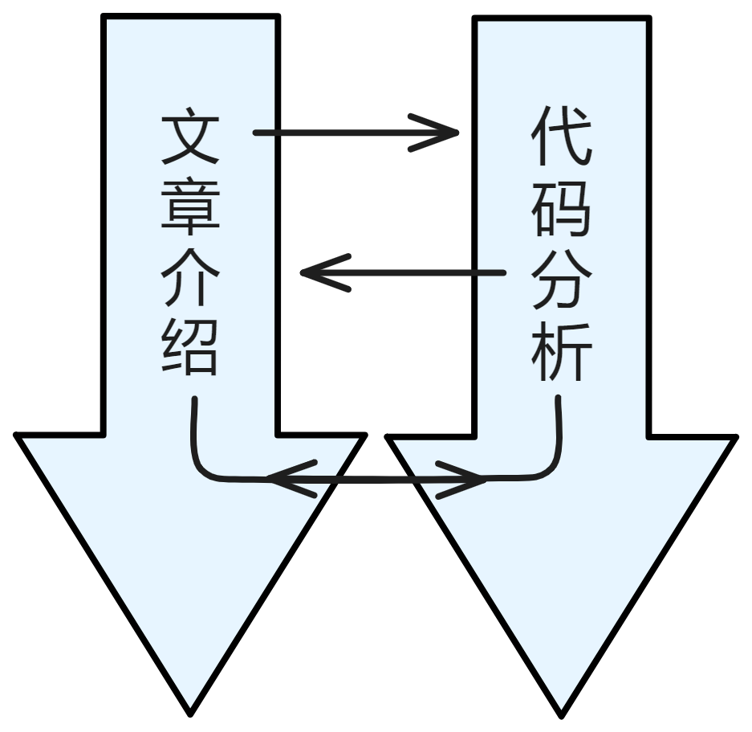

# 代码分析

IC 项目的代码非常庞大且冗长。如果要把所有代码都分析讲解一遍，工作量会比预计的上升一个数量级，拖慢进度，使整本书难以完成。而这本书的理念是通俗易懂零门槛，如果还要把代码讲得出神入化、让小白看得津津乐道，那工作量又得上升一个数量级😭😱。如果代码分析太水，草草了事，也和书中其他通俗易懂的部分格格不入，也不符合这本书的理念。

所以，这里的代码分析以可读性为重，定位放在帮助 Rust 新手学习、了解 Rust 。继续保持通俗易懂的风格，拿 IC 项目中的一部分代码着重解读。

以下是目录导览：

[P2P层代码分析]()：

[共识层代码分析]()：

[消息路由层代码分析](3.消息路由层代码分析/message_routing)：

message_routing ，源代码来自：https://github.com/dfinity/ic/blob/master/rs/messaging/src/message_routing.rs 。

[执行层代码分析]()：

