## 链钥密码学

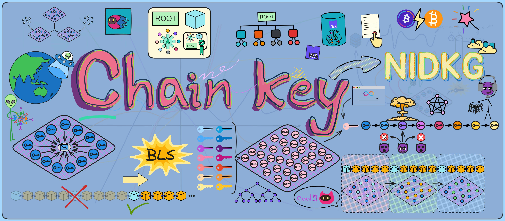

链钥密码学（Chain-key cryptography）是对嵌入 IC 底层系统密码学的统称，是 IC 运行时依赖的一套完整的密码学协议，包括了 BLS 阈值签名、非交互式密钥分发协议（NIDKG）、非交互式零知识证明（NIZK）、阈值 EDCSA 、可验证加密阈值密钥（VETKeys）等等技术。

其中最重要的是 BLS 阈值签名。

 

## BLS阈值签名

先讲讲 BLS 阈值签名是什么？ `ฅʕ•̫͡ •ʔฅ` 

它是链钥密码学最重要、最核心、最根本的部分。子网运行要靠 BLS 阈值签名达成共识，靠 BLS 阈值签名给用户返回消息认证，靠 BLS 阈值签名生成共识依赖的随机信标，靠 BLS 阈值签名签署追赶包等等。

举例来说的话，BLS 阈值签名就像一个 “ DAO ” ，只要是需要子网签名的地方，都要子网里足够的副本 “ 同意 ” （签名）才行。足够的副本同意，即代表达成共识，少数服从多数。

 

> 在传统的非对称加密算法中，我们可以生成一把公钥、一把私钥；公钥公开，私钥保密；公钥加密信息，私钥解密信息；私钥签名信息，公钥验证信息。还可以在[这里](../8.IC里的密码学/基础密码学知识.md)先了解了解非对称加密。

像之前[共识](../2.核心协议/2.共识层.md)讲的那样，比如子网里的某个副本打包一个区块，当大家认为区块没问题时，就会用私钥对区块留下自己的签名，表示自己的认可。

如果每个副本都生成一对公私钥，密钥管理既复杂有低效🥲。而且更重要的是：如果用户想验证链上内容，就得下载几百个 G 的数据来亲自验证😭。这太不友好了。

 

Dfinity 为了解决这个问题，选择了 BLS 签名的阈值方案来实现子网签名。

    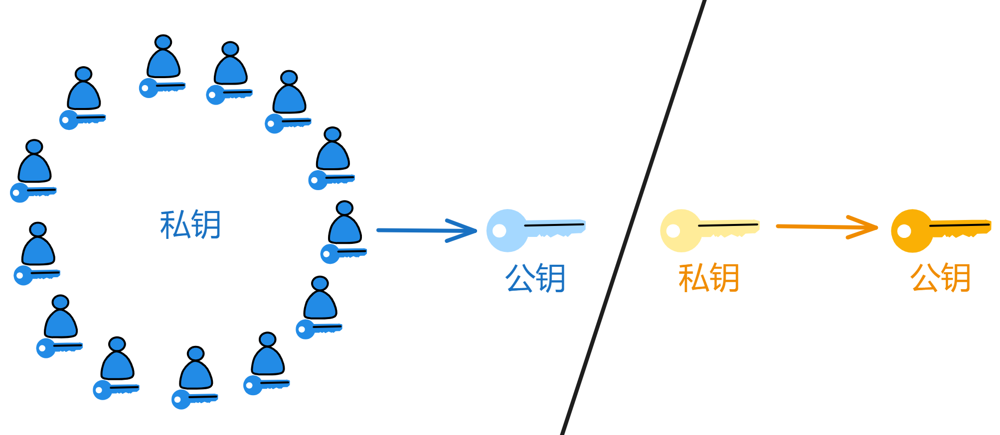

 

### BLS签名

先来说说为啥选择 BLS 签名吧。

使用 BLS 签名方案的一个原因是最后子网生成的签名是唯一的，对于给定的公钥和消息，只有唯一个有效的签名。而这种生成唯一签名的属性可以为智能合约生成不可预测的随机数：在智能合约请求生成随机数之后，（经过一轮共识）子网会生成对特殊消息的签名，然后把这个签名哈希一下，从中导出随机数种子，然后从随机数种子生成所需的（伪）随机数。

根据 BLS 签名方案的安全特性，任何人都无法预测或篡这个随机数。

 

它和 RSA 、DSA 这些常见的签名算法有很多不同的地方。

首先 BLS 签名的长度很短也更安全。

一个签名值只需要一个椭圆曲线点的一个坐标，大概 160 比特就够了。但 RSA 签名和 DSA 签名包含两个大整数，通常需要 320 比特才能达到同等安全级别，长度上 BLS 签名明显优势。BLS 签名的安全性不是依赖整数分解之类的数学问题，而是依赖椭圆曲线上的计算困难问题，比如 CDH 问题。这种问题目前看来更难破解。

 

虽然 BLS 签名的验证速度比较慢，因为需要计算一些配对运算。但是签名生成很快，只需要一个简单的点乘运算。RSA 和 DSA 恰恰相反，签名慢但是验证很快。 

BLS 签名还有一个优点就是不需要保存签名状态，只要消息内容不变，签名就是固定的。

 

但 RSA 和 DSA 签名还需要保存随机数才能防止重放攻击。在 RSA 签名中，通常采用的是一种称为 “ Probabilistic Signature Scheme ” （PSS）的方案，它在签名生成过程中使用了随机数（salt）以增强安全性。因此，对于相同的消息和私钥，由于引入了随机性，生成的签名可能会略有变化。

这种变化是通过在签名中引入随机盐值来实现的，以增加安全性，防止攻击者通过观察相同消息的多个签名来获得有关私钥的信息。

 

另外，BLS 可以非常高效地同时批量验证多个签名，在很多应用场景下可以大幅提升效率。这是 RSA 和 DSA 做不到的。

这些特性让它在很多对签名长度和可扩展性要求很高的区块链应用里面非常合适。

 

这个算法本身非常优雅，是一种很有前景的签名算法。在[这里](../8.IC里的密码学/BLS签名.md)可以了解更多 BLS 签名算法的密码学原理。

当然，最重要的一点是 BLS 签名可以把私钥拆分为私钥片段，升级为多签方案或者**阈值签名**（也叫门限签名）！RSA 和 DSA 要直接做到这点就很难、很复杂了。

 

### BLS阈值签名

把私钥拆分为私钥片段！

听起来很高大上，但其实就是一种让多个人共同参与签名的算法。把私钥分成许多份，发给不同的人保管。在签名时，必须由足够多的人（达到阈值）一起参与签名，才能把签名片段合成一个有效的签名。

    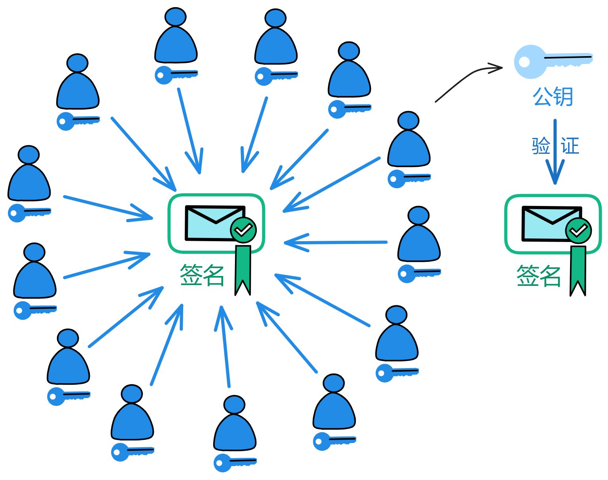

在动画和游戏情节中，有很多必须收集多个钥匙、水晶或其它物品才能打开通往最后关卡或获得终极宝藏的大门。比如《复仇者联盟 3 ：无限战争》中，灭霸要集齐六颗无限宝石来消灭宇宙一半的生命。《哈利波特》系列中，伏地魔分裂了自己的灵魂制作了多个魂器，哈利必须找到并销毁所有的魂器才能完全消灭伏地魔。《七龙珠》里是集齐七颗龙珠可以召唤神龙实现心愿等。

    

这种通过收集或组合物品来产生某种神奇效果的情节在各种电影、书籍和游戏中屡见不鲜。

 

现实中的 BLS 阈值签名通过密码学实现了这种魔法。每个人拿着一个私钥片段生成一个签名片段，只要人们的签名片段达到阈值就能合成一个完整的签名。即使子网中有一部分（小于三分之一）副本故障了或者网络连接不上了，也能完成签名。而用来验证签名的公钥是唯一的！

虽然阈值签名方案很早之前就有了，但 IC 是第一个将这种技术整合到底层协议中的区块链。

没有完整的私钥，只有分散的私钥片段，即使是作为持有私钥片段的副本，也无法直接得到签名结果。必须要拿到足够的签名片段才能合成签名。在区块链上的操作需要多个副本共同确认，从而提高了安全性和可靠性。敌手很难控制足够多的副本来伪造签名。

    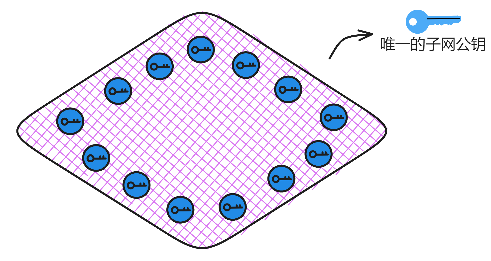

它是唯一能产生非常简单且高效的阈值签名协议的签名方案。持有私钥片段的副本可以轻松地生成对消息的签名片段，达到阈值数量的签名片段可以组合出消息对应的完整签名。而且副本之间不需要交互，每个人只要向大家广播出签名片段就好了。而且继承自 BLS 的优良基因，签名是唯一的，对于给定的公钥和消息，只有一个有效的签名。无论哪几个私钥片段签名，只要达到凑够足够的签名片段了，最终都能生成唯一的签名。

 

BLS 阈值签名是 IC 的根基，有了阈值签名，子网里的副本就可以依靠 BLS 阈值签名来达成共识啦：

* 子网里足够数量的副本对新区块签了名，就能合成完整签名，也就意味着达成了共识，少数服从多数。其他副本可以拿子网公钥验证区块。

* 子网里足够数量的副本对随机信标签了名，就能合成完整签名，也就意味着新的签名就是一个新的随机数。只要每次签名的消息不一样，签名结果肯定就不一样。而且每个私钥片段其他副本可以拿子网公钥验证这个随机数。
* 子网里足够数量的副本对默克尔树根签了名，就能合成完整签名，也就意味着子网里的大部分副本的状态是一致的。用户可以拿子网公钥验证输出。

 

另外，这些阈值签名还用作创建不可预测伪随机数的来源：

作为任何智能合约可用的不可预测且不可偏见的伪随机数来源，这是一个独特功能，使得在其他区块链上无法实现的应用成为可能（例如，NFT 抽奖）。

 

BLS 阈值签名还有一个很重要的优点：用户要确保子网发回来的消息没有被篡改，万一消息被黑客替换掉就麻烦了。

所以子网要对返回给用户的消息签名。

    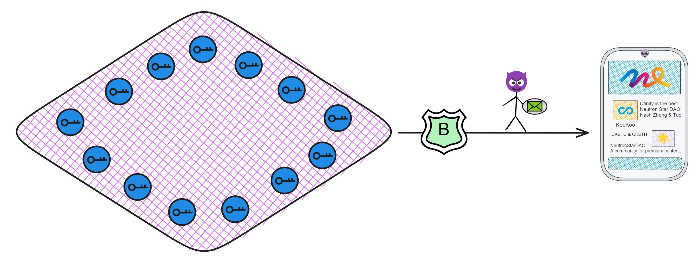

前面说过：如果每个副本都生成一对公私钥，密钥管理既复杂有低效🥲。因为每次出块都由不同的副本签名，如果用户想验证链上内容，就得下载几百个 G 的数据来亲自验证😭。这太不友好了。

而子网使用 BLS 阈值签名之后，就相当于一个子网只有 “ 一对公私钥 ” 。私钥有子网里的副本共同保管，而对应子网公钥只有一个！任何人都可以拿着子网公钥验证子网签名过的内容👍！

也就是说，想验证链上的数据再也不用下载几百个 G 的全部数据啦，只要用一个 48 kb 的子网公钥单独验证某个消息就好了。用户的手机、电脑甚至物联网设备都能验证子网签名过的消息。

    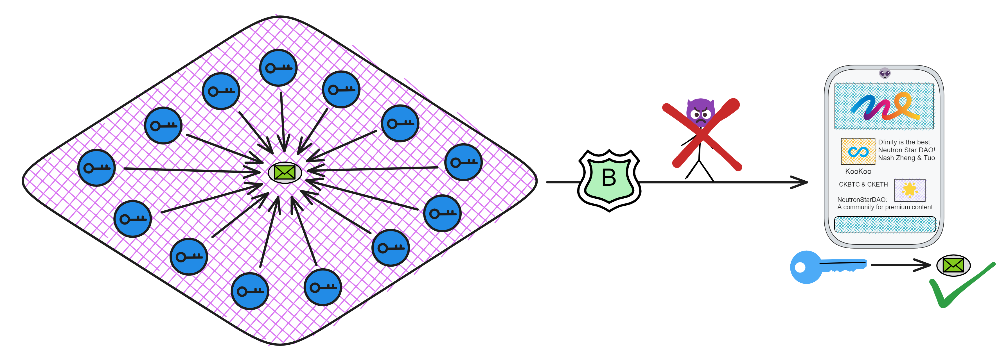

同样的，在需要跨子网通信时，子网 B 也可以用子网公钥 A 验证子网 A 发来的消息。

这种跨分片验证的能力使 IC 能横向扩展，只要副本够多，就能创造出无限个分片（子网）。

    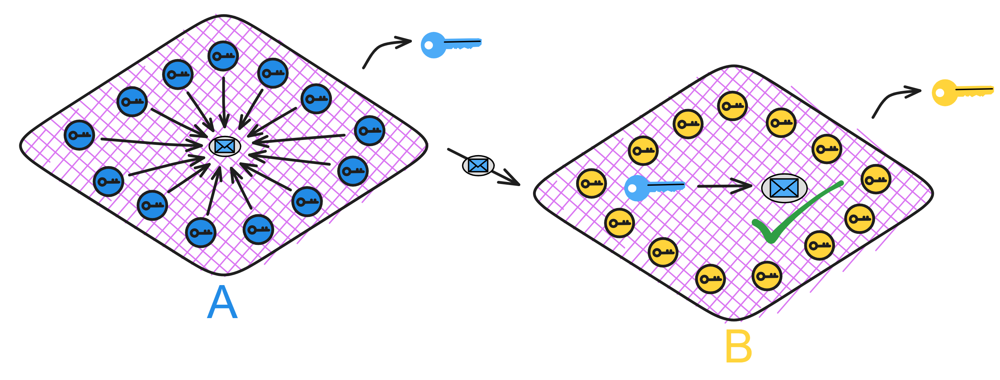

每个子网可以看成是一个独立的 “ 小型区块链 ” ，子网之间靠子网公钥验证通信。因为已经在子网 A 内部达成共识了，所以只要通过子网公钥 A 验证子网 A 发来的消息就行了。这就极大的优化了 “ 跨分片 ”（跨子网）的通讯问题，简单高效。

 

等等，但是每个子网都有一个子网公钥，那以后有上万个子网怎么办？还是要管理上万把子网公钥吗？

没事😏，还有系统子网：NNS 呢。NNS 有个注册表 Canister ，会保管 IC 上的每个子网公钥。想要哪个子网的公钥找 NNS 要。

当然，为了以防万一，还有 NNS 子网对所有其他子网公钥进行了阈值签名。这样就能拿着 NNS 的子网公钥验证 NNS 子网对其他子网公钥的签名了 ~ 

再把几把常用的子网公钥缓存进用户的设备里，就 ok 了👌。

    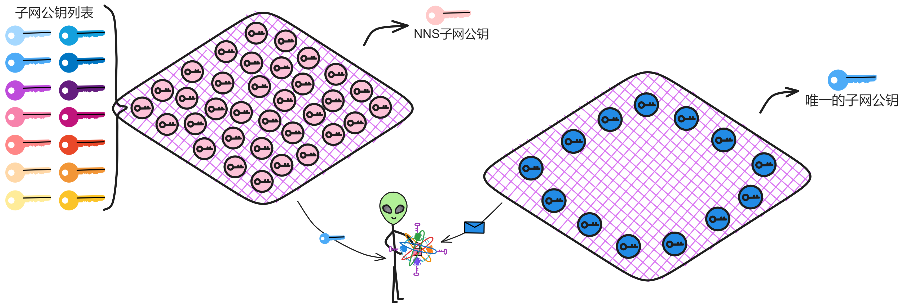

好的，现在验证 BLS 阈值签名是没啥问题了。

 

然而这还远远不够。

 

## NIDKG

子网里的副本要靠 BLS 阈值签名跑起来，首先要做的是给每个副本分发密钥。而阈值签名方案通常需要依赖一个可信的密钥生成中心，负责分发密钥。但在区块链里，不能轻易相信某一个副本，假设它不是恶意的。

    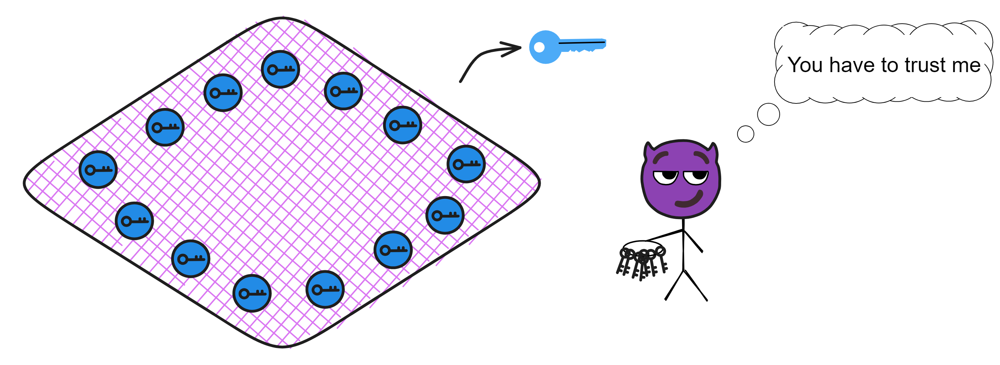

这就需要一个分布式的密钥分发方案（DKG）了，这种方案过去应用场景很小，技术实现复杂，而且运行起来低效耗时，光分发密钥就要花不少时间，根本不够实用。

更主要的原因是：传统的 DKG 协议要么是假设在一个同步网络中通信，要么没有健壮性，或者既需要同步通信又没有健壮性。

同步网络中通信意味着，如果消息稍微有点延迟，整个 DKG 过程就会失败或不安全。没有健壮性也就是说，如果 DKG 过程中有一个副本崩溃，整个 DKG 都白折腾了。

 

可想要在区块链上实现 BLS 阈值签名就得用 DKG ，不然还叫区块链嘛！没办法，Dfinity 的老师傅们只能埋头研究提高 DKG 效率的办法。

 

要是一般人，只能看着天书一般复杂的密码学理论望洋兴叹了，好在 Dinity 的师傅们各个身怀绝技。

Dfinity 有许多经验丰富的老师傅，很多人之前在 IBM、谷歌、亚马逊等大厂工作过，其中不乏来自苏黎世联邦理工学院、麻省理工学院、斯坦福大学、加州大学洛杉矶分校、耶鲁大学 等顶尖大学的计算机科学家、密码学家、研究员、博士组成的[研究团队](https://dfinity.org)。

首席技术官 **Jan Camenisch** 是计算机科学家， IEEE 和 IACR 院士，在隐私和密码学领域发表了 120 多篇被多次引用的论文。此前，他在 IBM 担任了 19 年首席研究员。**Ben Lynn** 是 BLS 签名算法的创造者之一。他的 “ L ” 就是 BLS 中间那个 “ L ” 。从斯坦福博士毕业后他在 Google 工作了 10 年。 **Timo Hanke** 之前是亚琛工业大学的数学和密码学教授。2013 年创建了 AsicBoost ，将比特币开采的效率提高了 20 - 30 ％ ，现在已成为大规模挖矿作业的标准。

还有超级密码学家 **Jens Groth** ，他发明了基于配对的非交互式零知识证明（NIZK）、基于配对的 SNARKs ，以及对 Bulletproofs 基础技术的对数大小的证明系统。奥胡斯大学博士，在加州大学洛杉矶分校获得了校长博士后研究奖，成为伦敦大学学院密码学教授，并发表了 50 多篇论文。

 

哦，对了，现在的主角就是 [Jens](https://medium.com/dfinity/jens-groth-principal-researcher-at-dfinity-receives-the-iacr-test-of-time-award-512bcddceed9) 。

    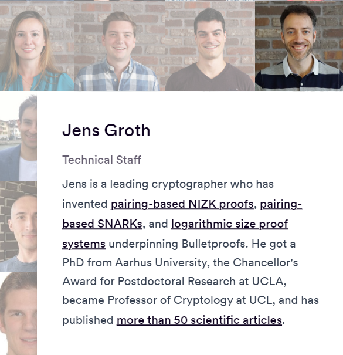

Jens Groth 这位大佬在密码学界可是数一数二的人物。他研究零知识证明技术，让两个不相识的人在不透露任何关键信息的情况下证明某个论据是正确的。这在保护隐私方面有巨大应用，大名鼎鼎零知识证明算法 **Groth16** 就是他发明的。

Groth 早年在丹麦念数学，后来发现自己非常感兴趣密码学，就转到密码学这一行。他跟着几位大牛读研究生，拿到硕士学位。后来和一家公司合作，做了一个关于电子投票的工业博士。

毕业后他去了 UCLA 做博士后，认识了他最要好的合作伙伴 Amit Sahai 。两人一拍即合，研究怎么用配对密码设计简单高效的零知识证明。经过长时间烦恼和努力，他们终于取得重大突破，发明了实用的配对基零知识证明技术。这项技术后来应用很广，在许多密码方案中发挥重要作用。

 

这项技术获得了两次时间考验大奖，可见其影响力。后来 Groth 还继续研究，发明了零知识简明非交互证明 (NIZK) ，把效率提高到一个新高度。这为隐私保护区块链的发展奠定了基础。

Groth 现在在 DFINITY 基金会研究 Internet Computer 的安全性，设计 NIZK 增强其隐私保护。他的工作对区块链技术进步作出了巨大贡献。工作之外，在业余时间他喜欢即兴表演和羽毛球。

 

传统的 DKG 协议都无法满足 IC 的高要求。IC 需要一个在有许多故障副本的异步网络中，也能保证安全性和健壮性的 DKG 协议。

为了解决 DKG 低效麻烦的问题，他直接从底层入手，针对 DKG 需要多轮交互的复杂过程做了大量优化。DKG 过程中需要用到零知识证明，而一般的零知识证明需要多轮交互才能完成， 2 个人之间的交互就已经足够繁琐了，子网里那么多副本哪能交互的过来。而且零知识证明计算复杂度高，需要复杂的加密算法和交互协议，证明生成和验证都需要大量计算资源。

 

于是 Jens 大佬亲自操刀，手撕密码学：发明了一种高效的非交互式零知识证明（NIZK）。在不需要多轮交互的情况下，完成零知识证明。

有了 NIZK ，新的 DKG 协议如虎添翼。很快，NIDKG 便横空出世！

新的 NIDKG 协议可以在异步网络上运行且具有很高的健壮性，即使子网中三分之一的副本崩溃损坏，它仍然可以正常运行。副本只创建交易，而不与其他副本进一步交互。其他的副本可以合并一组交易，从提供的材料来计算出阈值签名方案的子网公钥。每个副本还可以从交易中解密出自己的私钥片段。

 

NIDGK 是 ChainKey 最关键的部分。没有之一！

BLS 阈值签名很简单很方便，非常好用。但是想把 BLS 阈值签名用在一个分布式系统中，如何安全可靠地分发私钥片段是比较难的。

NIDKG 这种高效的非交互式协议可以很好地解决 BLS 阈值签名的短板。使得在区块链系统中可以深度集成 BLS 阈值签名，通过 BLS 阈值签名进行共识、生成随机数和验证 IC 上发出的信息。

关于更多链上随机数的介绍在[这里](../6.区块链网络服务/6.链上随机数.md)。

 

多米尼克发文炫耀的他们的科学家团队👇。

    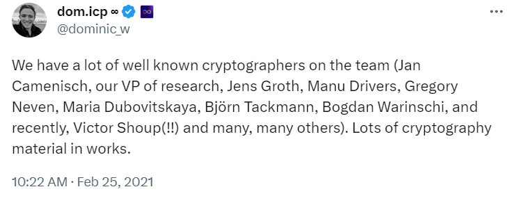

非交互式密钥分发协议，这个非交互式嘛，就是副本之间不需要交互。不用经过多次通信，每个副本只要根据协议生成自己的多项式秘密和零知识证明，然后广播出去就行啦。如果需要交互的话，副本一多，复杂度呈指数增长，整个子网都得乱套了。而且某个副本的延迟稍微高点，可能整个子网都会失败。

就像在考场上传纸条作弊：

A 问 B：第 15 题你会不会？

B ：不会。

A ：21 题呢？

B ：不会。

A ：行吧。。。

监考老师眼中纸条满天飞。。。不会都传纸条回复。

 

顺便提一嘴，零知识证明（ZK）是一种前沿密码学技术，它可以让你向对方证明一件事，而你又不用告诉他是什么事。听起来是不是很不可思议！这在密码学上是可以做到的。这特别像女票对你说：“ 我想跟你说个事儿，你得答应我。” 你问：“ 你得告诉我什么事儿。” 女票说：“ 你必须先答应我嘛。” 

Dfinity 近些年研发的新技术除了集成在底层系统，也在逐渐应用到了其他领域，构建多米尼克心中的加密乌托邦。2021 年多米尼克还提出过使用 ZK 证明身份。2023 年密码学狂人们已经打算在 ii 上加入零知识证明了！

    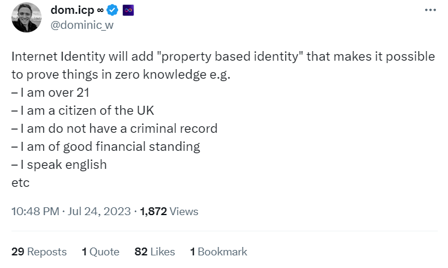

 

### 具体过程

前面一不小心废话多了，最近太孤独了，说话总是滔滔不绝。现在咱们来深入 NIDKG 内部，看看它是咱们运作的吧。

经过前面的一番铺垫，我们知道 NIDKG 就是先由每个副本独立生成一个交易（dealing）并广播出去，交易里包含了副本自己秘密的加密文件、对加密文件的 NIZK 、以及用来生成子网公钥的文件。其他副本收到交易后验证 NIZK ，凑够三分之二的交易就可以恢复出子网公钥和自己的私钥片段了。

 

#### 公共参数

在开始之前，NIDKG 协议需要一些公共参数，比如 NNS 会告诉大家**子网里由几个副本（n）**、**阈值是多少（t）**，还有一些参数是提前规定好的，双线性映射群 \\(G1\\) ，\\(G2\\) ，\\(GT\\) 和生成元 \\(g1\\) ，\\(g2\\) ，Hash 函数 \\(H\\) 以及二叉树高度 \\(λ\\) 等。NNS 还会给每个副本分配一个 **节点 ID（node_id）** ，作为副本自己的标识。（[源代码](https://github.com/dfinity/ic/blob/master/rs/consensus/src/dkg.rs#L98C25-L98C25)里就是这么叫的，我也不知道为啥不叫副本 ID 😝 ，也许 “ 副本 ” 是后来起的吧 ~ ）

这些参数需要在运行协议之前就确定并公开。

 

#### 生成密钥对

在 NIDKG 中，每个副本都需要生成自己的一对公私钥。生成密钥对的步骤如下：

1. 选择一个随机的 \\(x\\) ，从 \\(Z_{p}\\) 中均匀随机选择。

2. 使用选择的 \\(x\\) ，计算公钥：
    $$
    y = g_{1}^{x}
    $$
    这里 \\(g1\\) 是协议预定义的生成元。

3. 构造一个零知识证明 \\(π\\) ，以证明知道 \\(y\\) 的离散对数 \\(x\\) 。这使用椭圆曲线 discrete log 的标准 Schnorr 证明实现。

4. 将公钥设置为：

$$
pk = (y, π_{dlog})
$$

这里包含 \\(y\\) 和证明 \\(π\\) 。

5. 再选择一个随机的 \\(ρ\\) ，从 \\(Z_{p}\\) 中均匀随机选择。

6. 使用 \\(ρ\\) 以及协议预定义的参数 \\(f0, ..., fλ, h\\) 来计算私钥：
   
$$
dk\ =\ (g_{1}^ρ,\ g_{2}^x\ *\ f_{0}^ρ,\ f_{1}^ρ,\ ...,\ f_{λ}^ρ,\ h^ρ)
$$

$$
dk_{0}\ =\ (0,\ dk)
$$

这里私钥 \\(dk\\) 是一个前向安全的私钥，可以用来解密后续的密文。

1. 删除计算过程中的中间临时变量 \\(x\\) , \\(ρ\\) 。
2. 将生成的公私钥对 (pk, dk) 作为这个副本的密钥对使用。

副本都需要生成这样的密钥对 (pk, dk) 。

 

#### 生成交易

生成交易（dealing）的过程：

**每个副本独立随机生成一个 t-1 次的多项式 \\(a_{i}(x\\)) 。**

例如副本 \\(i\\) 生成：
$$
a_{i}(x)\ =\ a_{i0}\ +\ a_{i1}*x\ +\ ...\ +\ a_{i(t-1)}*x^{t-1}
$$
其中当 \\(x = \\) 时，多项式的值 \\(a_{i}(0\\)) 是随机生成的一个秘密 \\(s\\) 。如果是重分发密钥，则使用之前的私钥片段作为秘密 \\(s\\) 。

**多项式中 \\(a_{i0}\\) 表示共享的秘密，\\(a_{i1},\ ...,\ a_{it-1}\\) 是从 \\(Z_{p}\\) 中均匀选择的随机系数：** 

$$
Set\ a_{i0}\ =\ s\ \ and\ \ pick\ random\ a_{1},\ ...,\ a_{t-1}\ \overset{$}{\leftarrow} Z_{p}
$$

然后还要计算多项式 \\(a_{i}(x\\)) 中所有的常数项 \\(a_{i0},\ ...,\ a_{i(t-1)}\\) 对应的 \\(g_{2}\\) 生成元 \\(A_{i0}\ ...\ A_{i(t-1)}\\) ：
$$
A_{i0}\ =\ g_{2}^{a_{i0}}
$$

$$
A_{i1} = g_{2}^{a_{i1}}
$$

$$
...
$$

$$
A_{i(t-1)} = g_{2}^{a_{i(t-1)}}
$$

然后将这些 \\(A_{i}\\) 作为公共参数放入交易 \\(d\\) 中。

所以 \\(A_{i0},\ ...,\ A_{i(t-1)}\\) 对应于生成交易中使用的 Shamir 秘密分享多项式 \\(a(x)\\) 的系数，是多项式的承诺。它们是交易 d 的组成部分之一，用于验证秘密分享的正确性。

当集齐达到阈值数量的交易时，可以通过拉格朗日插值恢复出一个所有副本的公共多项式 \\(a(x)\\) ，其中 \\(a(0)\\) 就是子网公钥。

    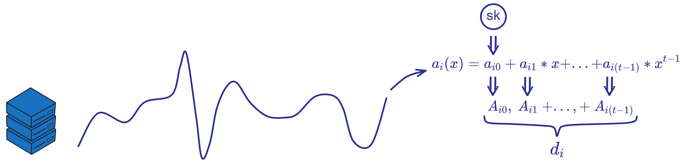

**副本 i 通过用 shamir 秘密分享，计算出多项式 \\(a_{i}(x\\)) 的秘密份额 \\(s_{1},\ ...,\ s_{n}\\) ：**
$$
s_{i}\ =\  {\textstyle \sum_{k=0}^{t-1}} a_{k}i^{k} \bmod p \ \ \ (k\ =\ 1,...,t-1)
$$
再把 \\(s_{i}\\) 转换为二进制：
$$
s_{i}\ =\  {\textstyle \sum_{j=1}^{m}} s_{i,j} B^{j-1}
$$
然后，我们需要把秘密份额 \\(s_{i}\\) 加密广播出去，还要让其他副本相信这个加密文件解密之后就是 \\(s_{i}\\) ！

 

所以我们必须再提供一个证据，证明自己可以解密交易中的密文，以便其他副本可以用足够多的交易恢复出他们的私钥片段。我们使用多接收方前向安全加密方案，其中密文是公开可验证的。

唯一的问题是，明文应该被分成小块，为了提取这些块，接收方需要计算离散对数。因此，如果接收方需要提取的块太大，接收方将会有问题，这就需要一个可以确保所有块都是适度大小的非交互证明系统。

 

**将秘密份额 \\(s_{i}\\) 拆分成多个小块 mi ，使用的是一种基于双线性配对的前向安全加密方案。**

每个块 \\(mi\\) 的值域很小，以便后续解密时暴力搜索。对每个块 \\(mi\\) 使用 ElGamal 加密。

在生成交易之前，我们已经生成了一对公私钥，现在就可以用所有副本的公钥：\\(pk_{i}\ =\ (y_{i},\ π_{i}\\)) 加密分块了。

选取 m 个随机数 \\(r_{m},\ s_{m}\\)，从 \\(Z_{p}\\) 中均匀随机选择：\\(r_{1},\ s_{1},\ ...,\ r_{m},\ s_{m}\ \overset{$}{\leftarrow} \ Z_{p}\\) 。

先计算：\\(C_{1,1},\ ...,\ C_{n,m},\ R_{1},S_{1},\ ...,\ R_{m},S_{m}\\) 。
$$
C_{i,j} \ = \ y_i^{r_{j}} \ * \ g_{1}^{s_{i,j}}
$$

$$
Ri \ = \ g_{1}^{ri}
$$

$$
S_{j}\ =\ g_{1}^{s_{j}}
$$

然后进行一些运算：（ \\(\tau\\) 表示时期）

$$
\tau _ { λ _ { T + 1 } } ... \tau _ { λ _ { H } }\ =\ H _ { λ _ { H } } ( pk _ { 1 },\ ...,\ pk _ { n },\ C _ { 1 , 1 },\ ...,\ C _ { n,m },\ R _ { 1 } , S _ { 1 },\ ...,\ R _ { m }, S _ { m } ,\ \tau )
$$

$$
f\ =\ f(\tau _{1}\ ...\ \tau _{λ})
$$

$$
Z_{j}\ =\ f^{r_{j}}h^{s_{j}} \ \ \ (Z_{1},\ ...,\ Z_{m})
$$

我们可以对所有块使用同一个随机数 \\(R\\) ，这样能优化性能：
$$
r\ =  {\textstyle \sum_{m}^{j=1}} r_{j} B^{j-1} \bmod p
$$

$$
R\ = \ g_{1}^{r}
$$

密文 C 就是所有块加密 \\(y_n^{r} \ * \ g_{n}^{s_{n} }\\) 的集合：

$$
C_{1} \ = \ y_1^{r} \ * \ g_{1}^{s_{1}},\ ...,\ C_{n} \ = \ y_n^{r} \ * \ g_{1}^{s_{n}}
$$

现在分块加密做完啦。

 

**最后构造两个 NIZK 证明就可以了：**

* \\(π\_share\\)：证明秘密份额 \\(s_{i}\\) 是正确的 Shamir 秘密分享。满足多项式 \\(a_{i}(x\\)) 。
    $$
    π_{share} \gets Prove_{share}(y_{1},\ ...,\ y_{n},\ A_{0},\ ...,\ A_{t−1},\ R,\ C1,\ ...,\ Cn;\ r,\ s_{1},\ ...,\ s_{n})
    $$

* \\(π\_chunk\\)：证明每一块加密文件都是对 \\(s_{i}\\) 的正确加密。

$$
π_{chunk} \gets Prove_{chunk}(y_{1},\ ...,\ y_{n},\ R_{1},\ ...,\ R_{m},\ C_{1,1},\ ...,\ C_{n,m};\ r_{1},\ ...,\ r_{m},\ s_{1,1},\ ...,\ s_{n,m})
$$

    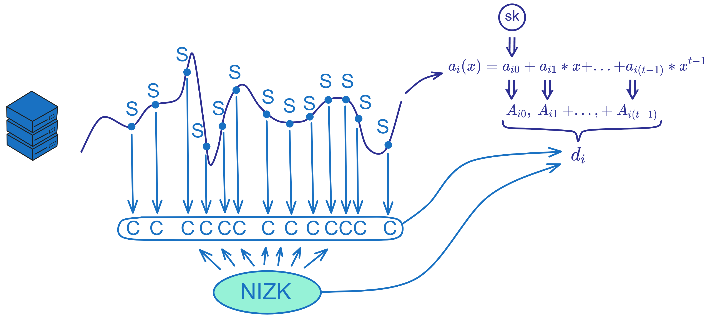

**副本 i 将加密后的私钥片段 C 、多项式的系数 \\(A_{i}\\) 以及两个 NIZK 证明打包成一个交易 \\(d_{i}\\) 。** 广播这个交易 \\(d_{i}\\) 给子网里的其他副本。
$$
d\ =\ \binom{C_{1,1},\ ...,\ C_{n,m},\ R_{1},\ S_{1},\ ...,\ R_{m},\ S_{m}}{Z_{1},\ ...,\ Z_{m},\ A_{0},\ ...,\ A_{t-1},\ π_{share},\ π_{chunk}}
$$
生成交易的关键就是进行秘密分享，加密分享，并给出 NIZK 证明。这个过程保证了交易的可验证性和安全性。

 

#### 验证交易

当一个副本收到其他副本广播的交易 d 时，可以这样验证交易：

重点是要验证 NIZK 证明的正确性、密文中的明文块是否正确，以及最终是否匹配公开的 share verification key 。

输入参数解析：

* 可选参数的 \\(shvk\\)（share verification key），这个是在组合公钥时生成的。
* 阈值 t 。
* n 个参与者的公钥 \\(pk_{1},\ ...,\ pk_{n}\\) 。
* 当前时期（epoch）\\(τ\\)。
* 要验证的交易 \\(d_{j}\\) 。

**检查交易的格式：**

* 确保包含了正确的组成部分：密文、NIZK 证明等。
* 确保每个组成部分是正确的群元素。

**如果有 \\(shvk_{j}\\) ，检查是否等于 \\(A_{j,0}\\) 。**

**计算叶子路径和时期 \\(τ\\) ：**

* 从密文中提取 hash 的参数。
* 运行 hash 函数计算出路径 \\(τ\\) 。

**计算 f 函数的值：**

* 根据路径 \\(τ\\), 计算出 \\(f(τ1,\ ...,\ τλ\\)) 。

**验证密文与 f 的关系：**

* 检查配对关系：\\(e(g_{1}, Z_{j}) = e(R_{j}, f) · e(S_{j}, h\\)) 。

**验证 NIZK 证明 \\(π\_share\\) ：**

* 输入实例信息，运行 \\(π\_share\\) 的验证算法。

**验证 NIZK 证明 \\(π\_chunk\\) ：**

* 输入实例信息，运行 \\(π\_chunk\\) 的验证算法。

如果所有检查通过，则认为该交易 d 是 valid 的。否则是 invalid 的（废话），拒绝这个交易。

这个验证过程可以公开地被所有的副本进行，从而保证交易的可验证性，即 PVSS（公开可验证的秘密共享）。

 

#### 组合交易

调用组合交易恢复公钥的函数时，输入参数：

* 阈值 t 。
* 参与者总数 n 。
* 索引集，表示选择了哪些交易 I 。
* 经过检验的交易 \\(d1,\ ...,\ d\ell\\) 。

**解析交易：**

每个交易 \\(d_{j}\\) 包含：\\(A_{j,0},\ ...,\ A_{j,t-1}\\) 。

其中 \\(A_{j,k} = g_{2}^{a_{j,k} }\\) ，\\(a_{j,k}\\) 是某个副本 j 的多项式系数。每个副本生成的多项式都是随机的，就像这样：

    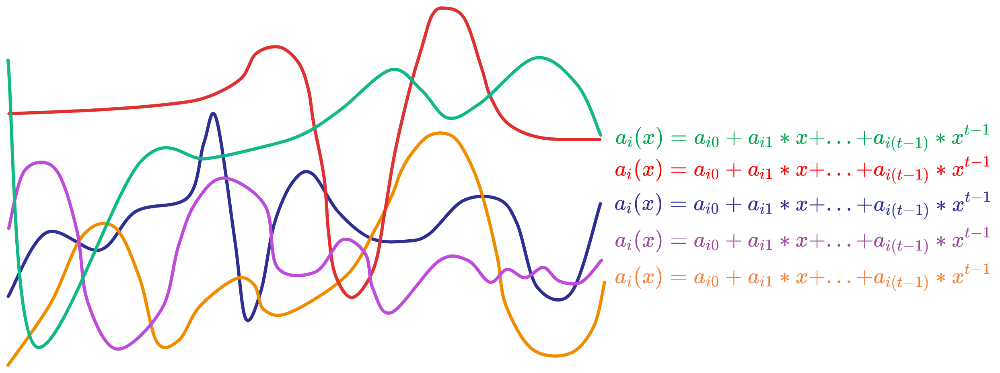

而且 \\(A_{j,k}\\) 是每个副本的多项式的 \\(a_{j,k}\\) 经过 \\( g_{2}^{a_{j,k} }\\) 运算后得到的。像哈希函数一样，知道 \\(A_{j,k} = g_{2}^{a_{j,k} }\\) 不能推算出 \\(a_{j,k}\\) 。只要 \\(a_{j,k}\\) 不变， \\(A_{j,k}\\) 就不变。

 

**把每个交易的 \\(A_{j,k}\\) 乘起来，恢复公共多项式：**

计算所有副本的公共多项式的 \\(A_{0}, ..., A_{t-1}\\) ，对每个 \\(k\ =\ 0,\ ...,\ t-1\\) ：
$$
A _ { k } \ =\ \prod _ { j=1 } ^ { \ell } A _ { j , k } ^ { L ^ { I } _ { i _ { \ell } } ( 0 ) }
$$

    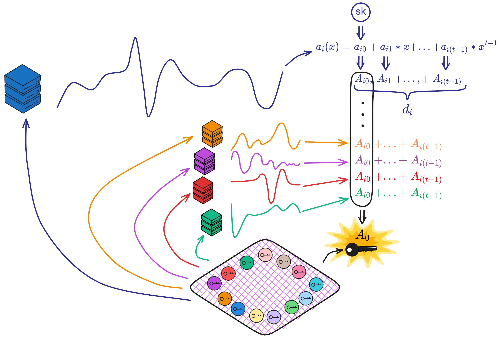

这样通过插值恢复出了公共多项式的系数 \\(A_{0}, ..., A_{t-1}\\) 。\\(k=0\\) 时的 \\(A_{0}\\) 就是子网的公钥。

**生成公钥：**
$$
vk = A_{0}
$$
**计算验证密钥：**
$$
shvk_{j}\ =\ \prod_{k=0}^{t-1}A_{k}^{j^{k}}
$$
如果成功，返回 \\((vk, shvk_{1},\ ...,\ shvk_{n}\\)) 。

然后还需要验证一下公钥 \\(vk\\) ，流程是：

检查参数 \\(t,n\\) 是否在有效范围内：\\(1 <= t <= n <= N\\) 

检查 \\(vk, shvk_{1}...shvk_{n}\\) 都属于群 \\(G2\\) 。将 \\(shvk_{0}\\) 设为 \\(vk\\) 。

定义索引集 \\(J = {0,...,t-1}\\) 。

对于 \\(i\\) 从 \\(t\\) 到 \\(n\\) ：

* 检查 \\(shvk_{i}\\) 是否等于：
$$
shvk_{i}\ =\ \prod_{j=0}^{t-1}A_{k}^{j^{k}}
$$

也就是检查 \\(shvk_{i}\\) 是否在 \\(shvk_{0}...shvk_{(t-1)}\\) 的拉格朗日插值多项式上。

如果所有检查都通过，就没问题。这样通过检查 \\(vk\\) 和 \\(shvk\\) 是否满足 BLS 阈值签名方案中的公钥有效性要求，验证它们是否为一个有效的公钥组，从而保证可以正确进行门限签名。

 

#### 提取私钥

最后每个副本用自己的解密密钥，从所有有效的交易中解密、计算出自己的私钥片段 sk 。

**解析输入：**

* 接收者的解密私钥：\\(dk_{τ'}\\) 。
* 使用的交易索引集合：\\(K\\) 。
* 交易：\\(d1,\ ...,\ d\ell\\) 。
* 时期（epoch）：\\(τ\\) 。

**解析每个交易：** 对每个交易进行解析，获取其中的各种元素，这些元素包括 \\(C_{k,n,m}、R_{k,m}、S_{k,m}、Z_{k,m}\\) 等。这些元素属于群 \\(G1\\) 和 \\(G2\\) 。确保 \\(1 ≤ i ≤ n ≤ N\\) 。

**定义和计算 \\(τ\\) ：** 对于每个交易，根据给定的 \\(τ\\) 值，定义一系列 \\(τ_{k,1}\\) 到 \\( τ_{k, λ_{T} }\\) ，然后计算后续的 \\(τ_{k,λ_{T+1} } ... τ_{k, λ}\\) 。

**计算中间结果 \\(f_{k}\\) ：** 使用函数 f 对每个交易的 \\(τ\\) 值进行计算，得到中间结果 \\(f_{k}\\) ：
$$
f_{k}\ =\ f(\tau_{k,1},\ ...,\ \tau_{k,\lambda })
$$
**推导解密密钥：** 基于给定的密钥更新信息 \\(dk_{τ'}\\) 推导出解密密钥 \\(dk_{τ_{k,1},\ ...,\ τ_{k, λ} }\\) 。这些解密密钥包括在集合 \\(\{0, 1\}^{λ} × G_{1} × G_{2}^{2}\\) 中。

**计算 \\(M_{k,j}\\) ：** 对于每个交易的元素，使用给定的算法计算出 \\(M_{k,j}\\) 值，涉及到一些乘法和指数运算：
$$
M_{k,j}\ =\ e(C_{k,i,j},\ g_{2})\ \cdot e(R_{k,j},\ b_{k}^{-1})\ \cdot e(a_{k},\ Z_{k,j})\ \cdot e(S_{k,j},\ e_{k}^{-1})
$$
**暴力搜索：** 对于每个 k 和 j ，使用 Baby-Step Giant-Step 算法进行暴力搜索，寻找合适的 \\(s_{k,j}\\) 值，使得 \\(M_{k,j}\\) 等于特定的值：
$$
M_{k,j}\ =\ e(g_{1},\ g_{2})^{s_{k,j}}
$$
**计算 \\(s_{k}\\) ：** 使用之前找到的 \\(s_{k, j}\\) 值计算出私钥的一部分 \\(s_{k}\\) ：
$$
s_{k}\ =\ \sum_{j\in J}^{m} s_{k,j}B^{j-1} \bmod p
$$
**解析 K 和计算 \\(s_{i}\\) ：** 解析集合 \\(K\\) ，把所有 \\(s_{k}\\) 使用拉格朗日插值计算 \\(s_{i}\\) ，这些值涉及之前的私钥片段和 \\(s_{k, j}\\) 。
$$
sk\ =\ s_{i}\ =\ \sum_{j\in J}^{\ell} s_{k,j}L_{k}^{K}(0)
$$
**返回结果：** 如果所有步骤都成功，擦除中间计算结果，返回私钥片段 sk 。

 

**最后验证一下私钥片段：** 验证秘密共享签名密钥的有效性，目的是验证私钥和签名验证参数是否匹配。

如果 sk 是正常范围内的整数，并且 \\(shvk\\) 与 \\(g_{2}^{sk}\\) 相等，那么验证成功。

 

**NIDKG 的关键在于，零知识证明使得验证过程公开可验证，不需要与其他副本交互就可以独立判断交易是否正确。**

**每个副本选择一个随机的秘密（随机数或者上个时期的私钥片段）生成一个多项式，然后再计算出分享的秘密 \\(s_{i}\\) 。最后将 \\(s_{i}\\) 分块加密，构建两零知识证明，打包成一个交易交给其他副本验证。验证过后仍然通过非交互式的方法计算出子网公钥和副本自己的私钥片段。**

 

### 重分享协议

当子网已经生成了子网公钥之后，如果每次子网成员变动都生成一个新公钥，还是有点麻烦。另外，如果只在子网成员变换时更新密钥，不够安全。因为如果有超过三分之一的副本被黑客以各种方式控制，整个子网都会瘫痪。如果黑客先控制一个副本，悄无声息，继续潜伏。尝试悄悄控制下一个副本，直到控制足够的副本，再发起攻击 ... 

 

所以为了解决这两个问题，重分享协议可以保留子网公钥，只重新共享每个副本的私钥片段。这样做还具有主动安全性，定期刷新子网里所有副本的私钥片段。

    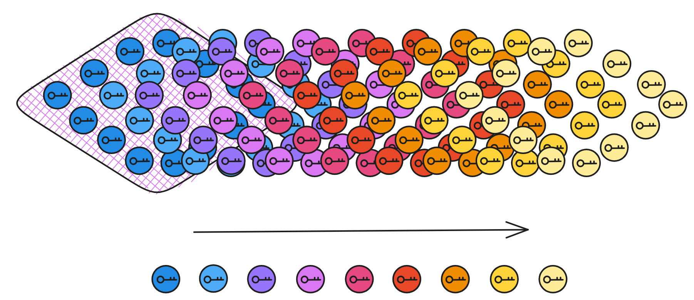

现在来回顾一下：

假设旧的子网公钥 \\(vk\\) 通过了公钥验证。

在合成子网公钥之后的验证中保证了 \\(shvk_{1},...,shvk_{n}\\) 可以通过拉格朗日插值从 \\(vk\\) 和 \\(shvk_{1},...,shvk_{t-1}\\) 推导出来。

也就是说，\\(vk\\) 和 \\(shvk_{1},...,shvk_{n}\\) 满足同一个 \\(t-1\\) 次多项式 \\(a(i\\)) ：

\\[
vk\ =\ A _ { 0 } \ =\ \prod _ { j=1 } ^ { \ell } A_ {j,0} ^ {L ^ { I } _{ i _ { \ell } } ( 0 ) } \ = \ g _ { 2 } ^ { a _{ 0 } }
\\]

\\[
    shvk_{ i } = g^{ a( i ) }_ { 2 }\ \ \ (i\ =\ 1,\ ...,\ n)\ = A_{ i }
\\]

对于任意包含 \\(1<=i_{1} < ... < i_{t} <= n \\) 的索引集 \\(I\\) ，我们可以通过 \\(shvk_{i}\\) 计算公钥 \\(vk\\) ，公式是：

\\[
    vk\ =\ \prod_{j=1}^{t} shvk_{ i_{ j } } ^ { L^{I}_ {i_{ j } }(0)}
\\]

在密钥重分享时，给定 \\(t\\) 个交易 \\(d_{1},...,d_{t}\\) ，它们分别对应 \\(shvk_{ i_{ 1 } },...,shvk_{ i_{ t } }\\) 有效。

在验证这些交易的有效性时，我们知道：
$$
A _ { 1 , 0 } = shvk _ { i _ { 1 } } ,\ ...,\ A _ { t , 0 } = shvk _ { i _ { t } }
$$
通过这些交易计算新公钥 \\(vk'\\) ：
$$
vk' \ = \ A _ { 0 } \ = \ \prod _ { j = 1 } ^ { t } A _ { j , 0 } ^ { L ^ { I } _ { i _ { \ell } } ( 0 ) }
$$
将 \\( A _ { 1 , 0 } = shvk _ { i _ { 1 } },\ ...,\ A_{ t , 0 } = shvk _ { i _ { t } } \\) 代入这个式子，我们有：
$$
vk'\ =\ A _ { 0 } \ = \ \prod _ { j = 1 } ^ { t } shvk _ { i _ { j } } ^ { L ^ { I } _ { i _ { j } } ( 0 ) }
$$
新的 \\(vk' = A_{0}\\) ，所以 \\(vk' = vk\\) 。因此验证密钥被完美保留下来了。

 

所以每次更新密钥后的公共多项式 \\(a(i\\)) 在一张图上画出来大概时这样吧：公共多项式的其他系数每次都变，但每个不同的公共多项式都在 \\(x = 0\\) 时过同一个点。

    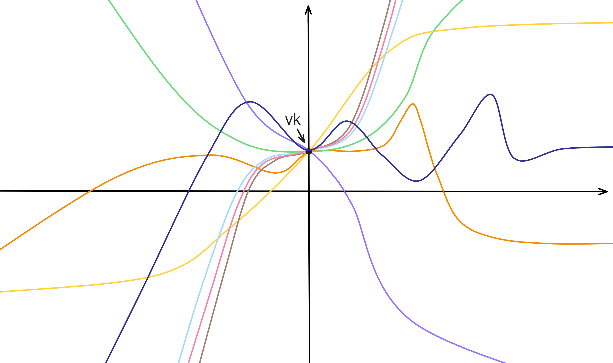

这保证了每次 NIDKG 都可以恢复出同样的公钥。子网公钥不变，但是公共多项式的其他系数都变了，从而实现了前向安全。

 

### 时期

首先是确保每个副本安全，让黑客难以下手。其次是即使某些少数几个副本被攻击了，只要黑客没有一次性攻破三分之一以上的副本，那也威胁不到子网。只要黑客没有在一个时期内获取到足够的私钥片段，就没法对子网产生威胁。

    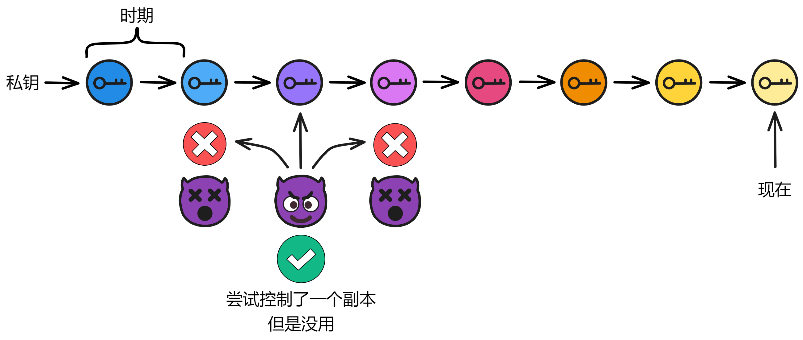

即使黑客切断节点网络，子网也可以通过频繁更换私钥片段来剔除异常节点。

当子网中有新副本加入时，也会运行重分享协议，给新副本分享私钥片段。

 

那多长时间更换一次私钥呢？每个时期（epoch）换一次，一个时期包含很多轮共识，通常是 500 轮（可以由 NNS 调整）。

[之前提到过](.//2.核心协议/2.共识层.html#首先是出块前的准备) IC 有个 “ 时期 ” 的概念，子网里的所有副本就是每个时期换一次私钥片段的。时期的概念来自于一篇论文：[Pixel: Multi-signatures for Consensus](https://eprint.iacr.org/2019/514) ，Dfinity 的工程经理 Manu Drijvers 、 Gregory Neven 、 Hoeteck Wee 和 Sergey Gorbunov 参与了研究。

论文设计了一个高效安全的前向安全多签名方案 Pixel ，可直接应用到现有的区块链中，同时带来显著的性能改进。

> 论文提出了一种新的前向安全多签名方案 Pixel ，可以用于 PoS 区块链中，防止后期腐败攻击。这个方案基于分层标识加密，可以在不依赖可信设置的情况下，实现非常高效的前向安全多签名。Pixel 签名只包含两个群元素，不管签名人数量。验证只需要 3 个配对和 1 个指数运算，支持非交互聚合。与基于树的前向安全签名相比，在存储、带宽和验证时间方面都有显著提升。还比较了 Pixel 与基于 BLS 的签名方案，证明 Pixel 同时满足高效性和前向安全性。

 

## 链上进化技术

链钥密码学另外比较重要的两部分是摘要块（Summary Block）和追赶包（Catch-up Package，CUP）。它们的作用是帮助子网平滑地进行链上变更和升级，我们叫它链上进化技术（Chain-evolution Technology）。

什么是链上变更和升级呢？子网在运行过程中，子网里的副本可能会增加或离开，副本的算法和协议也需要不断改进优化。这就需要对区块链状态进行动态调整。

如果不考虑向后兼容，直接在子网里升级协议，很可能会造成分叉。这对去中心化网络极为不利。这时就需要精心设计的链上升级机制，即链上进化技术。

 

### 摘要块

每个时期的第一个区块都是摘要块（Summary Block）。它是一个时期的开端，起着承上启下的作用。

它是每个时期顺利进行的关键。摘要块里面记录了一个时期内的重要信息，比如这个时期里，副本需要负责共识，哪些副本负责随机信标等等。每个时期都有不同的特征，这些信息会在每个时期进行更新。

摘要块为一个时期提供了基础参数和初始化信息。有了摘要块作为基石，子网在整个时期才能稳定运行。它就像一场比赛前制定的规则一样，让所有运动员明确自己的定位和职责。

将这些关键信息汇总到摘要块中，有很多好处：

1. 新副本可以快速同步子网状态，不需要从创世块全部执行一次。
2. 关键参数集中管理，便于链上治理和升级。

可以看出，摘要块在平滑地进行链上变更中起了 “ 锚点 ” 的作用。

    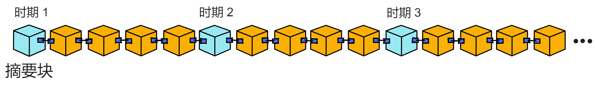

每个时期的摘要区块里面有几个很重要的数据字段：

**当前注册表版本**（currentRegistryVersion）决定了这个时期的共识委员会由哪些副本组成。共识委员会在这个时期会负责出块、验证、敲定等所有共识层的活儿。

**下一注册表版本**（nextRegistryVersion），每个共识轮次里，负责出块的副本会把它知道的最新的注册表版本号放进提议里（这个版本号必须不早于自己要扩展的区块）。这样可以确保每个时期的摘要区块里这个字段的值都是最新的。

这个时期的 “ 当前注册表版本 ” 将会在下一个时期变成下个时期的 “ 当前注册表版本 ” 。同理，这个时期的 “ 当前注册表版本 ” 也来自上个时期摘要块的 “ 下一注册表版本 ” 。

**当前交易集合**（currentDealingSets）是决定这个时期用来签消息的阈值签名密钥的交易集合。

**下一交易集合**（nextDealingSets）是在上个时期准备好的交易集合，会在这个时期设置为 “ 下一交易集合 ” 。这个时期的 “ 下一交易集合 ” 将会成为下一个时期的 “ 当前交易集合 ” 。

也就是说，每个时期都会进行的 NIDKG 协议或者密钥重分享过程。假设在时期 4 进行了密钥重分享，就会放在时期 5 中摘要块的 “ 下一交易集合 ” 中，并在时期 6 中设置为 “ 当前交易集合 ” 。也就是由时期 4 中互相分享了私钥片段的副本们担任共识委员会。

    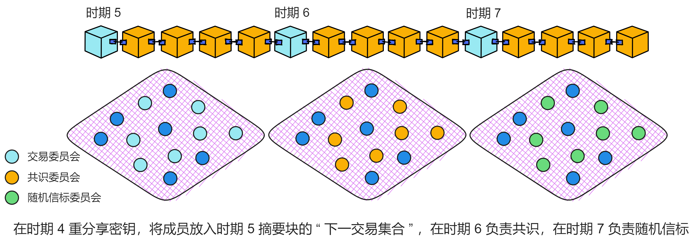

这样做可以给子网里的副本留出足够的时间运行 NIDKG 协议或者密钥重分享。如果没有收集到足够的交易，那么协议会在下个时期继续使用这个时期的交易，以争取更多时间生成足够的交易。

**交易参数收集**（collectDealingParams）描述了这个时期要收集的交易集合的参数。这个时期里，出块的副本会将这些参数放进交易里，然后放进提议的区块内。

接收这些交易的交易委员会由摘要块的 “ 下一注册表版本 ” 确定。“ 下一注册表版本 ” 的成员在这个时期生成交易，然后在下个时期变成共识委员会，最后又会在下下个时期变成随机信标委员会。

**每个时期的交易委员会、共识委员会、随机信标委员会都不一样，副本们在各个委员会轮流负责不同的任务。交易委员会有两个时期的时间进行 NIDKG 协议，准备好自己的私钥，在下个时期变成交易委员会，然后负责子网的共识，最后再负责子网随机信标。**

    

通过当前和下一个注册表版本、当前和下一个交易集合、以及收集交易的参数，一个时期的摘要块包含了共识层在当前时期需要遵循的所有规则和配置。

> 需要注意的是，即使一个副本从一个子网中移除，（如果可能的话）它应该额外履行一个时期的所分配到的委员会职责。比如它在共识委员会工作了一个时期，应该再去随机信标委员会工作一个时期再离开子网。

 

### 追赶包

追赶包（Catch-Up Package，CUP）就是一个包含当前状态快照的特殊消息，它让副本可以在不需要知道过去信息的情况下，在新的时期开始时恢复到当前的状态。

追赶包并不包含整个子网的全部状态，追赶包里有的只是把整个子网的状态转换成一棵默克尔树之后的根节点，以及其他一些关键数据。

    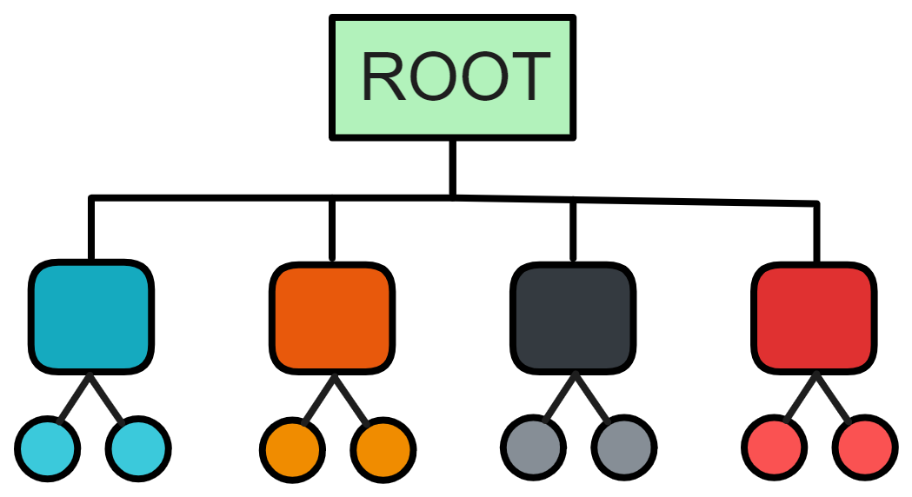

#### 追赶包的结构

它包含副本在新时期开始工作所需的全部关键信息：

* 整个副本状态的摘要（默克尔树的根）。这也是整个子网状态的快照。
* 当前时期的摘要块，包含这一时期的关键信息。
* 当前时期的第一轮随机数，这是产生新区块所需要的随机数种子。
* 子网的阈值签名。这可以验证追赶包的有效性和权威性。

追赶包依然依赖 BLS 阈值签名，BLS 阈值签名是子网达成共识的根本。整个子网的复制状态有好几百个 G ，太大了。所以我们可以把整个子网的状态分成块，然后转换成默克尔树。只要把默克尔树的根节点拿给副本们做个低阈值签名就好了！(\*\^▽^\*) 

    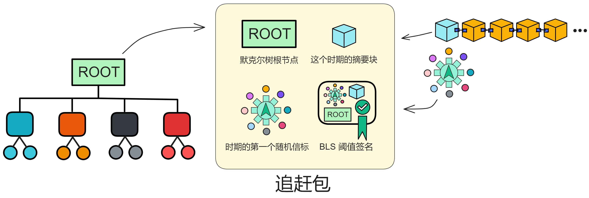

生成追赶包需要等待这个时期结束，才能得到完整的状态信息。然后把状态处理成树结构，计算根节点作为摘要。这样可以大大缩短消息大小。

追赶包只包含子网副本状态的摘要（默克尔树的根），而不是完整状态。副本可以通过 P2P 层的对等副本拉取需要的状态，再结合追赶包消息中的摘要块、随机数种子，就可以重新构建当时的状态，在新时期继续工作。

使用阈值签名保证每个时期只有一个有效追赶包，子网公钥保持不变，这样追赶包可以被任何副本验证。

    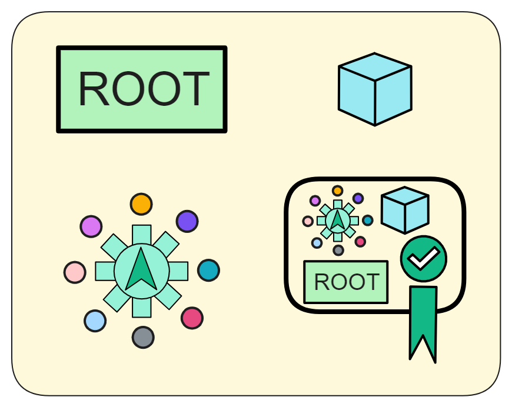

类似我们保存游戏进度，当重新开游戏时可以直接加载进度，不需要重新玩一遍。追赶包就是保存了区块链网络当前的进度状态。

追赶包同样不会永久保存，每个副本只要保存最新的追赶包就行了。

这无疑是 IC 迈向实用和进化的重要一步。它为链上参数调整、副本迁移、算法升级等提供了基础框架。

 

#### 追赶包的作用

之前讲过一个新副本加入子网时，可以快速赶上子网的当前状态，这个功能就是靠追赶包实现的。另外，如果一个副本大幅落后于其他副本（因为宕机或是网络断连很长时间），也要靠追赶包赶上最新状态。

子网不永久存储所有区块，子网不依赖历史区块进行验证。所以每个副本只存储最近一个时期的区块来保持网络健康，并在不再需要时删除旧的区块。区块一旦在共识中敲定，执行层就可以更新状态。子网只需要保持最新的容器状态，旧区块和旧状态就没什么用了。

所以每当一个子网生成了一个追赶包，就可以删除旧区块。这使 IC 比典型的区块链（永久保留所有区块和状态）具有更高的存储效率。

而且根据 IC 的经济模型，IC 使用反向 Gas 模型。开发者如果没有及时给自己部署的智能合约（Canister）充值，智能合约一旦消耗完所有的 Gas （Cycles），就会被永久删除。

    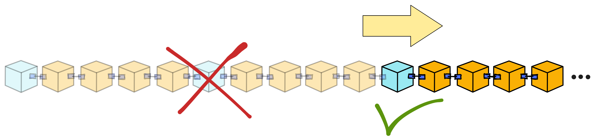

追赶包还能让子网在大多数副本崩溃的情况下恢复子网。只要有一个副本存活下来，就可以通过追赶包和副本的状态恢复一个全新的子网。

    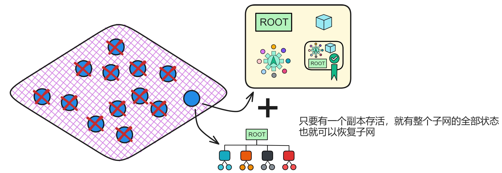

子网也可以使用追赶包实现负载均衡。如果安装在一个子网上的 Canister 太多了，NNS 可以将一个子网拆分成两个子网。每个新子网都从原来子网的追赶包继续运行，每个子网各保留一半的 Canister 。

    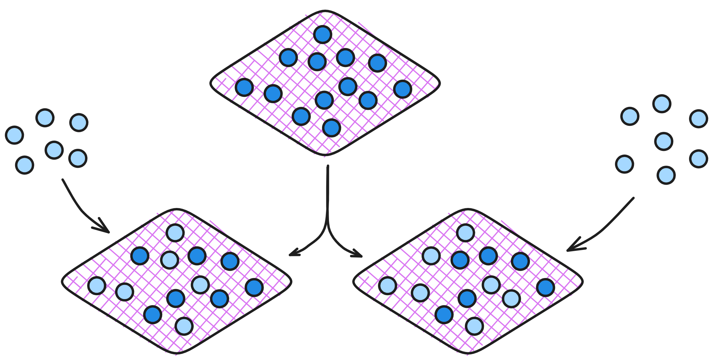

在每轮共识中，子网里的一个副本出一个区块。每个区块都会包含出块副本从 NNS 下载的最新注册表版本。其他副本仅在引用的注册表可用时才对区块公证。

在一个时期内，子网中的所有副本都运行相同的副本版本。为避免分叉，副本必须在同一个区块高度切换版本。比如副本们发现新版需要升级副本时，下个时期才开始升级。

在所有子网中的副本通过共识就最新注册表版本达成一致之后，下一步是切换到新版本。子网的副本在生成追赶包之后，得赶紧升级协议到最新版本。当需要安装新版本的协议时，时期开始时的摘要块会做出指示；所有运行旧版协议的副本会继续运行共识协议，直到下个时期敲定摘要块并创建对应的追赶包；追赶包创建好了就该赶紧升级协议了，安装新版协议后，副本会通过追赶包开始继续运行完整的协议。

升级的时候子网可以继续处理查询调用，但不能处理更新调用，子网上的 Canister 这时处于只读模式。随后需要安装升级并且需要重新启动 VM （IC 虚拟机）才能完成升级，所以查询调用也不能用了。总体而言，子网升级期间的停机时间约为几分钟。

 

IC 的每个子网都是这样修复协议中的错误、添加新功能，这是让 IC 能永远运行下去最关键的功能。

 

    

 

## Chain Key 代币

Canister 是一个 Wasm 虚拟容器，功能非常强大。WebAssembly 虚拟机设计者之一、谷歌高级工程师 Andreas 也曾在 Dfinity 参与了 Canister 的设计。其功能之强大，我们甚至可以把 Canister 当成一个小型服务器用！

要知道跨前桥的安全性非常差，经常被黑客攻击。

那既然能把 Canister 当服务器用，能不能跑其他区块链节点？😉答案是肯定的 ~ 这样直接给比特币带来了智能合约功能。

 

而比特币、以太坊使用的算法是 ECDSA 签名，而 IC 用的是 BLS 签名。另外，还不能直接把私钥存在 Canister 里。如果用 Canister 跑其他区块链节点（比如跑比特币节点），子网里的每个副本都有一个同样的 Canister ，这样也就没法保证 Canister 里持有比特币私钥的安全了，因为只要有一个副本被黑客控制，存在 Canister 里的比特币私钥就会泄露。

当然，这无所谓，根据之前的经验，Dfinity 的密码学专家 Jens Groth 和 Victor Shoup 会出手。😏

和 BLS 阈值签名差不多，只要再在子网里部署一种阈值 ECDSA 算法就可以啦。

 

在传统的 ECDSA 中，只有一个私钥可以用来签名。阈值 ECDSA 签名的思路是，不要集中在一个地方持有签名密钥，而是把密钥分散到多个副本上，任何一个副本都不能单独签名，必须多个副本协作才能生成签名。这样即使个别副本被攻破，也不会泄露整个系统的签名私钥。

为了签名，每个副本会用它持有的私钥片段来生成一个 “ 签名片段 ” 。然后把所有副本的签名片段合并起来，就可以生成整个签名。合并签名片段的时候，会滤除不诚实副本生成的错误签名片段。每个副本的私钥片段只有副本自己知道。

举个简单的例子，假设子网里总共有 7 个副本，每个副本持有一个私钥片段。其中 2 个副本可能被攻击而不诚实。我们规定至少要 5 个副本协作，才能生成签名。

当用户提出签名请求时，7 个副本各自生成一个签名片段。5 个诚实副本会正确生成，2 个不诚实副本可能生成错误签名片段。然后系统会从这 7 个片段中选择任意 5 个合并，就可以重构出完整签名。由于不诚实副本只有 2 个，选择 7 个片段时肯定有 5 个来自诚实副本，所以能过滤掉错误的签名片段，正确生成签名。

Dfinity 的老师傅们还使阈值 ECDSA 满足多项符合 IC 的特性：

* 阈值 ECDSA 同样是非交互式的。即使网络通信不可靠，也能保证最终生成签名输出。这意味着即使个别消息传输延迟很高，或者个别副本临时掉线，最终用户还是能得到签名结果。
* 签名阶段非常高效。如果预计算阶段已经准备好辅助信息，那么在用户发起签名请求时，每个副本只需要广播很少的信息，就可以完成签名，无需进行额外协商通信。
* 支持 BIP32 标准，可以从一个主密钥派生出多个签名密钥。
* 在合理的密码学假设下，这个协议可以提供与单点 ECDSA 一样的安全性。也就是说，攻击者想伪造签名的难度，与攻破单点 ECDSA 签名算法的难度相当。

    

这种方法的好处是，攻击者必须同时控制多数副本才能伪造签名。即使少部分副本被攻陷，“ ECDSA 私钥 ” 也不会直接泄露，整个系统仍能安全运行。这就提高了安全性。

了解更多关于 ckBTC 、ckETH 。

 

## VETKeys

VETKey 是一种通过 ID 去中心化派生密钥的技术。

通过阈值签名加密的方式，让子网里的副本协作派生出 ID 对应的私钥，但每个副本都不知道最终的私钥。不存在单点故障，安全性非常高。即使个别副本被攻破，也不会直接泄露实际私钥。相比传统方案，不依赖可信执行环境，安全性更高。

用户可以加密隐私数据，副本们协作解密出密钥并传送给用户，但过程中不会泄露实际密钥。而且一个子网公钥（master key）可以派生出无限多个孤立的身份密钥，大大简化密钥管理。还可以启用各种端到端加密应用，如隐私聊天、隐私支付、密钥托管等。

[详细了解](VetKeys.md)一下这种链上密钥派生方案。

 

## 总结

IC 最伟大的创新在于：通过一系列复杂的密码学技术，实现了子网内部自己达成共识，可以理解为一种分片技术。有了链钥密码学技术，子网之间可以进行安全的跨子网通信。因为不需要整个网络的全局共识，IC 可以通过添加更多子网来实现横向扩展。

    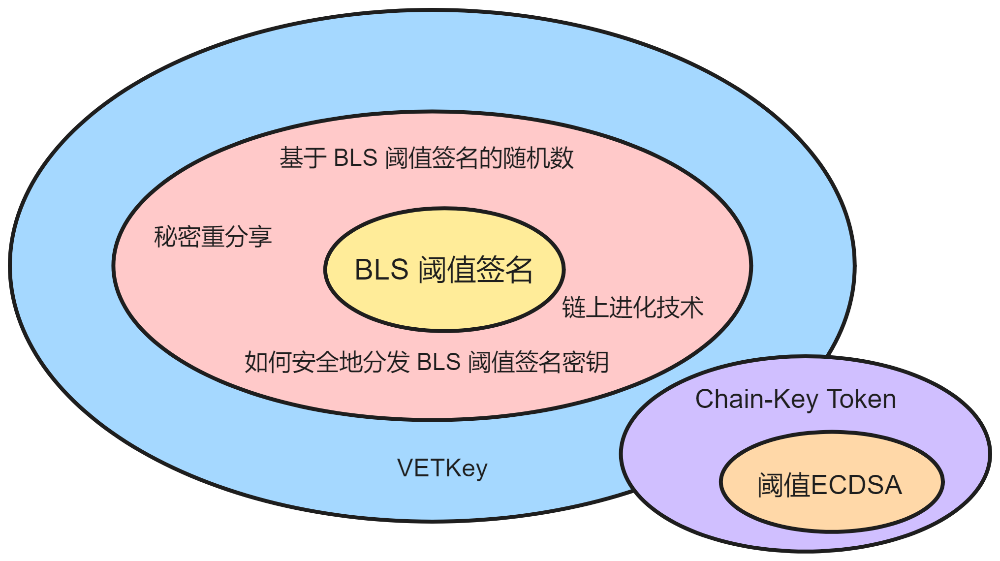

所以 BLS 阈值签名是支持 IC 运行的核心密码学，达成共识需要 BLS 阈值签名。其他的一系列密码学技术都是围绕 BLS 阈值签名展开的，比如如何安全地分发 BLS 阈值签名密钥、秘密重分享、链上进化技术、基于 BLS 阈值签名的随机数构成了 IC 底层的核心协议。Chain-Key Token 、VETKey 等技术则是间接使用的 BLS 阈值签名的扩展高级应用。

 
