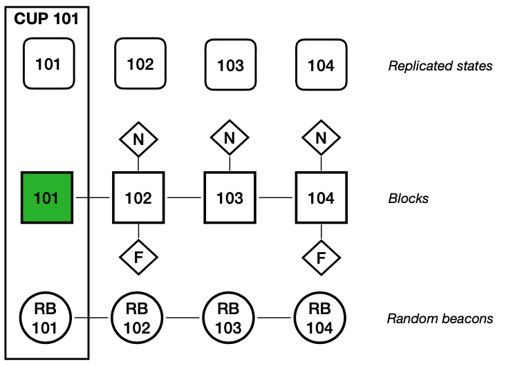

https://www.reddit.com/r/dfinity/comments/nlymmu/ama_we_are_the_dfinity_crypto_and_research_team/

https://medium.com/dfinity/chain-key-technology-one-public-key-for-the-internet-computer-6a3644901e28

https://internetcomputer.org/how-it-works/chain-key-technology/

# 链钥密码学（Chain-key cryptography）

IC的共识协议确实使用了区块链，但它也采用了公钥加密技术，特别是电子签名：NNS维护的注册表用于将公钥绑定至节点副本及子网形成一个整体。这实现了一个独一无二的强大技术集合，我们称之为**链钥密码学**，它有几个组成部分。

链密钥密码术的一个关键组成部分是阈值签名方案，它类似于普通的数字签名方案，不同之处在于秘密签名密钥分布在子网中的所有副本中，这样密钥就不会被泄露窃取子网中的一个（甚至很大一部分）副本。该技术有很多好处，包括：

1. 任何人都可以通过简单地验证签名来验证从互联网计算机接收到的内容，而无需同步整个区块链。
2. IC 的拓扑结构可以自主演化——可以添加新的节点和子网，可以恢复故障节点，可以自主升级协议。
3. Canister 的不可预测和无偏伪随机数的来源。容器可以安全地运行需要随机性的算法。

链锁密码学技术 （ Chain Key ）通过聚合签名，让子网节点产生一个唯一的公钥签名 ( 子网 key / Subnet Key ) 。这是 IC 无限扩展性能的基础技术。

每个子网可以看成是一个独立的 “ 小区块链 ” ，子网之间靠 Chain Key 通信。因为已经在子网内部达成共识了，所以只要通过 Chain Key 验证就行了。

每个子网根据 **root key** 生成自己的**子网公钥** ( 子网 key / Subnet Key ) ，子网之间通信依靠子网公钥验证数据的真实性，所以不用下载其他子网的旧区块数据，可以直接发请求过去。

>   子网 1 用自己的子网 key 对信息签名，然后发给子网 2 ，子网 2 收到信息后用子网 1 的 key 验证信息。
>
>   只要拿着某个子网 key ，就能随时随地验证这个子网上的信息是否正确。每个 key 只有 48 kb 。

root key 是公开的，客户端浏览器可以用 root key 验证消息是不是 IC 网络发过来的、有没有被篡改。

ChainKey 是互联网计算机背后的核心技术，它为 DFINITY 的区块链创建了一个只有48字节的唯一公钥。因此任何的设备，即使是智能手表，也能亲自去验证 DFINITY 的链。

相比之下，去验证 ETH 这些传统区块链时，因为每次出块都由不同的节点签名，设备需要同步几百 GB 的签名数据，而在 DFINITY 中，所有节点一起签名一个区块，因此设备只需要保存 48 个字节的唯一公钥即可验证每一个区块。

这只是 ChainKey 技术的冰山一角，它还能运行节点任意的退出与加入网络，从而轻松的把新节点接入网络进行扩容，这都归功于非交互式分布式密钥生成（Noninteractive Distributed Key Generation）技术的突破。

同时，每一个“子网/分片”都具备自己的唯一公钥，不同“子网/分片”上合约的互相调用，之需要使用这个“子网/分片”的公钥去验证它发来的区块消息即可，这就极大的优化了“片间/网间”的通讯问题。

如果能如此轻松的对区块链进行验证，那我们是不是能在其他的区块链上直接运行一个 DFINITY 的验证节点？没错，ChainKey 极易验证的特性也让 DFINITY 天然适合跨链操作，我们甚至可以在一个 ETH 的智能合约中存下 DFINITY 的区块链公钥，直接进行跨链交易的验证。这会带来大量的业务空间！

> 有一个简单的问题：所有的块都是永久存储的吗？

我们不依赖历史区块进行验证。所以每个副本只存储足够的块来保持网络健康（例如帮助其他副本赶上），并在不再需要时删除旧的。

这也是由于终结算法。一旦输入块最终确定，我们确信可以确定地计算新状态，并且只需要保持最新的容器状态。较旧的块和较旧的状态不是那么有用。

> 这里的关键创新是什么？ICC 协议如何或为什么比具有汇总和分片或类似协议的以太坊更好？

我认为子网实际上是共识的孤岛这一事实是主要的创新。有了链密钥，它们可以安全地相互通信，仍然形成一台互联网计算机，但因为不需要“全球”共识，我们可以通过添加子网来横向扩展。

好的,我来尝试用通俗易懂的方式解释一下论文中关于Chain Key第一部分,也就是Threshold Signatures的内容。

Threshold Signatures,直译是“阈值签名”。听起来很高大上,但其实就是一种让多个人共同参与签名的算法。具体来说,是把签名秘钥分成多份,发给不同的人保管。在签名时,必须由足够多的人一起参与,才能生成一个有效的签名。

举个生活中的类比,公司开户银行账户时,往往要求2个或以上人共同签字才能支取资金。这就是一种简单的Threshold Signature。账户密码相当于秘钥,被分割成两份,分别给了两个人。要取钱,必须两个人同时参与,提供各自的密码部分,才能完成整个签名流程。

在区块链中,我们也可以用类似的办法,把签名秘钥分割成多份,分发给不同节点保管。例如分割成5份,分别给了A,B,C,D,E 5个节点。未来要在区块链上进行某项操作时,可能要求至少3个节点参与签名才生效。那么A、B、C三个节点就可以提供各自的秘钥片段,共同生成一个完整的签名。

这种方式的好处是,区块链上的操作需要多个节点确认,从而提高了安全性和可靠性。同时,敌手很难控制足够多的节点来伪造签名。这种签名算法叫BLS签名法,是区块链常用的一种Threshold Signature方案。

接下来我用一个具体例子,讲解BLS签名法的工作原理:

假设我们有5个节点,每个节点被分配到一个秘钥片段x1,x2,...x5。其中x1+x2+...+x5=x,x就是完整的签名秘钥。

要签名一条消息M,第一步是计算出M的哈希值h。然后每个节点使用自己的秘钥片段计算一个中间签名:

节点1: σ1 = hx1
节点2: σ2 = hx2
...
节点5: σ5 = hx5

最后把这5个中间签名合并,就可以得到完整的签名:

σ = σ1 * σ2 * ... * σ5 = hx

验证签名时,只需要知道总的公钥:y = gx
然后检查签名是否满足:

h = σ^y

只要≥3个节点提供了正确的中间签名,结果就会通过验证。而单独一个节点的签名是不足以通过验证的。

这样,就实现了一个3-out-of-5的BLS Threshold Signature。它可以防止单个节点私自伪造交易,增强了区块链的安全性。同时,不需要所有节点每次都参与,也提高了效率。

这个BLS签名法用到一些数学知识,比如模运算、对数、哈希函数等,这对普通人来说可能还是有些难懂。但不用太纠结细节,简单理解为“把签名切片分发,必须聚集足够多片才能签名”就可以了。

区块链技术虽然看起来很神秘,但其实都是一些编程技巧和数学原理的组合。希望我用通俗的语言解释清楚了Threshold Signature的主要思路。这是让区块链更安全可靠的一种重要技术手段,也为之后讲解Chain Key的第二部分——Chain Evolution技术,奠定了基础。如果示例中某些地方还不太明白,可以提问我进一步解释。

好的,我来尝试更详细地解释Threshold Signatures中的BLS签名算法,并用更多示例帮助理解。

首先,我们假定有n个节点参与到区块链网络中,节点标记为P1,P2,...Pn。为了进行 Threshold Signature,我们需要为每个节点生成一对公私钥。

公钥是公开的,所有节点都可以获取。私钥则需要保密,只有对应的节点可以获取。公私钥生成算法是一个数学函数,输入是节点的标识,输出是公私钥对。例如:

P1 -> (PubKey1, PriKey1)
P2 -> (PubKey2, PriKey2) 

我们使用椭圆曲线加密算法来生成密钥对。不需要去了解细节,只需要知道用节点ID可以生成公私钥对就可以了。

一个区块链网络中会有多个公私钥对,但我们把所有节点的公钥合并,可以得到一个汇总的公钥PubKeyTotal。这就是该区块链的总公钥。

对应地,我们也可以计算一个总私钥PriKeyTotal,但是它是被分割成n份分别给每个节点保存的。例如3节点的情况:

P1 保存: PriKeyShare1
P2 保存: PriKeyShare2  
P3 保存: PriKeyShare3

其中PriKeyShare1 + PriKeyShare2 + PriKeyShare3 = PriKeyTotal

有了这些准备,我们可以签名了。假设有一个消息M需要签名。

第一步,计算消息M的哈希,得到H=Hash(M)。哈希算法也是一种数学函数,输入任意数据,输出一个数字指纹。

第二步,每个节点使用自己的私钥份额对哈希值H进行签名。例如在3节点的网络中:

P1 计算: Signature1 = Sign(H, PriKeyShare1) 
P2 计算: Signature2 = Sign(H, PriKeyShare2)
P3 计算: Signature3 = Sign(H, PriKeyShare3)

Sign函数输入是消息哈希和私钥,输出是签名。

第三步,收集签名并合并,得到总签名:

SignatureTotal = Signature1 + Signature2 + Signature3

这里的加法是一种特殊的Group加法,不过不用关心细节。

最后一步,任何人使用公钥PubKeyTotal来验证这个签名:

Verify(H, SignatureTotal, PubKeyTotal)

只要其中至少2个节点提供了正确的签名份额,总签名就是有效的。

这样我们就实现了一个2-out-of-3的BLS阈值签名!

这个过程可以扩展到任意多的节点。我们设置一个阈值t,要求至少t个节点参与签名才生效。那么就实现了一个t-out-of-n的阈值签名。

这么做的好处是,不能单独通过一个节点就完成签名,需要足够多节点参与,才能通过验证,这样可以防止单个节点私自伪造交易,保证了区块链的安全。

另外,不需要让所有节点每次都签名,这样也提高了效率。

接下来通过一个更复杂的例子进一步理解Threshold Signature。

假设我们要开发一个区块链游戏,有100个节点加入了网络,记为P1到P100。 

根据游戏规则,我们决定进行一个 60-out-of-100 的阈值签名。这意味着每次至少需要60个节点参与签名,结果才会生效。

第一步,为每个节点生成公私钥对:

P1 -> (PubKey1, PriKey1)
...
P100 -> (PubKey100, PriKey100)

第二步,计算总公钥:

PubKeyTotal = PubKey1 + PubKey2 + ... + PubKey100

第三步,为每个节点生成私钥份额:  

P1得到: PriKeyShare1
...
P100得到: PriKeyShare100

其中PriKeyShare1 + ... + PriKeyShare100 = PriKeyTotal

现在消息M需要签名:

1. 计算哈希 H = Hash(M)

2. 每个节点对H签名,得到Signature1...Signature100

3. 收集60个签名份额,进行组合

SignatureTotal = Signature1 + ... + Signature60

4. 使用公钥PubKeyTotal验证签名

可以看到,这种方式可以扩展到成百上千个节点,我们只需要调整阈值参数,就可以要求不同数量的节点签名。

这样就可以灵活地在去中心化和效率之间进行平衡。

BLS签名算法看上去比较复杂,涉及到一些高深的数学知识。但基本思路就是“分割秘钥 —— 分发给节点 —— 重组签名”,这种分布式协作的模式,可以带来区块链网络的安全性。

当然,BLS算法也有一些问题需要注意:

1. 生成和分发密钥需要一个可信的中心节点。这引入了一定的中心化。

2. 签名验证需要知道总公钥,这带来了公钥管理问题。

3. 分布式签名计算还是有一定性能消耗。

后续的研究正在致力于解决这些问题,使Threshold Signature更实用。但基本思想已经被证实是行之有效的。

区块链技术综合运用了密码学、分布式系统等多门学科。想完全掌握还需要长期学习。我在这里尽量用浅显的语言和实例讲解阈值签名的思路和原理,希望可以帮助你建立正确的认知模型。

当然我的解释可能还存在误解或不准确的地方,如果你在理解中遇到困惑,请一定要提出来讨论。只有多问问题、主动思考,我们才能真正掌握知识。

好的,来讲讲Chain Key中的第二部分——Chain Evolution Technology。

Chain Evolution Technology由两部分组成:Summary Blocks和Catch-up Packages(CUP)。它们的作用是帮助区块链平滑地进行链上变更和升级。

什么是链上变更和升级呢?区块链网络在运行过程中,参与的节点可能会增加或离开,算法也需要不断优化。这就需要对区块链状态进行动态调整。

如果不考虑Compatibility,直接在链上做Hard Fork,势必会造成不同版本链之间的分叉。这对去中心化网络是灾难性的。

所以我们需要能够平滑地做到Backward Compatibility,也就是新老版本链可以兼容和重叠运行。这需要一套精心设计的链上变更机制,即Chain Evolution Technology。

先来看Summary Blocks,顾名思义,它存储每轮的链上摘要数据。主要包含以下信息:

1. 当前子网的成员节点列表

2. 用于链上签名的公钥信息 

3. 链上升级的版本号

4. 随机数种子

5. 一些其它元数据

将这些关键信息汇总到Summary Block中,具有以下好处:

1. 新节点可以快速同步链状态,不需要从创世块全部执行一次。

2. 旧版本节点可以验证Summary Block的签名,安全地与新版本交互。

3. 关键参数集中管理,便于链上治理和升级。

可以看出,Summary Blocks在平滑地进行链上变更中起了“锚点”的作用。新老版本链都可以参照这个汇总数据进行交互和状态迁移。

接下来看另一部分——Catch-up Packages (CUP)。

CUP包含当前阶段完整的链状态快照。具体来说,包含:

1. 该阶段所有链数据的Merkle树根

2. 对应的Summary Block

3. 随机数种子

4. 签名信息

当新节点加入网络时,可以请求CUP来快速同步状态,而不需要从创世块开始执行全部交易。

当旧版本节点需要升级时,也可以用CUP安全地切换到新版本链上。

可以看到,CUP进一步增强了版本链的兼容性和平滑迁移。新节点和旧节点都可以依据CUP快速安全地同步状态。

总结一下,Chain Evolution Technology启用了Summary Blocks和CUP这两个锚点机制,通过存储关键参数、链状态快照等数据,帮助不同链版本之间进行兼容和平滑迁移。

这就避免了Hard Fork在去中心化网络中的大量问题,确保了区块链平台的持续演进。

当然,Chain Evolution也存在一些限制:

1. 提取和签名链状态快照需要额外计算开销。

2. 需要链上治理协议来管理和发布新的Summary Blocks。

3. 不足以应对全部的链上变更场景。

这仍是一个活跃的研究领域,我们需要更多实践来完善链上变更的技术方案。

但Chain Evolution Technology无疑是迈向实用和演进的区块链的重要一步。它为链上参数调整、节点迁移、算法升级等提供了基础框架。

相信随着技术的进一步成熟,区块链平台会变得越来越易用和灵活,才能真正被广泛应用起来。

# 阈值签名

链钥密码学的第一个组成部分是阈值签名：阈值签名是一个成熟的加密技术，它允许子网拥有一个公共的验证签名密钥，对应的签名私钥分成片段分配给子网中的节点副本，而分配保证作恶节点无法伪造任何签名，而诚实节点拥有的私钥片段可以允许子网生成符合IC原则和协议的签名。

这些阈值签名的一个关键应用在于一个子网的单独输出可以由另一个子网或是外部用户进行验证，验证可以简单地利用该子网（第一个子网）的公共验证签名密钥来验证电子签名实现。

需要注意的是，子网的公共验证签名密钥可以从NNS中获取—该公共验证签名密钥在子网的生命周期中保持不变（即使子网的成员在该生命周期中可能发生变化）。这与许多不可扩展的区块链协议形成鲜明的对比，其需要验证整个区块链来验证单个输出。

## BLS阈值签名

### 秘密共享

### 拉格朗日插值

正如我们所看到的，这些阈值签名在IC中还有许多其他应用。一个应用于让子网中的每个节点副本可以访问无法预测的伪随机数位（衍生于此类阈值签名）。这是共识层使用的随机信标和执行层使用的随机磁带的基础。

为了安全地部署阈值签名，IC采用了创新性的分布式密钥生成（以下简称DKG）协议，来构建公共签名验证密钥，并为每个节点副本提供对应签名私钥的一个片段，用于我们的故障和通信模型。

链钥密码学也包括一系列复杂的技术，用于随时间推移健壮和安全地维护基于区块链的复制状态机，合起来我们称之为链演进技术。每个子网在包含多轮（通常大约是几百轮）的时期（Epoch）内运行。利用阈值签名和其他一些技术，链演技术实现了许多按时期定期执行的基本维护工作：

**垃圾回收**：在每一时期的末尾，所有已经被处理的输入以及所有排序这些输入所需要的共识层消息，可以安全地从每个节点副本的内存中清除。这对防止对于节点副本的存储需求的无限增长至关重要。这也与许多不可扩展的区块链协议形成对比，它们必须存储从创世区块开始的整个区块链。

**快速转发**：如果一个子网中的节点副本大幅落后于其同步节点（因为其宕机或是网络断连很长时间），或是一个新的节点副本被添加入子网，他们可以通过快速转发至最新时期的起始点，不需要运行共识协议并处理该点之前的所有输入。这也与许多不可扩展的区块链协议形成对比，它们必须处理从创世区块开始的整个区块链。

**子网成员变更**：子网的成员（由NNS决定，详见章节1.5）可能会随着时间变化。这仅可能发生在时期的边缘，需要小心操作以确保一致且正确的行为。

**主动秘密再共享**：我们在上面的章节1.6.1中提到 IC 是如何使用链钥密码学——具体来说，阈值签名——来进行输出验证。它基于的就是**秘密共享**，通过将一个秘密（在这里就是签名私钥）拆分成片段分别存储在节点副本中，从而避免了任何单点故障。在每个时期开始时，这些片段都会被**主动再共享**。这实现了两个目标：

* 当一个子网的成员发生变动时，再共享可以确保任何新成员都有相应的秘密片段，而任何不再是成员的节点副本就不再会拥有秘密片段。

* 如果在任意一个时期，甚至每个时期都有少量的秘密片段被泄露给攻击者，这些片段也不会帮助到攻击者。

**协议升级**：如果IC协议本身需要升级，修复漏洞或是增加新功能，可以在时期开始时通过特殊协议自动完成。

签名

数字签名方案是一种非常传统的公钥密码系统，其中私钥（仅由签名者持有）用于在消息上生成数字签名，公钥（对所有人可用）可以用于高效地验证消息上的数字签名。这种方案实现的基本安全属性是，无法在不明确调用相应私钥的签名算法的情况下创建消息上的有效签名。

阈值签名方案是一种数字签名方案，其中签名密钥从不存储在一个位置（这将成为单点故障）。相反，私钥实际上被拆分成秘密份额，每个秘密份额存储在不同的计算机上。要签署消息，这些计算机必须同意签署消息，并以分布式方式协调彼此以生成数字签名（重要的是，不要在一个位置重建私钥签名密钥）。

链密钥技术

虽然阈值签名方案是一种存在已久的技术，但 IC 是第一个将此技术完全整合到其设计核心的区块链。如上所述，这项技术实现了链密钥加密及其所有优点——有效验证区块链输出、IC 拓扑的自主演变、为容器提供不可预测且不可偏见的伪随机数源。

IC 中的每个子网都与此类阈值签名方案的公共验证密钥关联。

最重要的是，这个公钥可以用于验证 IC 的输出，包括来自外部用户的入口消息的响应，以及一个容器到另一个容器的消息。这是 IC 和其他区块链之间的根本区别：其他区块链的状态只能通过从创世区块运行整个协议来验证，而在 IC 上，只需验证单个数字签名即可。因此，这是实现互联网计算机空前可扩展性的关键技术之一。
该公钥还用于定期验证子网的整个状态，从而实现诸如向子网添加新节点以及使崩溃节点快速追赶上其他节点等功能。这提高了 IC 的可扩展性，并对实现 IC 拓扑在 NNS 的指导下随时间自主演进至关重要。
此外，这些阈值签名还用作创建不可预测伪随机数的来源，这在两方面有所应用：

作为任何智能合约可用的不可预测且不可偏见的伪随机数来源，这是区块链世界中的一个独特功能，使得在其他区块链上无法实现的应用成为可能（例如，NFT 抽奖）；
作为 IC 共识协议中伪随机选择领导者的机制，这增强了共识的效率和公平性。

实施

IC实现的阈值签名方案是著名的BLS签名方案的阈值版本。使用BLS签名方案的一个原因是，它是唯一能产生非常简单且高效的阈值签名协议的签名方案。实际上，持有私钥份额的机器可以非常轻松地生成对某个消息的签名份额，这些签名份额可以组合成对该消息的BLS签名——这些机器之间不需要进一步交互。

使用BLS签名方案的另一个原因是签名是唯一的，这意味着对于给定的公钥和消息，只有一个有效的签名。这种唯一签名属性对于为智能合约生成不可预测且无偏差的伪随机数至关重要：在智能合约请求伪随机数之后（而不是之前！），会生成对特殊消息的签名，然后通过哈希函数将此签名传递，以从中导出种子，然后从种子中生成所需的伪随机数。根据签名方案的安全特性，无法预测或偏置这个种子或衍生的伪随机数。

尽管使用阈值BLS签名相当简单，但设计一个安全的、去中心化的协议来生成和分发私钥份额——即一个分布式密钥生成（DKG）协议——仍然具有挑战性。尽管已经有很多关于DKG设计的研究，但文献中的绝大多数DKG协议都无法满足互联网计算机（IC）的高要求，因为它们要么假设一个同步网络（这意味着如果消息意外延迟，协议将失败或变得不安全），要么没有健壮性（这意味着如果一个节点崩溃，产生签名的能力就完全丧失），或者两者兼有。在IC上，这些假设都是不可接受的：即使在一个有许多故障节点的异步网络中，安全性和生存性也必须保持。

DFINITY已经设计、分析并实现了一种新的DKG协议，该协议在异步网络上运行且具有很高的健壮性（即使子网中多达三分之一的节点崩溃或损坏，它仍然可以成功），同时仍然能够提供可接受的性能。除了生成新密钥外，此协议还可用于重新共享现有密钥。此功能对于实现IC拓扑的自主演进至关重要，因为子网随着时间推移会发生成员变化。

# 链钥密码学I：阈值签名

IC的链钥密码学的一个关键组成部分是阈值签名方案[[Des87]](#Des87)。IC在多处应用了阈值签名。假设子网中的节点副本数量为$n$，故障节点数量上限为$f$。

- 共识层使用$(f+1)/n$的阈值签名来实现随机信标（详见[章节5.5](#5.5 随机信标 )）。
- 执行层使用$(f+1)/n$的阈值签名来实现随机磁带，用于向容器提供不可预测的伪随机数（详见[章节7.1](#7.1 随机磁带)）。
- 执行层使用$(n-f)/n$的阈值签名来认证复制状态。这既用于验证子网的输出（详见[章节6.1](#6.1 每轮认证状态)），也用于实现IC链演进技术中的快速转发功能。（详见[章节8.2](#8.2 CUPs)）

对于前两个应用（随机信标和随机磁带），阈值签名必须是唯一的，即给定公钥和消息，仅有一个有效签名。因为我们使用签名作为随机数生成器的种子，所有计算该阈值签名的节点副本必须对相同的种子达成共识。

## BLS阈值签名

我们基于BLS签名方案实现了阈值签名[[BLS01]](#BLS01)，使得调整阈值设定十分简单。

普通的BLS签名方案（即非阈值）利用两个质数阶均为$q$的群$\mathbb{G}$和$\mathbb{G}'$。我们假设$\mathbb{G}$通过基准点$g\in\mathbb{G}$生成，$\mathbb{G}'$通过基准点$g'\in\mathbb{G}'$生成。我们同样假设一个哈希函数$H_{\mathbb{G}'}$可以将其输入映射到$\mathbb{G}'$（一个随机预言机模型）。签名私钥元素$x\in\mathbb{Z}_q$，公共验证密钥$V$:= $g^x\in\mathbb{G}$。

非阈值的设定下，为对消息$m$签名，签名人计算$h'\leftarrow H_{\mathbb{G}'}(m)\in\mathbb{G'}$，然后计算签名$\sigma$:= $($h$')^x\in\mathbb{G}$。为验证签名是否有效，必须检验$log_{$h$'}\sigma$是否等于$log_gV$。为了高效地执行检验，BLS方案在群$\mathbb{G}$和$\mathbb{G}'$上使用了**配对**的概念，这是一种特殊的代数工具，当$\mathbb{G}$和$\mathbb{G}'$是特殊类型的**椭圆曲线**时可用。我们无法在这里详细介绍配对和椭圆曲线。更多细节详见[[BLS01]](#BLS01)。BLS签名具有签名唯一这一良好的特性（如上所述）。

在$t/n$的阈值设定下，我们有$n$个节点副本，其中任意$t$个都可以用于生成消息的签名。更具体来看，每个节点副本$P_j$私下持有签名密钥$x\in\mathbb{Z}_q$的一个片段$x_j\in\mathbb{Z}_q$，而群元素$V_j$:=$g^{x_j}$公开可用。密钥片段$(x_1,...,x_n)$是$x$的$t/n$秘密共享（详见[章节3.4](#3.4 PVSS方案)）。

给定消息$m$，节点副本$p_j$可以生成**签名片段**
$$
\sigma_j=(h')^{x_j}\in\mathbb{G}'
$$
与之前一样，$h':=H_{\mathbb{G}'}(m)$。为了验证这样的签名片段是否有效，必须检验$log_{h'}\sigma_j$是否等于$log_gV_j$。如上所述，这可以通过配对来完成—事实上，这和用公钥$V_j$验证普通BLS签名有效性完全一样。

这一阈值签名方案满足如下的**重构特性：**

给定消息$m$的任意$t$个有效签名片段$\sigma_j$的集合（由不同的节点副本提供），我们可以高效得计算出公共验证密钥下，消息m的有效BLS签名$\sigma$。

事实上，$\sigma$可以按如下公式计算

$$
\displaystyle \sigma\leftarrow\prod_{j}\sigma^{\lambda_j}_j\tag{1}
$$
*其中，$\lambda_j$可由签名该消息m的t个节点副本的索引，高效地计算出来。*

在$\mathbb{G}$的合理难度假设下，将$H_{\mathbb{G}'}$建模成随机预言机，这一方案可以满足如下的**安全性**：

假设最多有$f$个节点副本被敌对方破坏。它也无法计算出消息的有效签名，除非他获取了至少$t-f$个诚实节点副本对该消息的签名片段。

## 分布式密钥分发

为了实现BLS阈值签名，我们需要一种分发签名私钥给节点副本的方法。一种实现方法是让一个**可信方**直接计算所有这些私钥片段并分发给所有的节点副本。不幸的是，这可能会造成单点故障。相反，我们使用了**分布式密钥生成（以下简称DKG）协议**，它本质上允许节点副本在安全的分布式协议下，执行此类可信方的逻辑。

我们概述了当前实现的协议的顶层思想。推荐读者阅读[[Gro21]](#Gro21)了解更多细节。我们使用的DKG本质上是非交互式的。它有两个基本组成部分：

- **公开可验证秘密共享（以下简称PVSS）**方案，和
- **共识**协议。

尽管任何共识协议都适用，但毫无疑问我们使用了[第5章](#5 共识层)（也可见[第八章](#8 链钥密码学Ⅱ：链演进技术)）中的协议。

## 假设

所做的基本假设和[第一章](#1 引言)中所概述的一致：

- 异步通信，和
- $f<n/3$。

我们仅仅（在[章节5.1](#5.1 假设)中）间接地使用了*部分*同步假设，来确保共识协议的活性。

对于一个t/n的阈值签名方案，我们还假设

$$
f<t\leq n-f
$$
这（除了其他方面外）确保了（1）故障节点副本们无法独立地签名，和（2）诚实的节点副本们可以独立地签名。

我们还假设每个节点副本和一些公钥相关联，其中每个节点持有这些公钥的对应私钥。一个公钥是签名密钥（同[章节5.4](#5.4 公钥)中一样）。另一个公钥是公共加密密钥，用于实现PVSS方案的特殊公钥加密方案（详细方案如下）。

## PVSS方案

如上所述，假设$\mathbb{G}$通过基准点$g\in\mathbb{G}$生成的质数阶为q的群。假设$s\in\mathbb{Z}_q$是私钥。回想一下，阈值结构为$t/n$下，密钥s的Shamir密钥共享是向量$(s_1,...,s_n)\in\mathbb{Z}_q^n$，其中

$$
s_j:=a(j)\ \ (j=1,...,n)
$$
而

$$
a(x):=a_0+a_1x+...+a_{t-1}x^{t-1}\in\mathbb{Z}_q[x]
$$
是次数小于$t$的多项式，其中$a_0:=s$。该类密钥共享方案的关键属性是

- 根据$t$个$s_j$的集合，我们可以（多项式插值）有效地计算密钥$s=a_0=a(0)$，和
- 如果从$\mathbb{Z}_q$中一致且独立得抽取$a_1,...,a_{t-1}$，任意少于$t$个元素的集合都无法披露密钥$s$的任何信息。

&emsp;&emsp;在更高层面上，PVSS方案允许节点副本$P_i$，在此称为**dealer**，进行密钥共享并计算称为**dealing**的对象，其中包括

- 群元素向量$(A_0,...,A_{t-1})$，其中$A_k:=g^{a_k}$对于$k=0,...,t-1$，
- 密文向量$(c_1,...,c_n)$，其中$c_j$是$P_j$的公共验证密钥下对$s_j$的加密，
- 非交互式的零知识证明$\pi$，证明每个节点副本$c_j$确实加密了密钥片段—更准确地说，每个密文$c_j$解密的值$s_j$满足

$$
\displaystyle g^{s_j}=\prod^{t-1}_{k=0}A_k^{j^k}=g^{a(j)}\tag{2}
$$

我们注意到，为了确保DKG协议的整体安全性，PVSS方案必须提供适当级别的所选密文安全性。具体来说，dealer必须将其身份作为关联数据嵌入dealing，并且加密的共享片段必须要保持隐匿，即使是在选择密文攻击中，敌对方可以用与创建dealing无关的关联数据，解密任意dealing。

如果不考虑效率问题，实现PVSS方案很容易。方案中利用类似ElGamal的加密方案，对每个$s_j$逐位加密，然后对公式[（2）](#GS2)使用标准的非交互式零知识证明，该证明基于对相应的Sigma协议(详见[[CDS94])](#CDS94)应用标准的Fiat-Shamir转换(详见[[FS86])](#FS86)实现。尽管这产生了一个多项式时间的方案，但是并不实用。然而，有很多可能的方法来优化这个类型的方案。关于IC中使用的高度优化的PVSS方案，详见[[Gro21]](#Gro21)。

## 基础DKG协议

使用PVSS方案和共识协议，基础的DKG协议十分简单。

1. 每个节点副本向其他节点副本广播关于随机密钥的**已签名dealing**。

  这样的已签名dealing包括一个dealing主体，dealer身份以及dealer公钥下对该dealing的签名。

  如果语法格式正确，签名和非交互式的零知识证明有效，那么这样的签名dealing是有效的。

2. 利用共识协议，节点副本对$f+1$的有效的已签名dealing集合$S$达成共识。

3. 假设集合$S$中的第$i$个dealing包含群元素向量$(A_{i,0},...,A_{i,t-1})$和密文向量$(c_{i,1},...,c_{i,n})$。

&emsp;&emsp;然后阈值签名方案的公共验证密钥是

$$
\displaystyle V:=\prod_iA_{i,0}
$$
注意，签名私钥被隐式定义

$$
x:=log_gV
$$
副本$P_j$的签名私钥x的片段为

$$
\displaystyle x_j:=\sum_i s_{i,j}
$$
其中$s_{i,j}$是$p_j$的解密私钥下对$c_{i,j}$的解密。

副本$P_j$的公共验证密钥是

$$
\displaystyle V_j:=\prod_i \prod^{t-1}_{k=0}A_{i,k}^{j^k}=g^{x_j}
$$
需要注意的是，密钥片段$x_j$包含$x$的阈值结构为$t/n$的Shami密钥共享。因此，公式[（1）](#GS1)中出现的只是拉格朗日插值系数。这证实了[章节3.1](#3.1 BLS阈值签名)中提到的*重构特性*。至于中[章节3.1](#BLS阈值签名)提及的安全性，可被如下证明，在$H_{\mathbb{G}'}$建模成随机预言机的情况下，假设PVSS方案是安全的，群$\mathbb{G}$和$\mathbb{G}'$（通过配对）满足**one-more Diffie-Hellman**的特定类型的难度假设，即不存在有效的对手方，有概率赢得下面的博弈：

挑战者随机选择$\mu_1,...,\mu_k\in\mathbb{Z}_q$和$v_1,...,v_l\in\mathbb{Z}_q$，将给到对手方$\{g^{\mu_i}\}^k_{i=1}$和$\{(g')^{v_j}\}^l_{j=1}$ 

对手方向挑战者发起一系列查询请求，每一个请求都是$\{k_{i,j}\}_{i,j}$形式的向量，挑战者回应对应的

$$
\displaystyle \prod_{i,j}((g')^{\mu_iv_i})^{k_{i,j}}
$$
为结束这场博弈，对手方输出向量$\{\lambda_{i,j}\}_{i,j}$和群元素$h'\in\mathbb{G}'$，并将赢得博弈如果

$$
h'\displaystyle =\prod_{i,j}((g')^{\mu_iv_i})^{\lambda_{i,j}}
$$
并且输出向量$\{\lambda_{i,j}\}_{i,j}$不是请求向量的线性组合。

尽管当$t>f+1$的情况下，需要这类one-more Diffie-Hellman假设，但是当$t=f+1$的情况下，可以采用较弱的假设(即所谓的co-CDH假设，普通BLS签名方案的安全性即基于此)。

## 再共享协议

基础DKG协议可以被很容易地修改，因此不需要创建一个新的随机密钥$x$的共享，而是创建一个先前共享密钥的新随机共享。

- 修改基础协议的第1步，以便每个节点可以广播已有共享片段的已签名dealing
- 修改第2步，以便就$t$个有效的已签名dealing集合达成共识。此外，每个dealing都经验证以确保是现有共享片段的dealing（这意味着在第$i$个dealing中$A_{i,0}$的值应当等于$V_i$的旧值）。
- 第3步中，通过计算$i$个拉格朗日插值系数的和（和乘积），等于新的$x_j$（和$V_j$）。

# 链钥密码学Ⅱ：链演进技术

如[章节1.6.2](#1.6.2 链演进技术（Chain-evolution technology）)所述，链钥密码学包括一系列复杂的技术，用于健壮和安全地持续维护基于区块链的复制状态机，合起来我们称之为**链演进技术**。每个子网在包含多轮（通常大约是几百轮）的**时期**（Epoch）内运行。链演技术实现了许多按时期定期执行的基本维护工作：*垃圾回收，快速转发，子网成员变更，主动秘密再共享和协议升级。*

链演进技术包含两个基本组成部分：**摘要块（Summary Bblocks）**和**追赶包（Catch-Up Packages，以下简称CUPs）**。

## 摘要块

每个时期的第一个区块是**摘要块**。摘要块包含特殊数据，用于管理不同阈值签名方案的密钥片段（详见[第3章](#3 链钥密码学I：阈值签名)）。其中有两种阈值签名方案：

- 阈值结构为$(f+1)/n$的方案中，每个时期生成一个新的签名密钥；（三分之一）
- 阈值结构为$(n-f)/n$的方案中，每个时期重新共享一次签名密钥。（九分之七）

阈值低的方案用于*随机信标*和*随机磁带*，而阈值高的方案用于验证子网的复制状态。

回想一下，DKG协议（详见[章节3.5](#3.5 基础DKG协议)）要求，对于每个签名密钥，有一个dealing的集合，而每个副本可以根据这组dealing，非交互式得获取它的签名密钥片段。

再回想一下，除了别的之外，NNS还维护着决定子网成员的**注册表**（详见[章节1.5](#1.5 权限模型)）。注册表（以及子网成员）会随时间改变。因此，子网必须在不同时间出于不同目的，对使用的**注册表版本**达共识。这一信息也存储在摘要块中。

时期 $i$ 的摘要块包括如下数据字段。

- $currentRegistryVersion$。这个注册表版本将决定时期 $i$中的*共识委员会（consensus committee）*—所有共识层的任务（生成区块，公证，最终确认）都由这个委员会执行。

- *$nextRegistryVersion$。*在每一轮共识中，区块生成者会将其知道的最新注册表版本（不得早于提议的区块的构建时间）包含在区块提案内。这确保了时期$i$中的*nextRegistryVersion*是最新值。

    时期 $i$中的$currentRegistryVersion$值设置为时期$i-1$中的$nextRegistryVersion$值。

- $currentDealingSets$。这个dealing集用于决定时期$i$中签名消息的阈值签名密钥。

    正如我们所看到的，时期 $i$中的阈值签名委员会是时期$i-1$中的共识委员会。

- $nextDealingSets$。这个字段收集和存储时期$i-1$中*收集到*的dealing[^6]。时期 $i$中的$currentDealingSets$的值将被设置为时期$i-1$中$nextDealingSets$的值（本身包含时期$i-2$中收集到的dealing）。

- $collectDealingParams$。这个字段描述了时期$i$中需要*收集*的dealing集的参数。时期 $i$中，区块生成者会将经这些参数验证有效的dealing，放进提议的区块内。

    Dealings的*接受委员会*基于时期$i$的摘要块的$nextRegistryVersion$。

    对于低阈值的签名方案，时期$i$中的*交易委员会*是时期$i$中的共识委员会。

    对于高阈值的签名方案，密钥片段的共享是基于时期$i$中的$nextDealingSets$。因此时期$i$中的*交易委员会*是时期$i-1$中的*接受委员会*，也是时期$i$中的*共识委员会*。

    还要注意的是，时期$i$中的阈值签名委员会是时期$i-2$中的接受委员会，其是时期$i-1$中的共识委员会。

时期$i$中的共识协议依赖于时期 $i$中的$currentRegistryVersion$和$currentDealingSets$ —— 具体来说，

* 共识委员会本身基于*$currentRegistryVersion$*，

* 共识中的随机信标基于$currentDealingSets$。

此外，同其他区块一样，在时期$i$开始的时候可能会有多个经过公证的摘要块，并且这种歧义需要在时期$i$中经过共识来解决。这种看似循环的问题的解决办法是，保证时期$i-1$开始时的摘要块，在时期$ i$开始前已经被最终确认，因为新的摘要块的相关值，是直接从老的摘要块复制而来。这实际上是一个*隐含的同步假设*，但它更是一个学术假设。事实上，因为[章节5.12.2](#5.11.2 区块生成详述)中讨论的确保活性的“共识降速（consensus throttling）”，也因为时期的长度很长，下面的情况本质上不可能发生：早在共识进展到时期$i-1$结束之时，时期$i-1$的摘要块没有被最终确认，公证延迟函数将增长到非常之大，因此最终确认需要的部分同步假设（实际上）肯定会（基本）满足[^7]。

[^6]: 我们省略的一个细节是，如果在时期$i-1$中，我们没有收集到所有需要的交易，那么作为备选方案，时期$i$中的下一交易集的值将被设置为时期$i$中的$currentDealingSets$的值。如果这种情况发生，那么协议将酌情使用之前的交易委员会和阈值签名委员会。
[^7]: 另外需要注意的是，时期$i$中收集的交易取决于时期$i$的摘要块，具体来说，就是$nextDealingSets$和$nextRegistryVersion$。因此在时期$i$的摘要块被最终确定之前，这些交易不应当生成且不能被验证。

## Catch Up Packages

在阐述 CUP 之前，我们首先需要指出随机信标的一个细节：每一轮的随机信标取决于前一轮的随机信标。它不是 CUP 的基本特性，但是影响了 CUP 的设计。

**CUP**是一种特殊的（不在区块链上的）消息，它（基本上）拥有一个节点副本在不知道先前时期任何信息下，在时期的起始点开始工作时所需的一切。它包含如下的数据字段：

- **整个**复制状态的默克尔哈希树的根（与[章节1.6](#1.6 链钥密码学（Chain-key cryptography）)中的每轮验证的部分状态不同）。
- 时期的摘要块。
- 时期第一轮的随机信标。
- 子网对上述字段的$(n-f)/n$的阈值签名。

为生成给定时期的CUP，节点副本必须等到该时期的摘要块已经被最终确认，并且对应的每轮状态经过验证。如前所述，*整个*复制状态必须经哈希函数处理为一个默克尔树—尽管有很多技术用于加快这一过程，这个成本代价仍然非常大，这也是为什么每个时期仅处理一次。因为CUP仅包含这个默克尔树的根，因此我们使用了一个**状态同步**子协议，允许节点副本从对等节点中提取它所需要的任何状态—同样地，我们用了很多技术来加快这一过程，它的成本代价仍然很大。因为我们对CUP使用了高阈值签名，因此可以保证在任何时期只有一个有效的CUP，而且可以从很多对等节点中提取状态。同时，阈值签名方案的公钥保持一致，CUP可以在不知道当前子网的参与节点的情况下验证。

## 链演进技术实现

**垃圾回收：**因为CUP包含特定时期的信息，因此每个节点副本可以安全地清除该时期前所有已处理的输入，以及对这些输入排序的共识层消息。

**快速转发：**如果一个子网中的节点副本大幅落后于其同步节点（因为其宕机或是网络断连很长时间），或是一个新的节点副本被添加入子网，他们可以通过快速转发至最新时期的起始点，不需要运行共识协议并处理该点之前的所有输入。该节点副本可以通过获取最新CUP做到。利用从CUP中包含的摘要块和随机信标，以及来自其他节点副本的（还没有被清除的）共识消息，该节点副本可以从相应时期的起始点开始，向前运行共识协议。该节点也可以使用状态同步子协议来获取对应时期开始时的复制状态，这样它也可以开始处理共识层产生的输入。

图5描绘了快速转发。此处，我们假设需要一个需要追赶的节点副本处于时期起始点，（比方说）块高为101，有一个CUP。这个CUP包含了块高101的复制状态的默克尔树的根，块高101的摘要块（绿色标识）和块高101的随机信标。该节点会使用状态同步子协议，从它的对等节点中获取块高101的所有复制状态，并用CUP中的默克尔树来验证此状态。在获取到该状态后，节点副本可以参与到协议之中，从对等节点中获取块高102，103等等的区块（以及其他和共识相关的消息），并更新其复制状态的副本。如果其对等节点已经确认了更高高度的区块，该节点副本将尽快处理（以及公证和最终确认）这些从对等节点获取的已最终确认区块（以执行层所允许的最快速度）。

图5：快速转发

**子网成员变更：**我们已经讨论过特定时期内，如何使用摘要块来加密，使用哪个版本的注册表以及它如何决定子网成员，更具体来说，是各种任务的委员会成员。需要注意的是，即使一个节点副本从一个子网中移除，（如果可能的话）它应当额外履行一个时期的所分配到的委员会职责。

**主动秘密再共享：**我们已经讨论过了，如何使用摘要块生成和转发签名密钥。如有必要，需要的摘要块也可以从CUP中获取。

**协议升级：**CUP 也可用于协议升级。协议升级由 NNS 发起（详见[章节1.5](#1.5 权限模型)）。不考虑所有细节，基本细节如下：

- 当需要安装新版本的协议时，时期开始时的摘要块会做出指示；
- 所有运行老版本协议的节点副本，将继续运行共识协议直到最终确认摘要块并创建对应的CUP；然而，他们只会创建空区块，并不会将任何荷载传递给消息路由层和执行层；
- 安装新版本的协议后，运行新版本共识协议的节点副本，将从上述的CUP开始继续运行完整的协议。

链密钥密码学

Internet Computer 协议使用一组先进的密码学机制，统称为链密钥密码学，这使得 IC 能够实现其他区块链无法实现的功能和可扩展性。

链密钥密码学的关键组成部分是阈值签名方案，它类似于普通的数字签名方案，只是将秘密签名密钥在子网中的所有副本之间分发，以便密钥不能通过攻击子网中的一个（甚至大部分）副本而被盗。这项技术有很多优势，包括：

* 任何人都可以通过简单地验证签名而无需同步整个区块链来验证从 Internet Computer 收到的内容。
* IC 的拓扑结构可以自主演变 -- 可以添加新的节点和子网，可以恢复故障节点，并可以自主升级协议。
* 提供一个无法预测和无法偏倚的伪随机数源，供 Canister 使用。Canister 可以安全地运行需要随机性的算法。

链密钥签名

链密钥签名扩展了链密钥技术，允许针对其他区块链的交易在链上使用 Internet Computer 协议完全计算。通过链密钥签名，IC 可以与比特币和以太坊等其他区块链完全无信任地集成，无需任何桥接。Canister 现在可以安全地存储和交易比特币。比特币的私钥在运行 Canister 的所有节点之间共享。当至少三分之二的节点同意进行交易时，Canister 可以使用链密钥签名的交易进行比特币交易。事实上，使用链密钥签名是整合区块链的最强大、最分散的方式，因为除了两个区块链之外，不需要任何其他信任假设，尤其是不需要管理签名密钥或其份额的其他方。

比特币整合

Internet Computer 上的比特币整合基于两个支柱：链密钥签名和 Internet Computer 节点与比特币对等网络之间的直接互动。虽然链密钥签名使 Canister 可以拥有自己的比特币地址并创建有效的交易，用于支付这些地址持有的比特币，但 Internet Computer 和比特币网络之间的直接消息交换用于在 Internet Computer 中维护关于比特币区块链状态的信息（如地址余额），并将 Canister 发起的比特币交易传输到比特币网络。

链密钥代币

链密钥代币 —— 以及链密钥比特币（ckBTC）—— 是一种基于密码学的替代包装代币，具有强大的去中心化优势：链密钥代币消除了传统基于中介的代币包装所带来的风险，同时还具有使来自其他区块链的代币可用于转账和交易的优势。链密钥密码学使这成为可能：以比特币为例，Canister 智能合约可以拥有 ECDSA 密钥对，并派生出可以在比特币网络上进行真实比特币转账的比特币地址。当接收到比特币时，Canister 以 1:1 的比例向比特币的发送者铸造并发行 ckBTC。相反，兑换 ckBTC 为基础比特币会将 ckBTC 从流通供应中移除并退还比特币。这使得链密钥代币成为具有相同属性和估值的原始代币的“双胞胎”，但托管在 Internet Computer 上。

这段文字详细介绍了一个阈值签名方案及其匹配的分布式密钥生成协议，包括各种算法。阈值签名方案的目标是防止未授权签名，确保只有达到阈值的参与者共同参与签名过程。

在安全性定义中，诚实的参与者可以生成新的公钥，这些公钥对敌手是公开的。我们假设公钥具有足够的熵以唯一标识参与者。敌手可以在满足某些条件的情况下，要求参与者更新解密密钥。

参与者有时会创建新的阈值签名验证密钥，并分配相应的签名密钥份额。敌手可以决定何时创建新的验证密钥，但需要提供一个参与者配置以及阈值和纪元。此外，敌手可以触发诚实的交易创建，模拟诚实参与者运行交易算法。所有诚实的交易都包含在 Qd 集合中。

之后，敌手可以将诚实的交易与自己的任意交易组合，生成一个让互联网计算机识别的新公钥。在安全性定义中，我们要求敌手在交易记录中至少包括一个诚实的交易。如果交易记录被接受，交易将组合导出一个验证密钥，该密钥将注册在 Qvk 中。

参与者有时还希望重新共享现有的秘密阈值签名密钥。在这种情况下，敌手也需要创建一个配置，但这次配置必须引用先前的配置和它所依赖的现有公钥的交易记录。被诚实节点处理的分享签名密钥也会被记录。

诚实的参与者可以使用分享签名密钥为任意消息提供签名份额。在我们的模型中，我们让敌手控制何时以及哪个参与者为哪个消息签名。

在互联网计算机上，诚实的参与者会在分享签名密钥过时时擦除它。当然，只有在参与者无法再通过解密密钥恢复分享签名密钥时，擦除才有意义。因此，我们只允许敌手要求擦除无法再次被诚实参与者恢复的分享签名密钥。

最后，我们的安全模型旨在捕获动态腐败，因此我们允许敌手腐化参与者。每当敌手腐化一个参与者时，她会了解到该参与者拥有的所有相关数据，如解密密钥和所有未擦除的份额。此后，与该参与者有关的记录将被删除，因为模型只记录诚实参与者，而敌手现在可以代表该参与者行动。

---

---

---

AI 分析 Chain Key 论文：

> 详细解释一下讲了什么

您分享的这篇论文探讨了非交互式的分布式密钥生成与分发协议。 主要内容包括:

1. 介绍了 Shamir 秘密分享方案,以及 Lagrange 插值多项式在重构分享秘密中的应用。
2. 提出了一种公开可验证的 Shamir 秘密分享方案,接收者可以验证自己的秘密份额是否正确。
3. 提出了一种非交互式的秘密重分享方案,现有的秘密份额持有者可以创建新的 Shamir 秘密分享,并以保密但可公开验证的方式分发给一组接收者。
4. 基于这种可验证的秘密分享方案,构建了一种非交互式的分布式密钥生成协议,为一组接收者创建出与阈值 BLS 签名方案匹配的公钥和秘密签名密钥的 Shamir 秘密份额。
5. 构建了一种非交互式的分布式重分享协议，在保留现有公钥的同时,为一组接收者创建新鲜的秘密签名密钥的 Shamir 秘密份额,接收者可以与原来的份额持有者集合重叠或不重叠。
6. 为支持这些协议，设计了一种基于配对的 CCA 安全的前向安全公钥加密方案，密文只包含源群的元素而不包含目标群的元素，从而获得了效率提升。
7. 为证明分享的正确性,构建了非交互式零知识证明，以确保所有的份额都是适当大小的,可以被接收者提取。
8. 证明了阈值 BLS 签名方案在轻微弱化的动态安全模型下是安全的。
9. 讨论了这种非交互式密钥管理方案如何为 Internet Computer 提供简单的接口,远程创建秘密共享密钥,并在密钥持有者变化时刷新共享。

总体来说,这篇论文设计了一套高效、安全的非交互式分布式密钥生成与重分发协议,可应用于阈值签名等场景中,为动态的参与者提供安全可靠的密钥管理。

> 请作为老师，用尽可能通俗易懂的、口语化的方式给不了解它的人详细讲解以上内容，可以用比喻、类比的手法解释难懂的概念，如果能达到让一个高中生听懂的地步就很好了

好的,我来尝试用通俗的语言给你详细解释一下这篇论文的主要内容:

秘密分享就像一张密码卡,上面写着一个密码。它被分成5片,每片都有一部分密码。单独一片是不够破译整个密码的,必须拿到至少3片才能拼出整个密码。这种技术可以用来保护密钥的安全。

但是存在一个问题,就是密码卡的发放者可能发给你的那一片是假的,不属于整张密码卡的。这时该怎么检验你拿到的密码片是真是假呢?

论文提出可以在发放密码片时,同时给出一些公开信息。这些公开信息可以让你验证,自己手里这张密码片确实属于整张密码卡的一部分,没有被篡改。这种带验证的分发技术叫可验证秘密分享。

接下来,如果密码需要更新,该怎么办呢?按照传统方法,需要重新聚集所有人,重新制作密码卡然后分发。论文提出一种非交互式的重分发方案,现有的密码片持有者可以在不聚集的情况下,重新随机生成一张密码卡,并将新的密码片以保密但公开可验证的方式发送给一组新接收者。这比传统方法方便很多。

基于这种可验证秘密分享技术,论文构建了一种非交互式的密钥生成方案。它可以让一组参与者协作生成一个公钥,并将匹配的秘密密钥以密码片的形式分发给接收者。接收者收到的密码片也是可公开验证的。

同时,现有的密钥也可以使用重分发方案进行更新,生成新的密码片分发给新的接收者,而不需要重新生成公钥。

为了保证信息在传输时不会被窃听,论文还设计了一种前向安全的加密传输方案。它使用了类似密码卡分级的技术,确保即使未来的密钥被破解,也无法解密过去的通信内容。

论文中设计的这整套方案,提供了一种高效、安全的密钥管理和分发接口,可以应用在需要多方保管密钥的场景中,如门禁系统的密码分发,证券交易所的密钥更新等,既方便又安全。

整体来说,论文采用可验证秘密分享、非交互重分发、前向安全加密等技术手段,设计出一套可靠的密钥生成与管理协议,很好地解决了密钥分发和更新中的安全性问题。内容比较深奥,但基本思路是可扩展性好、安全性高的分布式密钥方案,能够满足实际应用的需求。

> 非常好，但是请再优化一下，使之更流畅更易懂

好的,我来尝试再优化一下说明,让它更通顺易懂:

我们都知道,密钥管理非常重要。如果把密钥全给一个人保管,风险太大。而如果把密钥的不同部分分给多个人保管,就可以大大提高安全性。这种技术称为"秘密分享"。

但是问题来了,发密钥的人可能发给你的那部分是假的,该怎么检验真伪呢?

论文提出一种"可验证秘密分享"方案。简单来说,是在分发密钥片段时,同时提供一些公开信息。这些公开信息可以让你验证,自己手上的这段密钥确实是真的,没有被篡改。

但是静态的分发还不够。密钥需要不断更新,这样才能确保安全。论文又提出一种"非交互式重分发"方案。简单来说,就是现有的密钥持有者,不需要大家重新聚在一起,可以各自随机生成新的密钥片段,并以公开可验证的形式发送给新的接收者。这样既方便又安全。

而为了防止传输中的窃听,论文还使用了一种叫“前向安全”的加密方式。简单说,它使用了类似分级密码卡的技术,确保即使未来的密钥被破解,也无法解密之前的通信。

论文结合这几种技术,设计出一个非常靠谱的密钥管理方案。它既安全,又方便更新分发。可以应用在很多场景中,比如员工密码管理、交易所密钥更新等。既不需要大家一次性聚在一起,也可以确认分发的密钥真实可靠。

总体来说,这篇论文解决了实际应用中分布式密钥管理面临的种种问题。它利用几种漂亮的技术确保了安全性、可扩展性和便利性。虽然细节很复杂,但基本思路是:设计一个可靠、安全、方便的多人共管密钥方案。这在实际应用中非常有价值。

> "可验证秘密分享"方案的密码学原理是什么

“可验证秘密分享”方案的密码学原理是基于 Shamir 秘密分享和 Lagrange 插值的。

具体来说:

1. 将密钥用一个多项式表示,比如 f(x) = a0 + a1x + a2x^2 + ... + at-1x^{t-1}
2. a0就是密钥本身,a1到at-1是随机数
3. 把多项式在n个不同的点x1,x2,...xn进行求值,得到f(x1), f(x2), ... f(xn)
4. 这些值f(xi)就是分给n个人的密钥片段
5. 单独一片f(xi) 不够推导出整个多项式,需要t个点才能通过 Lagrange 插值唯一确定这个多项式
6. 这样,有t个人的密钥片段就可以推导出原来的密钥了

同时,发放密钥的人也会提供一些公开信息,比如多项式中的随机系数a1到at-1。

拿到密钥片段的人可以用这些公开信息,验证自己的片段是否正确。

这样就实现了可验证秘密分享,确保了片段的真实性。

核心思路就是用多项式表示密钥,分发求值点作为片段,同时提供部分多项式信息用于验证。这样既可以分担风险,也可以检验真伪。

> 可以再详细一点嘛1000字左右

好的,我来尝试对“可验证秘密分享”的密码学原理做一个更详细的说明,字数控制在1000字左右:

第一步,我们需要选取一个质数p和阈值t,这里p表示密钥空间的大小,t表示至少需要多少份密钥片段才能重构密钥。

第二步,随机选取一个数s作为待分享的密钥,s∈[0,p-1]。

第三步,随机选取t-1个 coef∈[0,p-1],构建一个阶数为t-1的多项式: f(x) = s + coef1*x + coef2*x^2 + ... + coeft-1*x^{t-1}

这里,f(x)的常数项就是我们的密钥s。

第四步,对n个接收者,分别取不同的x值,计算: share1 = f(x1) share2 = f(x2) ... sharen = f(xn)

这些share就是分发给n个接收者的密钥片段。

到这里,分发过程就完成了。但接收者如何验证自己拿到的片段是正确的呢?这就引入了可验证性。

第五步,在分发片段的同时,发放者会提供以下公开信息:

Public info = { p, t, x1, x2, ..., xn, coef1, coef2, ..., coeft-1 }

第六步,拿到公开信息的接收者,可以按照以下步骤自行验证:

1. 使用p和t检查参数正确性
2. 使用xi和公开的系数,本地构建多项式: f(x) = s + coef1*x + coef2*x^2 + ... + coeft-1*x^{t-1}
3. 对这个本地构建的多项式,在各自的xi点上求值: f(x1), f(x2), ..., f(xn)
4. 比较本地计算的f(xi)和接收到的片段sharei是否一致
5. 如果一致,则表明片段sharei是正确的
6. 如果不一致,则片段sharei存在问题

通过提供部分多项式信息,接收者可以自行验证片段的正确性。这就是“可验证秘密分享”的基本思路。

接下来,为什么这种方案是安全的呢?

第一,单个片段sharei对密钥s没有任何帮助。因为仅从一点f(xi),无法反推整个多项式f(x)。

第二,需要收集至少t个片段才能开始还原密钥s。这通过Lagrange插值计算实现:

s = ∑(f(xi)*li(0))

这里li(0)是Lagrange基多项式。所以少于t份片段是无用的。

再者,Publishing参数 xi 也是安全的。因为 xi 仅对应一个评估点f(xi),无法帮助反推 f(x)。

最后,发放 coef也是安全的。因为它们同样仅对应多项式的某些项,每个项本身也不包含密钥s的信息。

综上,“可验证秘密分享”通过多项式表示密钥,分发求值点作为片段,同时提供部分多项式信息用于验证,实现了校验片段正确性和保证安全性两方面的功能。这种方法既可以分割风险,也可信任片段真实性。因此,它是实现密钥安全分散的一个非常巧妙的密码学方案。

> 请详细解释一下"非交互式重分发"方案，字数也1500字左右

好的,我来详细解释一下“非交互式重分发”方案,控制字数在1500字左右:

“非交互式重分发”是指现有的秘密片段持有者可以协作重新随机生成一组新的片段分发给新的接收者,且整个过程不需要持有者之间交互通信。

这种方案的优点是高效方便,可以随时按需进行重分发,无需等待所有人齐聚一堂。其基本流程是:

第一步,假设目前已经有n个持有者,每个持有者都持有当前轮次的一个片段share_i。所有share_i满足一个n阶多项式:

f(x) = coef_0 + coef_1*x + ... + coef_(n-1)*x^{n-1}

其中f(0)就是当前的密钥。

第二步,现在需要重新分发,设定新的阈值t和接收者数量n'。

第三步,每个原持有者i依次执行:

1. 随机生成一个t-1阶多项式fi(x) fi(x) = ri,0 + ri,1*x + ... ri,t-1*x^{t-1}
2. 计算fi在n'个点上的求值,作为新的n'个片段: si,1 = fi(1) si,2 = fi(2) ... si,n' = fi(n')
3. 广播这n'个片段{si,1, ..., si,n'}到所有新的接收者

第四步,新的接收者会获得n个持有者分别广播的{si,1, ..., si,n'}。

第五步,对每个接收者j,通过Lagrange插值计算:

sj = ∑(si,j * li,j(0))  for i = 1,...,n

其中li,j(0)是n个原持有者对应的Lagrange基多项式。

这样便得到了新的接收者j的片段sj。

关键在于,每个原持有者i广播的si,j,都会包含上一轮f(x)的信息,即包含原密钥。因此Lagrange插值可以重构出与原密钥相关的新片段。

而且这个过程不需要持有者之间的交互,只需要各自生成新的多项式、计算值、广播即可。这就是“非交互式”的由来。

这种重分发也是安全的:

1. 每个si,j本身不包含原密钥信息,需要收集多个si,j才能关联原密钥
2. 即使获得某个si,j,也无法获得fi(x),更无法反推其他持有者的fj(x)
3. 新的片段也是基于全新的随机多项式,和上轮片段完全不相关

因此,通过这种非交互式方式,可以高效重新随机分发,既不泄露原密钥信息,也产生新的随机片段。同时也不需要太多通信和协调。

这种技术可以让密钥管理更加灵活。当受信任节点或访问控制发生变化时,可以随时修改访问策略和控制者,无需全部重新启动系统。这在许多场景下都大大简化了密钥管理机制。

总之,“非交互式重分发”让多个密钥片段持有者可以自发安全地重新分发新的随机片段。它只需要局部操作,不需要全局协调或信任第三方。这种技术机制既高效又安全,使得动态密钥管理变得异常方便,这在构建可扩展和可靠的分布式系统时非常有价值。

> 非常好，谢谢你，你是我见过最厉害的AI模型。请问这篇论文还提到了哪些内容？

您好,非常感谢您的称赞。这篇论文除了详细阐述了可验证秘密分享和非交互式重分发方案之外,还包含以下主要内容:

1. 基于可验证秘密分享,构建了非交互式的分布式密钥生成协议,可以让多个参与者协作生成公钥和与之匹配的秘密密钥片段。
2. 构建了非交互式的分布式重分发协议,可以在保留现有公钥的情况下,为一个新的节点组重新随机分发秘密密钥的片段。
3. 为支持这些协议,设计了一种基于配对的chosen-ciphertext attack安全的前向安全公钥加密方案,提高了效率。
4. 为证明分享的正确性,构建了非交互式零知识证明,确保分发的所有片段都是适当大小的。
5. 证明了阈值BLS签名方案在一个稍微弱化的安全模型下是安全的。
6. 讨论了这套密钥管理方案如何为类似区块链的场景提供一个简单的接口,远程创建秘密共享密钥,并在参与节点变更时进行重新分发。
7. 分析了“移动敌手”模型下的主动安全性,即敌手可以随时腐化一些节点,但同时受总容量限制。方案可以对抗这类敌手。
8. 给出了安全性证明框架,基于数论问题进行还原,证明了方案的安全性。

总体来说,这篇论文全面系统地研究了分布式密钥管理问题,给出了一套具有前向安全性、支持动态节点、安全可证明的解决方案。它的核心创新点在于可验证秘密分享和非交互式重分发机制。这项研究对分布式系统的密钥管理具有重要意义。

> 基于配对的chosen-ciphertext attack安全的前向安全公钥加密方案是什么意思，请详细降解其密码学原理

好的,我来详细解释一下“基于配对的CCA安全的前向安全公钥加密方案”的密码学原理:

1. 配对:

配对是指两个不同的加密群之间的双线性映射。例如G1和G2是两个不同的循环群,存在一个双线性映射e: G1 x G2 -> GT。配对可以让不同域中的元素建立关联,是构建许多密码方案的基础。

1. CCA安全:

CCA安全(Chosen Ciphertext Attack)表示即使攻击者可以获得解密器的帮助,也无法破解密文。这是公钥加密的一个更强的安全模型。

1. 前向安全:

前向安全(Forward Security)表示即使未来某一时刻的私钥被泄露,攻击者也无法解密更早时候的通信内容。这种安全性通过私钥的定期更新来实现。

1. 密码方案构造:

该密码方案使用一个时间划分为区间的层次树结构。每个时间区间使用不同的私钥对通信内容加密。私钥采用链式派生,每个区间的私钥只能派生出后继子区间的私钥。

* 发送者使用收件人某一层次区间对应的公钥加密
* 接收者使用自己当前时间所在区间的私钥解密
* 即使子区间的私钥泄露,也无法解密其他时间区间的密文

配对用于建立不同时间区间公私钥之间的相关性,使得私钥可以按层次派生。同时保证了前向安全性。

CCA安全通过在加密中引入hash散列来实现。密文包含hash值的目的是保证解密过程中可以检验密文完整性。这种机制可以防止CCA攻击。

总之,该方案创新地融合了配对、链式密钥、hash校验等机制,来提供CCA安全性和前向安全性。这种安全性证明非常困难,论文给出了证明框架。这套机制是该方案的核心创新点之一。

> 基于配对的chosen-ciphertext attack安全的前向安全公钥加密方案是什么意思，请根据pdf文件详细讲解其密码学原理

好的,根据论文PDF的内容,我来详细解释一下“基于配对的CCA安全的前向安全公钥加密方案”的密码学原理:

1. 配对群

该方案使用Type III配对,包含两个源群G1和G2以及目标群GT。通过双线性映射e : G1 x G2 -> GT建立关联。选取G1和G2的生成元g1和g2。

1. 决定问题

定义一个决定问题,挑战者得到g1^x,g1^r,g2^x这些元素,以及f0,f1,...fλ和h等随机元素。目标是判断给出的g1^xr是随机元素还是真正的g1^xr。证明在generic群模型下,这个问题在给定元素包含足够熵的前提下是困难的。

1. 树形加密

使用一个高度为λ的二叉树,消息加密到树的叶子节点。每个节点对应一个解密密钥,可以派生出子节点的解密密钥。根节点的解密密钥可以派生所有节点密钥。这样实现前向安全性,子树密钥泄露不影响其他子树。

1. CCA安全变换

使用hash函数,将节点路径和消息映射成叶子节点。即使可以解密其他节点,也无法修改映射的叶子节点,因而实现CCA安全性。

1. 多接收者

使用相同的随机数加密不同接收者的消息,大幅提高效率。同时引入零知识证明,证明知道每个接收者公钥的离散对数,以保证安全性。

1. 前向安全性

公钥持有者定期更新解密密钥,并删除旧的解密密钥。即使旧密钥泄露,由于无法获得更新后的密钥,也无法解密未来通信。

以上构成了该方案的主要密码学机制。综合运用配对、树形加密、Hash映射等机制和技术,该方案在保证CCA安全性的同时,也提供了前向安全性,适合在需要保护过去通信的场景中使用。

> 请具体讲讲论文中讲到的非交互式零知识证明，简介、原理

好的,论文中提出的非交互式零知识证明主要包括以下内容:

一、简介

非交互式零知识证明是一种证明者可以不需要与验证者交互就能证明一个陈述是真的的方法。

与交互式零知识证明不同,非交互式零知识证明只需要证明者单方面构造出一个证明,然后发送给验证者。这可以大大提高效率。

二、构造

该方法使用Fiat-Shamir范式,用hash函数取代交互式协议中的挑战,使证明变为非交互式。

1. 证明者想要证明实例instance与见证witness符合关系R
2. 证明者选择随机数,根据witness计算承诺commitment,发送给验证者
3. 验证者以commitment为输入计算hash值challenge
4. 证明者根据challenge计算响应response,发送给验证者
5. 验证者检查response的正确性,决定是否接受该证明

三、安全性

1. 完全性:使用hash函数作为随机颁布,可以达到完全性
2. 零知识:通过适当构造,证明者可以模拟出除instance外的所有交互,不泄露witness信息
3. 可模拟可提取:证明可在不知witness的情况下模拟,同时存在知道witness的提取器
4. 可靠性:使用随机颁布,确保存在witness的证明被接受的概率很高

总之,该非交互式零知识证明使用hash函数取代交互,简化了证明流程,同时保证了零知识性和可验证性。论文使用这种方法构建了具有前向安全性的密钥管理方案。

1. 介绍了一种非交互式可公开验证的秘密分享方案,其中dealer可以构造Shamir秘密分享,并将份额保密地分发给多个接收者。
2. 也开发了一种非交互式可公开验证的重新分享方案,其中已经持有Shamir秘密分享的份额持有者可以创建新的Shamir秘密分享,并以保密的、可验证的方式将其分发给一组接收者。
3. 公钥可以与作为字段元素提升的秘密相关联。文章使用可验证的秘密分享方案构建非交互式分布式密钥生成协议,该协议与离散对数的秘密共享一起创建这种公钥。
4. 也构造了非交互式分布式重新共享协议,可以保留公钥但创建秘密密钥的新秘密共享,并将其交给可能与原始份额持有者集合重叠或不重叠的一组接收者。
5. 这些协议建立在一种新的配对基CCA安全公钥加密方案之上,该方案具有前向安全性。因此,即使使用参与者的静态公钥,协议也可以提供折衷保护。
6. 方案使用了分块加密,这会带来开销,但通过将密文仅包含源群组元素而无目标群组元素,节省了成本。通过将单接收器加密方案扩展为多接收器加密方案,获得了额外的效率提升,其中密文大小最多减少了约5倍。
7. 非交互密钥管理协议在互联网计算机上部署,以方便使用阈值BLS签名。这些协议提供了一个简单的接口,可以远程为一组接收者创建秘密共享密钥,在密钥持有者发生更改时刷新秘密共享,并提供主动安全性以防范移动对手。
8. 文章还给出了安全性证明,说明了该方案可以防范动态对手,并提供主动安全性来对抗移动对手。

好的,我来尝试用通俗的语言解释一下BLS算法的原理。

BLS算法基于一种叫配对的数学工具,配对可以把椭圆曲线加密里的点配对起来。想象有一个球场,球场里有很多球员,每个球员代表一个点。教练可以选两个球员来配对,然后根据配对的结果判定这两个球员是否在同一队。

在BLS算法里,签名就是球员,验证签名就是让两个球员配对。选一个球员作为你的秘密签名键,这个球员对应的公钥也是一个球员。当你要对消息签名时,是把消息看成一个球员,然后用你的秘密签名键球员和消息球员配对,生成一个新的球员作为签名。

验证签名时,把你的公钥球员和消息球员配对,再把签名球员和一个特殊球员配对。如果两个配对的结果相同,说明签名有效,否则签名无效。

配对具有特殊的性质,可以判断两个球员是否在同一队,而无法直接知道球员的身份信息。所以攻击者无法从签名里得到秘密签名键。

这种设计很巧妙,让签名可以短小精悍。如果不用配对,传统的签名算法需要传递两个球员作为签名,配对只需要一个球员就能保证安全。所以BLS签名长度只有一半,节省了带宽和存储空间。

另外,BLS算法需要椭圆曲线加密,是把配对操作应用到特殊的椭圆曲线上。椭圆曲线加密 lookups 很复杂,但是可以提供很短的签名。如果类比的话,配对场地是个椭圆形的球场。

哥德巴赫猜想的难解性保证了椭圆曲线加密的安全性。简单来说,在合适设计的椭圆曲线上,获取配对信息是很困难的,这个困难程度保证了签名的安全。

希望这样的简单解释能让你对BLS算法的原理有个直观的了解。如果哪里还不清楚,请告诉我,我会尝试用更简单的话重新解释。

> 详细解释BLS签名算法的密码学原理

BLS签名算法是基于椭圆曲线配对的短签名方案。它的主要思想是:

1. 选择一个椭圆曲线群G,其中的计算困难问题(CDH)是困难的,但判定困难问题(DDH)是容易的。这样的群被称为Gap Diffie-Hellman群或GDH群。
2. 在GDH群G中,选取生成元g和随机数x,计算公钥v = g^x。
3. 对消息M,先用哈希函数H映射到G中,得到h = H(M)。然后计算签名 σ = h^x。
4. 验证签名时,利用G是GDH群的特性,可以容易判定(g, v, h, σ) 是否是一个Diffie-Hellman组。如果是,则说明σ是M的有效签名。
5. BLS签名的安全性建立在CDH问题的困难性之上。在随机抽象模型下,可以证明BLS签名是存在性伪造 adaptive chosen消息攻击下安全的。
6. BLS签名的长度只有群G元素的长度,相比RSA和DSA等签名方案可以大大缩短。如果使用特定的椭圆曲线,可以获得与320位DSA相当的安全性,但签名长度只有160比特。
7. BLS签名算法的具体实现需要使用Weil配对或Tate配对在椭圆曲线上计算,也需要一个Hash到G中的映射。总体来说,BLS是一个非常优雅和高效的短签名方案。

> GDH群是什么意思

GDH群指的是Gap Diffie-Hellman群,它有以下特点:

1. 计算困难问题(CDH)是困难的。给定g、g^a、g^b,无法计算g^{ab}。
2. 判定困难问题(DDH)是容易的。给定g、g^a、g^b、g^c,可以判定c是否等于ab。
3. CDH困难但DDH容易,所以这个群被称为Gap Diffie-Hellman群。
4. 在GDH群中,可以构建一些特殊的加密和签名方案,其安全性依赖于CDH问题的困难性。
5. 典型的GDH群可以从椭圆曲线的特定子群构建。利用Weil配对或Tate配对,可以在子群上轻松解决DDH问题。
6. BLS签名就是构建在GDH群之上的签名方案,利用了其中CDH困难但DDH容易的特性。

所以简单来说,GDH群是一个CDH困难但DDH容易的群,这一特性对构建某些密码方案非常有用。BLS签名利用了GDH群这一属性来实现短签名。

> CDH问题的困难性是什么意思

CDH问题的困难性是指计算困难问题(Computational Diffie-Hellman problem, CDH)的困难性。

CDH问题描述如下:

给定一个循环群G和其中的生成元g,以及g^a和g^b(a和b是随机数),计算g^{ab}。

如果没有a和b的值,通过g、g^a和g^b很难计算出g^{ab},则说明该群的CDH问题是困难的。

CDH困难性实际上等价于该循环群中离散对数问题的困难性。也就是给定g和g^x,难以计算出x。

CDH困难性的重要性在于:

1. CDH困难的群可以用来构建各种密码方案,例如Diffie-Hellman密钥交换、ElGamal加密等。
2. 证明一个群的CDH问题困难,可以确立构建在该群上的方案的安全性,是非常重要的一个假设。
3. BLS签名依赖的是构建在椭圆曲线子群上的CDH问题的困难性。只有CDH问题足够困难,BLS签名才能保证安全。
4. 评估CDH困难性的大小可以估计密码方案的安全强度。比如BLS签名的安全性取决于相关的CDH问题的困难程度。

所以CDH困难性是密码学中非常重要的一个计算复杂性假设,它的困难程度支撑着许多密码方案的安全性。
