# VETKeys

现在上传到区块链上的数据都是公开的。**想看某个账号做了什么、存了什么，一览无余。** 区块链技术虽然增强了安全性和可用性，但同时也带来了隐私泄露的风险，因为状态被复制到许多节点。加密可以帮助保护隐私，但密钥管理有较为复杂。

Web3 用户就不配有隐私嘛？

    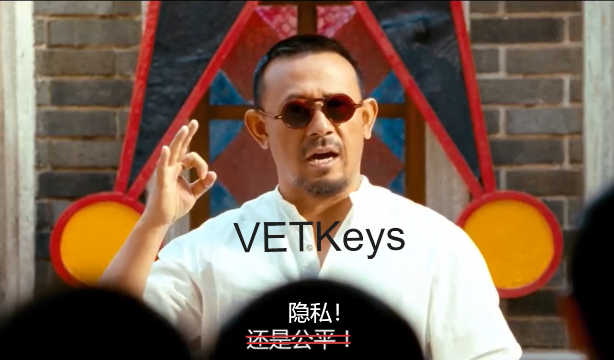

隐私那必须得有，我直接 ~（[直接重仓空进去](https://www.bilibili.com/video/BV1bb4y1k7Dz?share_source=copy_web)，不是）

咳咳，直接生成一对公私钥，公钥加密、私钥解密不就行了嘛。（如果还不了解公私钥非对称加密，可以先看看[这里]()）

行是行，只是风险有一点高：

万一私钥丢了怎么办？

万一私钥被黑客拿到怎么办？

万一想用另外一台设备解密怎么办？

把私钥从一台设备转移到另一台设备很不方便，而且还容易泄露！

 

这个时候 [IBE](https://en.wikipedia.org/wiki/Identity-based_encryption) 的作用就显示出来了。IBE（Identity Based Encryption）即基于身份的加密，由著名密码学家 Adi Shamir 在 1984 年提出。（没错，就是 [Shamir 秘密共享](https://en.wikipedia.org/wiki/Shamir%27s_secret_sharing)的那个 Shamir ，也是 RSA 加密算法里的 S）

但是他只能给出了基于身份的签名的方案，中看不中用。基于身份加密多年来一直是一个悬而未决的问题。直到 2001 年，Boneh-Franklin 方案和基于二次剩余的 Cocks 加密方案解决了 IBE 问题。

 

## IBE

IBE 是一种利用身份信息来简化密钥管理的加密方式。我们可以把 IBE 想象成一种特殊的公钥加密。

在普通的公钥加密中，每个用户都有自己的公钥和私钥。要给用户发送加密消息，需要知道用户的公钥。

而有了 IBE ，用户可以不用自己生成的独立的密钥对。用户可以直接拿自己的 id 当公钥用了。这个 id 可以是任意 ASCII 字符串，比如邮箱、生日、手机号等等。当然， id 是不能直接当公钥用的，IBE 其实是靠另一个公钥（主公钥）和用户的 id 一起对文件加密的。

我们可以理解为是一个公钥（主公钥）和 id 组合成了一把 “ 用户公钥 ” ，一起去加密文件的。

> 注意主公钥和用户 id 并没有结合，它们是两个东西。只是在加密文件时一起工作而已。

    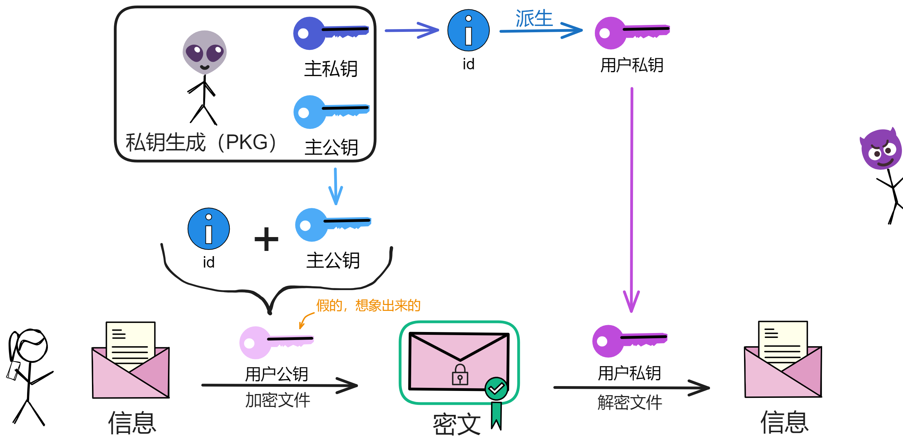

IBE 依赖一个可信第三方：私钥生成中心（PKG）。PKG 先生成一对主密钥。主公钥公开，用于和用户的 id 一起加密文件。

主私钥可以通过用户 id 派生出用户私钥，然后发送给 id 对应的用户。用户就可以使用自己的 id 加密文件了。

id 对应的用户私钥是靠主私钥派生出来的。有了 PKG 的主密钥对，所有的 id 都能通过主私钥计算出对应的用户私钥！

所以这个图实际上是这样的：

    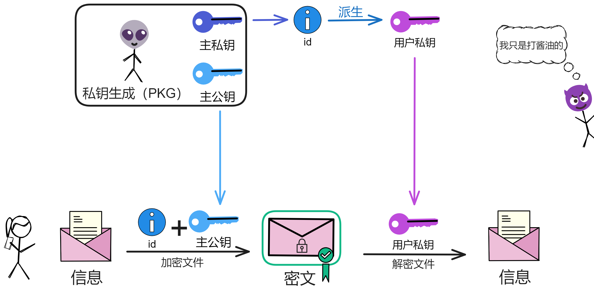

 

> 根据[论文](https://eprint.iacr.org/2001/090)，具体的密码学原理是这样的：
>
> 1. 设置阶段：
>
> (1) 选择一个双线性对 \\((G1,G2,GT,e)\\) ：这是一组具有特殊数学关系的群 \\(G1\\) 、\\(G2\\) 和 \\(GT\\) 。通过这些群之间的配对运算 \\(e()\\) ，可以进行一些运算。
>
> (2) 选择一个随机生成器 \\(P∈G1\\) ，\\(P\\) 是一个 \\(G1\\) 群中的基点。
>
> (3)  选择一个随机主密钥 \\(s ∈ Zp\\) ：\\(s\\) 是一个随机数。
>
> (4) 一个 hash 函数 \\(H ：{0,1}* → G1\\) ：用于将身份信息映射到 \\(G1\\) 群中。
>
> 2. 密钥提取阶段：
>
> (1) 对身份 \\(ID\\) ，计算 \\(H1(ID)\\) 得到公钥 \\(QID\\) ：\\(QID = H1(ID)\\) 。\\(QID ∈ G1∗\\) 。
>
> (2) 使用主密钥 \\(s\\) 和公钥 \\(QID\\) 计算私钥 \\(SID = sQID\\) 。用户私钥由私钥生成中心根据用户身份计算生成，然后发给对应用户。
>
> 3. 加密阶段：
>
> (1) 想给 ID 加密消息 \\(M\\) ，选择一个随机数 \\(r\\) ，\\(r ∈ Zq∗\\) 。
>
> (2) 计算密文 \\(C\\) 包括两部分：\\(C1 = rP\\) ，\\(C2 = M⊕e(H2(ID), P)r\\) 。所以 \\(C = (rP, M⊕e(H2(ID), P)r)\\) 。
>
> 拆分来看：选好随机数后，先计算密文组分 \\(C1 = rP\\) 。然后计算 \\(gID = e(QID, P) ∈ G2\\) 。这里 \\(P\\) 是系统的主公钥，\\(e\\) 是双线性映射。再算出密文组分 \\(C2 = M ⊕ H2(grID)\\) 。其中 \\(M\\) 是明文，H2 是一个哈希函数。密文 \\(C\\) 就是 \\(<C1, C2>\\) 。
>
> 4. 解密阶段：
>
> (1) 收到密文 \\(C\\) 。
>
> (2) 使用私钥 \\(SID\\) 和 \\(C1\\) 计算配对 \\(e(SID, C1)\\) ，可以还原出 \\(e(H2(ID), P)r ：e(SID, C1) = e(sQID, rP) = e(QID, P)r\\) 。
>
> (3) 然后可以解密出消息 \\(M = C2⊕e(H2(ID), P)r\\) 。
>

 

如果用户自己生成一对密钥，那每个人都用自己公钥加密文件太乱了。和人们加密联系都要保存一堆眼花缭乱的公钥。而现在有了 IBE ，只要大家都保存一个主公钥，和其他人加密联系直接用对方 id 就可以了，非常方便。

    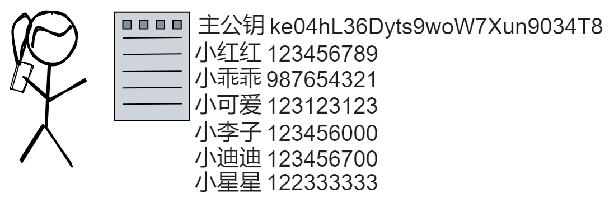

用户可以定期更换 id ，只要让 PKG 重新派生一个新 id 对应的私钥即可。

私钥丢啦？无所谓，让 PKG 重新派生一把私钥，然后赶紧把加密文件解密。怕别人找到私钥？无所谓，换个 id ，换个私钥。还可以给 id 设置过期时间。

    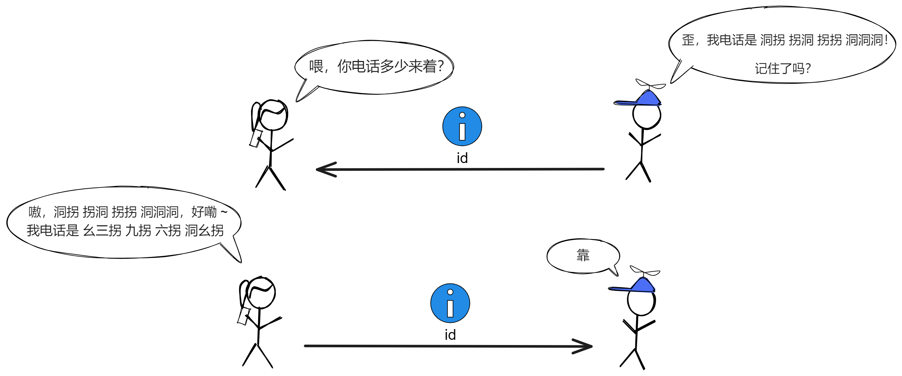

用户可以通过 PKG 用 id 加密文件，同样用 PKG 派生的私钥解密文件。**所以 id 就可以看成公钥，私钥由 PKG 派生。**

通过 PKG 的主密钥，一个 id 都能计算出一个对应的唯一私钥。

 

比如小明的邮箱是 xiaoming@example.com ，那么根据这个配方，就可以派生出 xiaoming@example.com 对应的私钥。拿到这个私钥，小明就可以解密所有加密到 xiaoming@example.com 的信息。

这样，用户就不需要单独保存私钥了，整个系统只需要一个主密钥，根据身份就可以派生对应的私钥。

IBE 避免了公钥加密中需要传递和保存每个用户公钥的麻烦。用户只需要知道对方的身份标识符，就可以加密信息。

实际应用中，IBE 系统一般拿用户的邮箱作为 id 。你只需要知道对方的邮箱，就可以加密发送邮件，而不需要获取对方的公钥。这简化了密钥管理流程。

    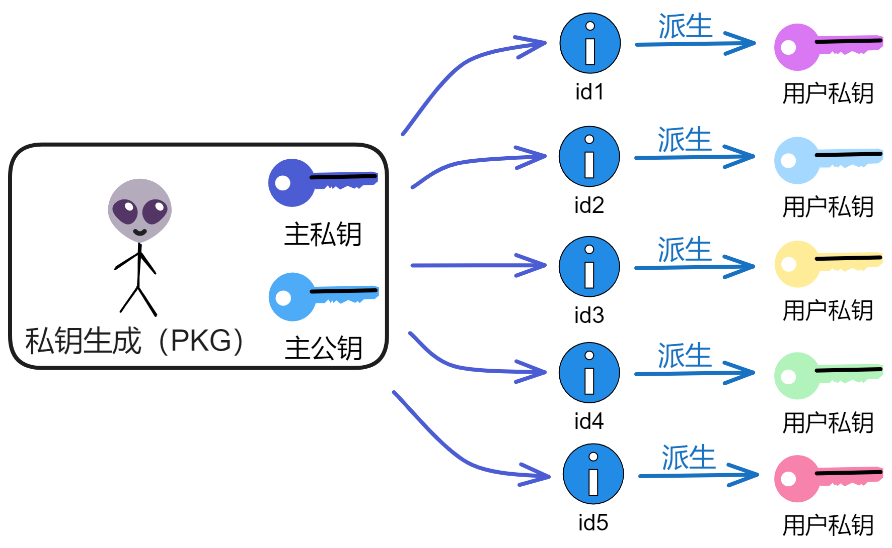

IBE 说白了就是一种公钥加密体制，其密钥派生绑定了用户的身份信息。

 

IBE 的主要优点是可以直接使用身份信息作为公钥，无需证书管理，密钥提取方便。但也存在 PKG 知晓所有用户私钥的密钥托管问题。

黑客只要攻破 PKG ，拿到主密钥对，那所有用户的信息都得泄露！

    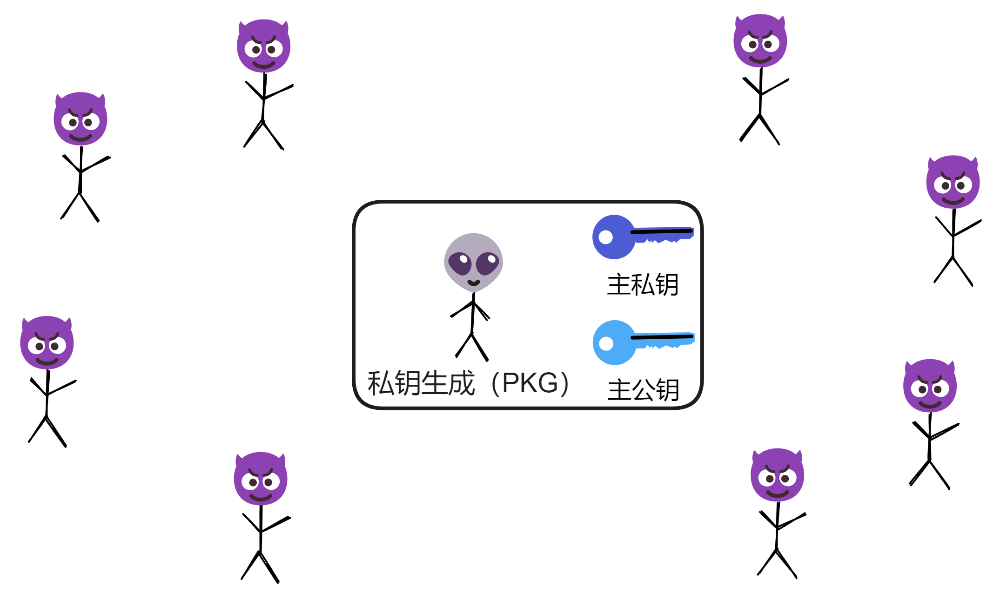

而且我们想在区块链上使用 IBE ，也没法选一个 IC 的副本（节点）做派生。哪怕是根据每个时期的第一个随机信标选一个副本也没法保证安全，万一那个副本正好就是恶意的呢，或者说那个副本被选为 PKG 之后产生了恶意，那就不好了。而且每隔一段时间就把密钥传给另一个副本也不安全。所以不能简单粗暴地直接随机安排一个副本做 PKG 。

想要更好的确保信息安全，Dfinity 团队在 2023 年提出了 vetKeys: How a Blockchain Can Keep Many Secrets 。这篇[论文](https://eprint.iacr.org/2023/616.pdf)给出了一种分布式的密钥派生方案：verifiably encrypted threshold key derivation ，**可验证加密阈值密钥派生**，简称 vetKD 。而 vetKD 的 核心是 Verifiably Encrypted Threshold BLS ，即 vetBLS 。下面我根据这篇论文中的内容讲讲 vetKD 。

 

## vetIBE

vetIBE 也就是把传统 IBE 方案里的第三方私钥生成中心（PKG）替换为子网里的副本们。它基于阈值密码技术，让 IBE 密钥的派生更去中心化、可验证，避免了单点故障。

在传统的 IBE 里，PKG 用主私钥与用户 id 的哈希做乘法运算得到用户私钥。

> \\(dID = sQID\\) 。这里 \\(dID\\) 就是 IBE 派生出的用户的私钥。其中 \\(sQID\\) 表示在椭圆曲线群 \\(G1\\) 上，使用主私钥 \\(s\\) 对点 \\(QID\\) 进行倍乘运算。
>
> 用户私钥 \\(dID\\) 是通过主密钥 \\(s\\) 和用户公钥 \\(QID\\) 在椭圆曲线群上进行乘法计算得到的。

 

在 vetIBE 中，子网整体取代了 PKG 。副本们对用户 id 做阈值签名，达到阈值后产生的这个签名就是 id 对应的私钥。多个副本共同生成主密钥，并使用 DKG 分享主密钥的片段。（这也是子网产生共识、随机数时用的密码学技术：BLS 阈值签名）

**用户使用自己的 id 和子网公钥加密文件，拿对 id 的 BLS 阈值签名解密文件。** 

    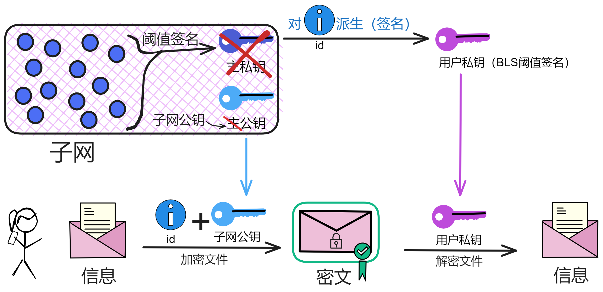

但是这里还有个安全问题：副本用自己的私钥片段对 id 签名之后，如果直接发给用户的话，被黑客拿到了就不安全了。黑客只要截获足够的阈值签名片段就相当于获得了 id 对应的私钥！所以不能直接把签名片段发回用户。这时候就需要在做一次公钥加密啦！

    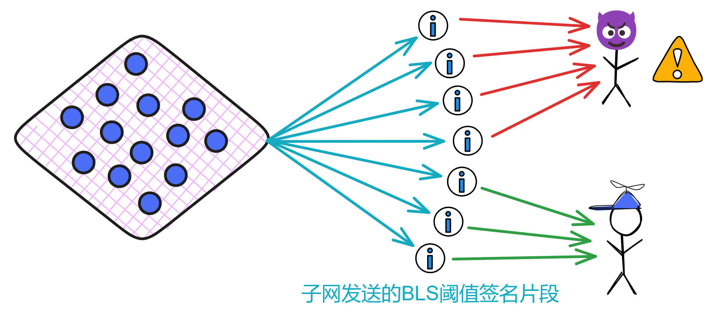

我们只要让用户生成一对临时传输密钥就能解决这个安全问题：用户在发起请求之前先直接生成一对传输密钥 \\((tsk, tpk)\\) 。然后再发起派生密钥请求，把传输公钥 \\(tpk\\) 、用户 id 发给子网。

子网里的每个副本在签名之后，再拿用户的传输公钥对签名片段做一次加密，并发给用户。用户拿到加密的签名片段后，先用自己的传输私钥解密，得到签名片段。再把签名片段组合成完整签名（私钥），就可以解密文件了 ~

 

所以我们来重新捋一遍加密解密的流程：vetIBE 的基本思路是用户先加密信息，然后存储到区块链上。

当用户需要加密文件时，使用用户的 id 和子网公钥 \\(mpk\\) 对文件加密。然后把密文存储在 Canister 里。

当用户需要解密文件时，首先生成传输密钥 \\((tpk, tsk)\\) ，然后发起派生密钥的请求，将 \\(tpk\\) 、id 发给副本们。

每个副本用自己的私钥片段 \\(ski\\) ，计算出 id 的 BLS 签名片段 \\(σi = H(id)^{ski}\\) 。

    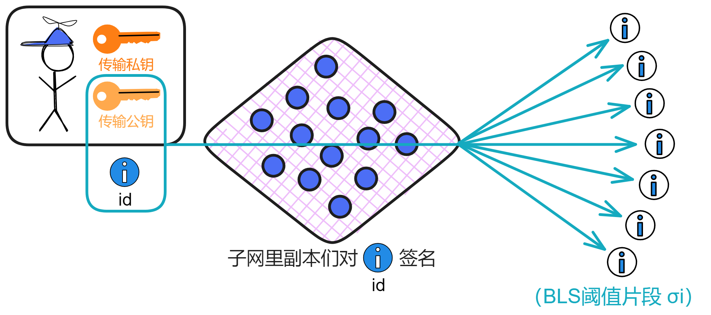

然后每个副本再用传输公钥 \\(tpk\\) 加密自己的签名片段，生成加密签名片段 \\(eki\\) ，并将发送给用户。

    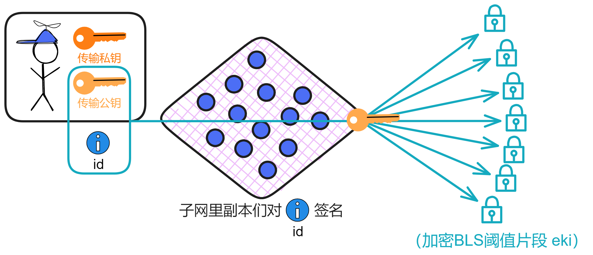

用户收到 \\(t\\) 个不同副本的加密签名片段，然后用传输私钥 \\(tsk\\) 分别解密得到 \\(t\\) 个签名片段。合并出子网对 id 的签名 \\(σ\\) 。这个 \\(σ\\) 就是 id 对应的私钥。

    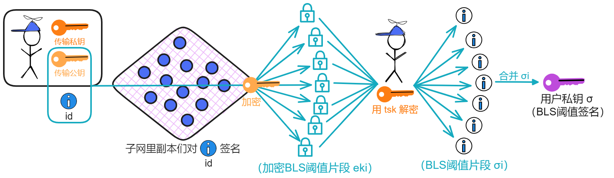

> 具体的加密过程是：
>
> 用户调用接口，输入是身份 ID 和明文信息 \\(m\\) 。
>
> 调用哈希函数，对 ID 执行哈希运算 \\(h = H1(id)\\) ，得到值 \\(h\\) 。
>
> 选择一个随机数 \\(s\\) ，计算 \\(t = H2(s, M)\\) ，其中 H2 是另一个哈希函数。
>
> 分别计算 \\(C1 = g2^t\\) ， \\(C2 = s ⊕ H3(e(H1(id), mpk)^t) = s ⊕ H3(e(h, mpk)^t)\\) ， \\(C3 = M ⊕ H4(s)\\) 。密文为 \\(C = (C1, C2, C3)\\) 。
>
> 有了 vetKD ，现在每个子网都是一个 “ 去中心化的 PKG ” 啦。

vetkeys 就是指派生出来的这些密钥。

 

所以在 vetIBE 中，用户没有固定的公钥，而是根据需要临时生成传输公钥 tpk 。然后通过副本们的协作来获得用户私钥。用户 id 和 tpk 一起作为解密密钥派生的 “ 身份 ” ，但用户并没有固定的公私钥对。

传输公钥顾名思义，就是临时用来加密传输签名片段的嘛 ~ 

 

## 用户用于解密的传输私钥丢了怎么办？

其实加密文件时用的是子网公钥和 id ，解密文件时需要子网根据 id 派生出的密钥（BLS 签名），和传输密钥没关系。传输密钥只是用来确保签名片段的安全的。

所以只要重新生成一对传输密钥，然后发给子网，让它用这把新传输公钥加密签名片段即可，这样就可以派生出新的 BLS 签名了。用户用新的传输私钥可以解密并获取到 BLS 签名明文，进而可以解密文件。

 

用户不需要在本地保存私钥，可以随时用新传输公钥获取密钥。

相比本地密钥存储方案，这种基于区块链网络辅助派生的机制可以更好地保证用户的可用性。只要用户 id 在，就能解密文件。而用户的 id 也可以由 ii （互联网身份）提供安全保证。

 

## 那用户想在另一个设备上解密文件该怎么办呢？

有办法。一样的，由 ii 登录 DApp 获取 id ，有了 id 😏 你懂的。再生成一对新传输密钥即可！

 

## 那如何进行端到端加密通信呢？

vetIBE 技术还可以用来实现端到端加密的通信。非常简单：

小 A 登录 DApp 获得身份 ID_A ，再由 ID_A 获得相应的用户私钥，即 ID_A 的 BLS 签名：σ_A。

小 B 也生成自己的 ID_B 和用户私钥：σ_B 。

现在小 A 和小 B 都有了各自的公钥（id）和私钥（σ）。小 A 就可以用对方的 id 加密信息发送。

小 B 用自己的私钥 σ_B 解密，完成通信。

    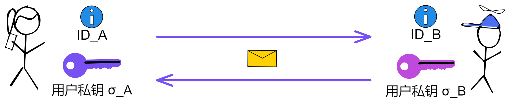

 

什么？

你还觉得不安全？万一有一个人的设备被入侵了，黑客拿到了 id 对应的用户私钥，这时用 id 通信就不安全了。而且 id 对应的用户私钥是唯一的，这就意味着用户必须得换 id 了，得再用新 id 派生出用户私钥。而且之前发送的信息都会被破解。

 

靠！看来只有使出我的神威超级无敌终极必杀技了：**通信 ID** ！

**反正知道了 id 就能靠子网推算出私钥。** 那我给通信的双方生成一条通信 ID （临时的），把来往的信息全部加密，通信双方直接按照预定的 id 找子网派生出私钥即可。

 

比如：

小 A 喜欢上了小 B ，小 A 想和小 B 加密通信。先按照预定的方式生成一个通信 ID ：小 A 的用户 id 加小 B 的用户 id 加上发起这次通信的一方发的信息，再把这些统统哈希一下，得到一个通信 ID 。

 

小 A 先用小 B 的 ID_B 加密 “ 010 ” ，发给小 B 。（这个是小 A 随便发的，也可以生成一个随机数，无所谓，每次不重复就行）

然后小 A 就可以生成这次的通信 ID 了：发送方 id 加接收方 id 加 010 ，哈希一下，得到通信 ID 。

小 B 收到消息后，用子网派生的私钥先解密，得到 010 。然后按照同样的规则生成通信 ID 。

欧了👌。有了通信 ID ，双方就能通过子网派生出对应的私钥，就可以肆无忌惮地聊天啦。例如发情书💌。

    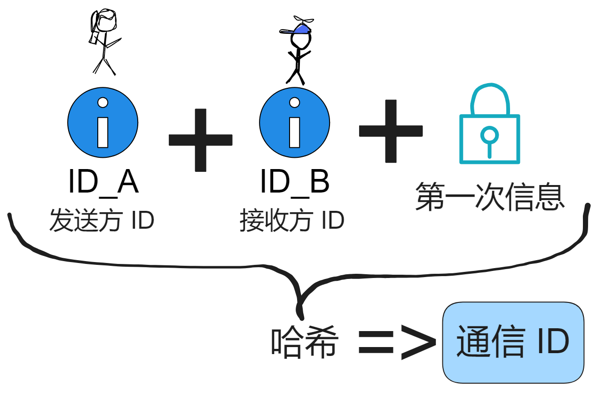

双方用通信 ID 加密，安全！这种方式的安全性在于：

通信 ID 经过设计，只有参与通信的小 A 和小 B 能获得它的密钥。

消息传输中只有密文，第三方不能解密。

密钥派生过程有阈值保护，即使部分节点被入侵也不会泄密。

即使小 A 或小 B 的设备被入侵，私钥也不会直接泄露，因为本地不需要保存用户 ID 对应的私钥。只需要换个新通信 ID ，通过子网重新派生通信 ID 的私钥。

这样，在保证传输安全的同时，也解决了用户设备被入侵的问题。相比传统方案仅依靠本地密钥存储的端到端加密，vetIBE 方案通过区块链辅助可以实现更强的抗入侵能力。

 

这就是 vetIBE 的内容了，除了 vetIBE ，论文中还提到了 vetSIG 、vetPRF 、vetVRF 。这些技术组合成了 vetKD 。

由于前面已经长篇大论废话了那么多，后面的 vetSIG 、vetPRF 、vetVRF 就简单说一说啦哈哈哈。

 

## vetSIG

BLS 签名本身就是可验证的，所以可以直接用作签名。使用 vetBLS 让副本以加密形式生成 BLS 签名。用户收到后可以通过验证恢复出签名，从而实现 vetSIG 。

其实就和 vetIBE 差不多， vetIBE 是传入 id 推算对应私钥，而 vetSIG 就单纯用一下子网的 BLS 阈值签名。

具体步骤就是：

1. 用户生成 \\(tpk\\) ，\\(tsk\\) ，将 \\(tpk\\) 发给副本们。
2. 当用户要获得消息 \\(m\\) 的 BLS 签名时，它发送 \\(m\\) 和 \\(tpk\\) 给副本们。
3. 每个副本用它的 \\(sk\\) 份额计算 \\(m\\) 的签名份额 \\(σi\\) ，并用 \\(tpk\\) 加密，发送 \\(eki\\) 给用户。
4. 用户收到 \\(t\\) 个 \\(eki\\) ，解密出签名份额，恢复出签名 \\(σ\\) 。
5. 用户将 \\(σ\\) 作为 \\(m\\) 相对于公钥 \\(pk\\) 的签名，即实现了 vetSIG 。

 

## vetPRF

BLS 签名的唯一性，配合随机预言机下的哈希函数，可以构成 PRF 。使用 vetBLS 让副本以加密形式生成 BLS 签名。用户恢复签名后，与输入一起哈希得到输出，即实现 vetPRF 。

具体步骤是：

1. 用户生成 \\(tpk\\) ，\\(tsk\\) ，发送 \\(tpk\\) 。
2. 当用户要计算 PRF 在输入 \\(x\\) 上的输出时，它发送 \\(x\\) 和 \\(tpk\\) 给副本们。
3. 每个副本计算 \\(x\\) 的 BLS 签名份额，加密后发送给用户。
4. 用户收到加密份额，恢复出签名 \\(σ\\) 。
5. 用户计算 \\(y = H'(pk,x,σ)\\) 作为 PRF 在 \\(x\\) 上的输出，即实现了 vetPRF 。

 

## vetVRF

在 vetPRF 的基础上，使用 BLS 签名作为证明，可以构成可验证的 VRF 。验证过程就是验证 BLS 签名正确性。

具体步骤：

1. 在 vetPRF 的基础上，用户要证明 \\(y\\) 的正确性。
2. 它将签名 \\(σ\\) 作为证明，与 \\(y\\) 一起发送给验证者。
3. 验证者检查 \\(e(σ, g2) = e(H(x), pk)\\) 来验证 \\(y\\) 的正确性，即实现了 vetVRF 。

 

## 总结

vetKD 实现了安全高效的阈值密钥派生，用户不需自己生成和保管私钥，非常适用于区块链场景。vetKD 更适合作为区块链网络的基础设施，提供统一的密钥管理与访问控制。它利用了区块链的安全特性，减轻了用户的负担，提供了一种更易用和安全的密钥管理方案。

 

所以 vetKD 到底解决了什么问题呢？

具体来说：

vetKD 通过阈值加密的方式，让区块链节点协作派生密钥，但每个节点都不知道最终的密钥。不存在单点故障，安全性更高。即使个别节点被攻破，也不会直接泄露实际私钥。相比传统方案，不依赖可信执行环境，安全性更高。

用户可以加密隐私数据，节点协作解密出密钥并传送给用户，但过程中不会泄露实际密钥。而且一个子网公钥（master key）可以派生出无限多个孤立的身份密钥，大大简化密钥管理。还可以启用各种端到端加密应用，如隐私聊天、隐私支付、密钥托管等。

总之，vetKD 使区块链应用可以保护用户数据隐私，同时又能保留区块链的可验证性和透明性，填补了这一领域的重要空白，具有重要的创新价值。

 

 
