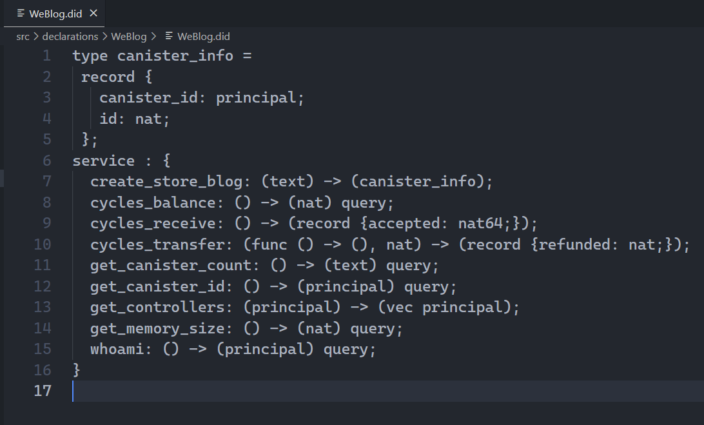
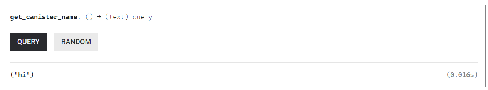
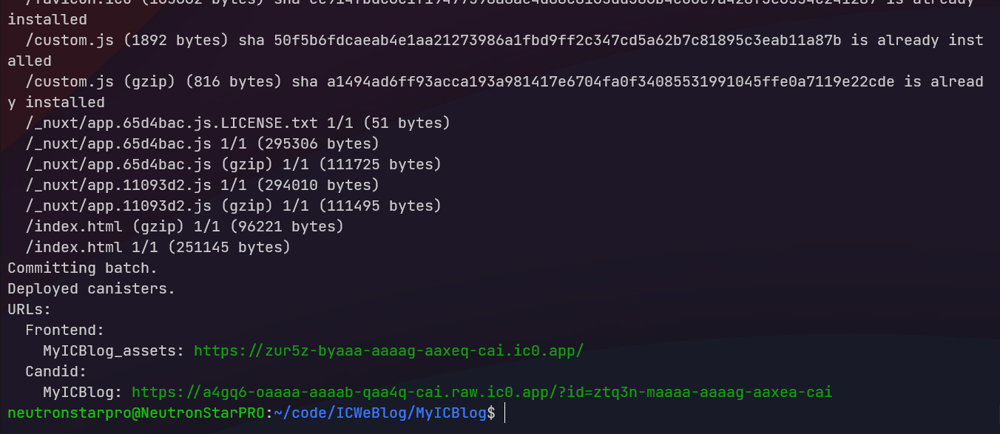

## 体验快速开发Dapp

如果你感兴趣的话，这里有个小 [demo](https://github.com/NeutronStarPRO/WeBlog) 。可以参考[官方文档](https://internetcomputer.org/docs/current/developer-docs/)在本地部署试试，也可以部署到 [motoko playground](https://m7sm4-2iaaa-aaaab-qabra-cai.raw.ic0.app) 体验。

 

在配置好基本的开发环境后，

下面是一些和 Canister 有关的概念。

 

### Canister的状态

Canister 有自己的生命周期，有四种状态：已创建（Created）、正在运行（Running）、停止中（Stopping）、已停止（Stopped）。

已创建：无代码，无内存，不能接收和发送消息。

运行中：安装了代码，可以接收和发送消息。

停止中：不再接收和处理新的消息，只接收之前消息的回复。

已停止：停止运行，可以删除 Canister 、卸载代码或升级代码。

 

### Wallet

Wallet 是允许存储和管理 Cycles 的专用 Canister 。Wallet 要归属于某个身份。

 

### Principal

Principal 本质是一种标识符，可以用于标识身份和 Canister（未来可能还有其他）。

比如可以使用 Principal ID 标识一个身份，当你第一次使用开发者 SDK 时，dfx 命令行工具会为你创建 default 开发者身份（和一对公钥私钥），default 这个开发者身份就是由 Principal ID 标识。

注意，开发者身份还可用于派生 Account ID ，以代表「身份」将 ICP 代币保存在 Ledger Canister 中。

同样，Canister ID 也是一种 Principal 。

所以当说起 Principal 时，它可能会同时代表某个身份或者某个 Canister，比如 Wallet Canister 。

 

### Controller

Controller 是具有安装、升级、删除 Canister 权限的 Principal 。

一般情况下，一个 Canister 的 Controller 可以指定为某个身份、或者某个身份对应的 Wallet Canister 。

在 dfx 0.9 之后，默认身份是 Canister 的 Controller 了，Wallet Canister 不再是默认 Controller（相当于 dfx 指定了 --no-wallet）。

 

### Candid UI

IC 的应用层还集成了一个消息接口定义语言和数据格式：Candid UI 。它在部署时能解析后端 Canister 里的公开函数，然后自动生成前端网页。让不熟悉前端的智能合约开发者无门槛测试合约。用于固定类型、高级语言及跨语言互操作性。这使得任何两个 Canister ，即使是用不同的高级语言编写，也可以轻松地相互通信。

自动生成的 Candid 文件长这样。Candid 是一种数据描述语言，也是跨语言调用的规范。它能描述 Canister 提供的接口和数据类型。

    

本地部署项目后，它给出了前后端的两个网址。前端网址可以直接看到前端页面，后端 Canister 由 Candid UI 生成。

    

Candid UI 生成的页面长这样：

    

更新调用：Candid UI 也模拟了实际调用 IC 的延时，右下角花了显示 6.59 s 。这个函数的作用是让 Canister 创建一个新的 Canister ，用来存储 blog ，耗时比较多。

创建一篇 blog 的调用时间 2.116 s ，速度还可以。

    

查询数据 0.016 s ，非常快。

    

 

### Canister id

在创建 Canister 时，系统会给 Canister 分配一个全局唯一的 Canister id 。边缘节点靠 Canister id 定位它在哪个子网，然后把消息转发出去。而且前端 Canister 的 id 加上域名 ic0.app 就是网址，比如 https://zur5z-byaaa-aaaag-aaxeq-cai.ic0.app （我的博客网址）。

    

    

一个 Canister 的基本结构大概是这样的：

    

 
