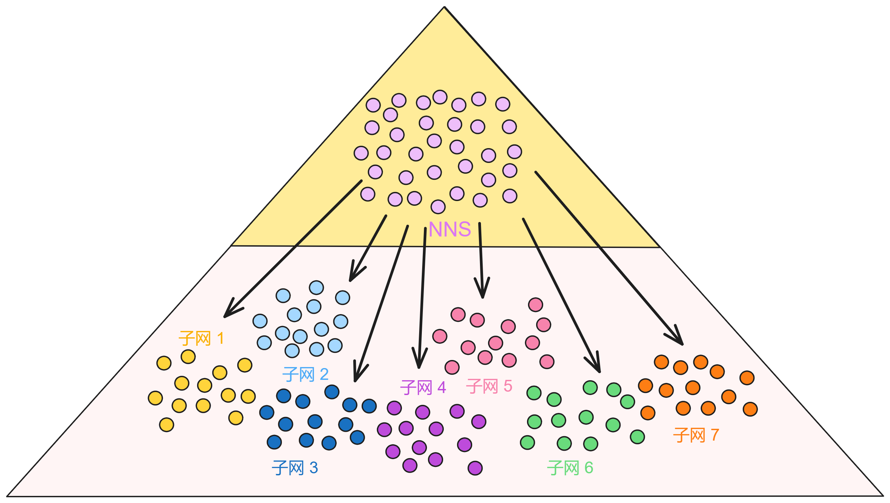
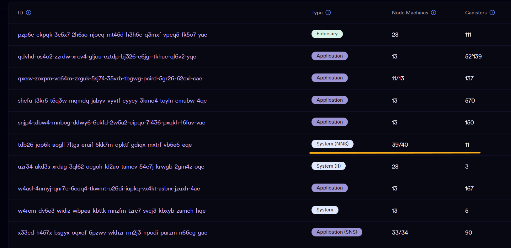
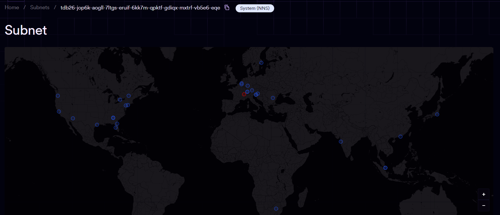

## NNS是干嘛的

正如在前面总结链钥密码学时所说：

***IC 最伟大的创新在于：通过一系列复杂的密码学技术，实现了子网内部自己达成共识，可以理解为一种分片技术。有了链钥密码学技术，子网之间可以进行安全的跨子网通信。因为不需要整个网络的全局共识，IC 可以通过添加更多子网来实现横向扩展。***

<br>

从技术架构上来讲，IC 可以无限扩容。只要需要，就可以不断添加新子网进来。但是对于单个子网来说，在子网内部进行共识的时候，成员是固定的，因为 BLS 阈值签名的私钥片段已经提前分发给共识委员会的成员了。就算有新副本要加入子网也得先 “ 待命 ” ，等下个时期开始时再分享私钥片段。所以对于单个子网来说，成员需要保持相对稳定，不能像比特币那样能随时随地加入挖矿。

另外，IC 能不断创造子网（分片），这就需要一个地方统计这些子网，不然坏人也组建一个子网冒充 IC 的子网就不好了。如果可以随意创建子网，那么子网之间沟通和信任的成本就会大幅增加，每个跨子网信息都需要经过层层验证，成本忒太高了。＞︿＜ 

但是 IC 又必须是去中心化的，必须开放、包容。

<br>

**所以 IC 为了能承载大规模计算任务和超低成本的跨子网通信，选择了一种兼顾性能与去中心化的折中方式 —— DAO 。**如果你还不了解 DAO 是啥东西，可以先看[这里](2.什么是DAO.md)。

<div class="center-image">
    
</div>

经过深思熟虑，Dfinity 团队选择再 IC 里创建一个 “ 超级子网 ” ，叫做系统子网。这个子网拥有 IC 的最高权限，相当于 IC 的超级管理员：创建子网、删除子网、给子网添加新节点、拆分子网、升级子网的协议、升级副本软件版本、调整 Cycles 汇率、全局唯一的 Canister id 、用户的 principal id 、每个子网的子网公钥等等，关系到整个 IC 区块链系统的关键参数都由这个超级管理员设定或者内部投票决定。

这种在区块链系统底层嵌入 DAO 的混合模型叫 DAO 控制网络（DAO - controlled network）。整个 IC 网络都在 DAO 的控制下运行。

<br>

管理着整个 IC 系统的 DAO 有个炫酷的名字：网络神经系统（Network Nervous System ，NNS）。IC 上的关键参数都由一个 DAO ，即整个 IC 社区决定。社区可以在系统需要扩容时做出决定增加子网！😎 

任何人都可以使用质押在 NNS 的神经元发起扩容的提案，提案通过后 NNS 会自动产生新子网来应对网络负载，而且扩容过程中不需要停止服务。对用户与开发者来说，扩容的过程是毫无感觉的。这是 IC 与传统区块链网络的不同之处，IC 的 TPS 可以随着子网的增加而提升，只要增加子网（分片）就行了！这让 IC 有了类似传统网络的能力：通过添加更多服务器提升 TPS 。

<br>

不过有一点得注意一下，DAO 不是一天建成的。DAO 没法在短时间内直接变成去中心化的形态。它需要一个缓慢的过程，慢慢儿的去中心化，潜移默化、润物细无声。像比特币最初也是渺小脆弱、不堪一击的，挺过几次危机、经历了硬分叉之后才形成今天的局面的。

> 比特币有好几次面临溢出、提取别人比特币 bug 等等 bug 

NNS 是 IC 的超级管理员。这个 DAO 最大的投票权落入坏人之手，整个 IC 系统就完了，DAO 是集成在区块链系统底层的。NNS 是 IC 最需要安全的子网，所以 NNS 子网的[节点数量也非常多](https://dashboard.internetcomputer.org/subnet/tdb26-jop6k-aogll-7ltgs-eruif-6kk7m-qpktf-gdiqx-mxtrf-vb5e6-eqe)，让黑客难以控制数量足够的节点，最大程度确保 NNS 子网底层的安全。
<div class="center-image">
    
</div>

目前有 40 个节点机器，有一个坏了，问题不大：
<div class="center-image">
    
</div>

<br>

在 NNS 子网内部，部署着精密的引擎： DAO 的智能合约。

> 对了，在 IC 上，智能合约就是一个叫 Canister 的虚拟容器。它和 Docker 或者 Kubernetes 类似，Canister 是一个 Wasm 容器。在[这里](../4.容器(Canister)/1.Canister.md)可以了解 Canister 的更多内容，如果你还没有了解过的话。

<br>

## 深入NNS内部

NNS 子网现在总共有 11 个 Canister ，在 [Dashboard](https://dashboard.internetcomputer.org/canisters?s=25&subnet=tdb26-jop6k-aogll-7ltgs-eruif-6kk7m-qpktf-gdiqx-mxtrf-vb5e6-eqe) 可以看到。

|        名字        |         Canister id         |            控制者 Controller            |          功能          |
| :----------------: | :-------------------------: | :-------------------------------------: | :--------------------: |
|    NNS Registry    | rwlgt-iiaaa-aaaaa-aaaaa-cai |   r7inp-6aaaa-aaaaa-aaabq-cai（Root）   |         注册表         |
|   NNS ICP Ledger   | ryjl3-tyaaa-aaaaa-aaaba-cai |   r7inp-6aaaa-aaaaa-aaabq-cai（Root）   |      ICP 代币功能      |
|  NNS ICP Archive   | qjdve-lqaaa-aaaaa-aaaeq-cai |   r7inp-6aaaa-aaaaa-aaabq-cai（Root）   | 存储 Ledger 的历史记录 |
|   NNS Governance   | rrkah-fqaaa-aaaaa-aaaaq-cai |   r7inp-6aaaa-aaaaa-aaabq-cai（Root）   |    投票，神经元提案    |
|    NNS Lifeline    | rno2w-sqaaa-aaaaa-aaacq-cai |   r7inp-6aaaa-aaaaa-aaabq-cai（Root）   |   控制 Root Canister   |
| NNS Cycles Minting | rkp4c-7iaaa-aaaaa-aaaca-cai |   r7inp-6aaaa-aaaaa-aaabq-cai（Root）   |  将 ICP 兑换为 Cycles  |
| NNS Genesis Token  | renrk-eyaaa-aaaaa-aaada-cai |   r7inp-6aaaa-aaaaa-aaabq-cai（Root）   |      创世纪神经元      |
|      NNS Root      | r7inp-6aaaa-aaaaa-aaabq-cai | rno2w-sqaaa-aaaaa-aaacq-cai（Lifeline） | 控制其他 NNS Canister  |
| NNS Front-End Dapp | qoctq-giaaa-aaaaa-aaaea-cai |   r7inp-6aaaa-aaaaa-aaabq-cai（Root）   |  存储 NNS 的前端代码   |
|    NNS SNS-WASM    | qaa6y-5yaaa-aaaaa-aaafa-cai |   r7inp-6aaaa-aaaaa-aaabq-cai（Root）   |     记录 SNS 信息      |
|  （NNS Identity）  | qhbym-qaaaa-aaaaa-aaafq-cai |   r7inp-6aaaa-aaaaa-aaabq-cai（Root）   |      用户身份 ii       |

<br>

### NNS上的Canister

它们的作用都和系统运行息息相关：

1. Registry Canister：注册表 Canister 。整个 IC 的系统配置都存在这个 Camister 里，比如哪些节点属于某个子网以及每个节点应运行的软件版本。
2. Ledger Canister：ICP 账本 Canister 。它存储着各个 principal id 的 ICP 余额以及 ICP 交易历史记录。
3. Archive Canisters：一旦交易数量太多而无法保存在单个 Canister 中时，交易历史就存储在这里。
4. Governance Canister：治理 Canister 。接收和存储提案，这些提案都是和治理 IC 网络有关的。治理 Canister 还跟踪神经元，确定谁可以参与投票治理。
5. Cycles Minting Canister：负责燃烧 ICP 铸造 Cycles 。IC 上的 Cycles 都由这个 Canister 铸造。
6. Root Canister：它是所有其他 NNS Canister 的控制者，负责升级它们。Canister 的控制者有权限删除 Canister 、升级更新代码、停止 Canister 。但 Root Canister 不能随意升级 Canister ，必须要治理 Canister 投票通过升级某个 Canister 的提案后，才会调用 Root Canister ，由 Root Canister 负责执行升级。
7. Lifeline Canister：它是 Root Canister 的控制者，负责升级它。NNS 里唯一一个使用 Motoko 语言写的 Canister ，当 Rust 底层库出现非常严重的 Bug 时，就可以用这个 Motoko Canister 来升级 Root Canister ，再用 Root Canister 升级其他 NNS Canister 来恢复 IC 系统。
8. Front-End Dapp：NNS 前端 Canister 。
9. Genesis Token Canister：用于初始化创世之前就已存在的神经元的 Canister 。治理记录了一些投资人、基金会、早期贡献者的神经元。
10. SNS-WASM Canister：管理 SNS Canister 相关的内容。创建、更新、删除 SNS Canister 都是它负责的。投票通过后由它把 Wasm 模块安装到 SNS 子网的 Canister 里。
11. 用户身份抽象 Canister：记录用户身份。

<br>

### 注册表Canister

其中最重要的 Canister 就是注册表 Canister（Registry Canister）了。

这里记录着 IC 上的所有子网、以及子网的公钥、对子网公钥的 BLS 阈值签名、节点的各种信息，还有 Cycles 的价格、防火墙配置等等。

新节点首先必须把自己的身份提交给 NNS ，然后投票通过后才能加入子网。所有副本都会监控注册表 Canister ，获取最新的配置。每个负责打包出块的副本也得把最新的配置放进区块。

在任何大型分布式系统中，由于硬件故障、网络连接问题或节点所有者决定将节点下线，单个节点的故障是不可避免的。如果遇到这种情况，NNS 会选择一个备用副本来替换其子网中的故障副本。新副本随后加入子网，并通过追赶包与现有副本进行状态同步，开始参与子网共识。

<br>

### 账本Canister和ICP代币

ICP 代币由账本 Canister（Ledger Canister）管理，它存储两种东西：账户和交易。账户记录跟踪某个 principal （在 IC 上的认证身份）拥有的代币数量。代币随后可以从一个账户发送到另一个账户，这被记录在账本 Canister 的交易中。

在 NNS 里，ICP 有三种用途：

1. 任何人可以购买 ICP ，质押到 NNS 并参与 IC 网络治理，质押和投票会得到 ICP 奖励。
2. 参与治理和提供计算能力的节点机都会得到 ICP 奖励。
3. ICP 可转换为 Cycles ，这是 Canister 进行计算、通信和存储的燃料。

所以你看，ICP 不是直接集成在系统底层的功能性代币，ICP 是部署在 NNS 子网的智能合约，Cycles 才是系统的功能性代币。但不管怎么说，NNS 上的智能合约是整个区块链系统最重要的一部分，也相当于支持 IC 运行的底层组件了（只是从架构上看部署在应用层）。

> 更深层次的问题：如果某个 DAO 遭到黑客攻击，大量 ICP 被黑客控制，是否可以通过 NNS 投票来更改 ICP 交易记录，强行返还被盗的 ICP ？

<br>

### 治理Canister

治理 Canister（Governance Canister）负责持有神经元，确定谁可以参与治理。另外，它还存储提案，以及与提案相关的信息，比如赞成票由多少、反对票有多少等等。如果一个提案被采纳，治理 Canister 就会自动执行决定，没人能阻拦。最后，治理 Canister 会将奖励分发给参与投票、为决策做出贡献的神经元。

<br>

### 定义NNS上的Canister id

顺便提一嘴，NNS 子网里的 Canister 应该是第一个部署在 IC 上的 Canister 。NNS 里这些 Canister 的 Canister id 是直接在[代码](https://github.com/dfinity/ic/blob/master/rs/nns/constants/src/lib.rs)里定义好的。Canister id 的是由 u64 类型的索引转换出来的，也可以把 Canister 转换回 u64 。

这段代码定义了 NNS 子网各 Canister 的基础信息，是初始化 NNS 子网的重要组成部分。

```rust
// 定义NNS子网内各个Canister的索引
pub const REGISTRY_CANISTER_INDEX_IN_NNS_SUBNET: u64 = 0;
pub const GOVERNANCE_CANISTER_INDEX_IN_NNS_SUBNET: u64 = 1;
pub const LEDGER_CANISTER_INDEX_IN_NNS_SUBNET: u64 = 2;
pub const ROOT_CANISTER_INDEX_IN_NNS_SUBNET: u64 = 3;
pub const CYCLES_MINTING_CANISTER_INDEX_IN_NNS_SUBNET: u64 = 4;
pub const LIFELINE_CANISTER_INDEX_IN_NNS_SUBNET: u64 = 5;
pub const GENESIS_TOKEN_CANISTER_INDEX_IN_NNS_SUBNET: u64 = 6;
pub const IDENTITY_CANISTER_INDEX_IN_NNS_SUBNET: u64 = 7;
pub const NNS_UI_CANISTER_INDEX_IN_NNS_SUBNET: u64 = 8;
pub const SNS_WASM_CANISTER_INDEX_IN_NNS_SUBNET: u64 = 10;

pub const NUM_NNS_CANISTERS: usize = ALL_NNS_CANISTER_IDS.len();
// 根据索引,定义各个Canister的ID
pub const REGISTRY_CANISTER_ID: CanisterId =
    CanisterId::from_u64(REGISTRY_CANISTER_INDEX_IN_NNS_SUBNET);
pub const GOVERNANCE_CANISTER_ID: CanisterId =
    CanisterId::from_u64(GOVERNANCE_CANISTER_INDEX_IN_NNS_SUBNET);
pub const LEDGER_CANISTER_ID: CanisterId =
    CanisterId::from_u64(LEDGER_CANISTER_INDEX_IN_NNS_SUBNET);
pub const ROOT_CANISTER_ID: CanisterId = CanisterId::from_u64(ROOT_CANISTER_INDEX_IN_NNS_SUBNET);
pub const CYCLES_MINTING_CANISTER_ID: CanisterId =
    CanisterId::from_u64(CYCLES_MINTING_CANISTER_INDEX_IN_NNS_SUBNET);
pub const LIFELINE_CANISTER_ID: CanisterId =
    CanisterId::from_u64(LIFELINE_CANISTER_INDEX_IN_NNS_SUBNET);
pub const GENESIS_TOKEN_CANISTER_ID: CanisterId =
    CanisterId::from_u64(GENESIS_TOKEN_CANISTER_INDEX_IN_NNS_SUBNET);
pub const IDENTITY_CANISTER_ID: CanisterId =
    CanisterId::from_u64(IDENTITY_CANISTER_INDEX_IN_NNS_SUBNET);
pub const NNS_UI_CANISTER_ID: CanisterId =
    CanisterId::from_u64(NNS_UI_CANISTER_INDEX_IN_NNS_SUBNET);
pub const SNS_WASM_CANISTER_ID: CanisterId =
    CanisterId::from_u64(SNS_WASM_CANISTER_INDEX_IN_NNS_SUBNET);
```

<br>

### NNS无Gas

NNS 是系统子网，里面部署的 Canister 都是和 DAO 、系统运行相关的，开发者不能在 NNS 部署 Canister 。所以 NNS 也没有 Gas 费，不消耗 Cycles 。

<br>

## NNS 治理

NNS 作为一个 DAO ，任何人都可以参与投票，治理网络，无需许可。

<br>

### 神经元简介

[神经元](https://dashboard.internetcomputer.org/neurons)就相当于是 NNS 这个 DAO 的治理代币。

只要买一些 ICP ，发送到 [NNS 钱包](https://nns.ic0.app)，然后质押 ICP ，即可获得神经元。作为神经元的持有者，你可以对 NNS 里关于 IC 网络的提案投票，也可以提出提案让大家投票。质押的 ICP 越多，神经元的投票权也越大。质押的时间越长、投票的次数越多，神经元的投票权也会增多。当然，在神经元到期时，收到额外的 ICP 奖励也越多。为了获得更高收益，神经元持有者会倾向于让自己的神经元尽可能多的参与投票，以赚取最大的投票奖励。同时，他们也会投票支持在自己看来最有利于 IC 网络发展的提案。

<br>

系统会根据神经元的 “ 成熟度 ” （锁定的时间）来发放奖励，奖励的形式是增发的 ICP 。但是，由于 ICP 市价会随时间波动，神经元的最终收益也会有起伏。

<br>

如果不知道该投赞成还是反对，你也可以选择跟随几个你信任的神经元。跟随其他神经元时，那个神经元投票之后，你的神经元也会投一样的票。这样就不用天天打开 NNS 钱包投票了。而且有些提案涉及到很多专业知识，需要社区里的专业人士分析，普通人很难选择。

<br>

神经元有以下几个关键属性：

- 实用代币（ICP utility tokens）：这是用来创造神经元的代币。一个神经元里锁定的 ICP 数量决定了它的基础投票权重。

- 溶解延迟：这决定了把 ICP 锁定在这个神经元账户里的时间。这个延迟期可以在创建时设置，比如 6 个月或 1 年。 

- 成熟度：这反映了神经元持有人通过治理参与获得的奖励。成熟度可以再投入治理中获取更多投票权，或者提取出 ICP 。

[这里](https://internetcomputer.org/docs/current/tokenomics/nns/nns-staking-voting-rewards)有关于神经元质押和投票奖励的详细信息。如果你打算质押一些 ICP ，可以使用[质押计算机](https://networknervoussystem.com/)计算收益。

<br>

每个提案都有确定的投票期限。在投票期结束时，如果简单多数赞成该提案，且赞成票数超过了总投票权的 3% ，这个提案就会被采纳。当然，如果绝对多数（超过总投票一半）赞成或反对某个提案，提案将立即被通过或否决。提案被否决后，发起提案的人将会损失 10 ICP ，这种措施是为了防止垃圾提案。

> 不然谁都可以发起各种没意义的提案了

提案一旦通过，治理 Canister 会自动执行决策。比如，提案提议改变网络拓扑结构并获得通过，治理 Canister 就会用调用注册表 Canister 更新配置。

<br>

比如通过 NNS 升级副本。首先要提出一个 NNS 提案（BlessReplicaVersion (#NodeAdmin) ），往列表里添加一个新的副本版本。然后再提出将各个子网升级到新版本的 NNS 提案。

提案一旦通过，治理系统会触发子网的副本升级，子网的共识层就会根据子网节点之间的协议自主决定何时执行升级：

这些节点内置支持下载和应用升级包，无需人工干预。

升级包包含运行节点所需的整个软件堆栈。验证包内容与社区投票运行的版本相对应后，节点会自动重新启动到新版本。

<br>

### NNS的提案机制

ICP支持各种各样的提案主题，不限定在一个方面。比如：

- 子网管理提案：考虑拓扑结构变化，如增加或减少节点。

- 节点管理提案：关于节点服务器的管理，如升级软件版本。 

- 激励机制提案：关于区块链的收益分配方案。

- 意见征集提案：没有直接执行操作，仅记录社区意见。

接下来说说提案的提交和处理流程：

拥有治理代币 “ 神经元 ” 的用户都可以提交提案。为防止提案泛滥，提交时需要支付 10 个 ICP 作为手续费。如果提案最终获得通过，这笔手续费会退还，否则不退款。

假设我控制了一个神经元，我想提议在一个子网新增两个计算节点，名字是 Node1 和 Node2 。我可以提交一个提案，在里面指定自己的神经元 ID 、提案类型，主要内容就是这个新增节点的建议，相关参数是 Node1 和 Node2 。区块链上的治理程序会先验证我确实拥有这个神经元，并且这个神经元拥有正常的投票权限。验证通过之后，我的提案才会被正式提交并添加到治理程序中。

一个合法提交的提案会被治理程序存储起来。此外，治理程序还会计算并记录这个提案的相关信息，比如每个神经元对这个提案拥有的投票权重，以及汇总后的提案总投票权。

新增提案时，“ 赞成票 ” 数会先默认增加提交者自己的投票权重，这表示提交者视为已给自己的提案投了赞成票。

每个提案也有一个投票期限，表示可以对这个提案进行投票的时间范围。

<br>

### 投票用户如何查看和讨论提案呢?

所有提案和相关信息都可以在 ICP 的官方的 [Dashboard](https://dashboard.internetcomputer.org/governance) 看到。社区成员可以在任何地方讨论治理提案，许多重要的提案也会在[开发者论坛](https://forum.dfinity.org)进行公开讨论。

<br>

### 投票的具体操作流程是怎样的呢?

一个[提案](https://dashboard.internetcomputer.org/governance)加入治理程序之后，其他拥有神经元的用户就可以对该提案进行投票。目前最方便的投票方式是通过一个官方的投票 Dapp 程序。投票前用户需要先了解当前开放的可投票提案。

如果一个神经元对某提案投出赞成票，其投票权重就会被自动计入该提案的 “ 赞成票权重 ” 。如果是反对票，则计入 “ 反对票权重 ” 。

为鼓励更多用户参与其中，神经元还可以选择把自己的投票权委托给其他可信赖的神经元进行投票，这种机制称为流动式民主。如果用户自己没有时间投票，也可以通过追随其他权威神经元投票来获取一定的奖励回报。

<br>

### 提案决定和 “ 静候 ” 机制

一个提案可以通过两种方式被决定：

- 在投票期结束前，如果获得了超过总投票权过半数的赞成票，则提案被采纳；如果获得了超过总投票权过半数的反对票，则提案被否决。

- 当投票期结束时，如果获得了过半数的赞成票，且赞成票占总投票权的比例不少于 3% ，则提案被采纳；否则，提案被否决。

此外，治理算法还运用了 “ 静候 ” 机制，即当投票较为均衡时延长投票期，给予更多时间进行讨论。具体来说，如果提案的结果从赞成翻转为反对，或者从反对翻转为赞成，该提案的截止时间会延长。一个提案的初始投票期是 4 天，最长可以延长 4 天，所以投票期可以是 4 - 8 天之间。

一旦一个提案被采纳，其定义的方法就会在指定的 Canister 上被自动调用执行。

<br>

### 投票奖励

参与治理和投票不仅能影响网络的决策，神经元持有人还能获得投票奖励。奖励会以 “ 成熟度 ” 的形式累积。

神经元持有者可以通过以下两种方式使用成熟度：

- 生成新的神经元：持有人可以选择孵化一个新的小神经元，以获取相当于成熟度数值的 ICP 。新的神经元只有 7 天的解散延迟，可以在短时间内取出 ICP 。

- 投入成熟度：持有人可以选择再投入神经元，继续锁定成熟度直到神经元完全溶解。这部分成熟度会加入神经元并增加对应的投票权重。当神经元溶解完之后，这部分成熟度会和本金一起释放出来。

<br>

### 如何避免 51% 攻击：

根据设计大部分的 ICP 被锁定在神经元中，由于溶解延迟，如果发起攻击对网络造成伤害，ICP 的价格将会受到影响，锁定中的代币会有较大的价值损失。

另外，神经元的交易市场可能会造成不利影响。因为攻击者可以制造恐慌导致神经元的抛售，攻击者可以趁机低价购入大量神经元，从而对网络安全性造成影响。

<br>

## 服务神经系统（SNS）

与 IC 受 NNS 控制类似，部署在 IC 上的去中心化应用也可以由 DAO 控制。前面提到过，IC 相当于云服务，而且部署在 IC 上面的 Canister 可以升级、可以更新代码，是有控制者的。

目前的一部分 Dapp 要么是由部署它的开发者控制，要么是完全没有控制者的黑洞 Canister 。这两种情况都不理想，如果 Dapp 被一个中心化的开发团队控制，用户就必须完全信任开发者不会停止 Dapp 或以有利于自己的方式修改 Dapp 。如果合约没有控制器，则 Dapp 就完全无法升级，也无法修复安全漏洞，里面的数据都不安全。

不过别担心，还有第三种选择，将 Dapp 的控制权交给 DAO ，社区可以通过开放的治理机制共同决定 Dapp 的发展方向。由一个 DAO Canister 控制 Dapp 。这样既可以保护用户，因为控制权不再掌握在少数人手里，用户又可以加入治理，直接影响 Dapp 的发展。

<br>

### SNS

ICP 的独特之处在于，它可以托管完全链上 Dapp（前端，后端应用逻辑和数据）。因此 SNS DAO 就可以完全控制（通过投票）Dapp 的各个方面，因为所有内容都是链上的。拥有完全链上的 DAO 很重要，因为它使所有决策都可以在区块链上执行。这与其他区块链上的现有 DAO 形成对比，在那里投票是链上进行的，但结果的执行常常是开发者链下进行的。

<br>

IC 提供了供 Dapp 使用的 DAO 解决方案，称为[服务神经系统](https://dashboard.internetcomputer.org/sns)（SNS）。在创建 SNS 的过程中，新代币被铸造并在基于社区的筹款中出售。Dapp 的控制权移交给 SNS ，持有 SNS 代币的每个人都可以对 Dapp 未来发展的决策做出贡献。

IC 上的第一个 SNS 项目上线时的纪念网站：https://sqbzf-5aaaa-aaaam-aavya-cai.ic0.app 。

<br>

### DAO与开源项目

**“ 想象一下，建立一个 Twitter 一样的应用程序，其中的逻辑和数据不受中心化公司控制，而是由 DAO 的智能合约控制！ ” 。**

采用 DAO ，这些应用的控制权就可以交给代币持有者，用户。谁持有代币，谁就有决定权。社区可以通过投票表决，集体决定这个应用的发展方向，比如哪些新功能应该先开发，哪些不需要。

开发者更新代码时，需要上传最新的代码，提交一个提案，提案里包含代码的哈希，任何人都可以看到并审查代码。代码没问题、并且更新的功能是社区想要的功能，提案大概率就能通过。提案通过之后 Canister 就会自动更新。

这对用户来说实在太重要了。应用程序不再受某个中心化开发团队摆布，决定权真正回归用户手里了。除了社区大家都想下线应用程序之外，用户可以确保应用的开发者不能单方面停止服务、删除功能或更新恶意代码。对开发者来说，DAO 也是一个好事。它可以吸引更多志同道合的合作伙伴，让项目获得更多资源。开发者不再担心用户跑路，因为用户自己就是这个项目的主人。

DAO 还可以让应用代币化，发行代币用于融资。用户可以通过购买代币为项目投资，代币越值钱，用户就越有动力支持这个项目。而且代码必须公开接受社区审查才能部署，这又无形中推进了开源项目的发展。开源项目可以靠 DAO 筹集资金！

DAO 使区块链应用真正实现去中心化治理和权力下放。它让用户，而不是开发者拥有最终控制权。可以说，DAO 是区块链精神的最佳实践，它代表了区块链技术赋能用户、赋能社区的未来。

<br>

关于 SNS 的更多内容可以看看：

关于 SNS 的各种问题及答案：https://internetcomputer.org/sns/faq

如何参与 SNS ：https://wiki.internetcomputer.org/wiki/SNS_decentralization_swap_trust

SNS 文档：https://internetcomputer.org/docs/current/developer-docs/integrations/sns

<br>

