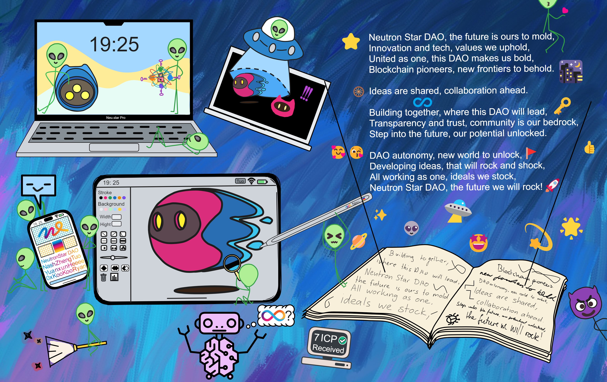

    

 

# DAO的魅力与潜力

去中心化自治组织（Decentralized Autonomous Organization ，简称 DAO）。这个名字里面有几个关键的词：“ 去中心化 ” 、“ 自治 ” 和 “ 组织 ” 。

- “ 去中心化 ” 意味着没有一个固定的 “ 中心 ” ，比如一家公司的 CEO 或者一个国家的政府。在 DAO 中，决策是由所有参与者共同做出的，而不是由一个中心权力来决定。

- “ 自治 ” 指的是自我管理。在 DAO 中，参与者们可以制定他们自己的规则，决定自己的行动，而不需要依赖外部的命令或者控制。

- “ 组织 ” 则是指一个共享目标的集体，比如公司、团队、社区等。

综合起来，DAO 可以理解为一个没有中心权力、自我管理、共享目标的集体，参与者们通过区块链技术进行决策和协作。

2008 年，比特币的诞生开启了区块链技术的历程。然而，比特币网络的功能相对有限，主要用于转账和存储价值。2013 年，Vitalik Buterin 提出了 Ethereum ，引入了智能合约的概念，使得在区块链上构建复杂的应用成为可能，从而使 DAO 的构建成为可能。

 

## DAO？一场崭新的社会实验

DAO 就是一个依赖区块链智能合约的组织。

那依赖区块链能干啥呢？比如拿公司来说，公司这种组织依赖一个金字塔形的领导层运行。你可以把 DAO 看成是一个没有老板，没有管理层，甚至没有实体办公室的公司。DAO 完全由一些有相同目标和价值观的人共同运行。这听起来可能有点乌托邦，但这正是 DAO 的基本理念。DAO 完全是虚拟的，基于区块链技术运行。

 

没有管理层，这个组织怎么运作？这就是 DAO 独特的地方，它依赖智能合约运行，也就是预先编写好的、自动执行的代码来实现管理的。DAO是一个完全透明的系统，所有的决策都基于编程语言和算法，而不是人的主观意愿。这意味着所有的规则和决策流程都是透明的，任何人都可以看到，每个成员都有一定的投票权，可以决定 DAO 的运行方向，没有人能够偷偷地改变规则或者做出私自的决定。

 

或者也可以把 DAO 想象成一个大型投票系统，决策都依赖成员的投票。

所有规则都通过智能合约写进区块链里，利用区块链的不可篡改、去中心化、自动执行的特性，实现自治。如果你不太了解区块链，不用担心，我们可以把它想象成一本公开的、不可篡改的账本。每次有人进行交易或者发生任何重要事件，这些信息就会被记录在区块链上。这就保证了透明度和公正性。

 

DAO 运行的核心是智能合约，这是一种可以自动执行的程序，当满足特定条件时，它会自动执行特定的操作。就像一个自动售货机，当你投入足够的硬币并选择你要的商品后，它会自动给你商品。

其实 DAO 就是把规则定好，然后写进电脑里，和街上的自动售货机一样。唯一独特的一点是，如果你把规则写在一台自动售货机里，那么坏人只要毁掉这台自动售货机就可以为所欲为了。但是部署在区块链上智能合约里的规则不一样，区块链是去中心化的，在世界各地有很多份备份，谁都没办法一次性毁掉全部的机器。

 

在 DAO 中，智能合约可能会用来自动进行投票、分配资金或执行其他关键决策。而这些决策的结果都是基于 DAO 成员的投票。

 

DAO 的核心思想是让组织的成员（通常是代币持有者）直接参与决策过程，而不是将决策权交给一个中心化的管理机构。

以下是 DAO 治理模型的一般工作方式：

1. **代币**：在 DAO 中，通常有一种或多种代币。这些代币可以代表投票权，也可能有其他功能，例如提供某种服务的访问权限。

2. **提案**：成员（或有时候是特定的成员）可以提出提案。这些提案可能涉及到各种问题，从调整系统参数，到更改治理规则，甚至决定组织的未来方向。

3. **投票**：一旦有人提出提案，代币持有者就可以对其进行投票。通常，每个代币代表一票，但这也取决于具体的 DAO 和其治理结构。

4. **执行**：如果提案得到了足够多的投票支持（具体的门槛取决于 DAO 的规则），那么提案就会被执行。在许多 DAO 中，这一过程是自动化的，通过智能合约来实现。

 

## 典型的DAO

MakerDAO 是建立在以太坊区块链上的一个项目，其目标是创造一个无需中介和稳定的加密货币，即 DAI 。

以下是 MakerDAO 的一些关键特性：

DAI Stablecoin System：MakerDAO 的主要产品是 DAI ，一种锚定于美元的稳定币。DAI 是通过智能合约和抵押品（其他加密货币）生成的，意在保持其价值稳定。

Decentralized Decision Making：MakerDAO 的治理结构是其核心特色。MKR 代币持有者具有投票权，可以对系统的关键参数（如稳定费率等）进行投票，从而影响 DAI 的经济机制。

Open Source and Transparent：MakerDAO 是开源的，这意味着任何人都可以查看其智能合约的代码，使其透明度得以提高。

Risk Management：由于 DAI 是由抵押品生成的，因此 MakerDAO 的稳定性和安全性取决于这些抵押品的价值。为了管理这种风险，MKR 代币持有者需要对抵押品的风险参数进行投票。

MakerDAO 的设计和执行是一个很好的 DAO 示例，它展示了 DAO 如何利用区块链技术和加密经济的力量来创建和管理去中心化金融产品。然而，与所有加密项目一样，MakerDAO 也面临着许多挑战，包括智能合约的安全性、市场的波动性以及治理的效率和公正性。

 

## DAO前方的迷雾

当然，DAO 并不是一帆风顺的。它面临着许多挑战，例如如何设计一个公平、高效的决策机制？如何防止少数人的操控？如何保护参与者的隐私和安全？如果 DAO 的决策导致了某种损害，应该由谁负责？这些都是值得我们深思的问题。

DAO 的决策过程完全基于投票，这可能会导致 “ 大多数人的暴政 ” 问题。如果一个群体的成员数量占据优势，他们可能会主导所有的决策，而少数群体的声音就会被忽视。

 

虽然智能合约可以自动执行，但它们仍然需要人类来编写和维护。如果智能合约存在错误，或者被恶意用户利用，可能会对 DAO 造成严重的影响。

2016 年，“ The DAO ” 项目的失败给人们敲响了警钟。“ The DAO ” 是第一个大规模的 DAO 项目，但由于代码漏洞，导致大量资金被盗，项目最终失败。这次事件引发了对 DAO 安全性和治理结构的深入探讨。

 

尽管面临这些挑战，但 DAO 的潜力是巨大的。它提供了一个公平、透明、高效的组织形式，可能会改变我们对公司和组织的认识。虽然现在 DAO 在全球范围内还处于初级阶段，但随着区块链技术的发展，我们可以预见，未来可能会有越来越多的 DAO 出现。我们也期待看到，DAO 如何解决它面临的挑战，如何实现其公平、透明、高效的理念，让每个人都能参与到组织的决策中来。

 

## 向前看

不可否认，DAO 是一个复杂且前沿的概念，它可能会对我们的组织方式产生深远影响。然而，就像任何新技术一样，DAO 也需要时间和努力来解决其存在的问题和挑战。

去中心化自组织的概念可能对许多人来说还很陌生，但随着技术的发展，我们可能会看到更多的 DAO 出现在我们的生活中。它可能会改变我们的工作方式，让我们的决策过程更加公开透明，更加民主。

DAO 不仅是一种技术，也是一种文化，一种哲学。它倡导的是公平、透明、去中心化的价值观。在 DAO 的世界里，每个人都有权利发言，每个人的声音都会被听到。这是一种崭新的社会形态，是对现有权力结构的挑战和颠覆。

 
