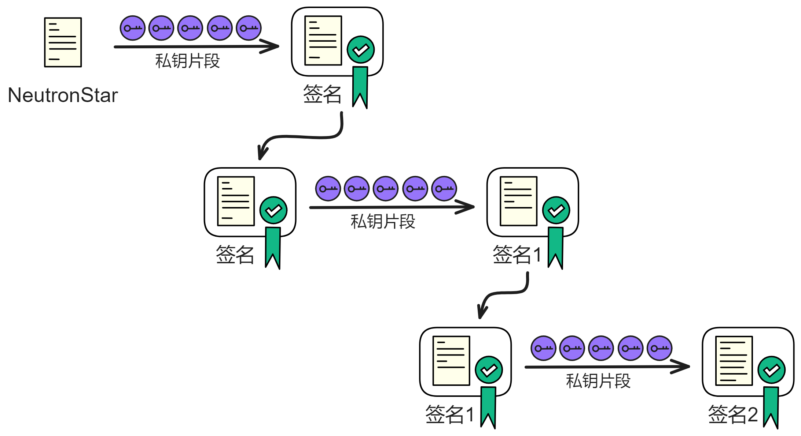
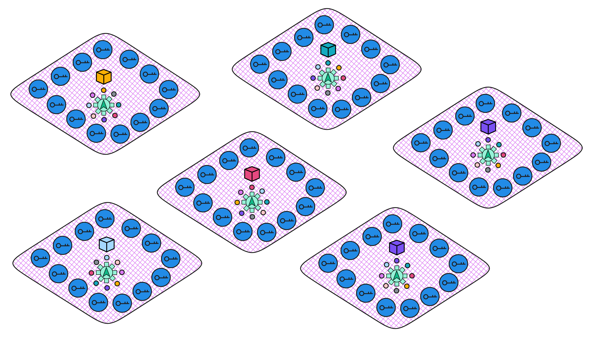

## 阈值中继 - 优雅的链上随机数方案

无论是现实生活中，还是区块链系统这种分布式系统中，我们通常会用到随机数。

而且在区块链中尤其需要随机数。

在区块链底层的共识协议中，需要随机数指定一个 leader 出块。比如以太坊的信标链。在以太坊的 PoS 共识中，每个时期（epoch）36 个 slot ，每个 slot（12 秒）出一个区块。在每一个 slot 开始时，会从验证者集合中随机选出一个验证者负责给这个 slot 出块。

在上层应用中，智能合约也需要随机数实现抽奖、摇骰子等等。

以及一些多方安全（MPC）协议的乘法运算也需要随机数源去生成数组。

 

那么如何为一组参与者提供一个可靠的随机数源，就是一个很重要的问题。

 

### 不可预测，不可偏移

在区块链系统中，首先要确保每个成员拿到的随机数是一样的。

其次还要是可靠的，也就是这个随机数是不可预测的，且不可偏移的：

* 在敌手有历史信息和本轮信息的情况下，任然无法预测未来的随机数。

    不光包含当前的随机数，恶意敌手也不能预测未来的随机数。比如敌手现在不能预测随机数，但是能通过自己的影响，预测到 3 轮以后的一个随机数，这个也是不行的。

* 不可偏移性也可以理解为破坏性。即恶意敌手是没法干扰到生成随机数的过程的。比如敌手现在动了一点手脚，控制了最后几位比特，导致破坏了原有的随机数，这就不安全了。

即不能从不同的输入中提取到任何有效信息。

 

### Threshold Relay

使用 BLS 阈值签名生成随机数的方案是很简单很实用的方案。（当然 BLS 阈值签名需要 DKG 协议，这是一个劣势，不过在 IC 上已经有 [NIDKG](../3.链钥密码学(ChainKey)/1.ChainKey.md#nidkg) 解决这个问题了，所以剩下的都很简单了 ~ ）

 

在 IC 上，有个随机信标委员会，委员会里的成员负责在每轮产生一个随机数。每过一个时期（epoch）就更换一次[委员会成员](../3.链钥密码学(ChainKey)/1.ChainKey.md#摘要块)。委员会的成员是子网里所有节点的子集。

委员会可以确保在子网的节点数量较多时性能不会下降太多。子网性能与参与共识的节点数量有关，更多的节点会导致更多通信开销和计算开销。

 

产生随机数的方法也很简单。就是对一个消息签名。

 

我们先想一下，生成一对密钥。用单个私钥对一个消息签名，**私钥和消息确定了，那么这个签名结果是唯一的**。

而且在签名出来之前，没有人知道签名是什么。

> 当然如果私钥泄露了，那么别人也能用私钥对这个消息做签名，从而提前知道签名内容。

而阈值签名没有那个唯一的私钥，所有成员都用自己的私钥片段单独计算一个签名片段。最后通过广播收集到足够的签名片段，合成签名。

所以即使是负责签名的成员也不能预知签名结果，也无法干扰到签名结果，只有聚合签名片段了才知道结果。而后面的签名需要节点们在下一轮广播出新的签名片段才能合成完整签名，获得随机数。

假设总共有 7 个成员，阈值是 5 。即使有 2 个成员拒绝签名都影响不了签名诞生。

只要签名的消息每次都不一样，签名结果就每次不一样。

 

我们就可以对上一轮的签名结果哈希一下，再做一次签名，产生一个新签名。新的签名又可以作为种子，导出随机数。再对签名哈希一下再签名 ... 

每一轮都是对之前的签名再签名，不断套娃。

生成随机数过程不可操纵、不可预测、低成本、快速、方便，很难串谋，是一个比较理想的随机数生成方案。。😎💪🚀 

这里有 2017 年关于阈值中继的 [presentation](https://dfinity.org/pdf-viewer/pdfs/viewer?file=../library/threshold-relay-blockchain-stanford.pdf) 。

 

而且大家都可以子网的公钥验证已经产生的随机数（签名）。从而达到公开可验证的不可预测的安全快速高效的随机数（buff 叠满了）。而且使用 BLS 阈值签名方案可以连续不停地输出签名，一轮又一轮，太方便啦。

 

那么在 [NIDKG](../3.链钥密码学(ChainKey)/1.ChainKey.md#nidkg) 解决密钥分发的问题之后，BLS 阈值签名便可以用来产生随机数。在[共识算法](../2.核心协议/2.共识层.md)中用这种可验证随机数，能达到跟 PoW 类似的效果，就是为了随机而又安全地抽取出块节点。共识委员会的每个成员都有机会出块。

智能合约（Canister）也可以用这个种子导出随机数。

每个子网，每个轮次，都有不同的随机数产生。

 

 

 

 

 

什么是真随机数和伪随机数呢？这两者之间有什么区别？

伪随机数是由确定的算法生成的数字序列，它们的分布和相关性可以通过统计测试来判断。但是，由于伪随机数是由算法产生的，而不是来自一个真实的随机过程，所以它们只能尽可能地模拟真正的随机性。伪随机数是可以预测和控制的，因为它们依赖于一个 “ 种子值 ” 来初始化。常见的伪随机数生成算法有线性同余法、梅森旋转法等。

而真随机数则是完全不可预测、不可重复的。真随机数通常需要依靠某种物理过程来产生，比如掷骰子、转轮、电子元件的噪声以及核裂变等。真随机数发生器的实现难度较大，效率也比较低。

另外，如果熵源信息量有限，也不一定能产生真正的随机性。熵越高，随机性越好。也就是越混乱，越随机嘛。从概率论的角度来说，真随机数可以细分为统计随机和量子随机。量子随机数受量子力学中的固有随机性影响，理论上比统计随机数更 “ 真 ” 。

> 因为传统的随机性本质上取决于对各种变量不了解，因此无法计算预测。如果我们掌握影响相关变量、有足够的算力就能计算（预测）出结果。
>
> 比如如果我们有精确到皮米级别的重力加速度、整个密闭空间的空气模型、扔硬币过程中的所有受力、硬币的质量密度材质等等，所有能影响结果的数据，以及强大的算力，就能计算出硬币的运动过程和结果。

在计算机中，Linux 内核实现了一个统计方式的真随机数发生器，它通过收集机器运行时的各种噪声来产生随机性，噪音源包括各种硬件运行时速，用户和计算机交互时速，比如击键的间隔时间、鼠标移动速度、特定中断的时间间隔和块 IO 请求的响应时间等。random number generator 就是这样一个利用大气噪声产生真随机数的例子。还有一些系统试图通过监测量子粒子的自发性来获取更真的随机数。

 

随机数生成方案衡量标准

不可预测：不可预测是针对所有参与者的，不管是生产者和消费者，都无法根据历史数据预测下一个随机数的可能值，即便是稍稍提高一点点预测的成功率都做不到，即具有马尔可夫性质。在公共随机数的方案中，还要求任何人根据任何公开信息也都不能提高预测概率，例如 Bitcoin Beacon 的方案中，即便知道区块的历史数据，矿池的公钥，待打包的交易列表等，也无法获得预测上的优势。

不可串谋：在随机数的生成过程中，部分参与方联合起来，互相交换各自的私有信息，并不能影响随机数的生成过程或改变随机数的结果，或具有其他比较优势，比如相比其他人提前获得即将生成的随机数的结果。

不可提前获知：随机数的参与方同时知晓该随机数，任何一方不能提前知道结果。

不可篡改：即随机数的生产者不能伪造一个随机数出来，而当一个随机数生成好后，该随机数无法被任何人修改。

不可选择：随机数的生产过程可能同时有很多个随机数生成，生产者无法只选择其中的某一个提供出去，或用其中一个替代另外一个。

不可隐瞒：生产者在随机数生成完成后，不能拒绝公开该随机数。即生产好的随机数一定会被公开，无法被隐藏或者撤回。

可参与：随机数的生成过程中，随机数的相关方可以容易的参与进来，随机数生成方案应该为一般人的广泛参与提供便利，降低或消除参与门槛，参与的权力不应该被剥夺。

可审计：在随机数生成过程结束后，其整体过程是可以被时候审计的。

成本：随机数的生产成本应该尽可能低。

响应速度：随机数的生成过程应该足够快。

 
