## 我的号！

2009 年一个月黑风高的晚上，一家不起眼的网吧里，空气中弥漫着香烟和泡面的气味，还混杂着急冲冲敲键盘、美滋滋吸泡面、气急败坏吐槽骂人、无力回天呼叫队友、以及兵败如山倒的绝望，噪音此起彼伏，填满了整个房间。

此时人声喧哗、电脑机器嗡嗡作响，没人注意到张三面前屏幕上的代码闪烁着神秘光芒，他手指飞速操作着键盘。忽明忽暗的屏幕照在他的脸上，看不真切，不过眼神中的狡黠若隐若现。

一条条指令顺着指尖从键盘流向机箱，又窜进网线、光缆，仿佛感应到了主人的召唤。在城市地底下奔涌，在海底潜行，在高山之间穿梭，瞬息万里，电光火石之间跨越了数千公里，穿过浩瀚的网络拓扑图，奔向目标地址。

在网线另一头，一个倒霉蛋坐在电脑前麻木地摁着鼠标。

“ 检测到您的电脑存在安全隐患，请点击这里下载安装防护程序。 ” 。

“ 咦，嗯 ” 。

而他尚不知晓一串串邪恶的字符已经逼近，正蓄势待发准备给他的电脑致命一击。千里之外的指令已经通过木马程序悄然侵入了他数字领地。带着他的账号和密码回到张三的屏幕上。

张三正宅在一个昏暗嘈杂的角落里窃喜：没错，又有一个中招的。这是今天上钩的第 7 条鱼了。

## 请输入密码

10 多年前，那时候丢失账号还有比较常见的事。无数个张三活跃在看不见的角落里击破了无数的用户账号。时过境迁，今天的网络环境比从前好了不少。

从 21 世纪初开始的信息互联网时代，我们的生活越来越依赖于网络。购物、聊天、游戏、看视频、办事，都需要通过各种网站和 App 。但随之而来的，就是登录密码的管理问题。

网民大多缺乏安全意识，那么多账号又记不住，许多人喜欢使用简单的账号密码组合。

然而，这种方式有很多缺陷。

首先，我们的大脑并不擅长记忆这么多的密码。大多数人都有许多不同的在线账户，每个账户都需要一个独特的密码，以提高安全性。然而要记住所有这些密码几乎是不可能的，这就导致很多人选择使用相同的密码，或者使用简单易记的密码。这样做虽然方便，但也大大降低了账户的安全性。

其次，即使我们设定了复杂的密码，攻击者仍可能通过各种手段窃取我们的密码。例如，他们可以通过网络钓鱼、键盘记录器或者直接破解等手段获取我们的密码。一旦攻击者获取了我们的密码，他们就可以冒充我们，进行各种恶意行为。

另外，当我们忘记密码时，必须通过电子邮件或手机短信来重置密码。而这种方式并不总是安全的，黑客可以通过窃取电子邮件或手机短信来重置密码，从而接管用户的账户。

一旦账号不翼而飞，你在网上的资料、好友、评论、活动纪录全都化为乌有。

为了解决上面的问题，许多网站开始采用二次验证方式。这通常需要用户在输入用户名和密码后，再进一步通过短信验证码、邮箱验证码等方式验证身份。这无疑增加了安全性，但也增加了使用的复杂性。

未来的网站登录，正在趋向于 “ 单一登录 ” 方向发展。理想的情况是，我们只需要一个账户，就可以登录所有网站。

微信和谷歌已经做到了这一点。他们通过手机绑定，就可以直接登录许多第三方小程序和网站。这种 “ 扫码登录 ” 的方式，安全性和便利性都比纯账号密码方式要好。

如果未来所有的网站都可以像微信谷歌那样，直接用一个账户登录就好了，那就方便多了。到时候，我们只需要记住一个密码，就可以畅通无阻地浏览全网了。但并不是所有网站都支持谷歌登录，而且随着人们越来越重视用户隐私问题，账号数据都归于某个大公司是很危险的。

我们还需要思考隐私的问题。许多网站会秘密地收集我们的个人信息，包括登录的时间、地点和设备信息。这些珍贵的数据可能被滥用，用于追踪我们的在线活动，甚至被出售给神秘的广告商或第三方公司。

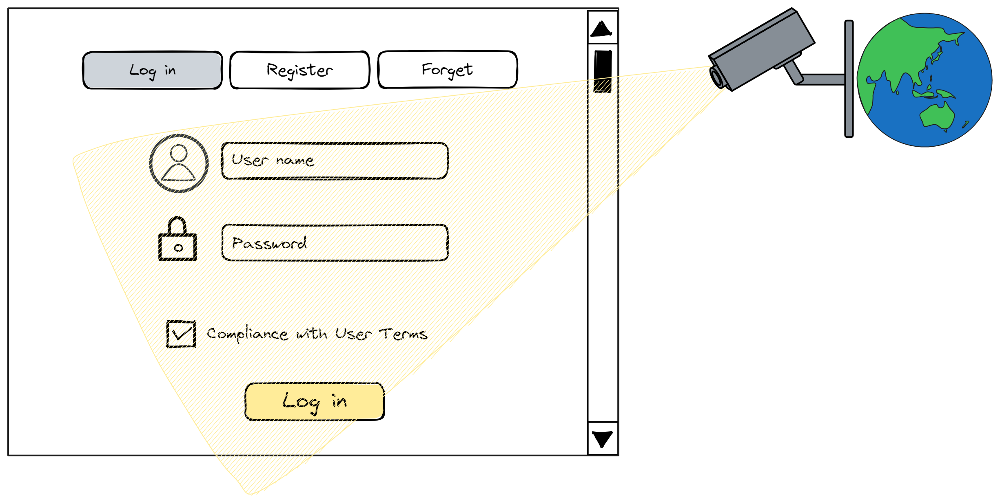

另外，人们未必意识到，账号其实并不真正属于自己，不仅有可能被遗忘或丢失，还可能被剥夺。现今的网路服务，通常须要用户以手机号或电子邮件注册。

但这两样都不真正属于用户。手机号属于电信服务商，电子邮件属于电子邮件与域名服务供应商。如果他们收回你的手机号、电子邮件、域名，你的账号就有麻烦了，若无法更改，极可能丢失。

不但账号名称不属用户，账号的法律所有权也非用户所有。

举例来说，微信账号的所有权[属于腾讯公司](https://tech.sina.com.cn/roll/2020-09-08/doc-iivhuipp3172175.shtml)。[腾讯微信软件许可及服务协议](https://weixin.qq.com/agreement?lang=zh_CN)的 7.1.2 条就明确写明：

> " 微信账号的所有权归腾讯公司所有，用户完成申请注册手续后，仅获得微信账号的使用权，且该使用权仅属于初始申请注册人。 "

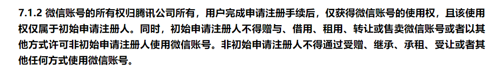

各类网络服务的账号，本质上都是服务提供商的，用户仅有使用权。因此，服务提供商可以随时单方面暂停或注销账号，这在法律上成立。用户被各平台封号，特朗普被推特禁言等，都属于这种情况。

我们需要找到新的方法来解决这个问题。这可能会使用更安全的密码管理工具，使用更先进的加密技术，或者是发展新的身份验证方法，例如基于行为的身份验证。

如果我们无法真正拥有自己的网络身份，那网上我们名下的一切也不真正属于我们。那么，有无办法使账号真正为用户所有，完全受用户掌控，不会被剥夺，永不遗失？

## 寻找更好的解决方案

答案是有的，并且已然实现。

那就是利用区块链重新做一套去中心化的互联网身份体系：

1. 用去中心化网络和区块链技术，账户和内容存储在用户自己控制的去中心化网络中，不依赖任何中心化平台。
2. 使用自主标识技术，用户可以创建和控制自己的数字标识，不依赖电话号码或邮箱。
3. 使用点对点网络，用户之间直接连接，不需要通过中心化服务器。内容分布在网络中，不依赖单一平台。
4. 加密和分布式存储用户数据，不集中存放，更难被删除。
5. 使用开源软件和协议，避免依赖商业公司的专属平台。

尽管这条路还有很多工作要做，但这些技术能为用户真正控制自己的数字生活提供了希望。我们应该继续推动其发展，争取网络权力下放给每个用户。

IC 做了一种先进、安全的去中心化身份，它叫做**互联网身份**（Internet Identity），我们喜欢叫它 “ ii ” ，可以在 IC 生态的 Dapp 上使用。登录 Dapp 时不需要输入任何密码，也不用记下复杂的私钥或者助记词，就可以轻松的控制自己的去中心化身份。

用户[使用互联网身份](https://identity.ic0.app)时，网站就收集不到关于用户在线活动的信息了。因为它会帮你在每个网站上创建和管理匿名、独立的帐户，让你可以在不用担心管理这些帐户的情况下，享受到拥有许多不同帐户的隐私保护。它不仅让你摆脱了复杂的用户名和密码管理，还能让你在使用网络服务时更加安全、更加隐私。

用户可以用设备进行面部扫描、指纹识别、Ledger 或者 [Yubikey](https://en.wikipedia.org/wiki/YubiKey) 硬件钱包，创建一个去中心化身份。用这个身份可以登录 / 注册各种 Dapp 。

用这个身份登录不同的 Dapp 会有不同的账户。也就是说，它是隔离的，身份不互通（和 ETH 不一样），这个身份在不同的 Dapp 里是完全隔离的账户。在每个 Dapp 里相当于从主身份里衍生出的一个分身，用一个 [DID](https://en.wikipedia.org/wiki/Decentralized_identifier) 身份控制所有的 Dapp 。而且你用不同设备登录都能在 Dapp 里得到同一个身份。

下面我们就来深入了解一下 ii 。

ii 是一种身份认证机制，底层原理还是私钥、公钥那些的。但是用户可以不通过私钥或助记词登录。

ii 主要有两个关键概念：委托链、DID 身份。

我们一个一个看：

## 委托链

用户的手机、电脑里有一个 TPM 可信安全芯片，可以生成一对密钥。后续公钥将会被上传到 ii 的后端 Canister 里存储下来；私钥由设备的 TPM 芯片生成并保存，任何人都拿不到（包括用户本人）。

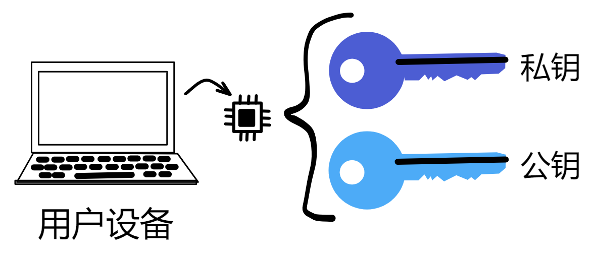

任何人想与 IC 上的智能合约交互、给 IC 发送请求，都需要对消息整体签名。而且在 IC 上，用户与 Dapp 每次交互都需要签名鉴权，而且私钥存在安全芯片里，使用这个安全芯片需要按指纹，当然不能让用户每次交互发请求都用按指纹签名。

所以 ii 使用了委托（Delegation）形成一条委托链（Delegation Chain）。给委托密钥设置过期时间，然后用委托密钥的私钥做签名。

我们可以先让浏览器生成一对临时密钥（Session key）。

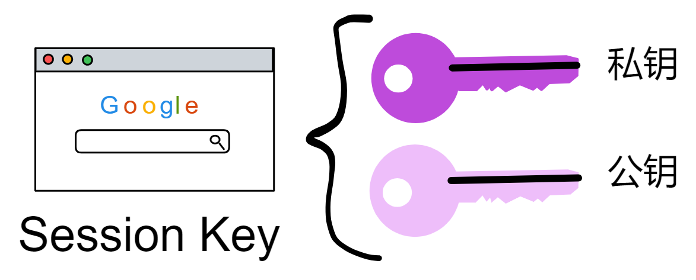

然后规定好过期时间、用户身份、第三方应用的域名等信息，让安全芯片的私钥对这些信息签名。

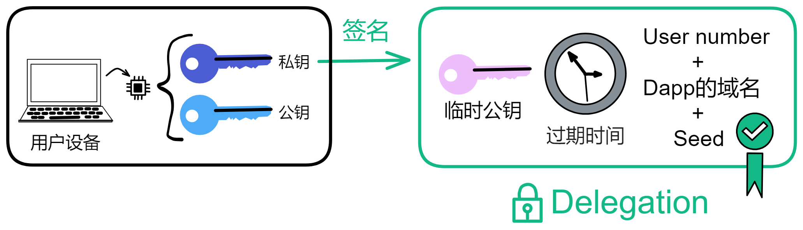

这个签名就是委托。（seed 是 ii 的 Canister 秘密生成的种子）

委托是安全芯片的私钥对一些信息的签名，表示私钥信任这些委托信息，就是委托这些信息去做一些其他的事情。

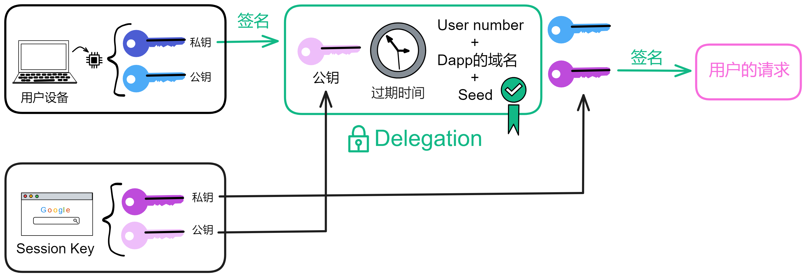

有了这个委托，就可以用浏览器的临时私钥对请求签名了。

然后我们把委托、浅蓝色的公钥、临时私钥签名的请求、浅粉色的临时公钥发出去。如下图所示。

接收方拿到**蓝色公钥**、委托、粉色私钥签名过的内容、**粉色公钥**。

用**蓝色公钥**解密签名，发现里面有**粉色公钥**，说明**蓝色私钥**对**粉色公钥**签过名。也就是可以证明蓝色私钥授过权，就像大将军拿着皇上的虎符调兵遣将一样，虎符代表皇帝授权。

但其实还没完，现在的委托并不能生效。做完上面这些工作之后，我们还得把这些内容发给 ii 的后端 Canister ，经过 Canister 认证之后才算完。

当你把那些信息发送之后，在 ii 的 Canister 内部，它会为用户登录的 Dapp 生成一串独特的身份标识：[Principal id](https://neutronstardao.github.io/constellationzh.github.io/%E8%AF%8D%E6%B1%87%E8%A1%A8.html#principal-id) ，简称 pid 。

接下来，就涉及到 ii 为用户派生身份的原理了，各位坐稳扶好咯。

## DID身份

相对于传统的中心化身份系统，DID 的主要特点和优点在于其去中心化、自主控制和隐私保护等方面。

去中心化身份（Decentralized Identity ，简称 DID ）是一种不依赖于中心化机构的数字身份识别方式。它允许个人和组织拥有和控制自己的数字身份，而不需要通过第三方机构的验证。传统的身份验证方式通常依赖于中心化的身份提供者，如政府机构、社交媒体平台或企业，这些实体掌握和管理着用户的个人信息，存在着隐私和安全风险。

DID 采用了一种完全不同的方式。它基于区块链技术，允许个人创建自己的数字身份，而无需依赖单一的中心化机构。每个 DID 都是唯一的，加密安全，用户完全掌握自己的身份数据。这意味着用户可以更好地保护自己的隐私，选择与哪些实体共享他们的身份信息，以及何时共享。与传统身份验证方法不同，DID 使用户拥有了更大的控制权和自主权。

DID 还有助于降低身份盗窃和数据泄露的风险，因为没有一个单一的中心化数据库可以成为攻击者的目标。此外，DID 的可移植性意味着用户可以在不同的在线服务之间轻松共享自己的身份信息，而无需重复创建和验证身份。

去中心化身份代表了一种更安全、更私密、更用户友好的身份验证和管理方式，有望在未来改变数字身份的格局，推动数字社会的发展。ii 就是一种按照 DID 标准构建的数字身份。讲到 ii 的身份，那就绕不开 Principal id 了。

### Principal id

Principal id（简称 pid）本质是一种标识符，可以用于标识身份和 Canister 。

比如：

当你用 ii 登录一个 Dapp 时，ii 会为你生成一个 pid 。

当你第一次使用 IC 的 SDK 时，dfx 命令行工具会为你创建默认开发者身份（和一对公钥私钥），这个开发者身份就是一个 pid 。

当你在主网上部署一个 Canister 时，NNS 系统也会分配一个 pid 给 Canister ，不过为了区分，我们更喜欢叫它 Canister id 。

ii 中用的 pid 是根据 Anchor 和 Dapp 的域名派生出来的。Anchor 就相当于用户名，在你注册 ii 时分配给你的一串数字（和 QQ 号差不多）。

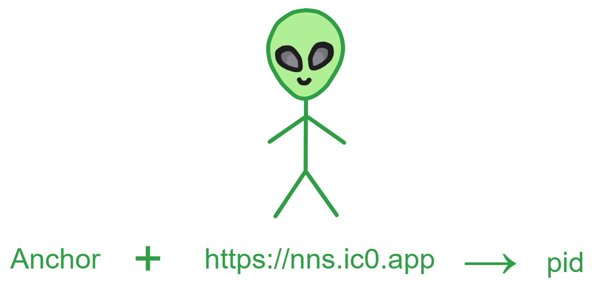

具体的计算过程是：

先计算一个种子 seed ：

- ii 的 Canister 从子网随机信标取出系统的随机种子 salt （ 32 字节）。
- 获取应用的域名、Anchor 。
- 将 **salt 的长度、salt 、Anchor 的长度、Anchor 、域名的长度、域名**拼接起来。
- 对拼接后的字符串做 SHA256 哈希，得到种子 seed 。

然后计算用户的原始 pid ：

- 将 **ii Canister id 的长度、ii 的 Canister id 和 seed** 拼接为一个字符串。

- 用 DER 编码这个字符串。

- 对 DER 编码做 SHA224 哈希，作为原始 pid 的身体。

- 最后给原始 pid 的身体末尾加上 0x02 ，构成这个用户身份的原始 pid 。

然后把原始 pid 的格式转换一下。Principal 的文本格式是这样定义的：

1. 对原始 pid 的二进制值计算 4 字节 CRC32 校验。
2. 将校验之和连接在原始 pid 值前面。
3. 对连接的结果用 Base32 编码。
4. 每 5 个字符插入一个 " `-` " 作为分隔符，分组显示。
5. 统一用小写字母显示。

举个例子，对一个原始 pid ：0xABCD01 。

1. 它的 CRC32 校验和是 0x233FF206 。
2. 连接校验和后进行 Base32 编码，结果是 em77ebvlzuaq 。
3. 每 5 个字符插入 " `-` " ，则文本格式是 em77e-bvlzu-aq 。

> 这种基于种子派生公钥的方式，提高了用户身份的匿名性和跨域名可移植性。

通过这种随机种子的手段，对于每个 Anchor 和前端域名，都可以派生出一个独立的 pid 。

同时把 ii 的 Canister id 加入计算 pid 的过程中，可以防止同一个 seed 在不同的 Canister 中对 pid 产生碰撞，提高了隔离性。

### Dapp分身

比如你的 Anchor 是 77752 ，要登录 NNS 这个 Dapp ，就要通过 77752 和 nns.ic0.app 派生单独属于 NNS 的身份，ii 的 Canister id 是不变的。

在一个 Anchor 不同的设备上登陆 Dapp，pid 身份是一样的，因为域名和 Anchor 没变。

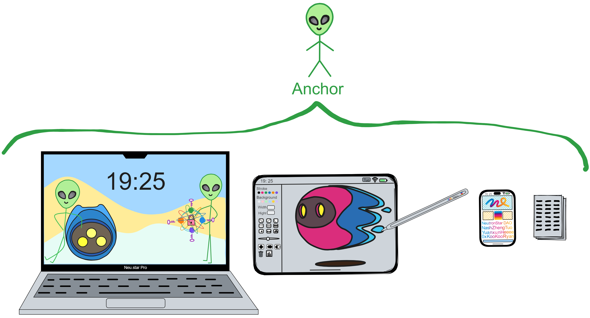

用户使用一个 Anchor 登陆不同 Dapp 时，pid 身份是不一样的，因为 Dapp 域名不一样。

**pid 本质上是用户（Anchor）登录到不同 Dapp 时的一个分身。**

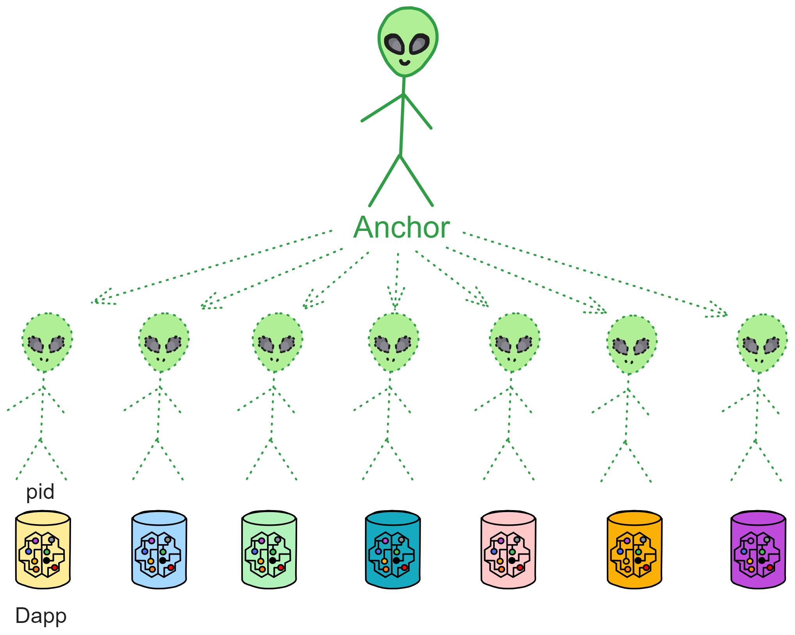

> 但有个问题，由于目前大部分 Dapp 的域名中包含 Canister id ，那么到 Canister 被删掉之后，重新部署 Canister 时，Dapp 的身份数据会发生变化。
>
> 所以为了解决这个问题，在 IC 上，Canister 被删掉之后，Canister id 依然为控制者（部署 Canister 的开发者）保留。开发者可以继续使用以前的 Canister id 部署 Canister 。

经过以上这九九八十一步，ii 的 Canister 就为你生成一个独特的 pid （分身）啦。

经过 ii 的一系列校验之后，ii 还会在委托里加入不公开的 seed ，带上 Dapp 域名、Anchor 、过期时间、临时公钥都加入委托。Canister

 会通过自己构造的公钥对这个委托签名，并且把签名保存在 ii Canister 的[认证变量]()里。

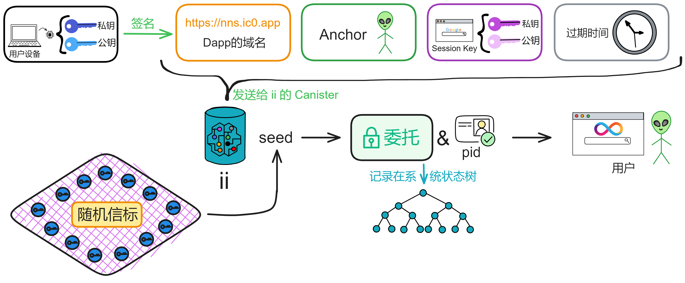

Canister 可以对消息进行签名：

* 公钥包含 Canister id 和一个种子，不同的种子可以产生该 Canister 的不同公钥。
* 签名是一个证书，里面包含了一个 hash tree 。tree 中植入了签名消息的哈希值。

验证签名时，先检查证书是否有效，证书中必须包含签名者的 Canister id 。然后检查 tree 是否合法，是否包含了根据种子和消息计算出的哈希值。

如果以上这两步检查通过，则签名有效。

通过这种方式，Canister 可以利用状态树来进行数字签名，而无需依赖外部的私钥。签名信息直接植入 Canister 的认证变量中。

这种机制的优点非常多：签名过程完全由 Canister 自身控制。每个 Canister 可以拥有多个公私钥对。而且签名信息写入系统的状态树，确保了不可篡改性。证书机制提供了高度的灵活性，验证方便快速。

签名之后返回给浏览器前端（前端一直在轮询），现在浏览器就可以拿临时私钥对请求做签名了。用户的浏览器把消息、对消息的签名、临时公钥、委托发给子网，子网就知道这临时私钥的签名是 ok 的，可以和子网交互。

客户端（无论是使用 agent-js 、agent-rs 还是任何与 IC API 通信的方式）必须在消息上签名，然后才能将其发送到 IC 上的容器。子网将会验证这个签名，并从签名中得出调用者的 pid 。所以，除非客户端拥有相同的私钥，否则客户端无法冒充其他人的委托。

不过我再插一嘴。

## 设备绑定

前面说了：*在一个 Anchor 不同的设备上登陆 Dapp，pid 身份是一样的，因为域名和 Anchor 没变。*

等等，ii 是怎么做到在不同设备之间用同一个 Anchor 登录 Dapp 的？

ii 是一种身份认证机制，ii 里没有保存用户信息，只有用户的一个 ii 身份，用户相关信息都是由 Dapp 自己保存的。

ii 的 Canister 里存的是 Anchor 以及用户的设备，Anchor 是从 10000 开始递增的。

用户在 ii 里保存的每个设备都是一个公钥，用户可以增加、删除设备，也就是用户可以管理这些公钥。所以假如用户手机丢了，相当于丢了一个公钥，只要用 Anchor 在其他设备上登录就可以删除手机这个设备了。

ii 的后端 Canister 会把用户不同的设备公钥添加进来，通过 ii 的 Anchor 对应的 Master key 绑定，这个 Master key 是 Canister 内部的。这样只要有一个设备能添加进来，就能更改 ii 里保存的设备（公钥），用户也就不用接触私钥了。

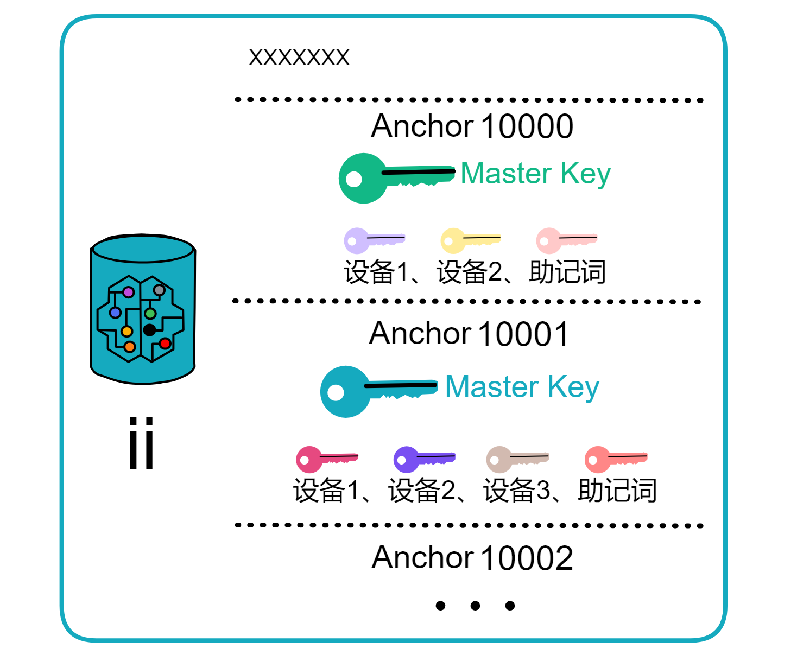

这个 Master key 可以理解为一个总的私钥，只要有设备绑定在这个总私钥上，就不用担心 ii 身份丢失。如果设备都丢了，还能靠助记词登录。助记词也丢了就完了，都丢了 😝 。

这样 ii 就达到了之前介绍效果：

用户使用一个 Anchor 登陆不同 Dapp 时，pid 身份是不一样的。

用户一个 Anchor 不同的设备上登陆 Dapp ，pid 身份是一样的。

这就是关于[互联网身份](https://identity.ic0.app)（ii）的内容了。

下面列出一些关于 ii 资源。上手开发，使用 ii ：

官方文档：https://internetcomputer.org/docs/current/samples/internet-identity-sample

官方代码示例：https://github.com/dfinity/examples/tree/master/motoko/cert-var

npm 包：https://www.npmjs.com/package/@dfinity/auth-client?activeTab=readme

Kyle 的博客，里面记录了他介绍集成 ii 登录的案例：https://kyle-peacock.com/blog/dfinity/integrating-internet-identity

集成演示：https://sdk.nnsdao.com/docs/quick-start/dfinity-progarmming-practice/#identity%E7%BB%91%E5%AE%9Awallet

