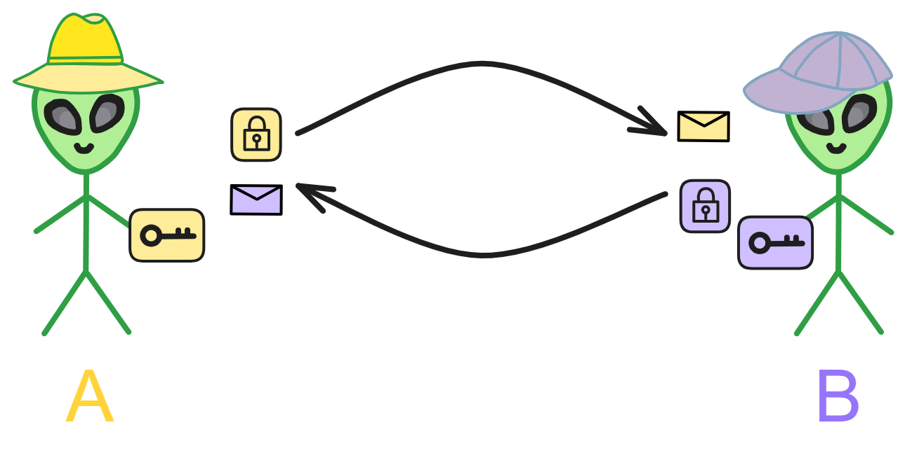
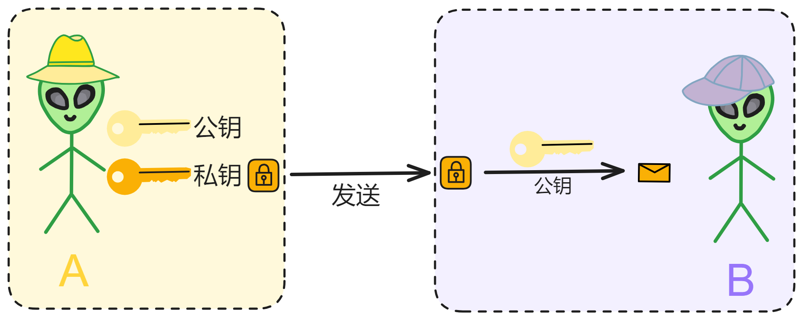
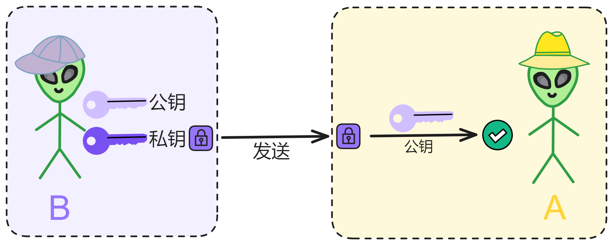
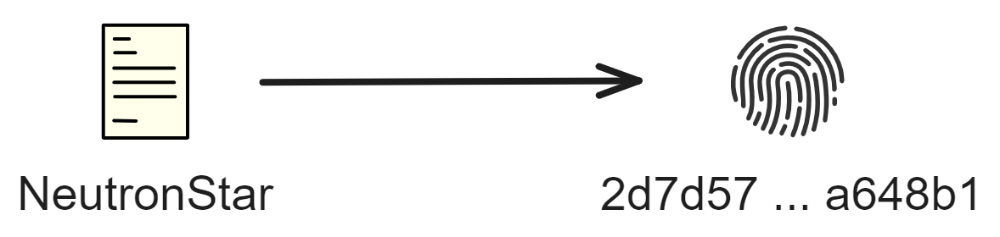
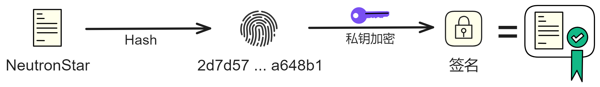
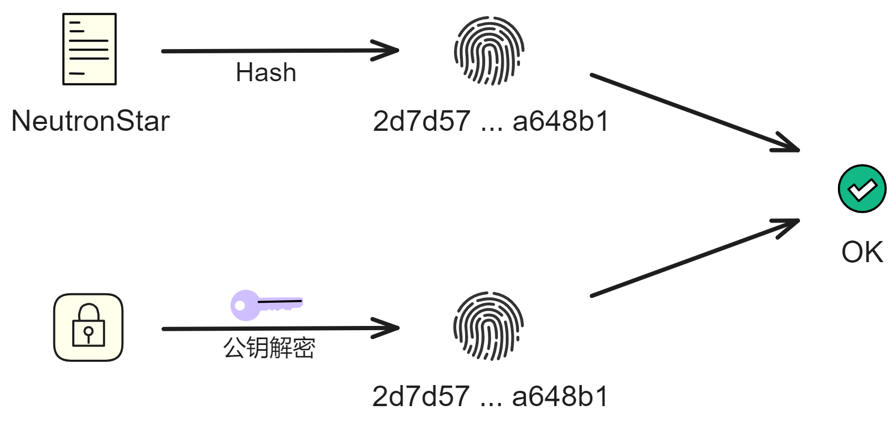
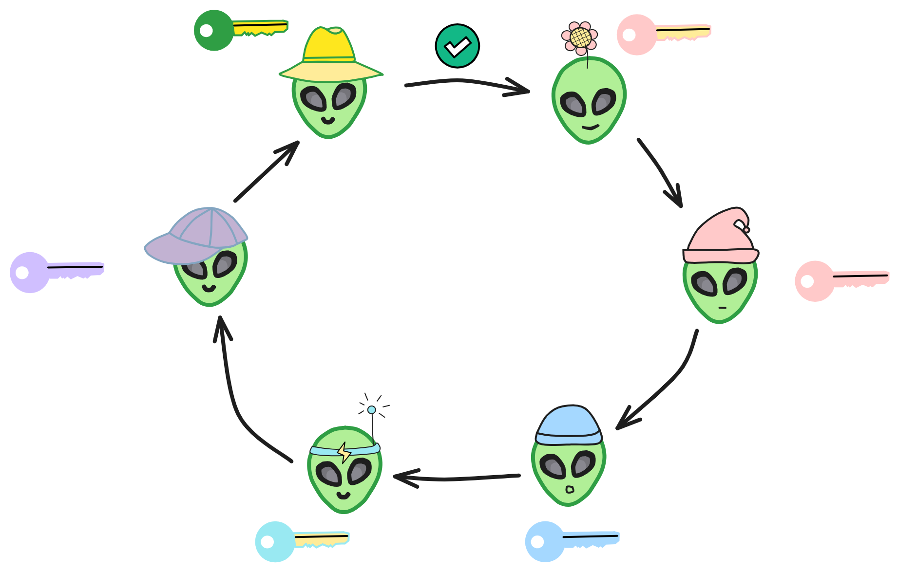

## 密码学基础

密码学是一门非常有趣也非常重要的学科。它研究的是如何对信息进行编码和解码，从而实现对信息的保密。

 

密码学起源非常早，可以追溯到几千年前。古代政府用来传递机密信息，商人用于保护交易信息，都需要用到密码。比如说，古罗马时期的恺撒密码，就是把字母向后偏移几位来实现加密。这种加密虽然简单，但在当时已经很有效了。

随着时间的推移，密码学技术也在不断进步。到了中世纪时期，就出现了一些更复杂的加密方法。而真正意义上的现代密码学，是开创于 20 世纪的。这主要得益于计算机的发展，可以支持更为复杂的算法。

密码学主要研究的是密码算法和密码分析这两方面。密码算法就是加密和解密的规则，也就是加密算法和解密算法。比较典型的有对称加密和非对称加密。

 

对称加密是最基本的加密方式，使用同一把密钥来加密和解密。像古典的恺撒密码就是一种对称加密。但对称加密的缺点是，发送方和接收方都需要知道同一把密钥，密钥的分发和保存有风险。 

所以就产生了非对称加密。非对称加密使用一对密钥，其中公钥可以公开，私钥需要保密。使用公钥加密的信息只有使用对应的私钥才能解密。这样就解决了密钥分发的问题。非对称加密是现代密码体系的基础。

 

密码分析就是破译加密信息的方法。破译方法也随着时间在发展。简单的密码可以用词频分析等破译，复杂密码就需要使用到高性能计算机暴力破解。所以现代的加密算法追求的是计算复杂度足够高，可以防止被暴力破解。量子计算机技术出现突破之后，现在的很多加密算法也就不安全了。

 

密码学在当今社会有很多重要应用，比如保护互联网通信安全、电子支付安全、保护隐私等等。它已经成为现代信息社会基础设施的重要组成部分。如果没有可靠的密码学保护，很多互联网服务都将面临严重的安全风险。

密码学作为一门学科，虽然历史悠久，但仍然非常活跃，在支撑着现代社会的各种数字活动。

 

## 对称加密

对称加密是现代密码学的起源之一，对称加密用一把密钥来加密和解密信息。它可以追溯到古代，例如凯撒密码就是一种简单的替换加密。 

通信双方按照约定的加密方法加密信息，再用对应的密钥（解密方法）解密。非常简单。

 

对称加密就像一对要通信的好朋友 A 和 B 。为了不让其他人看懂他们的信件内容，他们想了一个暗号加密信件：把字母表上的每个字母都向右移 3 个位置，a 变成 d ，b 变成 e 等等。

那么他们两个人就可以用这个规则来加密和解密对方的信件了。只要他们保密这个规则，其他人就看不懂信件里写的是什么。这个规则就是加密的密钥。

对称加密最大的优点是加密和解密使用同一个密钥，计算速度很快，可以应用于大量数据的加密。但是密钥的传递和保存就成了一个大问题。

A 和 B 不能通过公开的信件或电话告诉对方密钥，因为其他人可能窃听。所以需要使用一些复杂的协议来安全地交换这个密钥，这些协议中也会用到加密算法。

而且对称加密要求每对用户都需要一个唯一的密钥。当用户很多时，这将产生大量的密钥，用户需要安全保存这些密钥，增加了很大的负担。

 

在 20 世纪 70 年代以前，对称加密是实际应用中的主导加密方法。70 年代，非对称加密被发明出来，这是另一个重要的里程碑，它使用不同的密钥进行加密和解密。

典型的对称加密算法有 DES 、AES 等。

 

对称加密简单易用，但存在密钥分发问题。

为解决这个问题，产生了非对称加密，也称公钥加密。

## 非对称加密

典型的非对称加密算法有 RSA 、ECC 等。

 

非对称加密是每人生成 2 把密钥：一个是公钥，一个是私钥。公钥直接向外界公开密，这样就消除了传输密钥的难点，私钥自己保管。

**用公钥加密信息，私钥可以解密。反过来，私钥加密的信息，也可以用公钥解密。**

比如 A 和 B 两个人通信，公开公钥。

A 用 B 的公钥加密信息，发给 B ，B 就可以用自己的私钥解密信息了。

如果 B 用自己的私钥加密一个信息，发给 A 。A 如果能用 B 的公钥解密，就说明这个信息确实是 B 发的，不是别人伪造的。

而公钥是公开的，那么大家都可以用 B 的公钥验证 B 的信息。

也就是 B 对信息做了 “ 签名 ” （数字签名）。

数字签名又可以衍生出多种变体，比如环签名可以隐藏签名人身份，阈值签名可以分布式产生私钥，减少单点故障。如果你想一次性签署多份文件，就用聚合签名，还有基于身份的签名等等。

 

但是如果直接用私钥对一个消息加密，效率很低，计算量比较大。如果消息很大很复杂，就更不好加密了，非常耗时。

这时就很需要哈希算法了。

 

## 哈希算法

哈希算法（hash）是将输入的任意长度的内容变换为长度固定的输出，无论输入的消息有多长，计算出来的消息摘要的长度总是固定的。它主要是用于可以更快速地判断两个内容是否相同。或者检查别人发布的源文件有没有被篡改、损坏。

> 消息摘要是哈希算法的一种，但拥有额外更严格的条件，例如不能逆运算，更严格的碰撞要求等。

在使用相同的算法、编码的情况下，一个消息对应唯一的一个哈希值。而且没法通过一个哈希值计算出原消息是什么，只能由消息接收出哈希值。

**哈希算法是给一个文件生成一个独一无二的指纹。**（哈希碰撞的概率可以忽略不计了）

比如我把 `NeutronStar` 用 SHA-256 算法哈希之后得到（HEX）了这么一串：

`2d7d57c075dd0f07eaca5c61c1e2a52d9f851f2e17d495540e7165fc98a648b1` 

再把 `Neutronstar` 哈希一下：

`89096b669b06b3150db816f060ea8067a15d51f11b94c882c9cf1d9e68dab4f9` 

消息只要轻微变化一下，生成的值变化很大。

用 SHA-256 算法计算 `0` 的哈希值：

`5feceb66ffc86f38d952786c6d696c79c2dbc239dd4e91b46729d73a27fb57e9` 

我们还可以把上面这一长串结果再用 SHA-256 算法计算一次，计算 5feceb66ffc86f38d952786c6d696c79c2dbc239dd4e91b46729d73a27fb57e9 的哈希值：

`5122a1d1bc9d87662dcf5fb870adf8c55faf2ce12fad1bacac2fe7df88172466` 

就是这样[哈希](哈希算法.md)之后，都能得到一串长度相同的哈希值。

 

## 数字签名

有了哈希算法，我们再实现签名就方便多了。

只要将原文件先哈希一下，再用私钥把哈希值加密，便得到了文件的签名。

验证签名的过程也很简单，就是用签名者的公钥解密签名。并把源文件也哈希一下，对比 2 个哈希值，哈希值一样就没问题。

那如果我们用公钥解密后得到的哈希值与原文件的哈希值不一样呢？

有可能是原文件损坏或替换了，也可能是公钥被坏人替换了，或者是签名被坏人替换了。

 

通过签名可以确保三点：

* 确认信息是由签名者发送的，任何人都可以验证签名的有效性。

* 确认信息从签发到接收没有被修改过，包括传输中的中间人修改。
* 确认信息在传输过程中没有发生丢失。

* 签名是不可伪造的。任何其他人无法伪造签名。
*  签名的消息是不可改变的：经签名的消息不能被篡改。一旦签名的消息被篡改，则任何人都可以发现消息与签名之间的不一致性。
* 签名是不可抵赖的：签名者事后不能否认自己的签名。

 

传统数字签名技术实现了基本的认证功能。而在一些区块链的应用场景中，存在身份匿名、内容隐藏等特殊的隐私保护需求。

这时就需要通过群签名、环签名或盲签名等特殊的数字签名技术实现。例如，在区块链这样的弱中心化或多中心化场景中，为了实现完全化的匿名，签名者希望只需要自证其在一定的合法用户范围内，而不希望存在监管角色能够反推出签名者的身份，这时就需要采用多签技术（Multi Signature）。

 

### 多重签名

多重签名（Multi Signature）是一种很重要的签名方式。

多重签名是需要多方参与共同完成的签名。7 个人，每人一把私钥，设定阈值是 5 。也就是说至少需要 7 个人中的 5 个人签名，才能生效。

比如有一份文件需要多个部门联合签字，或者多个银行共同保管一份财产。

### 群签名

1991 年 Chaum 和 Heyst 首次提出群签名（Group Signature）的概念。某个群组内一个成员可以代表群组进行匿名签名，签名可以证明来自于该群组，却无法确定来自于群组中的哪一个成员。

群签名方案的关键是群管理员，群管理员负责添加群成员，并且在发生争议时揭示签名者身份。

在一些群签名的设计方案中，添加群成员和撤销签名匿名性的责任被分开，分别赋予群管理员和撤销管理员。

### 环签名

假如我是比特币的早期贡献者、核心开发者。

我想匿名发布一条消息（公布中本聪是谁），但是又不想完全匿名。我想向外界透露我是比特币的早期开发者中的一员，这样才有可信度。

这时候环签名（Ring Signature）就可以派上用场了。

在环签名中，我首先需要选定一个临时的公钥集合，集合中包括自己。然后我利用自己的私钥和集合中其他人的公钥，独立产生签名，而且不需要其他设置。

签名集合中的其他成员，可能并不知道自己已经被包含在最终的签名者集合中。环签名的安全属性之一是，确定使用哪个成员的密钥来生成签名在计算上不可行。

环签名类似于群签名，但有两处不同点：第一，无法撤销单个签名的匿名性；第二，任何用户组都可以用作一个群。

### 盲签名

盲签名（Blind Signature）是在 1982 年由 David Chaum 提出的，是指签名者在无法看到原始内容的前提下对消息进行签名。

一方面，盲签名可以实现对所签内容的保护，防止签名者看到原始的内容。

另一方面，盲签名可以防止追踪，签名者无法将内容和签名结果进行对应。

### 阈值签名

在 1979 年 Shamir 提出[秘密分享](秘密共享.md)技术后，Desmedt 等人在 1994 年正式提出了阈值签名的概念。

在阈值签名里，每个私钥片段只是总私钥的一部分。

每个成员使用私钥片段对信息生成一个签名片段，最终收集到足够多的签名片段之后，合成完整的签名。这个过程是在链下完成的。

在验证时只需要在链上验证一次即可。

这样可以不依赖于单个实体的签名。即使有一部分私钥片段泄露或者参与者中的某些人出现问题。只要泄露的私钥片段数量没有达到阈值，签名仍然是安全的。

但是注意，多重签名和阈值签名是不同的技术。多重签名的成员是固定的。多个参与者使用不同的私钥多次签名，每个签名之间互相独立。最终的验证是通过脚本或合约判断每个签名是否可以通过验证的，需要进行多次验证。

阈值签名用于密钥的托管、恢复、权力的分配等，也被赋予了更多特性，如动态门限、主动更新私钥、子分片可公开验证等。

近年来，阈值签名在区块链系统中逐渐被应用。阈值签名一般用于随机预言机、抗审查、共识算法和分布式伪随机数生成器。

与非对称加密中的签名机制类似，阈值签名机制也分为两部分，分别是阈值密钥生成分发和阈值密钥签名。

在进行门限密钥生成时，需要依赖分布式密钥产生（Distributed Key Generation，DKG）协议，该协议将多个参与者联合起来，生成符合一定要求的总密钥对和密钥对份额。每一个成员对应一个私钥片段，每个成员只能知道自己的私钥片段，总私钥谁都不知道。

[这里]()了解更多。

