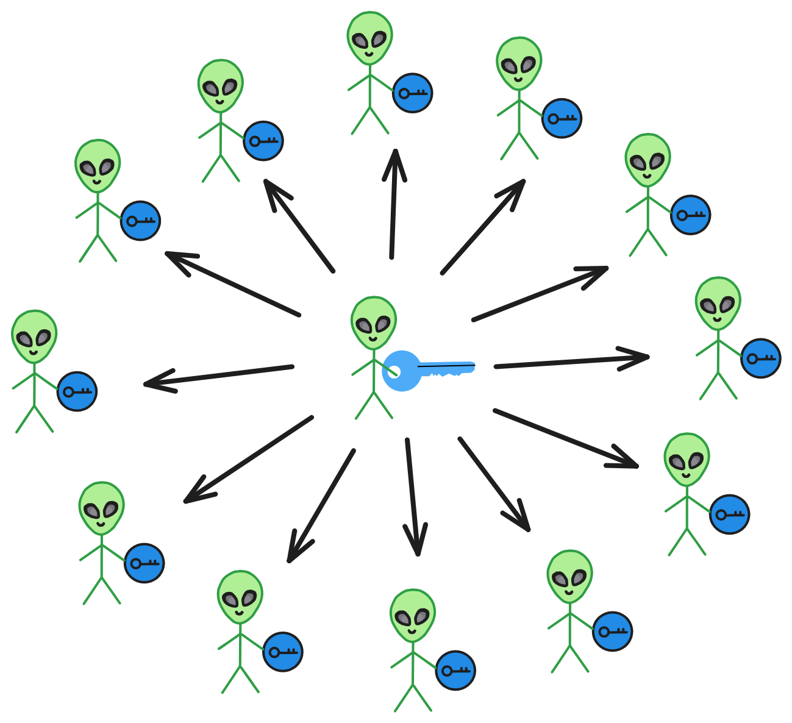

秘密共享（Secret Sharing）是密码学中的一项重要技术，它提供了一种在多个实体之间分发秘密信息的方法，从而实现对秘密的控制。

> 既能实现 t of n 模式，也能实现减少签名结果的大小，属于阈值签名的范畴。
>
> 把密钥分成共 n 份密钥片段，由 n 个成员分别保存。只要凑够其中 t 份秘密片段，就能恢复出完整的密钥，从而完成签名。

 

## 什么是秘密共享

简单来说，秘密共享就是将一个秘密分割成多个 “ 份额 ” ，然后分发给不同的实体持有。只有收集到足够数目的 “ 份额 ” 才能重构这个秘密。举例来说，我可以将一个密码分成 5 份，分别给 A 、B 、C 、D 、E  5 人持有。其中规定只有同时收集到至少 3 个人所持有的份额，才能重构这个密码。那么即使用其中 1 人或 2 人的份额是无法推导出原始密码的。这可以防止信息在单一实体的泄露。

秘密共享可以：

* 提高秘密的安全性。通过分割和分发防止单点泄露。

* 实现对秘密的访问控制。通过指定重构秘密所需的最少份额数，实现访问策略控制。

* 提高秘密的可用性。即使部分份额丢失，也可以重构秘密份额，重置密钥片段。

 

## 应用场景

秘密共享技术在许多场景中有广泛应用，比如：

* 密钥管理：可以将加密证书或密钥分成多份分发给多个证书授权机构或密钥管理节点，从而避免单点故障。

* 区块链中的多签账户：要求交易需由一定数目的节点签名认可后才生效。

* 敏感数据存储：将关键数据分成多份储存在不同云服务商处，防止单一提供商的数据泄露。

* 投票系统：将投票密钥根据门限策略分成多份，只有收集足够的投票节点才能打开计票。

* 军事领域的权限控制：不同级别的指挥需要收集对应数目的密钥份额才能启动武器系统。

实际应用中，可以根据需要选择不同的秘密共享算法，确定分发的份额数目、所需的最少重构份额数等，从而实现自定义的访问结构。

 

秘密共享作为密码学的重要分支之一，能够在保证安全的前提下实现对秘密访问的灵活控制，在当前和未来都将有广阔的应用前景。理解秘密共享的基本原理和算法思想，对于从事安全和密码学相关工作都大有裨益。

 

## 秘密共享算法

要实现秘密共享，需要相关的数学算法。最初的秘密共享算法是在 1979 年由 G. R. Blakley 和 A. Shamir 分别独立提出的。常见的秘密共享算法包括：

* Shamir 秘密共享：基于多项式插值的算法，是最常用的一种。

* Asmuth-Bloom 秘密共享：使用中国余数定理实现的共享。

* Blakley 圆几何秘密共享：基于超平面交点几何的算法。

这些算法通常依赖一些数学原理（比如多项式、向量空间等）将秘密分割成多份，并只有收集足够数目的份额才能重建这个秘密。考虑到篇幅，这里不展开讲解后 2 种算法的细节，我们重点介绍 Shamir 秘密共享。

 

## Shamir 秘密共享

Shamir 秘密共享是基于多项式插值的一种秘密共享算法，由 Adi Shamir 在 1979 年提出。

这里主要包括两个过程：拆分秘密和恢复秘密。

 

### 拆分秘密

选择一个 \\(p\\) 质数，在整数环 \\(Zp\\) 上构造一个 \\(t-1\\) 次随机多项式：

$$
f(x)\ =\ a_{0}+a_{1}x+a_{2}x^{2}+ \ ...\ +a_{t-1}x^{t-1} mod(p)
$$

\\(p\\) 是一个大素数，其中代 \\(f(0)=a_{0}=s\\) （ \\(s\\) 是秘密），且 \\( s

比如拿 \\((3,4)\\) 秘密共享举例。 \\((t, n)\\) ：t 是恢复阈值，n 是秘密分享的总数。

这里假设秘密 \\(s=2\\) ， \\(p=23\\) ，构造的 \\(f(x)\\) 是：

$$
f(x)\ =\ 2+3x+2x^{2} \mod(23)
$$

另取 \\(x_{1}=1,\ x_{2}=2,\ x_{3}=3,\ x_{4}=4\\) ，代入函数得 \\(f(1)=7,\ f(2)=16,\ f(3)=6,\ f(4)=0\\) 。拆分出 4 个秘密。

 

### 恢复秘密

因为我们是 \\((3,4)\\) 的秘密共享，所以拆分出 4 个秘密，知道其中的 3 个就能恢复出初始秘密。

这里 \\(t\\) 的取值为 \\(3\\) ，也就是恢复秘密的阈值为 \\(t\\) 。

随机选取其中 3 组数据 \\((1,7)、(3,6)、(4,0)\\) ，并使用拉格朗日插值公式进行恢复。

 

在 Shamir 秘密共享算法中，秘密 \\(s\\) 是多项式的常数项。给定了三个点，我们可以使用拉格朗日插值法来找到对应的多项式。

拉格朗日插值多项式的一般形式是：
$$
L(x) = \sum_{i=1}^{k} y_i \prod_{j=1, j\neq i}^{k} \frac{x - x_j}{x_i - x_j} \mod p
$$
其中，\\((x_{i},\ y_{i})\\) 是给定的点。

$$
L(x) = 7 \cdot \frac{(x-3)(x-4)}{(1-3)(1-4)} + 6 \cdot \frac{(x-1)(x-4)}{(3-1)(3-4)} + 0 \cdot \frac{(x-1)(x-3)}{(4-1)(4-3)} \mod 23
$$
化简后得到：

$$
f(x)\ =\ 2+3x+2x^{2} \mod(23)
$$
这与我们开始时的多项式相匹配。因此，秘密 \\(s\\) 为多项式的常数项，即 \\(s=2\\) 。所以，秘密 \\(s\\) 是 2 。

 

这就是 Shamir 秘密共享算法的核心思想，它运用了一些抽象代数与多项式插值理论的知识，来提供信息理论安全保证。由此也可见数学理论在密码学算法设计中的重要作用。

这个秘密可以是私钥，也可以扩展成其他任意信息，如加密信息，谜题答案，秘密遗嘱等。

不仅实现了多方管理，也提供了一定的容错机制，允许最多 \\(n - t\\) 份分片数据丢失。

 

不过从技术上讲，它属于单签名，因为最后还是要恢复出一个私钥签名，而不是拆分出多个私钥片段直接签名。

而后面衍生出来的阈值签名，就可以使用拆分出的私钥片段签名了。每个成员通过自己的私钥片段生成签名片段，把足够的签名片段聚合，恢复出完整签名。

阈值签名的任何过程都没有暴露完整的私钥，完整的私钥出来没有出现过。每个成员自己也只知道自己的那部分私钥片段，非常安全。

 

### 不足之处

但是！

Shamir 原始的密钥分享方案，只能拆分密钥，还存在很多问题。

首先，私钥钥分发者知晓完整的私钥，他是单点控制私钥的。会有作恶的可能，比如对一部分成员发放错误的私钥片段。

另外，私钥片段的持有者也可能提供虚假的私钥片段。

或者只给一部分人发了私钥，根本没达到阈值！

比如一共有 7 个成员，阈值是 5 ，但是只给 4 个成员发了私钥 ~ 根本没法用！所以分发私钥的完整性也需要验证。

 

基于 Shamir 密钥分享的改进机制：可验证的密钥分享（Verifiable Secret Sharing, VSS）。

关于 VSS ，我们直接讲实用的 Feldman 的 VSS 方案。尽管在 Shamir 提出密钥分享（1979）到 Feldman 的 VSS 方案提出（1987）也存在一些其他方案设计。

> VSS 概念由 Benny Chor ，Shafi Goldwasser ，Silvio Micali 等人在 1985 年首次提出 。

 

## Feldman方案 - 可验证密钥分享

Feldman 方案是一种可验证的密钥分享技术，它允许一个密钥的所有者 Alice 把这个密钥分成多个份分发给其他人，而且这些人可以验证自己得到的密钥份是否正确，但无法得到整个原始密钥。

为了使得分发的秘密碎片的数据可验证，分发私钥片段的人除了给出私钥片段外，还要提供对应的承诺 \\((c_0, c_1,... )\\) 。

 

这个方案的基本思路是：

Alice 作为私钥分发人，选择一个大素数 \\(p\\) 和一个生成元 \\(g\\) ， \\(g\\) 属于 \\(Z_{p}^{*}\\) 且为 \\(q\\) 阶元素。实际中，使用的密钥分享都是有限域上的循环群的运算，使用公共 \\(g\\) 作为生成元。

\\(q\\) 是 \\(p -1\\) 的一个大素数因子。公开 \\(p,\ q,\ g\\) 。

\\(s\\) 为随机生成的原始密钥，\\(t\\) 是阈值，\\(n\\) 是成员总数。

生成多项式：
$$
f(x)\ =\ a_{0}+a_{1}x+a_{2}x^{2}+ \ ...\ +a_{t-1}x^{t-1} mod(p)
$$
\\(a_0\\) 代表私钥，即多项式的秘密。

计算承诺（commitment）：\\(c_0=g^{a_0}, \ c_1=g^{a_1}, \ c_2=g^{a_2}, \ ..., \ c_{t-1}=g^{a_{t-1}}\\) 。

Alice 把承诺 \\((c_0,\ c_1,\ ,\ c_2...\ ,\ c_{t-1})\\) 公开给所有成员。

接下来 Alice 要把私钥 \\(s\\) 分成 \\(n\\) 份 \\(s_i\\) ，分发给 \\(n\\) 个成员。

收到 \\(s_i\\) 的成员可以用承诺验证私钥片段：计算 \\( g^{s_{i}} = {\textstyle \prod_{j=0}^{k-1}} (C_j)^{i_{j}} \mod{p} \\) 。

如果结果等式成立，就说明这一份私钥片段是正确的。由于承诺绑定了系数，如果 Alice 给出承诺不是用多项式方程真实系数，就会验证失败。

所有人都可以验证自己的私钥片段，但没人可以得到 \\(s\\) ，除非所有 \\(n\\) 个人一起合作。

 

这样 Feldman 方案实现了可验证的密钥分享，既保证了密钥的安全，也使得每个人都能验证自己得到的是正确的密钥片段。这在很多密码系统和区块链技术中都有应用。

 

## 更新秘密 - 动态秘密共享

Feldman 方案在原始 Shamir 方案基础上添加了验证环节，解决了传统秘密共享中，秘密分发者不诚实的问题。

 

不过这个方案假设的是，攻击者不能在系统的整个生命周期内，获取到足够的私钥片段。

但一个更实际的场景是，攻击者可以在不同时间段内，慢慢渗透不同的成员，逐个击破。

在秘密本身的生命周期较长时，就很容易被逐个击破，例如节点受到病毒攻击，或者泄露、遗忘私钥片段等，如果面对长时间的破坏性攻击，可验证秘密共享方案并没有一直较好的安全性。

当然可以通过变换原始私钥（秘密）缓解这个问题，但是总有一些情况需要长期保持私钥不变的（比如商业、军事机密）。

 

而动态秘密共享方案可以在不改变秘密的情况下，解决秘密共享方案在长期保存的安全性问题。

通过周期性地更换私钥片段，每次更换私钥片段后，攻击者在上一个周期获得的私钥都会失效。

这样就可以根据密钥可能受攻击的程度决定私钥片段保留周期的长短，例如如果私钥（秘密）保密级别很高，更换私钥片段的周期就要相应的时间很短，频率高。反之，更换周期就会变长。

保证在每一个周期内私钥的安全性。而且过期的私钥片段不会对最新的私钥片段产生影响。即消除上一周期内，攻击者的获取的秘密，不随着时间增加，产生累加效应。

这样，即使攻击者获取了某节点前一个时间段的私钥，它也无法在下一个时间段伪造这个节点的身份。因为该节点已经更新了自己的私钥。而攻击者已经无法获取新的私钥来进行签名。

需要注意的是，如果攻击者不仅获取了旧的私钥，并且在下一个时间段依然控制这个节点，那么它可以伪造一个新的公私钥对并广播。但由于真实节点也会广播真实的新公钥，因此网络中会出现两个冲突的公钥。这就会被其他节点检测到，并判定这个节点被入侵。此时就需要重置这个节点，并安装一个全新的操作系统与私钥。

 

有关动态秘密共享的方案已有不少，[Amir Herzberg](https://sites.google.com/site/amirherzberg/home) 在 1995 年提出的方案是很经典的一个，方案是对 Shamir 的秘密共享方案实现动态化。

感兴趣可以看[这篇论文]()。

 

传统的密钥共享方案依赖于一个中心化的可信机构来分发密钥。在这一过程中，密钥被分割成多个子密钥，分别发送给参与者。然而，这样的安排存在一个明显的弱点：可信中心可能成为攻击的目标，一旦受到破坏，系统的安全性就会受到严重威胁。

去中心化秘密共享方案应运而生，可以在没有可信中心的情况下安全有效地进行密钥共享。在这种方案中，子密钥的产生和分配由参与者共同协作完成，显著提高了整个系统的安全性。

### 去中心化秘密共享方案

自从密钥共享方案诞生以来，大量的不同环境下的密钥共享方案己经被提了出来。大部分的方案中都假设存在一个可信中心密钥分发者，负责将密钥分割成为子密钥，并且安全密钥的将子密钢发送给参与者。但是在实际环境中，可信中心往往是不存在的。所以一种新的无可信中心的密胡共享协议被提了出来以适应没有可信中心的环境。

在无可信中心的密钥共享中，子密朗的产生和分配都是由参与者本身合作完成的。在实际应用中，有可信中心的密朗共享可能存在可信中心的“权威欺骗”，并且在现实中需要成员具有较高的可信度也不是明智的假设。因此，和有可信中心的密钥共享相比，无可信中心的密钥共享安全性更高，实用性更强。

对无可信中心密钥共享研究的主要目的就是：寻找合适的方案来保证信息能够安全，有效地发布和传输。此外，无可信中心密明共享中的子密钥如何分发，是人们研究的热点问题，其发展空间还很大。因此，无可信中心密钥共享不仅存在着重要的理论价值，更在实际应用中存在着广泛的应用前景。目甜对于无可信中心的密明共享的应用主要集中在数字签名方面。对无可信中心的密明共享的加密研究并不多。下面是笔者个人提出的一种去中心化秘密共享方案。

去中心的化密钥共享方案实际上就是把密钥拆分成 n 份之后，对每一份秘密进行加密，然后将他们存储到区块链上去，这样可以解决密钥的分发存储。密钥发送到相应的节点后，该节点先对密钥做二次加密，签名，然后写到区块链上，当密钥恢复者需要恢复密钥时，它可以全网广播一条恢复密钥的信息，然后付给密钥段存储节点一定的 token ，密钥存储节点验证密钥并解密之后发送给恢复密钥的客户端。这样就可以达到去中心的秘密共享的目标。

https://learnblockchain.cn/article/1843

## (t, n) 门限的动态秘密共享方案

在 1979 年，Shamir 和 Blakley 分别提出了 (t, n) 门限秘密共享方案。这种方案允许一个秘密被分割成 n 个份额，只要收集到任意 t 个 (t≤n) 份额，就可以重构出原始的秘密。Shamir 的方案基于拉格朗日插值法，利用数学上的特性确保只有足够数量的子秘密才能解出原秘密。

动态秘密共享方案在此基础上进一步提高安全性，允许在不泄露原秘密的情况下，定期更新子秘密，使得攻击者即使获得了某一周期内的子秘密，也无法在下一周期中利用这些信息。

### （t，n）门限的动态秘密共享方案

1979 年 Shamir 和 Blakley 分别提出了一个（t，n）门限秘密共享方案，Shamir 的（t，n）门限方案是基于 Lagrange（拉格朗日）插值法来实现的，它通过构造一个 t-1 次多项式，并将需要共享的秘密作为该多项式的常数项，每个份额（子秘密）为满足该多项式的一个坐标点，由 Lagrange 插值定理可知，任意 t 个份额（子秘密）可以重构该多项式从而恢复秘密，而 t-1 个或更少的份额（子秘密）不能重构该多项式，因而得不到关于秘密的任何信息。

动态秘密共享体制的提出主要源于秘密共享方案的安全性问题。在（t，n）门限秘密共享方案中，方案的安全性是建立在攻击者不可能在秘密的生命周期内获取 t 个子秘密的前提之下的。然而实际上很难保证这一点，尤其是在秘密的生命周期较长的情况下，这一点就更难以保证。可验证秘密共享方案主要用来解决传统秘密共享方案中存在的分发者不诚实性问题和子秘密持有者的不诚实性问题，而面对敌手的破坏性攻击，可验证秘密共享方案并没有更好的安全性。

当然，对于周期上的安全性，可以通过不断更换秘密的办法得到解决，但是更换秘密并不总是可行的（比如说该秘密是一个重要文件或是一些军事、商业秘密等）。动态秘密共享方案通过在不改变秘密的情况下解决了秘密共享方案在周期上的安全性问题。动态秘密共享方案在保证秘密不变的情况下周期性地更换子秘密，从而使得每次更换子秘密时攻击者在前一个周期内所获得的信息完全失效。

这样一来，就可以根据可能受攻击程度的不同来相应地决定子秘密更换周期的长短，以保证在每一个周期内秘密的安全性。动态秘密共享还要保证过期的子秘密所包含的信息不会对未来秘密的构造产生不安全的影响。

#### 5.1 Amir Herzberg 方案

有关动态秘密共享的方案已有不少，Amir Herzberg 提出的方案是很经典的一个，方案是对 Shamir 的秘密共享方案实现动态化。

分发者 D 选择一个有限域 GF(q)（q 为大素数），为了方便说明，用 i 代替 Shamir 方案中的 xi的。在第 k 个时段，Pi 持有的子秘密用 si(k)(si 的 k 次方) 表示。

子秘密更新协议：每个时段开始时要进行子秘密更新，进入第 k 时段后，Pi 持有的子秘密要从 si(k-1) =f(k-1)（i）更新至 si(k) ，其中 f(k-1) (0) = s。整个过程如下：

更新后的子秘密显然符合门限秘密共享的要求，任意大于或等于 t 个参与者利用 Lagrange 插值法可恢复秘密。之后 Amir Herzberg 等人在他们的这篇文章中进一步提出了一个防止主动攻击的子秘密更新方案，并增加了可验证性，进一步加强了方案的安全性。

#### 5.2 Amir Herzberg 方案的改进

事实上 Amir Herzberg 的子秘密更新方案相当于 n 个参与者协商了一个常数项为零的 t-1 次多项式，事实上少于 n 个参与者也可以进行子秘密更新，步骤和原方案相同，如果参与子秘密更新的参与者少于门限值 t 时，可以对此方案进行改进，使它具有更好的灵活性和执行效率，方案描述如下： 

##### **5.2.1 AMIR HERZBERG 方案的改进分析**

这样 k（k<t）个参与者就实现了子秘密的更新，并且这个方案有很大的灵活性，在步骤（3）中，只需对 si′=si+χ·i ic 中 i 的次数进行修改，使次数大于 t-k 就可以提高门限值，如 si′=si+χ·iit-k+θ ，方案中的门限值就是 t+θ ，这相当于把储存秘密 s 的多项式变为 t+θ-1 次多项式。由于参与子秘密更新的成员只需选择一随机数，并进行简单的直和分解运算，与原方案相比执行效率很高。由于传递信息是通过安全信道，安全性可以得到保证。Amir Herzberg 的子秘密更新方案相当于 n 个参与者协商了一个常数项为零的 t-1 次多项式，给出参与子秘密更新的参与者少于门限值 t 也可以进行子秘密更新，并具有更好的灵活性和执行效率。进一步考虑，对于参与子秘密更新的人数大于或等于门限值时，即 k≥t 时，此方案仍可以更新子秘密，但是门限值却会发生变化，不太适合需要保持门限值不变的场合，没有 k<t 时方案更加灵活。

随着信息技术的发展，我们如何共享重要的信息和资料，同时保证其安全性，是一个非常重要的问题。秘密共享技术应运而生，它可以把一个秘密分割成多个 “ 子秘密 ” ，只有凑齐一定数量的子秘密才能重构原来的秘密。这为我们提供了一个分散风险的方式来保护重要信息。

早期的秘密共享方案大多需要一个可信的中心来生成和分发子秘密。但是实际应用中，可信中心不一定存在。因此，人们提出了去中心化的秘密共享方案。这类方案中，子秘密的产生和分配完全由参与者自己来完成，安全性更高。一种去中心化方案是将秘密分割加密后存储在区块链上，需要时参与者从区块链恢复自己的子秘密，最后重构原始秘密。这避免了中心节点的作用。

传统的秘密共享方案安全性依赖于攻击者无法获取足够数量的子秘密。但对于长周期秘密，这一假设可能不成立。因此，人们提出了动态秘密共享方案。它周期性更换子秘密，即使攻击者获取了过期的子秘密也无济于事。通过控制更换周期，可以应对不同威胁环境。

在子秘密重构阶段，参与者都会相互暴露自己的子秘密。这为攻击者提供了获取秘密的机会。因此，又设计了可安全重构的秘密共享方案，可以验证每个参与者子秘密的有效性，避免泄露真实秘密。

主动式秘密共享将时间划分不同阶段，每个阶段分配不同的秘密份额，以解决保存时间过长引发的安全问题。后续研究逐步完善了这一思路。

传统方案需要一个可信的中心来生成和分发子秘密。这不太符合分布式的需求。于是有人提出了无分发者秘密共享方案。

参与者联合生成一个随机秘密，然后自行生成子秘密。这避免了中心节点的作用。有的方案则需要参与者共享一个组公钥，联合解密才能获取秘密。还有方案引入了可验证的子秘密，防止参与者作弊。

无分发者秘密共享去除了传统模式中的可信分发者，参与者自主生成秘密份额。

门限签名中的 KeyGen 和 Sign 可看成是一种特殊的安全多方计算。

门限签名实现可分为：

* 基于 RSA 的门限签名机制
* 基于 ECDSA 的门限签名机制
* 基于 Schnorr 的门限签名机制
* 基于 BLS 的门限签名机制

去中心化、动态、可验证、主动更新、无分发者等都是秘密共享技术研究的前沿方向。这些技术在提高安全性的同时，也拓宽了应用场景，值得进一步研究。

我们就可以建立一个具有主动性、健壮性和可恢复性的分布式阈值秘密共享公钥密码系统的方法和系统。

主要思路是：

1. 初始化服务器，让它们形成密钥。

2. 同步服务器，使它们以离散的轮为单位操作。

3. 在每轮结束时计算更新后的密钥。这通过在通信网络上广播消息来实现。

4. 验证更新后的密钥以形成受损服务器的集合。

5. 恢复受损服务器。

关键特点是：

1. 主动性：通过周期性地重新分发和随机化秘密份额，限制攻击者获取秘密的速率。

2. 健壮性：诚实的服务器可以检测出故障服务器，服务不会中断。

3. 可恢复性：如果攻击者擦除它所损害的服务器上的所有本地信息，信息可以在服务器恢复正常协议后尽快恢复。

所以它是一个分布式的门限密码系统，在至少 (k+1) 个服务器正常和诚实的情况下可以维持服务，可以抵御攻击者同时获取 (k+1) 个服务器控制权的攻击,具有健壮性和可恢复性。

通过秘密分享、检测恢复和密钥更新三个模块的结合，最终构成了一个健壮的主动式秘密分享方案。该方案可以大大提高系统的安全性，使之可以抵御移动攻击者在多个时间段内逐步获取系统权限的持续渗透威胁。这类方案对于需要长期保存数据隐私和完整性的应用具有重要意义。

Threshold Signature Scheme (TSS) 是一种密码学原语，可用于分布式密钥生成和签名。在区块链客户端中使用 TSS 是一种新的范式，可以提供许多好处,特别是在安全性方面。从更广泛的意义上说，TSS 可以影响密钥管理系统的设计（例如加密钱包），并为DeFi用例提供本地支持。尽管如此，TSS仍然是一项新技术，所以也应考虑其风险和局限性。

在这篇文章中,我们将介绍什么是 TSS，它为区块链空间带来的潜在优势，如何在区块链客户端中实现它，它与 Shamir 密钥分享和多签方案的比较，以及使用 TSS 进行分布式密钥管理的不同方式。最后，我们将讨论风险和局限性。

为了理解 TSS，我们首先需要一些密码学的基本知识。自20世纪70年代以来，越来越多的互联网系统(如 TLS 和 PGP)采用了非对称密码学，也称为公钥密码学(PKC)。PKC 使用两把密钥：一个公钥和一个私钥。虽然公钥不是秘密，可以被公开和任何人使用，但私钥是代表系统安全的一段机密信息。

加密和数字签名是 PKC 的两大常见用途。加密和数字签名方案都依赖于三组算法。第一是公私钥对生成,第二是密文/签名的生成,第三是解密/验证过程。对于数字签名,签名算法需要私钥,它只被其所有者知晓,来产生一个唯一的签名。签名以一种方式附加到给定的消息上,使得任何持有公钥的人都能验证其真实性和正确性。

毫无疑问,区块链是一项非常强大的技术。它提供了一个共识层,用于组织和记录事件。这样一个基础设施为我们用户提供了建立去中心化经济甚至政府的潜力。令人惊讶的是,运行基本区块链所需的密码学可以仅仅基于数字签名。在区块链背景下,私钥代表身份,而签名是身份的公开声明或主张。区块链将按一定规则对语句进行排序和验证,以确保签名是不可伪造和正确的。

与区块链中使用的更经典的密码学相比,现代密码学工具箱包含一些很棒的魔术:零知识证明、同态加密和多方计算等。正如我们在过去十年看到的那样,区块链研究极大地推动了应用密码学,最近在所有这些领域都取得了突破。

在本文中,我们将关注其中一个这样的突破:高效安全阈值签名(TSS)。

多方计算(MPC)是密码学的一个分支,起源于安德鲁·Yao的开创性工作,将近40年前。在MPC中,一组不相互信任的参与方试图共同计算他们输入的函数,同时保密这些输入。

举个例子,假设一个公司的n名员工想知道谁的工资最高,但不向彼此透露实际工资。这里私人输入是工资,输出将是收入最高的员工姓名。使用MPC进行此计算,我们可以得出在整个计算过程中甚至没有透露一个工资。 MPC的两个主要特性是正确性和隐私性:

正确性:算法产生的输出是正确的(如预期的那样)。

隐私性:参与方持有的秘密输入数据不会泄露给其他参与方。

我们将使用MPC以分布式方式计算数字签名。让我们看看上述属性如何应用于签名。回想一下,对于签名,我们有三个步骤:

密钥生成:第一步也是最复杂的一步。我们需要生成一个公钥,它将用于验证未来的签名。但我们还需要为每个参与方生成一个单独的秘密,我们将其称为秘密份额。在正确性和隐私方面,我们说该函数将为所有参与方输出相同的公钥,并为每个参与方输出不同的秘密份额,以便:(1)隐私性:秘密份额数据不会在参与方之间泄露,和(2)正确性:公钥是秘密份额的函数。

签名:这一步涉及签名生成函数。每个参与方的输入将是在前一步(分布式密钥生成)中创建的其秘密份额。还有一个为所有参与方所知的公共输入,即要签名的消息。输出将是一个数字签名,隐私属性确保计算过程中没有泄露秘密份额。

验证:验证算法与经典设置中的算法相同。为了与单密钥签名兼容,拥有公钥知识的每个人都应能验证和验证签名。这正是区块链验证节点所做的。

我们称将分布式密钥生成(DKG)与分布式签名组合起来的方案为阈值签名方案(TSS)。

TSS 可自然地用于区块链中,方法是改变区块链客户端以使用 TSS 生成密钥和签名。这里,我们使用区块链客户端一词是指完整节点执行的命令集。实际上,TSS 技术允许我们用分布式计算替换所有与私钥相关的命令。

为了更详细地解释,我们简要描述一下在经典区块链设计中如何创建新的地址。简单来说,我们可以通过生成私钥,然后从私钥计算公钥来创建新地址。最后,区块链地址从公钥派生出来。

现在,使用 TSS,我们将有 n 个参与方共同计算公钥,每个参与方持有私钥的一个秘密份额(单独的份额不会透露给其他参与方)。我们可以用与传统系统相同的方式从公钥派生地址,使区块链对地址的生成方式无知。优点是私钥不再是单点故障,因为每个参与方只持有其中一部分。

对交易进行签名时也可以做同样的操作。在这种情况下,不是单个参与方用其私钥签名,而是在多个参与方之间运行分布式签名生成。因此,只要足够多的参与方行事诚实,每个参与方都可以产生有效签名。同样,我们从本地计算(单点故障)转向了交互计算。

重要的是要提到，分布式密钥生成可以以一种允许不同类型的访问结构的方式完成:一般的“t 个中的 n 个”设置将能够承受高达 t 个任意故障的私钥相关操作,而不会危及安全性。

TSS 与多签之间的主要区别在于，多签是区块链特定的,需要为每个区块链重新实现,在某些情况下,可能根本不支持。相反,TSS 完全依赖密码学,所以支持总是可能的。这里有一篇很好的文章，用图示说明了两者之间的区别。

TSS 与 Shamir 密钥分享方案的另一个区别在于，在 TSS 中，在其整个生命周期中,私钥从未出现在单一位置。

基于 TSS 的钱包与传统加密货币钱包有所不同。通常,传统钱包会生成一个种子短语,并使用它确定性地派生地址。用户可以稍后使用这种分层确定性(HD)结构来获取与钱包地址对应的私钥并对交易进行签名，以及使用种子短语恢复所有钱包密钥。

在阈值钱包中，事情更复杂。尽管可以生成 HD 结构，但其生成必须以分布式方式计算，作为另一个 MPC 协议。在 TSS 中，参与方需要共同决定使用下一个密钥。换句话说，每个参与方都会有自己的种子短语。种子短语是分别生成的，永远不会合并，所以单独的一方无法从其种子推导出私钥。

基于 TSS 的钱包还有一个很好的安全功能，即启用私钥轮换而不改变对应的公钥和区块链地址。私钥轮换，也称为主动密钥分享，是另一个 MPC 协议，它以密钥份额为输入，并输出一组新的密钥份额。旧的密钥份额可以被删除，新的份额可以以相同的方式使用。

这样的结构为安全性添加了时间维度，这意味着攻击者必须同时处于多个位置才能攻击阈值钱包。在轮换之前和之后组合密钥份额对攻击者而言没有任何额外好处，如果他们想伪造签名的话。

这种类型钱包的一个缺点是缺乏种子短语使其与单密钥钱包系统不兼容。因此，选择谁持有密钥份额非常重要。

有几种可能的架构：

外包 TSS：用户将让 “ n ” 个服务器代表他们运行计算。有效地将密钥生成、管理和签名外包给服务提供商,他们不是资产的所有者,但提供一定的安全层面以换取一些激励。

使用多个设备：用户将在他们拥有的设备之间运行 TSS。例如,一方将是某些 IoT 设备，另一方将是用户的手机,还有一方是他们的笔记本电脑，等等。

混合：TSS 将运行一些由外部服务提供商控制的参与方,同时一些参与方运行在用户拥有的设备上。

第一种方法将复杂的 TSS 计算负载转移出用户客户端。另一方面，服务提供商可能会勾结（我们假设在同一时间不会被攻击足够多的提供商，但在实践中，他们可能会）并窃取用户的资产。

第二种方法给用户充分的控制权，但进行交易很麻烦，因为需要多个设备联机并参与 TSS 计算。

第三种选择被认为是两全其美的，因为它为用户提供了轻松快捷的交易方式，而无需放弃在没有用户授权的情况下进行交易。

多年来，研究人员已经找到了许多数字签名的用途，其中一些出人意料的非常微妙。正如上面所述，TSS 是一种密码学原语,可以极大地提高安全性。在区块链方面，我们可以说许多功能性可以被基于 TSS 的密码学所取代。去中心化应用、第 2 层扩展解决方案、原子交换、混合、继承等都可以建立在 TSS 框架之上。这最终将允许使用更便宜、更可靠的替代方案取代昂贵和风险较大的智能合约操作。

举几个具体的例子：Multi-Hop Locks 巧妙地使用两方签名，可以作为比特币闪电网络更安全、更私密的支付通道网络的替代方案。ShareLock 可能是以太坊上基于验证单个阈值签名的最便宜的链上混合解决方案。

尽管 TSS 有巨大的潜力改变我们使用区块链的方式，作为一项相对较新的技术，它仍然存在一些局限性和问题。与经典公钥加密相比，TSS 协议可以非常复杂，且尚未经过 “ 实战测试 ” 。通常，TSS 需要比简单数字签名更弱的额外密码假设。结果是出现了传统设置中不存在的密码攻击向量。

总之，TSS 是一种迷人的密码原语,有可能显着改变我们使用区块链的方式。它为区块链空间带来安全性方面的好处，但作为一项新技术，其风险和局限性也应该考虑在内。

【密码学08｜分布式密码学】 https://www.bilibili.com/video/BV1484y1K78q

很多密码学应用要求一个可信的权威持有秘钥。这种系统存在单点故障和秘钥托管的问题。分布式秘钥产生 DKG（distributed key generation）通过多方参与，计算共享的公钥与私钥集，解决上述问题， 分布式秘钥产生不依赖任何可信的第三方。在 (n,t)-DKG 中， n 为节点数量，t 为阈值， DKG协议允许 n 个节点共同产生秘钥，使得任何数量大于阈值t的节点子集都能使用该共享秘钥，然而任何数量少于阈值 t 的节点子集都没有对该共享秘钥的任何知识。

可验证秘密共享

可验证秘钥共享 (verifiable secret sharing， 简称 VSS) 是 DKG 的基本构造块，VSS 的概念被 Shamir 和 Blakley 引入。

(n,t+δ, t) -秘密共享：对整数 n, t ,δ 满足 n>=t+δ>t>=0 ，一个(n,t+δ, t) 秘密共享协议是被用于一个交易方（dealer） 在 n 个节点之间共享一个秘钥，使得其中任何 t+δ 或者更多的节点能够计算密钥s, 但是t个或更少的节点没有关于s的任何信息。

δ=1 的秘密共享被称之为阈值秘密共享(threshold secret sharing) ，记为（n,t)-秘密共享。

在一些秘密共享应用中，客户端需要验证持续的交易（deal）来避免交易方（dealer）的恶意行为。一种拥有这种可验证性保证的模式被称之为可验证秘密共享（verifiable secret sharing) VSS 。

一个可验证秘密共享 (n,t)-VSS 模式有两个阶段（phase）组成。共享阶段和重建阶段
