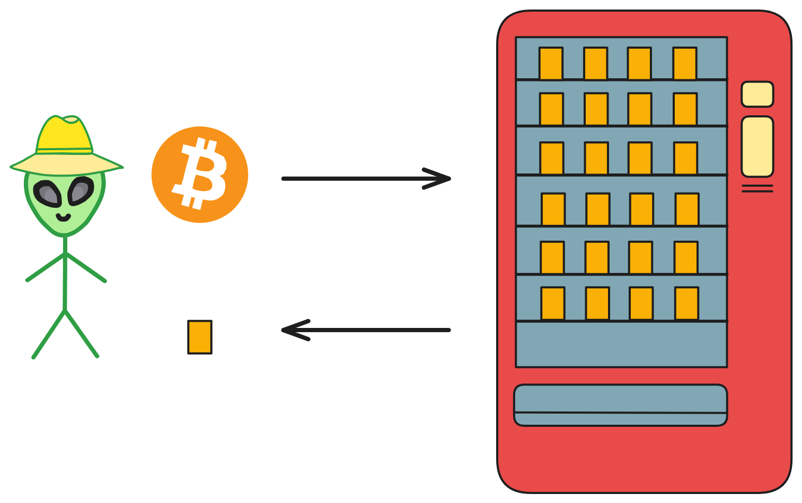
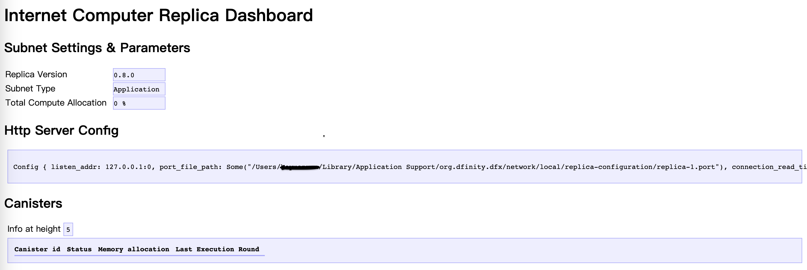
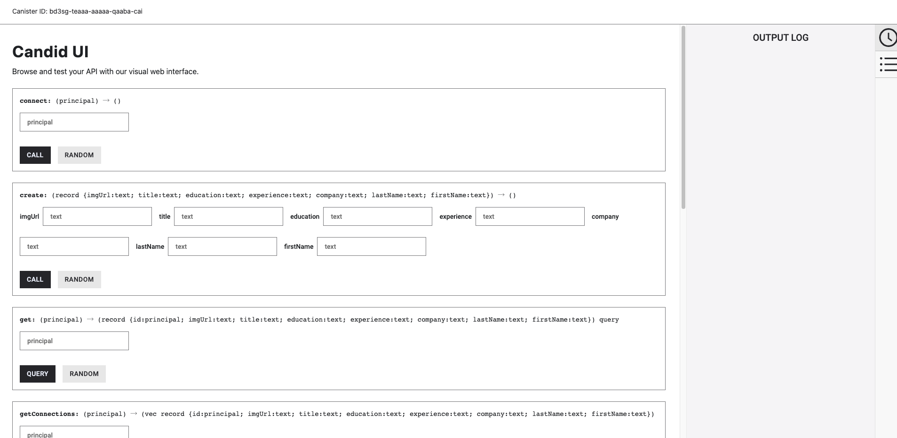
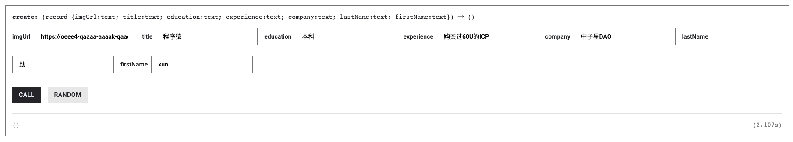
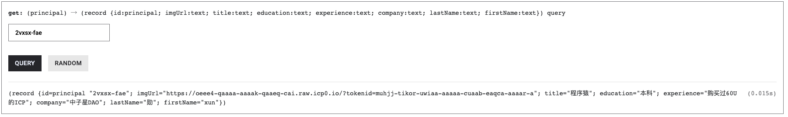

## DApp开发快速入门

互联网计算机（Internet Computer ，简称 IC ）是由 DFINITY 基金会推出的一个公共区块链平台，旨在扩展区块链的功能，使其能够托管网站与后端软件。

IC 通过创新的协议和先进的技术，提供了无与伦比的速度、存储效率和直接在链上部署网站的能力。

它的核心特点是：

- **去中心化**：IC 是去中心化的云服务系统，可靠、没有单点故障。
- **可扩展性**：IC 的结构允许它在保持高性能的同时，有无限扩容的能力。
- **互操作性**：IC 上的不同应用可以无缝交互，提供了更流畅的用户体验。
- **成本效率**：IC 提供了低成本的计算资源，比其他区块链和传统云服务便宜。

<br>

## DApp

DApp（Decentralized Application）去中心化应用。DApp 是一种运行在区块链网络上的应用程序。DApp 与传统的中心化应用不同，它不受任何个体的控制，而且内部数据是不可篡改的。

DApp 的去中心化特性得益于区块链技术的应用。区块链是一个由多个节点组成的分布式数据库，每个节点都保存有完整的数据副本，区块链通过共识算法确保数据的一致性。

智能合约就像一台自动售货机，而且是不需要信任任何第三方：部署自动售货机的人、机器提供商、城管等等。不受任何人（单一实体）管制的自动售货机！



在 IC 上开发一个 DApp 非常容易：只要有一个前端 Canister 和几个后端 Canister 即可。

1. **智能合约开发（后端）：** 运行在区块链上的自动执行合约，定义了 DApp 的核心业务逻辑。
2. **用户界面（前端）：** 用户与 DApp 进行交互的界面，可以是网页、移动应用或其他形式。

合约是由 Motoko 语言或 Rust 语言编写，编译为 Wasm 字节码后部署在 Canister 中运行。

<br>

## 在IC上开发DApp

### 准备工作

在开始之前，我们需要具备一些基础的知识和工具：

- **安装必要的软件**：包括 DFINITY Canister SDK（dfx），这是 IC 的命令行工具。如果你还没有安装，先看[这里](安装开发环境)安装。
- **选择编程语言**：主要使用 Motoko（专门为 IC 设计的语言）和 Rust ，还支持多种编程语言：[Python](https://demergent-labs.github.io/kybra) 、[TS](https://demergent-labs.github.io/azle) 、[C++](https://docs.icpp.world) 。

<br>

### 考虑的最佳实践

- **代码安全**：始终确保智能合约代码是安全的。
- **用户体验**：设计直观且响应迅速的用户界面。
- **合约升级**：计划好如何更新和升级智能合约。
- **资源优化**：优化合约以减少资源消耗和成本。

<br>

### 实战剖析

我们用一个 Web3 版的 LinkedIn（领英）demo 入手，剖析代码并尝试增加新功能。

LinkedUp 的[源代码](https://github.com/dfinity/linkedup)位于 DFINITY 官方仓库，现在我们先试着理解代码（这里我们暂时忽略前端部分）。

我们要构建的是一个社交网络，那么主要的**需求**就是：

* 用户能够创建自己的主页。
* 用户能修改自己的个人主页。
* 用户能查看别人的主页信息。
* 用户之间可以互相关注建立联系。

<br>

我们先看项目根目录下的 `dfx.json` 文件。

`dfx.json` 文件是整个项目的基础配置文件，从这个文件里我们可以看到项目里有哪些 Canister 、这些 Canister 在哪个目录里、dfx 版本等信息。

项目包含三个 Canister ： Connectd 、Linkedup 和 Linkedup_assets 。

Linkedup_assets 是用来放前端代码的 Canister ，我们暂时忽略它；先看其余两个后端的 Canister 。

```json
{
  "canisters": {
    "connectd": {
      "main": "src/connectd/main.mo"
    },
    "linkedup": {
      "main": "src/linkedup/main.mo"
    },
    "linkedup_assets": {
      "dependencies": ["linkedup"],
      "frontend": {
        "entrypoint": "src/linkedup/public/main.js"
      },
      "type": "assets",
      "source": [
        "src/linkedup/public",
        "dist/linkedup_assets"
      ]
    }
  },
  "defaults": {
    "build": {
      "packtool": ""
    }
  },
  "networks": {
    "tungsten": {
      "providers": ["https://gw.dfinity.network"],
      "type": "persistent"
    },
    "local": {
      "bind": "0.0.0.0:8000",
      "type": "ephemeral"
    }
  },
  "dfx": "0.6.22"
}
```


#### 项目后端结构：

* Linkedup Canister 主要负责业务逻辑，例如创建个人主页、修改个人主页资料等。它也提供了调用 Connectd Canister 的 API 接口，这样的话前端只需要和 Linkedup 交互即可。

* Connectd Canister 主要负责建立用户间的关系，提供给 Linkedup Canister 调用。

<br>

#### Connectd Canister


我们先仔细剖析下 Connectd Canister 的代码：
```json
├── connectd
│   ├── digraph.mo
│   ├── main.mo
│   └── types.mo
```
Connectd  Canister 下面有三个 motoko 文件：

`main.mo` 是 Connectd Canister 的主要代码文件，在这个文件中定义了 `actor` 。

`types.mo` 是 Connectd Canister 的自定义类型模块文件，被引入 `main.mo` 中使用。

`digraph.mo` 是 Connectd Canister 的模块文件，它定义了一个公共类，`main.mo` 可以实例化这个类，使用其 API ，主要用来处理关系的数据。

了解了框架后我们来深入代码一行行的剖析。

<br>

`types.mo` 定义了一些自定义类型：

```js
// 引入Principal库，用于定义身份，mo:base是motoko的基本库
import Principal "mo:base/Principal";

// 定义一个模块
module { 
  // 定义一个公共的"顶点"类型，其本质是Principal类型
  public type Vertex = Principal;
};

```

<br>

`digraph.mo` 是一个模块文件，它主要实现了一个简单的有向图数据结构，提供了添加顶点、添加边和查询邻接顶点的基本功能。这样的实现能够轻松地构建和操作有向图。

这段代码定义了一个 “ 用户关系图 ”（Digraph）的类，用于表示用户之间的关系。这个关系图是有向图，其中用户被视为图的顶点，用户之间的关系则被视为图的有向边。

```js
import Array "mo:base/Array"; // 引入Array库
import Iter "mo:base/Iter"; // 引入Iter库
import Types "./types"; // 引入自定义类型模块

// 定义模块
module {
  // 定义一个类型Vertex
  // 它来自于引入的types模块中的Vertex类型
  // 这个Vertex类型用于表示图中的顶点
  type Vertex = Types.Vertex;

  // 定义“用户关系图”公共类，这个类表示有向图
  // 在这里我们将“用户”比作一个图的一个”点“，将用户间的”关系“比作图的一条”边“
  public class Digraph() {

    // 类中包含两个属性，vertexList用于存储顶点，edgeList用于存储有向边
    var vertexList: [Vertex] = []; // 定义顶点(用户点)数组
    var edgeList: [(Vertex, Vertex)] = []; // 定义边(用户关系)数组，数组元素的类型是一个元组(from, to)

    // 定义一个公共函数，这个函数可以在图中添加一个顶点
    // 通过调用Array.append将新顶点添加到vertexList中
    public func addVertex(vertex: Vertex) { // 函数参数名称为vertex，类型为Vertex；没有返回值
      // 在motoko中，var为可变值，可变值的再赋值需要用 ":="
      vertexList := Array.append<Vertex>(vertexList, [vertex]);
    };

    // 定义新增一条边的公共函数
    public func addEdge(fromVertex: Vertex, toVertex: Vertex) {
      // 通过调用Array.append将新边添加到edgeList中
      edgeList := Array.append<(Vertex, Vertex)>(edgeList, [(fromVertex, toVertex)]);
    };

    // 这个函数用于查询某个顶点的邻接顶点
    // 通过遍历edgeList，找到与输入顶点相关的边，并将对应的邻接顶点添加到adjacencyList中
    // 也就是查询用户的关系：谁关注了我，我关注了谁
    public func getAdjacent(vertex: Vertex): [Vertex] { 
      var adjacencyList: [Vertex] = [];
      for ((fromVertex, toVertex) in Iter.fromArray<(Vertex, Vertex)>(edgeList)) {
        if (fromVertex == vertex) {
          adjacencyList := Array.append<Vertex>(adjacencyList, [toVertex]);
        };
      };
      adjacencyList
    };

  };
};
```

<br>

`main.mo` 用于管理用户之间的连接关系。

主要定义了可供外部调用的 API 接口，图的相关操作是实例化图公共类后调用相关函数。

这有助于组织和查询用户之间的关联关系，适用于社交网络、关系图等场景。

```js
import Digraph "./digraph"; // 引入用户图模块
import Types "./types"; // 引入自定义类型模块

// 定义名称为Connectd的actor
actor Connectd {
  // 定义“点”类型
  type Vertex = Types.Vertex;

  // 实例化用户图模块的图公共类
  var graph: Digraph.Digraph = Digraph.Digraph();
    
  // 检查 Canister 是否正常运行
  public func healthcheck(): async Bool { true };

  // 用户A建立与用户B的关系，供外部调用的函数是async异步的
  public func connect(userA: Vertex, userB: Vertex): async () {
    graph.addEdge(userA, userB);
  };

  // 获取一个用户的关系（用户点的邻边）
  public func getConnections(user: Vertex): async [Vertex] {
    graph.getAdjacent(user)
  };

};
```


#### Linkedup Canister

了解完 Connectd Canister 后我们再来看 Linkedup Canister ，我们需要记住，Connectd Canister 是为 Linkedup Canister “ 服务 ” 的。

同样的，我们看一下 Linkedup Canister 代码的目录结构：
```json
linkedup
    ├── database.mo
    ├── main.mo
    ├── types.mo
    └── utils.mo
```
Linkedup Canister 同样有 `main.mo` 和 `type.mo` ，`main.mo` 是负责主要业务逻辑的，`types.mo` 负责新类型的定义。

而新增的 `utils.mo` 模块主要有常用的实用函数。

`database.mo` 则与上文的 `digraph.mo` 类似，其定义了一个简易的数据库模块，主要用于处理业务逻辑所涉及的数据结构和相应处理函数

我们接着深入代码。

`types.mo` 定义了 `UserId、NewProfile、Profile` 三个类型：

```js
import Principal "mo:base/Principal";

module {
  public type UserId = Principal;

  public type NewProfile = {
    firstName: Text; // Text为文本类型
    lastName: Text;
    title: Text;
    company: Text;
    experience: Text;
    education: Text;
    imgUrl: Text;
  };

  public type Profile = {
    id: UserId;
    firstName: Text;
    lastName: Text;
    title: Text;
    company: Text;
    experience: Text;
    education: Text;
    imgUrl: Text;
  };
};
```


`database.mo` 模块实现了一个简单的用户目录系统。它定义了名为目录的公共类，公共类中定义了一个 Key 为 `UserId` 、value 为 `Profile` 的 `hashmap` ，用于存储和查询用户的个人资料：

```js
import Array "mo:base/Array";
import HashMap "mo:base/HashMap";
import Iter "mo:base/Iter";
import Option "mo:base/Option";
import Principal "mo:base/Principal";
import Types "./types";

module {
  // 这里定义了三个自定义类型
  // 这些类型主要用于表示用户的个人资料以及用户ID
  type NewProfile = Types.NewProfile;
  type Profile = Types.Profile;
  type UserId = Types.UserId;

  // 这个类代表用户目录，用于存储和查询用户的个人资料
  public class Directory() {
    // The "database" is just a local hash map
    // Directory 类内部包含一个 HashMap 对象，用于实际存储用户个人资料
    // 这个 hashMap 的键是用户ID，值是用户的个人资料
    let hashMap = HashMap.HashMap<UserId, Profile>(1, isEq, Principal.hash);

    // 用于新增一个用户的个人资料，通过调用 hashMap.put 将新的个人资料放入HashMap中
    public func createOne(userId: UserId, profile: NewProfile) {
      hashMap.put(userId, makeProfile(userId, profile));
    };

    // 更新某个用户的个人资料
    public func updateOne(userId: UserId, profile: Profile) {
      hashMap.put(userId, profile);
    };
     
    // 查询某个用户的个人资料
    // 返回值为?Profile，表示返回值是Option的，如果没有查询到结果则返回null
    public func findOne(userId: UserId): ?Profile {
      hashMap.get(userId)
    };

    // 查询一组用户的个人资料
    public func findMany(userIds: [UserId]): [Profile] {
      func getProfile(userId: UserId): Profile {
        Option.unwrap<Profile>(hashMap.get(userId))
      };
      Array.map<UserId, Profile>(userIds, getProfile)
    };

    // 根据名字查询用户个人资料
    public func findBy(term: Text): [Profile] {
      var profiles: [Profile] = [];
      for ((id, profile) in hashMap.entries()) {
        // 字符串拼接
        let fullName = profile.firstName # " " # profile.lastName;
        if (includesText(fullName, term)) {
          profiles := Array.append<Profile>(profiles, [profile]);
        };
      };
      profiles
    };

    // Helpers
    // 用UserId和NewProfile生成Profile类型实例，New一个新对象
    func makeProfile(userId: UserId, profile: NewProfile): Profile {
      {
        id = userId;
        firstName = profile.firstName;
        lastName = profile.lastName;
        title = profile.title;
        company = profile.company;
        experience = profile.experience;
        education = profile.education;
        imgUrl = profile.imgUrl;
      }
    };

    // 用于判断一个字符串是否包含另一个字符串，实现了简单的字符串匹配逻辑
    func includesText(string: Text, term: Text): Bool {
      let stringArray = Iter.toArray<Char>(string.chars());
      let termArray = Iter.toArray<Char>(term.chars());

      var i = 0;
      var j = 0;

      while (i < stringArray.size() and j < termArray.size()) {
        if (stringArray[i] == termArray[j]) {
          i += 1;
          j += 1;
          if (j == termArray.size()) { return true; }
        } else {
          i += 1;
          j := 0;
        }
      };
      false
    };
  };

  func isEq(x: UserId, y: UserId): Bool { x == y };
};
```


`utils.mo` 则定义了一些实用函数：

```js
import Array "mo:base/Array";
import Option "mo:base/Option";
import Database "./database";
import Types "./types";

module {
  type NewProfile = Types.NewProfile;
  type Profile = Types.Profile;
  type UserId = Types.UserId;

  // Profiles
  // 提供数据库模块的“目录”类实例和userId来查询Profile
  public func getProfile(directory: Database.Directory, userId: UserId): Profile {
    let existing = directory.findOne(userId);
    switch (existing) {
      case (?existing) { existing };
      case (null) {
        {
          id = userId;
          firstName = "";
          lastName = "";
          title = "";
          company = "";
          experience = "";
          education = "";
          imgUrl = "";
        }
      };
    };
  };

  // Connections
  // x是否包含在xs数组中
  public func includes(x: UserId, xs: [UserId]): Bool {
    func isX(y: UserId): Bool { x == y };
    switch (Array.find<UserId>(xs, isX)) {
      case (null) { false };
      case (_) { true };
    };
  };

  // Authorization 权限管理

  let adminIds: [UserId] = [];

  public func isAdmin(userId: UserId): Bool {
    func identity(x: UserId): Bool { x == userId };
    Option.isSome(Array.find<UserId>(adminIds,identity))
  };

  public func hasAccess(userId: UserId, profile: Profile): Bool {
    userId == profile.id or isAdmin(userId)
  };
};
```


`main.mo` 则定义了 `actor` ，负责业务逻辑：

```js
// Make the Connectd app's public methods available locally
import Connectd "canister:connectd";
import Database "./database";
import Types "./types";
import Utils "./utils";

actor LinkedUp {
  // 实例化数据库模块中的目录类
  var directory: Database.Directory = Database.Directory();

  type NewProfile = Types.NewProfile;
  type Profile = Types.Profile;
  type UserId = Types.UserId;

  // Healthcheck
    
  public func healthcheck(): async Bool { true };

  // Profiles

  // 用户创建主页
  public shared(msg) func create(profile: NewProfile): async () {
    // 调用directory类的函数
    directory.createOne(msg.caller, profile);
  };

  // 用户修改信息
  public shared(msg) func update(profile: Profile): async () {
     // 检查用户是否有权限
    if(Utils.hasAccess(msg.caller, profile)) {
      directory.updateOne(profile.id, profile);
    };
  };
  
  // 查询用户的主页信息
  public query func get(userId: UserId): async Profile {
    Utils.getProfile(directory, userId)
  };

  // 用名字查询用户信息
  public query func search(term: Text): async [Profile] {
    directory.findBy(term)
  };

  // Connections

  // 调用者与另一个用户连接
  public shared(msg) func connect(userId: UserId): async () {
    // Call Connectd's public methods without an API
    // 调用Connectd Canister 的公共函数API, await等待结果
    await Connectd.connect(msg.caller, userId);
  };

  // 查询某人的好友的Profile
  public func getConnections(userId: UserId): async [Profile] {
    let userIds = await Connectd.getConnections(userId);
    directory.findMany(userIds)
  };

  // 查询某人是否是调用者的好友
  public shared(msg) func isConnected(userId: UserId): async Bool {
    let userIds = await Connectd.getConnections(msg.caller);
    Utils.includes(userId, userIds)
  };

  // User Auth
  // 查询调用者的Principal Id
  public shared query(msg) func getOwnId(): async UserId { msg.caller }

};
```

了解完代码架构和细节后，我们尝试[编译部署该项目](https://github.com/xiaoyuanxun/linkedup)。

我们进入项目根目录，然后先启动 IC 本地网络：

```shell
dfx start
```
然后在终端可以看到类似如下信息：
```shell
Running dfx start for version 0.14.3
Initialized replica.

Dashboard: http://localhost:55777/_/dashboard
```
这表示 IC 本地网络成功启动，我们可以打开上面的 Dashboard 链接，查看网络状态等：



然后我们编译部署 Canister ：
```shell
dfx deploy
```
终端会显示如下信息：
```shell
Deploying all canisters.
Creating a wallet canister on the local network.
The wallet canister on the "local" network for user "default" is "bnz7o-iuaaa-aaaaa-qaaaa-cai"
Creating canisters...
Creating canister connectd...
connectd canister created with canister id: bkyz2-fmaaa-aaaaa-qaaaq-cai
Creating canister linkedup...
linkedup canister created with canister id: bd3sg-teaaa-aaaaa-qaaba-cai
Creating canister linkedup_assets...
linkedup_assets canister created with canister id: be2us-64aaa-aaaaa-qaabq-cai
Building canisters...

Building frontend...
Installing canisters...
Creating UI canister on the local network.
The UI canister on the "local" network is "br5f7-7uaaa-aaaaa-qaaca-cai"
Installing code for canister connectd, with canister ID bkyz2-fmaaa-aaaaa-qaaaq-cai
Installing code for canister linkedup, with canister ID bd3sg-teaaa-aaaaa-qaaba-cai
Installing code for canister linkedup_assets, with canister ID be2us-64aaa-aaaaa-qaabq-cai
Uploading assets to asset canister...
Fetching properties for all assets in the canister.
Starting batch.
Staging contents of new and changed assets in batch 1:
  /index.html 1/1 (7196 bytes) sha c7545fb06d97f8eede0a28524035f8c909e2ad456e26da2e29e4510bd87b8eb4 
  /templates.js 1/1 (3188 bytes) sha 9a29bc111afcbbf07194ee385d7c7c5dc084fc6a5c545f9f3a75e01aba19d4bd 
  /templates.js (gzip) 1/1 (772 bytes) sha 2b9db874caa4da5e3fa029c49c9f1970846d8f184dbbed38ada826b340525239 
  /index.js.LICENSE.txt 1/1 (494 bytes) sha bce8afa69662344f3076e34d586e8a319541e6220f7d33d24c638d2e41e8b3f5 
  /index.js.LICENSE.txt (gzip) 1/1 (303 bytes) sha 825daec9b568cb21931839f253a52c6568c67067f728b017d07e3e8e4ab9ad4b 
  /index.js.map (gzip) 1/1 (486875 bytes) sha 292293e601f5d89b74f738059ac3de6f0f8880de21e4b02900f5b3dde4b7f133 
  /index.js.map 2/2 (512088 bytes) sha d3bc05cedd9145e6e95ac69e617677e9362afab04be5c2aaec484e5ea18b6e91 
  /index.js 1/1 (1532332 bytes) sha 9a45f461b9eb3685fd69f74e51717a809a2781621308f32c78c36c44f9ac7b09 
  /utils.js 1/1 (267 bytes) sha d931b0c93683a02c41427208d424ad52239ae1f5ada1d8dbea5a3fd041969c13 
  /index.html (gzip) 1/1 (1448 bytes) sha 532c56fb849e459afdeee85fa91f59ac9990ad03b8db655bc3aa36acff1e65c6 
  /utils.js (gzip) 1/1 (199 bytes) sha 054727654de247397e5db169d1399ad9001a9a19cc8381e2a3a7d184ee87d32a 
  /index.js.map 1/2 (1900000 bytes) sha d3bc05cedd9145e6e95ac69e617677e9362afab04be5c2aaec484e5ea18b6e91 
  /index.js (gzip) 1/1 (256156 bytes) sha cf3ba66fe82622bb31d124a1c8daa3abbf387760a858e3a25f6a27b161230fbb 
  /main.js (gzip) 1/1 (2038 bytes) sha 1ebe40bb131aed3f67823a56b0536387c6a4820855f4e3db3f9879ff7ca9289f 
  /main.js 1/1 (7682 bytes) sha bea749dd6d5fe8dace9812606f02eb76754c31992ecf2e69801de5585cf3f87c 
  /index.css 1/1 (15386 bytes) sha 5488d6d439f6abdc3104b499e399ce2f588448ce81be46cbdb9a5e9ef2bedf2b 
  /index.css (gzip) 1/1 (3082 bytes) sha 166ed706f6011b8b95c3160cca68d47955421dd29d64d609e6e6d4cf6b3c47a6 
Committing batch.
Committing batch with 24 operations.
Deployed canisters.
URLs:
  Frontend canister via browser
    linkedup_assets: http://127.0.0.1:4943/?canisterId=be2us-64aaa-aaaaa-qaabq-cai
  Backend canister via Candid interface:
    connectd: http://127.0.0.1:4943/?canisterId=br5f7-7uaaa-aaaaa-qaaca-cai&id=bkyz2-fmaaa-aaaaa-qaaaq-cai
    linkedup: http://127.0.0.1:4943/?canisterId=br5f7-7uaaa-aaaaa-qaaca-cai&id=bd3sg-teaaa-aaaaa-qaaba-cai
```
我们一段段来理解 `dfx deploy` 做了哪些工作：

首先，在本地网络给 `default` 用户创建了一个钱包 Canister ，其钱包默认有一些 Cycles ，将用来创建和管理其他 Canister ：
```shell
Creating a wallet canister on the local network.
The wallet canister on the "local" network for user "default" is "bnz7o-iuaaa-aaaaa-qaaaa-cai"
```

然后创建了业务需要的 2 个后端 Canister 和一个前端 Asset Canister ：
```shell
Creating canisters...
Creating canister connectd...
connectd canister created with canister id: bkyz2-fmaaa-aaaaa-qaaaq-cai
Creating canister linkedup...
linkedup canister created with canister id: bd3sg-teaaa-aaaaa-qaaba-cai
Creating canister linkedup_assets...
linkedup_assets canister created with canister id: be2us-64aaa-aaaaa-qaabq-cai
```

然后编译后端和前端代码为可部署在 Canister 中的 Wasm 文件：
```shell
Building canisters...
Building frontend...
```
然后将 Wasm 文件安装到 Canister 中：
```shell
Installing canisters...
Creating UI canister on the local network.
The UI canister on the "local" network is "br5f7-7uaaa-aaaaa-qaaca-cai"
Installing code for canister connectd, with canister ID bkyz2-fmaaa-aaaaa-qaaaq-cai
Installing code for canister linkedup, with canister ID bd3sg-teaaa-aaaaa-qaaba-cai
Installing code for canister linkedup_assets, with canister ID be2us-64aaa-aaaaa-qaabq-cai
Deployed canisters.
```

上传前端静态资源到 Asset Canister 中：
```shell
Uploading assets to asset canister...
Fetching properties for all assets in the canister.
Starting batch.
Staging contents of new and changed assets in batch 1:
  /index.html 1/1 (7196 bytes) sha c7545fb06d97f8eede0a28524035f8c909e2ad456e26da2e29e4510bd87b8eb4 
  /templates.js 1/1 (3188 bytes) sha 9a29bc111afcbbf07194ee385d7c7c5dc084fc6a5c545f9f3a75e01aba19d4bd 
  /templates.js (gzip) 1/1 (772 bytes) sha 2b9db874caa4da5e3fa029c49c9f1970846d8f184dbbed38ada826b340525239 
  /index.js.LICENSE.txt 1/1 (494 bytes) sha bce8afa69662344f3076e34d586e8a319541e6220f7d33d24c638d2e41e8b3f5 
  /index.js.LICENSE.txt (gzip) 1/1 (303 bytes) sha 825daec9b568cb21931839f253a52c6568c67067f728b017d07e3e8e4ab9ad4b 
  /index.js.map (gzip) 1/1 (486875 bytes) sha 292293e601f5d89b74f738059ac3de6f0f8880de21e4b02900f5b3dde4b7f133 
  /index.js.map 2/2 (512088 bytes) sha d3bc05cedd9145e6e95ac69e617677e9362afab04be5c2aaec484e5ea18b6e91 
  /index.js 1/1 (1532332 bytes) sha 9a45f461b9eb3685fd69f74e51717a809a2781621308f32c78c36c44f9ac7b09 
  /utils.js 1/1 (267 bytes) sha d931b0c93683a02c41427208d424ad52239ae1f5ada1d8dbea5a3fd041969c13 
  /index.html (gzip) 1/1 (1448 bytes) sha 532c56fb849e459afdeee85fa91f59ac9990ad03b8db655bc3aa36acff1e65c6 
  /utils.js (gzip) 1/1 (199 bytes) sha 054727654de247397e5db169d1399ad9001a9a19cc8381e2a3a7d184ee87d32a 
  /index.js.map 1/2 (1900000 bytes) sha d3bc05cedd9145e6e95ac69e617677e9362afab04be5c2aaec484e5ea18b6e91 
  /index.js (gzip) 1/1 (256156 bytes) sha cf3ba66fe82622bb31d124a1c8daa3abbf387760a858e3a25f6a27b161230fbb 
  /main.js (gzip) 1/1 (2038 bytes) sha 1ebe40bb131aed3f67823a56b0536387c6a4820855f4e3db3f9879ff7ca9289f 
  /main.js 1/1 (7682 bytes) sha bea749dd6d5fe8dace9812606f02eb76754c31992ecf2e69801de5585cf3f87c 
  /index.css 1/1 (15386 bytes) sha 5488d6d439f6abdc3104b499e399ce2f588448ce81be46cbdb9a5e9ef2bedf2b 
  /index.css (gzip) 1/1 (3082 bytes) sha 166ed706f6011b8b95c3160cca68d47955421dd29d64d609e6e6d4cf6b3c47a6 
Committing batch.
Committing batch with 24 operations.
```

还在本地创建了 UI Canister ，他可以用来形象化调用和测试后端 Canister 接口：
```shell
Creating UI canister on the local network.
The UI canister on the "local" network is "br5f7-7uaaa-aaaaa-qaaca-cai"
```
最后显示部署成功的链接，我们可以点击 Linkedup_assets 的链接来查看前端。

点击 Connectd 和 Linkedup 可以通过 CandidUI 来调试后端接口：
```shell
Deployed canisters.
URLs:
  Frontend canister via browser
    linkedup_assets: http://127.0.0.1:4943/?canisterId=be2us-64aaa-aaaaa-qaabq-cai
  Backend canister via Candid interface:
    connectd: http://127.0.0.1:4943/?canisterId=br5f7-7uaaa-aaaaa-qaaca-cai&id=bkyz2-fmaaa-aaaaa-qaaaq-cai
    linkedup: http://127.0.0.1:4943/?canisterId=br5f7-7uaaa-aaaaa-qaaca-cai&id=bd3sg-teaaa-aaaaa-qaaba-cai
```

我们打开 Linkedup CandidUI 窗口来测试一下后端的业务逻辑：

<div class="center-image">
    
</div>

我们尝试调用 `create` 函数来创建个人主页信息。

输入信息后点击 CALL 。

可以看到成功返回 `()` ，用时 2.107s ，因为 update 函数（也就是定义为 `public shared` 的函数）需要经过底层系统的共识，一般需要 2s 左右。

<div class="center-image">
    
</div>

我们也可以通过 `get` 函数来查询某人的主页信息。

其返回的是一个 `record` 结构，而这次调用仅用了 0.015s 就返回了结果，因为 query 函数不经过共识，基本是毫秒级别的。

<div class="center-image">
    
</div>

其他函数的调用大家可以自己尝试。

Candid UI 其实也不是万能的，其最主要的缺点是身份单一，比如我们就无法测试 Connect 的业务逻辑，让两个身份建立联系。

所以上线业务一般用 `Rust Agent` 或 `JS Agent` 库来编写自动化测试。

至此，我们了解完了这个 demo ，可以停止本地 IC 网络：
```shell
dfx stop
```

<br>

## Ressources

[Motoko documentation](https://internetcomputer.org/docs/current/motoko/main/motoko)：Motoko 语言的官方文档

[Motoko playground](https://m7sm4-2iaaa-aaaab-qabra-cai.raw.ic0.app)：一个沙盒，用于从浏览器快速编写和测试 Motoko 代码

[examples](https://github.com/dfinity/examples)：DFINITY 的官方代码实例

[DFINITY education](https://github.com/orgs/DFINITY-Education/repositories)：有关数据结构、Web 开发、区块链等的教育资源

[create-ic-app](https://github.com/MioQuispe/create-ic-app)：包含了主流框架的模板（Vue, React, Vanilla JS,Svelte）

[juno](https://juno.build/docs/intro)：通过 UI 界面构建链上后端服务

[The invoice canister](https://github.com/dfinity/invoice-canister)：在 IC 上处理付款相关代码

[motoko-book](https://github.com/Web3NL/motoko-book)：一本关于 Motoko 的书

[motokobootcamp-2023](https://github.com/motoko-bootcamp/motokobootcamp-2023)：2023 年的 motoko 训练营，包含各种开发教程

[bootcamp-2022](https://github.com/motoko-bootcamp/bootcamp-2022)：2022 年的 motoko 训练营，包含各种开发教程

[kyle 的 blog](https://kyle-peacock.com/blog)：Kyle 的博客

[集成互联网身份](https://kyle-peacock.com/blog/dfinity/integrating-internet-identity)：Kyle 演示了如何集成互联网身份

[awesome-icp](https://github.com/dfinity/awesome-icp)：优秀的项目列表

[awesome-motoko](https://github.com/motoko-unofficial/awesome-motoko)：优秀的项目列表

<br>
