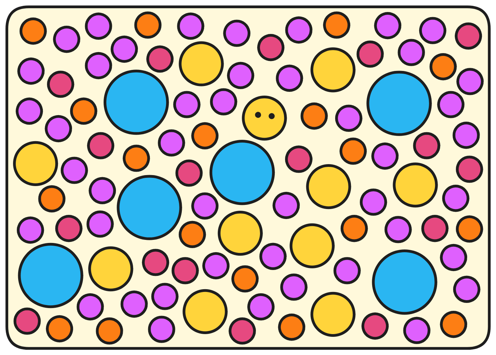

按照上一篇的设计，现在我们来逐步完成 Proton 的代码。

我们可以把 Proton 分为 4 个模块。👇 

每个模块对应不同的功能，灵活组合。

<a href="4.User模块.md">

    
1️⃣
            

                User 模块
            

            

                管理用户关系与用户资料
            

    

</a>

    
1️⃣
        <a href="4.User模块.md#定义用户资料typesmo">
            

                typse.mo
            

            

                定义类型别名
            

        </a>
    

    
2️⃣
        <a href="4.User模块.md#有向图digraphmo">
            

                digraph.mo
            

            

                有向图
            

        </a>
    

    
3️⃣
        <a href="4.User模块.md#存储用户信息databasemo">
            

                database.mo
            

            

                存储用户资料
            

        </a>
    

    
4️⃣
        <a href="4.User模块.md#集成所有功能mainmo">
            

                main.mo
            

            

                管理用户
            

        </a>
    

 

 

<a href="5.Post模块.md">

    
2️⃣
        

            Post 模块
        

        

            存储所有帖子
        

    

</a>

    
1️⃣
    <a href="5.Post模块.md#管理canisterrootpostmo">
        

            rootPost.mo
        

        

            管理所有Bucket
        

    </a>
    

    
2️⃣
    <a href="5.Post模块.md#存储帖子bucketmo">
        

           bucket.mo
        

        

            存储帖子
        

    </a>
    

 

 

<a href="6.Feed模块.md">

    
3️⃣
        

            Feed 模块
        

        

            用户自己的云终端
        

    

</a>

    
1️⃣
    <a href="6.Feed模块.md#创建feedcanisterrootfeedmo">
        

            rootFeed.mo
        

        

            创建Feed
        

    </a>
    

    
2️⃣
    <a href="6.Feed模块.md#存储数据databasemo">
        

            database.mo
        

        

            存储模块
        

    </a>
    

    
3️⃣
    <a href="6.Feed模块.md#用户云终端feedmo">
        

            feed.mo
        

        

            用户云终端
        

    </a>
    

 

 

<a href="7.Fetch模块.md">

    
4️⃣
        

            Fetch 模块
        

        

            管理用户关系与用户资料
        

    

</a>

    
1️⃣
    <a href="7.Fetch模块.md#rootfetchmo">
        

            rootFetch.mo
        

        

            管理 Fetch Canister
        

    </a>
    

    
2️⃣
    <a href="7.Fetch模块.md#postfetchmo">
        

            postFetch.mo
        

        

            通知帖子
        

    </a>
    

    
3️⃣
    <a href="7.Fetch模块.md#likefetchmo">
        

            likeFetch.mo
        

        

            通知点赞
        

    </a>
    

    
4️⃣
    <a href="7.Fetch模块.md#commentfetchmo">
        

            commentFetch.mo
        

        

            通知评论
        

    </a>
    

</a>

 

🫡

