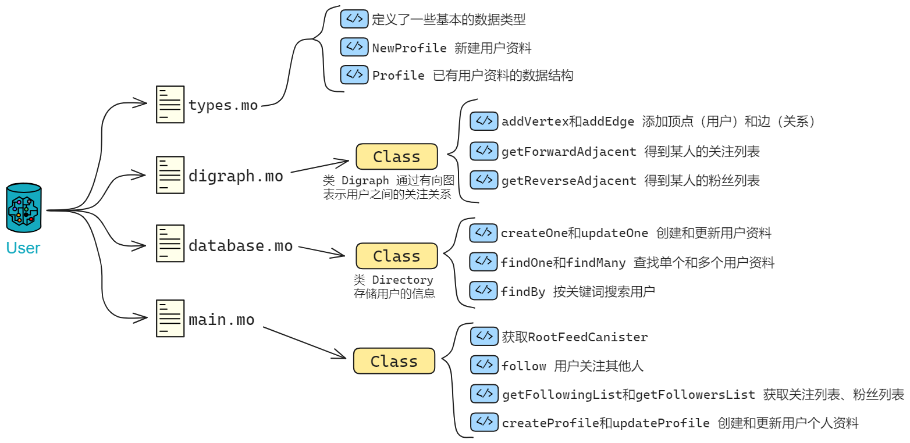

先来看看 User 模块。

## User

User 负责 Proton 有关用户资料的功能。

我们需要的功能是：关注用户、取消关注、获取关注列表、获取粉丝列表、创建和更新用户个人资料，以及搜索用户功能。

<br>

要实现用户互相关注的功能，首先需要存储用户之间的关注关系，我们可以使用有向图这种数据结构。

对于用户互相关注功能，可以将其模型化为一个有向图：

* 每个用户为一个点。
* 如果用户 A 关注了用户 B，则从点 A 向点 B 引一条有向边（箭头）。
* 这样就构成了一个有向图，表示用户之间的关注关系。

<div class="center-image">

</div>

有向图可以直观地表示用户间关注关系，便于理解和实现相关算法。

还可以利用图算法分析社交关系，比如寻找点间最短路径，查询你关注的人里有谁关注了他。

<br>

### 定义用户资料：types.mo

在有向图之前，我们需要先定义一些类型别名，把用户资料里有哪些信息列出来。在 Motoko 里用 `type` 关键字创建类型别名，我们就可以给一个类型赋予一个新名字，使得代码更加直观、易懂。

参考之前的 [LinkedUp]() ，用一个模块单独定义，在使用模块的文件中引入即可。

下面我们定义好有向图的点（用户），和用户个人资料。

```js
import Principal "mo:base/Principal"; // 从motoko基础库导入相关内容
import Time "mo:base/Time";

module {

    public type Vertex = Principal;
    public type UserId = Principal;
    public type Time = Time.Time;

    public type NewProfile = {
        name: Text;
        biography: Text;
        company: Text;
        education: Text;
        imgUrl: Text;
        feedCanister: ?Principal;
    };

    public type Profile = {
        id: UserId;
        name: Text;
        biography: Text;
        company: Text;
        education: Text;
        imgUrl: Text;
        feedCanister: ?Principal;
    };

};
```

import 语句：

```js
import Principal "mo:base/Principal";
```

这行代码的意思是从 Motoko 的标准库中引入了一个模块，这里引入的是 `Principal` 模块，它和身份标识有关，可以认为这是 IC 上的用户或者服务的身份证。

<br>

### 有向图：digraph.mo

现在我们创建 digraph.mo 文件，定义一个有向图的类 `Digraph` ，用于表示用户之间的关注关系。

把之前定义的类型写出来：

```js
module {
  type Vertex = Types.Vertex;
}；
```

`vertexList` 存储所有的点，`edgeList` 存储所有的单向边，即关注关系：

```js
type Vertex = Types.Vertex;

public class Digraph() {
    var vertexList: [Vertex] = []; // 点
    var edgeList: [(Vertex, Vertex)] = []; // 单向边
}；
```

`addVertex` 用于添加点（用户），`addEdge` 用于添加边（关注关系），用 `assert` 来确保边的唯一性：

```js
type Vertex = Types.Vertex;

public class Digraph() {
    var vertexList: [Vertex] = []; // 点
    var edgeList: [(Vertex, Vertex)] = []; // 单向边

    // public关键字表示这个函数是公开的，任何人的可以调用
    // 如果用private就只能由Canister内部的代码调用，不公开
    public func addVertex(vertex: Vertex) {
      vertexList := Array.append<Vertex>(vertexList, [vertex]);
    };

    // 添加 from 到 to 的单向边
    public func addEdge(fromVertex: Vertex, toVertex: Vertex) {
      // 检查是否已经存在
      assert(Array.find<(Vertex, Vertex)>(edgeList, func((x, y): (Vertex, Vertex)): Bool {
        x == fromVertex and y == toVertex
      }) == null);
      edgeList := Array.append<(Vertex, Vertex)>(edgeList, [(fromVertex, toVertex)]);
    };

}；
```

<br>

`getForwardAdjacent` 和 `getReverseAdjacent` 用于获取正向和反向邻居点，即用户的关注列表和粉丝列表，通过遍历边列表实现：

```js
import Array "mo:base/Array";
import Iter "mo:base/Iter";
import Types "./types";

module {

  type Vertex = Types.Vertex;

  public class Digraph() {

    var vertexList: [Vertex] = []; // 点
    var edgeList: [(Vertex, Vertex)] = []; // 单向边

    public func addVertex(vertex: Vertex) {
      vertexList := Array.append<Vertex>(vertexList, [vertex]);
    };

    // 添加 from 到 to 的单向边
    public func addEdge(fromVertex: Vertex, toVertex: Vertex) {
      // 检查是否已经存在
      assert(Array.find<(Vertex, Vertex)>(edgeList, func((x, y): (Vertex, Vertex)): Bool {
        x == fromVertex and y == toVertex
      }) == null);
      edgeList := Array.append<(Vertex, Vertex)>(edgeList, [(fromVertex, toVertex)]);
    };

    // 获取正向领边的节点 即得到某人的关注列表
    public func getForwardAdjacent(vertex: Vertex): [Vertex] {
      var adjacencyList: [Vertex] = [];
      for ((fromVertex, toVertex) in Iter.fromArray<(Vertex, Vertex)>(edgeList)) {
        if (fromVertex == vertex) {
          adjacencyList := Array.append<Vertex>(adjacencyList, [toVertex]);
        };
      };
      adjacencyList
    };
    
    // 获取反向领边的节点 即得到某人的粉丝列表
    public func getReverseAdjacent(vertex: Vertex): [Vertex] {
      var adjacencyList: [Vertex] = [];
      for ((fromVertex, toVertex) in Iter.fromArray<(Vertex, Vertex)>(edgeList)) {
        if (toVertex == vertex) {
          adjacencyList := Array.append<Vertex>(adjacencyList, [fromVertex]);
        };
      };
      adjacencyList
    };

  };
  
};
```

有了有向图存储用户关系，还需要有个存储用户资料的地方。

<br>

### 存储用户信息：database.mo

我们再创建一个专门存储用户资料的文件：database.mo 。

定义一个用户信息的存储类 `Directory` ，用 `HashMap` 来存储用户 ID 和其对应的个人资料：

```js
public class Directory() {
    let hashMap = HashMap.HashMap<UserId, Profile>(1, isEq, Principal.hash);
};
```

> 哈希表（Hash table）又叫散列表，是一种可以根据键值（Key value）直接访问的数据结构。哈希表会通过某种哈希算法计算一个键值的函数（这个函数也叫哈希函数或散列函数），并将所查询的数据映射到某个位置以供访问，借此加快查找特定键值的速度。
>
> 哈希表的工作原理可以用这样一个直观的例子来说明：
>
> 字典中收录了大量汉字的信息。为了便于快速找到某个字，可以首先创建一个按照每个字的拼音字母顺序排列的表（也就是字典开头部分的“拼音检字表”），这就类似于在每个字和拼音字母之间建立了一种函数关系。要查找某个字时，只需在这个表中依次定位首字母、第二个字母、第三个字母…… 以此类推，大部分时候甚至不需要完整查找该字拼音的每个字母，就能确定这个字在字典中对应的准确位置。
>
> 在上述例子中，“ 查找拼音的第 n 的字母 ” 就是哈希函数的函数法则，而 “ 拼音检字表 ” 就可以理解为一种哈希表（或散列表）。


还要一些函数实现创建用户资料、更新用户资料、查找单个用户资料、查找多个用户资料以及按照关键词搜索用户的功能。

`createOne` 和 `updateOne` 函数分别用于创建和更新用户资料，通过调用 `put` 函数将用户 ID 和资料放入 HashMap 中。

```js
public class Directory() {
  let hashMap = HashMap.HashMap<UserId, Profile>(1, isEq, Principal.hash);
  
  public func createOne(userId: UserId, profile: NewProfile) {
    hashMap.put(userId, makeProfile(userId, profile));
  };

  public func updateOne(userId: UserId, profile: NewProfile) {
    hashMap.put(userId, makeProfile(userId, profile));
  };
  
  // 其他函数... 
}
```

`findOne` 函数用于查找单个用户资料，通过调用 `get` 函数从 HashMap 中获取。

```js
public func findOne(userId: UserId): ?Profile {
  hashMap.get(userId)
};
```

`findMany` 函数用于查找多个用户资料，通过遍历用户 ID 列表调用 `getProfile` 函数。

```js
public func findMany(userIds: [UserId]): [Profile] {
  func getProfile(userId: UserId): Profile {
    Option.unwrap<Profile>(hashMap.get(userId))
  };
  Array.map<UserId, Profile>(userIds, getProfile)
};
```

`findBy` 函数用于按关键词搜索用户，通过遍历 HashMap 中的用户资料，找到匹配的用户资料。

```js
public func findBy(term: Text): [Profile] {
  var profiles: [Profile] = [];
  for ((id, profile) in hashMap.entries()) {
    if (includesText(profile.name, term)) {
      profiles := Array.append<Profile>(profiles, [profile]);
    };
  };
  profiles
};
```

辅助函数 `makeProfile` 用于创建用户资料实例，`includesText` 用来判断一个字符串是否包含另一个字符串。

```js
    func makeProfile(userId: UserId, profile: NewProfile): Profile {
      {
        id = userId;
        name = profile.name;
        biography = profile.biography;
        company = profile.company;
        education = profile.education;
        imgUrl = profile.imgUrl;
        feedCanister = profile.feedCanister;
      }
    };

    func includesText(string: Text, term: Text): Bool {
      let stringArray = Iter.toArray<Char>(string.chars());
      let termArray = Iter.toArray<Char>(term.chars());

      var i = 0;
      var j = 0;

      while (i < stringArray.size() and j < termArray.size()) {
        if (stringArray[i] == termArray[j]) {
          i += 1;
          j += 1;
          if (j == termArray.size()) { return true; }
        } else {
          i += 1;
          j := 0;
        }
      };
      false
    };
```

database.mo 文件：

```js
import Array "mo:base/Array";
import Hash "mo:base/Hash";
import HashMap "mo:base/HashMap";
import Iter "mo:base/Iter";
import Nat "mo:base/Nat";
import Option "mo:base/Option";
import Principal "mo:base/Principal";
import Time "mo:base/Time";
import Types "./types";
import TrieMap "mo:base/TrieMap";
import TrieSet "mo:base/TrieSet";

module {
  
  type NewProfile = Types.NewProfile;
  type Profile = Types.Profile;
  type UserId = Types.UserId;
  type Time = Time.Time;

  public class Directory() {

    let hashMap = HashMap.HashMap<UserId, Profile>(1, isEq, Principal.hash);

    public func createOne(userId: UserId, profile: NewProfile) {
      hashMap.put(userId, makeProfile(userId, profile));
    };

    public func updateOne(userId: UserId, profile: NewProfile) {
      hashMap.put(userId, makeProfile(userId, profile));
    };

    public func findOne(userId: UserId): ?Profile {
      hashMap.get(userId)
    };

    public func findMany(userIds: [UserId]): [Profile] {
      func getProfile(userId: UserId): Profile {
        Option.unwrap<Profile>(hashMap.get(userId))
      };
      Array.map<UserId, Profile>(userIds, getProfile)
    };

    public func findBy(term: Text): [Profile] {
      var profiles: [Profile] = [];
      for ((id, profile) in hashMap.entries()) {
        if (includesText(profile.name, term)) {
          profiles := Array.append<Profile>(profiles, [profile]);
        };
      };
      profiles
    };

    // Helpers

    func makeProfile(userId: UserId, profile: NewProfile): Profile {
      {
        id = userId;
        name = profile.name;
        biography = profile.biography;
        company = profile.company;
        education = profile.education;
        imgUrl = profile.imgUrl;
        feedCanister = profile.feedCanister;
      }
    };

    func includesText(string: Text, term: Text): Bool {
      let stringArray = Iter.toArray<Char>(string.chars());
      let termArray = Iter.toArray<Char>(term.chars());

      var i = 0;
      var j = 0;

      while (i < stringArray.size() and j < termArray.size()) {
        if (stringArray[i] == termArray[j]) {
          i += 1;
          j += 1;
          if (j == termArray.size()) { return true; }
        } else {
          i += 1;
          j := 0;
        }
      };
      false
    };
  };

  func isEq(x: UserId, y: UserId): Bool { x == y };
};
```

<br>

### 集成所有功能：main.mo

在完成 types.mo 、digraph.mo 、database.mo 之后，最后一件事就是用 actor 集成前面的模块，实现所有功能。

<div class="center-image">

</div>

Digraph 类实现了一个有向图数据结构，用于存储用户之间的关注关系。Database 类实现了一个用户资料的数据库。

<div class="center-image">

</div>

现在我们用 User actor 类实现用户模块的主要功能。`User` 类代表社交网络中的用户，包含了用户关注功能、获取关注列表、获取粉丝列表、创建和更新用户个人资料，以及搜索用户等功能。

<br>

模块之间的关系：

User actor 依赖 Digraph 和 Database 类实现底层数据结构。

<div class="center-image">

</div>

`actor` 是一个可以并发处理消息的独立实体，类似于面向服务的架构中的微服务。`actor class` 则是可以创建 `actor` 实例的类。

User actor 还要与 RootFeedActor 和 FeedActor 交互，通过它们触发信息流的更新。

```js
import Digraph "./digraph";
import Database "./database";
import Types "./types";

// 定义 UserActor
actor class User() = this {
    
}
```

actor 和 actor class ：

`actor` 是一种特殊的类型，你可以将其理解为一个可以执行代码的小机器或服务。每个 `actor` 都有一个独一无二的 `Principal` ID。如果你把它想象成一个微服务，那么 `actor` 就是这个微服务的入口点。

```js
actor class Feed(...) = this { ... }
```

这里我们看到 `actor class` ，它是 `actor` 的一种特殊形式，可以接受一些参数来创建新的 `actor` 实例。这类似于面向对象编程中的类。

<br>

根据之前的设计，我们要实现的功能可以总结为：

* 让一个用户关注另一个用户，它会更新有向图中的边，并通知被关注用户的 Feed Canister 更新粉丝列表。
* 通过有向图查询某个用户的关注列表和粉丝列表。
* 新增和更新一个用户的资料。
* 查询用户资料。

<div class="center-image">

</div>

<br>

我们创建一个 `rootFeedCanister` 用来记录 Root Feed Canister 。

`init` 函数用于初始化用户的根 Feed Canister 。

`getRootFeedCanister` 函数用于获取用户的根 Feed Canister 。

```js
// 定义 UserActor
actor class User() = this {
    
    // 用一个变量表示 Root Feed Canister（用于存储用户Feed数据）
    // 这里用到了Principal.fromText，所以要在上面导入模块：import Principal
    stable var rootFeedCanister = Principal.fromText("2vxsx-fae");

    // 初始化函数，设置 Root Feed Canister
    public shared({caller}) func init(_rootFeedCanister: Principal) {
        rootFeedCanister := _rootFeedCanister;
    };

    // 查询 Root Feed Canister
    // query关键字表示查询函数，用于查询数据
    // 响应极快，不经过共识，不改变Canister状态
    public query func getRootFeedCanister(): async Principal {
        rootFeedCanister
    };
}
```

public 、private 和 shared 函数：

Motoko 中的函数可以是 `public`（公开的），也可以是 `private`（私有的），类似于其他编程语言中的访问控制。`shared` 函数是一种特殊的公开函数，它们可以在不同的 `actors` 之间进行通信。

```js
public shared({caller}) func init(...) { ... }
```

这个函数可以被外部的 `actor` 调用，`{caller}` 是一个模式匹配，用来获取调用者的身份。

<br>

`follow` 函数用来用户关注其他用户，涉及到更新关注者的 Feed Canister 以及有向图的更新。

```js
// 用户关注其他用户的函数
public shared({caller}) func follow(user: Vertex): async () {
    // 检查 Root Feed Canister 是否是匿名的
    assert(not Principal.isAnonymous(rootFeedCanister));
    
    // 根据 Root Feed Canister 创建 RootFeedActor 实例
    let rootFeedActor: RootFeedActor = actor(Principal.toText(rootFeedCanister));
    
    // 遍历 Root Feed Actor 中的所有用户 Feed Canister
    for((_, _feedCanister) in (await rootFeedActor.getAllUserFeedCanister()).vals()) {
        
        // 根据 Feed Canister 创建 FeedActor 实例
        let feedActor: FeedActor = actor(Principal.toText(_feedCanister));
        
        // ignore调用followers 时的返回值，关注者列表在 Feed Canister 里
        ignore feedActor.updateFollowers(Array.append(
            graph.getReverseAdjacent(user),
            [caller]
        ));
    };
    // 在图中添加一条边，表示用户关注了另一个用户
    graph.addEdge(caller, user);
};
```

`shared` 关键字用于声明一个函数或类型是共享的。这意味着它们可以在不同的 Actor 之间共享和使用。

假如你在一个 Actor 中声明一个 `public shared` 函数时，这个函数可以被其他 Actor 调用和修改其状态，通过异步消息传递实现。

[public shared func oneway() { };](https://github.com/Web3NL/motoko-book/blob/main/src/internet-computer-programming-concepts/actors.md) 就是个例子，这个函数没有返回类型，可以修改 Actor 的状态，无论是否执行成功都返回 `()` 。

Motoko 还定义了一系列的共享类型（Shared Types）。只有共享类型才能作为公共共享函数的参数和返回值。这些共享类型包括所有的原始类型（除了 `Error` 类型）、Option 类型、元组类型、不可变数组类型、对象类型等。比如 [`Nat`](https://github.com/Web3NL/motoko-book/blob/main/src/internet-computer-programming-concepts/async-data/shared-types.md) 和 [`Text`](https://github.com/Web3NL/motoko-book/blob/main/src/internet-computer-programming-concepts/async-data/shared-types.md) 就是共享类型。

<br>

`getFollowingList` 和 `getFollowersList` 函数获取用户的关注列表和粉丝列表。

`createProfile` 和 `updateProfile` 函数创建和更新用户个人资料。

`getProfile` 函数获取用户的个人资料。

`searchProfile` 函数根据关键词搜索用户。

总体上就是这样：

<div class="center-image">

</div>

完整 main.mo 文件如下：

```js
import Array "mo:base/Array";
import Digraph "./digraph";
import Database "./database";
import Principal "mo:base/Principal";
import Types "./types";

// 定义 UserActor
actor class User() = this {
    
    // 用一个变量表示 Root Feed Canister（用于存储用户Feed数据）
    // 这里用到了Principal.fromText，所以要在上面导入模块：import Principal
    stable var rootFeedCanister = Principal.fromText("2vxsx-fae");

    // 初始化函数，设置 Root Feed Canister
    public shared({caller}) func init(_rootFeedCanister: Principal) {
        rootFeedCanister := _rootFeedCanister;
    };

    // 查询 Root Feed Canister
    // query关键字表示查询函数，用于查询数据
    // 响应极快，不经过共识，不改变Canister状态
    public query func getRootFeedCanister(): async Principal {
        rootFeedCanister
    };

// ==================== Follow Info ====================

    // 定义类型别名
    type Vertex = Types.Vertex;
    type RootFeedActor = Types.RootFeedActor;
    type FeedActor = Types.FeedActor;

    // 创建有向图实例
    var graph: Digraph.Digraph = Digraph.Digraph();

    // 用户关注其他用户的函数
    public shared({caller}) func follow(user: Vertex): async () {
        // 检查 Root Feed Canister 是否是匿名的
        assert(not Principal.isAnonymous(rootFeedCanister));
        
        // 根据 Root Feed Canister 创建 RootFeedActor 实例
        let rootFeedActor: RootFeedActor = actor(Principal.toText(rootFeedCanister));
        
        // 遍历 Root Feed Actor 中的所有用户 Feed Canister
        for((_, _feedCanister) in (await rootFeedActor.getAllUserFeedCanister()).vals()) {
            
            // 根据 Feed Canister 创建 FeedActor 实例
            let feedActor: FeedActor = actor(Principal.toText(_feedCanister));
            
            // ignore调用followers时的返回值，关注者列表在 Feed Canister 里
            ignore feedActor.updateFollowers(Array.append(
                graph.getReverseAdjacent(user),
                [caller]
            ));
        };
        // 在图中添加一条边，表示用户关注了另一个用户
        graph.addEdge(caller, user);
    };

    // 获取用户关注列表
    public query({caller}) func getFollowingList(user: Vertex): async [Vertex] {
        graph.getForwardAdjacent(user)
    };

    // 获取粉丝列表
    public query({caller}) func getFollowersList(user: Vertex): async [Vertex] {
        graph.getReverseAdjacent(user)
    };

// ==================== Profiles ====================

    // 定义类型别名
    type NewProfile = Types.NewProfile;
    type Profile = Types.Profile;
    type UserId = Types.UserId;

    // 创建数据库实例，用于存储用户的个人资料
    var directory: Database.Directory = Database.Directory();

    // 创建用户的个人资料
    public shared({caller}) func createProfile(profile: NewProfile): async () {
        directory.createOne(caller, profile);
    };

    // 更新用户的个人资料
    public shared({caller}) func updateProfile(profile: NewProfile): async () {
        directory.updateOne(caller, profile);
    };

    // 根据用户ID获取用户的个人资料
    public query func getProfile(userId: UserId): async ?Profile {
        directory.findOne(userId)
    };

    // 根据搜索词查询用户的个人资料
    public query func searchProfile(term: Text): async [Profile] {
        directory.findBy(term)
    };

}
```

现在关于 User 的模块就完成了，有了基本的社交网络功能。通过有向图维护用户之间的关注关系，通过数据库存储和查询用户个人资料，以及通过 Root Feed Canister 实现用户动态的更新。

接下来开始构建 [Post](./5.Post模块.md) 模块。
