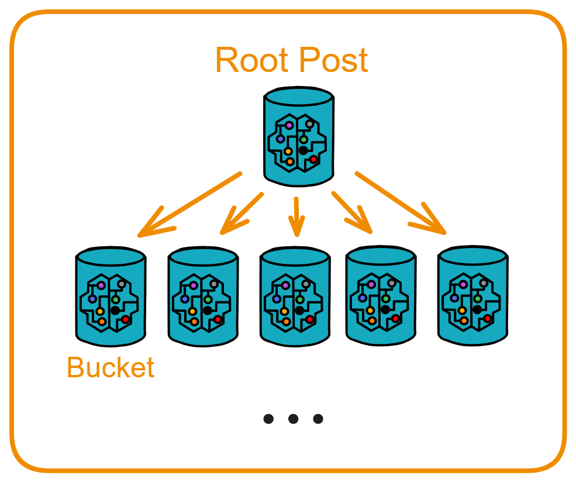
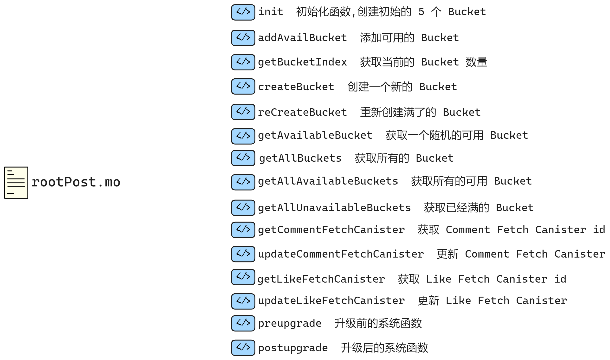

## Post

用户通过 Feed 发布和获取动态，所有的帖子都存在 Bucket 里。通知抓取的功能则通过 Fetch 进行处理。

我们下一个要实现的是 Post 模块。但是我们需要用的类型有帖子、点赞、评论，还要和其他 Canister 交互，而且这些类型在 Feed 、Fetch 里还需要用。

所以对于要全局共享的类型，我们可以把它放在模块文件夹之外：

```
src
  ├── feed
  ├── fetch
  ├── post
  ├── user
  ├── types.mo  👈
  └── utils.mo
```

在使用时先把 types.mo 的内容引用到模块文件夹内的 types.mo 里。再引入其他文件里。

<br>

比如把帖子这个类型定义好：代表了用户发布的帖子，然后放到外层文件夹的 types.mo 里，具体可以看 [8.共享类型](./8.共享类型.md) 。帖子包括了很多信息，比如帖子的 ID 、发布者、帖子索引、发布时间、内容、点赞数、评论等等。

```motoko
public type Post = {
    postId: PostId;
    feedCanister: Principal;
    index: Nat;
    user: UserId;
    content: Text;
    var repost: [Repost];
    var like: [Like];
    var comment: [Comment];
    createdAt: Time;
};
```

<br>

<div class="center-image">

</div>

根据之前的设计，在 Post 模块里有 2 种 Canister ：Root Post 和 Bucket 。

Root Post 负责统筹管理所有的 Bucket ：

* 创建足够多的 Bucket （始终保持 5 个可用）。

* 查询所有 Bucket 、可用的 Bucket 、已存满的 Bucket 等。

<br>

Bucket 是直接存储帖子内容的地方：

* 存储帖子。

* 查询帖子总数量、根据帖子 ID 查询单个帖子、查询多个帖子、获取最新帖子。

* 在收到新评论后，通过 CommentFetch 通知。

* 同样维护了两个子模块的地址，提供了更新和查询这两个 Canister 的函数。

* Bucket 通过 `checkBucketMemory` 函数检查帖子数量，当接近阈值时通知根帖子模块重新创建 Bucket 。

<br>

### 管理Canister：rootPost.mo

看看 Root Post Canister 。Root Post 需要管理 Bucket，我们可以用 `TrieMap` 记录。用 `TrieMap` 记录三种不同状态的 Bucket ：`buckets` 存储所有已创建的 Bucket ，`availableBuckets` 存储可用的 Bucket ，`unavailableBuckets` 存储已经存满的 Bucket 。

因为部署 Canister 之后需要先创建 5 个 Canister ，我们还需要初始化函数，以及后续可以新增 Bucket 。在创建 Bucket 时，还得告诉 Bucket 系统中的 Comment Fetch 和 Like Fetch 的 Canister ID ，所以在 Root Post 中，我们还要记录、保存 Comment Fetch 和 Like Fetch 。

最后是查询所有 Bucket 、查询可用的 Bucket 、查询已经存满的 Bucket 。

<br>

先定义一些 stable 变量和映射来保存 Bucket 。

在 Motoko 中，`stable` 关键字用于定义稳定变量（Stable variables）。这些变量的值应在 Canister 升级过程中保持持久性。这是 Motoko 特有的功能，它使用 ICP 的稳定内存（Stable memory）来在 Canister 升级过程中保持数据的持久性。稳定内存是 IC 可以长期存储数据的特性，不受语言限制， Motoko 、Rust 或任何其他语言写的 Canister 都可以用。稳定内存可以容纳高达 400 GiB 的数据，如果子网可以容纳的话。

通过这些 stable 变量和映射的定义，可以持久化保存多个 Bucket 的状态、总量等信息，并在 Canister 升级后继续使用，实现了 Bucket 管理的持久化。

```js
stable let T_CYCLES = 1_000_000_000_000; // 提前定义好1T Cycles，方便后续使用
stable let BUCKET_MAX_POST_NUMBER: Nat = 5000; // 记录每个Bucket可以存储的最大帖子数
stable var bucketIndex: Nat = 0; // bucketIndex记录已经创建的Bucket数量

// 定义一个数组，保存所有已经创建的Bucket的信息
stable var bucketsEntries: [(Nat, Principal)] = [];
// buckets是根据bucketsEntries创建的映射表，键是索引，值是Bucket的principal
let buckets = TrieMap.fromEntries<Nat, Principal>(bucketsEntries.vals(), Nat.equal, Hash.hash);

// availableBucketsEntries和availableBuckets用于记录当前可用的Bucket
stable var availableBucketsEntries: [(Nat, Principal)] = [];
let availableBuckets = TrieMap.fromEntries<Nat, Principal>(availableBucketsEntries.vals(), Nat.equal, Hash.hash);

// unavailableBucketsEntries和unavailableBuckets用于记录当前不可用的Bucket
stable var unavailableBucketsEntries: [(Nat, Principal)] = [];
let unavailableBuckets = TrieMap.fromEntries<Nat, Principal>(unavailableBucketsEntries.vals(), Nat.equal, Hash.hash);
```

<br>

` _createBucket()` 函数创建 Canister ：

使用 Bucket.Bucket 对象的 Bucket 函数创建一个新的 Bucket actor ，传入 Root Post Canister 的 principal（ ID ） 、commentFetchCanister 和 likeFetchCanister 作为参数。

```js
// 创建Bucket的逻辑
private func _createBucket(): async Principal {
    // 给每个Bucket添加4T Cycles
    Cycles.add(4 * T_CYCLES);
    let newBucket = await Bucket.Bucket(
        Principal.fromActor(this),
        commentFetchCanister,
        likeFetchCanister
    );

    // 将新创建的Bucket的principal保存到buckets映射表中，键为当前的bucketIndex
    buckets.put(bucketIndex, Principal.fromActor(newBucket));
    // 同时也保存到availableBuckets映射表中，表示这个Bucket当前可用
    availableBuckets.put(bucketIndex, Principal.fromActor(newBucket));

    // bucketIndex加1，表示已创建Bucket数量增加
    bucketIndex += 1;
    
    // 返回新创建的Bucket的principal
    Principal.fromActor(newBucket)
};
```

这样 `_createBucket()` 函数就可以创建一个新的 Bucket Actor ，并保存它的 principal 到两个映射表中表示已创建和可用状态。

它封装了创建 Bucket 的具体逻辑，作为一个私有函数被 `createBucket()` 公开函数调用。使用 `bucketIndex` 标识每个 Bucket，并在创建后增加该索引。

我们可以方便地批量创建 Bucket ，并明确其状态，也为管理多个 Bucket 提供了便利。

<br>

 接下来继续构建创建和管理多个 Bucket 的函数。

```js
// 开始先创建5个Bucket，并把它们添加到buckets和availableBuckets的映射表中
public shared({caller}) func init(): async () {
    var i = 0;
    label l loop {
        if(i >= 5) break l;

        Cycles.add(4 * T_CYCLES);
        let newBucket = await Bucket.Bucket(
            Principal.fromActor(this),
            commentFetchCanister,
            likeFetchCanister
        );

        buckets.put(bucketIndex, Principal.fromActor(newBucket));
        availableBuckets.put(bucketIndex, Principal.fromActor(newBucket));
        bucketIndex += 1;

        i += 1;
    };
};

// 批量添加已经创建好的Bucket到buckets和availableBuckets中
public shared({caller}) func addAvailBucket(bucketArray: [Principal]): async () {
    for(_bucket in bucketArray.vals()) {
        buckets.put(bucketIndex, _bucket);
        availableBuckets.put(bucketIndex, _bucket);
        bucketIndex += 1;
    };
};

// 返回当前已经创建的Bucket数量
public query func getBucketIndex(): async Nat { bucketIndex };

// 公开创建Bucket的函数，内部调用_createBucket()
public shared({caller}) func createBucket(): async Principal {
    await _createBucket()
};
```

现在我们的一个 Canister 可以管理 Bucket 的创建、添加了。所有 Bucket 的创建和生命周期能够被集中管理。

<br>

之后还要写出查询函数：

```js
// 查询可用的Bucket
public query func getAvailableBucket(): async ?Principal {
    if(availableBuckets.size() == 0) return null;
    availableBuckets.get(Nat.rem(Option.unwrap(Nat.fromText(Int.toText(Time.now()))), availableBuckets.size()))
};

// 查询所有的Bucket
public query func getAllBuckets(): async [Principal] {
    Iter.toArray(buckets.vals())
};

// 查询所有可用的Bucket
public query func getAllAvailableBuckets(): async [Principal] {
    Iter.toArray(availableBuckets.vals())
};

// 查询已经存满的Bucket
public query func getAllUnavailableBuckets(): async [Principal] {
    Iter.toArray(unavailableBuckets.vals())
};
```

<br>

在创建 Bucket 时，我们还得告诉 Bucket 系统中的 Comment Fetch 和 Like Fetch 的 Canister ID ，所以在 Root Post 中，我们还要记录、保存 Comment Fetch 和 Like Fetch ：

```js
// 持久化保存commentFetch canister的principal id
stable var commentFetchCanister = _commentFetchCanister;

// 外部可以查询当前保存的commentFetch canister id
public query func getCommentFetchCanister(): async Principal { commentFetchCanister };

// 授权特定的caller更新保存的commentFetch canister id
public shared({caller}) func updateCommentFetchCanister(
    newCommentFetchCanister: Principal
): async () {
    commentFetchCanister := commentFetchCanister;
};
```

现在 likeFetch canister 的 principal ID 可以被持久化保存，并可以通过 update 函数灵活更新，还能被外部程序读取查询。

```js
// 持久化保存likeFetch canister的principal id
stable var likeFetchCanister = _likeFetchCanister;
    
// 外部可以查询当前保存的likeFetch canister id
public query func getLikeFetchCanister(): async Principal { likeFetchCanister };

// 授权特定的caller更新保存的likeFetch canister id
public shared({caller}) func updateLikeFetchCanister(
    newLikeFetchCanister: Principal
): async () {
    likeFetchCanister := newLikeFetchCanister;
};
```

<br>

最后是两个系统函数 `preupgrade()` 和 `postupgrade()` ，用来在 Canister 升级前后保存和重置 buckets 、availableBuckets 和 unavailableBuckets 的 entries 。

```js
system func preupgrade() {
    bucketsEntries := Iter.toArray(buckets.entries());
    availableBucketsEntries := Iter.toArray(availableBuckets.entries());
    unavailableBucketsEntries := Iter.toArray(unavailableBuckets.entries());
};

system func postupgrade() {
    bucketsEntries := [];
    availableBucketsEntries := [];
    unavailableBucketsEntries := [];
};
```

`preupgrade()` 函数在 Canister 升级前被调用，它将 buckets 、availableBuckets 和 unavailableBuckets 中的所有 entries 保存到对应的数组 bucketsEntries 、availableBucketsEntries 和 unavailableBucketsEntries 中。

`postupgrade()` 函数在 Canister 升级后被调用，它将 bucketsEntries 、availableBucketsEntries 和 unavailableBucketsEntries 数组清空，相当于重置了 buckets 、availableBuckets 和 unavailableBuckets 中的数据。

这样，通过在升级前后保存和重置 entries ，可以使 buckets 、availableBuckets 和 unavailableBuckets 中的数据在 Canister 升级后不丢失。

`preupgrade` 和 `postupgrade` 被定义为系统函数，会由 Runtime 自动调用，开发者不需要自己调用。

这段代码实现了 Canister 升级的数据迁移，通过在升级前后保存和重置状态，保证了 Canister 升级的透明性。

<br>

<div class="center-image">

</div>

以下是 rootPost.mo 的完整文件：

```js
import Hash "mo:base/Hash";
import Nat "mo:base/Nat";
import TrieMap "mo:base/TrieMap";
import Principal "mo:base/Principal";
import Types "./types";
import Bucket "./bucket";
import Iter "mo:base/Iter";
import Cycles "mo:base/ExperimentalCycles";
import Time "mo:base/Time";
import Int "mo:base/Int";
import Option "mo:base/Option";
import IC "mo:ic";

actor class RootPost(
    _commentFetchCanister: Principal,
    _likeFetchCanister: Principal
) = this {

    stable let T_CYCLES = 1_000_000_000_000;
    stable let BUCKET_MAX_POST_NUMBER: Nat = 5000; // 每个Bucket可以存储的最大帖子数
    stable var bucketIndex: Nat = 0;

    stable var bucketsEntries: [(Nat, Principal)] = [];
    let buckets = TrieMap.fromEntries<Nat, Principal>(bucketsEntries.vals(), Nat.equal, Hash.hash);

    stable var availableBucketsEntries: [(Nat, Principal)] = [];
    let availableBuckets = TrieMap.fromEntries<Nat, Principal>(availableBucketsEntries.vals(), Nat.equal, Hash.hash);

    stable var unavailableBucketsEntries: [(Nat, Principal)] = [];
    let unavailableBuckets = TrieMap.fromEntries<Nat, Principal>(unavailableBucketsEntries.vals(), Nat.equal, Hash.hash);

    // 开始先创建 5 个 Bucket
    public shared({caller}) func init(): async () {
        var i = 0;
        label l loop {
            if(i >= 5) break l;

            Cycles.add(4 * T_CYCLES);
            let newBucket = await Bucket.Bucket(
                Principal.fromActor(this),
                commentFetchCanister,
                likeFetchCanister
            );

            buckets.put(bucketIndex, Principal.fromActor(newBucket));
            availableBuckets.put(bucketIndex, Principal.fromActor(newBucket));
            bucketIndex += 1;

            i += 1;
        };
    };

    public shared({caller}) func addAvailBucket(bucketArray: [Principal]): async () {
        for(_bucket in bucketArray.vals()) {
            buckets.put(bucketIndex, _bucket);
            availableBuckets.put(bucketIndex, _bucket);
            bucketIndex += 1;
        };
    };

    public query func getBucketIndex(): async Nat { bucketIndex };

    // 创建Bucket
    public shared({caller}) func createBucket(): async Principal {
        await _createBucket()
    };

    // 创建Bucket的逻辑
    private func _createBucket(): async Principal {
        Cycles.add(4 * T_CYCLES);
        let newBucket = await Bucket.Bucket(
            Principal.fromActor(this),
            commentFetchCanister,
            likeFetchCanister
        );

        buckets.put(bucketIndex, Principal.fromActor(newBucket));
        availableBuckets.put(bucketIndex, Principal.fromActor(newBucket));

        bucketIndex += 1;

        Principal.fromActor(newBucket)
    };

    public shared({caller}) func reCreateBucket(): async () {
        for((_key, _bucket) in availableBuckets.entries()) {
            if(_bucket == caller) {
                ignore await _createBucket();
                availableBuckets.delete(_key);
                unavailableBuckets.put(_key, _bucket);
            };
        };
    };

    // 查询可用的Bucket
    public query func getAvailableBucket(): async ?Principal {
        if(availableBuckets.size() == 0) return null;
        availableBuckets.get(Nat.rem(Option.unwrap(Nat.fromText(Int.toText(Time.now()))), availableBuckets.size()))
    };

    // 查询所有的Bucket
    public query func getAllBuckets(): async [Principal] {
        Iter.toArray(buckets.vals())
    };

    public query func getAllAvailableBuckets(): async [Principal] {
        Iter.toArray(availableBuckets.vals())
    };

    // 查询已经存满的Bucket
    public query func getAllUnavailableBuckets(): async [Principal] {
        Iter.toArray(unavailableBuckets.vals())
    };

// ==================== CommentFetchCanister ====================

    stable var commentFetchCanister = _commentFetchCanister;
    
    public query func getCommentFetchCanister(): async Principal { commentFetchCanister };

    public shared({caller}) func updateCommentFetchCanister(
        newCommentFetchCanister: Principal
    ): async () {
        commentFetchCanister := commentFetchCanister;
    };


// ==================== LikeFetchCanister ====================

    stable var likeFetchCanister = _likeFetchCanister;
    
    public query func getLikeFetchCanister(): async Principal { likeFetchCanister };

    public shared({caller}) func updateLikeFetchCanister(
        newLikeFetchCanister: Principal
    ): async () {
        likeFetchCanister := newLikeFetchCanister;
    };

    system func preupgrade() {
        bucketsEntries := Iter.toArray(buckets.entries());
        availableBucketsEntries := Iter.toArray(availableBuckets.entries());
        unavailableBucketsEntries := Iter.toArray(unavailableBuckets.entries());
    };

    system func postupgrade() {
        bucketsEntries := [];
        availableBucketsEntries := [];
        unavailableBucketsEntries := [];
    };
}
```

<br>

### 存储帖子：bucket.mo

Bucket 是存储帖子的 Canister ，每个 Bucket 可以存储一定数量的帖子。支持存储、查询、更新帖子以及通知 Fetch Canister 的功能。

Bucket 需要提供了查询帖子数量、根据帖子 ID 查询单个帖子、查询多个帖子、获取最新帖子的函数。

在收到新评论、点赞之后，Bucket 还要通过 Comment Fetch Canister 和 Like Fetch Canister 。

当 Bucket 存储的帖子数量接近阈值时，Root Post 会创建新的 Bucket 。

<br>

这是 `Bucket` 模块的开始，它是实际存储帖子的地方。带有 `actor class` 关键字的表示这是一个可以被外部调用的 Actor 类。带有 `(rootPostCanister, _commentFetchCanister, _likeFetchCanister)` 参数表示这个 Actor 类需要初始化时传入这三个 Canister 的 ID 。

```js
actor class Bucket(
    rootPostCanister: Principal,
    _commentFetchCanister: Principal,
    _likeFetchCanister: Principal
) = this {
    // ...
};
```

<br>

整体上这个 Bucket 用于接收各种操作（新评论、点赞等）来更新帖子，所有数据以不可变形式存储，可以高效地进行查询和共享。

首先定义一些类型、变量和数据结构。

```js
// 定义了几个类型别名
type FeedActor = Types.FeedActor;
type PostImmutable = Types.PostImmutable;
type NewComment = Types.NewComment;
type NewLike = Types.NewLike;
type NewRepost = Types.NewRepost;
type CommentFetchActor = Types.CommentFetchActor;
type LikeFetchActor = Types.LikeFetchActor;
type RootPostActor = Types.RootPostActor;

stable let BUCKET_MAX_POST_NUMBER: Nat = 5000; // 每个Bucket可以存储的最大帖子数
stable let FLOOR_BUCKET_MAX_POST_NUMBER: Nat = BUCKET_MAX_POST_NUMBER - 50; // 一个下限阈值

stable let installer = msg.caller;

// postId -> PostImmutable
// 主要的数据存储在feedMap中，这是一个从帖子ID到PostImmutable的映射
stable var feedMapEntries: [(Text, PostImmutable)] = [];
// 存储在TrieMap中，使用Text哈希和比较
let feedMap = TrieMap.fromEntries<Text, PostImmutable>(feedMapEntries.vals(), Text.equal, Text.hash);
```

`TrieMap` 是一种高效的键值存储结构。使用 `TrieMap` 维护了帖子信息，提供了存储、批量存储、更新评论、更新点赞、更新转发等功能。`feedMapEntries` 和 `feedMap` 的定义用来存储帖子数据，一个是数组形式，一个是 TrieMap 形式。

<br>

存储帖子：

`storeFeed()` 函数用来存储单个帖子。它是 `public shared` 的，所以可以被外部调用者调用。

```js
public shared({caller}) func storeFeed(post: PostImmutable): async Bool {
    ignore checkBucketMemory();
    _storeFeed(post);
};
```

`batchStoreFeed()` 用于批量存储多篇帖子，内部使用循环调用 `_storeFeed()` 逐个存储。

```js
public shared({caller}) func batchStoreFeed(posts: [PostImmutable]): async () {
    for(post in posts.vals()) {
        ignore _storeFeed(post);
    };
};
```

`updatePostRepost()` 用来更新一个帖子的转发信息。它会调用 `_updatePostRepost()` 执行实际的更新，并 assert 确保更新成功。

```js
public shared({caller}) func updatePostRepost(postId: Text, newRepost: NewRepost): async Bool {
    assert(_updatePostRepost(postId, newRepost));
    true
};
```

`_storeFeed()` 和 `_updatePostRepost()` 是私有函数，是实际实现存储和更新的内部逻辑。

<br>

接下来是更新帖子评论和点赞的功能：

`updatePostComment` 函数用于更新帖子的评论信息。它接收帖子 ID 和新的评论作为参数。内部调用 `_updatePostComment` 函数去实际执行评论的更新。

更新成功后，会从 `_updatePostComment` 返回更新后的 post 对象。然后通知 `CommentFetchActor` 去更新评论缓存。

`updatePostLike` 函数用于更新帖子的点赞信息。它接收帖子 ID 和新的点赞作为参数。内部调用 `_updatePostLike` 去实际执行点赞的更新。 

更新成功后，同样返回更新后的 post 对象，并通知 `LikeFetchActor` 去更新点赞缓存。

```js
// 更新帖子评论信息
// caller参数表示：只有调用者的请求中给出正常身份，才能调用函数
public shared({caller}) func updatePostComment(postId: Text, newComment: NewComment): async Bool {
    switch(_updatePostComment(postId, newComment)) {
        case(null) { return false; };
        case(?_post) {
            // 通知 commentFetch
            let commentFetchActor: CommentFetchActor = actor(Principal.toText(commentFetchCanister));
            ignore commentFetchActor.receiveNotify(_post);
        };
    };
    // 返回Bool值表示更新是否成功
    true
};

public shared({caller}) func updatePostLike(postId: Text, newLike: NewLike): async Bool {
    switch(_updatePostLike(postId, newLike)) {
        case(null) { return false; };
        case(?_post) {
            // 通知 likeFetch
            let likeFetchActor: LikeFetchActor = actor(Principal.toText(likeFetchCanister));
            ignore likeFetchActor.receiveNotify(_post);
        };     
    };
    true
};
```

我们通过私有函数实现对操作帖子函数的封装。外部只需要调用公开的 update 函数，不需要关心内部的存储和更新逻辑。 私有函数可以封装状态管理，使代码更加模块化和可维护。

<br>

`_updatePostComment` 函数用于更新帖子的评论。它从 `feedMap` 中获取原有的帖子，用新评论 `newComment` 更新 `comment` 字段，并 put 回`feedMap` 。

`feedMap` 是一个存储帖子的哈希表，key 是 `postId` ，value 是 `PostImmutable` 记录。

```js
private func _updatePostComment(postId: Text, newComment: NewComment): ?PostImmutable {
    switch(feedMap.get(postId)) {
        case(null) { return null; };
        case(?post) {
            let _newPost = {
                postId = post.postId;
                feedCanister = post.feedCanister;
                index = post.index;
                user = post.user;
                repost = post.repost;
                content = post.content;
                like = post.like;
                comment = newComment;
                createdAt = post.createdAt;
            };
            feedMap.put(postId, _newPost);
            ?_newPost
        };
    };
};
```

<br>

`_updatePostLike` 类似地更新帖子的点赞 like 字段。 

```js
private func _updatePostLike(postId: Text, newLike: NewLike): ?PostImmutable {
    switch(feedMap.get(postId)) {
        case(null) { return null; };
        case(?post) {
            let _newPost = {
                postId = post.postId;
                feedCanister = post.feedCanister;
                index = post.index;
                user = post.user;
                repost = post.repost;
                content = post.content;
                like = newLike;
                comment = post.comment;
                createdAt = post.createdAt;
            };
            feedMap.put(postId, _newPost);
            ?_newPost              
        };
    };
};
```

<br>

`_updatePostRepost` 更新帖子的转发 repost 字段。

```js
private func _updatePostRepost(postId: Text, newRepost: NewRepost): Bool {
    switch(feedMap.get(postId)) {
        case(null) { return false; };
        case(?post) {
            feedMap.put(postId, {
                postId = post.postId;
                feedCanister = post.feedCanister;
                index = post.index;
                user = post.user;
                content = post.content;
                repost = newRepost;
                like = post.like;
                comment = post.comment;
                createdAt = post.createdAt;
            });
            true
        };
    };
};
```

<br>

使用 `immutable` 数据结构 `PostImmutable` 可以保证数据一致性，避免意外修改。

```js
// 把新的帖子保存到feedMap中
// 检查postId是否已存在，如果不存在才保存，避免重复
private func _storeFeed(post: PostImmutable): Bool {
    ignore Utils.checkPostId(post.postId);
    switch(feedMap.get(post.postId)) {
        case(?_post) {
            // Debug.print("This post has been stored");
            return false;
        };
        case(null) {
            feedMap.put(post.postId, post);
            return true;
        };
    };
};
```

<br>

`checkBucketMemory` 函数用于检查当前 Bucket 是否接近容量上限，如果是，则通知根帖子 Actor 创建新的 Bucket 。

```js
func checkBucketMemory(): async () {
    if(feedMap.size() > FLOOR_BUCKET_MAX_POST_NUMBER) {
        let rootPostActor: RootPostActor = actor(Principal.toText(rootPostCanister));
        ignore rootPostActor.reCreateBucket();
    }
};
```

<br>

我们需要一个查询帖子总数的函数：

```js
// 查询共有多少个帖子
public query func getPostNumber(): async Nat {
    feedMap.size()
};
```

<br>

还有获取帖子具体内容的函数，实现快速批量获取某几个帖子的功能。

这个功能用在 Feed Canister 抓取帖子上：

当用户关注的某几个人发布了帖子，这些帖子的 ID 又会被送到 Fetch ，最后发送到 另一个 Feed 里。这是 Feed 就会一次性收到很多个帖子的 ID ，Feed 就需要把这些帖子 ID 发给 Bucket ，一次性获取到这些帖子们。

```js
// 根据ID查询某几个帖子（可以传入7个ID一次性返回7个帖子的内容）
public query func getPosts(postIdArray: [Text]): async [PostImmutable] { // 接收一个Text数组postIdArray作为参数
    // 创建一个Buffer来存储查询结果，大小为postIdArray的大小
    let result = Buffer.Buffer<PostImmutable>(postIdArray.size());
    // 遍历postIdArray中的每个ID
    for(postId in postIdArray.vals()) {
        // 对每个ID，从feedMap中查找，如果找到则放入结果Buffer中
        switch(feedMap.get(postId)) {
            case(null) {};
            case(?post) { result.add(post); };
        };
    };
        // 遍历结束后，通过toArray()转换Buffer为数组并返回
        Buffer.toArray<PostImmutable>(result)
};
```

我们使用 Buffer 避免多次数组拼接的开销。query 函数可以被链外调用，实现了数据查询的封装。 返回的是数组类型，调用方可以方便处理查询结果。

这样就可以批量查询多篇帖子内容了。

<br>

根据 ID 批量精确查询帖子之后，还需要 2 个关于查询的函数：根据 ID 单独查询帖子的函数和查询最新的 n 个帖子函数。

```js
public query func getPost(postId: Text): async ?PostImmutable {
    switch(feedMap.get(postId)) {
        case(null) { return null; };
        case(?post) { return ?post; }; 
    };
};

// 查询最新的 n 个帖子
public query func getLatestFeed(n: Nat): async [PostImmutable] {
    let feedArray = Iter.toArray(
        Iter.sort<PostImmutable>(
        feedMap.vals(),
        func (x: PostImmutable, y: PostImmutable): Order.Order {
            if(x.createdAt > y.createdAt) return #less
            else if(x.createdAt < y.createdAt) return #greater
            else return #equal
    }));
    if(n <= feedArray.size()) {
        Array.subArray(feedArray, 0, n)
    } else {
        Array.subArray(feedArray, 0, feedArray.size())
    }
};
```

最后是和升级有关的系统函数，通过 `preupgrade` 和 `postupgrade` 函数管理 Bucket 的状态。

<br>

以下是 bucket.mo 完整文件：

```js
import Types "./types";
import TrieMap "mo:base/TrieMap";
import Principal "mo:base/Principal";
import Array "mo:base/Array";
import Order "mo:base/Order";
import Text "mo:base/Text";
import Hash "mo:base/Hash";
import Nat "mo:base/Nat";
import Iter "mo:base/Iter";
import Debug "mo:base/Debug";
import Option "mo:base/Option";
import Buffer "mo:base/Buffer";
import Utils "../utils";

shared(msg) actor class Bucket(
    rootPostCanister: Principal,
    _commentFetchCanister: Principal,
    _likeFetchCanister: Principal
) = this {
    
    type FeedActor = Types.FeedActor;
    type PostImmutable = Types.PostImmutable;
    type NewComment = Types.NewComment;
    type NewLike = Types.NewLike;
    type NewRepost = Types.NewRepost;
    type CommentFetchActor = Types.CommentFetchActor;
    type LikeFetchActor = Types.LikeFetchActor;
    type RootPostActor = Types.RootPostActor;

    stable let BUCKET_MAX_POST_NUMBER: Nat = 5000; // 每个Bucket可以存储的最大帖子数 (待计算)
    stable let FLOOR_BUCKET_MAX_POST_NUMBER: Nat = BUCKET_MAX_POST_NUMBER - 50;

    stable let installer = msg.caller;

    // postId -> PostImmutable
    stable var feedMapEntries: [(Text, PostImmutable)] = [];
    let feedMap = TrieMap.fromEntries<Text, PostImmutable>(feedMapEntries.vals(), Text.equal, Text.hash);

    // 存储帖子
    public shared({caller}) func storeFeed(post: PostImmutable): async Bool {
        ignore checkBucketMemory();
        _storeFeed(post);
    };

    public shared({caller}) func batchStoreFeed(posts: [PostImmutable]): async () {
        for(post in posts.vals()) {
            ignore _storeFeed(post);
        };
    };

    public shared({caller}) func updatePostRepost(postId: Text, newRepost: NewRepost): async Bool {
        assert(_updatePostRepost(postId, newRepost));
        true
    };

    // 更新帖子评论信息 
    public shared({caller}) func updatePostComment(postId: Text, newComment: NewComment): async Bool {
        switch(_updatePostComment(postId, newComment)) {
            case(null) { return false; };
            case(?_post) {
                // 通知 commentFetch
                let commentFetchActor: CommentFetchActor = actor(Principal.toText(commentFetchCanister));
                ignore commentFetchActor.receiveNotify(_post);
            };
        };
        true
    };

    public shared({caller}) func updatePostLike(postId: Text, newLike: NewLike): async Bool {
        switch(_updatePostLike(postId, newLike)) {
            case(null) { return false; };
            case(?_post) {
                // 通知 likeFetch
                let likeFetchActor: LikeFetchActor = actor(Principal.toText(likeFetchCanister));
                ignore likeFetchActor.receiveNotify(_post);
            };     
        };
        true
    };

    func checkBucketMemory(): async () {
        if(feedMap.size() > FLOOR_BUCKET_MAX_POST_NUMBER) {
            let rootPostActor: RootPostActor = actor(Principal.toText(rootPostCanister));
            ignore rootPostActor.reCreateBucket();
        }
    };

    private func _updatePostComment(postId: Text, newComment: NewComment): ?PostImmutable {
        switch(feedMap.get(postId)) {
            case(null) { return null; };
            case(?post) {
                let _newPost = {
                    postId = post.postId;
                    feedCanister = post.feedCanister;
                    index = post.index;
                    user = post.user;
                    repost = post.repost;
                    content = post.content;
                    like = post.like;
                    comment = newComment;
                    createdAt = post.createdAt;
                };
                feedMap.put(postId, _newPost);
                ?_newPost
            };
        };
    };

    private func _updatePostLike(postId: Text, newLike: NewLike): ?PostImmutable {
        switch(feedMap.get(postId)) {
            case(null) { return null; };
            case(?post) {
                let _newPost = {
                    postId = post.postId;
                    feedCanister = post.feedCanister;
                    index = post.index;
                    user = post.user;
                    repost = post.repost;
                    content = post.content;
                    like = newLike;
                    comment = post.comment;
                    createdAt = post.createdAt;
                };
                feedMap.put(postId, _newPost);
                ?_newPost              
            };
        };
    };

    private func _updatePostRepost(postId: Text, newRepost: NewRepost): Bool {
        switch(feedMap.get(postId)) {
            case(null) { return false; };
            case(?post) {
                feedMap.put(postId, {
                    postId = post.postId;
                    feedCanister = post.feedCanister;
                    index = post.index;
                    user = post.user;
                    content = post.content;
                    repost = newRepost;
                    like = post.like;
                    comment = post.comment;
                    createdAt = post.createdAt;
                });
                true              
            };
        };
    };

    private func _storeFeed(post: PostImmutable): Bool {
        ignore Utils.checkPostId(post.postId);
        switch(feedMap.get(post.postId)) {
            case(?_post) {
                // Debug.print("This post has been stored");
                return false;
            };
            case(null) {
                feedMap.put(post.postId, post);
                return true;
            };
        };
    };

// ==================== 查询函数 ====================

    // 查询共有多少个帖子
    public query func getPostNumber(): async Nat {
        feedMap.size()
    };

    // 根据ID查询某几个帖子（可以传入 7 个 ID 一次性返回 7 个帖子的内容）
    public query func getPosts(postIdArray: [Text]): async [PostImmutable] {
       let result = Buffer.Buffer<PostImmutable>(postIdArray.size());
       for(postId in postIdArray.vals()) {
        switch(feedMap.get(postId)) {
            case(null) {};
            case(?post) { result.add(post); };
        };
       };
       Buffer.toArray<PostImmutable>(result)
    };

    public query func getPost(postId: Text): async ?PostImmutable {
        switch(feedMap.get(postId)) {
            case(null) { return null; };
            case(?post) { return ?post; }; 
        };
    };

    // 查询最新的 n 个帖子
    public query func getLatestFeed(n: Nat): async [PostImmutable] {
        let feedArray = Iter.toArray(
            Iter.sort<PostImmutable>(
            feedMap.vals(),
            func (x: PostImmutable, y: PostImmutable): Order.Order {
                if(x.createdAt > y.createdAt) return #less
                else if(x.createdAt < y.createdAt) return #greater
                else return #equal
        }));
        if(n <= feedArray.size()) {
            Array.subArray(feedArray, 0, n)
        } else {
            Array.subArray(feedArray, 0, feedArray.size())
        }
    };

// ==================== CommentFetchCanister ====================

    stable var commentFetchCanister = _commentFetchCanister;
    
    public query func getCommentFetchCanister(): async Principal { commentFetchCanister };

    public shared({caller}) func updateCommentFetchCanister(
        newCommentFetchCanister: Principal
    ): async () {
        commentFetchCanister := commentFetchCanister;
    };


// ==================== LikeFetchCanister ====================

    stable var likeFetchCanister = _likeFetchCanister;
    
    public query func getLikeFetchCanister(): async Principal { likeFetchCanister };

    public shared({caller}) func updateLikeFetchCanister(
        newLikeFetchCanister: Principal
    ): async () {
        likeFetchCanister := newLikeFetchCanister;
    };

    system func preupgrade() {
        feedMapEntries := Iter.toArray(feedMap.entries());
    };

    system func postupgrade() {
        feedMapEntries := [];
    };
}
```

然后是 [Feed 模块](./6.Feed模块.md)。


