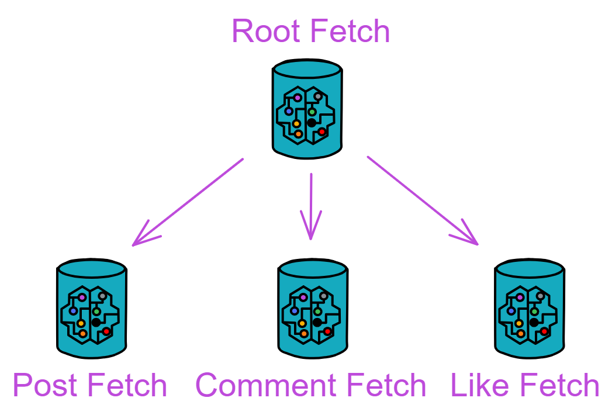
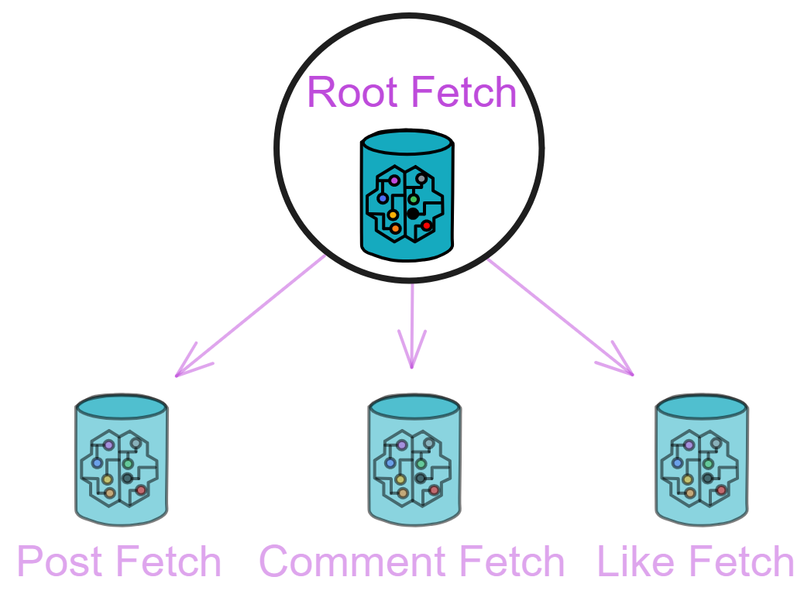
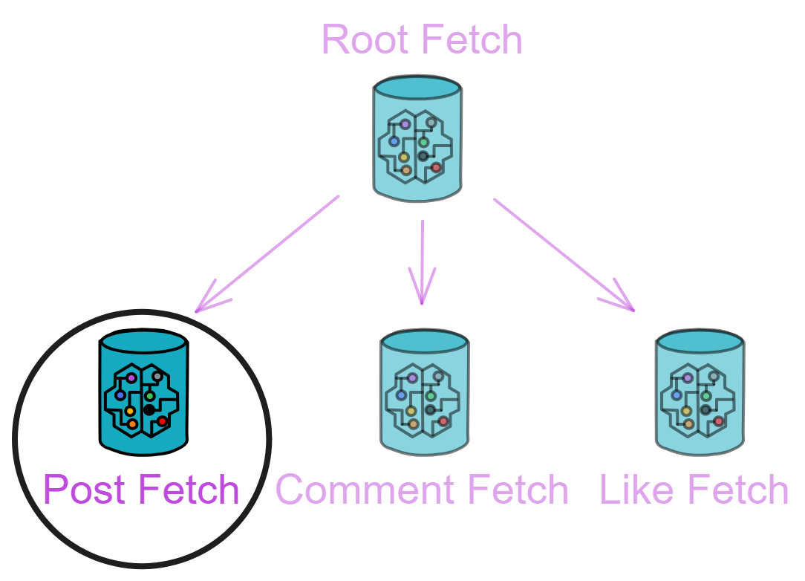

## Fetch

Fetch 模块负责通知相关用户。总共有 4 种 Canister ：

<div class="center-image">

</div>

Root Fetch Canister 的功能相对比较简单，它负责创建和管理所有种类的 Fetch Canister 。

Post Fetch Canister 负责通知粉丝更新帖子。Comment Fetch Canister 和 Like Fetch Canister 负责推送评论和点赞的通知。

因为这个模块里的代码重复度较高，我们只详细讲 Root Fetch Canister 、Post Fetch Canister 和 Like Fetch Canister 的代码。

<br>

### rootFetch.mo

<div class="center-image">

</div>

首先还是定义好类型、变量。

```js
actor class RootFetch(
    userCanister: Principal,
) = this {

    type RootFeedActor = Types.RootFeedActor;
    type PostFetchActor = Types.PostFetchActor;
    type CommentFetchActor = Types.CommentFetchActor;
    type LikeFetchActor = Types.LikeFetchActor;

    stable let T_CYCLES = 1_000_000_000_000;
    stable var rootFeedCanister = Principal.fromText("2vxsx-fae");
    stable var postFetchCanisterIndex: Nat = 0;
    stable var commentFetchCanisterIndex: Nat = 0;
    stable var likeFetchCanisterIndex: Nat = 0;

    // 创建三个TrieMap，分别存储帖子、评论和点赞
    // 这样可以方便地管理和检索相关数据，例如查找某个帖子的评论或点赞信息
    
    // 它的类型是一个元组数组，每个元组包含一个自然数（Nat）和一个Principal
    stable var postFetchMapEntries: [(Nat, Principal)] = [];
    // 从postFetchMapEntries数组的值中构建Map，使用Nat.equal处理键的相等性，使用Hash.hash进行哈希
    let postFetchMap = TrieMap.fromEntries<Nat, Principal>(postFetchMapEntries.vals(), Nat.equal, Hash.hash);

    stable var commentFetchMapEntries: [(Nat, Principal)] = [];
    let commentFetchMap = TrieMap.fromEntries<Nat, Principal>(commentFetchMapEntries.vals(), Nat.equal, Hash.hash);
    
    stable var likeFetchMapEntries: [(Nat, Principal)] = [];
    let likeFetchMap = TrieMap.fromEntries<Nat, Principal>(likeFetchMapEntries.vals(), Nat.equal, Hash.hash);    
};
```

<br>

我们通过初始化函数在创建 Root Fetch Canister 之后创建子 Canister ，建立了用户 Feed 、帖子、评论和点赞之间的联系。

```js
public shared({caller}) func init(
    _rootFeedCanister: Principal,
    _initPostFetchCanister: Principal,
    _initCommentFetchCanister: Principal,
    _initLikeFetchCanister: Principal
): async () {
    rootFeedCanister := _rootFeedCanister;

    // 定义三个map存储不同类型的 fetch canister
    postFetchMap.put(postFetchCanisterIndex, _initPostFetchCanister);
    commentFetchMap.put(commentFetchCanisterIndex, _initCommentFetchCanister);
    likeFetchMap.put(likeFetchCanisterIndex, _initLikeFetchCanister);

    // 还定义了三个索引变量，用于为每个 fetch canister 生成一个唯一的索引
    postFetchCanisterIndex += 1;
    commentFetchCanisterIndex += 1;
    likeFetchCanisterIndex += 1;

    // 用actor函数创建四个actor对象
    let rootFeedActor: RootFeedActor = actor(Principal.toText(_rootFeedCanister));
    let _postFetchActor: PostFetchActor = actor(Principal.toText(_initPostFetchCanister));
    let _commentFetchActor: CommentFetchActor = actor(Principal.toText(_initCommentFetchCanister));
    let _likeFetchActor: LikeFetchActor = actor(Principal.toText(_initLikeFetchCanister));
    let _allUserFeedCanister = await rootFeedActor.getAllUserFeedCanister();

    // 调用三个Fetch的initUserToFeed方法，传入用户 feed canister 列表，在这些Fetch里初始化用户和feed的关系
    // 用assert确认三个initUserToFeed调用都成功执行
    assert(await _postFetchActor.initUserToFeed(_allUserFeedCanister));
    assert(await _commentFetchActor.initUserToFeed(_allUserFeedCanister));
    assert(await _likeFetchActor.initUserToFeed(_allUserFeedCanister));
};
```

<br>

接下来是创建 Post Fetch Canister 的函数：

创建一个新 Post Fetch Canister ，并将新创建的 Canister ID 存储在 Map 中。它还与 Root Feed Canister 进行一些交互。

```js
public shared({caller}) func createPostFetchCanister(): async Principal {
    // 给每个Canister添加 4T Cycles
    Cycles.add(4 * T_CYCLES);
    // 调用PostFetch模块的构造函数来创建一个新的 PostFetch Canister
    let _canister = await PostFetch.PostFetch();
    // 获取新创建的 Canister id
    let _canisterId = Principal.fromActor(_canister);
    // 将新Canister的Principal放入postFetchMap中
    postFetchMap.put(postFetchCanisterIndex, _canisterId);
    // 索引+1
    postFetchCanisterIndex += 1;

    // postFetch : initUserToFeed
    // 使用assert检查rootFeedCanister是否不是匿名
    assert(not Principal.isAnonymous(rootFeedCanister));
    // 通过Principal.toText将rootFeedCanister转换为文本，然后用actor关键字创建RootFeedActor
    let rootFeedActor: RootFeedActor = actor(Principal.toText(rootFeedCanister));
    // 使用assert检查并确保调用_canister的initUserToFeed方法，并传递所有用户 Feed Canister 的Principal列表
    assert(await _canister.initUserToFeed((await rootFeedActor.getAllUserFeedCanister())));

    // 返回新创建的 Canister id
    _canisterId
};
```

<br>

创建负责通知评论和点赞的 Fetch Canister ，基本和上面创建 Post Fetch Canister 一样：

```js
public shared({caller}) func createCommentFetchCanister(): async Principal {
    Cycles.add(4 * T_CYCLES);
    let _canister = await CommentFetch.CommentFetch(
        userCanister
    );
    let _canisterId = Principal.fromActor(_canister);
    commentFetchMap.put(commentFetchCanisterIndex, _canisterId);
    commentFetchCanisterIndex += 1;

    // initUserToFeed
    assert(not Principal.isAnonymous(rootFeedCanister));
    let rootFeedActor: RootFeedActor = actor(Principal.toText(rootFeedCanister));
    assert(await _canister.initUserToFeed((await rootFeedActor.getAllUserFeedCanister())));

    _canisterId
};

public shared({caller}) func createLikeFetchCanister(): async Principal {
    Cycles.add(4 * T_CYCLES);
    let _canister = await LikeFetch.LikeFetch(
        userCanister
    );
    let _canisterId = Principal.fromActor(_canister);
    likeFetchMap.put(likeFetchCanisterIndex, _canisterId);
    likeFetchCanisterIndex += 1;

    // initUserToFeed
    assert(not Principal.isAnonymous(rootFeedCanister));
    let rootFeedActor: RootFeedActor = actor(Principal.toText(rootFeedCanister));
    assert(await _canister.initUserToFeed((await rootFeedActor.getAllUserFeedCanister())));

    _canisterId
};
```

<br>

最后我们写出查询函数，查询各种 Fetch Canister 。

```js
public query func getAllPostFetchCanister(): async [Principal] {
    // 获取Map中所有 Canister id
    Iter.toArray(postFetchMap.vals())
    // Iter.toArray是一个将迭代器转换为数组的函数，它将Map中所有的 Canister id 转换成一个数组
};

public query func getAllCommentFetchCanister(): async [Principal] {
    Iter.toArray(commentFetchMap.vals())
};

public query func getAllLikeFetchCanister(): async [Principal] {
    Iter.toArray(likeFetchMap.vals())
};
```

<br>

### postFetch.mo

Post Fetch 负责把用户的帖子通知给他的粉丝。

<div class="center-image">

</div>

记录哪些帖子需要通知给哪些用户，依次通知他们。用 `TrieMap` 快速查找和更新数据，用 `Timer` 来周期性执行任务。

```js
import Types "./types";
import TrieMap "mo:base/TrieMap";
import Principal "mo:base/Principal";
import Array "mo:base/Array";
import Timer "mo:base/Timer";
import Debug "mo:base/Debug";
import Iter "mo:base/Iter";

actor class PostFetch() = this {

    // 内部维护一个通知表：记录每个用户待通知的帖子ID有哪些
    // 定义notifyMapEntries元组数组，每个元组包含一个Principal和一个文本数组[Text]
    // stable关键字确保了即使在合约升级的情况下，这个变量的数据也会被保存下来
    stable var notifyMapEntries: [(Principal, [Text])] = [];
    let notifyMap = TrieMap.fromEntries<Principal, [Text]>(notifyMapEntries.vals(), Principal.equal, Principal.hash);

    // 接收通知函数：帖子ID、发帖人、转发人、followers、Cycles
    // 当receiveNotify被调用时，它接收一个Principal数组和一个帖子ID
    public shared({caller}) func receiveNotify(to: [Principal], postId: Text): async () {
        for(_user in to.vals()) {
            Debug.print(
                "Canister PostFetch, Func receiveNotify, "
                # "to : " # Principal.toText(_user) # " ,"
                # "postId : " # postId
            );
        };
        // 每个Principal代表一个用户，函数遍历数组中的每个用户，并检查notifyMap中有没有用户的记录
        for(_follower in to.vals()) {
            switch(notifyMap.get(_follower)) {
                case(null) {
                    // 如果没有，就新建一个，只包含当前帖子ID
                    notifyMap.put(_follower, [postId]);
                };
                // 如果有，就将当前的帖子ID追加到这个用户的帖子ID数组中
                case(?_postIdArray) {
                    notifyMap.put(_follower, Array.append(_postIdArray, [postId]));
                };
            };
        };
    };

    // 提供一种查询notifyMap当前状态的方式，将TrieMap的entries转换为数组形式并返回
    public query func getNotifyMapEntries(): async [(Principal, [Text])] {
        Iter.toArray(notifyMap.entries())
    };

// userToFeed

    // 用户关系的管理
    // 定义了一个新TrieMap，保存每个用户的 principal id 和他们的 Feed Canister id 之间的关系
    stable var userToFeedEntries: [(Principal, Principal)] = [];
    var userToFeed = TrieMap.fromEntries<Principal, Principal>(userToFeedEntries.vals(), Principal.equal, Principal.hash);
    
    // 初始化userToFeed
    public shared({caller}) func initUserToFeed(_userToFeedArray: [(Principal, Principal)]): async Bool {
        userToFeed := TrieMap.fromEntries(
            _userToFeedArray.vals(),
            Principal.equal,
            Principal.hash
        );
        true
    };

    // 添加新关系
    public shared({caller}) func addUserToFeedEntry(entry: (Principal, Principal)): async Bool {
        switch(userToFeed.get(entry.0)) {
            case(?_feedCanister) { return false; };
            case(null) {
                userToFeed.put(entry.0, entry.1);
                true
            } 
        }
    };

    // 查询现有的哈希表
    public query func getUserToFeedEntries(): async [(Principal, Principal)] {
        Iter.toArray(userToFeed.entries())
    };

    public query({caller}) func whoami(): async Principal { caller };

// Timer

    type FeedActor = Types.FeedActor;

    // 根据算法用 ignore call 分批次通知followers的Feed
    // 定时器触发的回调函数
    func notify(): async () {
        // Debug.print("postFetch notify !");
        let _notifyMap = notifyMap;
        // 检查notifyMap中的每个条目，对于每个用户
        for((_user, _postIdArray) in _notifyMap.entries()) {
            // 尝试从userToFeed中获取对应的 Feed canister
            switch(userToFeed.get(_user)) {
                case(null) { };
                // 如果找到了 Feed canister，就会创建通知
                // 并调用batchReceiveFeed函数来传递所有待通知的帖子ID
                case(?_feedId) {
                    // Debug.print("Notify feed canister " # Principal.toText(_feedId));
                    let feedActor: FeedActor = actor(Principal.toText(_feedId));
                    ignore feedActor.batchReceiveFeed(_postIdArray);
                    // 从notifyMap中删除该用户的条目，以避免重复通知
                    notifyMap.delete(_user);
                };
            };
        };
    };

    // 定义一个定时器cycleTimer，它定期（每2秒）调用notify函数
    // notify函数的目的是通知用户他们的Feed有更新
    let cycleTimer = Timer.recurringTimer(
        #seconds(2),
        notify
    );

    // 系统函数，前面说过，这里就不赘述了
    system func preupgrade() {
        notifyMapEntries := Iter.toArray(notifyMap.entries());
        userToFeedEntries := Iter.toArray(userToFeed.entries());
    };

    system func postupgrade() {
        notifyMapEntries := [];
        userToFeedEntries := [];
    };
};
```

<br>

### likeFetch.mo

Like Fetch Canister 和 Post Fetch Canister 很像，只有一个流程上的区别。Like Fetch Canister 会根据帖子的主人查询粉丝，然后通知粉丝们，而 Post Fetch Canister 只负责根据发帖人直接发的粉丝名单通知。

```js
import Principal "mo:base/Principal";
import TrieMap "mo:base/TrieMap";
import Types "./types";
import Array "mo:base/Array";
import Timer "mo:base/Timer";
import Iter "mo:base/Iter";
import Debug "mo:base/Debug";

actor class LikeFetch(
    userCanister: Principal
) = this {

    // 定义类型别名
    type UserActor = Types.UserActor;
    type PostImmutable = Types.PostImmutable;
    type Repost = Types.Repost;

    // 使用一个稳定的变量notifyMapEntries来存储通知（Principal和一组Text的元组）
    // 初始化一个TrieMap作为实际的通知Map
    stable var notifyMapEntries: [(Principal, [Text])] = [];
    let notifyMap = TrieMap.fromEntries<Principal, [Text]>(notifyMapEntries.vals(), Principal.equal, Principal.hash);
    
    // 接收帖子的通知
    // 首先从用户的actor里获取帖子主人的粉丝列表，然后调用_storeNotify函数来为粉丝和转发者存储通知
    public shared({caller}) func receiveNotify(post: PostImmutable): async () {
        // 查到这个帖子的主用户的followers
        let userActor: UserActor = actor(Principal.toText(userCanister));
        let postUserFollowers = await userActor.getFollowersList(post.user);

        // 通知粉丝
        _storeNotify(postUserFollowers, post.postId);

        // 通知转发帖子的人
        _storeNotify(
            Array.map<Repost, Principal>(
                post.repost,
                func (x: Repost): Principal {
                    x.user
                }
            ), 
            post.postId
        );
    };

    public shared({caller}) func receiveRepostUserNotify(to: [Principal], postId: Text): async () {
        _storeNotify(to, postId);
    };

    public query func getNotifyMapEntries(): async [(Principal, [Text])] {
        Iter.toArray(notifyMap.entries())
    };

    // 存储通知
    // 它检查指定的Principal是否已经有通知列表
    // 如果没有则创建一个新的列表并添加帖子ID，如果有则在现有的列表中添加帖子ID
    private func _storeNotify(to: [Principal], postId: Text) {
        for(_follower in to.vals()) {
            switch(notifyMap.get(_follower)) {
                case(null) {
                    notifyMap.put(_follower, [postId]);
                };
                case(?_postIdArray) {
                    let _newPostIdArray = Array.append(_postIdArray, [postId]);
                    notifyMap.put(_follower, _newPostIdArray);
                };
            };
        };
    };
// userToFeed

    stable var userToFeedEntries: [(Principal, Principal)] = [];
    var userToFeed = TrieMap.fromEntries<Principal, Principal>(userToFeedEntries.vals(), Principal.equal, Principal.hash);

    public shared({caller}) func initUserToFeed(_userToFeedArray: [(Principal, Principal)]): async Bool {
        userToFeed := TrieMap.fromEntries(
            _userToFeedArray.vals(),
            Principal.equal,
            Principal.hash
        );
        true
    };

    public shared({caller}) func addUserToFeedEntry(entry: (Principal, Principal)): async Bool {
        switch(userToFeed.get(entry.0)) {
            case(?_feedCanister) { return false; };
            case(null) {
                userToFeed.put(entry.0, entry.1);
                true
            } 
        }
    };

    public query func getUserToFeedEntries(): async [(Principal, Principal)] {
        Iter.toArray(userToFeed.entries())
    };
    
    public query({caller}) func whoami(): async Principal { caller };

// Timer

    type FeedActor = Types.FeedActor;

    func notify(): async () {
        // Debug.print("likeFetch notify !");
        let _notifyMap = notifyMap; 
        for((_user, _postIdArray) in _notifyMap.entries()) {
            switch(userToFeed.get(_user)) {
                case(null) { };
                case(?_feedId) {
                    let feedActor: FeedActor = actor(Principal.toText(_feedId));
                    ignore feedActor.batchReceiveLike(_postIdArray);
                    notifyMap.delete(_user);
                };
            };
        };
    };

    let cycleTimer = Timer.recurringTimer(
        #seconds(2),
        notify
    );

    system func preupgrade() {
        notifyMapEntries := Iter.toArray(notifyMap.entries());
        userToFeedEntries := Iter.toArray(userToFeed.entries());
    };

    system func postupgrade() {
        notifyMapEntries := [];
        userToFeedEntries := [];
    };

};
```

<br>

### commentFetch.mo

Comment Fetch Canister 和 Like Fetch Canister 是一样的，所以就不重复讲了。

以下是 commentFetch.mo 源文件：

```js
import Principal "mo:base/Principal";
import TrieMap "mo:base/TrieMap";
import Types "./types";
import Array "mo:base/Array";
import Timer "mo:base/Timer";
import Iter "mo:base/Iter";
import Debug "mo:base/Debug";

actor class CommentFetch(
    userCanister: Principal
) = this {
    
    type UserActor = Types.UserActor;
    type PostImmutable = Types.PostImmutable;
    type Repost = Types.Repost;

    // 一个列表，其中每个元素都是一个元组，包含一个Principal和一个文本字符串的数组
    // 这个列表被用来初始化notifyMap，后者是一个TrieMap结构，用来高效地存储和检索键值对
    stable var notifyMapEntries: [(Principal, [Text])] = [];
    let notifyMap = TrieMap.fromEntries<Principal, [Text]>(notifyMapEntries.vals(), Principal.equal, Principal.hash);
    
    public shared({caller}) func receiveNotify(post: PostImmutable): async () {
        // 查到这个帖子的主用户的 followers
        let userActor: UserActor = actor(Principal.toText(userCanister));
        let postUserFollowers = await userActor.getFollowersList(post.user);

        // 通知粉丝
        _storeNotify(postUserFollowers, post.postId);

        // 通知转帖者
        _storeNotify(
            Array.map<Repost, Principal>(
                post.repost,
                func (x: Repost): Principal {
                    x.user
                }
            ), 
            post.postId
        );
    };

    public shared({caller}) func receiveRepostUserNotify(to: [Principal], postId: Text): async () {
        _storeNotify(to, postId);
    };

    private func _storeNotify(to: [Principal], postId: Text) {
        for(_follower in to.vals()) {
            switch(notifyMap.get(_follower)) {
                case(null) {
                    notifyMap.put(_follower, [postId]);
                };
                case(?_postIdArray) {
                    notifyMap.put(_follower, Array.append(_postIdArray, [postId]));
                };
            };
        };
    };

    public query func getNotifyMapEntries(): async [(Principal, [Text])] {
        Iter.toArray(notifyMap.entries())
    };

// userToFeed

    stable var userToFeedEntries: [(Principal, Principal)] = [];
    var userToFeed = TrieMap.fromEntries<Principal, Principal>(userToFeedEntries.vals(), Principal.equal, Principal.hash);

    public shared({caller}) func initUserToFeed(_userToFeedArray: [(Principal, Principal)]): async Bool {
        userToFeed := TrieMap.fromEntries(
            _userToFeedArray.vals(),
            Principal.equal,
            Principal.hash
        );
        true
    };

    public shared({caller}) func addUserToFeedEntry(entry: (Principal, Principal)): async Bool {
        switch(userToFeed.get(entry.0)) {
            case(?_feedCanister) { return false; };
            case(null) {
                userToFeed.put(entry.0, entry.1);
                true
            } 
        }
    };

    public query func getUserToFeedEntries(): async [(Principal, Principal)] {
        Iter.toArray(userToFeed.entries())
    };
    
    public query({caller}) func whoami(): async Principal { caller };

// Timer

    type FeedActor = Types.FeedActor;

    func notify(): async () {
        // Debug.print("commentFetch notify !");
        let _notifyMap = notifyMap; 
        for((_user, _postIdArray) in _notifyMap.entries()) {
            switch(userToFeed.get(_user)) {
                case(null) { };
                case(?_feedId) {
                    // Debug.print("commentFetch Notify feed canister " # Principal.toText(_feedId));
                    let feedActor: FeedActor = actor(Principal.toText(_feedId));
                    ignore feedActor.batchReceiveComment(_postIdArray);
                    notifyMap.delete(_user);
                };
            };
        };
    };

    let cycleTimer = Timer.recurringTimer(
        #seconds(2),
        notify
    );

    system func preupgrade() {
        notifyMapEntries := Iter.toArray(notifyMap.entries());
        userToFeedEntries := Iter.toArray(userToFeed.entries());
    };

    system func postupgrade() {
        notifyMapEntries := [];
        userToFeedEntries := [];
    };
}; 
```
