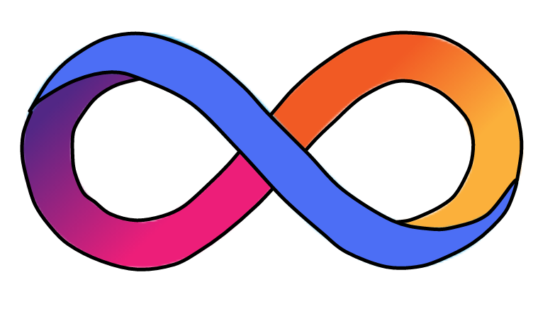
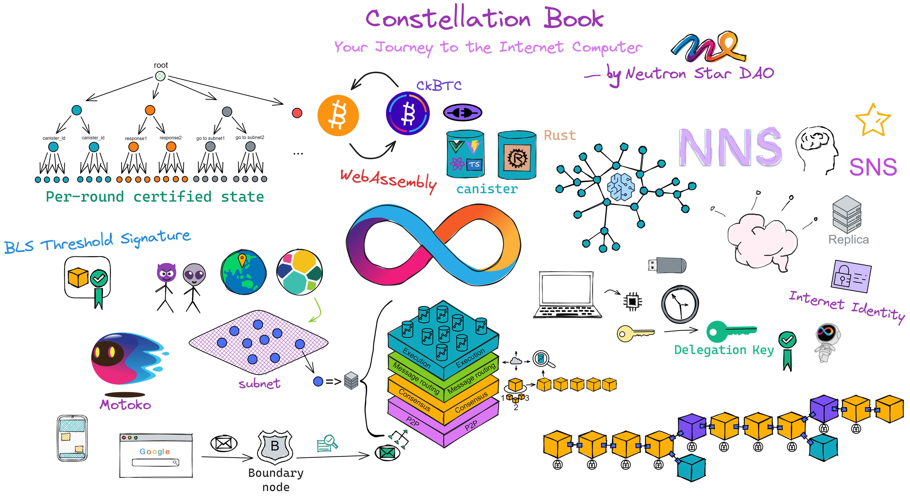
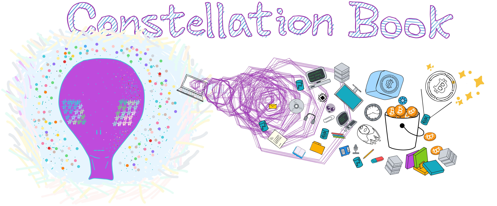

    <h1 class="home-h1">👽互联网计算机漫游指南🛸</h1>

(｡･∀･)ﾉﾞ嗨！欢迎登录中子星~🫡 来了就是中子星人！🎉 

1️⃣如果你还不了解 区块链、比特币、IC ，没关系。听我向你[娓娓道来](/0.去中心化之旅/区块链是啥？.md)加密发展史！

2️⃣如果你只听说过 IC ，还没有详细了解 IC ，那你来对地方啦，在[这里](1.了解IC/1.了解IC.md)了解更多相关信息！

3️⃣想知道关于多米尼克的故事嘛？他在[这里](/0.去中心化之旅/造梦家的冒险之旅.md)！

    
1️⃣📖
            

                加密往事
            

            

                从零开始入门 web3
            

    

    
2️⃣📡
            

                快速了解
            

            

                IC 的 web3 解决方案
            

    

    
3️⃣🔍
            

                背后故事
            

            

                多米尼克的冒险之旅
            

    

    &nbsp; 2015 &nbsp;&nbsp;&nbsp;&nbsp; 2018 &nbsp;&nbsp;&nbsp; 
    &nbsp; 2021 &nbsp;&nbsp;&nbsp;&nbsp;&nbsp; 现在 
    &nbsp;&nbsp;&nbsp;&nbsp;&nbsp;&nbsp;&nbsp;&nbsp;&nbsp;&nbsp; 10 年后 
     
    —〦———〦———〦———〦—————〦———→ ∞ 💥 区块链奇点

有时候，我真的为生活在这个充满奇迹的时代而感到震撼。仅仅几年前，我们还在嘲笑比特币，而现在，去中心化金融、以太坊和加密货币已经深入人心。而在这个飞速发展的新世界中，有一堆新技术，正以其独特的方式，为我们的生活增添色彩：互联网计算机，是新一代通用计算区块链。

起源于多米尼克 2015 年的想法：一个可以横向扩展的去中心化的世界计算机。 2018 年完成了雏形。并在深度优化底层协议后，于 2021 年上线。经过几年发展，它旨在成为一个去中心化的云服务，

    
        底层做成了去中心化的云，上层应用则通过 DAO 控制权限，达到去中心化的目的。
    
    
        可以部署各种 dapp 
    

，全栈上链，无需使用其他中心化服务。

    

《互联网计算机漫游指南》的结构：

* 前半部分生动有趣，后半部分言简意赅

* 前半部分谈 IC 原理，后半部分论开发实战

### 为什么写这本书？

最初我了解 IC 后，收集整理了 IC 白皮书、Medium 、ICPL 论坛、IC Developer Forum 里的资料。给朋友讲了 IC 的架构以后，还跟她说正在整理关于 IC 资料的笔记，整理好就分享出来，没想到这一整理就是一年。在经历了天荒地老、沧海桑田、时过境迁的漫长岁月（拖延）后，加上自己后来学到的东西，终于凑出了笔记的初代版本。又经过一段时间的深入学习，我觉得把这些笔记分享出来比较好。做成一本开源书帮大家学习 IC 。也是为 IC 开发者社区做一点贡献。

零门槛学习区块链，抹平学习 IC 门槛。

### 为什么开源？

我很喜欢 Rust 开源社区，Rust 社区里有很多开源书、开源优质项目，给了我很大帮助。我从 Rust 开源社区学到了很多东西。像比特币、以太坊以及相关的项目也都有浓厚的开源氛围，我希望 IC 社区也涌现出越来越多的开源项目。供大家互相学习。

另外，IC 的内容更新迭代很快，开源大家一起贡献，内容保持新鲜不过时。

 

 

加入本书的开发者讨论群，勘误、修改、提出建议、共同为开源书贡献力量！

🌎
[OpenChat](https://oc.app/4jwox-pyaaa-aaaar-amjbq-cai/?ref=3bmc2-5aaaa-aaaaf-agfiq-cai&code=1ab38ffae620366f), [Telegram](https://t.me/neutronstardaoic), [Discord](https://discord.gg/5Y8QPHvR), [Github](https://github.com/NeutronStarDAO/ConstellationBook-Chinese) 

