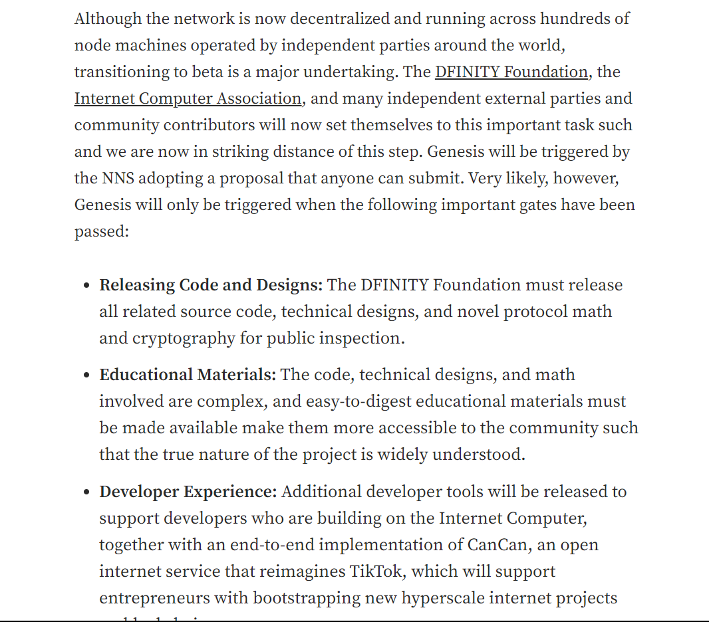

## ToDo

阈值 ECDSA 、ckBTC 、ckETH 、BLS

ECC

SNS：https://icpleague.com/thread/517

Canister:

https://mmapped.blog/posts/02-ic-state-machine-replication

https://mmapped.blog/posts/06-ic-orthogonal-persistence

https://mirror.xyz/0xFd007bb46C47D8600C139E34Df9DfceC86F0B319/iSQR3xzfXxOYERG5b2pUUiQvsgirEwBuEOJ649hvdio

https://wiki.internetcomputer.org/wiki/HTTPS_outcalls

https://forum.dfinity.org/t/inter-canister-query-calls-community-consideration/6754

https://www.bilibili.com/video/BV1W5411X7vR/?share_source=copy_web&vd_source=cf43649c5203a92adc13130666d07105&t=316

https://www.bilibili.com/video/BV14Z4y1m7VB/?vd_source=db5bf130bc81934e0880088323df6748

NNS:

https://wiki.internetcomputer.org/wiki/New_Subnet_Creation

【社区讨论会-关于SNS的解答、反馈、https://www.bilibili.com/video/BV1E3411f7Ev/?share_source=copy_web&vd_source=cf43649c5203a92adc13130666d07105&t=869

## 项目定位

**Influencer campaign** 

确保零基础开发者能从头到尾读完，了解 IC 的基本框架。并在不影响小白的基础上增加（持续更新）更深入的内容和研究，给想深入了解的人看。

所以从结构设计上来讲，我们提供了能让普通开发者完整读下来的流程，全程没有任何烧脑环节，通俗易懂。

绿色代表传递，黄色代表诚实，紫色代表八卦，青色代表果断。

全书使用中子星开放协议，存入 IC 、Arweave 、IPFS 。完全免费向全世界所有人开放。

每个章节的末尾都有衔接到下一章的过渡，引出下一章。

文章里得有真正的干货，能让读者学到东西。不能太水。

严格控制一个屏幕（1920x1080）内所显示的信息密度。

在末尾放阅读提示，告诉读者文章结构。让读者回去重新看，回味一遍并看藏在里面的文章。

我认为想让读者学一个东西，那得先吸引住他，然后慢慢过渡到干货，让读者的大脑轻松接受知识，使读者专注于阅读。所以我的文章都很长，就像看小说一样。

还有就是有很多名词还没有中文翻译，咱们叫什么，以后看书的人就叫什么，要么就只能叫英语原文。

文字 → 配图 → 优化

## 注意

发布上线先注意：

在本地文档保存超清大图或者 excalidrawlib 源文件，在线版文档压缩一下用标清图。**写完之后记得压缩图片！**

整理图片文件夹，清空多余图片。

波澜壮阔的大牛市

整理笔记：

https://www.bilibili.com/video/BV1yr4y1t7h5/?vd_source=db5bf130bc81934e0880088323df6748

https://www.bilibili.com/video/BV1Ev411N7Ut/?spm_id_from=333.788.recommend_more_video.5&vd_source=db5bf130bc81934e0880088323df6748

https://zhuanlan.zhihu.com/p/591381361

https://zhuanlan.zhihu.com/p/535469343

https://www.bilibili.com/video/BV1Cy4y1V7K3/?vd_source=db5bf130bc81934e0880088323df6748

https://mp.weixin.qq.com/s/heoHOq5kBo6wygUtnS6sPA

https://mp.weixin.qq.com/s/mtpUympekLcCQRddylJzSw

https://blog.suningyao.com/docs/Blockchain/thoughts/

https://www.bilibili.com/video/BV1Fi4y1K74L/?vd_source=db5bf130bc81934e0880088323df6748

源码分析：https://github.com/dfinity-side-projects/random-beacon

待优化：

共识：一旦发现故障节点，就不带他玩，重新分配密钥，NNS 把故障节点踢出去。

了解IC：网络神经系统 (NNS)

NNS是IC的链上治理系统。[互联网计算机 ICP 实用代币的持有者可以将其 ICP 代币抵押在神经元中，以参与治理并为决策做出贡献，例如投票决定是否应将新的节点集合（也称为子网）添加到网络中。网络 35](https://medium.com/dfinity/the-network-nervous-system-governing-the-internet-computer-1d176605d66a)。它有很多功能，但与节点去中心化最相关的是：

* 最大化节点提供和控制的去中心化。
* 确定满足 IC 计算/存储需求所需的节点数量，同时控制通货膨胀（不要铸造太多 ICP 来支付节点提供商奖励）。
* 为开发人员设置计算和存储操作的成本。
* 从 IC 中移除故障或缓慢的节点。
* 升级网络中运行的副本软件。

如果要与以太坊进行对比，Cycle 就相当于以太坊的 ETH 。而 ICP 则是一种特殊类型的 ERC20 代币。

Cycle 是嵌入系统中的本地货币。而 ICP 更像是在系统之上构建的一种特权应用程序。

从这个角度来看，事情变得更容易理解。cycles 是整个系统运行所必需的gas，而icp是部署在 nns 里的 canister token 账本，在应用层。

简而言之：应用 canister 受子网级别的速率限制保护。超过子网级别默认的速率限制必须由 canister 自己完成。我们正在考虑为 canister 提供所有必要的信息，以便在本地进行这些速率限制决策。

边界节点基础设施负责在子网级别对互联网计算机的请求进行速率限制。边界节点对 canister 具体情况一无所知，并以一般意义上的方式施加速率限制（合理的默认值）。这些默认值会随着平台的成熟度和/或在受限制条件下，如 DDoS 攻击时而发生变化。目前的默认值为：

每个子网/每个边界节点

每秒 500 次查询 每秒 50 次更新 每个 IP 每秒 100 次请求（不考虑请求类型） 如果我们有 N 个边界节点，则子网所见的查询/更新的总上限为 500 * N 和 50 * N 每秒。

问：互联网身份（II）如何处理 DDoS 攻击？

II 曾经面临垃圾邮件攻击。为了阻止这种垃圾邮件，特别为 II canister 设置了额外的速率限制，每 IP 每分钟只允许 1 个 II 创建请求。这仅仅是因为我们了解了 II 的工作原理，从而有助于解码 CBOR 并应用速率限制。

请注意，II 类似的特殊处理不能扩展到一般的 canister。很可能在未来会放宽边界速率限制。

**无限缩放**

互联网计算机(IC)可以通过添加更多节点来为新子网提供服务,从而无限地扩大其容量。节点是通过网络神经系统(NNS)添加的,自创世以来,几乎每周都会形成新的子网。相比之下,大多数其他区块链在协议中固定了交易限制(例如,向比特币添加更多服务器不会增加吞吐量),并需要麻烦的层来解决扩展问题。

**子网架构**

互联网计算机的可扩展性得益于将 canister 和它们的状态分片到子网中。每个子网运行自己的状态机复制实例,因此可以独立于其他子网处理更新和查询调用。尽管独立运行,不同子网上的 canister 之间仍然可以通过发送消息进行通信。

因此,通过向互联网计算机添加更多节点,就可以实现扩展。

* 如果将新节点添加为新的子网络,由于新子网络可以独立于系统的其余部分处理更新调用,因此每单位时间可以执行更多更新调用。
* 如果将新节点添加到现有子网络,则可以每单位时间执行更多查询。这是因为与更新调用不同,查询调用是在单个机器上执行的,而不是像更新调用那样在子网的所有节点上复制。

然而,共识层的最终确认率以及每秒更新调用次数可能会受到子网中节点数量增多的负面影响。这是因为在就输入消息的顺序达成共识之前,需要在更多节点之间交换更多数据。

此外,拥有更多子网趋向于降低局部性:需要跨子网通信的概率增加。

因此,IC还必须通过提高单个IC节点机器上的性能来实现扩展。例如,扩展IC运行时以有效利用CPU和内存等资源,并实现独立canister调用的高度并发执行。

> Can you explain this attack in more detail, or provide some external reading? I don’t understand how the finalization could occur here with only f+1 parties and a network attack, since I thought 2/3 (2f+1) are absolutely required to finalize anything. Would love to understand better, thanks.

Of course! Let me start with a quick recap: So replicas in our consensus protocol create notarization shares to indicate valid blocks. They might create notarization shares for different blocks at one height. When they see a full notarization (which consists of 2f+1 notarization shares), they move on to the next round. If there exists only 1 notarization in a round, that means we have agreement (because chains must consist of fully notarized blocks at every height). To help identify this, notaries also create a finalization share on a block b at the end of the round if they did not create a notarization share on any block at that height other b. If a block b collects 2f+1 finalization shares, we consider it finalized, and replicas trust that this is the agreed-upon blockchain.

This is safe on a subnet of size n = 3f+1 when at most f nodes are corrupt, meaning that a finalization on block b means that no other notarized block b’ at that height can exist. That is because if we have 2f+1 finalization shares, that means those nodes say they did not notary-sign any other block at that height. f of those may be corrupt, so they might have lied, but it means at least f+1 nodes are honest and really did not create notarization shares for other blocks at that height. Since we only have 3f+1 replicas, and we know that f+1 did not create notarization shares for any other block b’ at that height, it only leaves 2f nodes that could have possibly created notarization shares on b’, but this is less than the threshold 2f+1, concluding the proof.

Now the attack: suppose the attacker controls more than f (say f+1) corrupt replicas, and additionally has full control over the network. For simplicity, let’s look at a 4 node subnet consisting of nodes A, B, C, and D, and the adversary controls 2 nodes (which is f+1, more than 1/3rd). The notarization/finalization threshold is 3 for a 4 node subnet. Let’s say A and B are the corrupt nodes. The attacker can make sure there are two valid blocks at height h, b1 and b2. It makes sure that replica C only receives block b1, and replica D only receives block b2 (using the fact that it fully controls the network). C will create a notarization share for b1, and D for b2. Using its control over replicas A and B, the attacker can complete both notarizations for b1 and b2, and show the full notarization on b1 to C and the full notarization on b2 to D. C will now create a finalization share on b1 (since it only created a notarization share on that block), and similarly D will create a finalization share on b2. Now again using A and B, the attacker can complete two finalizations on b1 and b2. This completes the attack: C thinks that block b1 is final, while D thinks b2 is final, and they are conflicting blocks.

So this shows that an attacker having more controlling more than f out of 3f+1 nodes is problematic. You cannot just sign arbitrary blocks, but we cannot guarantee agreement anymore.

lastmjs:

> Also, to add more to why I don’t understand the danger here, I thought that the Internet Computer had mechanisms in place to detect when 2f+1 parties are not able to come to agreement, and that the subnet would then “freeze” in this case, until the malicious nodes can be identified and removed. Is that not the case? How capable is the system at detecting when BFT guarantees are being broken, and what are the mitigations the protocol provides?

As demonstrated by the attack above, if f+1 nodes are actively malicious and the adversary can control the network, then we immediately have a problem. If f+1 nodes are faulty in the sense that they are offline but not actively malicious, then the subnet would be stuck, but the NNS can replace nodes in the subnet.

多米尼克在 2021 年写的关于未来的工作方向：Edu

大致上，IC是一个与**复制状态机(replicated state machines)**交互的网络。复制状态机在分布式系统 Sch90 中是一个相当标准的概念，但是我们在这里仍然简单介绍下，从*状态机*的概念开始。

**状态机**是一种特定的计算模型。此类机器维护着一个**状态**，即对应普通计算机中的主内存或是其他形式的数据存储。此类机器按离散的**轮次**进行执行：每一轮中，它接受一个**输入**，对*输入*和*当前状态*应用一个**状态转换函数**，获得一个**输出**和一个**新的状态**。这一*新状态*将变成下一轮次的*当前状态*。

**IC**中的状态转换函数是一个**通用函数**，意味着一些存储在状态中的输入和数据可能是任意的**程序**，这些程序会作用于其他的输入和数据。因此，这样的一个状态机代表了一个通用（即图灵完备）的计算模型。

为了实现**容错性**，状态机可以被**复制**。**复制状态机**包含由**节点副本(replicas)**组成的**子网**，其中每一个节点副本运行相同状态机的副本。即使某些节点副本发生故障，子网也应当继续—并且正常运转。

子网中的每个节点副本都必须按照相同的顺序处理相同的输入。为此，子网中的节点副本必须运行**共识协议**[[Fis83\]](#[Fis83])，来确保子网中的所有节点副本按照相同的顺序处理输入。因此，每一个节点副本的内部状态将按照相同的方式随时间演变，并且每个节点副本会生成完全相同序列的输出。需要注意的是，IC上复制状态机的输入可以是由外部用户生成的输入，也可以是另一台复制状态机生成的输出。类似地，复制状态机的输出可以作为输出导向外部用户，也可以作为输入导向另一台复制状态机。

### 故障模型

在计算机科学的分布式系统领域中，通常会考虑两种类型的节点副本故障：**宕机故障**和**拜占庭故障**。**宕机故障**发生在节点副本突然停机并且无法恢复时。**拜占庭故障**是节点副本可能用任何方式偏离规定的协议。而且，在拜占庭故障下，一个或多个节点副本可能直接处于恶意对手方的操控之中，其可以操纵这些节点副本的行为。在这两种故障类型中，拜占庭故障具有更大的潜在破坏性。

共识协议和实现复制状态机的协议通常会假设**多少**节点副本可能发生故障以及发生**何种程度**的故障（宕机或拜占庭）。IC中假设一个给定的子网若有$n$个节点副本，那么发生故障的节点副本少于$n/3$，并且这些故障可能是拜占庭式。（需要注意的是，IC中的不同子网规模不同。）

### 1.4 通信模型

共识协议和执行复制状态机通常也会对**通信模型**作出假设，描述了对手方延迟节点副本间消息传递的能力。在两个对立端下，我们有如下的模型：

- 在**同步模型**中，存在已知的有限时间限制$\delta$，因此对于发送的任意消息，它会在小于$\delta$的时间内递达。
- 在**异步模型**中，对于发送的任意消息，对手方可以延迟其传递任意有限时间，因此对于传递消息没有时间限制。

由于IC子网中的节点副本通常分布在全球，同步通信模型非常不切实际。事实上，攻击者可以延迟诚实节点副本或是延迟诚实节点副本间的通信，来破坏协议的正确行为。这种攻击通常比控制和破坏诚实节点副本更容易实施。

在全球分布的子网的设定下，最可行和健壮的模型是异步模型。不幸的是，目前没有已知的共识模型在异步模型下是真正可行的（最近的异步共识协议，如[[MXC^+^16]](#[MXC16])，可以达到可观的吞吐量，但是延迟不太好）。所以同其他大多数不依赖于同步通信的实用拜占庭容错系统（例如[[CL99]](#[CL99]), [[BKM18]](#BKM18), [[YMR^+^18]](#[YMR18])）一样，IC选择了一种折衷的方案：**部分同步**通信模型[[DLS88]](#DLS88)。这样的部分同步模型可以有多种构建方式。IC使用的部分同步模型假设，大致上讲，每个子网中节点副本的通信在很短的时间间隔内是周期性同步的；此外，同步时间限制$\delta$不需要被提前知晓。建立这种部分同步假设仅仅是为了确保共识协议的进行（所谓的活性）。确保共识的正确性（所谓的安全性）并不需要这种部分同步假设，同样在IC协议栈的其他任何地方也不需要。

在部分同步和拜占庭故障的假设下，众所周知的是，我们对于故障节点数量$f<n/3$的限制是最优解。

互联网计算机（IC）实现了世界计算机的愿景，它是一个基于区块链的开放和安全的网络，可以托管以智能合约形式的程序和数据，以安全可信的方式对智能合约进行计算，并且可以无限扩展。

在互联网计算机上的智能合约被称为容器智能合约（canister smart contracts），或简称为容器（canisters），每个容器都包含一组WebAssembly（wasm）字节码和智能合约数据存储。每个容器都有自己的独立数据存储，只有在容器执行代码时才会更改。

容器托管在子网（subnets）上，这是IC的顶级架构构建模块。子网是一个独立的区块链，在全球分布式数据中心部署的节点机器（或称节点）上运行。一个子网可以安全地托管数万个容器智能合约，总计数百GB的内存。目前已有数十个子网，并将在未来增长到数千个。对于托管在子网上的每个容器，其代码和数据存储在子网中的每个节点上，并由子网中的每个节点执行其代码。这种存储和计算的复制对于实现容错是至关重要的，这样即使子网中的某些节点出现故障（无论是因为崩溃，或者更糟糕的是，被恶意方入侵），容器智能合约仍将继续执行。这种复制由核心互联网计算机协议（ICP）提供支持，它实现了一个高吞吐量、低延迟的共识机制和一个高效的WebAssembly虚拟机，并由区块链支持。

IC的多子网架构比众所周知的分片方法更强大，因为它使得不同子网上的智能合约能够无缝地相互通信，就像传统微服务架构中的服务一样，但是完全在链上。容器通过异步消息进行通信，即它们在发送消息时不会阻塞，而是在响应最终到达时处理。这种创新的容器间调用方法允许通过简单地添加更多子网来扩展IC。

核心ICP大量使用链密钥加密（chain-key cryptography），这是一套基于门限加密的先进加密协议工具箱，使IC的分布式运营具有前所未有的可扩展性。链密钥加密还包括一套复杂的技术集合，用于强大而安全地解决操作问题，例如如何处理故障节点或协议升级，我们称之为链演变技术（chain-evolution technology），例如，使节点可以轻松加入子网，而无需验证从创世区块开始的每个区块（如其他区块链）。链密钥加密工具箱中的另一个构建模块是链密钥签名（chain-key signatures），它们使容器能够使用门限加密与其他区块链互动（写入）。

仅具有可扩展和分散的技术来支持网络的运作是不够的。为了满足完全去中心化的要求，IC需要一种完全去中心化的治理方法。IC平台的治理是通过一种代币化的去中心化自治组织（DAO）来实现的，称为网络神经系统（NNS）。IC上的每个独立dapp都可以通过定制和部署基于服务神经系统（SNS）的现成代币化DAO来拥有与NNS类似的自己的治理系统。

互联网电脑是世界上第一个具有网络速度、互联网规模的公共区块链，它使得智能合约能够将交互式网络内容安全地直接提供给终端用户的浏览器。它使开发者、组织和企业家能够在公共互联网上直接构建和部署安全且自治的软件程序。DFINITY基金会多年的专注研究和开发使这一雄心勃勃的愿景成为可能，将新颖的密码学和计算机科学相结合，创建了一个区块链，提供了无限的存储和链上计算。

一个由世界顶级密码学家、研究员和工程师组成的熟练团队带头开展了这项工作，以实现去中心化并解决艰难的技术挑战。我们共同努力，将先进的概念带入现实世界，实现了影响整个计算世界的尖端技术。互联网电脑最终将大规模运行数百万个节点。链密钥密码学是实现这一目标的基本突破之一。它由一组密码协议组成，协调构成互联网电脑的节点。链密钥密码学最显著的创新之一是互联网电脑具有单一的公钥。这是一个巨大的优势，因为它允许任何设备（包括智能手表和手机）验证来自互联网电脑的工件的真实性。相比之下，在传统的区块链（如以太坊）上，仅验证一个小工件就需要大量的数据。

单一公钥只是冰山一角：链密钥密码学是驱动互联网电脑的引擎，使其运行成为可能。它允许：

1. 添加新节点以形成新子网，无限扩展网络；
2. 用新的节点替换故障或崩溃的节点，而无需停机；
3. 即使子网内有太多节点故障，也可以恢复子网；以及
4. 无缝升级互联网电脑协议，使网络能够修复漏洞并添加新功能。

互联网电脑

为了更好地理解链密钥密码学，让我们先来仔细了解一下互联网电脑。它由分布在全球各地的许多节点组成，这些节点运行互联网电脑协议（ICP）。该协议将所有这些节点连接起来，并协调在这些节点上执行容器智能合约。软件容器是由开发者部署到互联网电脑上的包含代码和状态的包。一个应用程序可以由一个容器组成，或者由于容器大小有限，由多个相互交互的容器组成。容器可以实现几乎任何内容，如网页、企业系统、DeFi用例，甚至开放的互联网服务。

当用户与部署在互联网电脑上的应用程序进行交互时，会通过ICP向容器发送消息。接下来，互联网电脑根据该消息的输入执行容器，并最终计算出用户可以查询回的输出消息。通过执行消息，容器的状态会根据其代码进行更新。

为了实现互联网电脑计算结果的健壮性和正确性，每个容器都在多个节点上运行，而不仅仅是一个节点。这是因为单个节点代表着单一故障点；一个节点可能因硬件故障、与互联网断开连接，或者更糟糕的是，故意报告不正确的结果而崩溃。因此，互联网电脑协议确保一个容器在多个节点上运行，并且这些节点同意按照什么顺序处理哪些消息，以及每次计算结果的值。这确保了结果的正确性，使网络能够抵抗各种故障，并使容器可以永远运行。

